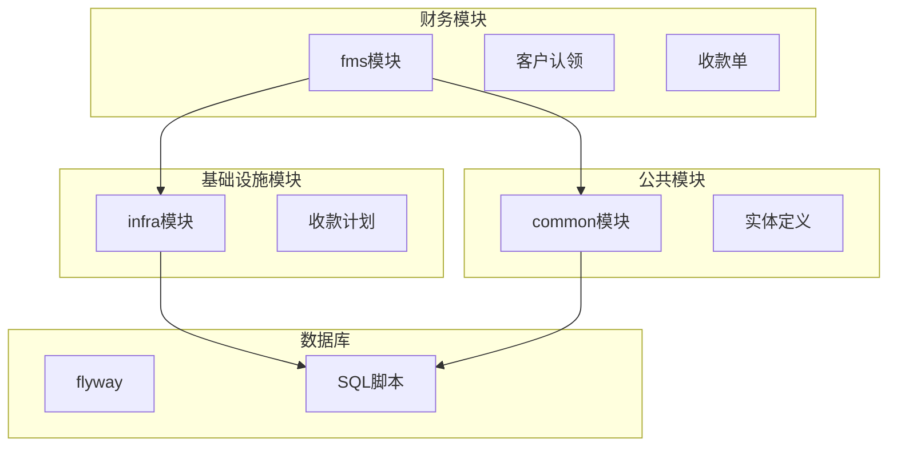
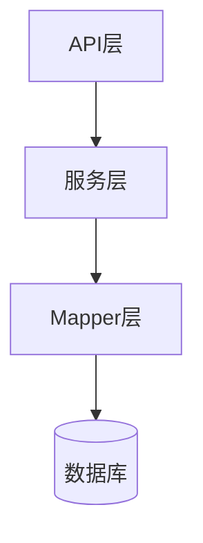
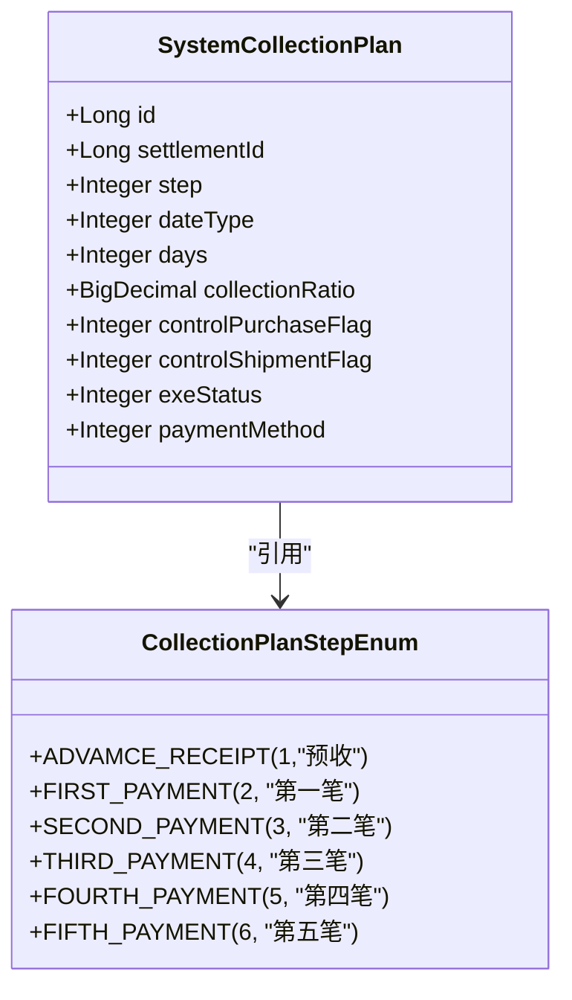
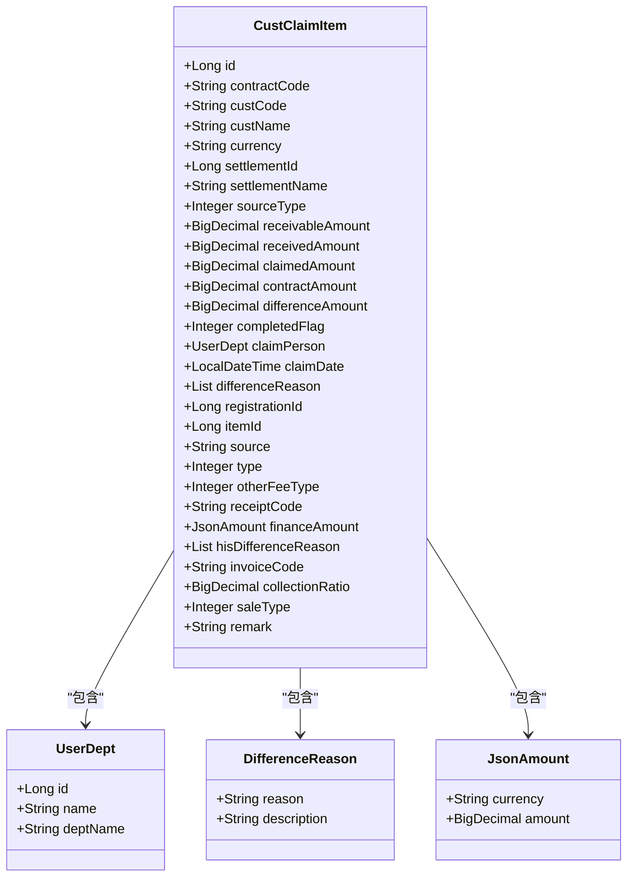
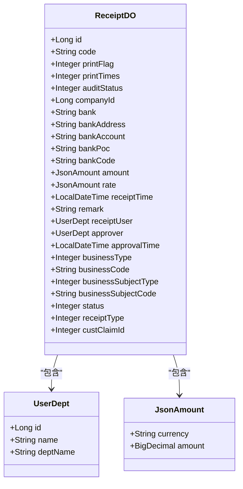
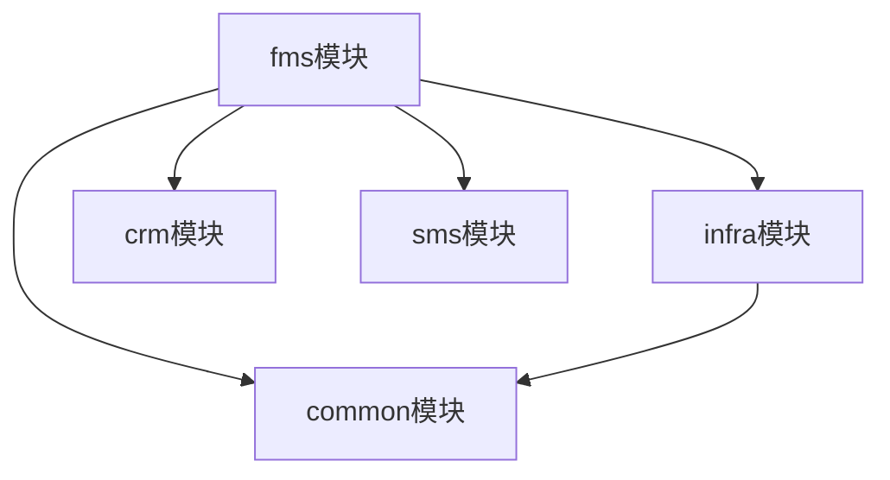

# 应收管理

<cite>
**本文档引用的文件**  
- [CollectionPlanItem.java](file://eplus-framework/eplus-common/src/main/java/com/syj/eplus/framework/common/entity/CollectionPlanItem.java)
- [CustClaimService.java](file://eplus-module-fms/eplus-module-fms-biz/src/main/java/com/syj/eplus/module/fms/service/custclaim/CustClaimService.java)
- [CustClaimServiceImpl.java](file://eplus-module-fms/eplus-module-fms-biz/src/main/java/com/syj/eplus/module/fms/service/custclaim/CustClaimServiceImpl.java)
- [CustClaimItem.java](file://eplus-module-fms/eplus-module-fms-biz/src/main/java/com/syj/eplus/module/fms/dal/dataobject/custclaim/CustClaimItem.java)
- [ReceiptDO.java](file://eplus-module-fms/eplus-module-fms-biz/src/main/java/com/syj/eplus/module/fms/dal/dataobject/receipt/ReceiptDO.java)
- [CustClaimItemMapper.java](file://eplus-module-fms/eplus-module-fms-biz/src/main/java/com/syj/eplus/module/fms/dal/mysql/custclaim/CustClaimItemMapper.java)
- [ReceiptMapper.java](file://eplus-module-fms/eplus-module-fms-biz/src/main/java/com/syj/eplus/module/fms/dal/mysql/receipt/ReceiptMapper.java)
- [SystemCollectionPlan.java](file://eplus-module-infra/eplus-module-infra-biz/src/main/java/com/syj/eplus/module/infra/dal/dataobject/collectionplan/SystemCollectionPlan.java)
- [V1_0_0_002__Eplus初始化.sql](file://eplus-flyway/src/main/resources/db/migration/common/V1_0_0_002__Eplus初始化.sql)
- [V1_0_0_013__新增客户认领明细表.sql](file://eplus-flyway/src/main/resources/db/migration/common/V1_0_0_013__新增客户认领明细表.sql)
- [CollectionPlanStepEnum.java](file://eplus-framework/eplus-common/src/main/java/com/syj/eplus/framework/common/enums/CollectionPlanStepEnum.java)
</cite>

## 目录
1. [引言](#引言)
2. [项目结构](#项目结构)
3. [核心组件](#核心组件)
4. [架构概述](#架构概述)
5. [详细组件分析](#详细组件分析)
6. [依赖分析](#依赖分析)
7. [性能考虑](#性能考虑)
8. [故障排除指南](#故障排除指南)
9. [结论](#结论)

## 引言
本文档详细描述了应收管理系统的数据模型设计，重点涵盖收款计划、客户认领、应收单据等核心实体。文档解释了应收业务流程的数据结构，包括收款计划创建、客户认领处理、应收核销等环节的数据流转。通过ER图展示了应收相关表之间的关系，并详细说明了应收数据的对账机制、逾期管理、坏账处理等关键功能的设计。文档还提供了实际的SQL建表语句和MyBatis Mapper配置示例，为开发者提供应收数据建模的最佳实践。

## 项目结构
应收管理功能主要分布在`eplus-module-fms`（财务模块）和`eplus-module-infra`（基础设施模块）中。核心数据模型定义在`eplus-framework/eplus-common`中，数据库迁移脚本位于`eplus-flyway`目录下。

**图源**
- [eplus-module-fms](file://eplus-module-fms)
- [eplus-module-infra](file://eplus-module-infra)
- [eplus-framework/eplus-common](file://eplus-framework/eplus-common)
- [eplus-flyway](file://eplus-flyway)

**章节来源**
- [eplus-module-fms](file://eplus-module-fms)
- [eplus-module-infra](file://eplus-module-infra)

## 核心组件
应收管理系统的三个核心组件是收款计划、客户认领和应收单据。收款计划定义了客户付款的时间表和金额比例；客户认领处理实际收款与应收款项的匹配；应收单据记录了具体的收款交易。

**章节来源**
- [CollectionPlanItem.java](file://eplus-framework/eplus-common/src/main/java/com/syj/eplus/framework/common/entity/CollectionPlanItem.java)
- [CustClaimService.java](file://eplus-module-fms/eplus-module-fms-biz/src/main/java/com/syj/eplus/module/fms/service/custclaim/CustClaimService.java)
- [ReceiptDO.java](file://eplus-module-fms/eplus-module-fms-biz/src/main/java/com/syj/eplus/module/fms/dal/dataobject/receipt/ReceiptDO.java)

## 架构概述
应收管理系统采用分层架构，包括数据访问层、服务层和API层。数据模型通过MyBatis映射到数据库表，服务层处理业务逻辑，API层提供接口供其他模块调用。

**图源**
- [CustClaimService.java](file://eplus-module-fms/eplus-module-fms-biz/src/main/java/com/syj/eplus/module/fms/service/custclaim/CustClaimService.java)
- [CustClaimItemMapper.java](file://eplus-module-fms/eplus-module-fms-biz/src/main/java/com/syj/eplus/module/fms/dal/mysql/custclaim/CustClaimItemMapper.java)

## 详细组件分析

### 收款计划分析
收款计划是应收管理的基础，定义了客户付款的时间表和金额比例。系统支持多种付款步骤，如预收、第一笔、第二笔等。

#### 收款计划类图

**图源**
- [SystemCollectionPlan.java](file://eplus-module-infra/eplus-module-infra-biz/src/main/java/com/syj/eplus/module/infra/dal/dataobject/collectionplan/SystemCollectionPlan.java)
- [CollectionPlanStepEnum.java](file://eplus-framework/eplus-common/src/main/java/com/syj/eplus/framework/common/enums/CollectionPlanStepEnum.java)

**章节来源**
- [SystemCollectionPlan.java](file://eplus-module-infra/eplus-module-infra-biz/src/main/java/com/syj/eplus/module/infra/dal/dataobject/collectionplan/SystemCollectionPlan.java)
- [CollectionPlanStepEnum.java](file://eplus-framework/eplus-common/src/main/java/com/syj/eplus/framework/common/enums/CollectionPlanStepEnum.java)

### 客户认领分析
客户认领处理实际收款与应收款项的匹配过程，包括认领金额、差异原因、认领员工等信息。

#### 客户认领类图

**图源**
- [CustClaimItem.java](file://eplus-module-fms/eplus-module-fms-biz/src/main/java/com/syj/eplus/module/fms/dal/dataobject/custclaim/CustClaimItem.java)
- [CollectionPlanItem.java](file://eplus-framework/eplus-common/src/main/java/com/syj/eplus/framework/common/entity/CollectionPlanItem.java)

**章节来源**
- [CustClaimItem.java](file://eplus-module-fms/eplus-module-fms-biz/src/main/java/com/syj/eplus/module/fms/dal/dataobject/custclaim/CustClaimItem.java)
- [CollectionPlanItem.java](file://eplus-framework/eplus-common/src/main/java/com/syj/eplus/framework/common/entity/CollectionPlanItem.java)

### 应收单据分析
应收单据记录了具体的收款交易，包括收款金额、收款时间、收款人等信息。

#### 应收单据类图

**图源**
- [ReceiptDO.java](file://eplus-module-fms/eplus-module-fms-biz/src/main/java/com/syj/eplus/module/fms/dal/dataobject/receipt/ReceiptDO.java)
- [CollectionPlanItem.java](file://eplus-framework/eplus-common/src/main/java/com/syj/eplus/framework/common/entity/CollectionPlanItem.java)

**章节来源**
- [ReceiptDO.java](file://eplus-module-fms/eplus-module-fms-biz/src/main/java/com/syj/eplus/module/fms/dal/dataobject/receipt/ReceiptDO.java)
- [CollectionPlanItem.java](file://eplus-framework/eplus-common/src/main/java/com/syj/eplus/framework/common/entity/CollectionPlanItem.java)

## 依赖分析
应收管理系统依赖于多个模块和组件，包括财务模块、基础设施模块和公共模块。这些模块通过API接口和数据对象进行交互。

**图源**
- [CustClaimServiceImpl.java](file://eplus-module-fms/eplus-module-fms-biz/src/main/java/com/syj/eplus/module/fms/service/custclaim/CustClaimServiceImpl.java)
- [CustClaimItemMapper.java](file://eplus-module-fms/eplus-module-fms-biz/src/main/java/com/syj/eplus/module/fms/dal/mysql/custclaim/CustClaimItemMapper.java)

**章节来源**
- [CustClaimServiceImpl.java](file://eplus-module-fms/eplus-module-fms-biz/src/main/java/com/syj/eplus/module/fms/service/custclaim/CustClaimServiceImpl.java)
- [CustClaimItemMapper.java](file://eplus-module-fms/eplus-module-fms-biz/src/main/java/com/syj/eplus/module/fms/dal/mysql/custclaim/CustClaimItemMapper.java)

## 性能考虑
应收管理系统在设计时考虑了性能优化，包括数据库索引、缓存机制和批量处理。数据库表的关键字段都建立了索引，以提高查询性能。系统还使用了Redis缓存常用数据，减少数据库访问次数。

## 故障排除指南
当应收管理系统出现问题时，可以按照以下步骤进行排查：
1. 检查数据库连接是否正常
2. 检查MyBatis Mapper配置是否正确
3. 检查服务层日志是否有异常
4. 检查API接口调用是否成功

**章节来源**
- [CustClaimServiceImpl.java](file://eplus-module-fms/eplus-module-fms-biz/src/main/java/com/syj/eplus/module/fms/service/custclaim/CustClaimServiceImpl.java)
- [ReceiptMapper.java](file://eplus-module-fms/eplus-module-fms-biz/src/main/java/com/syj/eplus/module/fms/dal/mysql/receipt/ReceiptMapper.java)

## 结论
本文档详细描述了应收管理系统的数据模型设计和实现。通过分析收款计划、客户认领和应收单据等核心组件，我们了解了系统的整体架构和数据流转。文档还提供了ER图、类图和序列图，帮助开发者更好地理解和使用系统。建议在实际开发中遵循本文档的最佳实践，确保系统的稳定性和可维护性。