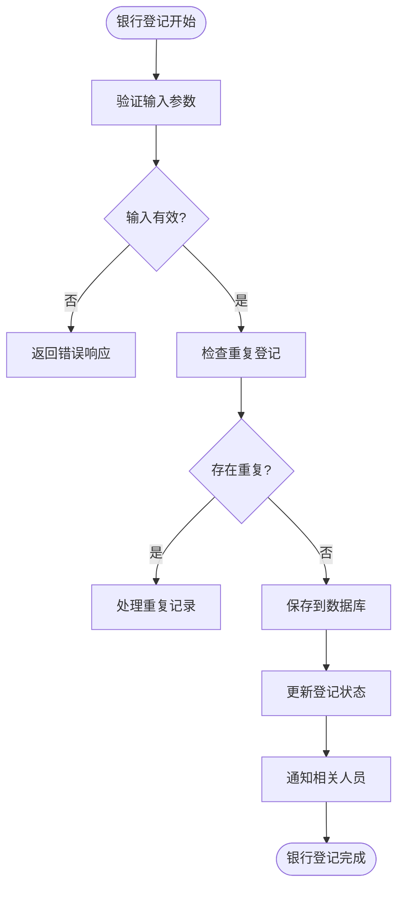
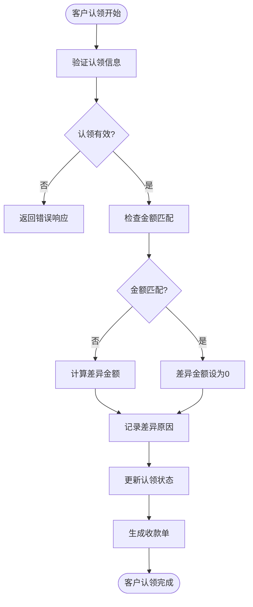
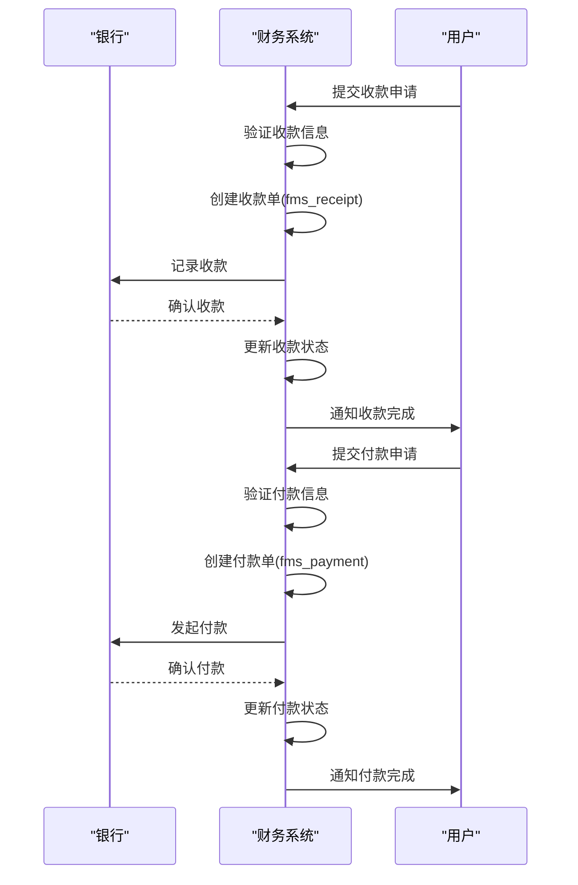
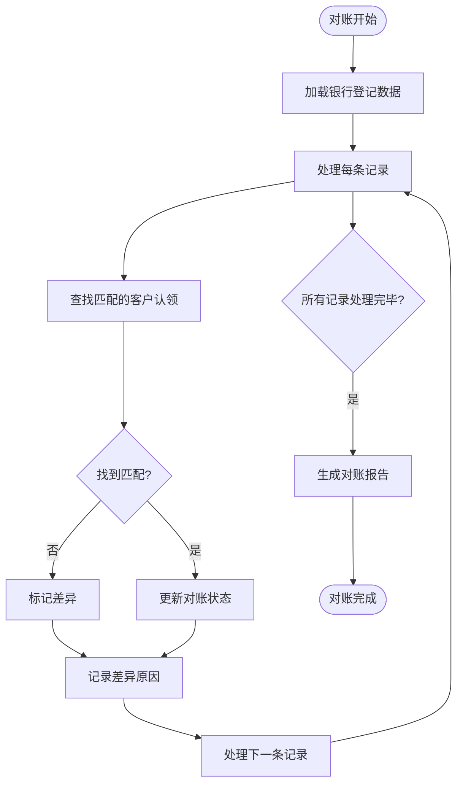
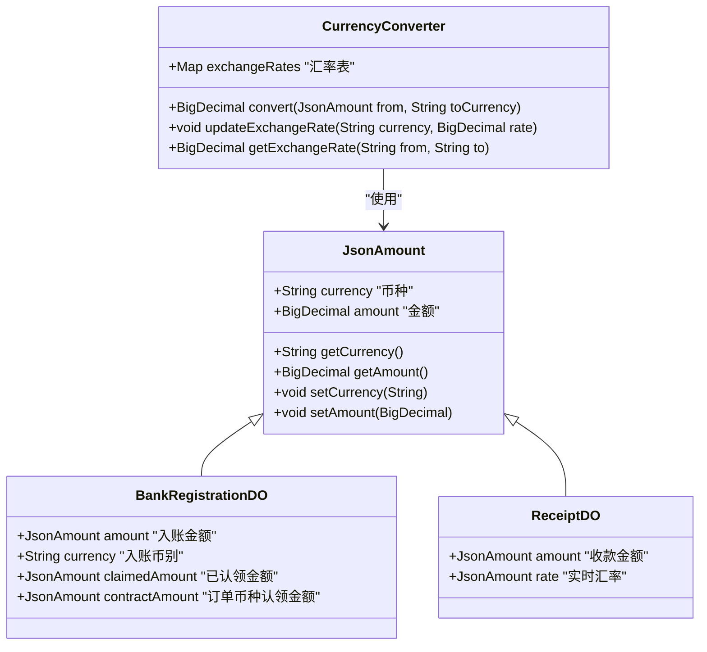

# 财务数据模型

<cite>
**本文档引用的文件**  
- [BankRegistrationMapper.xml](file://eplus-module-fms/eplus-module-fms-biz/src/main/resources/mapper/BankRegistrationMapper.xml)
- [CustClaimItemMapper.xml](file://eplus-module-fms/eplus-module-fms-biz/src/main/resources/mapper/CustClaimItemMapper.xml)
- [BankRegistrationDO.java](file://eplus-module-fms/eplus-module-fms-biz/src/main/java/com/syj/eplus/module/fms/dal/dataobject/bankregistration/BankRegistrationDO.java)
- [CustClaimItem.java](file://eplus-module-fms/eplus-module-fms-biz/src/main/java/com/syj/eplus/module/fms/dal/dataobject/custclaim/CustClaimItem.java)
- [ReceiptDO.java](file://eplus-module-fms/eplus-module-fms-biz/src/main/java/com/syj/eplus/module/fms/dal/dataobject/receipt/ReceiptDO.java)
- [PaymentDO.java](file://eplus-module-fms/eplus-module-fms-biz/src/main/java/com/syj/eplus/module/fms/dal/dataobject/payment/PaymentDO.java)
- [V1_0_0_002__Eplus初始化.sql](file://eplus-flyway/src/main/resources/db/migration/common/V1_0_0_002__Eplus初始化.sql)
- [V1_0_0_005__新建银行登记表.sql](file://eplus-flyway/src/main/resources/db/migration/common/V1_0_0_005__新建银行登记表.sql)
- [V1_0_0_073__付款相关表.sql](file://eplus-flyway/src/main/resources/db/migration/common/V1_0_0_073__付款相关表.sql)
- [ReceiptApi.java](file://eplus-module-fms/eplus-module-fms-api/src/main/java/com/syj/eplus/module/fms/api/payment/api/receipt/ReceiptApi.java)
- [PaymentApi.java](file://eplus-module-fms/eplus-module-fms-api/src/main/java/com/syj/eplus/module/fms/api/payment/api/payment/PaymentApi.java)
</cite>

## 目录
1. [引言](#引言)
2. [核心实体设计](#核心实体设计)
3. [财务业务流程](#财务业务流程)
4. [数据对账机制](#数据对账机制)
5. [多币种与汇率管理](#多币种与汇率管理)
6. [SQL建表语句示例](#sql建表语句示例)
7. [MyBatis Mapper配置](#mybatis-mapper配置)
8. [最佳实践建议](#最佳实践建议)

## 引言

本财务数据模型文档旨在全面描述企业财务系统中的核心实体设计，包括应收应付、收付款、银行登记等关键模块。文档详细阐述了财务业务流程的数据结构，涵盖收款计划、付款申请、发票管理等环节的数据流转。通过ER图展示财务相关表之间的关系，重点说明财务数据的对账机制、多币种处理和汇率管理等关键功能的设计。文档还提供了实际的SQL建表语句和MyBatis Mapper配置示例，为开发者提供财务数据建模的最佳实践指导。

**本文档引用的文件**  
- [BankRegistrationDO.java](file://eplus-module-fms/eplus-module-fms-biz/src/main/java/com/syj/eplus/module/fms/dal/dataobject/bankregistration/BankRegistrationDO.java)
- [CustClaimItem.java](file://eplus-module-fms/eplus-module-fms-biz/src/main/java/com/syj/eplus/module/fms/dal/dataobject/custclaim/CustClaimItem.java)
- [ReceiptDO.java](file://eplus-module-fms/eplus-module-fms-biz/src/main/java/com/syj/eplus/module/fms/dal/dataobject/receipt/ReceiptDO.java)
- [PaymentDO.java](file://eplus-module-fms/eplus-module-fms-biz/src/main/java/com/syj/eplus/module/fms/dal/dataobject/payment/PaymentDO.java)

## 核心实体设计

财务数据模型的核心实体包括银行登记、客户认领、财务收款单和财务付款单等。这些实体通过精心设计的字段和关系，支持复杂的财务业务流程。

```mermaid
erDiagram
fms_bank_registration {
bigint id PK "主键"
varchar(20) code "编号"
json registered_by "登记人"
datetime registration_date "登记日期"
bigint company_id "入账单位id"
varchar(100) company_name "入账单位名称"
varchar(100) company_title "公司抬头"
datetime bank_posting_date "银行入账日期"
varchar(100) bank "银行"
varchar(100) bank_account "银行账号"
varchar(200) bank_address "开户行地址"
varchar(100) bank_poc "开户行联系人"
varchar(100) bank_code "银行行号"
varchar(10) currency "入账币别"
decimal(19,6) amount "入账金额"
varchar(500) remark "备注"
varchar(20) cust_code "客户编号"
varchar(100) cust_name "客户名称"
json manager "业务员"
json claim_manager "认领业务员"
tinyint claim_status "认领状态"
datetime claim_date "认领日期"
varchar(500) link_sale_contract_code "关联外销合同号"
}
fms_cust_claim_item {
bigint id PK "主键"
varchar(20) contract_code "订单合同号"
varchar(20) cust_code "客户编号"
varchar(100) cust_name "客户名称"
varchar(10) currency "订单币别"
bigint settlement_id "收款方式主键"
varchar(100) settlement_name "收款方式名称"
integer source_type "来源"
decimal(19,6) receivable_amount "应收金额"
decimal(19,6) received_amount "已收金额"
decimal(19,6) claimed_amount "本次入账币种认领金额"
decimal(19,6) contract_amount "订单币种认领金额"
decimal(19,6) difference_amount "差异总金额"
integer completed_flag "收款完成标识"
json claim_person "认领员工"
datetime claim_date "认领日期"
json difference_reason "差异原因"
bigint registration_id "登记主键"
bigint item_id "明细主键"
varchar(50) source "来源"
integer type "认领类型"
integer other_fee_type "其他收费类型"
varchar(20) receipt_code "收款单编号"
json finance_amount "财务费用"
varchar(500) remark "备注"
}
fms_receipt {
bigint id PK "主键"
varchar(100) code "申请单号"
tinyint print_flag "打印状态"
int print_times "打印次数"
tinyint audit_status "审核状态"
bigint company_id "内部法人单位"
varchar(100) bank "开户行"
varchar(100) bank_address "开户行地址"
varchar(100) bank_account "银行账号"
varchar(100) bank_poc "开户行联系人"
varchar(100) bank_code "银行行号"
varchar(100) amount "收款金额"
varchar(100) rate "实时汇率"
datetime receipt_time "收款时间"
varchar(100) remark "收款备注"
varchar(100) receipt_user "收款人"
varchar(100) approver "最终审批人"
datetime approval_time "审批时间"
integer business_type "业务类型"
varchar(30) business_code "业务编号"
integer business_subject_type "支付对象类型"
varchar(30) business_subject_code "支付对象编号"
tinyint status "确认状态"
tinyint receipt_type "收款方式"
}
fms_payment {
bigint id PK "主键"
varchar(20) code "支付编码"
bigint company_id "内部法人单位"
varchar(100) bank "开户行"
varchar(100) bank_account "银行账号"
varchar(100) bank_address "开户行地址"
integer status "支付状态"
json amount "支付金额"
datetime date "支付日期"
json cashier "出纳员"
varchar(500) remark "备注"
integer business_type "业务类型"
varchar(30) business_code "业务编号"
integer business_subject_type "支付对象类型"
varchar(30) business_subject_code "支付对象编号"
json applyer "申请人"
tinyint print_flag "打印状态"
int print_times "打印次数"
tinyint audit_status "审核状态"
json apply_amount "申请支付金额"
json approver "最终审批人"
datetime approval_time "审批时间"
varchar(100) bank_poc "开户行联系人"
varchar(100) bank_code "银行行号"
varchar(20) apply_code "申请单编号"
datetime apply_payment_date "申请付款日期"
integer payment_method "支付方式"
json payment_apply "付款申请信息"
varchar(100) target_bank "对方银行"
varchar(100) target_bank_account "对方账户"
varchar(100) target_bank_poc "对方账号"
json link_code_list "链路编号列表"
json paid_amount "已付金额"
json annex "附件"
integer acceptance_days "承兑天数"
datetime cancel_time "作废时间"
varchar(500) cancel_reason "作废原因"
json cancel_user "作废人"
varchar(100) payment_bank "付款银行"
varchar(100) payment_bank_account "付款银行账号"
}
fms_bank_registration ||--o{ fms_cust_claim_item : "包含"
fms_bank_registration ||--o{ fms_receipt : "关联"
fms_receipt ||--o{ fms_cust_claim_item : "产生"
fms_payment ||--o{ fms_cust_claim_item : "影响"
```

**图源**  
- [V1_0_0_005__新建银行登记表.sql](file://eplus-flyway/src/main/resources/db/migration/common/V1_0_0_005__新建银行登记表.sql)
- [V1_0_0_002__Eplus初始化.sql](file://eplus-flyway/src/main/resources/db/migration/common/V1_0_0_002__Eplus初始化.sql)
- [V1_0_0_073__付款相关表.sql](file://eplus-flyway/src/main/resources/db/migration/common/V1_0_0_073__付款相关表.sql)

**本文档引用的文件**  
- [BankRegistrationDO.java](file://eplus-module-fms/eplus-module-fms-biz/src/main/java/com/syj/eplus/module/fms/dal/dataobject/bankregistration/BankRegistrationDO.java)
- [CustClaimItem.java](file://eplus-module-fms/eplus-module-fms-biz/src/main/java/com/syj/eplus/module/fms/dal/dataobject/custclaim/CustClaimItem.java)
- [ReceiptDO.java](file://eplus-module-fms/eplus-module-fms-biz/src/main/java/com/syj/eplus/module/fms/dal/dataobject/receipt/ReceiptDO.java)
- [PaymentDO.java](file://eplus-module-fms/eplus-module-fms-biz/src/main/java/com/syj/eplus/module/fms/dal/dataobject/payment/PaymentDO.java)

## 财务业务流程

财务业务流程涵盖了从银行登记到客户认领，再到收款和付款的完整生命周期。这些流程通过精心设计的数据结构和业务逻辑实现。

### 银行登记流程

银行登记是财务流程的起点，记录银行入账信息。该流程通过`fms_bank_registration`表实现，包含入账单位、银行信息、金额和客户信息等关键字段。



**图源**  
- [BankRegistrationDO.java](file://eplus-module-fms/eplus-module-fms-biz/src/main/java/com/syj/eplus/module/fms/dal/dataobject/bankregistration/BankRegistrationDO.java)

**本文档引用的文件**  
- [BankRegistrationDO.java](file://eplus-module-fms/eplus-module-fms-biz/src/main/java/com/syj/eplus/module/fms/dal/dataobject/bankregistration/BankRegistrationDO.java)
- [BankRegistrationMapper.xml](file://eplus-module-fms/eplus-module-fms-biz/src/main/resources/mapper/BankRegistrationMapper.xml)

### 客户认领流程

客户认领流程将银行入账与具体的客户和合同关联起来，实现资金的精确匹配。该流程通过`fms_cust_claim_item`表实现，记录认领的详细信息。



**图源**  
- [CustClaimItem.java](file://eplus-module-fms/eplus-module-fms-biz/src/main/java/com/syj/eplus/module/fms/dal/dataobject/custclaim/CustClaimItem.java)

**本文档引用的文件**  
- [CustClaimItem.java](file://eplus-module-fms/eplus-module-fms-biz/src/main/java/com/syj/eplus/module/fms/dal/dataobject/custclaim/CustClaimItem.java)
- [CustClaimItemMapper.xml](file://eplus-module-fms/eplus-module-fms-biz/src/main/resources/mapper/CustClaimItemMapper.xml)

### 收付款流程

收付款流程管理企业的资金流入和流出，确保财务数据的准确性和完整性。



**图源**  
- [ReceiptDO.java](file://eplus-module-fms/eplus-module-fms-biz/src/main/java/com/syj/eplus/module/fms/dal/dataobject/receipt/ReceiptDO.java)
- [PaymentDO.java](file://eplus-module-fms/eplus-module-fms-biz/src/main/java/com/syj/eplus/module/fms/dal/dataobject/payment/PaymentDO.java)

**本文档引用的文件**  
- [ReceiptDO.java](file://eplus-module-fms/eplus-module-fms-biz/src/main/java/com/syj/eplus/module/fms/dal/dataobject/receipt/ReceiptDO.java)
- [PaymentDO.java](file://eplus-module-fms/eplus-module-fms-biz/src/main/java/com/syj/eplus/module/fms/dal/dataobject/payment/PaymentDO.java)

## 数据对账机制

财务系统实现了精确的数据对账机制，确保银行登记、客户认领和收付款数据的一致性。

### 对账流程设计

对账机制通过以下方式实现：
1. 银行登记金额与客户认领金额的匹配
2. 收款单与客户认领的关联
3. 付款单与采购合同的对应



**图源**  
- [BankRegistrationDO.java](file://eplus-module-fms/eplus-module-fms-biz/src/main/java/com/syj/eplus/module/fms/dal/dataobject/bankregistration/BankRegistrationDO.java)
- [CustClaimItem.java](file://eplus-module-fms/eplus-module-fms-biz/src/main/java/com/syj/eplus/module/fms/dal/dataobject/custclaim/CustClaimItem.java)

**本文档引用的文件**  
- [BankRegistrationDO.java](file://eplus-module-fms/eplus-module-fms-biz/src/main/java/com/syj/eplus/module/fms/dal/dataobject/bankregistration/BankRegistrationDO.java)
- [CustClaimItem.java](file://eplus-module-fms/eplus-module-fms-biz/src/main/java/com/syj/eplus/module/fms/dal/dataobject/custclaim/CustClaimItem.java)

## 多币种与汇率管理

财务系统支持多币种处理和汇率管理，满足国际化业务需求。

### 多币种处理设计

系统通过以下方式处理多币种：
1. 使用`JsonAmount`类型存储金额和币种信息
2. 记录实时汇率
3. 支持不同币种间的转换



**图源**  
- [ReceiptDO.java](file://eplus-module-fms/eplus-module-fms-biz/src/main/java/com/syj/eplus/module/fms/dal/dataobject/receipt/ReceiptDO.java)
- [BankRegistrationDO.java](file://eplus-module-fms/eplus-module-fms-biz/src/main/java/com/syj/eplus/module/fms/dal/dataobject/bankregistration/BankRegistrationDO.java)

**本文档引用的文件**  
- [ReceiptDO.java](file://eplus-module-fms/eplus-module-fms-biz/src/main/java/com/syj/eplus/module/fms/dal/dataobject/receipt/ReceiptDO.java)
- [BankRegistrationDO.java](file://eplus-module-fms/eplus-module-fms-biz/src/main/java/com/syj/eplus/module/fms/dal/dataobject/bankregistration/BankRegistrationDO.java)

## SQL建表语句示例

以下是财务核心表的SQL建表语句示例：

```sql
-- 银行登记表
CREATE TABLE IF NOT EXISTS `fms_bank_registration` (
    `id`                bigint         NOT NULL AUTO_INCREMENT COMMENT '主键',
    `code`              varchar(20)    NOT NULL DEFAULT '' COMMENT '编号',
    `registered_by`     json           NOT NULL DEFAULT (JSON_OBJECT()) COMMENT '登记人',
    `registration_date` datetime       NOT NULL DEFAULT CURRENT_TIMESTAMP COMMENT '登记日期',
    `company_id`        bigint         NULL     DEFAULT NULL COMMENT '入账单位id',
    `company_name`      varchar(100)   NULL     DEFAULT NULL COMMENT '入账单位名称',
    `company_title`     varchar(100)   NULL     DEFAULT NULL COMMENT '公司抬头',
    `bank_posting_date` datetime       NULL     DEFAULT NULL COMMENT '银行入账日期',
    `bank`              varchar(100)   NOT NULL DEFAULT '' COMMENT '银行',
    `bank_account`      varchar(100)   NOT NULL DEFAULT '' COMMENT '银行账号',
    `bank_address`      varchar(200)   NOT NULL DEFAULT '' COMMENT '开户行地址',
    `bank_poc`          varchar(100)   NOT NULL DEFAULT '' COMMENT '开户行联系人',
    `bank_code`         varchar(100)   NOT NULL DEFAULT '' COMMENT '银行行号',
    `currency`          varchar(10)    NOT NULL DEFAULT '' COMMENT '入账币别',
    `amount`            decimal(19, 6) NOT NULL DEFAULT 0 COMMENT '入账金额',
    `remark`            varchar(500)   NOT NULL DEFAULT '' COMMENT '备注',
    `cust_code`         varchar(20)    NOT NULL DEFAULT '' COMMENT '客户编号',
    `cust_name`         varchar(100)   NOT NULL DEFAULT '' COMMENT '客户名称',
    `manager`           json           NOT NULL DEFAULT (JSON_OBJECT()) COMMENT '业务员',
    `claim_manager`     json           NOT NULL DEFAULT (JSON_OBJECT()) COMMENT '认领业务员',
    `claim_status`      tinyint        NOT NULL DEFAULT 0 COMMENT '认领状态',
    `claim_date`        datetime       NOT NULL DEFAULT CURRENT_TIMESTAMP COMMENT '认领日期',
    `link_sale_contract_code` varchar(500) NOT NULL DEFAULT '' COMMENT '关联外销合同号',
    `creator`           int UNSIGNED   NULL     DEFAULT NULL COMMENT '创建人',
    `create_time`       datetime       NULL     DEFAULT CURRENT_TIMESTAMP COMMENT '创建时间',
    `updater`           int UNSIGNED   NULL     DEFAULT NULL COMMENT '修改人',
    `deleted`           tinyint(1)     NOT NULL DEFAULT 0 COMMENT '删除',
    `update_time`       datetime       NULL     DEFAULT NULL ON UPDATE CURRENT_TIMESTAMP COMMENT '修改时间',
    PRIMARY KEY (`id`) USING BTREE
) ENGINE = InnoDB
  AUTO_INCREMENT = 1
  CHARACTER SET = utf8mb4
  COLLATE = utf8mb4_general_ci COMMENT = '银行登记表'
  ROW_FORMAT = DYNAMIC;
```

```sql
-- 财务收款单表
CREATE TABLE IF NOT EXISTS `fms_receipt` (
    `id`              bigint UNSIGNED NOT NULL AUTO_INCREMENT COMMENT '主键',
    `code`            varchar(100)    NOT NULL DEFAULT '' COMMENT '申请单号',
    `print_flag`      tinyint         NOT NULL DEFAULT 0 COMMENT '打印状态',
    `print_times`     int             NOT NULL DEFAULT 0 COMMENT '打印次数',
    `audit_status`    tinyint         NULL     DEFAULT NULL COMMENT '审核状态',
    `company_id`      bigint          NULL     DEFAULT NULL COMMENT '内部法人单位',
    `bank`            varchar(100)    NULL     DEFAULT '' COMMENT '开户行',
    `bank_address`    varchar(100)    NULL     DEFAULT '' COMMENT '开户行地址',
    `bank_account`    varchar(100)    NULL     DEFAULT '' COMMENT '银行账号',
    `bank_poc`        varchar(100)    NULL     DEFAULT '' COMMENT '开户行联系人',
    `bank_code`       varchar(100)    NULL     DEFAULT '' COMMENT '银行行号',
    `amount`          varchar(100)    NULL     DEFAULT NULL COMMENT '收款金额',
    `rate`            varchar(100)    NULL     DEFAULT NULL COMMENT '实时汇率',
    `receipt_time`    datetime        NULL     DEFAULT NULL COMMENT '收款时间',
    `remark`          varchar(100)    NULL     DEFAULT '' COMMENT '收款备注',
    `receipt_user`    varchar(100)    NULL     DEFAULT NULL COMMENT '收款人',
    `approver`        varchar(100)    NULL     DEFAULT '' COMMENT '最终审批人',
    `approval_time`   datetime        NULL     DEFAULT NULL  COMMENT '审批时间',
    `business_type`   tinyint         NOT NULL DEFAULT 0 COMMENT '业务类型',
    `business_code`   varchar(30)     NULL     DEFAULT NULL COMMENT '业务编号',
    `business_subject_type` tinyint   NOT NULL DEFAULT 0 COMMENT '支付对象类型',
    `business_subject_code` varchar(30) NULL DEFAULT NULL COMMENT '支付对象编号',
    `status`          tinyint         NOT NULL DEFAULT 0 COMMENT '确认状态',
    `receipt_type`    tinyint UNSIGNED NOT NULL COMMENT '收款方式',
    `creator`         int UNSIGNED    NULL     DEFAULT NULL COMMENT '创建人',
    `create_time`     datetime        NULL     DEFAULT CURRENT_TIMESTAMP COMMENT '创建时间',
    `updater`         int UNSIGNED    NULL     DEFAULT NULL COMMENT '修改人',
    `update_time`     datetime        NULL     DEFAULT NULL ON UPDATE CURRENT_TIMESTAMP COMMENT '修改时间',
    `deleted`         tinyint(1)      NOT NULL DEFAULT 0 COMMENT '删除  0：有效 1：删除',
    PRIMARY KEY (`id`) USING BTREE
) ENGINE = InnoDB
  AUTO_INCREMENT = 1
  CHARACTER SET = utf8mb4
  COLLATE = utf8mb4_general_ci COMMENT = '财务收款单'
  ROW_FORMAT = DYNAMIC;
```

**本文档引用的文件**  
- [V1_0_0_005__新建银行登记表.sql](file://eplus-flyway/src/main/resources/db/migration/common/V1_0_0_005__新建银行登记表.sql)
- [V1_0_0_002__Eplus初始化.sql](file://eplus-flyway/src/main/resources/db/migration/common/V1_0_0_002__Eplus初始化.sql)

## MyBatis Mapper配置

以下是财务核心实体的MyBatis Mapper配置示例：

```xml
<!-- 银行登记Mapper -->
<?xml version="1.0" encoding="UTF-8"?>
<!DOCTYPE mapper PUBLIC "-//mybatis.org//DTD Mapper 3.0//EN" "http://mybatis.org/dtd/mybatis-3-mapper.dtd">
<mapper namespace="com.syj.eplus.module.fms.dal.mysql.bankregistration.BankRegistrationMapper">

    <resultMap id="BaseResultMap" type="com.syj.eplus.module.fms.controller.admin.bankregistration.vo.SimpleRegistrationResp">
        <result column="id" jdbcType="BIGINT" property="id"/>
        <result column="code" jdbcType="VARCHAR" property="code"/>
        <result column="companyTitle" jdbcType="VARCHAR" property="companyTitle"/>
        <result column="companyId" jdbcType="BIGINT" property="companyId"/>
        <result column="companyName" jdbcType="VARCHAR" property="companyName"/>
        <result column="bank" jdbcType="VARCHAR" property="bank"/>
        <result column="bankAccount" jdbcType="VARCHAR" property="bankAccount"/>
        <result column="currency" jdbcType="VARCHAR" property="currency"/>
        <result column="amount" jdbcType="DECIMAL" property="amount"/>
        <result column="claimedAmount" jdbcType="DECIMAL" property="claimedAmount"/>
    </resultMap>
    
    <resultMap id="ResultMapWithJson" type="com.syj.eplus.module.fms.controller.admin.bankregistration.vo.SimpleRegistrationResp"
               extends="BaseResultMap">
        <result column="registeredBy" property="registeredBy" javaType="com.syj.eplus.framework.common.entity.UserDept"
                typeHandler="com.syj.eplus.framework.common.config.handler.JsonUserDeptTypeHandler"/>
        <result column="managerList" property="managerList" javaType="com.syj.eplus.framework.common.entity.DifferenceReason"
                typeHandler="com.syj.eplus.framework.common.config.handler.JsonUserDeptListTypeHandler"/>
        <result column="custList" property="custList" javaType="com.syj.eplus.framework.common.entity.DifferenceReason"
                typeHandler="com.syj.eplus.framework.common.config.handler.JsonSimpleDataListTypeHandler"/>
    </resultMap>
</mapper>
```

```xml
<!-- 客户认领明细Mapper -->
<?xml version="1.0" encoding="UTF-8"?>
<!DOCTYPE mapper PUBLIC "-//mybatis.org//DTD Mapper 3.0//EN" "http://mybatis.org/dtd/mybatis-3-mapper.dtd">
<mapper namespace="com.syj.eplus.module.fms.dal.mysql.custclaim.CustClaimItemMapper">

    <resultMap id="BaseResultMap" type="com.syj.eplus.module.fms.dal.dataobject.custclaim.CustClaimItem">
        <result column="id" jdbcType="BIGINT" property="id"/>
        <result column="code" jdbcType="VARCHAR" property="code"/>
        <result column="custId" jdbcType="BIGINT" property="custId"/>
        <result column="custCode" jdbcType="VARCHAR" property="custCode"/>
        <result column="custName" jdbcType="VARCHAR" property="custName"/>
        <result column="currency" jdbcType="VARCHAR" property="currency"/>
        <result column="settlementName" jdbcType="VARCHAR" property="settlementName"/>
        <result column="sourceType" jdbcType="INTEGER" property="sourceType"/>
        <result column="receivableAmount" jdbcType="DECIMAL" property="receivableAmount"/>
        <result column="receivedAmount" jdbcType="DECIMAL" property="receivedAmount"/>
        <result column="status" jdbcType="INTEGER" property="status"/>
    </resultMap>
    
    <resultMap id="ResultMapWithJson" type="com.syj.eplus.module.fms.dal.dataobject.custclaim.CustClaimItem"
               extends="BaseResultMap">
        <result column="differenceReason" property="differenceReason" javaType="com.syj.eplus.framework.common.entity.DifferenceReason"
                typeHandler="com.syj.eplus.framework.common.config.handler.DifferenceReasonListHandler"/>
    </resultMap>
</mapper>
```

**本文档引用的文件**  
- [BankRegistrationMapper.xml](file://eplus-module-fms/eplus-module-fms-biz/src/main/resources/mapper/BankRegistrationMapper.xml)
- [CustClaimItemMapper.xml](file://eplus-module-fms/eplus-module-fms-biz/src/main/resources/mapper/CustClaimItemMapper.xml)

## 最佳实践建议

基于对财务数据模型的分析，提出以下最佳实践建议：

1. **数据一致性**：确保银行登记、客户认领和收付款数据的一致性，通过严格的对账机制验证数据准确性。

2. **多币种处理**：使用`JsonAmount`类型存储金额和币种信息，确保多币种处理的灵活性和准确性。

3. **审计跟踪**：保留完整的创建和修改记录，包括创建人、创建时间、修改人和修改时间，确保财务数据的可追溯性。

4. **软删除机制**：使用`deleted`字段实现软删除，避免数据丢失，同时保持数据完整性。

5. **JSON字段使用**：对于复杂对象（如用户部门信息、差异原因等），使用JSON字段存储，提高数据结构的灵活性。

6. **索引优化**：在常用查询字段（如`code`、`business_code`、`company_id`等）上创建索引，提高查询性能。

7. **API设计**：提供清晰的API接口（如`ReceiptApi`和`PaymentApi`），便于其他模块集成和调用。

8. **异常处理**：在关键业务流程中实现完善的异常处理机制，确保系统稳定性和数据完整性。

**本文档引用的文件**  
- [ReceiptApi.java](file://eplus-module-fms/eplus-module-fms-api/src/main/java/com/syj/eplus/module/fms/api/payment/api/receipt/ReceiptApi.java)
- [PaymentApi.java](file://eplus-module-fms/eplus-module-fms-api/src/main/java/com/syj/eplus/module/fms/api/payment/api/payment/PaymentApi.java)