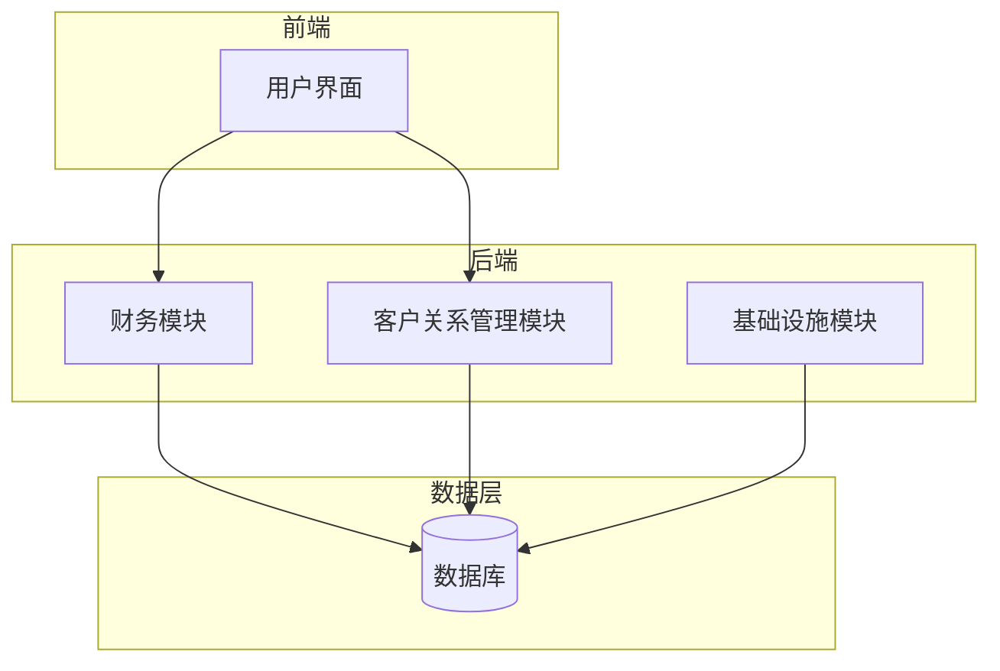
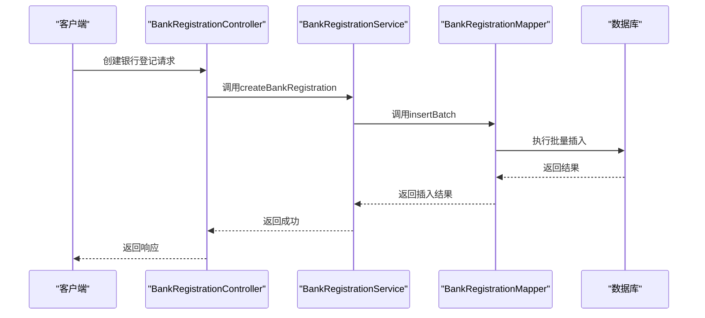
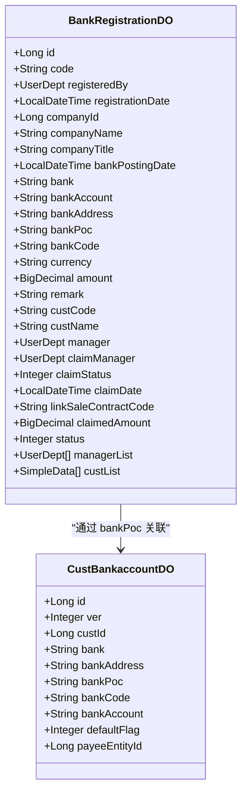
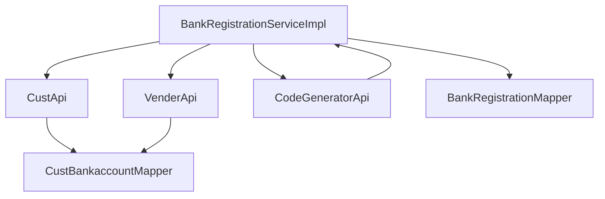

# 银行管理

<cite>
**本文档引用的文件**   
- [BankRegistrationController.java](file://eplus-module-fms/eplus-module-fms-biz/src/main/java/com/syj/eplus/module/fms/controller/admin/bankregistration/BankRegistrationController.java)
- [BankRegistrationDO.java](file://eplus-module-fms/eplus-module-fms-biz/src/main/java/com/syj/eplus/module/fms/dal/dataobject/bankregistration/BankRegistrationDO.java)
- [BankRegistrationMapper.java](file://eplus-module-fms/eplus-module-fms-biz/src/main/java/com/syj/eplus/module/fms/dal/mysql/bankregistration/BankRegistrationMapper.java)
- [BankRegistrationService.java](file://eplus-module-fms/eplus-module-fms-biz/src/main/java/com/syj/eplus/module/fms/service/bankregistration/BankRegistrationService.java)
- [BankRegistrationServiceImpl.java](file://eplus-module-fms/eplus-module-fms-biz/src/main/java/com/syj/eplus/module/fms/service/bankregistration/BankRegistrationServiceImpl.java)
- [CustBankaccountDO.java](file://eplus-module-crm/eplus-module-crm-biz/src/main/java/com/syj/eplus/module/crm/dal/dataobject/custbankaccount/CustBankaccountDO.java)
- [CustBankaccountMapper.java](file://eplus-module-crm/eplus-module-crm-biz/src/main/java/com/syj/eplus/module/crm/dal/mysql/custbankaccount/CustBankaccountMapper.java)
- [V1_0_0_005__新建银行登记表.sql](file://eplus-flyway/src/main/resources/db/migration/common/V1_0_0_005__新建银行登记表.sql)
- [V1_0_0_002__Eplus初始化.sql](file://eplus-flyway/src/main/resources/db/migration/common/V1_0_0_002__Eplus初始化.sql)
- [BankRegistrationConvert.java](file://eplus-module-fms/eplus-module-fms-biz/src/main/java/com/syj/eplus/module/fms/convert/bankregistration/BankRegistrationConvert.java)
</cite>

## 目录
1. [引言](#引言)
2. [项目结构](#项目结构)
3. [核心组件](#核心组件)
4. [架构概述](#架构概述)
5. [详细组件分析](#详细组件分析)
6. [依赖分析](#依赖分析)
7. [性能考虑](#性能考虑)
8. [故障排除指南](#故障排除指南)
9. [结论](#结论)

## 引言
本文档详细描述了银行管理系统中银行登记、公司银行账户、银行流水等核心实体的设计。重点阐述了银行相关业务流程的数据结构，包括银行登记创建、银行账户管理、银行流水对账等环节的数据流转。通过ER图展示银行相关表之间的关系，并详细说明银行数据的对账机制、多银行账户管理、银行手续费处理等关键功能的设计。文档包含实际的SQL建表语句和MyBatis Mapper配置示例，为开发者提供银行数据建模的最佳实践。

## 项目结构
银行管理功能主要分布在`eplus-module-fms`（财务模块）和`eplus-module-crm`（客户关系管理模块）中。财务模块负责银行登记、收款等核心财务操作，而客户关系管理模块则管理客户银行账户信息。数据库迁移脚本位于`eplus-flyway`模块中，定义了所有表结构。



**图表来源**
- [BankRegistrationController.java](file://eplus-module-fms/eplus-module-fms-biz/src/main/java/com/syj/eplus/module/fms/controller/admin/bankregistration/BankRegistrationController.java)
- [CustBankaccountDO.java](file://eplus-module-crm/eplus-module-crm-biz/src/main/java/com/syj/eplus/module/crm/dal/dataobject/custbankaccount/CustBankaccountDO.java)

**章节来源**
- [BankRegistrationController.java](file://eplus-module-fms/eplus-module-fms-biz/src/main/java/com/syj/eplus/module/fms/controller/admin/bankregistration/BankRegistrationController.java)
- [CustBankaccountDO.java](file://eplus-module-crm/eplus-module-crm-biz/src/main/java/com/syj/eplus/module/crm/dal/dataobject/custbankaccount/CustBankaccountDO.java)

## 核心组件
银行管理系统的两个核心组件是银行登记（Bank Registration）和客户银行账户（Customer Bank Account）。银行登记实体记录了银行流水的详细信息，包括入账金额、币别、银行信息等。客户银行账户实体则存储了客户的银行账户信息，用于对账和收款。这两个组件通过银行联系人（bank_poc）字段进行关联，实现了银行流水与客户账户的匹配。

**章节来源**
- [BankRegistrationDO.java](file://eplus-module-fms/eplus-module-fms-biz/src/main/java/com/syj/eplus/module/fms/dal/dataobject/bankregistration/BankRegistrationDO.java)
- [CustBankaccountDO.java](file://eplus-module-crm/eplus-module-crm-biz/src/main/java/com/syj/eplus/module/crm/dal/dataobject/custbankaccount/CustBankaccountDO.java)

## 架构概述
系统采用分层架构，包括控制层（Controller）、服务层（Service）、数据访问层（Mapper）和数据层（Database）。控制层处理HTTP请求，服务层实现业务逻辑，数据访问层与数据库交互。银行登记和客户银行账户的管理分别由`BankRegistrationController`和`CustBankaccountController`处理，它们通过各自的服务和Mapper与数据库进行交互。



**图表来源**
- [BankRegistrationController.java](file://eplus-module-fms/eplus-module-fms-biz/src/main/java/com/syj/eplus/module/fms/controller/admin/bankregistration/BankRegistrationController.java)
- [BankRegistrationService.java](file://eplus-module-fms/eplus-module-fms-biz/src/main/java/com/syj/eplus/module/fms/service/bankregistration/BankRegistrationService.java)
- [BankRegistrationMapper.java](file://eplus-module-fms/eplus-module-fms-biz/src/main/java/com/syj/eplus/module/fms/dal/mysql/bankregistration/BankRegistrationMapper.java)

## 详细组件分析

### 银行登记组件分析
银行登记组件是财务系统的核心，负责记录和管理所有银行流水。该组件支持批量创建银行登记，每个登记包含详细的银行信息、入账单位、金额和币别等。系统通过`BankRegistrationServiceImpl`中的`createBankRegistration`方法实现创建逻辑，该方法会调用`CodeGeneratorApi`生成唯一的登记编号，并根据提交标志设置状态。

#### 对象关系图


**图表来源**
- [BankRegistrationDO.java](file://eplus-module-fms/eplus-module-fms-biz/src/main/java/com/syj/eplus/module/fms/dal/dataobject/bankregistration/BankRegistrationDO.java)
- [CustBankaccountDO.java](file://eplus-module-crm/eplus-module-crm-biz/src/main/java/com/syj/eplus/module/crm/dal/dataobject/custbankaccount/CustBankaccountDO.java)

**章节来源**
- [BankRegistrationDO.java](file://eplus-module-fms/eplus-module-fms-biz/src/main/java/com/syj/eplus/module/fms/dal/dataobject/bankregistration/BankRegistrationDO.java)
- [CustBankaccountDO.java](file://eplus-module-crm/eplus-module-crm-biz/src/main/java/com/syj/eplus/module/crm/dal/dataobject/custbankaccount/CustBankaccountDO.java)

### 银行账户管理分析
客户银行账户管理组件负责维护客户的银行账户信息。每个客户可以有多个银行账户，系统通过`defaultFlag`字段标识默认账户。账户信息包括开户行、银行账号、开户行地址和联系人等关键数据。当创建银行登记时，系统会根据银行联系人（bank_poc）自动匹配对应的客户和账户。

#### 数据库表结构
```mermaid
erDiagram
fms_bank_registration {
bigint id PK
varchar(20) code
json registered_by
datetime registration_date
bigint company_id
varchar(100) company_name
varchar(100) company_title
datetime bank_posting_date
varchar(100) bank
varchar(100) bank_account
varchar(200) bank_address
varchar(100) bank_poc
varchar(100) bank_code
varchar(10) currency
decimal(19,6) amount
varchar(500) remark
varchar(50) cust_code
varchar(100) cust_name
json manager
json claim_manager
integer claim_status
datetime claim_date
varchar(50) link_sale_contract_code
decimal(19,6) claimed_amount
integer status
json manager_list
json cust_list
}
crm_cust_bankaccount {
bigint id PK
int ver
bigint cust_id
varchar(100) bank
varchar(100) bank_account
varchar(100) bank_address
varchar(100) bank_poc
varchar(100) bank_code
tinyint default_flag
bigint payee_entity_id
}
fms_bank_registration ||--o{ crm_cust_bankaccount : "通过 bank_poc 关联"
```

**图表来源**
- [V1_0_0_005__新建银行登记表.sql](file://eplus-flyway/src/main/resources/db/migration/common/V1_0_0_005__新建银行登记表.sql)
- [V1_0_0_002__Eplus初始化.sql](file://eplus-flyway/src/main/resources/db/migration/common/V1_0_0_002__Eplus初始化.sql)

**章节来源**
- [BankRegistrationDO.java](file://eplus-module-fms/eplus-module-fms-biz/src/main/java/com/syj/eplus/module/fms/dal/dataobject/bankregistration/BankRegistrationDO.java)
- [CustBankaccountDO.java](file://eplus-module-crm/eplus-module-crm-biz/src/main/java/com/syj/eplus/module/crm/dal/dataobject/custbankaccount/CustBankaccountDO.java)

## 依赖分析
银行管理模块依赖于客户关系管理模块（CRM）来获取客户信息，依赖于基础设施模块（Infra）来生成编号。`BankRegistrationServiceImpl`通过`@Resource`注解注入`CustApi`、`VenderApi`和`CodeGeneratorApi`，实现了跨模块的服务调用。这种设计实现了模块间的松耦合，同时保证了业务逻辑的完整性。



**图表来源**
- [BankRegistrationServiceImpl.java](file://eplus-module-fms/eplus-module-fms-biz/src/main/java/com/syj/eplus/module/fms/service/bankregistration/BankRegistrationServiceImpl.java)
- [CustBankaccountMapper.java](file://eplus-module-crm/eplus-module-crm-biz/src/main/java/com/syj/eplus/module/crm/dal/mysql/custbankaccount/CustBankaccountMapper.java)

**章节来源**
- [BankRegistrationServiceImpl.java](file://eplus-module-fms/eplus-module-fms-biz/src/main/java/com/syj/eplus/module/fms/service/bankregistration/BankRegistrationServiceImpl.java)
- [CustApi.java](file://eplus-module-crm/eplus-module-crm-api/src/main/java/com/syj/eplus/module/crm/api/cust/CustApi.java)
- [CodeGeneratorApi.java](file://eplus-module-infra/eplus-module-infra-api/src/main/java/com/syj/eplus/module/infra/api/CodeGeneratorApi.java)

## 性能考虑
系统在处理银行登记时采用了批量插入的方式，通过`bankRegistrationMapper.insertBatch`方法提高数据插入效率。对于查询操作，使用了分页查询（`getBankRegistrationPage`）来避免一次性加载大量数据。此外，系统通过`@Cacheable`注解（未在代码中显示但通常用于此类场景）缓存常用的客户和供应商信息，减少数据库查询次数。

## 故障排除指南
常见问题包括银行登记创建失败、银行账户匹配错误等。创建失败通常是由于数据库约束或服务调用失败导致，应检查日志中的具体错误信息。匹配错误可能是由于银行联系人信息不一致造成，需要确保客户银行账户中的`bank_poc`与银行登记中的`company_title`能够正确匹配。系统提供了`getBankPocListByTitle`方法用于模糊查询银行联系人，帮助解决匹配问题。

**章节来源**
- [BankRegistrationServiceImpl.java](file://eplus-module-fms/eplus-module-fms-biz/src/main/java/com/syj/eplus/module/fms/service/bankregistration/BankRegistrationServiceImpl.java)
- [CustBankaccountServiceImpl.java](file://eplus-module-crm/eplus-module-crm-biz/src/main/java/com/syj/eplus/module/crm/service/custbankaccount/CustBankaccountServiceImpl.java)

## 结论
本文档详细介绍了银行管理系统的数据模型和核心功能。系统通过银行登记和客户银行账户两个核心实体，实现了银行流水的记录、匹配和对账功能。采用分层架构和模块化设计，保证了系统的可维护性和扩展性。通过ER图和序列图，清晰地展示了各组件之间的关系和交互流程。开发者在进行二次开发时，应遵循现有的设计模式，确保新功能与现有系统的一致性。