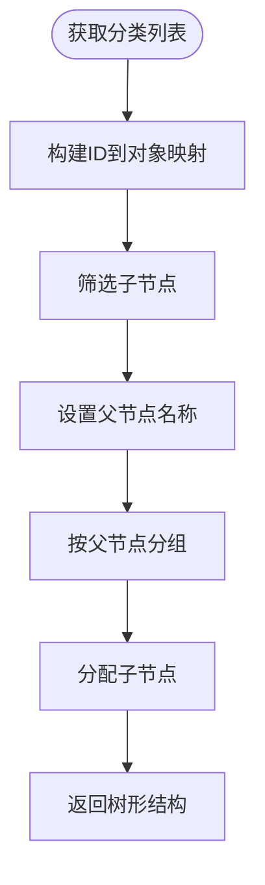
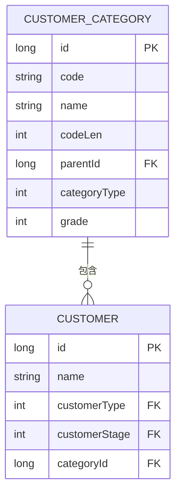

# 客户分类

<cite>
**本文档引用文件**  
- [CrmCategoryApi.java](file://eplus-module-crm/eplus-module-crm-api/src/main/java/com/syj/eplus/module/crm/api/category/CrmCategoryApi.java)
- [CrmCategoryServiceImpl.java](file://eplus-module-crm/eplus-module-crm-biz/src/main/java/com/syj/eplus/module/crm/service/category/CrmCategoryServiceImpl.java)
- [CrmCategoryDO.java](file://eplus-module-crm/eplus-module-crm-biz/src/main/java/com/syj/eplus/module/crm/dal/dataobject/category/CrmCategoryDO.java)
- [CrmCategoryMapper.java](file://eplus-module-crm/eplus-module-crm-biz/src/main/java/com/syj/eplus/module/crm/dal/mysql/category/CrmCategoryMapper.java)
- [CrmCategoryController.java](file://eplus-module-crm/eplus-module-crm-biz/src/main/java/com/syj/eplus/module/crm/controller/admin/category/CrmCategoryController.java)
- [CrmCategoryConvent.java](file://eplus-module-crm/eplus-module-crm-biz/src/main/java/com/syj/eplus/module/crm/service/convent/CrmCategoryConvent.java)
- [CustomTypeEnum.java](file://eplus-module-crm/eplus-module-crm-api/src/main/java/com/syj/eplus/module/crm/enums/cust/CustomTypeEnum.java)
- [CustomerStageEnum.java](file://eplus-module-crm/eplus-module-crm-api/src/main/java/com/syj/eplus/module/crm/enums/cust/CustomerStageEnum.java)
- [SourceTypeEnum.java](file://eplus-module-crm/eplus-module-crm-api/src/main/java/com/syj/eplus/module/crm/enums/cust/SourceTypeEnum.java)
- [CrmCategorySaveReqVO.java](file://eplus-module-crm/eplus-module-crm-biz/src/main/java/com/syj/eplus/module/crm/controller/admin/category/vo/CrmCategorySaveReqVO.java)
- [CrmCategorySimpleRespVO.java](file://eplus-module-crm/eplus-module-crm-biz/src/main/java/com/syj/eplus/module/crm/controller/admin/category/vo/CrmCategorySimpleRespVO.java)
</cite>

## 目录
1. [引言](#引言)
2. [客户分类体系设计](#客户分类体系设计)
3. [分类标准定义与管理](#分类标准定义与管理)
4. [多级树形结构实现](#多级树形结构实现)
5. [分类信息应用](#分类信息应用)
6. [关联关系说明](#关联关系说明)
7. [数据维护与查询接口](#数据维护与查询接口)
8. [结论](#结论)

## 引言
本文档全面阐述客户分类体系的设计与实现，涵盖客户类型、客户等级、行业分类等多个维度。系统通过灵活的分类标签配置和多级树形结构，支持对客户进行精细化管理。分类信息在销售分析、市场策略制定中发挥重要作用，并与价格策略、服务等级等业务要素紧密关联。

## 客户分类体系设计

客户分类体系采用多维度设计，主要包括客户类型、客户等级和行业分类等维度。系统通过统一的分类管理模块实现对各类客户属性的集中管理。

### 客户类型
客户类型通过枚举类 `CustomTypeEnum` 定义，包含以下类型：
- 电商 (E_COMMERCE)
- 进口商 (IMPORTER)
- 零售商 (RETAILER)
- 批发商 (WHOLESALER)
- 邮购商 (MAIL_ORDERERS)

### 客户等级
客户等级通过 `CustomerStageEnum` 枚举定义，包含以下等级：
- 线索客户 (LEAD_CUSTOMERS)
- 普通客户 (ORDINARY_CUSTOMERS)
- 重要客户 (KEY_CUSTOMERS)
- 失效客户 (LAPSED_CUSTOMERS)

### 行业来源
客户来源渠道通过 `SourceTypeEnum` 枚举定义，包含：
- 阿里巴巴
- 促销活动
- 广交会
- 国外会展
- 合作伙伴
- 互联网
- 老客户介绍

**节来源**
- [CustomTypeEnum.java](file://eplus-module-crm/eplus-module-crm-api/src/main/java/com/syj/eplus/module/crm/enums/cust/CustomTypeEnum.java#L1-L39)
- [CustomerStageEnum.java](file://eplus-module-crm/eplus-module-crm-api/src/main/java/com/syj/eplus/module/crm/enums/cust/CustomerStageEnum.java#L1-L33)
- [SourceTypeEnum.java](file://eplus-module-crm/eplus-module-crm-api/src/main/java/com/syj/eplus/module/crm/enums/cust/SourceTypeEnum.java#L1-L57)

## 分类标准定义与管理

分类标准通过统一的API接口和管理界面进行定义和管理。系统提供完整的增删改查功能，确保分类体系的灵活性和可维护性。

### 分类标准定义
每个分类包含以下属性：
- **主键 (id)**: 唯一标识符
- **分类编号 (code)**: 分类的编码
- **名称 (name)**: 分类的名称
- **流水号长度 (codeLen)**: 编码长度
- **父节点编号 (parentId)**: 上级分类ID
- **种类 (categoryType)**: 分类类型
- **级别 (grade)**: 分类层级

系统限制最大等级数为3级，防止分类层级过深。

### 分类管理方式
通过 `CrmCategoryController` 提供RESTful API接口，支持：
- 创建分类
- 更新分类
- 删除分类
- 查询分类
- 分页查询
- 导出Excel

**节来源**
- [CrmCategoryDO.java](file://eplus-module-crm/eplus-module-crm-biz/src/main/java/com/syj/eplus/module/crm/dal/dataobject/category/CrmCategoryDO.java#L1-L55)
- [CrmCategoryServiceImpl.java](file://eplus-module-crm/eplus-module-crm-biz/src/main/java/com/syj/eplus/module/crm/service/category/CrmCategoryServiceImpl.java#L1-L146)
- [CrmCategoryController.java](file://eplus-module-crm/eplus-module-crm-biz/src/main/java/com/syj/eplus/module/crm/controller/admin/category/CrmCategoryController.java#L1-L102)

## 多级树形结构实现

系统采用递归方式实现客户分类的多级树形结构，支持无限层级的分类管理。

### 数据结构设计
`CrmCategoryDO` 类通过 `parentId` 字段建立父子关系，形成树形结构。每个节点包含：
- 自身ID
- 父节点ID
- 节点名称
- 节点级别

### 递归查询实现
使用SQL递归查询获取指定节点的所有父节点：

```sql
WITH RECURSIVE recursion AS (
  SELECT t1.id,t1.parent_id,t1.code,t1.grade
  FROM crm_category t1
  WHERE t1.id= #{id}
  UNION ALL
  SELECT t2.id,t2.parent_id,t2.code,t2.grade
  FROM crm_category t2, recursion t3
  WHERE t2.id=t3.parent_id
)
SELECT * FROM recursion t;
```

### 树形结构转换
`CrmCategoryConvent` 类提供树形结构转换功能，将扁平化的分类数据转换为嵌套的树形结构：



**图来源**
- [CrmCategoryMapper.java](file://eplus-module-crm/eplus-module-crm-biz/src/main/java/com/syj/eplus/module/crm/dal/mysql/category/CrmCategoryMapper.java#L33-L44)
- [CrmCategoryConvent.java](file://eplus-module-crm/eplus-module-crm-biz/src/main/java/com/syj/eplus/module/crm/service/convent/CrmCategoryConvent.java#L41-L61)

**节来源**
- [CrmCategoryMapper.java](file://eplus-module-crm/eplus-module-crm-biz/src/main/java/com/syj/eplus/module/crm/dal/mysql/category/CrmCategoryMapper.java#L33-L44)
- [CrmCategoryConvent.java](file://eplus-module-crm/eplus-module-crm-biz/src/main/java/com/syj/eplus/module/crm/service/convent/CrmCategoryConvent.java#L41-L61)

## 分类信息应用

客户分类信息在多个业务场景中发挥重要作用，支持精细化运营和决策分析。

### 销售分析
通过客户分类进行销售业绩分析，按不同类型、等级的客户统计销售额、订单量等关键指标，识别高价值客户群体。

### 市场策略
基于客户分类制定差异化市场策略：
- 针对重要客户制定专属营销方案
- 对线索客户实施转化策略
- 对失效客户进行召回活动

### 客户画像
结合分类信息构建客户360度画像，包括：
- 客户基本信息
- 交易行为特征
- 偏好分析
- 价值评估

**节来源**
- [CrmCategoryApi.java](file://eplus-module-crm/eplus-module-crm-api/src/main/java/com/syj/eplus/module/crm/api/category/CrmCategoryApi.java#L1-L22)
- [CrmCategoryServiceImpl.java](file://eplus-module-crm/eplus-module-crm-biz/src/main/java/com/syj/eplus/module/crm/service/category/CrmCategoryServiceImpl.java#L133-L143)

## 关联关系说明

客户分类体系与多个业务模块存在紧密关联，形成完整的客户管理体系。

### 与价格策略的关联
不同客户等级享受不同的价格策略：
- 重要客户享有优先定价权
- 批发商享受批量采购折扣
- 长期合作客户享有阶梯价格

### 与服务等级的关联
根据客户分类提供差异化服务：
- 重要客户配备专属客户经理
- 大客户提供VIP服务通道
- 普通客户享受标准服务流程

### 数据关联模型


**图来源**
- [CrmCategoryDO.java](file://eplus-module-crm/eplus-module-crm-biz/src/main/java/com/syj/eplus/module/crm/dal/dataobject/category/CrmCategoryDO.java#L1-L55)
- [CustomTypeEnum.java](file://eplus-module-crm/eplus-module-crm-api/src/main/java/com/syj/eplus/module/crm/enums/cust/CustomTypeEnum.java#L1-L39)

## 数据维护与查询接口

系统提供完整的数据维护和查询接口，支持客户分类信息的全生命周期管理。

### 数据维护接口
| 接口方法 | HTTP方法 | 路径 | 功能描述 |
|--------|--------|------|--------|
| createCategory | POST | /crm/category/create | 创建客户分类 |
| updateCategory | PUT | /crm/category/update | 更新客户分类 |
| deleteCategory | DELETE | /crm/category/delete | 删除客户分类 |

### 查询接口
| 接口方法 | HTTP方法 | 路径 | 功能描述 |
|--------|--------|------|--------|
| getCategory | GET | /crm/category/get | 获取单个分类 |
| getCategoryPage | GET | /crm/category/page | 分页查询分类 |
| getSimpleList | GET | /crm/category/get-simple-list | 获取分类树 |
| exportCategoryExcel | GET | /crm/category/export-excel | 导出Excel |

### 请求参数
`CrmCategorySaveReqVO` 定义了创建和更新分类所需的参数：
- id: 主键
- code: 分类编号
- name: 名称
- codeLen: 流水号长度
- parentId: 父节点编号
- categoryType: 种类
- grade: 级别

**节来源**
- [CrmCategoryController.java](file://eplus-module-crm/eplus-module-crm-biz/src/main/java/com/syj/eplus/module/crm/controller/admin/category/CrmCategoryController.java#L1-L102)
- [CrmCategorySaveReqVO.java](file://eplus-module-crm/eplus-module-crm-biz/src/main/java/com/syj/eplus/module/crm/controller/admin/category/vo/CrmCategorySaveReqVO.java#L1-L30)
- [CrmCategorySimpleRespVO.java](file://eplus-module-crm/eplus-module-crm-biz/src/main/java/com/syj/eplus/module/crm/controller/admin/category/vo/CrmCategorySimpleRespVO.java#L1-L37)

## 结论
客户分类体系通过多维度设计、多级树形结构和灵活的配置功能，实现了对客户的精细化管理。系统不仅提供了完整的分类管理功能，还通过与价格策略、服务等级的关联，支持差异化的客户运营策略。分类信息在销售分析和市场决策中发挥重要作用，为企业的客户关系管理提供了坚实的基础。