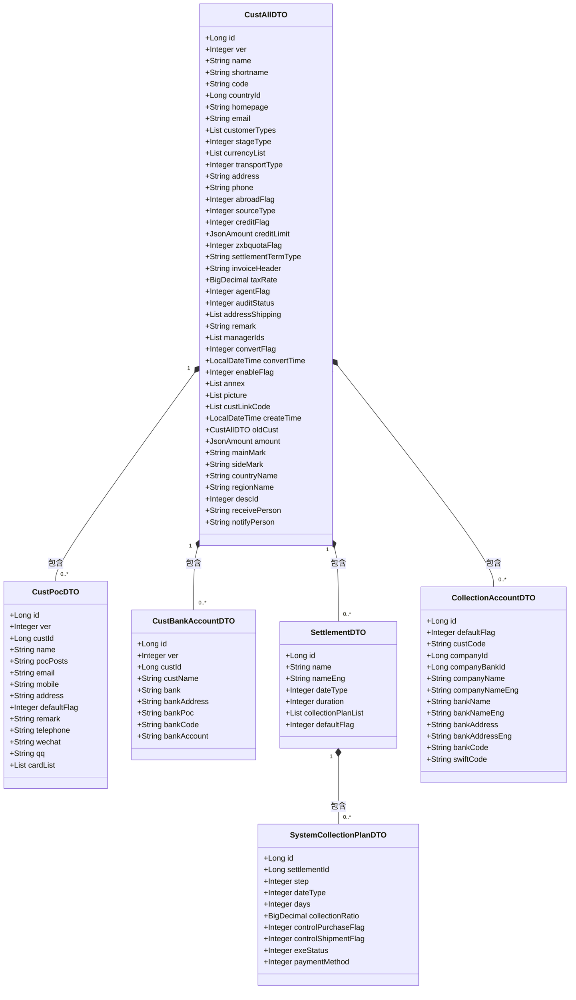
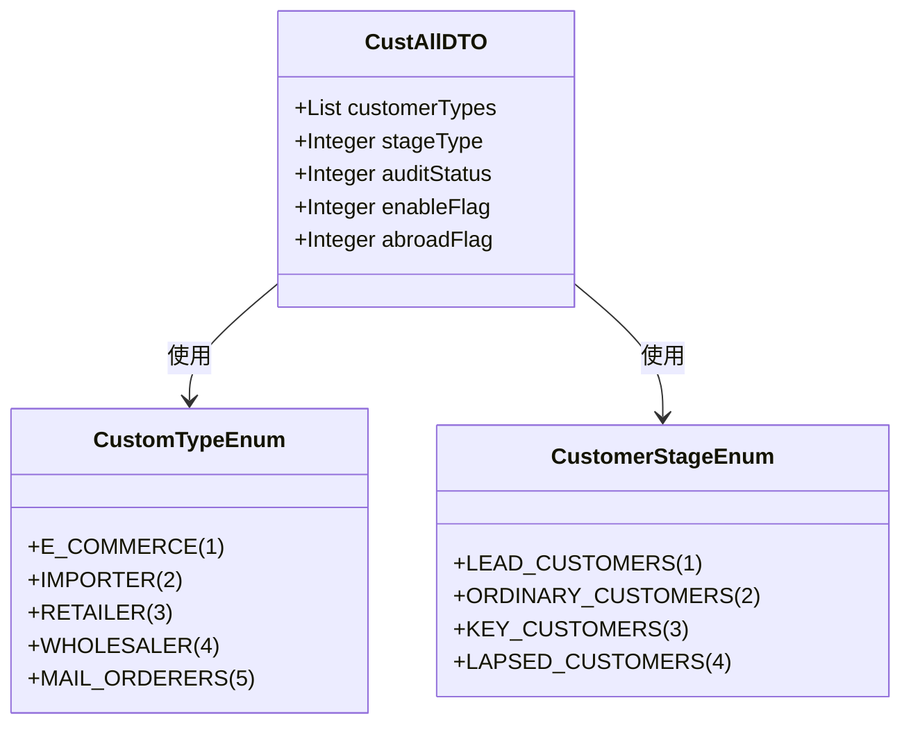
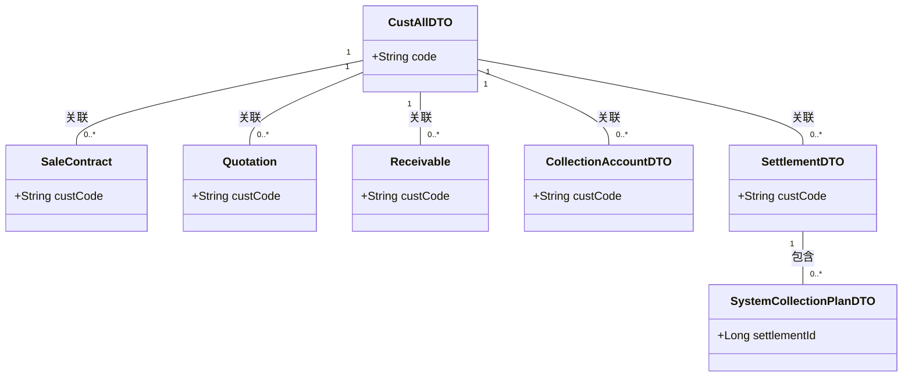
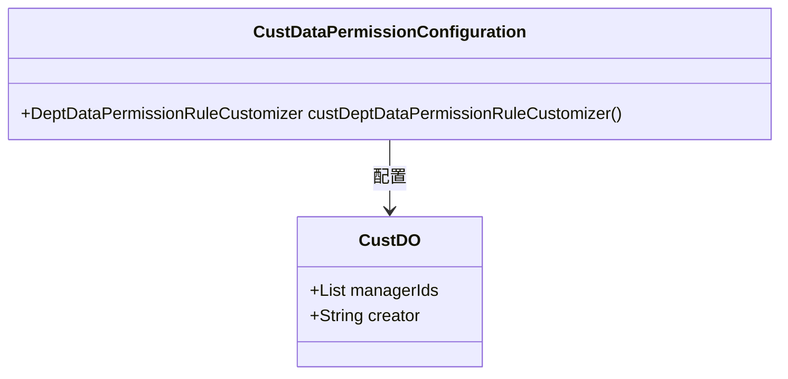
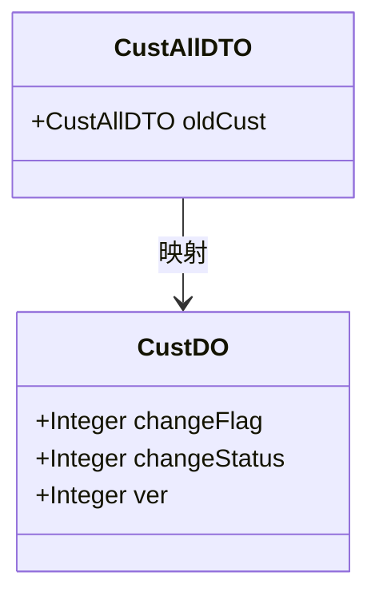
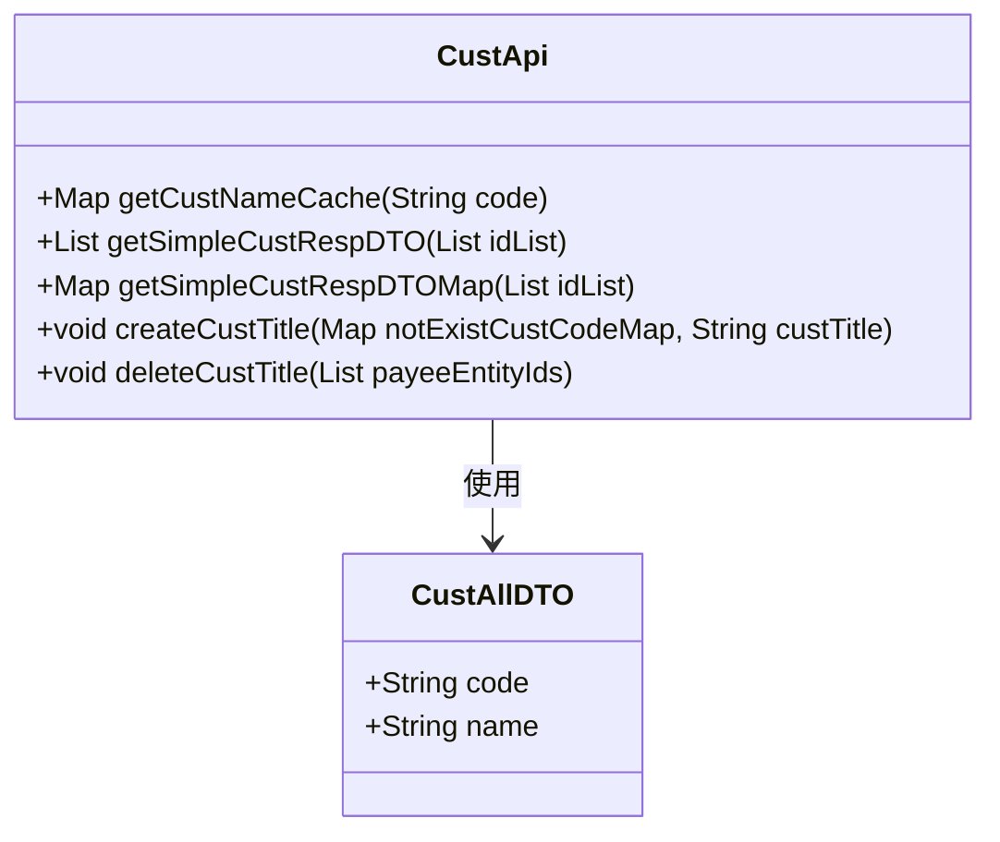

# 客户管理

<cite>
**本文档引用的文件**  
- [CustApi.java](file://eplus-module-crm/eplus-module-crm-api/src/main/java/com/syj/eplus/module/crm/api/cust/CustApi.java)
- [CustAllDTO.java](file://eplus-module-crm/eplus-module-crm-api/src/main/java/com/syj/eplus/module/crm/api/cust/dto/CustAllDTO.java)
- [CustDTO.java](file://eplus-module-crm/eplus-module-crm-api/src/main/java/com/syj/eplus/module/crm/api/cust/dto/CustDTO.java)
- [CustPocDTO.java](file://eplus-module-crm/eplus-module-crm-api/src/main/java/com/syj/eplus/module/crm/api/cust/dto/CustPocDTO.java)
- [CustBankAccountDTO.java](file://eplus-module-crm/eplus-module-crm-api/src/main/java/com/syj/eplus/module/crm/api/cust/dto/CustBankAccountDTO.java)
- [SettlementDTO.java](file://eplus-module-crm/eplus-module-crm-api/src/main/java/com/syj/eplus/module/crm/api/cust/dto/SettlementDTO.java)
- [CollectionAccountDTO.java](file://eplus-module-crm/eplus-module-crm-api/src/main/java/com/syj/eplus/module/crm/api/cust/dto/CollectionAccountDTO.java)
- [SystemCollectionPlanDTO.java](file://eplus-module-crm/eplus-module-crm-api/src/main/java/com/syj/eplus/module/crm/api/cust/dto/SystemCollectionPlanDTO.java)
- [CustDataPermissionConfiguration.java](file://eplus-module-crm/eplus-module-crm-biz/src/main/java/com/syj/eplus/module/crm/framework/config/CustDataPermissionConfiguration.java)
- [CustomTypeEnum.java](file://eplus-module-crm/eplus-module-crm-api/src/main/java/com/syj/eplus/module/crm/enums/cust/CustomTypeEnum.java)
- [CustomerStageEnum.java](file://eplus-module-crm/eplus-module-crm-api/src/main/java/com/syj/eplus/module/crm/enums/cust/CustomerStageEnum.java)
- [CustDO.java](file://eplus-module-crm/eplus-module-crm-biz/src/main/java/com/syj/eplus/module/crm/dal/dataobject/cust/CustDO.java)
</cite>

## 目录
1. [客户数据模型](#客户数据模型)  
2. [客户管理维度](#客户管理维度)  
3. [客户业务关联关系](#客户业务关联关系)  
4. [客户数据权限控制](#客户数据权限控制)  
5. [客户信息变更历史](#客户信息变更历史)  
6. [客户数据导入导出](#客户数据导入导出)

## 客户数据模型

客户管理模块的核心数据模型围绕客户基本信息、联系人信息、信用额度和付款条件等实体构建。`CustAllDTO` 类作为客户信息的完整数据传输对象，继承自 `SimpleCustRespDTO`，包含了客户的所有核心属性。

客户基本信息包括企业名称、简称、客户编号、国家编码、官网、电子邮件等。客户类型通过 `customerTypes` 字段以列表形式存储，支持多类型客户分类。客户阶段通过 `stageType` 字段表示，用于区分客户生命周期的不同阶段。

联系人信息由 `CustPocDTO` 类定义，包含联系人姓名、职位、电子邮件、手机、住宅地址、默认联系人标志、备注、座机、微信、QQ 和名片等属性。每个客户可以关联多个联系人。

信用额度信息通过 `creditFlag` 字段控制是否启用，并通过 `creditLimit` 字段存储具体的信用额度值。付款条件包括结算条款（`settlementTermType`）、税率（`taxRate`）等。

**图示来源**  
- [CustAllDTO.java](file://eplus-module-crm/eplus-module-crm-api/src/main/java/com/syj/eplus/module/crm/api/cust/dto/CustAllDTO.java)
- [CustPocDTO.java](file://eplus-module-crm/eplus-module-crm-api/src/main/java/com/syj/eplus/module/crm/api/cust/dto/CustPocDTO.java)
- [CustBankAccountDTO.java](file://eplus-module-crm/eplus-module-crm-api/src/main/java/com/syj/eplus/module/crm/api/cust/dto/CustBankAccountDTO.java)
- [SettlementDTO.java](file://eplus-module-crm/eplus-module-crm-api/src/main/java/com/syj/eplus/module/crm/api/cust/dto/SettlementDTO.java)
- [CollectionAccountDTO.java](file://eplus-module-crm/eplus-module-crm-api/src/main/java/com/syj/eplus/module/crm/api/cust/dto/CollectionAccountDTO.java)
- [SystemCollectionPlanDTO.java](file://eplus-module-crm/eplus-module-crm-api/src/main/java/com/syj/eplus/module/crm/api/cust/dto/SystemCollectionPlanDTO.java)

**本节来源**  
- [CustAllDTO.java](file://eplus-module-crm/eplus-module-crm-api/src/main/java/com/syj/eplus/module/crm/api/cust/dto/CustAllDTO.java)
- [CustPocDTO.java](file://eplus-module-crm/eplus-module-crm-api/src/main/java/com/syj/eplus/module/crm/api/cust/dto/CustPocDTO.java)
- [CustBankAccountDTO.java](file://eplus-module-crm/eplus-module-crm-api/src/main/java/com/syj/eplus/module/crm/api/cust/dto/CustBankAccountDTO.java)
- [SettlementDTO.java](file://eplus-module-crm/eplus-module-crm-api/src/main/java/com/syj/eplus/module/crm/api/cust/dto/SettlementDTO.java)
- [CollectionAccountDTO.java](file://eplus-module-crm/eplus-module-crm-api/src/main/java/com/syj/eplus/module/crm/api/cust/dto/CollectionAccountDTO.java)
- [SystemCollectionPlanDTO.java](file://eplus-module-crm/eplus-module-crm-api/src/main/java/com/syj/eplus/module/crm/api/cust/dto/SystemCollectionPlanDTO.java)

## 客户管理维度

客户管理模块通过多个维度对客户进行分类和管理，包括客户分类、客户等级和客户状态。

客户分类通过 `CustomTypeEnum` 枚举定义，包括电商、进口商、零售商、批发商和邮购商等类型。这些分类帮助系统识别客户的不同业务特征和需求。

客户等级通过 `CustomerStageEnum` 枚举定义，包括线索客户、普通客户、重要客户和失效客户。这些等级反映了客户在销售漏斗中的位置和重要性，有助于销售团队优先处理高价值客户。

客户状态通过 `auditStatus` 字段表示，用于跟踪客户资料的审核状态。此外，`enableFlag` 字段用于控制客户是否启用，`abroadFlag` 字段标识客户是否为国外客户。

**图示来源**  
- [CustomTypeEnum.java](file://eplus-module-crm/eplus-module-crm-api/src/main/java/com/syj/eplus/module/crm/enums/cust/CustomTypeEnum.java)
- [CustomerStageEnum.java](file://eplus-module-crm/eplus-module-crm-api/src/main/java/com/syj/eplus/module/crm/enums/cust/CustomerStageEnum.java)
- [CustAllDTO.java](file://eplus-module-crm/eplus-module-crm-api/src/main/java/com/syj/eplus/module/crm/api/cust/dto/CustAllDTO.java)

**本节来源**  
- [CustomTypeEnum.java](file://eplus-module-crm/eplus-module-crm-api/src/main/java/com/syj/eplus/module/crm/enums/cust/CustomTypeEnum.java)
- [CustomerStageEnum.java](file://eplus-module-crm/eplus-module-crm-api/src/main/java/com/syj/eplus/module/crm/enums/cust/CustomerStageEnum.java)
- [CustAllDTO.java](file://eplus-module-crm/eplus-module-crm-api/src/main/java/com/syj/eplus/module/crm/api/cust/dto/CustAllDTO.java)

## 客户业务关联关系

客户与多个业务实体存在关联关系，包括销售合同、报价单和应收款项。这些关联通过客户编号（`custCode`）作为外键建立。

在收款账户（`CollectionAccountDTO`）中，`custCode` 字段直接关联到客户。在结算方式（`SettlementDTO`）中，通过客户编号间接关联到客户的付款条件。应收款项的管理通过 `SystemCollectionPlanDTO` 实现，该类与 `SettlementDTO` 关联，形成完整的收款计划。

**图示来源**  
- [CustAllDTO.java](file://eplus-module-crm/eplus-module-crm-api/src/main/java/com/syj/eplus/module/crm/api/cust/dto/CustAllDTO.java)
- [CollectionAccountDTO.java](file://eplus-module-crm/eplus-module-crm-api/src/main/java/com/syj/eplus/module/crm/api/cust/dto/CollectionAccountDTO.java)
- [SettlementDTO.java](file://eplus-module-crm/eplus-module-crm-api/src/main/java/com/syj/eplus/module/crm/api/cust/dto/SettlementDTO.java)
- [SystemCollectionPlanDTO.java](file://eplus-module-crm/eplus-module-crm-api/src/main/java/com/syj/eplus/module/crm/api/cust/dto/SystemCollectionPlanDTO.java)

**本节来源**  
- [CustAllDTO.java](file://eplus-module-crm/eplus-module-crm-api/src/main/java/com/syj/eplus/module/crm/api/cust/dto/CustAllDTO.java)
- [CollectionAccountDTO.java](file://eplus-module-crm/eplus-module-crm-api/src/main/java/com/syj/eplus/module/crm/api/cust/dto/CollectionAccountDTO.java)
- [SettlementDTO.java](file://eplus-module-crm/eplus-module-crm-api/src/main/java/com/syj/eplus/module/crm/api/cust/dto/SettlementDTO.java)
- [SystemCollectionPlanDTO.java](file://eplus-module-crm/eplus-module-crm-api/src/main/java/com/syj/eplus/module/crm/api/cust/dto/SystemCollectionPlanDTO.java)

## 客户数据权限控制

客户数据权限控制通过 `CustDataPermissionConfiguration` 类实现，采用基于部门和业务员的数据隔离机制。该配置类通过 `DeptDataPermissionRuleCustomizer` 定义了数据权限规则。

权限控制主要通过 `manager_ids` 和 `creator` 字段实现。`manager_ids` 字段存储负责该客户的业务员ID列表，确保只有指定业务员可以访问和操作其负责的客户数据。`creator` 字段记录客户创建者，用于限制数据访问范围。

**图示来源**  
- [CustDataPermissionConfiguration.java](file://eplus-module-crm/eplus-module-crm-biz/src/main/java/com/syj/eplus/module/crm/framework/config/CustDataPermissionConfiguration.java)
- [CustDO.java](file://eplus-module-crm/eplus-module-crm-biz/src/main/java/com/syj/eplus/module/crm/dal/dataobject/cust/CustDO.java)

**本节来源**  
- [CustDataPermissionConfiguration.java](file://eplus-module-crm/eplus-module-crm-biz/src/main/java/com/syj/eplus/module/crm/framework/config/CustDataPermissionConfiguration.java)
- [CustDO.java](file://eplus-module-crm/eplus-module-crm-biz/src/main/java/com/syj/eplus/module/crm/dal/dataobject/cust/CustDO.java)

## 客户信息变更历史

客户信息变更历史通过 `CustAllDTO` 类中的 `oldCust` 字段实现。该字段存储变更前的客户信息，用于记录和追踪客户资料的修改历史。

在 `CustDO` 类中，`changeFlag` 字段标识客户信息是否发生变更，`changeStatus` 字段记录变更状态，`ver` 字段表示版本号，用于乐观锁控制。这些字段共同实现了客户信息变更的完整追踪机制。

**图示来源**  
- [CustAllDTO.java](file://eplus-module-crm/eplus-module-crm-api/src/main/java/com/syj/eplus/module/crm/api/cust/dto/CustAllDTO.java)
- [CustDO.java](file://eplus-module-crm/eplus-module-crm-biz/src/main/java/com/syj/eplus/module/crm/dal/dataobject/cust/CustDO.java)

**本节来源**  
- [CustAllDTO.java](file://eplus-module-crm/eplus-module-crm-api/src/main/java/com/syj/eplus/module/crm/api/cust/dto/CustAllDTO.java)
- [CustDO.java](file://eplus-module-crm/eplus-module-crm-biz/src/main/java/com/syj/eplus/module/crm/dal/dataobject/cust/CustDO.java)

## 客户数据导入导出

客户数据导入导出功能通过 `CustApi` 接口提供支持。该接口定义了多个方法用于批量获取客户信息，如 `getSimpleCustRespDTO` 和 `getSimpleCustRespDTOMap`，这些方法可用于导出客户数据。

导入功能通过 `createCustTitle` 方法实现，该方法用于回写客户抬头信息。此外，`deleteCustTitle` 方法支持删除认领自动回写的抬头，为数据清理提供支持。

**图示来源**  
- [CustApi.java](file://eplus-module-crm/eplus-module-crm-api/src/main/java/com/syj/eplus/module/crm/api/cust/CustApi.java)
- [CustAllDTO.java](file://eplus-module-crm/eplus-module-crm-api/src/main/java/com/syj/eplus/module/crm/api/cust/dto/CustAllDTO.java)

**本节来源**  
- [CustApi.java](file://eplus-module-crm/eplus-module-crm-api/src/main/java/com/syj/eplus/module/crm/api/cust/CustApi.java)
- [CustAllDTO.java](file://eplus-module-crm/eplus-module-crm-api/src/main/java/com/syj/eplus/module/crm/api/cust/dto/CustAllDTO.java)