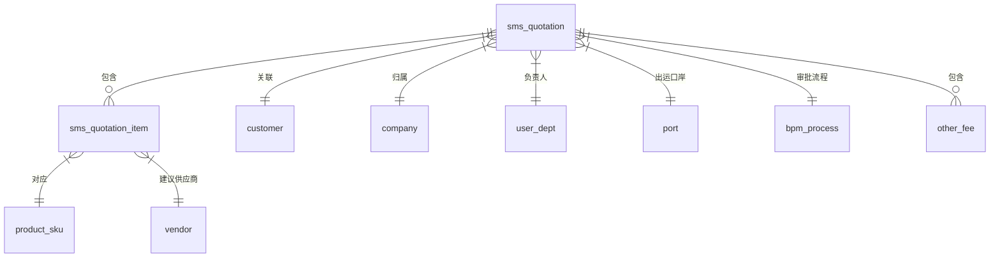

# 报价管理

<cite>
**本文档引用文件**  
- [QuotationDO.java](file://eplus-module-sms/eplus-module-sms-biz/src/main/java/com/syj/eplus/module/sms/dal/dataobject/quotation/QuotationDO.java)
- [QuotationItemDO.java](file://eplus-module-sms/eplus-module-sms-biz/src/main/java/com/syj/eplus/module/sms/dal/dataobject/quotationitem/QuotationItemDO.java)
- [QuoteItemDO.java](file://eplus-module-scm/eplus-module-scm-biz/src/main/java/com/syj/eplus/module/scm/dal/dataobject/quoteitem/QuoteItemDO.java)
- [QuotationSaveReqVO.java](file://eplus-module-sms/eplus-module-sms-biz/src/main/java/com/syj/eplus/module/sms/controller/admin/quotation/vo/QuotationSaveReqVO.java)
- [QuotationRespVO.java](file://eplus-module-sms/eplus-module-sms-biz/src/main/java/com/syj/eplus/module/sms/controller/admin/quotation/vo/QuotationRespVO.java)
- [QuotationService.java](file://eplus-module-sms/eplus-module-sms-biz/src/main/java/com/syj/eplus/module/sms/service/quotation/QuotationService.java)
- [QuotationServiceImpl.java](file://eplus-module-sms/eplus-module-sms-biz/src/main/java/com/syj/eplus/module/sms/service/quotation/QuotationServiceImpl.java)
- [QuotationController.java](file://eplus-module-sms/eplus-module-sms-biz/src/main/java/com/syj/eplus/module/sms/controller/admin/quotation/QuotationController.java)
- [QuotationDataPermissionConfiguration.java](file://eplus-module-sms/eplus-module-sms-biz/src/main/java/com/syj/eplus/module/sms/framework/config/QuotationDataPermissionConfiguration.java)
- [QuotationAuditResultListener.java](file://eplus-module-sms/eplus-module-sms-biz/src/main/java/com/syj/eplus/module/sms/listener/quotation/QuotationAuditResultListener.java)
- [QuotationEnum.java](file://eplus-framework/eplus-common/src/main/java/com/syj/eplus/framework/common/enums/QuotationEnum.java)
</cite>

## 目录
1. [引言](#引言)
2. [报价主表结构设计](#报价主表结构设计)
3. [报价明细表结构设计](#报价明细表结构设计)
4. [关键商务条款字段设计](#关键商务条款字段设计)
5. [数据关联关系](#数据关联关系)
6. [报价审批流程数据结构](#报价审批流程数据结构)
7. [报价版本管理机制](#报价版本管理机制)
8. [总结](#总结)

## 引言

报价管理模块是销售管理系统（SMS）中的核心功能之一，负责管理客户报价的全生命周期，包括报价创建、审批、变更和历史追溯。该模块与产品、客户、销售合同等核心业务实体紧密关联，并支持复杂的商务条款配置和多级审批流程。本文档深入解析该模块的数据模型设计，重点阐述报价主表、明细表的结构，关键商务条款的字段设计，以及审批流程和版本管理的实现机制。

**本文档引用文件**  
- [README.md](file://README.md#L371-L374)

## 报价主表结构设计

报价主表（`sms_quotation`）用于存储报价单的总体信息，是报价管理的核心实体。该表设计遵循领域驱动设计原则，将业务关键信息集中管理。

主表包含以下核心字段：
- **基础信息**：`id`（主键）、`code`（报价单号）、`companyId`（内部法人单位主键）、`custId`（客户主键）等，用于标识报价单的基本属性。
- **客户信息**：`custCode`（客户编号）、`custName`（客户名称）、`isNewCust`（是否新客户）、`custPocId`（客户联系人ID），建立与客户管理模块的关联。
- **商务条款**：`settlementTermType`（价格条款）、`currency`（币种）、`validPeriod`（有效期止）、`departurePortId`（出运口岸主键），这些字段定义了报价的核心商务条件。
- **组织与人员**：`manager`（业务员，存储为JSON格式的`UserDept`对象），记录负责该报价的业务人员及其部门信息。
- **流程状态**：`auditStatus`（审核状态）、`status`（状态）、`processInstanceId`（流程ID），用于跟踪报价单的审批进度和生命周期状态。
- **元数据**：`printFlag`（打印标识），记录报价单的打印状态。

该设计通过将关键商务信息直接存储在主表中，提高了查询效率，同时通过`processInstanceId`与BPM（业务流程管理）模块集成，实现了审批流程的可追溯性。

**本节来源**  
- [QuotationDO.java](file://eplus-module-sms/eplus-module-sms-biz/src/main/java/com/syj/eplus/module/sms/dal/dataobject/quotation/QuotationDO.java#L30-L129)

## 报价明细表结构设计

报价明细表（`sms_quotation_item`）用于存储报价单中每个产品的详细信息，与主表形成一对多的关系。

明细表包含以下核心字段：
- **关联信息**：`smsQuotationId`（报价单ID），建立与主表的外键关联。
- **产品信息**：`skuCode`（产品编码）、`cskuCode`（客户货号）、`basicSkuCode`（基础产品编号）、`name`（中文名称）、`nameEng`（英文名称）、`mainPicture`（图片，存储为JSON格式的`SimpleFile`对象）、`hsCode`（HS编码），全面描述报价的产品。
- **报价与数量**：`quotation`（报价，存储为JSON格式的`JsonAmount`对象）、`moq`（数量），定义了产品的价格和采购量。
- **供应商信息**：`venderId`（供应商ID）、`venderCode`（供应商编号）、`venderName`（供应商名称），在报价阶段就关联了潜在的供应商。
- **包装与规格**：`packageType`（包装方式，存储为Long列表）、`qtyPerInnerbox`（内箱装量）、`qtyPerOuterbox`（外箱装量）、`specificationList`（规格，存储为JSON格式的`JsonSpecificationEntity`列表），详细描述了产品的包装和物理特性。
- **交货信息**：`quoteDate`（交货日期），明确产品的交货时间。
- **利润分析**：`profitRate`（利润率），用于内部成本和利润核算。
- **运输信息**：`twentyFootCabinetNum`（20尺柜）、`fortyFootCabinetNum`（40尺柜）、`fortyFootContainerNum`（40尺高柜）、`bulkHandlingVolume`（散货），支持物流和运输规划。
- **业务标记**：`custProFlag`（客户产品标记）、`ownBrandFlag`（自营产品标记），用于内部业务分类。

该设计通过丰富的字段支持了复杂的报价场景，特别是使用JSON字段（如`quotation`、`mainPicture`、`specificationList`）来存储结构化数据，既保证了灵活性，又避免了过度的表关联。

**本节来源**  
- [QuotationItemDO.java](file://eplus-module-sms/eplus-module-sms-biz/src/main/java/com/syj/eplus/module/sms/dal/dataobject/quotationitem/QuotationItemDO.java#L38-L200)

## 关键商务条款字段设计

报价管理模块通过精心设计的字段来支持关键的商务条款，确保报价信息的完整性和准确性。

### 报价有效期
`validPeriod` 字段（`LocalDateTime`类型）定义了报价的有效截止日期。该字段是报价单的核心约束条件之一，系统可以根据此字段自动判断报价是否过期，并在前端界面进行醒目标识。

### 价格条款
`settlementTermType` 字段（`String`类型）用于存储价格条款，如“FOB”、“CIF”等。该字段的值通常来源于系统字典，确保了数据的一致性和标准化。价格条款直接影响运费、保险费等费用的承担方。

### 交货期
交货期在明细表中通过 `quoteDate` 字段（`LocalDateTime`类型）体现。这允许对报价单中的每个产品设置不同的交货日期，满足了复杂订单的需求。主表中不直接存储交货期，而是通过聚合明细行的最早或最晚交货日期来计算。

### 其他相关字段
- **币种** (`currency`)：与价格条款紧密相关，定义了报价的结算货币。
- **出运口岸** (`departurePortId`)：与价格条款配合使用，明确了货物的起运地点。
- **税率**：虽然在当前分析的报价模块中未直接体现，但在供应链管理（SCM）模块的供应商报价（`QuoteItemDO`）中，`taxRate` 字段（`BigDecimal`类型）明确记录了税率，这为后续的采购和财务结算提供了依据。

这些字段的设计体现了业务需求的深度，通过将商务条款的关键要素数据化，为后续的合同生成、订单执行和财务结算提供了坚实的基础。

**本节来源**  
- [QuotationDO.java](file://eplus-module-sms/eplus-module-sms-biz/src/main/java/com/syj/eplus/module/sms/dal/dataobject/quotation/QuotationDO.java#L95-L97)
- [QuotationItemDO.java](file://eplus-module-sms/eplus-module-sms-biz/src/main/java/com/syj/eplus/module/sms/dal/dataobject/quotationitem/QuotationItemDO.java#L147)
- [QuoteItemDO.java](file://eplus-module-scm/eplus-module-scm-biz/src/main/java/com/syj/eplus/module/scm/dal/dataobject/quoteitem/QuoteItemDO.java#L118-L120)

## 数据关联关系

报价管理模块的数据模型与多个核心业务模块建立了紧密的关联关系，形成了完整的业务闭环。

**图示来源**  
- [QuotationDO.java](file://eplus-module-sms/eplus-module-sms-biz/src/main/java/com/syj/eplus/module/sms/dal/dataobject/quotation/QuotationDO.java)
- [QuotationItemDO.java](file://eplus-module-sms/eplus-module-sms-biz/src/main/java/com/syj/eplus/module/sms/dal/dataobject/quotationitem/QuotationItemDO.java)

具体关联关系如下：
- **与客户（Customer）的关联**：通过 `custId` 字段，报价单直接关联到客户主数据，确保了客户信息的准确性和一致性。
- **与产品（Product/SKU）的关联**：通过 `skuCode` 字段，报价明细关联到产品管理模块（PMS）中的具体SKU，实现了产品信息的同步。
- **与供应商（Vendor）的关联**：在报价明细中，通过 `venderId` 字段关联到供应商管理模块（SCM），为后续的采购提供了供应商选择依据。
- **与销售合同（Sales Contract）的关联**：虽然在数据模型中没有直接的外键，但业务逻辑上，一个有效的报价单是创建销售合同的前提。系统通过业务流程或状态机来管理从“报价”到“合同”的转化。
- **与审批流程（BPM）的关联**：通过 `processInstanceId` 字段，报价单与BPM模块的流程实例关联，实现了审批状态的实时同步和审批历史的完整追溯。

这种网状的关联关系设计，使得报价单不再是孤立的文档，而是整个销售和供应链流程中的一个关键节点。

**本节来源**  
- [QuotationDO.java](file://eplus-module-sms/eplus-module-sms-biz/src/main/java/com/syj/eplus/module/sms/dal/dataobject/quotation/QuotationDO.java)
- [QuotationItemDO.java](file://eplus-module-sms/eplus-module-sms-biz/src/main/java/com/syj/eplus/module/sms/dal/dataobject/quotationitem/QuotationItemDO.java)

## 报价审批流程数据结构

报价审批流程的数据结构设计主要依赖于与BPM（业务流程管理）模块的集成，而非在报价表中存储复杂的审批节点信息。

核心设计要点如下：
- **流程实例ID**：`QuotationDO` 表中的 `processInstanceId` 字段是连接报价单和审批流程的桥梁。当报价单提交审批时，系统会启动一个BPM流程实例，并将实例ID存储在此字段中。
- **审批状态**：`auditStatus` 和 `status` 字段用于存储报价单的当前状态（如“待提交”、“审批中”、“已批准”、“已拒绝”、“已作废”）。这些状态由BPM模块的事件监听器（`QuotationAuditResultListener`）根据流程的执行结果来更新。
- **审批操作接口**：`QuotationService` 接口定义了 `approveTask`、`rejectTask` 和 `submitTask` 等方法，这些方法作为与BPM模块交互的入口，处理审批通过、拒绝和提交等操作。
- **审批节点与意见**：具体的审批节点、审批人、审批意见等详细信息均由BPM模块自身管理。报价模块通过调用BPM的API来获取这些信息，而不在自己的数据库中冗余存储。

这种设计遵循了“关注点分离”的原则，将复杂的流程引擎逻辑交给专业的BPM模块处理，报价模块只需关注业务状态的同步，从而保持了数据模型的简洁性和高内聚性。

**本节来源**  
- [QuotationDO.java](file://eplus-module-sms/eplus-module-sms-biz/src/main/java/com/syj/eplus/module/sms/dal/dataobject/quotation/QuotationDO.java#L111-L117)
- [QuotationService.java](file://eplus-module-sms/eplus-module-sms-biz/src/main/java/com/syj/eplus/module/sms/service/quotation/QuotationService.java#L67-L83)
- [QuotationController.java](file://eplus-module-sms/eplus-module-sms-biz/src/main/java/com/syj/eplus/module/sms/controller/admin/quotation/QuotationController.java#L104-L125)
- [QuotationAuditResultListener.java](file://eplus-module-sms/eplus-module-sms-biz/src/main/java/com/syj/eplus/module/sms/listener/quotation/QuotationAuditResultListener.java)

## 报价版本管理机制

根据现有代码分析，当前报价管理模块的数据模型**并未直接实现**一个显式的、基于数据库快照或版本号的报价版本管理机制。

其设计思路和潜在的实现方式如下：
- **变更模式**：系统可能采用“创建新报价单”的模式来处理报价变更。当需要修改一个已存在的报价时，系统会基于原报价单复制一份新的报价单，并将其状态重置为“草稿”或“待提交”，同时生成一个新的报价单号。原报价单则被标记为“已作废”或“已过期”。
- **数据追溯**：尽管没有版本号，但通过 `createTime` 字段和 `processInstanceId` 字段，可以追溯报价单的创建时间和审批历史。结合BPM模块的流程历史记录，可以间接地实现对报价变更过程的追溯。
- **变更标记**：在 `QuotationItemDO` 的DTO（`QuoteitemDTO`）中存在 `changeFlag` 字段，这暗示了系统可能在应用层或DTO层对变更进行标记，但该字段在DO（数据对象）中并未出现，说明变更信息可能不作为持久化状态存储。

这种设计简化了数据模型，避免了版本管理带来的复杂性（如版本合并、冲突解决）。然而，它也意味着无法在同一份报价单上直接查看历史版本的差异。未来的优化方向可以是引入一个轻量级的版本控制表，记录每次重大变更的快照。

**本节来源**  
- [QuotationDO.java](file://eplus-module-sms/eplus-module-sms-biz/src/main/java/com/syj/eplus/module/sms/dal/dataobject/quotation/QuotationDO.java)
- [QuotationItemDO.java](file://eplus-module-sms/eplus-module-sms-biz/src/main/java/com/syj/eplus/module/sms/dal/dataobject/quotationitem/QuotationItemDO.java)
- [QuoteitemDTO.java](file://eplus-module-scm/eplus-module-scm-api/src/main/java/com/syj/eplus/module/scm/api/quoteitem/dto/QuoteitemDTO.java#L253)

## 总结

报价管理模块的数据模型设计清晰、合理，有效地支撑了核心业务需求。主表和明细表的划分符合业务逻辑，关键商务条款的字段设计完整且准确。通过与客户、产品、供应商和BPM模块的关联，构建了一个完整的业务生态。审批流程的设计体现了模块化和集成化的思想，保持了核心数据模型的简洁。虽然当前版本管理机制较为隐式，主要依赖于创建新单的方式，但整体架构为未来的功能扩展（如显式版本控制）预留了空间。该数据模型是销售管理流程中一个稳定、高效的基础。