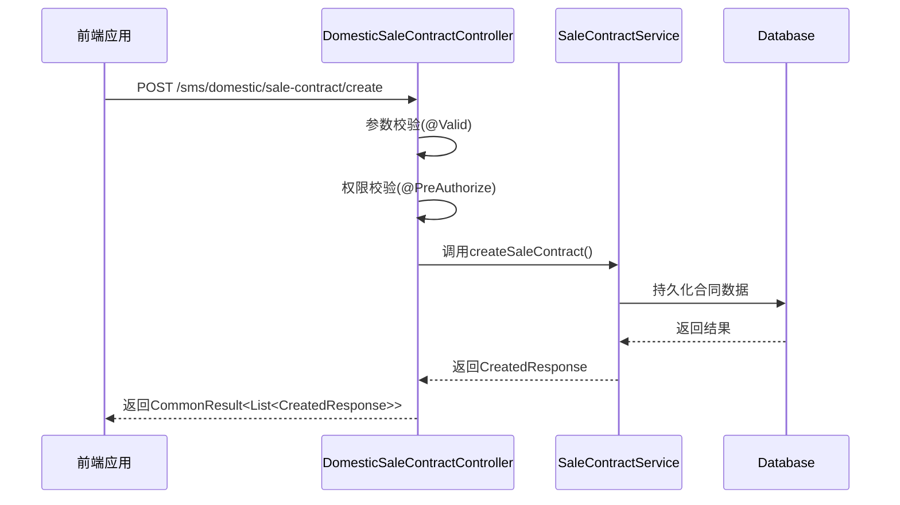
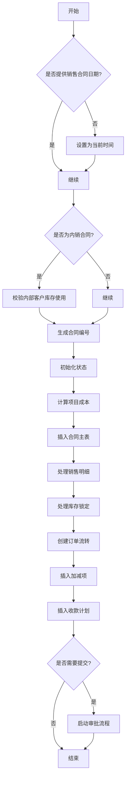
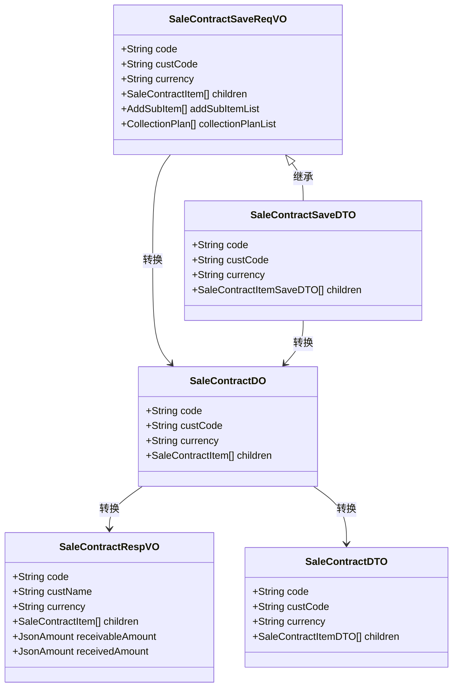
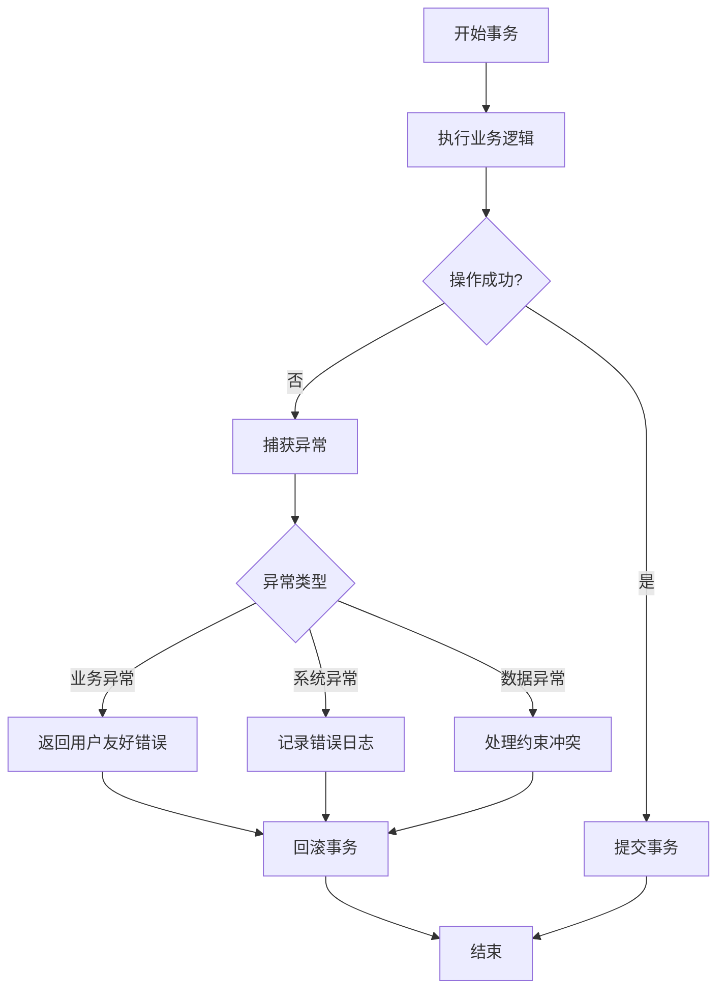

# 销售合同创建流程

<cite>
**本文档引用的文件**  
- [SaleContractApi.java](file://eplus-module-sms/eplus-module-sms-api/src/main/java/com/syj/eplus/module/sms/api/SaleContractApi.java)
- [DomesticSaleContractController.java](file://eplus-module-sms/eplus-module-sms-biz/src/main/java/com/syj/eplus/module/sms/controller/admin/salecontract/DomesticSaleContractController.java)
- [SaleContractService.java](file://eplus-module-sms/eplus-module-sms-biz/src/main/java/com/syj/eplus/module/sms/service/salecontract/SaleContractService.java)
- [SaleContractServiceImpl.java](file://eplus-module-sms/eplus-module-sms-biz/src/main/java/com/syj/eplus/module/sms/service/salecontract/SaleContractServiceImpl.java)
- [SaleContractSaveDTO.java](file://eplus-module-sms/eplus-module-sms-api/src/main/java/com/syj/eplus/module/sms/api/dto/SaleContractSaveDTO.java)
- [SaleContractDTO.java](file://eplus-module-sms/eplus-module-sms-api/src/main/java/com/syj/eplus/module/sms/api/dto/SaleContractDTO.java)
- [SaleContractSaveReqVO.java](file://eplus-module-sms/eplus-module-sms-biz/src/main/java/com/syj/eplus/module/sms/controller/admin/salecontract/vo/SaleContractSaveReqVO.java)
- [SaleContractConvert.java](file://eplus-module-sms/eplus-module-sms-biz/src/main/java/com/syj/eplus/module/sms/convert/salecontract/SaleContractConvert.java)
- [SaleContractDO.java](file://eplus-module-sms/eplus-module-sms-biz/src/main/java/com/syj/eplus/module/sms/dal/dataobject/salecontract/SaleContractDO.java)
- [SaleContractItem.java](file://eplus-module-sms/eplus-module-sms-biz/src/main/java/com/syj/eplus/module/sms/dal/dataobject/salecontractitem/SaleContractItem.java)
</cite>

## 目录
1. [销售合同创建流程概述](#销售合同创建流程概述)
2. [控制器层实现逻辑](#控制器层实现逻辑)
3. [服务层核心业务逻辑](#服务层核心业务逻辑)
4. [DTO对象与领域模型转换](#dto对象与领域模型转换)
5. [数据库事务与异常处理](#数据库事务与异常处理)
6. [前端调用示例与API格式](#前端调用示例与api格式)

## 销售合同创建流程概述

销售合同创建流程从用户界面输入开始，经过参数校验、权限控制、业务验证，最终完成数据持久化。整个流程涉及多个组件的协作，包括控制器、服务层、数据访问层以及外部服务调用。系统支持内销、外销和工厂销售合同的创建，并通过工作流引擎实现审批流程的自动化管理。

**Section sources**
- [DomesticSaleContractController.java](file://eplus-module-sms/eplus-module-sms-biz/src/main/java/com/syj/eplus/module/sms/controller/admin/salecontract/DomesticSaleContractController.java#L49-L54)
- [SaleContractServiceImpl.java](file://eplus-module-sms/eplus-module-sms-biz/src/main/java/com/syj/eplus/module/sms/service/salecontract/SaleContractServiceImpl.java#L275-L465)

## 控制器层实现逻辑

`DomesticSaleContractController` 类负责处理销售合同创建的HTTP请求。该控制器通过 `@PostMapping("/create")` 注解暴露创建接口，接收 `SaleContractSaveReqVO` 对象作为请求体。



**Diagram sources**
- [DomesticSaleContractController.java](file://eplus-module-sms/eplus-module-sms-biz/src/main/java/com/syj/eplus/module/sms/controller/admin/salecontract/DomesticSaleContractController.java#L49-L54)

**Section sources**
- [DomesticSaleContractController.java](file://eplus-module-sms/eplus-module-sms-biz/src/main/java/com/syj/eplus/module/sms/controller/admin/salecontract/DomesticSaleContractController.java#L49-L54)

## 服务层核心业务逻辑

`SaleContractServiceImpl` 类实现了 `SaleContractService` 接口，包含销售合同创建的核心业务逻辑。`createSaleContract` 方法是创建流程的入口点，执行以下关键步骤：

1. **默认值设置**：如果未提供销售合同日期，则使用当前时间作为默认值。
2. **客户类型校验**：对于内销合同，检查内部客户是否全部使用库存。
3. **合同编号生成**：调用 `genSaleContractCode` 方法生成唯一的销售合同编号。
4. **状态初始化**：设置合同状态为"待提交"，审核状态为"未提交"。
5. **成本计算**：根据配置和汇率信息计算项目成本。
6. **数据持久化**：将合同主表、明细、加减项和收款计划分别插入数据库。
7. **库存锁定**：处理销售明细的库存锁定逻辑。
8. **订单流转**：创建订单流转数据，用于跟踪合同生命周期。
9. **流程提交**：根据提交标志，启动相应的审批流程。



**Diagram sources**
- [SaleContractServiceImpl.java](file://eplus-module-sms/eplus-module-sms-biz/src/main/java/com/syj/eplus/module/sms/service/salecontract/SaleContractServiceImpl.java#L275-L465)

**Section sources**
- [SaleContractServiceImpl.java](file://eplus-module-sms/eplus-module-sms-biz/src/main/java/com/syj/eplus/module/sms/service/salecontract/SaleContractServiceImpl.java#L275-L465)

## DTO对象与领域模型转换

系统使用 MapStruct 映射框架实现 DTO 对象与领域模型之间的转换。`SaleContractConvert` 接口定义了各种转换方法，确保数据在不同层之间正确传递。

### 主要DTO对象

| DTO对象 | 用途 | 关键字段 |
|--------|------|---------|
| SaleContractSaveReqVO | 接收前端创建请求 | code, custCode, currency, children, addSubItemList, collectionPlanList |
| SaleContractSaveDTO | 服务间调用的数据传输 | 继承自ReqVO，用于API接口 |
| SaleContractDTO | 返回给前端的响应数据 | 包含完整的合同信息及明细 |

### 转换过程

1. **控制器到服务层**：`SaleContractSaveReqVO` 转换为 `SaleContractDO` 领域模型
2. **服务层到持久层**：`SaleContractDO` 直接用于数据库操作
3. **持久层到服务层**：数据库记录映射回 `SaleContractDO`
4. **服务层到控制器**：`SaleContractDO` 转换为 `SaleContractRespVO` 响应对象



**Diagram sources**
- [SaleContractSaveReqVO.java](file://eplus-module-sms/eplus-module-sms-biz/src/main/java/com/syj/eplus/module/sms/controller/admin/salecontract/vo/SaleContractSaveReqVO.java#L19-L353)
- [SaleContractSaveDTO.java](file://eplus-module-sms/eplus-module-sms-api/src/main/java/com/syj/eplus/module/sms/api/dto/SaleContractSaveDTO.java#L19-L421)
- [SaleContractDTO.java](file://eplus-module-sms/eplus-module-sms-api/src/main/java/com/syj/eplus/module/sms/api/dto/SaleContractDTO.java#L16-L422)
- [SaleContractDO.java](file://eplus-module-sms/eplus-module-sms-biz/src/main/java/com/syj/eplus/module/sms/dal/dataobject/salecontract/SaleContractDO.java#L38-L664)
- [SaleContractConvert.java](file://eplus-module-sms/eplus-module-sms-biz/src/main/java/com/syj/eplus/module/sms/convert/salecontract/SaleContractConvert.java#L48-L57)

**Section sources**
- [SaleContractSaveReqVO.java](file://eplus-module-sms/eplus-module-sms-biz/src/main/java/com/syj/eplus/module/sms/controller/admin/salecontract/vo/SaleContractSaveReqVO.java#L19-L353)
- [SaleContractSaveDTO.java](file://eplus-module-sms/eplus-module-sms-api/src/main/java/com/syj/eplus/module/sms/api/dto/SaleContractSaveDTO.java#L19-L421)
- [SaleContractDTO.java](file://eplus-module-sms/eplus-module-sms-api/src/main/java/com/syj/eplus/module/sms/api/dto/SaleContractDTO.java#L16-L422)
- [SaleContractDO.java](file://eplus-module-sms/eplus-module-sms-biz/src/main/java/com/syj/eplus/module/sms/dal/dataobject/salecontract/SaleContractDO.java#L38-L664)
- [SaleContractConvert.java](file://eplus-module-sms/eplus-module-sms-biz/src/main/java/com/syj/eplus/module/sms/convert/salecontract/SaleContractConvert.java#L48-L57)

## 数据库事务与异常处理

销售合同创建过程采用声明式事务管理，通过 `@Transactional(rollbackFor = Exception.class)` 注解确保数据一致性。整个创建流程在一个数据库事务中执行，任何步骤失败都会导致事务回滚。

### 事务边界

事务从 `SaleContractServiceImpl.createSaleContract` 方法开始，覆盖以下操作：
- 主合同记录插入
- 销售明细记录插入
- 加减项记录插入
- 收款计划记录插入
- 订单流转记录创建
- 库存锁定操作

### 异常处理策略

系统采用分层异常处理机制：

1. **业务异常**：使用自定义异常类，如 `INTERNAL_CUST_NOT_ALL_STOCK`、`SALE_CONTRACT_ITEM_LOCK_EXCEED` 等，提供明确的错误信息。
2. **系统异常**：捕获运行时异常，记录详细日志，并向用户返回友好的错误提示。
3. **数据完整性异常**：处理唯一约束冲突、外键约束等数据库层面的异常。



**Diagram sources**
- [SaleContractServiceImpl.java](file://eplus-module-sms/eplus-module-sms-biz/src/main/java/com/syj/eplus/module/sms/service/salecontract/SaleContractServiceImpl.java#L274-L275)
- [SaleContractServiceImpl.java](file://eplus-module-sms/eplus-module-sms-biz/src/main/java/com/syj/eplus/module/sms/service/salecontract/SaleContractServiceImpl.java#L354-L396)

**Section sources**
- [SaleContractServiceImpl.java](file://eplus-module-sms/eplus-module-sms-biz/src/main/java/com/syj/eplus/module/sms/service/salecontract/SaleContractServiceImpl.java#L274-L275)
- [SaleContractServiceImpl.java](file://eplus-module-sms/eplus-module-sms-biz/src/main/java/com/syj/eplus/module/sms/service/salecontract/SaleContractServiceImpl.java#L354-L396)

## 前端调用示例与API格式

### API请求格式

```json
POST /sms/domestic/sale-contract/create
Content-Type: application/json

{
  "code": "DT24C0001C",
  "custCode": "CUST001",
  "custName": "客户名称",
  "currency": "USD",
  "saleType": 1,
  "children": [
    {
      "skuCode": "SKU001",
      "name": "产品名称",
      "quantity": 100,
      "unitPrice": {
        "amount": 10.5,
        "currency": "USD"
      },
      "currentLockQuantity": 50
    }
  ],
  "addSubItemList": [
    {
      "calculationType": 1,
      "amount": {
        "amount": 100,
        "currency": "USD"
      },
      "remark": "加项说明"
    }
  ],
  "collectionPlanList": [
    {
      "collectionRatio": 30,
      "collectionDate": "2024-12-31T00:00:00"
    }
  ],
  "submitFlag": 1
}
```

### API响应格式

```json
{
  "code": 0,
  "msg": "成功",
  "data": [
    {
      "id": 12345,
      "code": "DT24C0001C"
    }
  ]
}
```

### 前端调用示例

```javascript
// 使用axios调用销售合同创建API
async function createSaleContract(contractData) {
  try {
    const response = await axios.post('/sms/domestic/sale-contract/create', contractData);
    
    if (response.data.code === 0) {
      console.log('合同创建成功:', response.data.data);
      // 处理成功逻辑
    } else {
      console.error('合同创建失败:', response.data.msg);
      // 处理错误逻辑
    }
  } catch (error) {
    console.error('请求异常:', error);
    // 处理网络异常
  }
}

// 调用示例
const contractData = {
  code: 'DT24C0001C',
  custCode: 'CUST001',
  currency: 'USD',
  saleType: 1,
  children: [{
    skuCode: 'SKU001',
    name: '产品名称',
    quantity: 100,
    unitPrice: { amount: 10.5, currency: 'USD' }
  }],
  submitFlag: 1
};

createSaleContract(contractData);
```

**Section sources**
- [DomesticSaleContractController.java](file://eplus-module-sms/eplus-module-sms-biz/src/main/java/com/syj/eplus/module/sms/controller/admin/salecontract/DomesticSaleContractController.java#L52-L54)
- [SaleContractSaveReqVO.java](file://eplus-module-sms/eplus-module-sms-biz/src/main/java/com/syj/eplus/module/sms/controller/admin/salecontract/vo/SaleContractSaveReqVO.java#L19-L353)