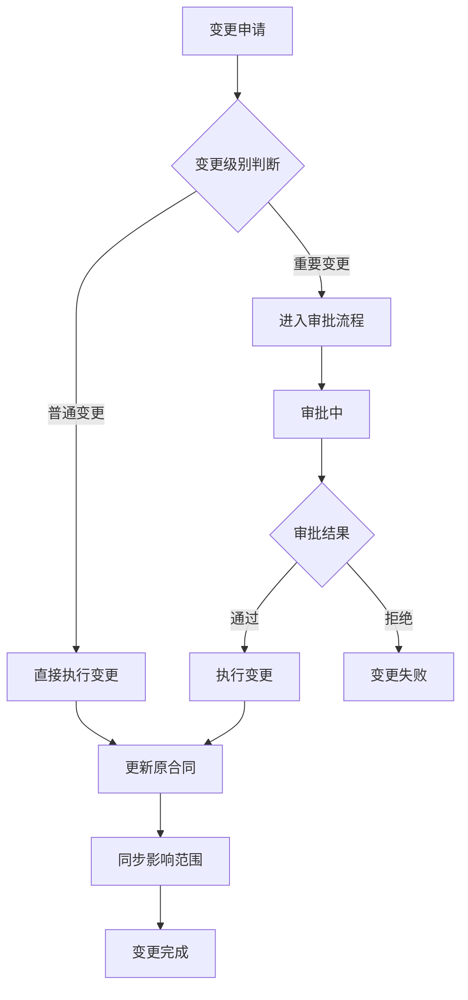
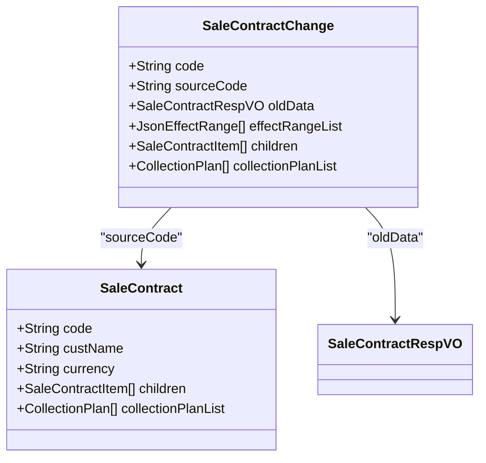
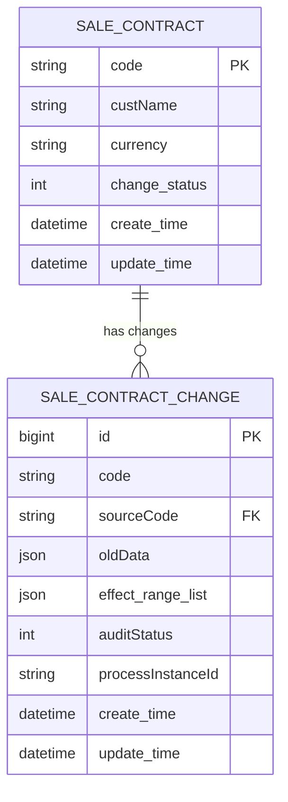
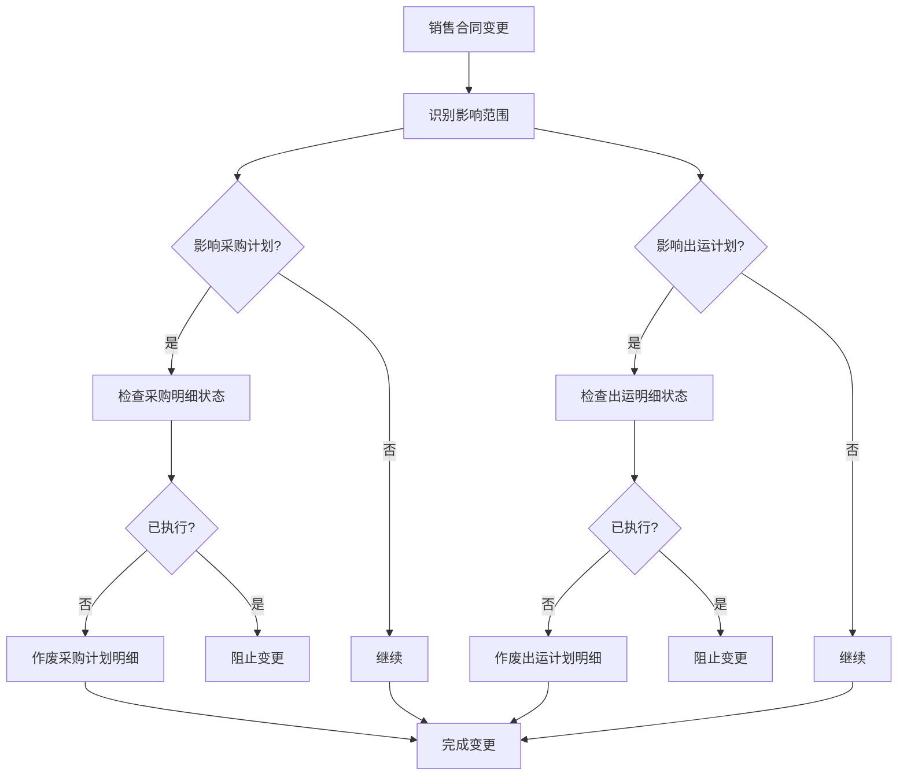
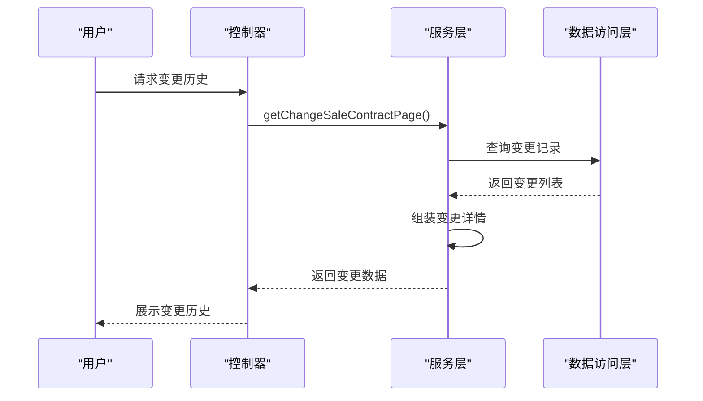
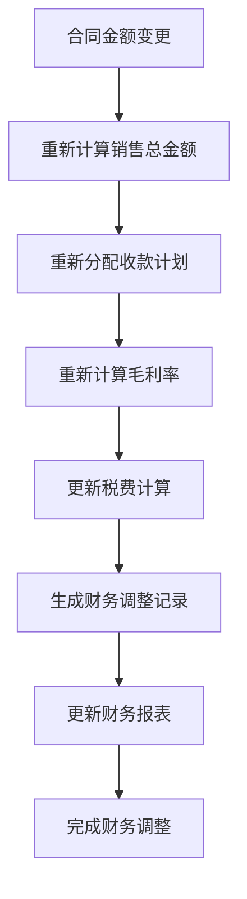

# 销售合同变更管理

<cite>
**本文档引用文件**   
- [SaleContractApi.java](file://eplus-module-sms/eplus-module-sms-api/src/main/java/com/syj/eplus/module/sms/api/SaleContractApi.java)
- [SaleContractApiImpl.java](file://eplus-module-sms/eplus-module-sms-biz/src/main/java/com/syj/eplus/module/sms/api/SaleContractApiImpl.java)
- [SaleContractServiceImpl.java](file://eplus-module-sms/eplus-module-sms-biz/src/main/java/com/syj/eplus/module/sms/service/salecontract/SaleContractServiceImpl.java)
- [SaleContractChange.java](file://eplus-module-sms/eplus-module-sms-biz/src/main/java/com/syj/eplus/module/sms/dal/dataobject/salecontractchange/SaleContractChange.java)
- [DomesticSaleContractController.java](file://eplus-module-sms/eplus-module-sms-biz/src/main/java/com/syj/eplus/module/sms/controller/admin/salecontract/DomesticSaleContractController.java)
- [V1_0_0_123__销售变更表.sql](file://eplus-flyway/src/main/resources/db/migration/common/V1_0_0_123__销售变更表.sql)
- [V1_0_0_124__销售合同新增变更相关字段.java](file://eplus-flyway/src/main/java/db/migration/common/V1_0_0_124__销售合同新增变更相关字段.java)
</cite>

## 目录
1. [变更生命周期管理](#变更生命周期管理)
2. [变更单与原合同数据关联机制](#变更单与原合同数据关联机制)
3. [版本控制与数据快照](#版本控制与数据快照)
4. [变更对相关业务单据的影响处理](#变更对相关业务单据的影响处理)
5. [变更历史查询功能](#变更历史查询功能)
6. [财务数据调整逻辑](#财务数据调整逻辑)

## 变更生命周期管理

销售合同变更管理遵循完整的生命周期流程，包括变更申请、审批和执行三个阶段。系统通过`SaleContractChange`实体类实现变更单的完整数据结构，支持对销售合同各项内容的变更操作。

变更申请由用户发起，通过`changeSaleContract`方法创建变更请求。系统会自动比对变更前后的字段差异，并根据配置决定是否需要进入审批流程。对于普通级别的变更，系统可直接执行；对于重要变更，则需要进入工作流审批。

审批流程通过BPM系统实现，不同类型的销售合同（内销、外销、工厂）对应不同的审批流程定义。审批通过后，系统自动执行变更操作，更新原合同数据并同步影响相关业务单据。

**变更生命周期流程图**

**变更流程来源**
- [SaleContractServiceImpl.java](file://eplus-module-sms/eplus-module-sms-biz/src/main/java/com/syj/eplus/module/sms/service/salecontract/SaleContractServiceImpl.java#L1984-L2018)
- [DomesticSaleContractController.java](file://eplus-module-sms/eplus-module-sms-biz/src/main/java/com/syj/eplus/module/sms/controller/admin/salecontract/DomesticSaleContractController.java#L164-L178)

## 变更单与原合同数据关联机制

系统通过`SaleContractChange`实体类与原销售合同建立完整关联。变更单中包含`sourceCode`字段记录原合同编号，`oldData`字段保存变更前的完整合同数据快照，实现变更前后数据的精确对比。

差异对比功能通过`ChangeCompareUtil`工具类实现，能够自动识别并记录变更的字段。系统支持对主表字段、销售明细、加减项、收款计划等多维度数据的变更比对。每个变更字段在`FormChangeDTO`配置中定义了影响范围，确保变更能够正确传递到相关业务模块。

**数据关联关系图**

**数据关联来源**
- [SaleContractChange.java](file://eplus-module-sms/eplus-module-sms-biz/src/main/java/com/syj/eplus/module/sms/dal/dataobject/salecontractchange/SaleContractChange.java)
- [SaleContractServiceImpl.java](file://eplus-module-sms/eplus-module-sms-biz/src/main/java/com/syj/eplus/module/sms/service/salecontract/SaleContractServiceImpl.java#L1952-L1967)

## 版本控制与数据快照

系统通过数据库表结构和实体设计实现完整的版本控制机制。`sms_sale_contract_change`表专门用于存储所有变更记录，每个变更单都有唯一的编号和创建时间戳，形成完整的变更历史版本链。

数据快照功能通过JSON字段实现，`oldData`字段以JSON格式保存变更前的完整合同数据，包括所有子表数据。同时，`effect_range_list`字段记录变更的影响范围，确保能够追溯每次变更的影响路径。

系统还实现了变更状态管理，在原合同表中新增`change_status`字段，用于标识合同当前的变更状态（如正常、变更中等），防止并发变更冲突。

**版本控制数据模型**

**版本控制来源**
- [V1_0_0_123__销售变更表.sql](file://eplus-flyway/src/main/resources/db/migration/common/V1_0_0_123__销售变更表.sql)
- [V1_0_0_124__销售合同新增变更相关字段.java](file://eplus-flyway/src/main/java/db/migration/common/V1_0_0_124__销售合同新增变更相关字段.java)

## 变更对相关业务单据的影响处理

变更处理过程中，系统会自动识别并处理对相关业务单据的影响。通过`effectRangeList`字段定义影响范围，主要包括采购计划、出运计划等下游单据。

当销售合同变更影响到已生成的采购计划时，系统会根据变更内容决定是否需要作废原采购计划明细。如果销售明细被删除或数量减少，且对应的采购明细尚未执行，则自动作废相关采购计划。对于部分变更的情况，系统会进行校验并阻止不合规的变更操作。

出运计划的处理逻辑类似，系统会检查变更是否影响已生成的出运计划，并根据配置决定是否需要作废或调整出运计划。

**影响处理流程**

**影响处理来源**
- [SaleContractServiceImpl.java](file://eplus-module-sms/eplus-module-sms-biz/src/main/java/com/syj/eplus/module/sms/service/salecontract/SaleContractServiceImpl.java#L2070-L2143)
- [SaleContractChange.java](file://eplus-module-sms/eplus-module-sms-biz/src/main/java/com/syj/eplus/module/sms/dal/dataobject/salecontractchange/SaleContractChange.java#L452-L459)

## 变更历史查询功能

系统提供完整的变更历史查询功能，支持通过时间轴展示和操作记录追踪两种方式查看变更历史。`getChangeSaleContractPage`方法提供分页查询接口，返回变更单的基本信息列表。

详细查询通过`getSaleContractChangeDetail`方法实现，返回包含完整变更前后数据对比的详细信息。系统记录了每次变更的操作日志，包括操作人、操作时间、变更内容等关键信息，便于审计追踪。

时间轴展示功能将变更历史按时间顺序排列，直观显示合同的演变过程。用户可以点击任意变更记录查看详细的变更差异，系统会高亮显示变更的字段和变更前后的值。

**变更历史查询接口**

**变更历史来源**
- [SaleContractService.java](file://eplus-module-sms/eplus-module-sms-biz/src/main/java/com/syj/eplus/module/sms/service/salecontract/SaleContractService.java#L198-L207)
- [DomesticSaleContractController.java](file://eplus-module-sms/eplus-module-sms-biz/src/main/java/com/syj/eplus/module/sms/controller/admin/salecontract/DomesticSaleContractController.java#L180-L188)

## 财务数据调整逻辑

变更过程中涉及的财务数据调整主要包括金额、税率等关键财务指标的变化处理。系统通过`JsonAmount`对象统一管理金额数据，确保货币类型、汇率等财务信息的完整性。

当合同金额变更时，系统会自动重新计算相关财务指标，包括：
- 销售总金额及各币种换算
- 收款计划的重新分配
- 毛利率的重新计算
- 税费的重新计算

对于税率变更，系统会根据新的税率重新计算含税金额和税额，并更新相关财务报表。所有财务数据的变更都会记录在操作日志中，确保财务数据的可追溯性。

**财务数据调整流程**

**财务数据来源**
- [SaleContractChange.java](file://eplus-module-sms/eplus-module-sms-biz/src/main/java/com/syj/eplus/module/sms/dal/dataobject/salecontractchange/SaleContractChange.java#L311-L380)
- [SaleContractServiceImpl.java](file://eplus-module-sms/eplus-module-sms-biz/src/main/java/com/syj/eplus/module/sms/service/salecontract/SaleContractServiceImpl.java#L1984-L2000)