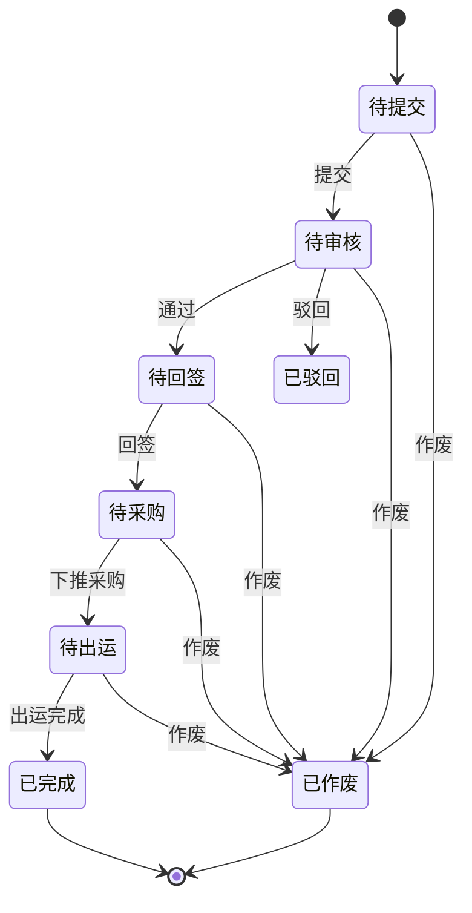

# 销售合同管理

<cite>
**本文档引用文件**  
- [SaleContractDO.java](file://eplus-module-sms/eplus-module-sms-biz/src/main/java/com/syj/eplus/module/sms/dal/dataobject/salecontract/SaleContractDO.java)
- [SaleContractItem.java](file://eplus-module-sms/eplus-module-sms-biz/src/main/java/com/syj/eplus/module/sms/dal/dataobject/salecontractitem/SaleContractItem.java)
- [SaleContractChange.java](file://eplus-module-sms/eplus-module-sms-biz/src/main/java/com/syj/eplus/module/sms/dal/dataobject/salecontractchange/SaleContractChange.java)
- [SaleContractItemChange.java](file://eplus-module-sms/eplus-module-sms-biz/src/main/java/com/syj/eplus/module/sms/dal/dataobject/salecontractchange/SaleContractItemChange.java)
- [SaleContractMapper.xml](file://eplus-module-sms/eplus-module-sms-biz/src/main/resources/mapper/salecontract/SaleContractMapper.xml)
- [SaleContractItemMapper.xml](file://eplus-module-sms/eplus-module-sms-biz/src/main/resources/mapper/salecontractitem/SaleContractItemMapper.xml)
- [SaleContractStatusEnum.java](file://eplus-framework/eplus-common/src/main/java/com/syj/eplus/framework/common/enums/SaleContractStatusEnum.java)
- [DomesticSaleContractController.java](file://eplus-module-sms/eplus-module-sms-biz/src/main/java/com/syj/eplus/module/sms/controller/admin/salecontract/DomesticSaleContractController.java)
- [ExportSaleContractController.java](file://eplus-module-sms/eplus-module-sms-biz/src/main/java/com/syj/eplus/module/sms/controller/admin/salecontract/ExportSaleContractController.java)
</cite>

## 目录
1. [引言](#引言)
2. [销售合同数据模型设计](#销售合同数据模型设计)
3. [合同状态流转机制](#合同状态流转机制)
4. [财务相关字段设计](#财务相关字段设计)
5. [MyBatis映射文件关键查询分析](#mybatis映射文件关键查询分析)
6. [合同变更管理数据结构](#合同变更管理数据结构)
7. [实体关联关系](#实体关联关系)

## 引言
本文档详细阐述销售合同管理模块的数据模型设计，涵盖销售合同主表与明细表的结构设计、字段定义及约束关系。文档解释了合同状态的流转机制、财务相关字段的设计（如合同金额计算、币种处理、汇率转换等），并提供MyBatis映射文件中关键查询语句的分析。此外，文档还说明了合同变更管理的数据结构设计以及与客户、产品、报价等实体的关联关系。

## 销售合同数据模型设计

### 销售合同主表设计
销售合同主表（`SaleContractDO`）是销售合同管理的核心实体，存储合同的基本信息和财务汇总数据。该表通过`id`字段作为主键，`code`字段作为业务编号，确保合同的唯一性。

**核心字段说明：**
- **基础信息**：`companyId`（内部法人单位）、`custId`（客户主键）、`custCode`（客户编号）、`custName`（客户名称）、`currency`（交易币别）、`settlementTermType`（价格条款）等字段定义了合同的基本交易信息。
- **财务汇总**：`totalAmount`（销售总金额）、`totalPurchase`（采购合计）、`orderGrossProfit`（订单毛利）、`grossProfitMargin`（毛利率）等字段存储了合同的财务汇总信息，支持快速查询和报表生成。
- **状态与流程**：`status`（状态）、`auditStatus`（审核状态）、`processInstanceId`（流程id）等字段用于管理合同的生命周期和审批流程。

```mermaid
erDiagram
SALE_CONTRACT {
long id PK
string code UK
integer confirmFlag
long companyId
string companyName
long custId
string custCode
string custName
string currency
string settlementTermType
long settlementId
string settlementName
long custCountryId
string custCountryName
string custPo
integer agentFlag
long collectedCustId
string collectedCustCode
string collectedCustName
long receiveCustId
string receiveCustCode
string receiveCustName
UserDept sales
List<SimpleFile> annex
LocalDateTime inputDate
long tradeCountryId
string tradeCountryName
string tradeCountryArea
long departureCountryId
string departureCountryName
string departureCountryArea
long departurePortId
string departurePortName
long destinationPortId
string destinationPortName
integer transportType
LocalDateTime custDeliveryDate
integer twentyFootCabinetNum
integer fortyFootCabinetNum
integer fortyFootContainerNum
BigDecimal bulkHandlingVolume
JsonAmount trailerFee
JsonAmount estimatedTotalFreight
integer bookingFlag
JsonAmount commission
JsonAmount platformFee
JsonAmount insuranceFee
JsonAmount lumpSumFee
JsonAmount sinosureFee
JsonAmount additionAmount
JsonAmount deductionAmount
JsonAmount inspectionFee
JsonAmount estimatedPackingMaterials
JsonAmount accessoriesPurchaseTotal
integer totalBoxes
JsonWeight totalGrossweight
JsonWeight totalWeight
BigDecimal totalVolume
JsonAmount totalGoodsValue
List<JsonAmount> totalPurchase
JsonAmount totalVatRefund
integer totalQuantity
JsonAmount orderGrossProfit
BigDecimal grossProfitMargin
JsonAmount receivableExchange
integer saleType
integer auditStatus
integer convertPurchaseFlag
LocalDateTime convertPurchaseTime
string processInstanceId
UserDept signBackUser
LocalDateTime signBackDate
integer status
integer changeStatus
integer autoFlag
List<string> linkCodeList
List<SimpleFile> designDraftList
List<SimpleFile> signBackAnnex
integer signBackFlag
string signBackDesc
long collectionAccountId
string collectionAccountBankCode
BigDecimal exchangeRate
long sourceContractId
string sourceContractCode
string deliveryAddress
integer printFlag
integer printTimes
JsonAmount totalAmount
JsonAmount totalAmountUsd
long foreignTradeCompanyId
string genContractUniqueCode
JsonAmount realOrderGrossProfit
BigDecimal realGrossProfitMargin
JsonAmount realPurchaseTotal
BigDecimal realTotalVolume
integer realTwentyFootCabinetNum
integer realFortyFootCabinetNum
integer realFortyFootContainerNum
BigDecimal realBulkHandlingVolume
JsonAmount realEstimatedTotalFreight
integer realTotalBoxes
JsonWeight realTotalGrossweight
JsonWeight realTotalWeight
JsonAmount realTotalVatRefund
JsonAmount realAccessoriesPurchaseTotal
List<UserDept> purchaseUserList
BigDecimal usdRate
LocalDateTime saleContractDate
long syncCode
JsonAmount totalStockCost
JsonAmount collectionTotal
UserDept manager
JsonAmount totalAmountThisCurrency
string remark
}
```

**图表来源**
- [SaleContractDO.java](file://eplus-module-sms/eplus-module-sms-biz/src/main/java/com/syj/eplus/module/sms/dal/dataobject/salecontract/SaleContractDO.java#L33-L666)

**本节来源**
- [SaleContractDO.java](file://eplus-module-sms/eplus-module-sms-biz/src/main/java/com/syj/eplus/module/sms/dal/dataobject/salecontract/SaleContractDO.java#L33-L666)

### 销售合同明细表设计
销售合同明细表（`SaleContractItem`）存储合同中每个产品的详细信息，与主表通过`contractId`字段关联。该表支持一对多的关系，一个合同可以包含多个产品明细。

**核心字段说明：**
- **产品信息**：`skuCode`（产品编号）、`basicSkuCode`（基础产品编号）、`name`（中文品名）、`nameEng`（英文品名）、`mainPicture`（图片）等字段定义了产品的基本信息。
- **数量与价格**：`quantity`（数量）、`unitPrice`（销售单价）、`totalSaleAmount`（外销总金额）、`purchaseUnitPrice`（采购单价）、`purchaseWithTaxPrice`（含税单价）等字段用于计算合同的财务数据。
- **采购与库存**：`venderId`（供应商id）、`venderName`（供应商名称）、`inventoryQuantity`（库存）、`currentLockQuantity`（锁定数量）、`realLockQuantity`（真实锁定数量）等字段用于管理采购和库存。
- **状态与标识**：`status`（状态）、`convertShipmentFlag`（转出运标识）、`convertPurchaseFlag`（转采购标识）、`billStatus`（入库状态）等字段用于跟踪明细的执行状态。

```mermaid
erDiagram
SALE_CONTRACT_ITEM {
long id PK
integer sortNum
long contractId FK
string contractCode
string skuCode
string basicSkuCode
string name
string nameEng
SimpleFile mainPicture
string thumbnail
string cskuCode
integer quantity
JsonAmount unitPrice
JsonAmount totalSaleAmount
JsonAmount purchaseUnitPrice
JsonAmount realPurchaseWithTaxPrice
JsonAmount purchasePackagingPrice
JsonAmount purchaseShippingPrice
JsonAmount purchaseWithTaxPrice
JsonAmount purchaseTotalPrice
string purchaseCurrency
string venderName
long venderId
string venderCode
integer commissionType
BigDecimal commissionRate
integer commissionSubTotal
JsonAmount commissionAmount
integer inventoryQuantity
integer currentLockQuantity
integer realLockQuantity
integer realPurchaseQuantity
integer needPurQuantity
string unit
JsonAmount orderGrossProfit
BigDecimal orderGrossProfitRate
LocalDateTime venderDeliveryDate
integer qtyPerOuterbox
integer qtyPerInnerbox
integer boxCount
BigDecimal volume
integer reorderFlag
string hsCode
List<long> packageType
BigDecimal taxRefundRate
BigDecimal realTaxRefundRate
JsonAmount taxRefundPrice
JsonAmount inspectionFee
JsonAmount fundOccupancyFee
JsonAmount trailerFee
integer bookingFlag
JsonAmount insuranceFee
JsonAmount platformFee
JsonAmount forecastTotalCost
JsonAmount innerCalcPrice
JsonAmount sinosureFee
integer status
UserDept purchaseUser
integer changeFlag
long skuId
integer ownBrandFlag
integer custProFlag
integer skuType
integer commodityInspectionFlag
integer shippedQuantity
integer transferShippedQuantity
string uniqueCode
string sourceUniqueCode
string hsMeasureUnit
integer billStatus
integer abnormalStatus
string abnormalRemark
integer billQuantity
integer convertShipmentFlag
UserDept manager
integer shipmentTotalQuantity
integer skuDeletedFlag
integer convertPurchaseFlag
List<JsonLock> lockMsg
integer reLockFlag
List<long> companyIdList
BigDecimal taxRate
integer measureUnit
integer splitFlag
integer splitPurchaseFlag
integer splitPurchaseQuantity
List<SplitPurchase> splitPurchaseList
long purchaseCompanyId
long purchaseUserId
JsonAmount stockLockPrice
JsonAmount stockLockTotalPrice
integer converNoticeFlag
string purchaseContractCode
UserDept sales
List<JsonSpecificationEntity> specificationList
integer splitBoxFlag
string realPrchaseCurrency
JsonAmount realPackagingPrice
JsonAmount realShippingPrice
List<JsonSpecificationEntity> realSpecificationList
integer realSplitBoxFlag
long realVenderId
string realVenderName
string realVenderCode
JsonAmount realTaxRefundPrice
integer realBoxCount
integer freeFlag
integer purchaseFreeQuantity
JsonAmount withTaxPriceRemoveFree
long syncCode
string oskuCode
string barcode
JsonAmount totalSaleAmountUsd
}
```

**图表来源**
- [SaleContractItem.java](file://eplus-module-sms/eplus-module-sms-biz/src/main/java/com/syj/eplus/module/sms/dal/dataobject/salecontractitem/SaleContractItem.java#L39-L795)

**本节来源**
- [SaleContractItem.java](file://eplus-module-sms/eplus-module-sms-biz/src/main/java/com/syj/eplus/module/sms/dal/dataobject/salecontractitem/SaleContractItem.java#L39-L795)

## 合同状态流转机制
销售合同的状态流转通过`SaleContractStatusEnum`枚举类定义，涵盖了合同从创建到完成或作废的整个生命周期。状态流转由业务逻辑和审批流程驱动，确保合同的合规性和可追溯性。

**状态定义：**
- **待提交 (1)**: 合同创建后，尚未提交审批。
- **待审核 (2)**: 合同已提交，等待审批。
- **待回签 (3)**: 合同已通过审批，等待客户回签。
- **已驳回 (4)**: 合同审批被驳回。
- **待采购 (5)**: 合同已回签，可以下推采购计划。
- **待出运 (6)**: 采购完成，等待出运。
- **已完成 (7)**: 合同所有流程完成。
- **已作废 (8)**: 合同被作废。

**流转机制：**
- **提交**：通过`DomesticSaleContractController`或`ExportSaleContractController`的`submitTask`方法，将合同状态从“待提交”变为“待审核”。
- **审批**：通过`approveTask`或`rejectTask`方法，将合同状态从“待审核”变为“待回签”或“已驳回”。
- **回签**：通过`signBackSaleContract`方法，将合同状态从“待回签”变为“待采购”。
- **作废**：通过`closeSaleContract`方法，将合同状态变为“已作废”。
- **完成**：通过`orderDone`方法，将合同状态变为“已完成”。



**图表来源**
- [SaleContractStatusEnum.java](file://eplus-framework/eplus-common/src/main/java/com/syj/eplus/framework/common/enums/SaleContractStatusEnum.java#L13-L28)
- [DomesticSaleContractController.java](file://eplus-module-sms/eplus-module-sms-biz/src/main/java/com/syj/eplus/module/sms/controller/admin/salecontract/DomesticSaleContractController.java#L133-L138)
- [ExportSaleContractController.java](file://eplus-module-sms/eplus-module-sms-biz/src/main/java/com/syj/eplus/module/sms/controller/admin/salecontract/ExportSaleContractController.java#L222-L227)

**本节来源**
- [SaleContractStatusEnum.java](file://eplus-framework/eplus-common/src/main/java/com/syj/eplus/framework/common/enums/SaleContractStatusEnum.java#L13-L28)
- [DomesticSaleContractController.java](file://eplus-module-sms/eplus-module-sms-biz/src/main/java/com/syj/eplus/module/sms/controller/admin/salecontract/DomesticSaleContractController.java#L133-L138)
- [ExportSaleContractController.java](file://eplus-module-sms/eplus-module-sms-biz/src/main/java/com/syj/eplus/module/sms/controller/admin/salecontract/ExportSaleContractController.java#L222-L227)

## 财务相关字段设计
销售合同的财务相关字段设计旨在支持复杂的财务计算和多币种处理，确保合同金额的准确性和一致性。

### 合同金额计算逻辑
合同金额的计算主要在`SaleContractItem`表中完成，通过`quantity`（数量）和`unitPrice`（销售单价）计算`totalSaleAmount`（外销总金额）。采购金额通过`purchaseUnitPrice`（采购单价）和`quantity`计算。订单毛利通过`totalSaleAmount`减去`purchaseTotalPrice`（含税含包装总价）计算。

### 币种处理与汇率转换
系统支持多币种交易，`currency`字段定义了合同的交易币别。汇率转换在创建或更新合同时进行，`exchangeRate`字段存储了创建时的汇率，用于将外币金额转换为本币金额。`usdRate`字段用于将金额转换为美元。

**关键字段：**
- `currency`: 交易币别。
- `exchangeRate`: 创建时汇率。
- `usdRate`: 美元汇率。
- `totalAmountThisCurrency`: 销售总金额(原币种)。

## MyBatis映射文件关键查询分析
MyBatis映射文件定义了数据库操作的SQL语句，支持复杂的查询和数据操作。

### 合同列表查询
`SaleContractItemMapper.xml`中的`selectProductModePage`查询用于获取产品模式的合同列表。该查询通过`FIND_IN_SET`函数优化了`IN`查询的性能，并通过`LEFT JOIN`关联主表和明细表，支持复杂的筛选条件。

```xml
<select id="selectProductModePage" resultMap="SaleContractProductModeResultMap">
    SELECT
        i.id AS id,
        c.id AS contractId,
        c.code,
        ...
    FROM sms_sale_contract_item i
    LEFT JOIN sms_sale_contract c ON i.contract_id = c.id
    <where>
        c.deleted = 0 AND i.deleted = 0
        <if test="req.basicSkuCode != null and req.basicSkuCode != ''">
            AND i.basic_sku_code LIKE CONCAT('%', #{req.basicSkuCode}, '%')
        </if>
        ...
    </where>
    ORDER BY c.id DESC, i.sort_num ASC
</select>
```

### 合同详情查询
`SaleContractMapper.xml`中的`selectById`查询用于获取合同的详细信息。该查询通过`id`字段精确匹配，返回合同的完整信息。

```xml
<select id="selectById" parameterType="long" resultMap="SaleContractResultMap">
    SELECT * FROM sms_sale_contract WHERE id = #{id} AND deleted = 0
</select>
```

**本节来源**
- [SaleContractMapper.xml](file://eplus-module-sms/eplus-module-sms-biz/src/main/resources/mapper/salecontract/SaleContractMapper.xml)
- [SaleContractItemMapper.xml](file://eplus-module-sms/eplus-module-sms-biz/src/main/resources/mapper/salecontractitem/SaleContractItemMapper.xml)

## 合同变更管理数据结构
合同变更管理通过`SaleContractChange`和`SaleContractItemChange`表实现，支持对合同的修改和跟踪。

### 变更主表设计
`SaleContractChange`表存储变更单的主信息，与原合同通过`sourceCode`字段关联。该表包含所有可变更的字段，如`companyName`、`custName`、`currency`等。

### 变更明细表设计
`SaleContractItemChange`表存储变更单的明细信息，与变更主表通过`contractId`字段关联。该表包含`old_`前缀的字段，用于存储变更前的值，支持变更对比。

```mermaid
erDiagram
SALE_CONTRACT_CHANGE {
long id PK
string code UK
string sourceCode FK
long companyId
string companyName
JsonCompanyPath companyPath
long custId
string custCode
string custName
string currency
string settlementTermType
long settlementId
string settlementName
long custCountryId
string custCountryName
string custPo
integer agentFlag
long collectedCustId
string collectedCustCode
string collectedCustName
long receiveCustId
string receiveCustCode
string receiveCustName
UserDept sales
List<SimpleFile> annex
LocalDateTime inputDate
long tradeCountryId
string tradeCountryName
string tradeCountryArea
long departureCountryId
string departureCountryName
string departureCountryArea
long departurePortId
string departurePortName
long destinationPortId
string destinationPortName
integer transportType
LocalDateTime custDeliveryDate
integer twentyFootCabinetNum
integer fortyFootCabinetNum
integer fortyFootContainerNum
BigDecimal bulkHandlingVolume
JsonAmount trailerFee
JsonAmount estimatedTotalFreight
integer bookingFlag
JsonAmount commission
JsonAmount platformFee
JsonAmount insuranceFee
JsonAmount lumpSumFee
JsonAmount sinosureFee
JsonAmount additionAmount
JsonAmount deductionAmount
JsonAmount inspectionFee
JsonAmount estimatedPackingMaterials
JsonAmount accessoriesPurchaseTotal
integer totalBoxes
JsonWeight totalGrossweight
JsonWeight totalWeight
BigDecimal totalVolume
JsonAmount totalGoodsValue
List<JsonAmount> totalPurchase
JsonAmount totalVatRefund
integer totalQuantity
JsonAmount orderGrossProfit
BigDecimal grossProfitMargin
JsonAmount receivableExchange
integer saleType
integer auditStatus
string processInstanceId
List<SaleContractItem> children
List<AddSubItem> addSubItemList
List<CollectionPlan> collectionPlanList
UserDept createUser
List<OperateLogRespDTO> operateLogRespDTOList
string modelKey
SaleContractRespVO oldData
List<JsonEffectRange> effectRangeList
BigDecimal exchangeRate
integer confirmFlag
integer changeFlag
integer status
List<SimpleFile> designDraftList
List<long> cancelPurchasePlanItemIdList
List<long> cancelShipmentPlanItemIdList
LocalDateTime signBackDate
LocalDateTime saleContractDate
JsonAmount collectionTotal
JsonAmount receivableAmount
JsonAmount receivedAmount
JsonAmount unReceivedAmount
JsonAmount totalAmount
JsonAmount totalAmountUsd
BigDecimal usdRate
UserDept manager
JsonAmount totalAmountThisCurrency
string remark
}
SALE_CONTRACT_ITEM_CHANGE {
long id PK
long contractId FK
string skuCode
string basicSkuCode
string name
string nameEng
SimpleFile mainPicture
string cskuCode
integer quantity
JsonAmount unitPrice
JsonAmount totalSaleAmount
JsonAmount unitCost
JsonAmount unitCostRate
JsonAmount totalPurchaseAmount
string purchaseCurrency
string supplierName
integer commissionType
BigDecimal commissionRate
JsonAmount commissionAmount
integer inventoryQuantity
integer purchaseQuantity
string unit
string description
string descriptionEng
JsonAmount orderGrossProfit
BigDecimal orderGrossProfitRate
LocalDateTime venderDeliveryDate
integer qtyPerOuterbox
integer qtyPerInnerbox
integer boxCount
BigDecimal volume
Boolean reorderFlag
string purchaserName
string hsCode
List<long> packageType
BigDecimal taxRefundRate
JsonAmount taxRefundPrice
integer expectCount
integer quantityShipped
JsonAmount inspectionFee
JsonAmount prepayAmount
JsonAmount fundOccupancyFee
JsonAmount trailerFee
integer bookingFlag
JsonAmount insuranceFee
JsonAmount platformFee
JsonAmount forecastTotalCost
JsonAmount innerCalcPrice
JsonAmount sinosureFee
integer status
UserDept purchaseUser
integer changeFlag
JsonAmount purchaseWithTaxPrice
string old_skuCode
string old_basicSkuCode
string old_name
string old_nameEng
SimpleFile old_mainPicture
string old_cskuCode
integer old_quantity
JsonAmount old_unitPrice
JsonAmount old_totalSaleAmount
JsonAmount old_unitCost
JsonAmount old_unitCostRate
JsonAmount old_totalPurchaseAmount
string old_purchaseCurrency
string old_supplierName
integer old_commissionType
BigDecimal old_commissionRate
JsonAmount old_commissionAmount
integer old_inventoryQuantity
integer old_purchaseQuantity
string old_unit
string old_description
string old_descriptionEng
JsonAmount old_orderGrossProfit
BigDecimal old_orderGrossProfitRate
LocalDateTime old_venderDeliveryDate
integer old_qtyPerOuterbox
integer old_qtyPerInnerbox
integer old_boxCount
BigDecimal old_volume
Boolean old_reorderFlag
string old_purchaserName
string old_hsCode
integer old_packageType
BigDecimal old_taxRefundRate
JsonAmount old_taxRefundPrice
integer old_expectCount
integer old_quantityShipped
JsonAmount old_inspectionFee
JsonAmount old_prepayAmount
JsonAmount old_fundOccupancyFee
JsonAmount old_trailerFee
integer old_bookingFlag
JsonAmount old_insuranceFee
JsonAmount old_platformFee
JsonAmount old_forecastTotalCost
JsonAmount old_innerCalcPrice
JsonAmount old_sinosureFee
integer old_status
UserDept old_purchaseUser
JsonAmount old_purchaseWithTaxPrice
string sourceCode
List<JsonEffectRange> effectRangeList
List<JsonSpecificationEntity> specificationList
integer splitBoxFlag
integer old_splitBoxFlag
List<JsonSpecificationEntity> old_specificationList
integer freeFlag
integer freeQuantity
integer purchaseFreeQuantity
}
SALE_CONTRACT_CHANGE ||--o{ SALE_CONTRACT_ITEM_CHANGE : contains
```

**图表来源**
- [SaleContractChange.java](file://eplus-module-sms/eplus-module-sms-biz/src/main/java/com/syj/eplus/module/sms/dal/dataobject/salecontractchange/SaleContractChange.java#L47-L521)
- [SaleContractItemChange.java](file://eplus-module-sms/eplus-module-sms-biz/src/main/java/com/syj/eplus/module/sms/dal/dataobject/salecontractchange/SaleContractItemChange.java#L32-L606)

**本节来源**
- [SaleContractChange.java](file://eplus-module-sms/eplus-module-sms-biz/src/main/java/com/syj/eplus/module/sms/dal/dataobject/salecontractchange/SaleContractChange.java#L47-L521)
- [SaleContractItemChange.java](file://eplus-module-sms/eplus-module-sms-biz/src/main/java/com/syj/eplus/module/sms/dal/dataobject/salecontractchange/SaleContractItemChange.java#L32-L606)

## 实体关联关系
销售合同管理模块与多个实体存在关联关系，确保数据的完整性和一致性。

### 与客户的关联
通过`custId`、`custCode`、`custName`字段与客户实体关联，支持客户信息的查询和验证。

### 与产品的关联
通过`skuId`、`skuCode`、`basicSkuCode`字段与产品实体关联，支持产品信息的查询和历史交易价格的获取。

### 与报价的关联
通过`sourceContractId`、`sourceContractCode`字段与报价单关联，支持从报价单生成销售合同。

**本节来源**
- [SaleContractDO.java](file://eplus-module-sms/eplus-module-sms-biz/src/main/java/com/syj/eplus/module/sms/dal/dataobject/salecontract/SaleContractDO.java#L33-L666)
- [SaleContractItem.java](file://eplus-module-sms/eplus-module-sms-biz/src/main/java/com/syj/eplus/module/sms/dal/dataobject/salecontractitem/SaleContractItem.java#L39-L795)