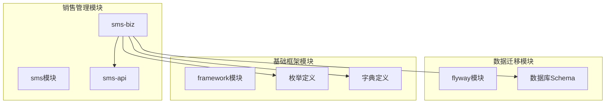
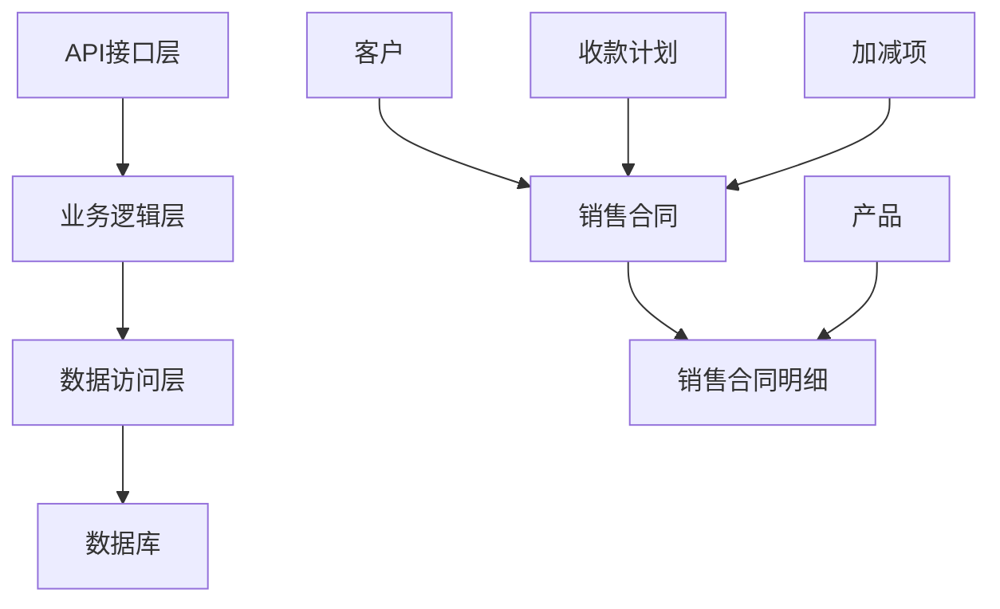
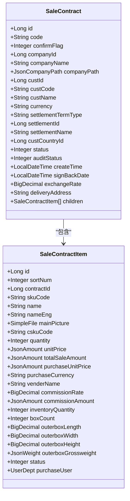
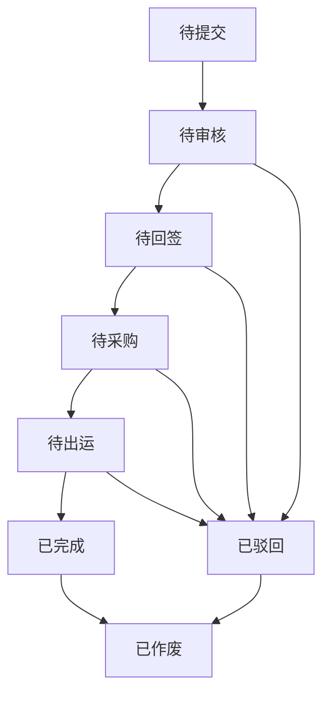
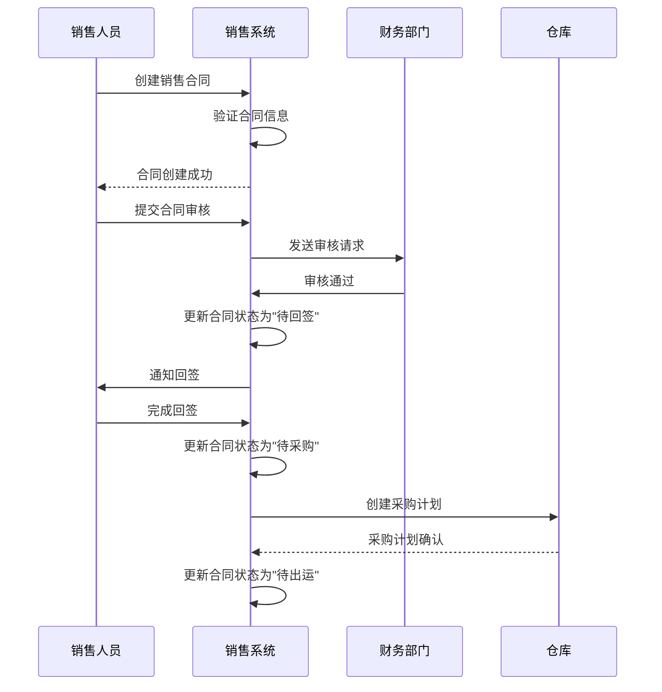
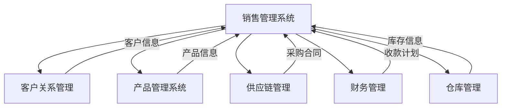

# 销售数据模型

<cite>
**本文档引用的文件**   
- [SaleContractDTO.java](file://eplus-module-sms/eplus-module-sms-api/src/main/java/com/syj/eplus/module/sms/api/dto/SaleContractDTO.java)
- [SaleContractItemDTO.java](file://eplus-module-sms/eplus-module-sms-api/src/main/java/com/syj/eplus/module/sms/api/dto/SaleContractItemDTO.java)
- [SaleContractStatusEnum.java](file://eplus-framework/eplus-common/src/main/java/com/syj/eplus/framework/common/enums/SaleContractStatusEnum.java)
- [SaleContractDict.java](file://eplus-framework/eplus-common/src/main/java/com/syj/eplus/framework/common/dict/SaleContractDict.java)
- [V1_0_0_002__Eplus初始化.sql](file://eplus-flyway/src/main/resources/db/migration/common/V1_0_0_002__Eplus初始化.sql)
- [V1_0_0_123__销售变更表.sql](file://eplus-flyway/src/main/resources/db/migration/common/V1_0_0_123__销售变更表.sql)
- [SaleContractItemMapper.xml](file://eplus-module-sms/eplus-module-sms-biz/src/main/resources/mapper/salecontractitem/SaleContractItemMapper.xml)
- [SaleContractServiceImpl.java](file://eplus-module-sms/eplus-module-sms-biz/src/main/java/com/syj/eplus/module/sms/service/salecontract/SaleContractServiceImpl.java)
</cite>

## 目录
1. [引言](#引言)
2. [项目结构](#项目结构)
3. [核心组件](#核心组件)
4. [架构概述](#架构概述)
5. [详细组件分析](#详细组件分析)
6. [依赖分析](#依赖分析)
7. [性能考虑](#性能考虑)
8. [故障排除指南](#故障排除指南)
9. [结论](#结论)
10. [附录](#附录)（如有必要）

## 引言
本文档详细描述了销售数据模型的设计，重点涵盖销售合同、销售订单和客户管理等核心实体。文档解释了销售业务流程的数据结构，包括报价、合同签订和订单执行等环节的数据流转。通过ER图展示了销售相关表之间的关系，并重点说明了销售合同的状态管理、价格条款和交货条件等关键字段的设计。文档还提供了实际的SQL建表语句和MyBatis Mapper配置示例，为开发者提供销售数据建模的最佳实践和扩展建议。

## 项目结构
销售数据模型主要分布在`eplus-module-sms`模块中，该模块负责销售管理系统的实现。核心数据结构定义在`eplus-flyway`模块的数据库迁移脚本中，而业务逻辑实现在`eplus-module-sms-biz`中。`eplus-framework`模块提供了通用的枚举和字典定义。



**图表来源**
- [V1_0_0_002__Eplus初始化.sql](file://eplus-flyway/src/main/resources/db/migration/common/V1_0_0_002__Eplus初始化.sql)
- [SaleContractDTO.java](file://eplus-module-sms/eplus-module-sms-api/src/main/java/com/syj/eplus/module/sms/api/dto/SaleContractDTO.java)

**章节来源**
- [eplus-module-sms](file://eplus-module-sms)
- [eplus-flyway](file://eplus-flyway)

## 核心组件
销售数据模型的核心组件包括销售合同（SaleContract）、销售合同明细（SaleContractItem）、客户管理以及相关的状态和字典定义。销售合同是销售业务的主实体，包含合同基本信息、客户信息、财务条款和状态信息。销售合同明细则记录了合同中每个产品的详细信息，如数量、价格、包装和交货要求。

**章节来源**
- [SaleContractDTO.java](file://eplus-module-sms/eplus-module-sms-api/src/main/java/com/syj/eplus/module/sms/api/dto/SaleContractDTO.java)
- [SaleContractItemDTO.java](file://eplus-module-sms/eplus-module-sms-api/src/main/java/com/syj/eplus/module/sms/api/dto/SaleContractItemDTO.java)

## 架构概述
销售数据模型采用分层架构设计，上层为API接口层，中间为业务逻辑层，底层为数据访问层。数据模型通过MyBatis与数据库交互，使用Flyway进行数据库版本控制。销售合同与销售合同明细之间是一对多的关系，通过`contract_id`字段关联。



**图表来源**
- [SaleContractServiceImpl.java](file://eplus-module-sms/eplus-module-sms-biz/src/main/java/com/syj/eplus/module/sms/service/salecontract/SaleContractServiceImpl.java)
- [V1_0_0_002__Eplus初始化.sql](file://eplus-flyway/src/main/resources/db/migration/common/V1_0_0_002__Eplus初始化.sql)

## 详细组件分析

### 销售合同分析
销售合同实体是销售业务的核心，包含了合同的完整信息。合同状态通过`status`字段管理，使用`SaleContractStatusEnum`枚举定义了从"待提交"到"已作废"的完整生命周期。价格条款通过`settlement_term_type`字段表示，如FOB、CIF等。交货条件则通过运输方式、出运口岸和目的口岸等字段共同定义。

#### 销售合同类图


**图表来源**
- [SaleContractDTO.java](file://eplus-module-sms/eplus-module-sms-api/src/main/java/com/syj/eplus/module/sms/api/dto/SaleContractDTO.java)
- [SaleContractItemDTO.java](file://eplus-module-sms/eplus-module-sms-api/src/main/java/com/syj/eplus/module/sms/api/dto/SaleContractItemDTO.java)

#### 销售合同状态流程图


**图表来源**
- [SaleContractStatusEnum.java](file://eplus-framework/eplus-common/src/main/java/com/syj/eplus/framework/common/enums/SaleContractStatusEnum.java)

### 客户管理分析
客户管理通过`cust_id`、`cust_code`和`cust_name`等字段与销售合同关联。系统支持内部客户和外部客户的区分，通过`internal_cust_id`、`internal_cust_code`和`internal_cust_name`字段管理内部客户信息。客户国别通过`cust_country_id`和`cust_country_name`字段记录，用于国际贸易的合规性检查。

**章节来源**
- [SaleContractDTO.java](file://eplus-module-sms/eplus-module-sms-api/src/main/java/com/syj/eplus/module/sms/api/dto/SaleContractDTO.java)
- [V1_0_0_161__销售合同添加内部客户信息.java](file://eplus-flyway/src/main/java/db/migration/common/V1_0_0_161__销售合同添加内部客户信息.java)

### 销售订单执行分析
销售订单执行流程从销售合同创建开始，经过审核、回签，进入采购和出运阶段。系统通过`collection_plan_list`字段管理收款计划，确保资金流与物流同步。加减项通过`add_sub_item_list`字段记录，用于处理合同变更。

#### 销售业务流程序列图


**图表来源**
- [SaleContractServiceImpl.java](file://eplus-module-sms/eplus-module-sms-biz/src/main/java/com/syj/eplus/module/sms/service/salecontract/SaleContractServiceImpl.java)
- [SaleContractDTO.java](file://eplus-module-sms/eplus-module-sms-api/src/main/java/com/syj/eplus/module/sms/api/dto/SaleContractDTO.java)

## 依赖分析
销售数据模型依赖于多个外部模块和系统。客户信息来源于CRM系统，产品信息来源于PMS（产品管理系统），而采购合同则与SCM（供应链管理系统）集成。财务相关的收款计划和加减项需要与FMS（财务管理系统）同步。



**图表来源**
- [SaleContractServiceImpl.java](file://eplus-module-sms/eplus-module-sms-biz/src/main/java/com/syj/eplus/module/sms/service/salecontract/SaleContractServiceImpl.java)
- [SaleContractDTO.java](file://eplus-module-sms/eplus-module-sms-api/src/main/java/com/syj/eplus/module/sms/api/dto/SaleContractDTO.java)

**章节来源**
- [eplus-module-sms](file://eplus-module-sms)
- [eplus-module-crm](file://eplus-module-crm)
- [eplus-module-pms](file://eplus-module-pms)

## 性能考虑
销售数据模型在设计时考虑了性能优化。对于销售合同明细的查询，系统使用了`selectByContractIdStr`方法，通过字符串匹配避免了foreach和IN查询的性能问题。金额字段使用`JsonAmount`类型存储，包含了币种和数值信息，避免了多表关联查询。对于大数据量的报表查询，建议使用物化视图或缓存机制。

**章节来源**
- [SaleContractItemMapper.xml](file://eplus-module-sms/eplus-module-sms-biz/src/main/resources/mapper/salecontractitem/SaleContractItemMapper.xml)
- [SaleContractItemMapper.java](file://eplus-module-sms/eplus-module-sms-biz/src/main/java/com/syj/eplus/module/sms/dal/mysql/salecontractitem/SaleContractItemMapper.java)

## 故障排除指南
在销售数据模型的使用过程中，可能会遇到一些常见问题。例如，合同状态无法更新，通常是由于状态转换规则未正确实现。金额计算错误，可能是由于汇率或税率配置不正确。对于这些问题，建议首先检查`SaleContractStatusEnum`枚举和`SaleContractDict`字典的配置。

**章节来源**
- [SaleContractStatusEnum.java](file://eplus-framework/eplus-common/src/main/java/com/syj/eplus/framework/common/enums/SaleContractStatusEnum.java)
- [SaleContractDict.java](file://eplus-framework/eplus-common/src/main/java/com/syj/eplus/framework/common/dict/SaleContractDict.java)

## 结论
本文档全面介绍了销售数据模型的设计和实现。通过详细的ER图、类图和序列图，展示了销售合同、销售订单和客户管理等核心实体的关系和交互。文档还提供了实际的SQL建表语句和MyBatis Mapper配置示例，为开发者提供了销售数据建模的最佳实践和扩展建议。未来可以考虑引入更多的自动化流程和智能分析功能，进一步提升销售管理的效率和准确性。

## 附录

### 销售合同建表语句
```sql
CREATE TABLE `sms_sale_contract` (
    `id` bigint NOT NULL AUTO_INCREMENT COMMENT '主键',
    `code` varchar(20) NULL DEFAULT NULL COMMENT '编号',
    `confirm_flag` tinyint NOT NULL DEFAULT 0 COMMENT '确认状态',
    `company_id` bigint NULL DEFAULT NULL COMMENT '内部法人单位主键',
    `company_name` varchar(100) NOT NULL DEFAULT '' COMMENT '内部法人单位名称',
    `company_path` json NOT NULL DEFAULT (JSON_OBJECT()) COMMENT '订单路径',
    `cust_id` bigint NULL DEFAULT NULL COMMENT '客户主键',
    `cust_code` varchar(20) NOT NULL DEFAULT '' COMMENT '客户编号',
    `cust_name` varchar(100) NOT NULL DEFAULT '' COMMENT '客户名称',
    `currency` varchar(3) NOT NULL DEFAULT '' COMMENT '交易币别',
    `settlement_term_type` varchar(20) NOT NULL DEFAULT '' COMMENT '价格条款',
    `settlement_id` bigint NULL DEFAULT NULL COMMENT '收款方式主键',
    `settlement_name` varchar(100) NOT NULL DEFAULT '' COMMENT '收款方式名称',
    `cust_country_id` bigint NULL DEFAULT NULL COMMENT '客户国别主键',
    `status` tinyint NULL DEFAULT NULL COMMENT '合同状态',
    `audit_status` tinyint NOT NULL DEFAULT 0 COMMENT '审核状态',
    `sign_back_date` datetime NULL DEFAULT NULL COMMENT '回签日期',
    `exchange_rate` decimal(19, 6) NULL DEFAULT NULL COMMENT '创建时汇率',
    `delivery_address` varchar(500) NULL DEFAULT NULL COMMENT '送货地址',
    `create_time` datetime NULL DEFAULT CURRENT_TIMESTAMP COMMENT '创建时间',
    `update_time` datetime NULL DEFAULT NULL ON UPDATE CURRENT_TIMESTAMP COMMENT '修改时间',
    PRIMARY KEY (`id`)
) ENGINE = InnoDB CHARACTER SET = utf8mb4 COLLATE = utf8mb4_general_ci COMMENT = '销售合同';
```

**章节来源**
- [V1_0_0_002__Eplus初始化.sql](file://eplus-flyway/src/main/resources/db/migration/common/V1_0_0_002__Eplus初始化.sql)

### MyBatis Mapper配置示例
```xml
<resultMap id="SaleContractResultMap" type="com.syj.eplus.module.sms.dal.dataobject.salecontract.SaleContractDO">
    <result column="id" property="id" />
    <result column="code" property="code" />
    <result column="confirm_flag" property="confirmFlag" />
    <result column="company_id" property="companyId" />
    <result column="company_name" property="companyName" />
    <result column="cust_id" property="custId" />
    <result column="cust_code" property="custCode" />
    <result column="cust_name" property="custName" />
    <result column="currency" property="currency" />
    <result column="settlement_term_type" property="settlementTermType" />
    <result column="settlement_id" property="settlementId" />
    <result column="settlement_name" property="settlementName" />
    <result column="cust_country_id" property="custCountryId" />
    <result column="status" property="status" />
    <result column="audit_status" property="auditStatus" />
    <result column="sign_back_date" property="signBackDate" />
    <result column="exchange_rate" property="exchangeRate" />
    <result column="delivery_address" property="deliveryAddress" />
    <result column="create_time" property="createTime" />
    <result column="update_time" property="updateTime" />
</resultMap>
```

**章节来源**
- [SaleContractItemMapper.xml](file://eplus-module-sms/eplus-module-sms-biz/src/main/resources/mapper/salecontractitem/SaleContractItemMapper.xml)