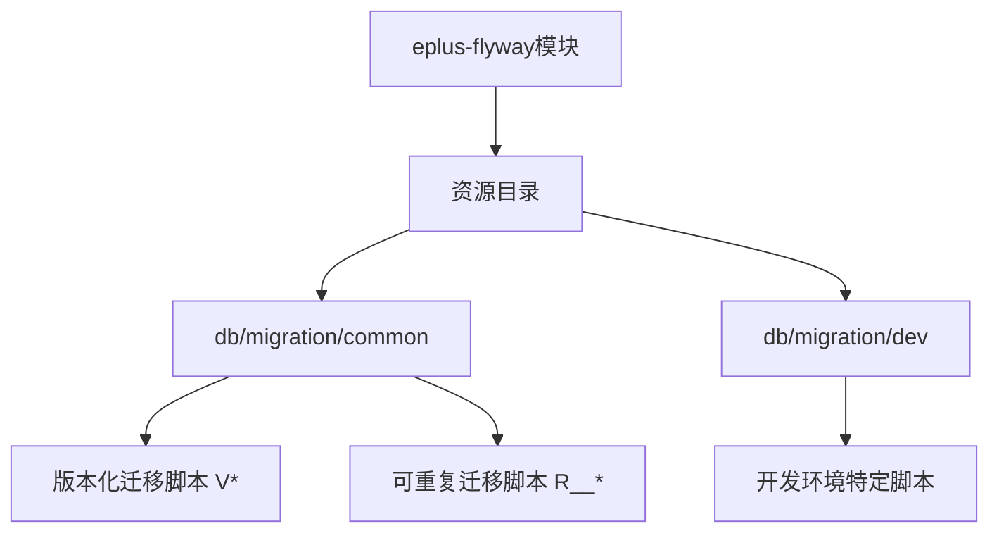
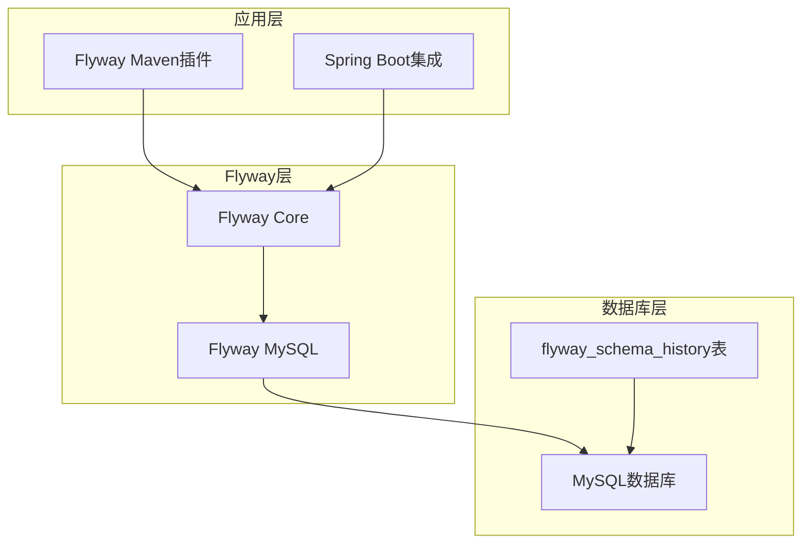
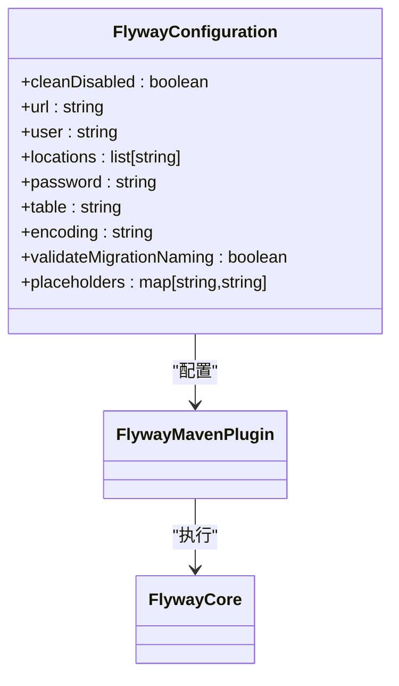
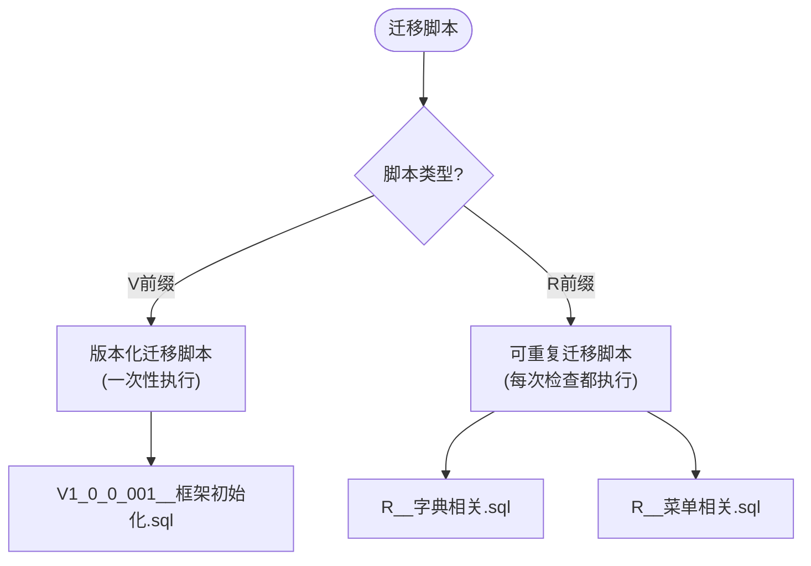
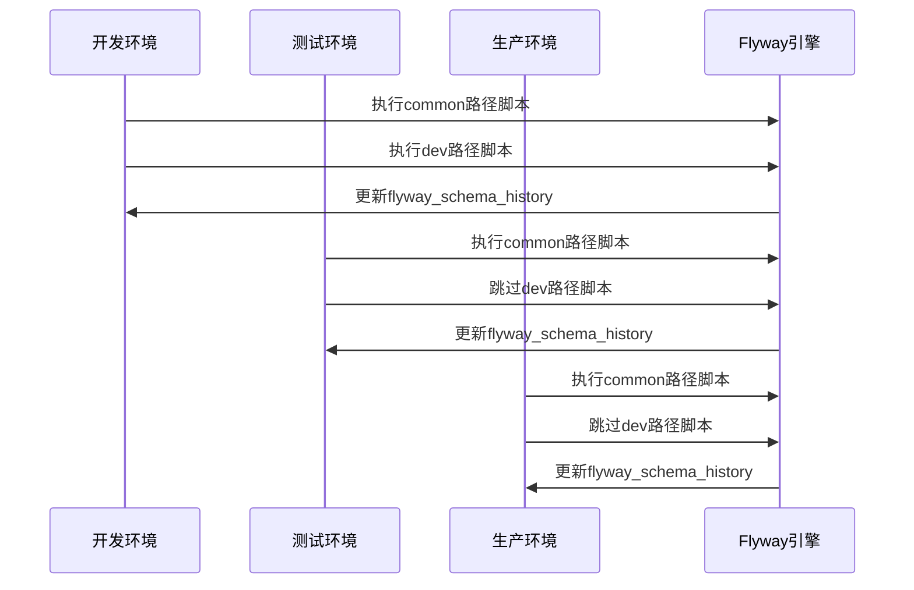
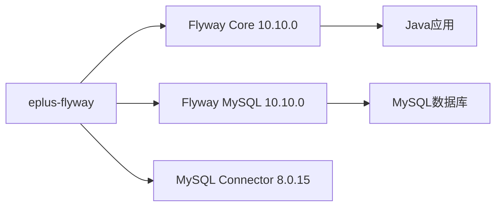

# 环境管理

<cite>
**本文档引用文件**  
- [pom.xml](file://eplus-flyway/pom.xml)
- [V1_0_0_001__框架初始化.sql](file://eplus-flyway/src/main/resources/db/migration/common/V1_0_0_001__框架初始化.sql)
- [R__字典相关.sql](file://eplus-flyway/src/main/resources/db/migration/common/R__字典相关.sql)
- [EplusFlywayApplicationTests.java](file://eplus-flyway/src/test/java/com/syj/eplus/eplusflyway/EplusFlywayApplicationTests.java)
</cite>

## 目录
1. [引言](#引言)
2. [项目结构](#项目结构)
3. [核心组件](#核心组件)
4. [架构概述](#架构概述)
5. [详细组件分析](#详细组件分析)
6. [依赖分析](#依赖分析)
7. [性能考虑](#性能考虑)
8. [故障排除指南](#故障排除指南)
9. [结论](#结论)

## 引言
本文档全面介绍基于Flyway的多环境数据库迁移管理策略，涵盖开发、测试、预发布和生产环境的配置与管理。通过分析eplus-flyway模块的实现，详细说明如何为不同环境配置Flyway参数、管理迁移脚本同步、使用环境特定脚本、验证迁移一致性以及实现自动化部署。

## 项目结构
项目采用多模块Maven结构，其中eplus-flyway模块专门负责数据库迁移管理。该模块通过Flyway实现数据库版本控制，包含通用迁移脚本和环境特定迁移脚本，支持多环境部署。

**图示来源**  
- [pom.xml](file://eplus-flyway/pom.xml#L60-L63)
- [项目结构](file://eplus-flyway/src/main/resources/)

**本节来源**  
- [pom.xml](file://eplus-flyway/pom.xml#L1-L76)

## 核心组件
eplus-flyway模块是数据库迁移的核心组件，集成了Flyway 10.10.0版本，通过Maven插件和Java配置实现数据库版本控制。该模块包含通用迁移脚本和环境特定脚本，支持多环境差异化配置。

**本节来源**  
- [pom.xml](file://eplus-flyway/pom.xml#L32-L48)
- [EplusFlywayApplicationTests.java](file://eplus-flyway/src/test/java/com/syj/eplus/eplusflyway/EplusFlywayApplicationTests.java#L1-L13)

## 架构概述
系统采用Flyway作为数据库迁移工具，通过Maven插件和Spring Boot集成实现自动化迁移。架构分为三层：Flyway核心库、MySQL驱动和应用配置层。迁移脚本分为通用脚本和环境特定脚本，支持多环境差异化部署。

**图示来源**  
- [pom.xml](file://eplus-flyway/pom.xml#L32-L48)
- [pom.xml](file://eplus-flyway/pom.xml#L53-L72)

**本节来源**  
- [pom.xml](file://eplus-flyway/pom.xml#L1-L76)

## 详细组件分析

### Flyway配置分析
Flyway通过Maven插件进行配置，支持多环境迁移路径设置。配置包含数据库连接信息、迁移脚本位置、编码设置和占位符替换等功能。

#### Flyway Maven插件配置

**图示来源**  
- [pom.xml](file://eplus-flyway/pom.xml#L56-L71)

**本节来源**  
- [pom.xml](file://eplus-flyway/pom.xml#L53-L72)

### 迁移脚本类型分析
系统采用两种类型的Flyway迁移脚本：版本化迁移脚本（V前缀）和可重复迁移脚本（R前缀），分别用于一次性变更和可重复执行的变更。

#### 迁移脚本分类

**图示来源**  
- [V1_0_0_001__框架初始化.sql](file://eplus-flyway/src/main/resources/db/migration/common/V1_0_0_001__框架初始化.sql#L1)
- [R__字典相关.sql](file://eplus-flyway/src/main/resources/db/migration/common/R__字典相关.sql#L1)

**本节来源**  
- [项目结构](file://eplus-flyway/src/main/resources/db/migration/common/)
- [项目结构](file://eplus-flyway/src/main/resources/db/migration/dev/)

### 多环境迁移策略
系统通过配置不同的迁移路径来支持多环境部署，通用脚本应用于所有环境，而环境特定脚本仅应用于指定环境。

#### 多环境迁移流程

**图示来源**  
- [pom.xml](file://eplus-flyway/pom.xml#L60-L63)
- [项目结构](file://eplus-flyway/src/main/resources/)

**本节来源**  
- [pom.xml](file://eplus-flyway/pom.xml#L56-L63)

## 依赖分析
eplus-flyway模块依赖于Flyway核心库、Flyway MySQL驱动和MySQL连接器，通过Maven依赖管理确保版本一致性。

**图示来源**  
- [pom.xml](file://eplus-flyway/pom.xml#L32-L48)

**本节来源**  
- [pom.xml](file://eplus-flyway/pom.xml#L20-L49)

## 性能考虑
Flyway迁移性能主要受脚本大小、数据库连接速度和执行模式影响。建议将大型迁移脚本拆分为多个小脚本，避免单个脚本过大导致内存溢出或执行超时。

## 故障排除指南
当迁移失败时，系统会记录错误信息到flyway_schema_history表中。可以通过检查该表的状态字段来诊断问题，常见的问题包括SQL语法错误、约束冲突和权限不足。

**本节来源**  
- [V1_0_0_001__框架初始化.sql](file://eplus-flyway/src/main/resources/db/migration/common/V1_0_0_001__框架初始化.sql)
- [pom.xml](file://eplus-flyway/pom.xml#L57)

## 结论
eplus-flyway模块通过Flyway实现了可靠的数据库迁移管理，支持多环境差异化部署。通过合理的脚本分类和配置管理，确保了数据库变更的一致性和可追溯性，为系统的稳定运行提供了保障。