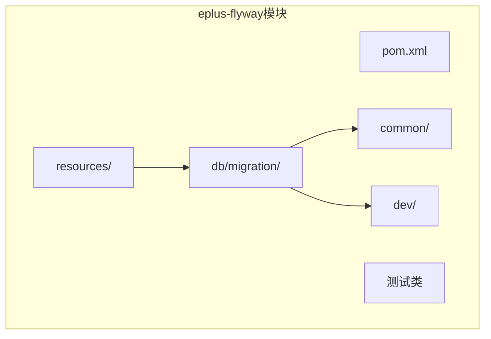
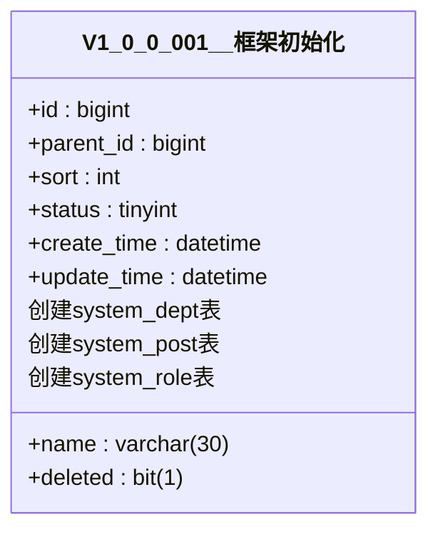
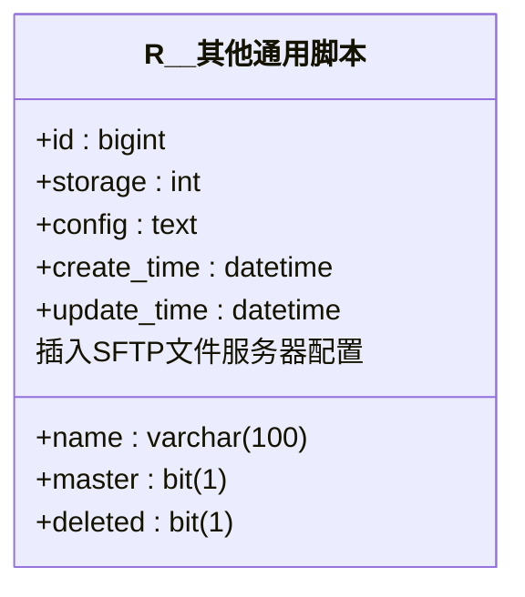
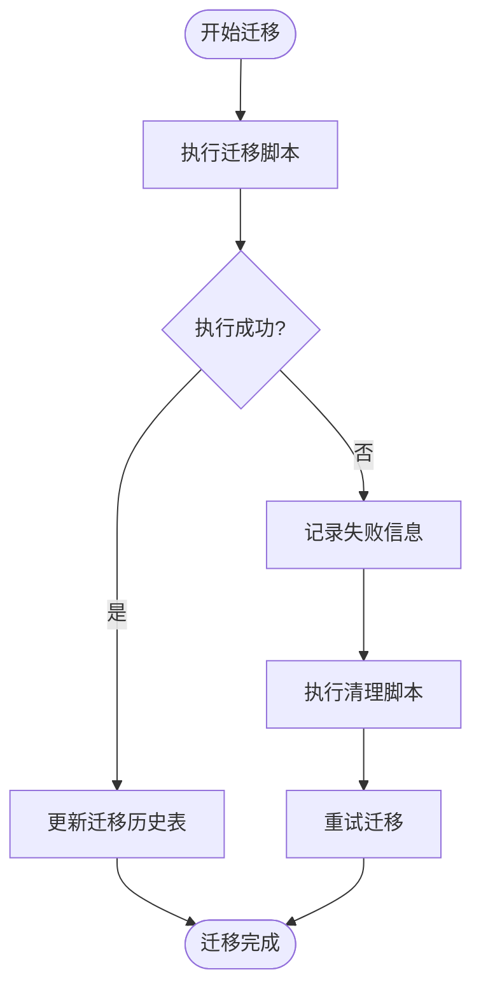
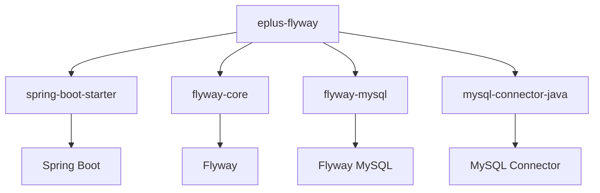

# 迁移流程

<cite>
**本文档引用的文件**   
- [eplus-flyway/pom.xml](file://eplus-flyway/pom.xml)
- [eplus-flyway/src/main/resources/db/migration/common](file://eplus-flyway/src/main/resources/db/migration/common)
- [eplus-flyway/src/main/resources/db/migration/dev](file://eplus-flyway/src/main/resources/db/migration/dev)
- [eplus-flyway/src/main/resources/db/migration/common/V1_0_0_001__框架初始化.sql](file://eplus-flyway/src/main/resources/db/migration/common/V1_0_0_001__框架初始化.sql)
- [eplus-flyway/src/main/resources/db/migration/common/V1_0_0_002__Eplus初始化.sql](file://eplus-flyway/src/main/resources/db/migration/common/V1_0_0_002__Eplus初始化.sql)
- [eplus-flyway/src/main/resources/db/migration/common/afterMigrateError__清除失败的运行记录.sql](file://eplus-flyway/src/main/resources/db/migration/common/afterMigrateError__清除失败的运行记录.sql)
- [eplus-flyway/src/test/java/com/syj/eplus/eplusflyway/EplusFlywayApplicationTests.java](file://eplus-flyway/src/test/java/com/syj/eplus/eplusflyway/EplusFlywayApplicationTests.java)
</cite>

## 目录
1. [引言](#引言)
2. [项目结构](#项目结构)
3. [核心组件](#核心组件)
4. [架构概述](#架构概述)
5. [详细组件分析](#详细组件分析)
6. [依赖分析](#依赖分析)
7. [性能考虑](#性能考虑)
8. [故障排除指南](#故障排除指南)
9. [结论](#结论)

## 引言
本文档全面介绍了从开发到生产环境的数据库迁移流程。通过使用Flyway工具，我们实现了数据库模式变更的自动化管理，确保了不同环境之间的一致性。文档详细解释了迁移脚本的创建、审核、测试和部署流程，并说明了Flyway如何跟踪已应用的迁移版本以及迁移脚本的执行顺序和依赖管理。

## 项目结构
本项目的数据库迁移功能主要集中在`eplus-flyway`模块中，该模块负责管理和执行所有数据库迁移任务。迁移脚本存放在`src/main/resources/db/migration/`目录下，分为`common`和`dev`两个子目录，分别用于存放通用迁移脚本和开发专用脚本。

**图示来源**
- [eplus-flyway/pom.xml](file://eplus-flyway/pom.xml)
- [eplus-flyway/src/main/resources/db/migration/common](file://eplus-flyway/src/main/resources/db/migration/common)
- [eplus-flyway/src/main/resources/db/migration/dev](file://eplus-flyway/src/main/resources/db/migration/dev)

**章节来源**
- [eplus-flyway/pom.xml](file://eplus-flyway/pom.xml)

## 核心组件
`eplus-flyway`模块的核心组件包括Flyway配置、迁移脚本和测试类。Flyway通过读取`pom.xml`中的配置来确定数据库连接信息和迁移脚本的位置。迁移脚本按照命名约定组织，确保正确的执行顺序。测试类用于验证迁移过程的正确性。

**章节来源**
- [eplus-flyway/pom.xml](file://eplus-flyway/pom.xml)
- [eplus-flyway/src/test/java/com/syj/eplus/eplusflyway/EplusFlywayApplicationTests.java](file://eplus-flyway/src/test/java/com/syj/eplus/eplusflyway/EplusFlywayApplicationTests.java)

## 架构概述
系统采用Flyway作为数据库迁移工具，通过Maven插件集成到构建过程中。Flyway在启动时自动检测并应用未执行的迁移脚本，确保数据库模式与代码版本保持同步。迁移历史记录存储在`flyway_schema_history`表中，便于追踪和审计。

**图示来源**
- [eplus-flyway/pom.xml](file://eplus-flyway/pom.xml)
- [eplus-flyway/src/main/resources/db/migration/common](file://eplus-flyway/src/main/resources/db/migration/common)

## 详细组件分析

### 迁移脚本分析
迁移脚本是数据库变更的核心，它们以SQL文件的形式存在，遵循特定的命名规则。版本化迁移脚本（如`V1_0_0_001__框架初始化.sql`）按版本号排序执行，而可重复迁移脚本（以`R__`开头）每次都会重新执行。

#### 版本化迁移脚本

**图示来源**
- [eplus-flyway/src/main/resources/db/migration/common/V1_0_0_001__框架初始化.sql](file://eplus-flyway/src/main/resources/db/migration/common/V1_0_0_001__框架初始化.sql)

#### 可重复迁移脚本

**图示来源**
- [eplus-flyway/src/main/resources/db/migration/dev/R__其他通用脚本.sql](file://eplus-flyway/src/main/resources/db/migration/dev/R__其他通用脚本.sql)

**章节来源**
- [eplus-flyway/src/main/resources/db/migration/common/V1_0_0_001__框架初始化.sql](file://eplus-flyway/src/main/resources/db/migration/common/V1_0_0_001__框架初始化.sql)
- [eplus-flyway/src/main/resources/db/migration/dev/R__其他通用脚本.sql](file://eplus-flyway/src/main/resources/db/migration/dev/R__其他通用脚本.sql)

### 错误处理机制
当迁移失败时，Flyway会记录失败的执行记录，并可以通过特定的清理脚本来清除这些记录，以便重新尝试迁移。

**图示来源**
- [eplus-flyway/src/main/resources/db/migration/common/afterMigrateError__清除失败的运行记录.sql](file://eplus-flyway/src/main/resources/db/migration/common/afterMigrateError__清除失败的运行记录.sql)

**章节来源**
- [eplus-flyway/src/main/resources/db/migration/common/afterMigrateError__清除失败的运行记录.sql](file://eplus-flyway/src/main/resources/db/migration/common/afterMigrateError__清除失败的运行记录.sql)

## 依赖分析
`eplus-flyway`模块依赖于Spring Boot和Flyway核心库，通过Maven管理这些依赖关系。Flyway插件配置在`pom.xml`中，指定了数据库连接信息、迁移脚本位置和编码设置。

**图示来源**
- [eplus-flyway/pom.xml](file://eplus-flyway/pom.xml)

**章节来源**
- [eplus-flyway/pom.xml](file://eplus-flyway/pom.xml)

## 性能考虑
为了提高迁移效率，建议将大型迁移任务拆分为多个小的迁移脚本，避免单个脚本过大导致执行时间过长。此外，合理使用索引可以显著提升查询性能，但应在迁移脚本中谨慎添加，以免影响写入性能。

## 故障排除指南
当遇到迁移失败的情况时，首先检查`flyway_schema_history`表中的记录，确认哪些迁移脚本未能成功执行。然后查看应用程序日志，获取详细的错误信息。如果需要重新执行失败的迁移，可以使用`afterMigrateError__清除失败的运行记录.sql`脚本来清理失败的记录。

**章节来源**
- [eplus-flyway/src/main/resources/db/migration/common/afterMigrateError__清除失败的运行记录.sql](file://eplus-flyway/src/main/resources/db/migration/common/afterMigrateError__清除失败的运行记录.sql)

## 结论
通过使用Flyway进行数据库迁移管理，我们能够有效地控制数据库模式的变更，确保了不同环境之间的一致性和可靠性。本文档提供的迁移流程和最佳实践有助于团队成员更好地理解和执行数据库迁移任务，从而提高开发效率和系统稳定性。