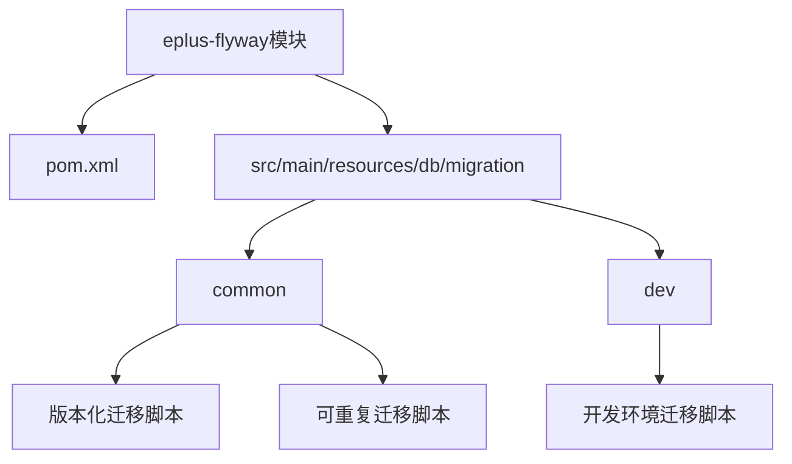
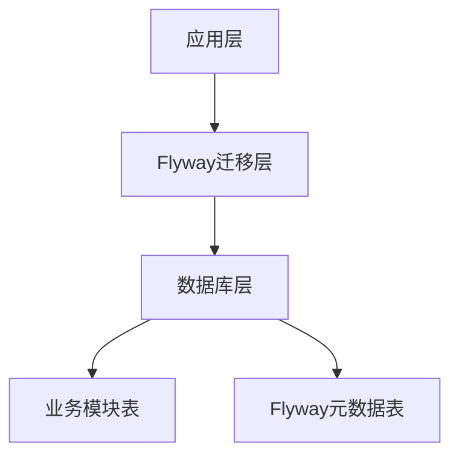
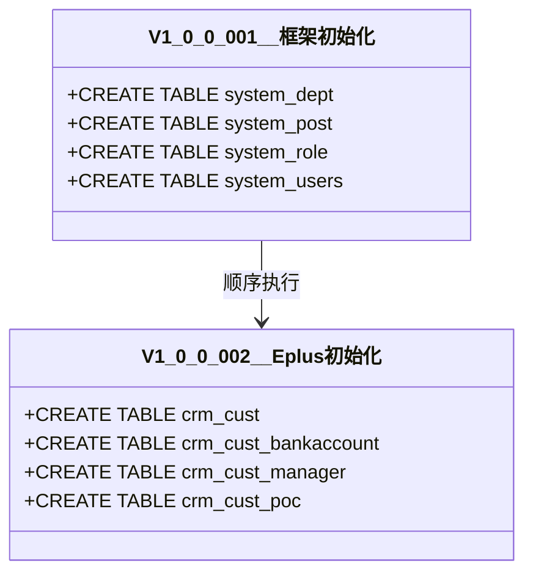
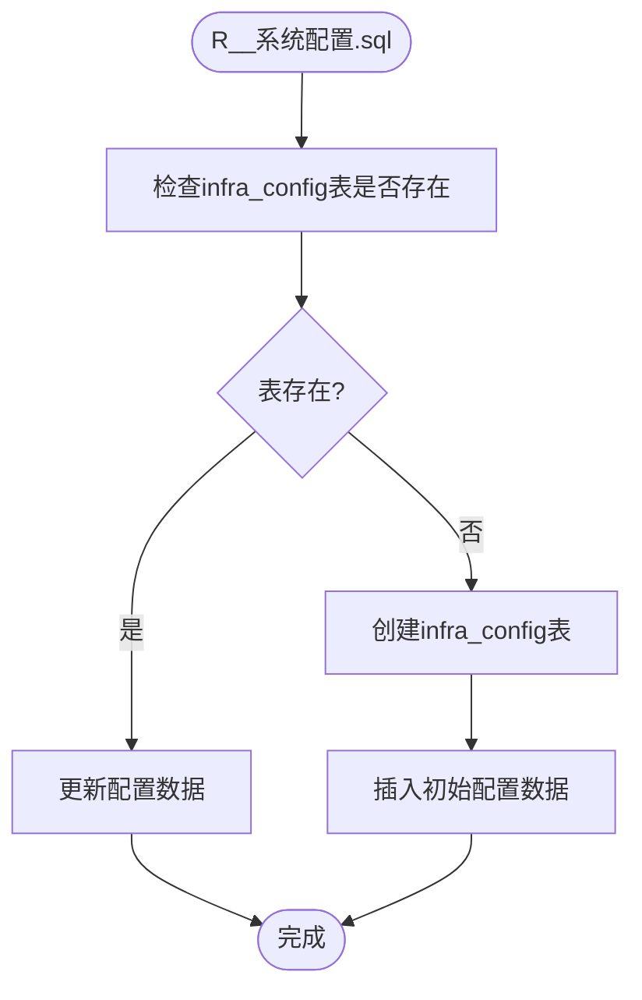
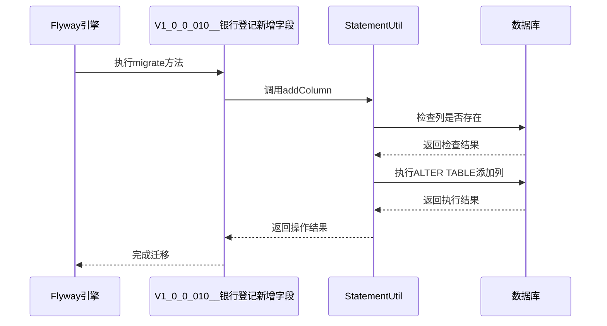
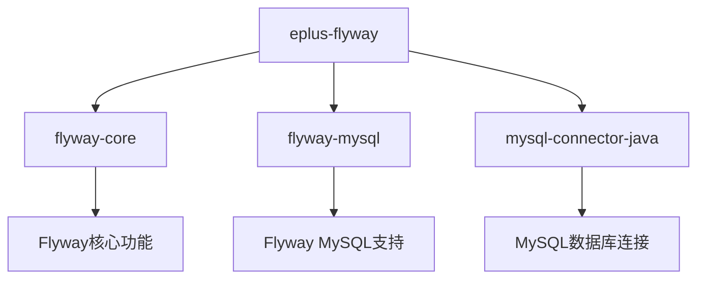

# 迁移管理

<cite>
**本文档引用文件**   
- [pom.xml](file://eplus-flyway/pom.xml)
- [V1_0_0_001__框架初始化.sql](file://eplus-flyway/src/main/resources/db/migration/common/V1_0_0_001__框架初始化.sql)
- [V1_0_0_002__Eplus初始化.sql](file://eplus-flyway/src/main/resources/db/migration/common/V1_0_0_002__Eplus初始化.sql)
- [R__系统配置.sql](file://eplus-flyway/src/main/resources/db/migration/common/R__系统配置.sql)
- [afterMigrateError__清除失败的运行记录.sql](file://eplus-flyway/src/main/resources/db/migration/common/afterMigrateError__清除失败的运行记录.sql)
- [V1_0_0_010__银行登记新增字段.java](file://eplus-flyway/src/main/java/db/migration/common/V1_0_0_010__银行登记新增字段.java)
- [StatementUtil.java](file://eplus-flyway/src/main/java/db/migration/util/StatementUtil.java)
</cite>

## 目录
1. [引言](#引言)
2. [项目结构](#项目结构)
3. [核心组件](#核心组件)
4. [架构概述](#架构概述)
5. [详细组件分析](#详细组件分析)
6. [依赖分析](#依赖分析)
7. [性能考虑](#性能考虑)
8. [故障排除指南](#故障排除指南)
9. [结论](#结论)

## 引言
本文档全面介绍使用Flyway进行数据库版本控制的完整流程。文档详细解释了迁移脚本的命名规范、目录结构、增量迁移脚本编写、执行机制、版本控制、回滚策略以及在不同环境中的迁移管理流程。同时提供常见问题排查指南，确保团队成员能够安全有效地管理数据库变更。

## 项目结构
项目中的数据库迁移管理模块（eplus-flyway）采用Flyway作为数据库版本控制工具。该模块通过Maven进行依赖管理，并配置了Flyway插件来执行数据库迁移。迁移脚本存放在`src/main/resources/db/migration`目录下，分为`common`和`dev`两个子目录，分别用于存放通用和开发环境特定的迁移脚本。



**图源**
- [pom.xml](file://eplus-flyway/pom.xml#L1-L76)
- [V1_0_0_001__框架初始化.sql](file://eplus-flyway/src/main/resources/db/migration/common/V1_0_0_001__框架初始化.sql#L1-L800)

**节源**
- [pom.xml](file://eplus-flyway/pom.xml#L1-L76)
- [eplus-flyway/src/main/resources/db/migration/common](file://eplus-flyway/src/main/resources/db/migration/common)

## 核心组件
核心组件包括Flyway配置、迁移脚本、Java迁移类和辅助工具类。Flyway通过读取配置文件中的设置来确定数据库连接信息、迁移脚本位置等。迁移脚本分为版本化迁移（Versioned Migrations）和可重复迁移（Repeatable Migrations），分别以V和R开头命名。Java迁移类允许在Java代码中执行复杂的迁移逻辑，而辅助工具类提供了常用的数据库操作方法。

**节源**
- [pom.xml](file://eplus-flyway/pom.xml#L50-L74)
- [V1_0_0_001__框架初始化.sql](file://eplus-flyway/src/main/resources/db/migration/common/V1_0_0_001__框架初始化.sql#L1-L800)
- [V1_0_0_010__银行登记新增字段.java](file://eplus-flyway/src/main/java/db/migration/common/V1_0_0_010__银行登记新增字段.java#L1-L25)

## 架构概述
系统采用分层架构，Flyway作为数据库迁移层，负责管理数据库模式的版本控制。应用层通过Spring Boot集成Flyway，在应用启动时自动执行必要的迁移。数据库层包含多个业务模块的表结构，通过Flyway脚本进行初始化和升级。



**图源**
- [pom.xml](file://eplus-flyway/pom.xml#L50-L74)
- [V1_0_0_001__框架初始化.sql](file://eplus-flyway/src/main/resources/db/migration/common/V1_0_0_001__框架初始化.sql#L1-L800)

## 详细组件分析

### 版本化迁移脚本分析
版本化迁移脚本用于对数据库模式进行一次性更改，如创建表、添加列等。每个脚本都有唯一的版本号，确保按顺序执行。

#### 版本化迁移脚本示例


**图源**
- [V1_0_0_001__框架初始化.sql](file://eplus-flyway/src/main/resources/db/migration/common/V1_0_0_001__框架初始化.sql#L1-L800)
- [V1_0_0_002__Eplus初始化.sql](file://eplus-flyway/src/main/resources/db/migration/common/V1_0_0_002__Eplus初始化.sql#L1-L800)

**节源**
- [V1_0_0_001__框架初始化.sql](file://eplus-flyway/src/main/resources/db/migration/common/V1_0_0_001__框架初始化.sql#L1-L800)
- [V1_0_0_002__Eplus初始化.sql](file://eplus-flyway/src/main/resources/db/migration/common/V1_0_0_002__Eplus初始化.sql#L1-L800)

### 可重复迁移脚本分析
可重复迁移脚本以R__开头，用于管理那些可能需要多次执行的数据库对象，如视图、存储过程等。这些脚本在每次校验时都会重新执行。

#### 可重复迁移脚本示例


**图源**
- [R__系统配置.sql](file://eplus-flyway/src/main/resources/db/migration/common/R__系统配置.sql#L1-L45)

**节源**
- [R__系统配置.sql](file://eplus-flyway/src/main/resources/db/migration/common/R__系统配置.sql#L1-L45)

### Java迁移类分析
Java迁移类允许在Java代码中执行复杂的迁移逻辑，特别适用于需要条件判断或数据处理的场景。

#### Java迁移类示例


**图源**
- [V1_0_0_010__银行登记新增字段.java](file://eplus-flyway/src/main/java/db/migration/common/V1_0_0_010__银行登记新增字段.java#L1-L25)
- [StatementUtil.java](file://eplus-flyway/src/main/java/db/migration/util/StatementUtil.java#L1-L145)

**节源**
- [V1_0_0_010__银行登记新增字段.java](file://eplus-flyway/src/main/java/db/migration/common/V1_0_0_010__银行登记新增字段.java#L1-L25)
- [StatementUtil.java](file://eplus-flyway/src/main/java/db/migration/util/StatementUtil.java#L1-L145)

## 依赖分析
项目依赖于Flyway核心库、Flyway MySQL插件和MySQL连接器。这些依赖在pom.xml中声明，并由Maven进行管理。



**图源**
- [pom.xml](file://eplus-flyway/pom.xml#L32-L48)

**节源**
- [pom.xml](file://eplus-flyway/pom.xml#L20-L48)

## 性能考虑
在编写迁移脚本时，应考虑以下性能因素：
- 避免在迁移脚本中执行大量数据操作
- 使用批处理来提高大数据量操作的效率
- 在添加索引时考虑表的大小和查询模式
- 避免在生产环境中执行长时间运行的迁移

## 故障排除指南
### 迁移失败处理
当迁移失败时，Flyway会停止执行后续脚本。可以通过以下步骤进行排查：
1. 检查错误日志以确定失败原因
2. 修复问题后，可以使用`flyway repair`命令清理失败的迁移记录
3. 重新执行迁移

### 脚本冲突解决
当多个开发者同时修改数据库模式时，可能会发生脚本冲突。解决方法包括：
- 使用唯一的版本号
- 在开发环境中充分测试迁移脚本
- 使用Flyway的`validate`命令检查迁移脚本的一致性

### 清理失败的运行记录
当迁移脚本执行失败时，可以使用以下SQL脚本清理Flyway元数据表中的失败记录：

```sql
DELETE IGNORE FROM `${flyway-table}` WHERE success = 0;
```

**节源**
- [afterMigrateError__清除失败的运行记录.sql](file://eplus-flyway/src/main/resources/db/migration/common/afterMigrateError__清除失败的运行记录.sql#L1-L2)

## 结论
通过使用Flyway进行数据库版本控制，团队可以安全、可靠地管理数据库变更。遵循本文档中描述的最佳实践，可以确保数据库迁移的顺利进行，减少生产环境中的问题。建议团队成员熟悉Flyway的工作原理和使用方法，以提高开发效率和系统稳定性。