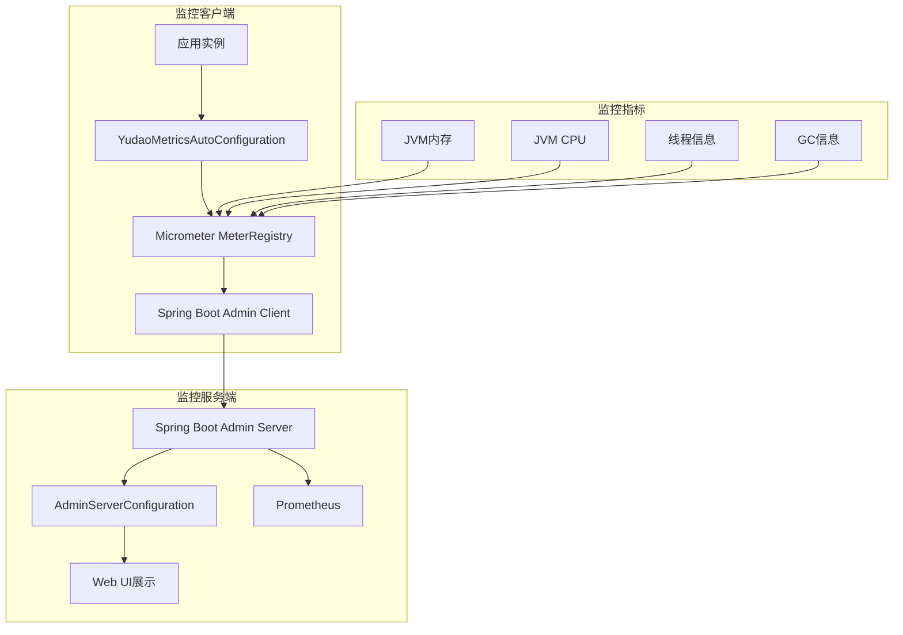

# JVM监控

<cite>
**本文档引用文件**  
- [AdminServerConfiguration.java](file://yudao-module-infra/yudao-module-infra-biz/src/main/java/cn/iocoder/yudao/module/infra/framework/monitor/config/AdminServerConfiguration.java)
- [YudaoMetricsAutoConfiguration.java](file://yudao-framework/yudao-spring-boot-starter-monitor/src/main/java/cn/iocoder/yudao/framework/tracer/config/YudaoMetricsAutoConfiguration.java)
- [RedisController.java](file://yudao-module-infra/yudao-module-infra-biz/src/main/java/cn/iocoder/yudao/module/infra/controller/admin/redis/RedisController.java)
- [RedisMonitorRespVO.java](file://yudao-module-infra/yudao-module-infra-biz/src/main/java/cn/iocoder/yudao/module/infra/controller/admin/redis/vo/RedisMonitorRespVO.java)
- [RedisConvert.java](file://yudao-module-infra/yudao-module-infra-biz/src/main/java/cn/iocoder/yudao/module/infra/convert/redis/RedisConvert.java)
- [application-local.yaml](file://yudao-server/src/main/resources/application-local.yaml)
- [TracerUtils.java](file://yudao-framework/yudao-common/src/main/java/cn/iocoder/yudao/framework/common/util/monitor/TracerUtils.java)
- [pom.xml](file://yudao-framework/yudao-spring-boot-starter-monitor/pom.xml)
</cite>

## 目录
1. [引言](#引言)
2. [JVM监控架构](#jvm监控架构)
3. [核心监控接口实现](#核心监控接口实现)
4. [内存监控详解](#内存监控详解)
5. [CPU监控机制](#cpu监控机制)
6. [线程监控分析](#线程监控分析)
7. [垃圾回收监控](#垃圾回收监控)
8. [性能问题诊断流程](#性能问题诊断流程)
9. [JVM参数调优建议](#jvm参数调优建议)
10. [监控数据采集频率](#监控数据采集频率)

## 引言
本文档详细阐述了基于Spring Boot Admin和Micrometer的JVM监控方案，涵盖内存、CPU、线程和垃圾回收等核心监控指标的采集与分析。系统通过集成Spring Boot Admin客户端和服务端，实现了对应用运行状态的全面监控。监控体系基于Micrometer指标收集框架，支持Prometheus等后端存储，提供了丰富的JVM运行时数据可视化能力。

## JVM监控架构

**图示来源**  
- [YudaoMetricsAutoConfiguration.java](file://yudao-framework/yudao-spring-boot-starter-monitor/src/main/java/cn/iocoder/yudao/framework/tracer/config/YudaoMetricsAutoConfiguration.java)
- [AdminServerConfiguration.java](file://yudao-module-infra/yudao-module-infra-biz/src/main/java/cn/iocoder/yudao/module/infra/framework/monitor/config/AdminServerConfiguration.java)

**本节来源**  
- [YudaoMetricsAutoConfiguration.java](file://yudao-framework/yudao-spring-boot-starter-monitor/src/main/java/cn/iocoder/yudao/framework/tracer/config/YudaoMetricsAutoConfiguration.java)
- [AdminServerConfiguration.java](file://yudao-module-infra/yudao-module-infra-biz/src/main/java/cn/iocoder/yudao/module/infra/framework/monitor/config/AdminServerConfiguration.java)
- [pom.xml](file://yudao-framework/yudao-spring-boot-starter-monitor/pom.xml)

## 核心监控接口实现
系统通过Spring Boot Admin的监控能力，实现了对JVM运行时状态的全面采集。虽然未直接提供getJvmMemory、getJvmCpu等具体接口，但通过Micrometer框架自动收集了JVM相关指标。YudaoMetricsAutoConfiguration配置类通过MeterRegistryCustomizer为所有指标添加了应用名称标签，实现了多应用监控的区分。

监控数据通过Spring Boot Actuator端点暴露，包括/actuator/metrics、/actuator/health等标准端点。这些端点被Spring Boot Admin客户端定期轮询，并将数据上报给Admin Server进行集中展示和管理。系统还集成了SkyWalking进行链路追踪，TracerUtils工具类提供了获取TraceId的静态方法，便于在日志中关联分布式调用链。

**本节来源**  
- [YudaoMetricsAutoConfiguration.java](file://yudao-framework/yudao-spring-boot-starter-monitor/src/main/java/cn/iocoder/yudao/framework/tracer/config/YudaoMetricsAutoConfiguration.java)
- [TracerUtils.java](file://yudao-framework/yudao-common/src/main/java/cn/iocoder/yudao/framework/common/util/monitor/TracerUtils.java)
- [pom.xml](file://yudao-framework/yudao-spring-boot-starter-monitor/pom.xml)

## 内存监控详解
JVM内存监控主要涵盖堆内存和非堆内存两大区域。堆内存用于存储对象实例，分为新生代（Young Generation）和老年代（Old Generation）。新生代又细分为Eden区和两个Survivor区（S0、S1）。非堆内存主要包括方法区（Metaspace）和代码缓存等。

监控指标包括：
- 堆内存使用量：jvm_memory_used_bytes{area="heap"}
- 非堆内存使用量：jvm_memory_used_bytes{area="nonheap"}
- 各内存区域使用情况：jvm_memory_used_bytes{area="heap",id="PS Eden Space"}
- 内存池最大容量：jvm_memory_max_bytes

这些指标通过Micrometer自动采集，反映了JVM内存分配和使用情况。当堆内存使用率持续高于80%时，可能存在内存泄漏风险；当老年代使用率过高时，可能频繁触发Full GC。

**本节来源**  
- [YudaoMetricsAutoConfiguration.java](file://yudao-framework/yudao-spring-boot-starter-monitor/src/main/java/cn/iocoder/yudao/framework/tracer/config/YudaoMetricsAutoConfiguration.java)

## CPU监控机制
JVM CPU监控主要通过系统级和JVM级两个维度进行。系统级CPU使用率反映整个Java进程的CPU消耗，而JVM内部的CPU时间则通过线程CPU时间累加获得。关键监控指标包括：

- JVM进程CPU使用率：process_cpu_usage
- 系统CPU使用率：system_cpu_usage
- 线程CPU时间：process_thread_cpu_time_seconds_total

这些指标帮助识别应用的CPU瓶颈。当process_cpu_usage持续高于80%时，需要分析是业务逻辑复杂度过高还是存在死循环等问题。通过对比system_cpu_usage和process_cpu_usage，可以判断CPU瓶颈是否在Java应用内部。

**本节来源**  
- [YudaoMetricsAutoConfiguration.java](file://yudao-framework/yudao-spring-boot-starter-monitor/src/main/java/cn/iocoder/yudao/framework/tracer/config/YudaoMetricsAutoConfiguration.java)

## 线程监控分析
线程监控是JVM性能分析的重要组成部分。系统通过JVM的ThreadMXBean获取线程相关信息，主要监控指标包括：

- 活跃线程数：jvm_threads_live
- 守护线程数：jvm_threads_daemon
- 峰值线程数：jvm_threads_peak
- 线程状态分布：jvm_threads_states_threads

线程状态分析重点关注BLOCKED和WAITING状态的线程数量。当BLOCKED线程数持续增加时，可能存在锁竞争问题。系统还支持通过ThreadMXBean的findDeadlockedThreads方法检测死锁，当检测到死锁时会触发告警。

对于线程池监控，需要关注核心线程数、最大线程数、活跃线程数、队列大小等指标。当线程池队列持续积压时，可能需要调整线程池大小或优化任务处理逻辑。

**本节来源**  
- [YudaoMetricsAutoConfiguration.java](file://yudao-framework/yudao-spring-boot-starter-monitor/src/main/java/cn/iocoder/yudao/framework/tracer/config/YudaoMetricsAutoConfiguration.java)

## 垃圾回收监控
垃圾回收监控是JVM性能调优的关键。系统监控Young GC和Full GC的频率、耗时和内存回收量等指标：

- GC次数：jvm_gc_pause_seconds_count{action="end of minor GC"}
- GC耗时：jvm_gc_pause_seconds_sum
- GC原因：jvm_gc_pause_action
- GC类型：jvm_gc_pause_cause

Young GC（Minor GC）发生在新生代，通常耗时较短（几十毫秒），频率较高。Full GC（Major GC）涉及整个堆内存，耗时较长（几百毫秒到几秒），应尽量避免频繁发生。合理的GC指标阈值为：Young GC每分钟少于10次，Full GC每小时少于1次。

当发现GC耗时过长或频率过高时，需要分析内存分配情况和对象生命周期，可能需要调整新生代和老年代的比例，或优化对象创建和销毁逻辑。

**本节来源**  
- [YudaoMetricsAutoConfiguration.java](file://yudao-framework/yudao-spring-boot-starter-monitor/src/main/java/cn/iocoder/yudao/framework/tracer/config/YudaoMetricsAutoConfiguration.java)

## 性能问题诊断流程
JVM性能问题诊断应遵循系统化流程：

1. **内存溢出诊断**：检查堆内存使用趋势，分析GC日志，使用jmap生成堆转储文件，通过MAT等工具分析内存泄漏点。
2. **CPU过高诊断**：使用top命令定位高CPU进程，使用jstack生成线程栈，分析是否存在死循环或频繁的锁竞争。
3. **GC频繁诊断**：分析GC日志，检查Young GC和Full GC的频率和耗时，调整堆大小和代际比例。
4. **线程阻塞诊断**：检查线程状态，使用jstack分析线程栈，定位死锁或长耗时操作。

诊断工具包括jstat、jmap、jstack、jinfo等JDK自带工具，以及VisualVM、JProfiler等可视化工具。建议在生产环境开启GC日志记录，便于事后分析。

**本节来源**  
- [YudaoMetricsAutoConfiguration.java](file://yudao-framework/yudao-spring-boot-starter-monitor/src/main/java/cn/iocoder/yudao/framework/tracer/config/YudaoMetricsAutoConfiguration.java)

## JVM参数调优建议
JVM参数调优需要根据应用特点和运行环境进行：

- **堆大小设置**：-Xms和-Xmx设置为相同值，避免动态扩展开销。一般设置为物理内存的70-80%。
- **新生代设置**：-Xmn设置为堆大小的1/3到1/2，Eden和Survivor比例通常为8:1:1。
- **垃圾收集器选择**：小内存应用使用Parallel GC，大内存应用使用G1 GC，低延迟要求使用ZGC或Shenandoah。
- **Metaspace设置**：-XX:MetaspaceSize和-XX:MaxMetaspaceSize避免元空间频繁扩容。

建议开启的监控参数：
- -XX:+PrintGC：输出GC日志
- -XX:+PrintGCDetails：输出GC详细信息
- -XX:+PrintGCDateStamps：输出GC时间戳
- -Xloggc:gc.log：指定GC日志文件

**本节来源**  
- [YudaoMetricsAutoConfiguration.java](file://yudao-framework/yudao-spring-boot-starter-monitor/src/main/java/cn/iocoder/yudao/framework/tracer/config/YudaoMetricsAutoConfiguration.java)
- [application-local.yaml](file://yudao-server/src/main/resources/application-local.yaml)

## 监控数据采集频率
监控数据采集频率由Spring Boot Admin客户端配置决定。默认情况下，客户端会定期轮询应用的Actuator端点获取监控数据。采集频率需要在监控精度和系统开销之间取得平衡。

对于JVM内存、CPU等关键指标，建议采集间隔为10-30秒。对于GC统计、线程信息等变化较慢的指标，可以设置为1-2分钟采集一次。过于频繁的采集会增加应用性能开销，而采集间隔过长则可能错过瞬时性能问题。

在application.yaml中可以通过spring.boot.admin.client.period配置采集周期，单位为毫秒。生产环境建议根据实际负载情况调整采集频率，避免监控系统自身成为性能瓶颈。

**本节来源**  
- [application-local.yaml](file://yudao-server/src/main/resources/application-local.yaml)
- [YudaoMetricsAutoConfiguration.java](file://yudao-framework/yudao-spring-boot-starter-monitor/src/main/java/cn/iocoder/yudao/framework/tracer/config/YudaoMetricsAutoConfiguration.java)