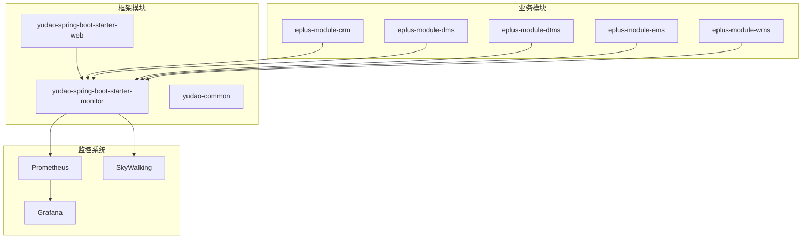
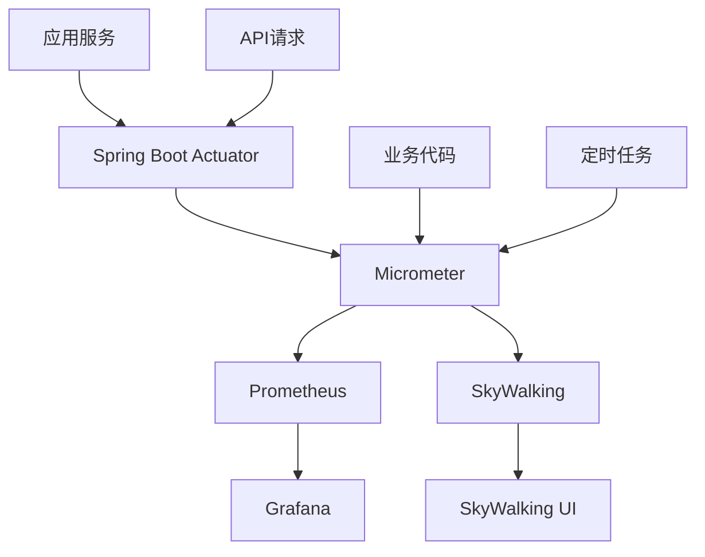
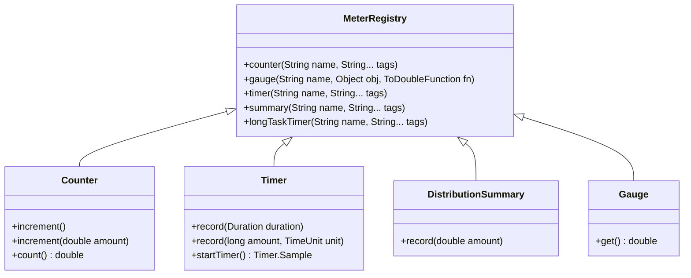
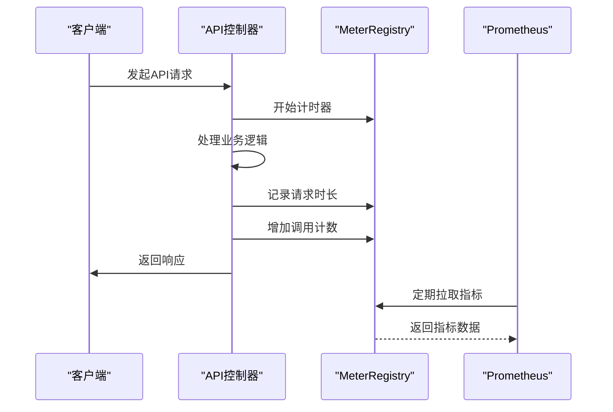
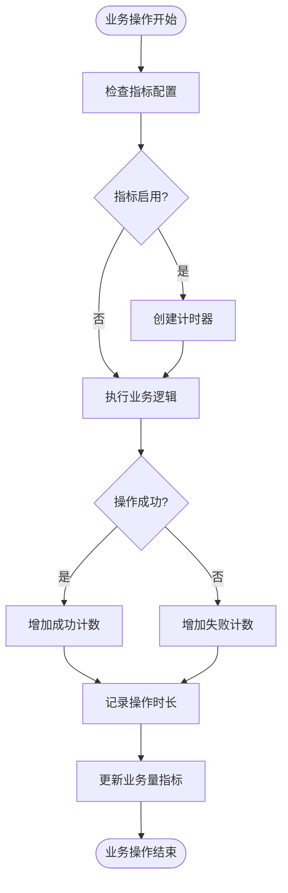
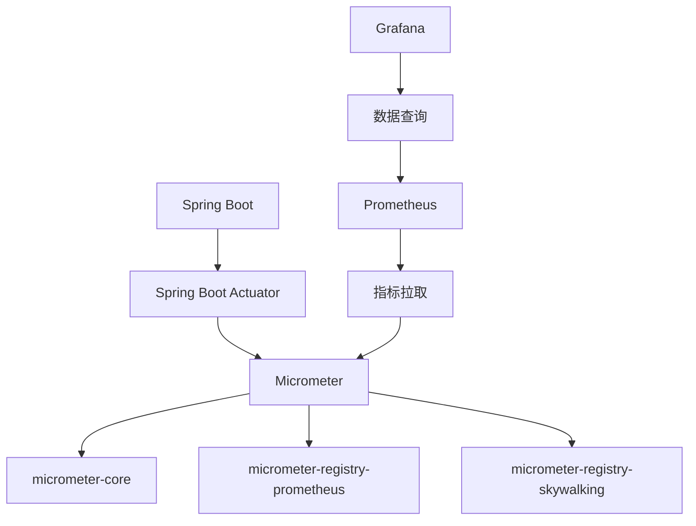

# 业务指标监控

<cite>
**本文档引用的文件**
- [YudaoMetricsAutoConfiguration.java](file://yudao-framework/yudao-spring-boot-starter-monitor/src/main/java/cn/iocoder/yudao/framework/tracer/config/YudaoMetricsAutoConfiguration.java)
- [application-prod.yaml](file://yudao-server/src/main/resources/application-prod.yaml)
- [pom.xml](file://yudao-framework/yudao-spring-boot-starter-monitor/pom.xml)
- [TracerProperties.java](file://yudao-framework/yudao-spring-boot-starter-monitor/src/main/java/cn/iocoder/yudao/framework/tracer/config/TracerProperties.java)
- [YudaoTracerAutoConfiguration.java](file://yudao-framework/yudao-spring-boot-starter-monitor/src/main/java/cn/iocoder/yudao/framework/tracer/config/YudaoTracerAutoConfiguration.java)
</cite>

## 目录
1. [引言](#引言)
2. [项目结构](#项目结构)
3. [核心组件](#核心组件)
4. [架构概述](#架构概述)
5. [详细组件分析](#详细组件分析)
6. [依赖分析](#依赖分析)
7. [性能考虑](#性能考虑)
8. [故障排除指南](#故障排除指南)
9. [结论](#结论)
10. [附录](#附录)（如有必要）

## 引言
本文档旨在阐述基于Micrometer的业务指标监控方案，详细说明如何注册和暴露自定义业务指标。系统通过Micrometer集成Prometheus实现指标收集，支持计数器、计量器、直方图和计时器等多种指标类型。文档将介绍关键业务指标如订单处理量、API调用量和业务成功率的采集方法，以及指标标签的设计原则和多维数据分析实现方式。同时提供Prometheus查询语句示例、告警规则配置和Grafana可视化建议。

## 项目结构
系统采用模块化架构，包含多个业务模块和基础设施组件。监控功能主要集中在yudao-framework模块中，通过micrometer-registry-prometheus实现与Prometheus的集成。



**图表来源**
- [YudaoMetricsAutoConfiguration.java](file://yudao-framework/yudao-spring-boot-starter-monitor/src/main/java/cn/iocoder/yudao/framework/tracer/config/YudaoMetricsAutoConfiguration.java)
- [pom.xml](file://yudao-framework/yudao-spring-boot-starter-monitor/pom.xml)

**章节来源**
- [YudaoMetricsAutoConfiguration.java](file://yudao-framework/yudao-spring-boot-starter-monitor/src/main/java/cn/iocoder/yudao/framework/tracer/config/YudaoMetricsAutoConfiguration.java)
- [application-prod.yaml](file://yudao-server/src/main/resources/application-prod.yaml)

## 核心组件
系统的核心监控组件包括Micrometer指标注册器、Prometheus收集器和SkyWalking链路追踪。通过YudaoMetricsAutoConfiguration配置类实现指标的自动注册和通用标签设置。

**章节来源**
- [YudaoMetricsAutoConfiguration.java](file://yudao-framework/yudao-spring-boot-starter-monitor/src/main/java/cn/iocoder/yudao/framework/tracer/config/YudaoMetricsAutoConfiguration.java)
- [TracerProperties.java](file://yudao-framework/yudao-spring-boot-starter-monitor/src/main/java/cn/iocoder/yudao/framework/tracer/config/TracerProperties.java)

## 架构概述
系统采用Spring Boot Actuator作为监控端点，通过Micrometer实现指标抽象层，支持多种监控后端。Prometheus负责指标收集和存储，Grafana用于可视化展示，SkyWalking提供分布式链路追踪。



**图表来源**
- [YudaoMetricsAutoConfiguration.java](file://yudao-framework/yudao-spring-boot-starter-monitor/src/main/java/cn/iocoder/yudao/framework/tracer/config/YudaoMetricsAutoConfiguration.java)
- [YudaoTracerAutoConfiguration.java](file://yudao-framework/yudao-spring-boot-starter-monitor/src/main/java/cn/iocoder/yudao/framework/tracer/config/YudaoTracerAutoConfiguration.java)

## 详细组件分析
### 指标注册组件分析
系统通过Micrometer的MeterRegistry实现指标注册和管理，支持多种指标类型。

#### 指标类型实现


**图表来源**
- [YudaoMetricsAutoConfiguration.java](file://yudao-framework/yudao-spring-boot-starter-monitor/src/main/java/cn/iocoder/yudao/framework/tracer/config/YudaoMetricsAutoConfiguration.java)

#### API调用监控流程


**图表来源**
- [YudaoMetricsAutoConfiguration.java](file://yudao-framework/yudao-spring-boot-starter-monitor/src/main/java/cn/iocoder/yudao/framework/tracer/config/YudaoMetricsAutoConfiguration.java)
- [YudaoTracerAutoConfiguration.java](file://yudao-framework/yudao-spring-boot-starter-monitor/src/main/java/cn/iocoder/yudao/framework/tracer/config/YudaoTracerAutoConfiguration.java)

#### 业务指标采集流程


**图表来源**
- [YudaoMetricsAutoConfiguration.java](file://yudao-framework/yudao-spring-boot-starter-monitor/src/main/java/cn/iocoder/yudao/framework/tracer/config/YudaoMetricsAutoConfiguration.java)

**章节来源**
- [YudaoMetricsAutoConfiguration.java](file://yudao-framework/yudao-spring-boot-starter-monitor/src/main/java/cn/iocoder/yudao/framework/tracer/config/YudaoMetricsAutoConfiguration.java)
- [TracerProperties.java](file://yudao-framework/yudao-spring-boot-starter-monitor/src/main/java/cn/iocoder/yudao/framework/tracer/config/TracerProperties.java)

## 依赖分析
系统依赖Micrometer作为指标抽象层，通过micrometer-registry-prometheus实现与Prometheus的集成，同时使用Spring Boot Admin进行服务监控。



**图表来源**
- [pom.xml](file://yudao-framework/yudao-spring-boot-starter-monitor/pom.xml)

**章节来源**
- [pom.xml](file://yudao-framework/yudao-spring-boot-starter-monitor/pom.xml)
- [application-prod.yaml](file://yudao-server/src/main/resources/application-prod.yaml)

## 性能考虑
在设计业务指标监控时，需要考虑指标采集对系统性能的影响。建议采用异步方式记录指标，避免阻塞业务线程。对于高频指标，可以考虑使用计数器而非计时器，减少时间测量的开销。

## 故障排除指南
当监控系统出现问题时，可以检查以下方面：
1. 确认Micrometer配置正确启用
2. 检查Prometheus是否能正常拉取指标
3. 验证指标端点是否暴露
4. 确认网络连接正常

**章节来源**
- [YudaoMetricsAutoConfiguration.java](file://yudao-framework/yudao-spring-boot-starter-monitor/src/main/java/cn/iocoder/yudao/framework/tracer/config/YudaoMetricsAutoConfiguration.java)
- [application-prod.yaml](file://yudao-server/src/main/resources/application-prod.yaml)

## 结论
本文档详细介绍了基于Micrometer的业务指标监控方案。系统通过集成Prometheus实现了全面的指标收集和监控能力，支持多种指标类型和多维数据分析。通过合理的指标设计和标签划分，可以有效监控关键业务指标，为系统优化和故障排查提供数据支持。

## 附录
### 业务指标示例
| 指标名称 | 指标类型 | 标签 | 说明 |
|---------|--------|------|------|
| order_processed_total | 计数器 | status, business_type | 订单处理总量 |
| api_requests_total | 计数器 | method, endpoint, status | API调用总量 |
| business_success_rate | 计量器 | business_type | 业务成功率 |
| order_processing_duration_seconds | 直方图 | status | 订单处理时长分布 |

### Prometheus查询示例
```promql
# 计算API调用速率
rate(api_requests_total[5m])

# 计算业务成功率
sum(business_success_total) / sum(business_total)

# 查询P95订单处理时长
histogram_quantile(0.95, sum(rate(order_processing_duration_seconds_bucket[5m])) by (le))
```

### 告警规则示例
```yaml
groups:
- name: business_alerts
  rules:
  - alert: OrderFailureRateHigh
    expr: |
      sum(rate(order_processed_total{status="failed"}[5m]))
      /
      sum(rate(order_processed_total[5m]))
      > 0.1
    for: 10m
    labels:
      severity: critical
    annotations:
      summary: "订单失败率过高"
      description: "订单失败率持续10分钟超过10%"
```