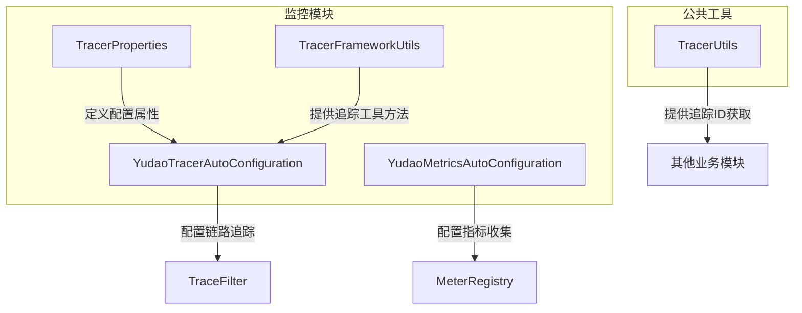
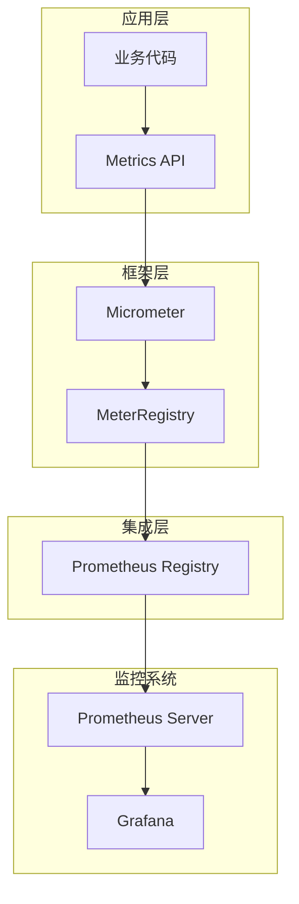
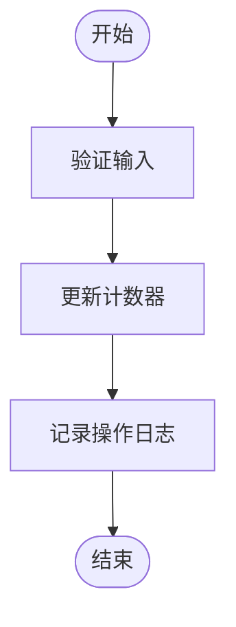
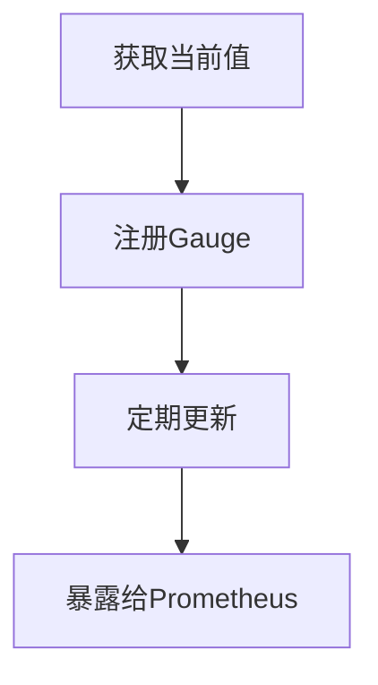
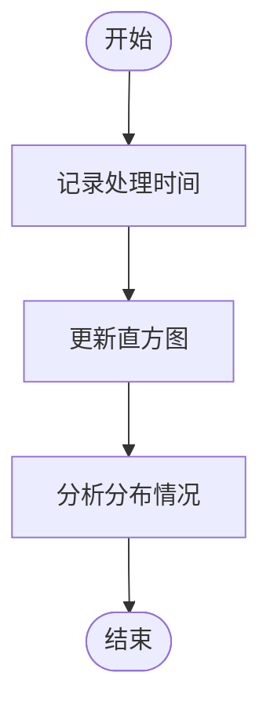
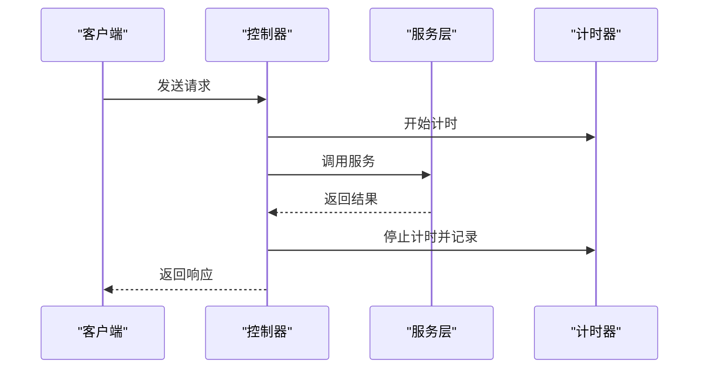
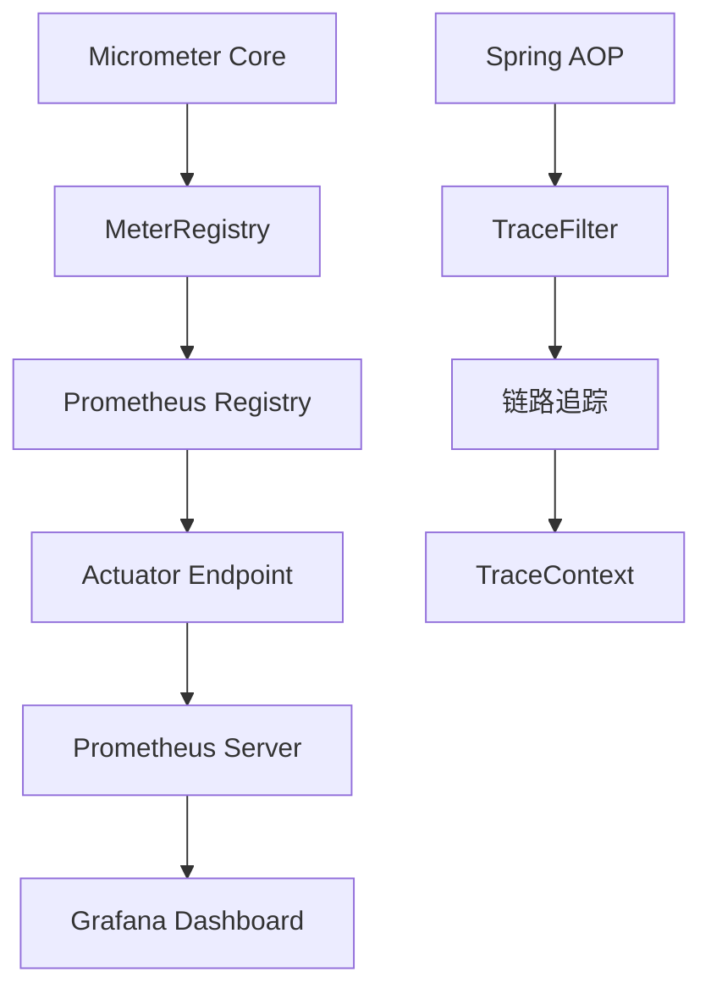

# 业务指标类型

<cite>
**本文档引用的文件**  
- [YudaoMetricsAutoConfiguration.java](file://yudao-framework/yudao-spring-boot-starter-monitor/src/main/java/cn/iocoder/yudao/framework/tracer/config/YudaoMetricsAutoConfiguration.java)
- [pom.xml](file://yudao-framework/yudao-spring-boot-starter-monitor/pom.xml)
- [TracerProperties.java](file://yudao-framework/yudao-spring-boot-starter-monitor/src/main/java/cn/iocoder/yudao/framework/tracer/config/TracerProperties.java)
- [YudaoTracerAutoConfiguration.java](file://yudao-framework/yudao-spring-boot-starter-monitor/src/main/java/cn/iocoder/yudao/framework/tracer/config/YudaoTracerAutoConfiguration.java)
- [TracerFrameworkUtils.java](file://yudao-framework/yudao-spring-boot-starter-monitor/src/main/java/cn/iocoder/yudao/framework/tracer/core/util/TracerFrameworkUtils.java)
- [TracerUtils.java](file://yudao-framework/yudao-common/src/main/java/cn/iocoder/yudao/framework/common/util/monitor/TracerUtils.java)
</cite>

## 目录
1. [引言](#引言)
2. [项目结构](#项目结构)
3. [核心组件](#核心组件)
4. [架构概述](#架构概述)
5. [详细组件分析](#详细组件分析)
6. [依赖分析](#依赖分析)
7. [性能考虑](#性能考虑)
8. [故障排除指南](#故障排除指南)
9. [结论](#结论)

## 引言
本文档详细阐述了系统支持的业务指标类型，包括计数器（Counter）、计量器（Gauge）、直方图（Histogram）和计时器（Timer）的使用场景和实现方式。系统基于Micrometer框架实现指标收集，并集成Prometheus作为监控后端。通过分析代码结构和配置，说明了各类指标在实际业务中的应用场景、数据结构和存储机制。

## 项目结构
系统采用模块化架构，监控功能主要集中在`yudao-framework`模块下的`yudao-spring-boot-starter-monitor`组件中。该组件负责提供链路追踪、日志服务和指标收集等功能。

**图示来源**  
- [YudaoMetricsAutoConfiguration.java](file://yudao-framework/yudao-spring-boot-starter-monitor/src/main/java/cn/iocoder/yudao/framework/tracer/config/YudaoMetricsAutoConfiguration.java)
- [YudaoTracerAutoConfiguration.java](file://yudao-framework/yudao-spring-boot-starter-monitor/src/main/java/cn/iocoder/yudao/framework/tracer/config/YudaoTracerAutoConfiguration.java)
- [TracerProperties.java](file://yudao-framework/yudao-spring-boot-starter-monitor/src/main/java/cn/iocoder/yudao/framework/tracer/config/TracerProperties.java)

**本节来源**  
- [YudaoMetricsAutoConfiguration.java](file://yudao-framework/yudao-spring-boot-starter-monitor/src/main/java/cn/iocoder/yudao/framework/tracer/config/YudaoMetricsAutoConfiguration.java)
- [pom.xml](file://yudao-framework/yudao-spring-boot-starter-monitor/pom.xml)

## 核心组件
系统的核心监控组件基于Micrometer框架实现，通过`MeterRegistry`统一管理各类指标。`YudaoMetricsAutoConfiguration`类配置了通用的指标标签，将应用名称作为公共标签添加到所有指标中，便于在Prometheus中进行多维度查询和聚合分析。

**本节来源**  
- [YudaoMetricsAutoConfiguration.java](file://yudao-framework/yudao-spring-boot-starter-monitor/src/main/java/cn/iocoder/yudao/framework/tracer/config/YudaoMetricsAutoConfiguration.java)

## 架构概述
系统监控架构采用分层设计，底层依赖Micrometer作为指标抽象层，支持多种监控后端。当前配置主要支持Prometheus，通过`micrometer-registry-prometheus`依赖实现指标暴露。应用通过HTTP端点`/actuator/prometheus`提供指标数据，供Prometheus服务器定期抓取。

**图示来源**  
- [pom.xml](file://yudao-framework/yudao-spring-boot-starter-monitor/pom.xml)
- [YudaoMetricsAutoConfiguration.java](file://yudao-framework/yudao-spring-boot-starter-monitor/src/main/java/cn/iocoder/yudao/framework/tracer/config/YudaoMetricsAutoConfiguration.java)

## 详细组件分析
### 指标类型实现分析
系统通过Micrometer框架支持多种指标类型，每种类型适用于不同的业务场景。

#### 计数器（Counter）
计数器用于单调递增的累计值，适用于订单数量、请求次数等场景。在Micrometer中，Counter通过`Counter.increment()`方法实现值的递增。

**图示来源**  
- [YudaoMetricsAutoConfiguration.java](file://yudao-framework/yudao-spring-boot-starter-monitor/src/main/java/cn/iocoder/yudao/framework/tracer/config/YudaoMetricsAutoConfiguration.java)

#### 计量器（Gauge）
计量器用于表示瞬时值，适用于实时库存量、内存使用率等场景。Gauge可以增加或减少，反映当前状态。

**图示来源**  
- [YudaoMetricsAutoConfiguration.java](file://yudao-framework/yudao-spring-boot-starter-monitor/src/main/java/cn/iocoder/yudao/framework/tracer/config/YudaoMetricsAutoConfiguration.java)

#### 直方图（Histogram）
直方图用于统计分布情况，适用于订单处理时间、API响应时间分布等场景。系统可通过直方图分析性能瓶颈。

**图示来源**  
- [TracerFrameworkUtils.java](file://yudao-framework/yudao-spring-boot-starter-monitor/src/main/java/cn/iocoder/yudao/framework/tracer/core/util/TracerFrameworkUtils.java)

#### 计时器（Timer）
计时器结合了计数器和直方图的功能，专门用于测量执行时间。适用于API响应时间测量等场景。

**图示来源**  
- [TracerFrameworkUtils.java](file://yudao-framework/yudao-spring-boot-starter-monitor/src/main/java/cn/iocoder/yudao/framework/tracer/core/util/TracerFrameworkUtils.java)
- [YudaoTracerAutoConfiguration.java](file://yudao-framework/yudao-spring-boot-starter-monitor/src/main/java/cn/iocoder/yudao/framework/tracer/config/YudaoTracerAutoConfiguration.java)

**本节来源**  
- [YudaoMetricsAutoConfiguration.java](file://yudao-framework/yudao-spring-boot-starter-monitor/src/main/java/cn/iocoder/yudao/framework/tracer/config/YudaoMetricsAutoConfiguration.java)
- [TracerFrameworkUtils.java](file://yudao-framework/yudao-spring-boot-starter-monitor/src/main/java/cn/iocoder/yudao/framework/tracer/core/util/TracerFrameworkUtils.java)

## 依赖分析
系统监控功能依赖于多个关键组件，形成了完整的监控技术栈。

**图示来源**  
- [pom.xml](file://yudao-framework/yudao-spring-boot-starter-monitor/pom.xml)
- [YudaoTracerAutoConfiguration.java](file://yudao-framework/yudao-spring-boot-starter-monitor/src/main/java/cn/iocoder/yudao/framework/tracer/config/YudaoTracerAutoConfiguration.java)

**本节来源**  
- [pom.xml](file://yudao-framework/yudao-spring-boot-starter-monitor/pom.xml)
- [YudaoTracerAutoConfiguration.java](file://yudao-framework/yudao-spring-boot-starter-monitor/src/main/java/cn/iocoder/yudao/framework/tracer/config/YudaoTracerAutoConfiguration.java)

## 性能考虑
Micrometer框架在设计上考虑了性能影响，采用非阻塞方式收集指标。指标收集操作经过优化，对应用性能影响极小。通过配置`yudao.metrics.enable`属性可以全局启用或禁用指标收集功能，便于在生产环境中根据需要调整监控级别。

## 故障排除指南
当监控功能出现问题时，可按照以下步骤进行排查：
1. 检查`yudao.metrics.enable`配置是否启用
2. 验证`micrometer-registry-prometheus`依赖是否正确引入
3. 确认`/actuator/prometheus`端点是否可访问
4. 检查应用日志中是否有相关错误信息

**本节来源**  
- [YudaoMetricsAutoConfiguration.java](file://yudao-framework/yudao-spring-boot-starter-monitor/src/main/java/cn/iocoder/yudao/framework/tracer/config/YudaoMetricsAutoConfiguration.java)
- [pom.xml](file://yudao-framework/yudao-spring-boot-starter-monitor/pom.xml)

## 结论
系统通过Micrometer框架提供了完善的业务指标支持，涵盖了计数器、计量器、直方图和计时器等主要指标类型。这些指标类型各有适用场景，能够满足不同业务需求的监控要求。通过合理的指标选择和配置，可以有效监控系统运行状态，及时发现和解决性能问题。