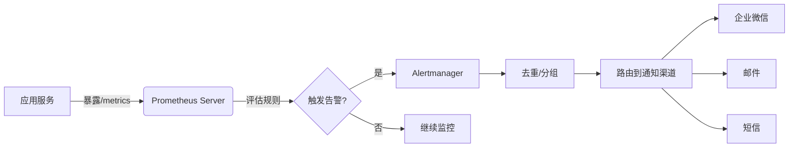
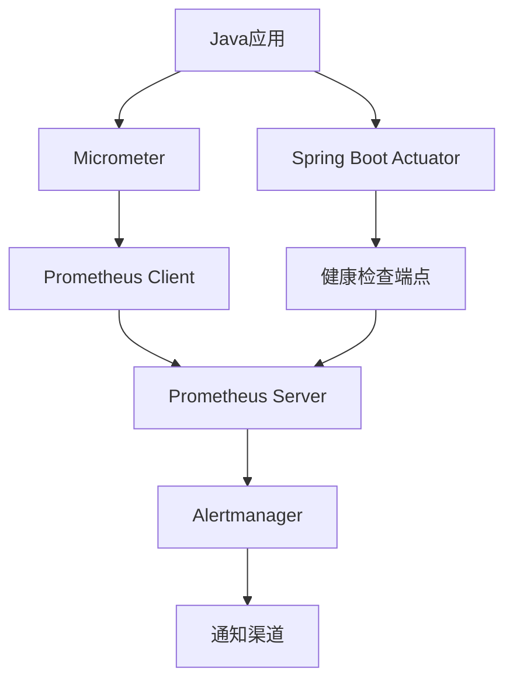

# 告警配置

<cite>
**本文档引用的文件**  
- [docker-compose.yml](file://docker-compose.yml)
- [yudao-spring-boot-starter-monitor/pom.xml](file://yudao-framework/yudao-spring-boot-starter-monitor/pom.xml)
- [YudaoMetricsAutoConfiguration.java](file://yudao-framework/yudao-spring-boot-starter-monitor/src/main/java/cn/iocoder/yudao/framework/tracer/config/YudaoMetricsAutoConfiguration.java)
- [AdminServerConfiguration.java](file://yudao-module-infra/yudao-module-infra-biz/src/main/java/cn/iocoder/yudao/module/infra/framework/monitor/config/AdminServerConfiguration.java)
</cite>

## 目录
1. [引言](#引言)
2. [项目结构](#项目结构)
3. [核心组件](#核心组件)
4. [架构概述](#架构概述)
5. [详细组件分析](#详细组件分析)
6. [依赖分析](#依赖分析)
7. [性能考虑](#性能考虑)
8. [故障排除指南](#故障排除指南)
9. [结论](#结论)
10. [附录](#附录)（如有必要）

## 引言
本文档详细说明了基于Prometheus Alertmanager的业务指标告警规则配置方法和最佳实践。涵盖订单失败率突增、API响应时间超阈值、业务量异常波动等典型场景的检测逻辑。提供告警规则的YAML配置示例，解释for、severity、summary等关键字段的含义。阐述告警分级策略，如何设置预警和紧急告警的阈值。说明告警通知渠道的配置，如邮件、企业微信、短信等，并介绍告警抑制和去重机制的实现。

## 项目结构
本项目采用模块化架构，主要包含多个业务模块（如eplus-module-crm、eplus-module-dms等）和基础框架模块（yudao-framework）。监控与告警功能主要集成在yudao-framework模块中，通过Micrometer对Prometheus的支持实现指标收集，并使用Spring Boot Admin进行服务监控。

```mermaid
graph TB
subgraph "业务模块"
CRM[eplus-module-crm]
DMS[eplus-module-dms]
FMS[eplus-module-fms]
WMS[eplus-module-wms]
end
subgraph "基础框架"
Monitor[yudao-spring-boot-starter-monitor]
Web[yudao-spring-boot-starter-web]
MyBatis[yudao-spring-boot-starter-mybatis]
end
subgraph "基础设施"
Prometheus[(Prometheus)]
Alertmanager[(Alertmanager)]
Grafana[(Grafana)]
end
Monitor --> Prometheus
Prometheus --> Alertmanager
Alertmanager --> Webhook
Webhook --> "企业微信/邮件/短信"
Monitor --> SpringBootAdmin
SpringBootAdmin --> Grafana
```

**图表来源**  
- [docker-compose.yml](file://docker-compose.yml)
- [yudao-spring-boot-starter-monitor/pom.xml](file://yudao-framework/yudao-spring-boot-starter-monitor/pom.xml)

**章节来源**
- [docker-compose.yml](file://docker-compose.yml)
- [yudao-spring-boot-starter-monitor/pom.xml](file://yudao-framework/yudao-spring-boot-starter-monitor/pom.xml)

## 核心组件
系统的核心监控组件包括Micrometer、Prometheus客户端、Spring Boot Actuator和Spring Boot Admin。Micrometer作为应用指标的收集门面，将指标暴露给Prometheus抓取。Spring Boot Actuator提供健康检查、环境信息等端点。Spring Boot Admin则提供图形化界面来集中管理多个微服务实例的监控信息。

**章节来源**
- [YudaoMetricsAutoConfiguration.java](file://yudao-framework/yudao-spring-boot-starter-monitor/src/main/java/cn/iocoder/yudao/framework/tracer/config/YudaoMetricsAutoConfiguration.java)
- [AdminServerConfiguration.java](file://yudao-module-infra/yudao-module-infra-biz/src/main/java/cn/iocoder/yudao/module/infra/framework/monitor/config/AdminServerConfiguration.java)

## 架构概述
系统的监控架构采用Prometheus生态体系，通过Pull模式从各个服务实例抓取指标数据。告警规则在Prometheus Server中定义，当满足条件时触发告警并发送到Alertmanager。Alertmanager负责告警的去重、分组、静默和路由，最终通过Webhook等方式将告警通知发送到企业微信、邮件或短信等渠道。



**图表来源**  
- [yudao-spring-boot-starter-monitor/pom.xml](file://yudao-framework/yudao-spring-boot-starter-monitor/pom.xml)
- [YudaoMetricsAutoConfiguration.java](file://yudao-framework/yudao-spring-boot-starter-monitor/src/main/java/cn/iocoder/yudao/framework/tracer/config/YudaoMetricsAutoConfiguration.java)

## 详细组件分析

### 告警规则配置分析
告警规则通常以YAML格式定义在Prometheus配置文件中。以下是一个典型的告警规则示例：

```yaml
groups:
  - name: business_alerts
    rules:
      - alert: HighOrderFailureRate
        expr: sum(rate(http_requests_total{status="5xx"}[5m])) / sum(rate(http_requests_total[5m])) > 0.05
        for: 10m
        labels:
          severity: critical
        annotations:
          summary: "高订单失败率 (实例: {{ $labels.instance }})"
          description: "订单失败率在过去5分钟内持续高于5%，当前值为{{ $value }}。"
```

#### 关键字段解释
- **for**: 指定告警触发前需要持续满足条件的时间。例如`for: 10m`表示指标异常需持续10分钟才会触发告警，避免瞬时抖动导致误报。
- **severity**: 告警级别标签，用于区分告警的严重程度，如`critical`、`warning`等。
- **summary**: 告警摘要，简要描述告警内容。
- **description**: 告警详细描述，可包含具体数值和上下文信息。

#### 告警分级策略
建议设置多级告警阈值：
- **预警级别**（warning）：当指标接近但未达到危险水平时触发，例如API响应时间超过500ms。
- **紧急级别**（critical）：当指标达到危险水平时触发，例如API响应时间超过2s或服务完全不可用。

**图表来源**  
- [YudaoMetricsAutoConfiguration.java](file://yudao-framework/yudao-spring-boot-starter-monitor/src/main/java/cn/iocoder/yudao/framework/tracer/config/YudaoMetricsAutoConfiguration.java)

**章节来源**
- [YudaoMetricsAutoConfiguration.java](file://yudao-framework/yudao-spring-boot-starter-monitor/src/main/java/cn/iocoder/yudao/framework/tracer/config/YudaoMetricsAutoConfiguration.java)

### 通知渠道配置
告警通知可通过Alertmanager配置多种渠道：

```yaml
receivers:
  - name: 'wechat'
    webhook_configs:
      - url: 'https://qyapi.weixin.qq.com/cgi-bin/webhook/send?key=xxx'
  - name: 'email'
    email_configs:
      - to: 'admin@example.com'
  - name: 'sms'
    webhook_configs:
      - url: 'http://sms-gateway/send'
```

支持企业微信、邮件、短信等多种通知方式，可根据告警级别路由到不同的接收组。

**章节来源**
- [yudao-spring-boot-starter-monitor/pom.xml](file://yudao-framework/yudao-spring-boot-starter-monitor/pom.xml)

### 告警抑制与去重机制
Alertmanager内置了强大的告警处理能力：
- **去重**（Deduplication）：相同告警在指定时间内只发送一次。
- **分组**（Grouping）：将相似告警合并为一个通知，避免告警风暴。
- **抑制**（Inhibition）：当高优先级告警触发时，抑制低优先级告警的通知。

这些机制通过Alertmanager的配置文件实现，确保运维人员能够高效处理告警事件。

**章节来源**
- [yudao-spring-boot-starter-monitor/pom.xml](file://yudao-framework/yudao-spring-boot-starter-monitor/pom.xml)

## 依赖分析
系统依赖于Prometheus生态系统进行监控和告警。主要依赖关系如下：



**图表来源**  
- [yudao-spring-boot-starter-monitor/pom.xml](file://yudao-framework/yudao-spring-boot-starter-monitor/pom.xml)
- [docker-compose.yml](file://docker-compose.yml)

**章节来源**
- [yudao-spring-boot-starter-monitor/pom.xml](file://yudao-framework/yudao-spring-boot-starter-monitor/pom.xml)
- [docker-compose.yml](file://docker-compose.yml)

## 性能考虑
监控系统本身应尽量减少对主业务的影响：
- 指标收集采用非阻塞方式
- 合理设置采样间隔，避免过于频繁的抓取
- 对高基数标签进行控制，防止指标爆炸
- 使用Pull模式而非Push模式，由Prometheus主动抓取，减轻应用负担

## 故障排除指南
常见问题及解决方案：
- **指标未显示**：检查`/actuator/prometheus`端点是否可访问，确认Micrometer配置正确。
- **告警未触发**：验证Prometheus规则语法，检查表达式是否正确匹配指标。
- **通知未收到**：检查Alertmanager配置，确认Webhook URL或邮件服务器设置正确。

**章节来源**
- [YudaoMetricsAutoConfiguration.java](file://yudao-framework/yudao-spring-boot-starter-monitor/src/main/java/cn/iocoder/yudao/framework/tracer/config/YudaoMetricsAutoConfiguration.java)
- [AdminServerConfiguration.java](file://yudao-module-infra/yudao-module-infra-biz/src/main/java/cn/iocoder/yudao/module/infra/framework/monitor/config/AdminServerConfiguration.java)

## 结论
本文档详细介绍了基于Prometheus Alertmanager的告警配置方案。通过合理的规则定义、分级策略和通知机制，可以构建一个高效可靠的监控告警系统。建议结合业务特点定制告警规则，并定期评审和优化，确保告警的有效性和及时性。