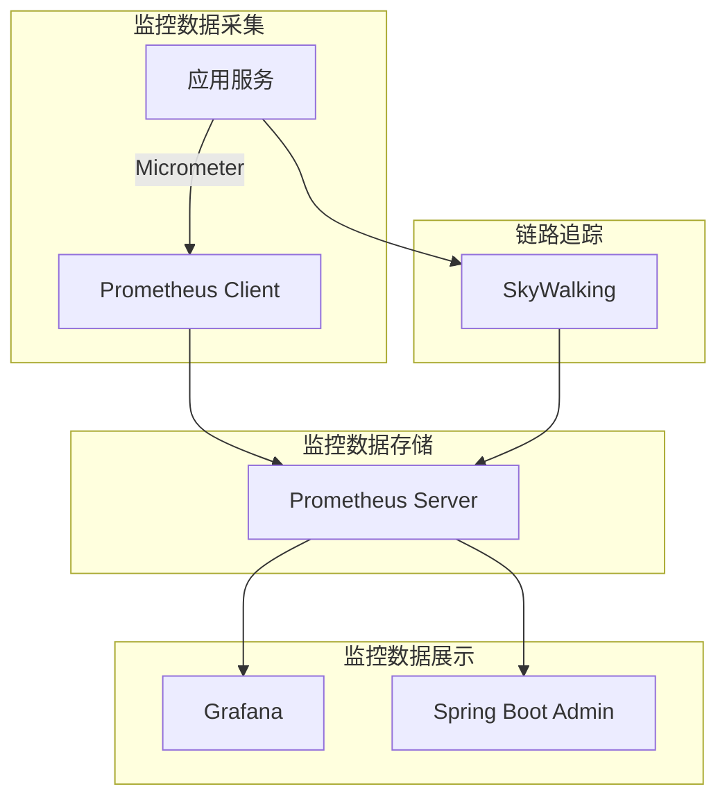
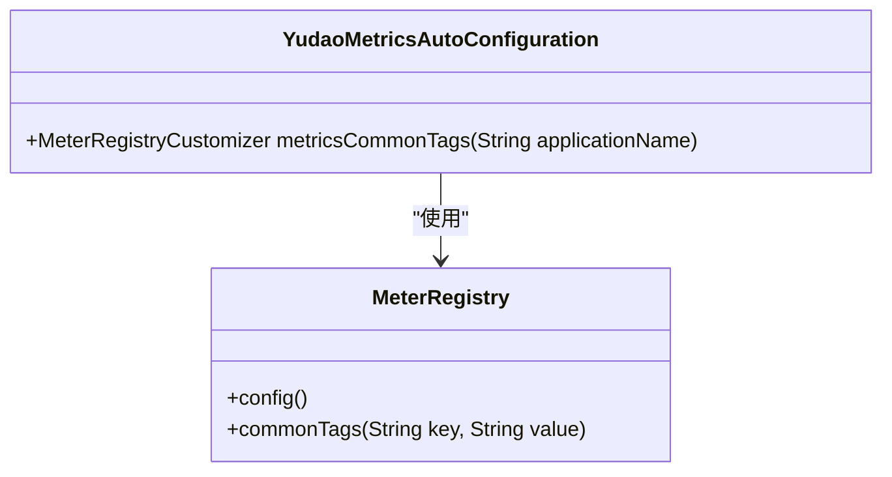
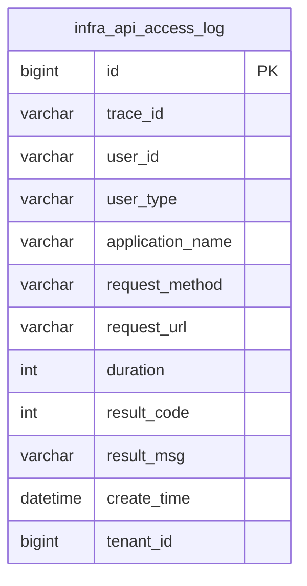

# 指标查询与分析

<cite>
**本文档引用文件**  
- [YudaoMetricsAutoConfiguration.java](file://yudao-framework/yudao-spring-boot-starter-monitor/src/main/java/cn/iocoder/yudao/framework/tracer/config/YudaoMetricsAutoConfiguration.java)
- [pom.xml](file://yudao-framework/yudao-spring-boot-starter-monitor/pom.xml)
- [AdminServerConfiguration.java](file://yudao-module-infra/yudao-module-infra-biz/src/main/java/cn/iocoder/yudao/module/infra/framework/monitor/config/AdminServerConfiguration.java)
- [ruoyi-vue-pro.sql](file://sql/mysql/ruoyi-vue-pro.sql)
</cite>

## 目录
1. [引言](#引言)
2. [系统监控架构概述](#系统监控架构概述)
3. [Prometheus 指标采集配置](#prometheus-指标采集配置)
4. [核心业务指标分析](#核心业务指标分析)
5. [PromQL 常用函数详解](#promql-常用函数详解)
6. [多维数据分析方法](#多维数据分析方法)
7. [复杂查询实战案例](#复杂查询实战案例)
8. [API 访问日志与性能监控](#api-访问日志与性能监控)
9. [总结](#总结)

## 引言
本文档旨在详细介绍基于 Prometheus 的指标查询与分析系统，重点阐述 PromQL（Prometheus Query Language）在业务指标分析中的实际应用。通过本系统，可以实现对订单处理速率、API 调用成功率、业务指标趋势等关键性能指标的实时监控与深度分析。文档将深入讲解 rate()、increase()、histogram_quantile() 等核心函数的使用方法，并展示如何通过标签（Tag）组合实现按业务线、地区、产品类型等维度的指标切片分析。

## 系统监控架构概述



**图示来源**  
- [YudaoMetricsAutoConfiguration.java](file://yudao-framework/yudao-spring-boot-starter-monitor/src/main/java/cn/iocoder/yudao/framework/tracer/config/YudaoMetricsAutoConfiguration.java)
- [pom.xml](file://yudao-framework/yudao-spring-boot-starter-monitor/pom.xml)

**本节来源**  
- [YudaoMetricsAutoConfiguration.java](file://yudao-framework/yudao-spring-boot-starter-monitor/src/main/java/cn/iocoder/yudao/framework/tracer/config/YudaoMetricsAutoConfiguration.java)
- [pom.xml](file://yudao-framework/yudao-spring-boot-starter-monitor/pom.xml)

## Prometheus 指标采集配置

系统通过 Micrometer 框架集成 Prometheus 指标采集功能，自动暴露应用的运行时指标。在 `yudao-spring-boot-starter-monitor` 模块中，通过 `YudaoMetricsAutoConfiguration` 配置类实现了通用标签的自动注入，确保所有采集的指标都包含应用名称等关键标识。



**图示来源**  
- [YudaoMetricsAutoConfiguration.java](file://yudao-framework/yudao-spring-boot-starter-monitor/src/main/java/cn/iocoder/yudao/framework/tracer/config/YudaoMetricsAutoConfiguration.java)

**本节来源**  
- [YudaoMetricsAutoConfiguration.java](file://yudao-framework/yudao-spring-boot-starter-monitor/src/main/java/cn/iocoder/yudao/framework/tracer/config/YudaoMetricsAutoConfiguration.java)

## 核心业务指标分析

### 订单处理速率分析
通过 Prometheus 采集的 HTTP 请求指标，可以计算订单处理速率。使用 `rate()` 函数计算单位时间内成功处理的订单数量。

```promql
# 计算过去5分钟内的订单创建速率
rate(http_server_requests_seconds_count{uri="/api/order/create", status="200"}[5m])
```

### API 调用成功率
通过对比成功和失败的 API 调用次数，计算 API 调用成功率。

```promql
# 计算API调用成功率
sum(rate(http_server_requests_seconds_count{status="200"}[5m])) 
/ 
sum(rate(http_server_requests_seconds_count{}[5m]))
```

### 业务指标趋势分析
利用 `increase()` 函数分析业务指标在指定时间窗口内的增长量。

```promql
# 分析过去1小时内订单总数的增长
increase(order_total_count{}[1h])
```

**本节来源**  
- [YudaoMetricsAutoConfiguration.java](file://yudao-framework/yudao-spring-boot-starter-monitor/src/main/java/cn/iocoder/yudao/framework/tracer/config/YudaoMetricsAutoConfiguration.java)

## PromQL 常用函数详解

### rate() 函数
`rate()` 函数用于计算时间序列在指定时间窗口内的每秒平均增长率，适用于计数器类型的指标。

```promql
# 语法：rate(metric_name[time_window])
rate(http_server_requests_seconds_count{}[5m])
```

### increase() 函数
`increase()` 函数计算时间序列在指定时间窗口内的总增量。

```promql
# 语法：increase(metric_name[time_window])
increase(order_count_total[1h])
```

### histogram_quantile() 函数
`histogram_quantile()` 函数用于计算直方图指标的分位数，常用于分析请求延迟分布。

```promql
# 计算95%的请求延迟
histogram_quantile(0.95, sum(rate(http_server_requests_seconds_bucket{}[5m])) by (le))
```

**本节来源**  
- [YudaoMetricsAutoConfiguration.java](file://yudao-framework/yudao-spring-boot-starter-monitor/src/main/java/cn/iocoder/yudao/framework/tracer/config/YudaoMetricsAutoConfiguration.java)

## 多维数据分析方法

系统支持通过标签（Tag）组合实现多维度的指标切片分析。每个指标都包含多个标签，如 `application`、`uri`、`status` 等，可以通过这些标签进行灵活的维度组合。

### 按业务线分析
```promql
# 按不同业务线分析API调用情况
sum by (application) (rate(http_server_requests_seconds_count{}[5m]))
```

### 按地区分析
```promql
# 按地区分析订单处理速率（假设存在region标签）
sum by (region) (rate(order_processing_count{}[5m]))
```

### 按产品类型分析
```promql
# 按产品类型分析API错误率
sum by (product_type) (
  rate(http_server_requests_seconds_count{status!="200"}[5m])
) 
/ 
sum by (product_type) (
  rate(http_server_requests_seconds_count{}[5m])
)
```

**本节来源**  
- [YudaoMetricsAutoConfiguration.java](file://yudao-framework/yudao-spring-boot-starter-monitor/src/main/java/cn/iocoder/yudao/framework/tracer/config/YudaoMetricsAutoConfiguration.java)

## 复杂查询实战案例

### 订单失败率同比环比分析
通过 PromQL 实现订单失败率的同比环比分析，帮助识别业务异常。

```promql
# 当前订单失败率
current_failure_rate = 
  sum(rate(order_failure_count{}[1h])) 
  / 
  sum(rate(order_total_count{}[1h]))

# 昨日同期订单失败率（环比）
yesterday_failure_rate = 
  sum(rate(order_failure_count{}[1h] offset 24h)) 
  / 
  sum(rate(order_total_count{}[1h] offset 24h))

# 同比变化率
同比变化率 = (current_failure_rate - yesterday_failure_rate) / yesterday_failure_rate * 100
```

### 多维度组合分析
```promql
# 按应用和状态码分析请求延迟的95分位数
histogram_quantile(0.95, 
  sum by (le, application, status) (
    rate(http_server_requests_seconds_bucket{}[5m])
  )
)
```

**本节来源**  
- [YudaoMetricsAutoConfiguration.java](file://yudao-framework/yudao-spring-boot-starter-monitor/src/main/java/cn/iocoder/yudao/framework/tracer/config/YudaoMetricsAutoConfiguration.java)

## API 访问日志与性能监控

系统通过 `infra_api_access_log` 表记录详细的 API 访问日志，包括请求路径、执行时长、结果码等关键信息。这些数据可以与 Prometheus 指标结合，进行更深入的性能分析。



**图示来源**  
- [ruoyi-vue-pro.sql](file://sql/mysql/ruoyi-vue-pro.sql)

**本节来源**  
- [ruoyi-vue-pro.sql](file://sql/mysql/ruoyi-vue-pro.sql)

## 总结
本文档详细介绍了基于 Prometheus 的指标查询与分析系统，涵盖了从系统架构、指标采集到复杂查询的各个方面。通过 PromQL 的强大功能，可以实现对业务指标的深度分析，为系统性能优化和业务决策提供有力支持。系统通过 Micrometer 与 Prometheus 的集成，实现了自动化的指标采集，并通过标签机制支持多维度的数据分析，满足了不同场景下的监控需求。