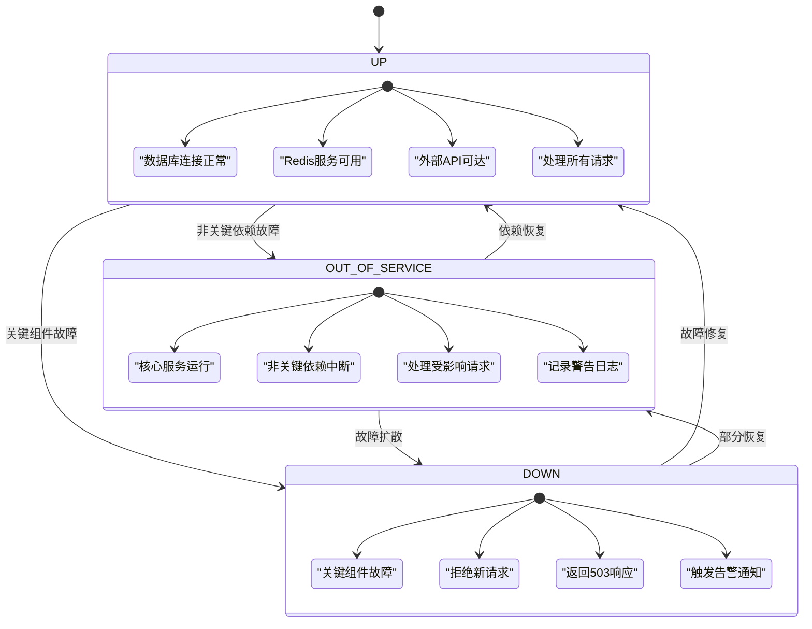
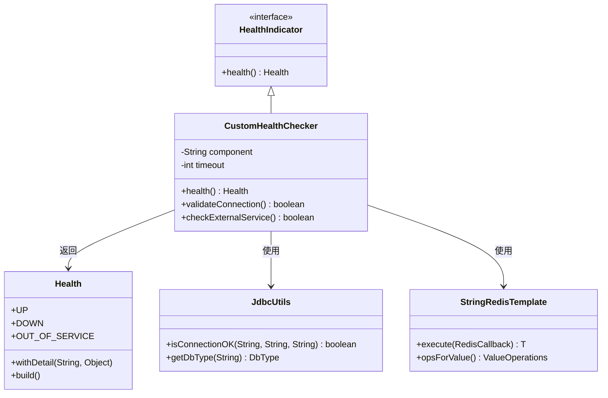
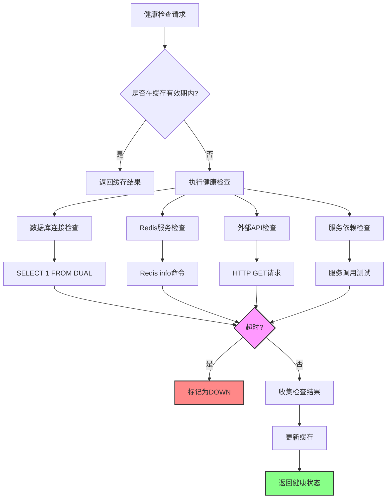
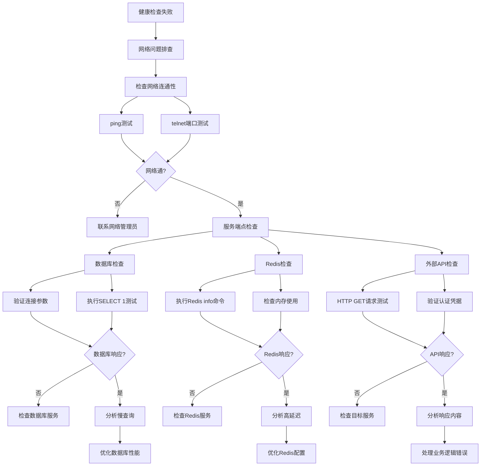

# 健康检查

<cite>
**本文档引用的文件**  
- [application-prod.yaml](file://yudao-server/src/main/resources/application-prod.yaml)
- [YudaoMetricsAutoConfiguration.java](file://yudao-framework/yudao-spring-boot-starter-monitor/src/main/java/cn/iocoder/yudao/framework/tracer/config/YudaoMetricsAutoConfiguration.java)
- [AdminServerConfiguration.java](file://yudao-module-infra/yudao-module-infra-biz/src/main/java/cn/iocoder/yudao/module/infra/framework/monitor/config/AdminServerConfiguration.java)
- [RedisController.java](file://yudao-module-infra/yudao-module-infra-biz/src/main/java/cn/iocoder/yudao/module/infra/controller/admin/redis/RedisController.java)
- [RedisMonitorRespVO.java](file://yudao-module-infra/yudao-module-infra-biz/src/main/java/cn/iocoder/yudao/module/infra/controller/admin/redis/vo/RedisMonitorRespVO.java)
- [RedisConvert.java](file://yudao-module-infra/yudao-module-infra-biz/src/main/java/cn/iocoder/yudao/module/infra/convert/redis/RedisConvert.java)
- [pom.xml](file://yudao-framework/yudao-spring-boot-starter-monitor/pom.xml)
- [docker-compose.yml](file://docker-compose.yml)
</cite>

## 目录
1. [引言](#引言)
2. [健康检查端点实现原理](#健康检查端点实现原理)
3. [健康状态分级](#健康状态分级)
4. [自定义健康检查器实现方法](#自定义健康检查器实现方法)
5. [健康检查频率与超时配置](#健康检查频率与超时配置)
6. [健康检查失败排查流程](#健康检查失败排查流程)
7. [Kubernetes集成使用方法](#kubernetes集成使用方法)

## 引言
本系统采用Spring Boot Actuator作为核心健康检查机制，通过/actuator/health端点提供全面的系统健康状态检测功能。该机制不仅监控应用自身的运行状况，还对数据库连接、Redis缓存、外部API和服务依赖等关键组件进行实时健康检查。系统通过Spring Boot Admin实现集中化监控管理，结合Prometheus和SkyWalking等工具提供完整的可观测性解决方案。

**Section sources**
- [application-prod.yaml](file://yudao-server/src/main/resources/application-prod.yaml#L137-L158)
- [YudaoMetricsAutoConfiguration.java](file://yudao-framework/yudao-spring-boot-starter-monitor/src/main/java/cn/iocoder/yudao/framework/tracer/config/YudaoMetricsAutoConfiguration.java#L1-L27)

## 健康检查端点实现原理
系统通过Spring Boot Actuator框架实现/actuator/health端点，该端点整合了多个健康检查器来评估系统整体健康状况。配置文件中通过management.endpoints.web.exposure.include='*'开放所有监控端点，包括健康检查、指标收集等功能。

数据库健康检查通过Druid连接池的validation-query配置实现，使用"SELECT 1 FROM DUAL"语句验证数据库连接的有效性。Redis健康检查通过StringRedisTemplate执行RedisServerCommands::info和RedisServerCommands::dbSize命令来检测Redis服务状态和键数量。

外部服务依赖的健康检查通过Resilience4j的限流器配置实现，当服务调用超过预设阈值时会触发健康状态变化。系统还集成了Micrometer与Prometheus，通过YudaoMetricsAutoConfiguration配置应用指标的收集和暴露。

```mermaid
flowchart TD
A[/actuator/health端点] --> B[数据库健康检查]
A --> C[Redis健康检查]
A --> D[外部API健康检查]
A --> E[服务依赖健康检查]
B --> F[Druid连接池验证]
C --> G[Redis info命令]
C --> H[Redis dbSize命令]
D --> I[Resilience4j限流器]
E --> J[Spring Boot Admin监控]
F --> K[SELECT 1 FROM DUAL]
G --> L[获取Redis服务器信息]
H --> M[获取键数量]
I --> N[调用频率监控]
J --> O[集中化监控管理]
```

**Diagram sources**
- [application-prod.yaml](file://yudao-server/src/main/resources/application-prod.yaml#L137-L158)
- [RedisController.java](file://yudao-module-infra/yudao-module-infra-biz/src/main/java/cn/iocoder/yudao/module/infra/controller/admin/redis/RedisController.java#L26-L43)
- [YudaoMetricsAutoConfiguration.java](file://yudao-framework/yudao-spring-boot-starter-monitor/src/main/java/cn/iocoder/yudao/framework/tracer/config/YudaoMetricsAutoConfiguration.java#L1-L27)

**Section sources**
- [application-prod.yaml](file://yudao-server/src/main/resources/application-prod.yaml#L137-L158)
- [RedisController.java](file://yudao-module-infra/yudao-module-infra-biz/src/main/java/cn/iocoder/yudao/module/infra/controller/admin/redis/RedisController.java#L26-L43)

## 健康状态分级
系统健康状态分为三个级别：UP、OUT_OF_SERVICE和DOWN，每个级别具有明确的业务含义和处理策略。

**UP状态**表示系统及其所有依赖组件均正常运行。在此状态下，系统可以正常处理所有业务请求，数据库连接稳定，Redis缓存可用，外部API调用成功。这是系统理想的运行状态。

**OUT_OF_SERVICE状态**表示系统部分功能不可用，但核心服务仍然运行。这种情况通常发生在非关键依赖服务中断时，如某些外部API暂时不可用或次要数据库连接问题。系统会继续处理不受影响的业务请求，同时记录警告日志。

**DOWN状态**表示系统关键组件出现故障，无法正常提供服务。这可能是由于主数据库连接失败、Redis服务宕机或核心外部依赖中断导致。在此状态下，系统会拒绝新的业务请求，返回服务不可用响应，并触发告警通知。



**Diagram sources**
- [application-prod.yaml](file://yudao-server/src/main/resources/application-prod.yaml#L137-L158)
- [RedisMonitorRespVO.java](file://yudao-module-infra/yudao-module-infra-biz/src/main/java/cn/iocoder/yudao/module/infra/controller/admin/redis/vo/RedisMonitorRespVO.java#L1-L43)

**Section sources**
- [application-prod.yaml](file://yudao-server/src/main/resources/application-prod.yaml#L137-L158)
- [RedisMonitorRespVO.java](file://yudao-module-infra/yudao-module-infra-biz/src/main/java/cn/iocoder/yudao/module/infra/controller/admin/redis/vo/RedisMonitorRespVO.java#L1-L43)

## 自定义健康检查器实现方法
系统支持通过扩展Spring Boot Actuator的HealthIndicator接口来实现自定义健康检查器。开发者可以为特定业务组件创建专门的健康检查逻辑，确保关键业务功能的可用性得到准确监控。

创建自定义健康检查器的基本步骤包括：定义一个类实现HealthIndicator接口，重写health()方法实现具体的健康检查逻辑，在方法中执行必要的检测操作，并根据检测结果返回相应的Health对象。Health对象可以包含详细的状态信息和附加指标。

对于数据库相关的健康检查，可以使用JdbcUtils工具类的isConnectionOK方法验证连接状态。Redis健康检查可以通过StringRedisTemplate执行Redis命令来检测服务状态。外部API健康检查建议使用Resilience4j的断路器模式，避免因网络延迟导致的健康检查超时问题。



**Diagram sources**
- [RedisController.java](file://yudao-module-infra/yudao-module-infra-biz/src/main/java/cn/iocoder/yudao/module/infra/controller/admin/redis/RedisController.java#L26-L43)
- [JdbcUtils.java](file://yudao-framework/yudao-spring-boot-starter-mybatis/src/main/java/cn/iocoder/yudao/framework/mybatis/core/util/JdbcUtils.java#L1-L42)
- [RedisConvert.java](file://yudao-module-infra/yudao-module-infra-biz/src/main/java/cn/iocoder/yudao/module/infra/convert/redis/RedisConvert.java#L1-L29)

**Section sources**
- [RedisController.java](file://yudao-module-infra/yudao-module-infra-biz/src/main/java/cn/iocoder/yudao/module/infra/controller/admin/redis/RedisController.java#L26-L43)
- [JdbcUtils.java](file://yudao-framework/yudao-spring-boot-starter-mybatis/src/main/java/cn/iocoder/yudao/framework/mybatis/core/util/JdbcUtils.java#L1-L42)

## 健康检查频率与超时配置
系统健康检查的频率和超时设置通过Spring Boot Actuator和相关监控组件的配置进行管理。默认情况下，健康检查端点会根据请求实时执行所有健康检查器，但可以通过缓存机制优化性能。

在application-prod.yaml配置文件中，通过management.endpoints.web.exposure.include='*'开放所有监控端点，而具体的健康检查行为由各个健康检查器自行决定。对于数据库健康检查，Druid连接池配置了test-while-idle: true，表示在连接空闲时进行有效性测试，time-between-eviction-runs-millis: 60000设置为60秒的检测间隔。

Redis健康检查的超时设置主要依赖于Redis连接池的配置，包括max-wait: 600000毫秒的获取连接等待超时时间。外部API健康检查通过Resilience4j的timeout-duration: 1s配置，限制了单个健康检查操作的最大执行时间。

为了减少频繁健康检查对系统性能的影响，建议配置健康检查结果的缓存策略。可以通过实现缓存机制，将健康检查结果缓存一段时间（如30秒），避免在短时间内重复执行昂贵的健康检查操作。



**Diagram sources**
- [application-prod.yaml](file://yudao-server/src/main/resources/application-prod.yaml#L137-L158)
- [RedisController.java](file://yudao-module-infra/yudao-module-infra-biz/src/main/java/cn/iocoder/yudao/module/infra/controller/admin/redis/RedisController.java#L26-L43)

**Section sources**
- [application-prod.yaml](file://yudao-server/src/main/resources/application-prod.yaml#L137-L158)
- [RedisController.java](file://yudao-module-infra/yudao-module-infra-biz/src/main/java/cn/iocoder/yudao/module/infra/controller/admin/redis/RedisController.java#L26-L43)

## 健康检查失败排查流程
当健康检查失败时，应按照系统化的排查流程进行诊断，从网络层面到服务依赖逐层深入。首先检查网络连通性，确保应用服务器能够访问数据库、Redis和其他依赖服务。

对于数据库连接问题，检查数据库服务器是否正常运行，网络防火墙是否阻止了连接，数据库连接参数（URL、用户名、密码）是否正确。使用JdbcUtils的isConnectionOK方法可以帮助快速验证数据库连接状态。

Redis连接问题的排查应从Redis服务器状态开始，检查Redis服务是否正在运行，网络端口是否开放。通过执行Redis info命令获取服务器详细信息，分析内存使用情况、连接数等指标。检查Redis密码配置是否正确，以及是否有网络策略限制了访问。

外部API和服务依赖中断的诊断需要检查目标服务的可用性，验证API端点是否可访问，检查认证凭据是否有效。对于使用Resilience4j保护的服务，检查断路器状态，了解是否因连续失败而进入熔断状态。



**Diagram sources**
- [application-prod.yaml](file://yudao-server/src/main/resources/application-prod.yaml#L137-L158)
- [RedisController.java](file://yudao-module-infra/yudao-module-infra-biz/src/main/java/cn/iocoder/yudao/module/infra/controller/admin/redis/RedisController.java#L26-L43)
- [JdbcUtils.java](file://yudao-framework/yudao-spring-boot-starter-mybatis/src/main/java/cn/iocoder/yudao/framework/mybatis/core/util/JdbcUtils.java#L1-L42)

**Section sources**
- [application-prod.yaml](file://yudao-server/src/main/resources/application-prod.yaml#L137-L158)
- [RedisController.java](file://yudao-module-infra/yudao-module-infra-biz/src/main/java/cn/iocoder/yudao/module/infra/controller/admin/redis/RedisController.java#L26-L43)
- [JdbcUtils.java](file://yudao-framework/yudao-spring-boot-starter-mybatis/src/main/java/cn/iocoder/yudao/framework/mybatis/core/util/JdbcUtils.java#L1-L42)

## Kubernetes集成使用方法
在Kubernetes环境中，系统健康检查与容器编排平台深度集成，通过Liveness和Readiness探针实现自动化的容器管理。Liveness探针用于确定容器是否处于运行状态，当探针失败时Kubernetes会重启容器。Readiness探针用于确定容器是否准备好接收流量，当探针失败时会从服务负载均衡中移除该实例。

Kubernetes配置中，将/actuator/health端点作为Liveness和Readiness探针的目标。通过配置适当的初始延迟、检查间隔和超时时间，确保健康检查不会对系统造成过大负担。建议设置initialDelaySeconds为30秒，allowing应用充分启动，periodSeconds设置为15秒，实现频繁的健康状态检测。

在部署配置中，还需要考虑资源限制和请求，确保容器有足够的CPU和内存资源来处理健康检查和其他业务请求。通过Horizontal Pod Autoscaler（HPA）基于CPU使用率或其他自定义指标自动扩展实例数量，提高系统的可用性和性能。

```mermaid
graph TB
subgraph "Kubernetes集群"
A[Deployment]
B[Service]
C[Ingress]
D[Pod1]
E[Pod2]
F[Pod3]
end
G[外部流量] --> C
C --> B
B --> D
B --> E
B --> F
A --> D
A --> E
A --> F
D --> H[/actuator/health]
E --> H
F --> H
H --> I[数据库检查]
H --> J[Redis检查]
H --> K[外部API检查]
I --> L{数据库连接正常?}
J --> M{Redis服务可用?}
K --> N{API可达?}
L --> |否| O[标记Pod不健康]
M --> |否| O
N --> |否| O
O --> P[从Service移除]
P --> Q[重启容器]
style H fill:#4CAF50,stroke:#333,stroke-width:2px
style O fill:#FF9800,stroke:#333,stroke-width:2px
style P fill:#2196F3,stroke:#333,stroke-width:2px
```

**Diagram sources**
- [docker-compose.yml](file://docker-compose.yml#L1-L40)
- [application-prod.yaml](file://yudao-server/src/main/resources/application-prod.yaml#L137-L158)

**Section sources**
- [docker-compose.yml](file://docker-compose.yml#L1-L40)
- [application-prod.yaml](file://yudao-server/src/main/resources/application-prod.yaml#L137-L158)