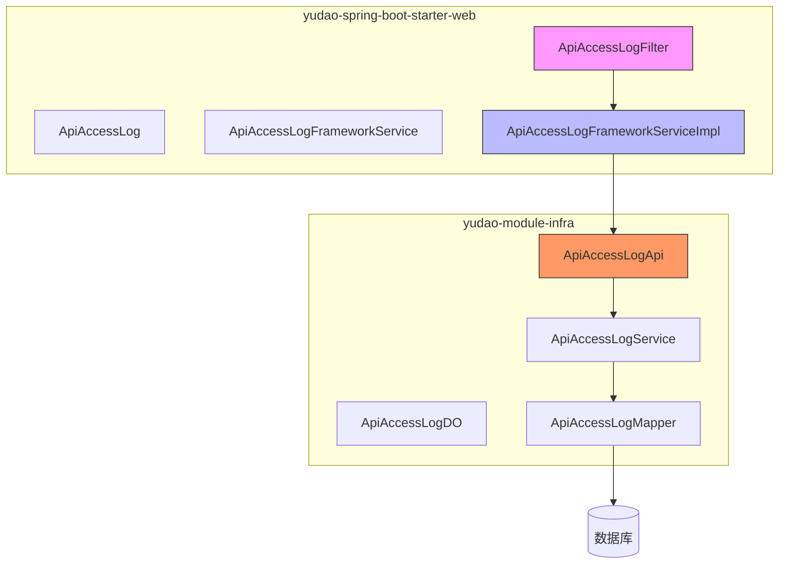
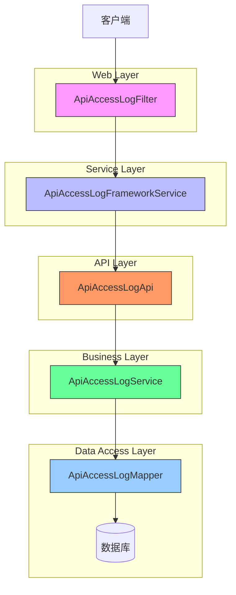
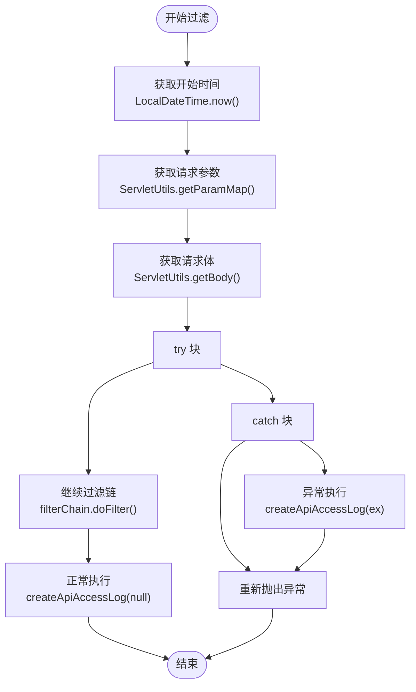
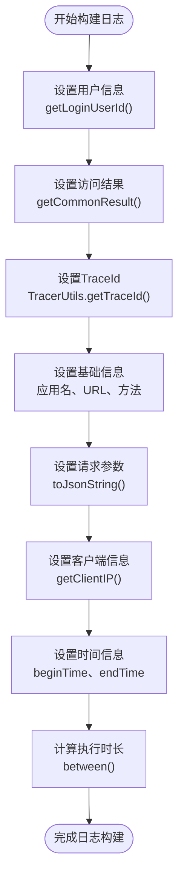
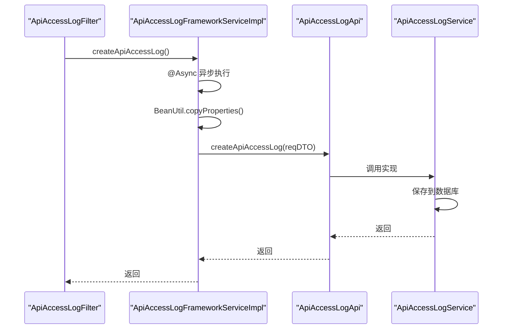
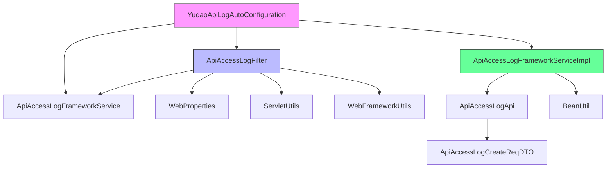

# 切面实现

<cite>
**本文档引用的文件**
- [ApiAccessLogFilter.java](file://yudao-framework/yudao-spring-boot-starter-web/src/main/java/cn/iocoder/yudao/framework/apilog/core/filter/ApiAccessLogFilter.java)
- [ApiAccessLogFrameworkServiceImpl.java](file://yudao-framework/yudao-spring-boot-starter-web/src/main/java/cn/iocoder/yudao/framework/apilog/core/service/ApiAccessLogFrameworkServiceImpl.java)
- [YudaoApiLogAutoConfiguration.java](file://yudao-framework/yudao-spring-boot-starter-web/src/main/java/cn/iocoder/yudao/framework/apilog/config/YudaoApiLogAutoConfiguration.java)
- [ApiAccessLog.java](file://yudao-framework/yudao-spring-boot-starter-web/src/main/java/cn/iocoder/yudao/framework/apilog/core/service/ApiAccessLog.java)
- [ApiAccessLogApi.java](file://yudao-module-infra/yudao-module-infra-api/src/main/java/cn/iocoder/yudao/module/infra/api/logger/ApiAccessLogApi.java)
</cite>

## 目录
1. [引言](#引言)
2. [项目结构](#项目结构)
3. [核心组件](#核心组件)
4. [架构概述](#架构概述)
5. [详细组件分析](#详细组件分析)
6. [依赖分析](#依赖分析)
7. [性能考虑](#性能考虑)
8. [故障排除指南](#故障排除指南)
9. [结论](#结论)

## 引言
本文档详细解析了API访问日志切面的实现机制。该实现基于Spring AOP和Servlet Filter技术，通过拦截Controller层的请求来记录详细的访问日志信息。系统能够捕获请求的开始时间、结束时间、执行结果等关键指标，并从HttpServletRequest中提取请求方法、URL、参数和客户端IP地址。特别地，该实现还包含了完善的异常处理机制，确保即使请求失败也能完整记录访问日志。此外，系统通过生成唯一的traceId并注入到MDC（Mapped Diagnostic Context）中，为分布式链路追踪提供了支持。

## 项目结构
系统采用模块化设计，将API访问日志功能封装在独立的starter模块中，实现了功能的解耦和复用。

**图示来源**
- [ApiAccessLogFilter.java](file://yudao-framework/yudao-spring-boot-starter-web/src/main/java/cn/iocoder/yudao/framework/apilog/core/filter/ApiAccessLogFilter.java)
- [ApiAccessLogFrameworkServiceImpl.java](file://yudao-framework/yudao-spring-boot-starter-web/src/main/java/cn/iocoder/yudao/framework/apilog/core/service/ApiAccessLogFrameworkServiceImpl.java)
- [ApiAccessLogApi.java](file://yudao-module-infra/yudao-module-infra-api/src/main/java/cn/iocoder/yudao/module/infra/api/logger/ApiAccessLogApi.java)

**章节来源**
- [ApiAccessLogFilter.java](file://yudao-framework/yudao-spring-boot-starter-web/src/main/java/cn/iocoder/yudao/framework/apilog/core/filter/ApiAccessLogFilter.java#L1-L111)
- [YudaoApiLogAutoConfiguration.java](file://yudao-framework/yudao-spring-boot-starter-web/src/main/java/cn/iocoder/yudao/framework/apilog/config/YudaoApiLogAutoConfiguration.java#L1-L53)

## 核心组件
API访问日志功能的核心组件包括ApiAccessLogFilter、ApiAccessLogFrameworkService和相关数据传输对象。ApiAccessLogFilter作为Servlet过滤器，在请求处理链中拦截所有HTTP请求，记录访问日志。ApiAccessLogFrameworkService作为服务接口，定义了创建访问日志的方法契约。系统通过分层设计，将日志收集、处理和存储职责分离，提高了代码的可维护性和可测试性。

**章节来源**
- [ApiAccessLogFilter.java](file://yudao-framework/yudao-spring-boot-starter-web/src/main/java/cn/iocoder/yudao/framework/apilog/core/filter/ApiAccessLogFilter.java#L34-L65)
- [ApiAccessLogFrameworkServiceImpl.java](file://yudao-framework/yudao-spring-boot-starter-web/src/main/java/cn/iocoder/yudao/framework/apilog/core/service/ApiAccessLogFrameworkServiceImpl.java#L17-L28)

## 架构概述
系统采用分层架构设计，从上到下分为过滤器层、服务层、API层和数据访问层。这种分层设计遵循了关注点分离原则，每个层次只负责特定的职责。过滤器层负责拦截HTTP请求并收集日志数据；服务层负责日志的异步处理；API层提供跨模块的服务调用接口；数据访问层负责将日志持久化到数据库。

**图示来源**
- [ApiAccessLogFilter.java](file://yudao-framework/yudao-spring-boot-starter-web/src/main/java/cn/iocoder/yudao/framework/apilog/core/filter/ApiAccessLogFilter.java)
- [ApiAccessLogFrameworkServiceImpl.java](file://yudao-framework/yudao-spring-boot-starter-web/src/main/java/cn/iocoder/yudao/framework/apilog/core/service/ApiAccessLogFrameworkServiceImpl.java)
- [ApiAccessLogApi.java](file://yudao-module-infra/yudao-module-infra-api/src/main/java/cn/iocoder/yudao/module/infra/api/logger/ApiAccessLogApi.java)

## 详细组件分析
### ApiAccessLogFilter分析
ApiAccessLogFilter是API访问日志功能的核心实现，作为Servlet过滤器拦截所有HTTP请求。该过滤器在请求处理前后记录时间戳，计算请求执行时长，并收集请求的详细信息。

#### 过滤器实现

**图示来源**
- [ApiAccessLogFilter.java](file://yudao-framework/yudao-spring-boot-starter-web/src/main/java/cn/iocoder/yudao/framework/apilog/core/filter/ApiAccessLogFilter.java#L46-L65)

#### 日志构建流程

**图示来源**
- [ApiAccessLogFilter.java](file://yudao-framework/yudao-spring-boot-starter-web/src/main/java/cn/iocoder/yudao/framework/apilog/core/filter/ApiAccessLogFilter.java#L78-L107)

**章节来源**
- [ApiAccessLogFilter.java](file://yudao-framework/yudao-spring-boot-starter-web/src/main/java/cn/iocoder/yudao/framework/apilog/core/filter/ApiAccessLogFilter.java#L34-L111)

### ApiAccessLogFrameworkService分析
ApiAccessLogFrameworkService负责处理API访问日志的业务逻辑，采用异步处理机制提高系统性能。

#### 服务调用流程

**图示来源**
- [ApiAccessLogFrameworkServiceImpl.java](file://yudao-framework/yudao-spring-boot-starter-web/src/main/java/cn/iocoder/yudao/framework/apilog/core/service/ApiAccessLogFrameworkServiceImpl.java#L21-L26)
- [ApiAccessLogApi.java](file://yudao-module-infra/yudao-module-infra-api/src/main/java/cn/iocoder/yudao/module/infra/api/logger/ApiAccessLogApi.java#L12-L19)

**章节来源**
- [ApiAccessLogFrameworkServiceImpl.java](file://yudao-framework/yudao-spring-boot-starter-web/src/main/java/cn/iocoder/yudao/framework/apilog/core/service/ApiAccessLogFrameworkServiceImpl.java#L17-L28)

## 依赖分析
系统通过Spring Boot的自动配置机制管理组件依赖，确保各组件能够正确初始化和协作。

**图示来源**
- [YudaoApiLogAutoConfiguration.java](file://yudao-framework/yudao-spring-boot-starter-web/src/main/java/cn/iocoder/yudao/framework/apilog/config/YudaoApiLogAutoConfiguration.java)
- [ApiAccessLogFilter.java](file://yudao-framework/yudao-spring-boot-starter-web/src/main/java/cn/iocoder/yudao/framework/apilog/core/filter/ApiAccessLogFilter.java)
- [ApiAccessLogFrameworkServiceImpl.java](file://yudao-framework/yudao-spring-boot-starter-web/src/main/java/cn/iocoder/yudao/framework/apilog/core/service/ApiAccessLogFrameworkServiceImpl.java)

**章节来源**
- [YudaoApiLogAutoConfiguration.java](file://yudao-framework/yudao-spring-boot-starter-web/src/main/java/cn/iocoder/yudao/framework/apilog/config/YudaoApiLogAutoConfiguration.java#L21-L52)

## 性能考虑
系统在设计时充分考虑了性能影响，采用了多项优化策略。首先，通过@Async注解实现异步日志处理，避免阻塞主请求线程。其次，使用Filter而非AOP切面，减少了反射调用的开销。此外，系统在捕获请求参数时提前获取，避免了与XssFilter等其他过滤器的冲突。日志记录操作被封装在try-catch块中，确保即使日志记录失败也不会影响主业务流程。

## 故障排除指南
当API访问日志功能出现问题时，可以从以下几个方面进行排查：首先检查yudao.access-log.enable配置项是否启用；其次确认相关Bean是否正确注册到Spring容器；然后检查数据库连接和表结构是否正常；最后查看日志文件中的错误信息。特别需要注意的是，由于日志处理是异步的，异常可能不会立即反映在请求响应中，需要查看后台日志来定位问题。

**章节来源**
- [ApiAccessLogFilter.java](file://yudao-framework/yudao-spring-boot-starter-web/src/main/java/cn/iocoder/yudao/framework/apilog/core/filter/ApiAccessLogFilter.java#L73-L75)
- [YudaoApiLogAutoConfiguration.java](file://yudao-framework/yudao-spring-boot-starter-web/src/main/java/cn/iocoder/yudao/framework/apilog/config/YudaoApiLogAutoConfiguration.java#L38-L39)

## 结论
API访问日志切面实现通过Filter机制高效地收集了系统访问日志，为系统监控和问题排查提供了重要支持。该实现具有良好的架构设计，通过分层和异步处理保证了性能和可靠性。系统能够完整记录请求的各个维度信息，包括用户信息、请求参数、执行结果和性能指标。通过traceId的注入，为分布式系统的链路追踪奠定了基础。整体实现充分考虑了生产环境的需求，在功能完整性和性能影响之间取得了良好平衡。