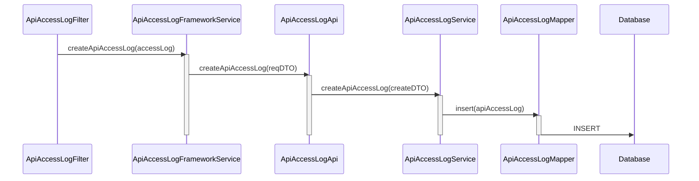
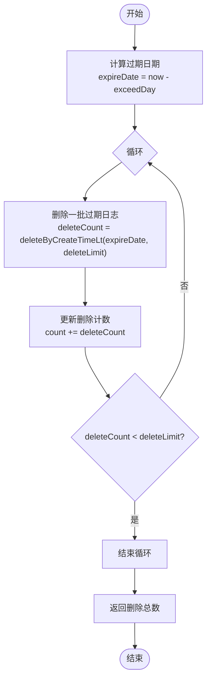
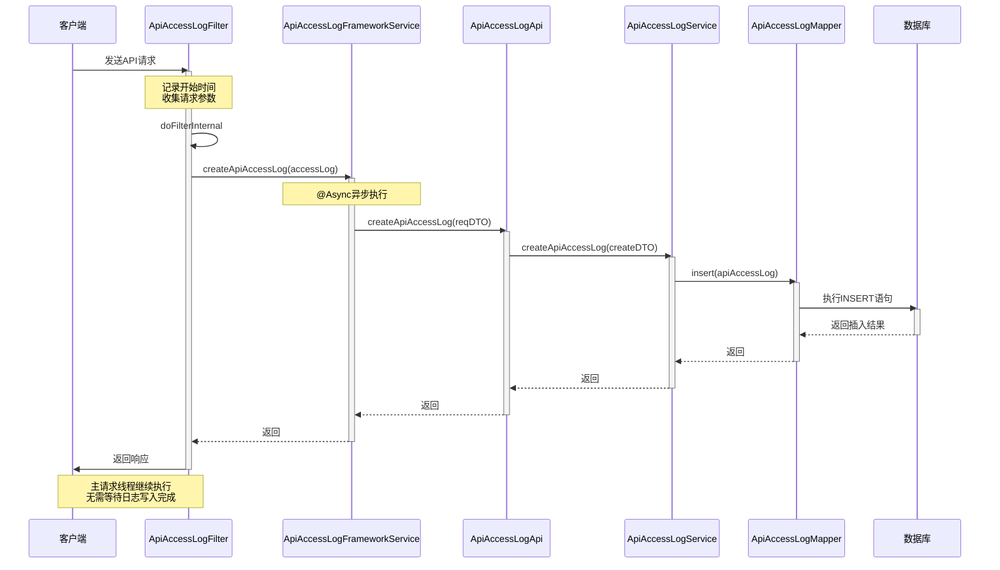

# 服务处理

<cite>
**本文档引用的文件**
- [ApiAccessLogFrameworkService.java](file://yudao-framework/yudao-spring-boot-starter-web/src/main/java/cn/iocoder/yudao/framework/apilog/core/service/ApiAccessLogFrameworkService.java)
- [ApiAccessLogFrameworkServiceImpl.java](file://yudao-framework/yudao-spring-boot-starter-web/src/main/java/cn/iocoder/yudao/framework/apilog/core/service/ApiAccessLogFrameworkServiceImpl.java)
- [ApiAccessLogFilter.java](file://yudao-framework/yudao-spring-boot-starter-web/src/main/java/cn/iocoder/yudao/framework/apilog/core/filter/ApiAccessLogFilter.java)
- [ApiAccessLog.java](file://yudao-framework/yudao-spring-boot-starter-web/src/main/java/cn/iocoder/yudao/framework/apilog/core/service/ApiAccessLog.java)
- [ApiAccessLogApi.java](file://yudao-module-infra/yudao-module-infra-api/src/main/java/cn/iocoder/yudao/module/infra/api/logger/ApiAccessLogApi.java)
- [ApiAccessLogApiImpl.java](file://yudao-module-infra/yudao-module-infra-biz/src/main/java/cn/iocoder/yudao/module/infra/api/logger/ApiAccessLogApiImpl.java)
- [ApiAccessLogService.java](file://yudao-module-infra/yudao-module-infra-biz/src/main/java/cn/iocoder/yudao/module/infra/service/logger/ApiAccessLogService.java)
- [ApiAccessLogServiceImpl.java](file://yudao-module-infra/yudao-module-infra-biz/src/main/java/cn/iocoder/yudao/module/infra/service/logger/ApiAccessLogServiceImpl.java)
- [ApiAccessLogDO.java](file://yudao-module-infra/yudao-module-infra-biz/src/main/java/cn/iocoder/yudao/module/infra/dal/dataobject/logger/ApiAccessLogDO.java)
- [ApiAccessLogMapper.java](file://yudao-module-infra/yudao-module-infra-biz/src/main/java/cn/iocoder/yudao/module/infra/dal/mysql/logger/ApiAccessLogMapper.java)
- [ApiAccessLogCreateReqDTO.java](file://yudao-module-infra/yudao-module-infra-api/src/main/java/cn/iocoder/yudao/module/infra/api/logger/dto/ApiAccessLogCreateReqDTO.java)
- [AccessLogCleanJob.java](file://yudao-module-infra/yudao-module-infra-biz/src/main/java/cn/iocoder/yudao/module/infra/job/logger/AccessLogCleanJob.java)
- [YudaoAsyncAutoConfiguration.java](file://yudao-framework/yudao-spring-boot-starter-job/src/main/java/cn/iocoder/yudao/framework/quartz/config/YudaoAsyncAutoConfiguration.java)
</cite>

## 目录
1. [API访问日志服务概述](#api访问日志服务概述)
2. [核心组件分析](#核心组件分析)
3. [异步写入机制](#异步写入机制)
4. [日志清理策略](#日志清理策略)
5. [批量日志写入与性能优化](#批量日志写入与性能优化)
6. [事务管理注意事项](#事务管理注意事项)
7. [服务调用时序图](#服务调用时序图)
8. [性能优化建议](#性能优化建议)

## API访问日志服务概述

API访问日志服务是系统中用于记录所有API请求的关键组件。该服务通过拦截器模式捕获每个API请求的详细信息，包括请求参数、响应结果、执行时间等，并将其持久化到数据库中，为系统监控、性能分析和故障排查提供数据支持。

该服务采用分层架构设计，从请求拦截到数据持久化，各组件职责明确，通过异步处理机制确保日志记录不会影响主业务流程的性能。服务的核心目标是在保证系统性能的同时，完整、准确地记录所有API访问信息。

**本节来源**
- [ApiAccessLogFrameworkService.java](file://yudao-framework/yudao-spring-boot-starter-web/src/main/java/cn/iocoder/yudao/framework/apilog/core/service/ApiAccessLogFrameworkService.java)
- [ApiAccessLogFilter.java](file://yudao-framework/yudao-spring-boot-starter-web/src/main/java/cn/iocoder/yudao/framework/apilog/core/filter/ApiAccessLogFilter.java)

## 核心组件分析

API访问日志服务由多个核心组件构成，形成完整的日志处理链路。这些组件包括日志框架服务、API接口、业务服务实现、数据访问对象和数据传输对象。

`ApiAccessLogFrameworkService`接口定义了创建API访问日志的核心方法，是日志服务的入口点。`ApiAccessLog`类作为数据传输对象，包含了API请求的所有关键信息，如用户ID、请求URL、执行时间、结果码等。

在业务实现层，`ApiAccessLogService`接口定义了创建日志、分页查询和清理日志的方法。其实现类`ApiAccessLogServiceImpl`负责将日志数据持久化到数据库。数据访问层通过`ApiAccessLogMapper`接口与数据库交互，使用MyBatis框架执行CRUD操作。

**本节来源**
- [ApiAccessLog.java](file://yudao-framework/yudao-spring-boot-starter-web/src/main/java/cn/iocoder/yudao/framework/apilog/core/service/ApiAccessLog.java)
- [ApiAccessLogDO.java](file://yudao-module-infra/yudao-module-infra-biz/src/main/java/cn/iocoder/yudao/module/infra/dal/dataobject/logger/ApiAccessLogDO.java)
- [ApiAccessLogService.java](file://yudao-module-infra/yudao-module-infra-biz/src/main/java/cn/iocoder/yudao/module/infra/service/logger/ApiAccessLogService.java)
- [ApiAccessLogServiceImpl.java](file://yudao-module-infra/yudao-module-infra-biz/src/main/java/cn/iocoder/yudao/module/infra/service/logger/ApiAccessLogServiceImpl.java)
- [ApiAccessLogMapper.java](file://yudao-module-infra/yudao-module-infra-biz/src/main/java/cn/iocoder/yudao/module/infra/dal/mysql/logger/ApiAccessLogMapper.java)

## 异步写入机制

API访问日志服务采用异步写入机制来避免阻塞主请求线程。这一机制通过Spring的`@Async`注解实现，将日志写入操作提交到独立的线程池中执行。

`ApiAccessLogFrameworkServiceImpl`类中的`createApiAccessLog`方法被`@Async`注解标记，这意味着当该方法被调用时，Spring会将其放入异步执行队列中。主请求线程在调用该方法后立即返回，无需等待日志写入完成，从而保证了主业务流程的响应速度。

异步执行的配置在`YudaoAsyncAutoConfiguration`类中定义，通过`@EnableAsync`注解启用异步支持。系统使用`ThreadPoolTaskExecutor`来管理异步任务的执行，确保日志写入操作在独立的线程环境中运行，不会影响主请求的性能。

**图示来源**
- [ApiAccessLogFilter.java](file://yudao-framework/yudao-spring-boot-starter-web/src/main/java/cn/iocoder/yudao/framework/apilog/core/filter/ApiAccessLogFilter.java#L67-L73)
- [ApiAccessLogFrameworkServiceImpl.java](file://yudao-framework/yudao-spring-boot-starter-web/src/main/java/cn/iocoder/yudao/framework/apilog/core/service/ApiAccessLogFrameworkServiceImpl.java#L22-L26)
- [ApiAccessLogApiImpl.java](file://yudao-module-infra/yudao-module-infra-biz/src/main/java/cn/iocoder/yudao/module/infra/api/logger/ApiAccessLogApiImpl.java#L23-L24)
- [ApiAccessLogServiceImpl.java](file://yudao-module-infra/yudao-module-infra-biz/src/main/java/cn/iocoder/yudao/module/infra/service/logger/ApiAccessLogServiceImpl.java#L30-L32)
- [ApiAccessLogMapper.java](file://yudao-module-infra/yudao-module-infra-biz/src/main/java/cn/iocoder/yudao/module/infra/dal/mysql/logger/ApiAccessLogMapper.java#L20)

**本节来源**
- [ApiAccessLogFrameworkServiceImpl.java](file://yudao-framework/yudao-spring-boot-starter-web/src/main/java/cn/iocoder/yudao/framework/apilog/core/service/ApiAccessLogFrameworkServiceImpl.java)
- [YudaoAsyncAutoConfiguration.java](file://yudao-framework/yudao-spring-boot-starter-job/src/main/java/cn/iocoder/yudao/framework/quartz/config/YudaoAsyncAutoConfiguration.java)

## 日志清理策略

系统实现了基于时间的日志清理策略，通过定时任务自动删除过期的日志数据，防止数据库无限增长。这一策略由`AccessLogCleanJob`定时任务和`cleanAccessLog`服务方法共同实现。

`cleanAccessLog`方法接收两个参数：`exceedDay`表示保留日志的天数，`deleteLimit`表示每次删除操作的最大记录数。该方法通过循环删除的方式，每次删除指定数量的过期日志，直到没有更多符合条件的记录为止。这种分批删除的策略可以避免一次性删除大量数据对数据库造成过大压力。

`AccessLogCleanJob`是一个定时任务，每天执行一次，调用`cleanAccessLog`方法清理14天前的日志数据，每次删除限制为100条记录。这种配置平衡了清理效率和数据库性能，确保日志数据不会无限增长，同时避免对数据库造成过大负担。

**图示来源**
- [ApiAccessLogServiceImpl.java](file://yudao-module-infra/yudao-module-infra-biz/src/main/java/cn/iocoder/yudao/module/infra/service/logger/ApiAccessLogServiceImpl.java#L40-L54)
- [ApiAccessLogMapper.java](file://yudao-module-infra/yudao-module-infra-biz/src/main/java/cn/iocoder/yudao/module/infra/dal/mysql/logger/ApiAccessLogMapper.java#L42-L43)
- [AccessLogCleanJob.java](file://yudao-module-infra/yudao-module-infra-biz/src/main/java/cn/iocoder/yudao/module/infra/job/logger/AccessLogCleanJob.java#L34-L35)

**本节来源**
- [ApiAccessLogServiceImpl.java](file://yudao-module-infra/yudao-module-infra-biz/src/main/java/cn/iocoder/yudao/module/infra/service/logger/ApiAccessLogServiceImpl.java)
- [AccessLogCleanJob.java](file://yudao-module-infra/yudao-module-infra-biz/src/main/java/cn/iocoder/yudao/module/infra/job/logger/AccessLogCleanJob.java)

## 批量日志写入与性能优化

虽然当前实现主要针对单条日志的异步写入，但系统架构支持批量日志写入的性能优化。通过分析现有组件，可以实现高效的批量处理机制。

`ApiAccessLogMapper`接口中的`insert`方法可以扩展为支持批量插入，利用MyBatis的批量操作功能，将多条日志记录一次性写入数据库，显著减少数据库交互次数。同时，`ApiAccessLogFrameworkService`接口可以增加批量创建日志的方法，允许一次性提交多条日志记录。

在异步处理方面，可以通过调整线程池配置来优化批量写入性能。增加核心线程数和队列容量，可以更好地处理突发的日志写入请求。此外，可以实现日志缓冲机制，将短时间内产生的多条日志先缓存在内存中，达到一定数量后再批量写入数据库。

**本节来源**
- [ApiAccessLogMapper.java](file://yudao-module-infra/yudao-module-infra-biz/src/main/java/cn/iocoder/yudao/module/infra/dal/mysql/logger/ApiAccessLogMapper.java)
- [ApiAccessLogFrameworkService.java](file://yudao-framework/yudao-spring-boot-starter-web/src/main/java/cn/iocoder/yudao/framework/apilog/core/service/ApiAccessLogFrameworkService.java)

## 事务管理注意事项

API访问日志服务的事务管理需要特别注意，因为日志记录是异步执行的，与主业务流程的事务是分离的。这种设计确保了即使日志写入失败，也不会影响主业务流程的正常执行。

由于日志写入在独立线程中执行，它拥有自己的数据库事务上下文。这意味着日志记录的事务成功或失败不会影响主请求的事务。这种解耦设计提高了系统的可靠性，但同时也意味着日志数据的最终一致性。

在异常处理方面，系统在`createApiAccessLog`方法中使用了try-catch块，捕获所有异常并记录错误日志，防止异常传播导致线程池问题。这种防御性编程确保了异步任务的稳定性，即使日志写入过程中出现数据库连接问题或其他异常，也不会影响整个系统的正常运行。

**本节来源**
- [ApiAccessLogFrameworkServiceImpl.java](file://yudao-framework/yudao-spring-boot-starter-web/src/main/java/cn/iocoder/yudao/framework/apilog/core/service/ApiAccessLogFrameworkServiceImpl.java#L70-L75)
- [ApiAccessLogFilter.java](file://yudao-framework/yudao-spring-boot-starter-web/src/main/java/cn/iocoder/yudao/framework/apilog/core/filter/ApiAccessLogFilter.java#L73-L75)

## 服务调用时序图

以下是API访问日志服务的完整调用时序图，展示了从请求拦截到日志持久化的完整流程：

**图示来源**
- [ApiAccessLogFilter.java](file://yudao-framework/yudao-spring-boot-starter-web/src/main/java/cn/iocoder/yudao/framework/apilog/core/filter/ApiAccessLogFilter.java)
- [ApiAccessLogFrameworkServiceImpl.java](file://yudao-framework/yudao-spring-boot-starter-web/src/main/java/cn/iocoder/yudao/framework/apilog/core/service/ApiAccessLogFrameworkServiceImpl.java)
- [ApiAccessLogApiImpl.java](file://yudao-module-infra/yudao-module-infra-biz/src/main/java/cn/iocoder/yudao/module/infra/api/logger/ApiAccessLogApiImpl.java)
- [ApiAccessLogServiceImpl.java](file://yudao-module-infra/yudao-module-infra-biz/src/main/java/cn/iocoder/yudao/module/infra/service/logger/ApiAccessLogServiceImpl.java)

## 性能优化建议

基于对API访问日志服务的分析，提出以下性能优化建议：

1. **批量写入优化**：修改`ApiAccessLogMapper`接口，增加批量插入方法，利用MyBatis的`<foreach>`标签或`SqlSessionTemplate`的批量操作功能，将多条日志记录一次性写入数据库。

2. **线程池调优**：根据系统负载情况调整异步线程池的配置参数。增加核心线程数和队列容量，以更好地处理高并发场景下的日志写入请求。

3. **日志缓冲机制**：实现内存缓冲区，将短时间内产生的日志先缓存在内存中，达到一定数量或时间间隔后再批量写入数据库，减少数据库交互次数。

4. **索引优化**：确保`infra_api_access_log`表的关键查询字段（如`create_time`、`user_id`、`request_url`等）都有适当的数据库索引，提高查询性能。

5. **分表策略**：对于日志数据量非常大的系统，可以考虑按时间进行分表，如每月一个表，以提高查询和删除操作的效率。

6. **异步队列**：引入消息队列（如RabbitMQ、Kafka）作为日志写入的中间层，将日志记录发送到消息队列，由独立的消费者服务负责写入数据库，进一步解耦日志记录和主业务流程。

7. **监控告警**：建立对日志服务的监控，包括异步任务执行时间、线程池状态、数据库写入性能等指标，及时发现和解决性能瓶颈。

**本节来源**
- [ApiAccessLogMapper.java](file://yudao-module-infra/yudao-module-infra-biz/src/main/java/cn/iocoder/yudao/module/infra/dal/mysql/logger/ApiAccessLogMapper.java)
- [ApiAccessLogFrameworkServiceImpl.java](file://yudao-framework/yudao-spring-boot-starter-web/src/main/java/cn/iocoder/yudao/framework/apilog/core/service/ApiAccessLogFrameworkServiceImpl.java)
- [YudaoAsyncAutoConfiguration.java](file://yudao-framework/yudao-spring-boot-starter-job/src/main/java/cn/iocoder/yudao/framework/quartz/config/YudaoAsyncAutoConfiguration.java)