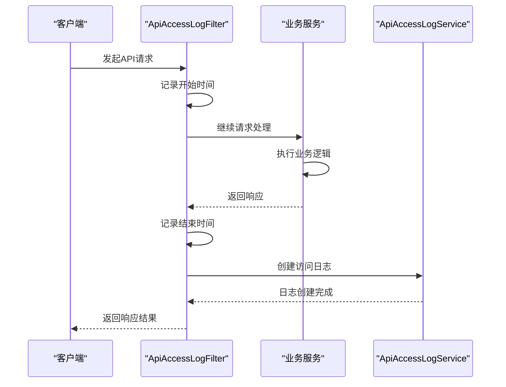
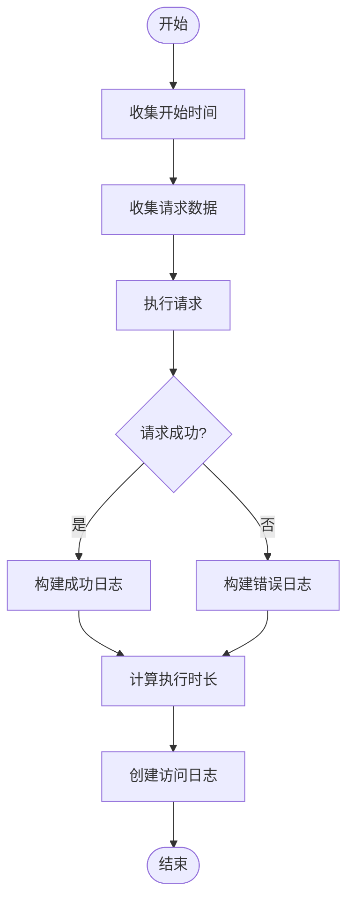
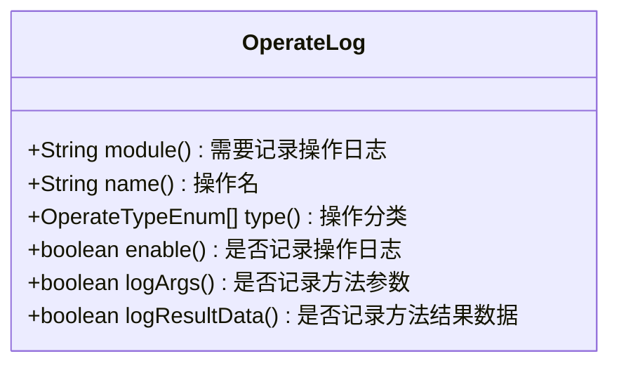
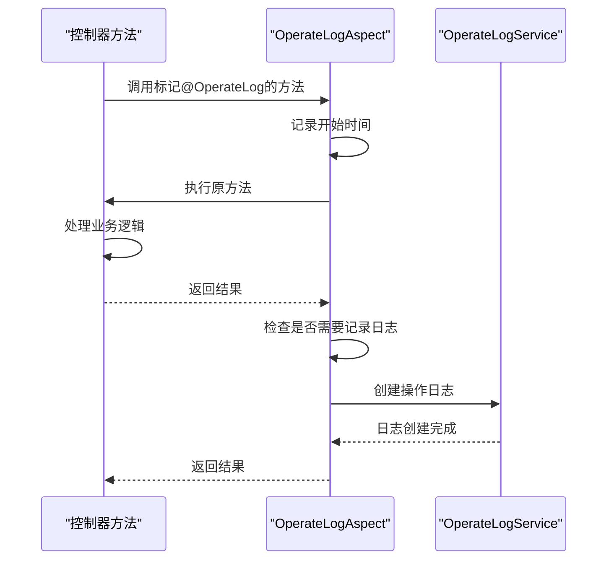
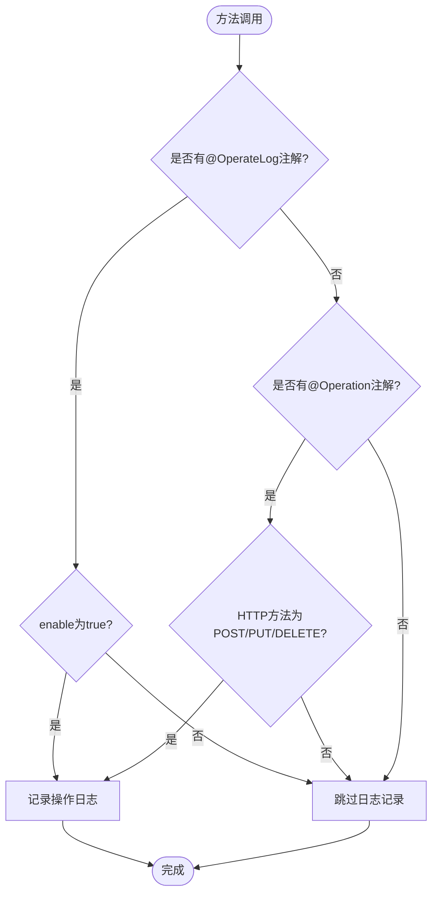
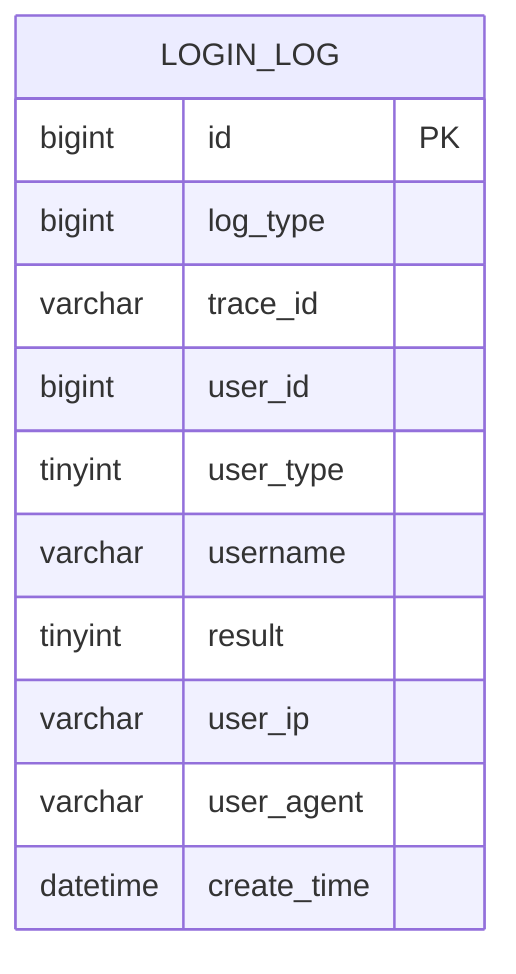
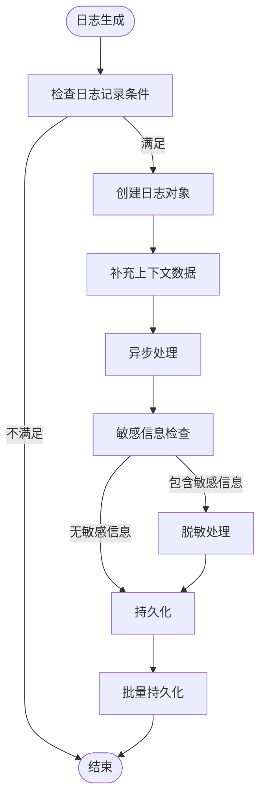
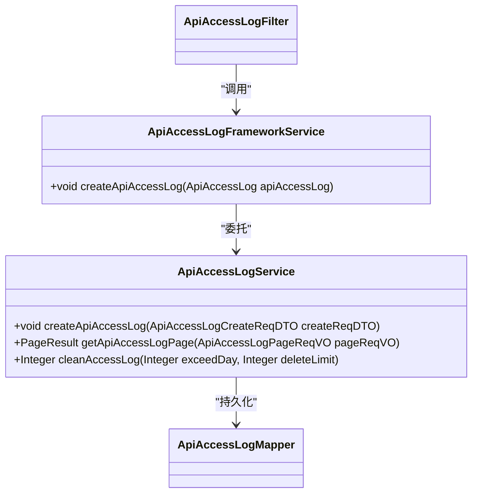
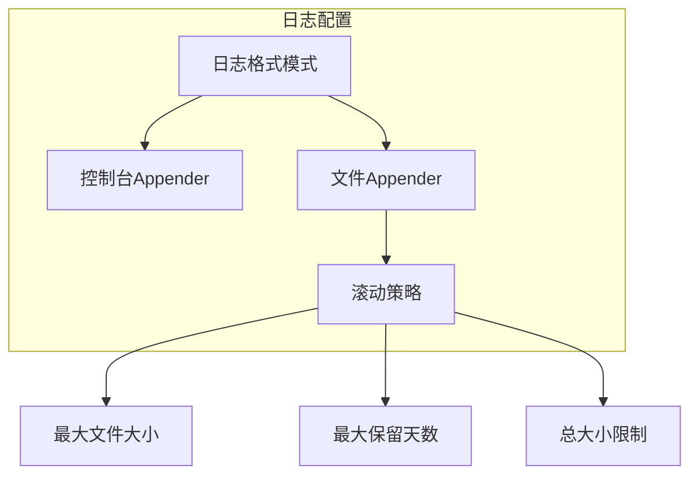

# 日志管理

<cite>
**本文档引用的文件**   
- [ApiAccessLogFilter.java](file://yudao-framework/yudao-spring-boot-starter-web/src/main/java/cn/iocoder/yudao/framework/apilog/core/filter/ApiAccessLogFilter.java)
- [YudaoApiLogAutoConfiguration.java](file://yudao-framework/yudao-spring-boot-starter-web/src/main/java/cn/iocoder/yudao/framework/apilog/config/YudaoApiLogAutoConfiguration.java)
- [ApiAccessLogServiceImpl.java](file://yudao-module-infra/yudao-module-infra-biz/src/main/java/cn/iocoder/yudao/module/infra/service/logger/ApiAccessLogServiceImpl.java)
- [OperateLogAspect.java](file://yudao-framework/yudao-spring-boot-starter-operatelog/src/main/java/cn/iocoder/yudao/framework/operatelog/core/aop/OperateLogAspect.java)
- [OperateLog.java](file://yudao-framework/yudao-spring-boot-starter-operatelog/src/main/java/cn/iocoder/yudao/framework/operatelog/core/annotations/OperateLog.java)
- [GlobalExceptionHandler.java](file://yudao-framework/yudao-spring-boot-starter-web/src/main/java/cn/iocoder/yudao/framework/web/core/handler/GlobalExceptionHandler.java)
- [LoginLogDO.java](file://yudao-module-system/yudao-module-system-biz/src/main/java/cn/iocoder/yudao/module/system/dal/dataobject/logger/LoginLogDO.java)
- [logback-spring.xml](file://yudao-server/src/main/resources/logback-spring.xml)
</cite>

## 目录
1. [系统日志体系概述](#系统日志体系概述)
2. [API访问日志收集机制](#api访问日志收集机制)
3. [操作日志注解驱动实现](#操作日志注解驱动实现)
4. [登录日志异常检测机制](#登录日志异常检测机制)
5. [日志处理与持久化策略](#日志处理与持久化策略)
6. [日志系统集成与监控](#日志系统集成与监控)

## 系统日志体系概述

本系统采用分层的日志管理体系，主要包括API访问日志、操作日志和登录日志三大核心组件。系统通过AOP（面向切面编程）和Filter（过滤器）技术实现日志的自动收集，确保日志记录的全面性和一致性。

日志体系采用模块化设计，各日志类型有明确的职责划分：
- **API访问日志**：记录所有API接口的访问情况，包括请求参数、响应结果和性能指标
- **操作日志**：记录管理员的关键操作行为，用于安全审计和操作追溯
- **登录日志**：记录用户的登录登出行为，支持异常登录检测

系统通过Spring Boot的自动配置机制，实现了日志功能的无缝集成，开发者无需进行复杂的配置即可使用完整的日志功能。

## API访问日志收集机制

API访问日志通过`ApiAccessLogFilter`过滤器实现，该过滤器在请求处理的整个生命周期中收集相关数据。



**Diagram sources**
- [ApiAccessLogFilter.java](file://yudao-framework/yudao-spring-boot-starter-web/src/main/java/cn/iocoder/yudao/framework/apilog/core/filter/ApiAccessLogFilter.java)

### 日志收集流程

1. **请求拦截**：`ApiAccessLogFilter`在`doFilterInternal`方法中拦截所有HTTP请求
2. **数据收集**：在请求开始时记录开始时间，收集请求参数和请求头信息
3. **执行监控**：通过`try-catch`块监控请求处理过程，无论成功或异常都能记录日志
4. **日志构建**：调用`buildApiAccessLogDTO`方法构建完整的日志对象，包含用户信息、请求详情和性能指标
5. **异步处理**：通过`ApiAccessLogFrameworkService`将日志数据传递给业务服务层



**Diagram sources**
- [ApiAccessLogFilter.java](file://yudao-framework/yudao-spring-boot-starter-web/src/main/java/cn/iocoder/yudao/framework/apilog/core/filter/ApiAccessLogFilter.java)

**Section sources**
- [ApiAccessLogFilter.java](file://yudao-framework/yudao-spring-boot-starter-web/src/main/java/cn/iocoder/yudao/framework/apilog/core/filter/ApiAccessLogFilter.java)

## 操作日志注解驱动实现

操作日志采用注解驱动的方式实现，通过`@OperateLog`注解标记需要记录操作日志的方法。

### 注解定义

`@OperateLog`注解定义了操作日志的关键属性：



**Diagram sources**
- [OperateLog.java](file://yudao-framework/yudao-spring-boot-starter-operatelog/src/main/java/cn/iocoder/yudao/framework/operatelog/core/annotations/OperateLog.java)

### AOP切面实现

操作日志通过`OperateLogAspect`切面实现，采用环绕通知的方式拦截标记了`@OperateLog`注解的方法。



**Diagram sources**
- [OperateLogAspect.java](file://yudao-framework/yudao-spring-boot-starter-operatelog/src/main/java/cn/iocoder/yudao/framework/operatelog/core/aop/OperateLogAspect.java)

### 日志记录条件

系统根据以下条件决定是否记录操作日志：
1. 方法上标记了`@OperateLog`注解且`enable`属性为`true`
2. 使用`@Operation`注解且HTTP方法为POST、PUT或DELETE
3. 用户类型为管理员



**Diagram sources**
- [OperateLogAspect.java](file://yudao-framework/yudao-spring-boot-starter-operatelog/src/main/java/cn/iocoder/yudao/framework/operatelog/core/aop/OperateLogAspect.java)

**Section sources**
- [OperateLogAspect.java](file://yudao-framework/yudao-spring-boot-starter-operatelog/src/main/java/cn/iocoder/yudao/framework/operatelog/core/aop/OperateLogAspect.java)
- [OperateLog.java](file://yudao-framework/yudao-spring-boot-starter-operatelog/src/main/java/cn/iocoder/yudao/framework/operatelog/core/annotations/OperateLog.java)

## 登录日志异常检测机制

登录日志系统不仅记录正常的登录登出行为，还具备异常检测和安全审计功能。

### 登录日志数据结构

登录日志通过`LoginLogDO`数据对象定义，包含以下关键字段：



**Diagram sources**
- [LoginLogDO.java](file://yudao-module-system/yudao-module-system-biz/src/main/java/cn/iocoder/yudao/module/system/dal/dataobject/logger/LoginLogDO.java)

### 异常检测机制

系统通过以下方式实现登录异常检测：
1. **失败次数监控**：连续多次登录失败触发告警
2. **IP异常检测**：检测异常IP地址的登录尝试
3. **时间异常检测**：非正常时间段的登录行为
4. **地理位置检测**：短时间内跨地域的登录行为

### 安全审计功能

登录日志系统提供完整的安全审计功能，包括：
- 登录结果统计分析
- 登录地域分布分析
- 登录设备类型分析
- 异常登录行为告警

**Section sources**
- [LoginLogDO.java](file://yudao-module-system/yudao-module-system-biz/src/main/java/cn/iocoder/yudao/module/system/dal/dataobject/logger/LoginLogDO.java)

## 日志处理与持久化策略

日志系统采用异步处理和批量持久化的策略，确保日志记录不影响主业务流程的性能。

### 日志处理流程



**Diagram sources**
- [ApiAccessLogServiceImpl.java](file://yudao-module-infra/yudao-module-infra-biz/src/main/java/cn/iocoder/yudao/module/infra/service/logger/ApiAccessLogServiceImpl.java)

### 性能指标统计

API访问日志自动统计以下性能指标：
- **执行时长**：请求处理的总时间（毫秒）
- **响应码**：HTTP状态码和业务结果码
- **请求频率**：单位时间内的请求次数
- **错误率**：异常请求的比例

### 异步持久化策略

系统采用以下策略实现日志的异步持久化：
1. **异步调用**：通过`@Async`注解实现异步日志记录
2. **批量处理**：定时批量插入日志数据，减少数据库IO
3. **失败重试**：对持久化失败的日志进行重试处理
4. **数据清理**：定期清理过期的日志数据



**Diagram sources**
- [ApiAccessLogServiceImpl.java](file://yudao-module-infra/yudao-module-infra-biz/src/main/java/cn/iocoder/yudao/module/infra/service/logger/ApiAccessLogServiceImpl.java)
- [ApiAccessLogService.java](file://yudao-module-infra/yudao-module-infra-biz/src/main/java/cn/iocoder/yudao/module/infra/service/logger/ApiAccessLogService.java)

**Section sources**
- [ApiAccessLogServiceImpl.java](file://yudao-module-infra/yudao-module-infra-biz/src/main/java/cn/iocoder/yudao/module/infra/service/logger/ApiAccessLogServiceImpl.java)
- [ApiAccessLogService.java](file://yudao-module-infra/yudao-module-infra-biz/src/main/java/cn/iocoder/yudao/module/infra/service/logger/ApiAccessLogService.java)

## 日志系统集成与监控

### ELK集成配置

系统支持与ELK（Elasticsearch、Logstash、Kibana）日志收集系统集成，配置示例如下：

```yaml
# logstash配置
input {
  file {
    path => "/var/log/eplus/*.log"
    codec => json
  }
}

filter {
  # 解析日志字段
  json {
    source => "message"
  }
}

output {
  elasticsearch {
    hosts => ["localhost:9200"]
    index => "eplus-logs-%{+YYYY.MM.dd}"
  }
}
```

### Loki集成配置

与Loki日志系统的集成配置：

```yaml
# promtail配置
scrape_configs:
  - job_name: eplus
    static_configs:
      - targets:
          - localhost
        labels:
          job: eplus
          __path__: /var/log/eplus/*.log
```

### 业务监控看板

基于日志数据可以搭建以下业务监控看板：
1. **API健康度看板**：API成功率、响应时间、错误率
2. **用户行为分析看板**：用户活跃度、功能使用频率
3. **安全审计看板**：异常登录、敏感操作
4. **性能监控看板**：系统负载、慢请求分析

### 日志配置

系统通过`logback-spring.xml`配置日志输出格式和策略：



**Diagram sources**
- [logback-spring.xml](file://yudao-server/src/main/resources/logback-spring.xml)

**Section sources**
- [logback-spring.xml](file://yudao-server/src/main/resources/logback-spring.xml)