# 登录日志

<cite>
**本文档引用文件**   
- [LoginLogApiImpl.java](file://yudao-module-system/yudao-module-system-biz/src/main/java/cn/iocoder/yudao/module/system/api/logger/LoginLogApiImpl.java)
- [LoginLogServiceImpl.java](file://yudao-module-system/yudao-module-system-biz/src/main/java/cn/iocoder/yudao/module/system/service/logger/LoginLogServiceImpl.java)
- [LoginLogMapper.java](file://yudao-module-system/yudao-module-system-biz/src/main/java/cn/iocoder/yudao/module/system/dal/mysql/logger/LoginLogMapper.java)
- [LoginLogService.java](file://yudao-module-system/yudao-module-system-biz/src/main/java/cn/iocoder/yudao/module/system/service/logger/LoginLogService.java)
- [LoginLogDO.java](file://yudao-module-system/yudao-module-system-biz/src/main/java/cn/iocoder/yudao/module/system/dal/dataobject/logger/LoginLogDO.java)
- [LoginLogCreateReqDTO.java](file://yudao-module-system/yudao-module-system-api/src/main/java/cn/iocoder/yudao/module/system/api/logger/dto/LoginLogCreateReqDTO.java)
- [LoginLogTypeEnum.java](file://yudao-module-system/yudao-module-system-api/src/main/java/cn/iocoder/yudao/module/system/enums/logger/LoginLogTypeEnum.java)
- [LoginResultEnum.java](file://yudao-module-system/yudao-module-system-api/src/main/java/cn/iocoder/yudao/module/system/enums/logger/LoginResultEnum.java)
- [AdminAuthServiceImpl.java](file://yudao-module-system/yudao-module-system-biz/src/main/java/cn/iocoder/yudao/module/system/service/auth/AdminAuthServiceImpl.java)
- [IPUtils.java](file://yudao-framework/yudao-spring-boot-starter-ip/src/main/java/cn/iocoder/yudao/framework/ip/core/utils/IPUtils.java)
- [AreaUtils.java](file://yudao-framework/yudao-spring-boot-starter-ip/src/main/java/cn/iocoder/yudao/framework/ip/core/utils/AreaUtils.java)
- [Area.java](file://yudao-framework/yudao-spring-boot-starter-ip/src/main/java/cn/iocoder/yudao/framework/ip/core/Area.java)
- [system_login_log.sql](file://eplus-flyway/src/main/resources/db/migration/common/V1_0_0_001__框架初始化.sql)
</cite>

## 目录
1. [简介](#简介)
2. [登录日志数据结构](#登录日志数据结构)
3. [登录日志记录机制](#登录日志记录机制)
4. [异常登录检测与安全审计](#异常登录检测与安全审计)
5. [IP地址解析与地理信息](#ip地址解析与地理信息)
6. [登录日志统计分析](#登录日志统计分析)
7. [系统集成与归档策略](#系统集成与归档策略)

## 简介
登录日志系统全面记录和分析用户登录行为，包括登录、登出和登录失败事件。系统捕获用户的IP地址、设备信息和登录结果，提供异常登录检测、安全审计和统计分析功能。通过与第三方安全系统的集成，实现全面的安全监控和长期数据归档。

## 登录日志数据结构
登录日志系统的核心数据结构定义了记录用户登录行为所需的所有信息字段。

### 登录日志数据库表结构
登录日志存储在 `system_login_log` 表中，包含以下字段：

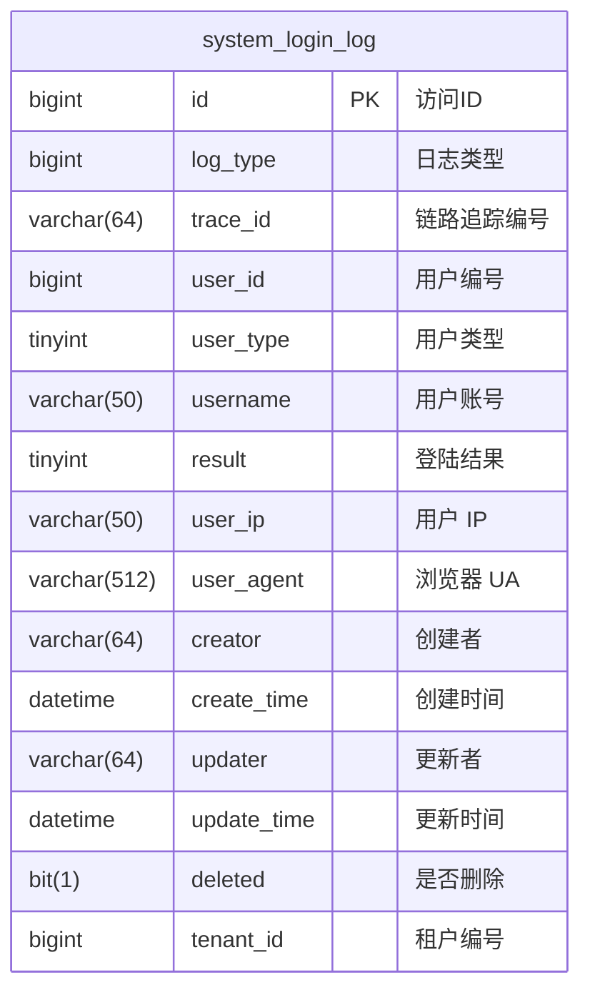

**图示来源**
- [system_login_log.sql](file://eplus-flyway/src/main/resources/db/migration/common/V1_0_0_001__框架初始化.sql#L213-L235)

### 登录日志数据对象
`LoginLogDO` 类定义了登录日志的数据对象，与数据库表结构对应。

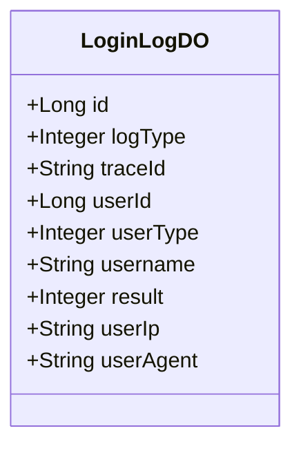

**图示来源**
- [LoginLogDO.java](file://yudao-module-system/yudao-module-system-biz/src/main/java/cn/iocoder/yudao/module/system/dal/dataobject/logger/LoginLogDO.java#L1-L72)

### 登录结果枚举
`LoginResultEnum` 枚举定义了所有可能的登录结果。

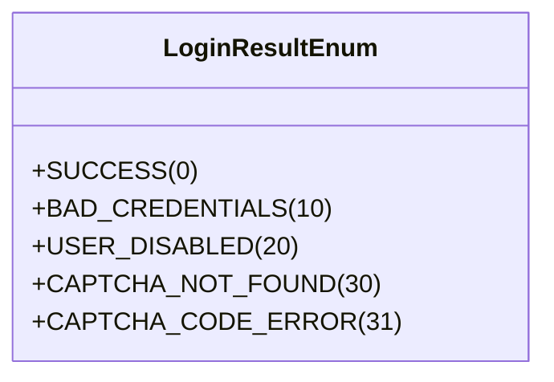

**图示来源**
- [LoginResultEnum.java](file://yudao-module-system/yudao-module-system-api/src/main/java/cn/iocoder/yudao/module/system/enums/logger/LoginResultEnum.java#L1-L26)

### 登录类型枚举
`LoginLogTypeEnum` 枚举定义了所有可能的登录类型。

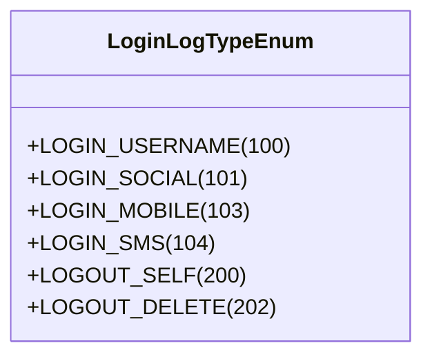

**图示来源**
- [LoginLogTypeEnum.java](file://yudao-module-system/yudao-module-system-api/src/main/java/cn/iocoder/yudao/module/system/enums/logger/LoginLogTypeEnum.java#L1-L27)

## 登录日志记录机制
登录日志系统通过一系列服务和接口实现用户登录行为的记录。

### 登录日志服务接口
`LoginLogService` 接口定义了登录日志的核心操作。

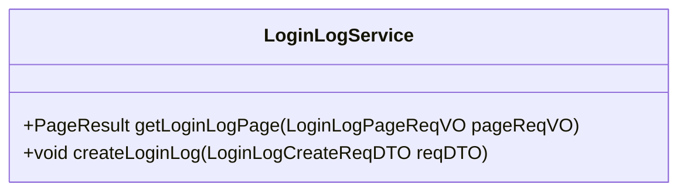

**图示来源**
- [LoginLogService.java](file://yudao-module-system/yudao-module-system-biz/src/main/java/cn/iocoder/yudao/module/system/service/logger/LoginLogService.java#L1-L30)

### 登录日志服务实现
`LoginLogServiceImpl` 类实现了登录日志服务接口，负责具体的业务逻辑。

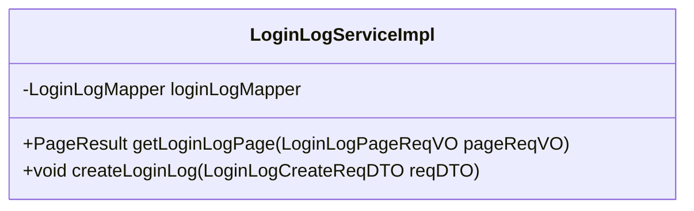

**图示来源**
- [LoginLogServiceImpl.java](file://yudao-module-system/yudao-module-system-biz/src/main/java/cn/iocoder/yudao/module/system/service/logger/LoginLogServiceImpl.java#L1-L35)

### 登录日志数据访问
`LoginLogMapper` 接口定义了与数据库交互的方法。


**图示来源**
- [LoginLogMapper.java](file://yudao-module-system/yudao-module-system-biz/src/main/java/cn/iocoder/yudao/module/system/dal/mysql/logger/LoginLogMapper.java#L1-L28)

### 登录日志API接口
`LoginLogApiImpl` 类提供了登录日志的API实现。

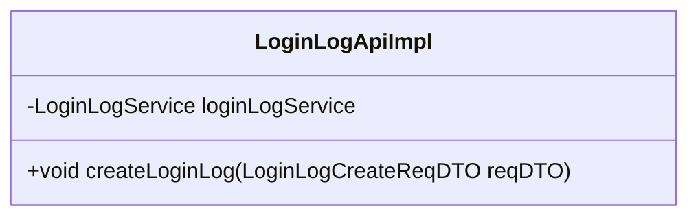

**图示来源**
- [LoginLogApiImpl.java](file://yudao-module-system/yudao-module-system-biz/src/main/java/cn/iocoder/yudao/module/system/api/logger/LoginLogApiImpl.java#L1-L27)

### 登录日志创建请求DTO
`LoginLogCreateReqDTO` 类定义了创建登录日志所需的请求数据。

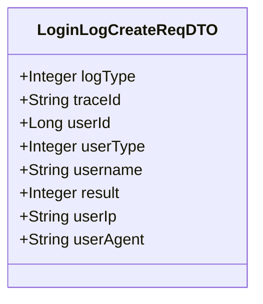

**图示来源**
- [LoginLogCreateReqDTO.java](file://yudao-module-system/yudao-module-system-api/src/main/java/cn/iocoder/yudao/module/system/api/logger/dto/LoginLogCreateReqDTO.java#L1-L62)

### 登录日志记录流程
当用户进行登录操作时，系统通过认证服务记录登录日志。

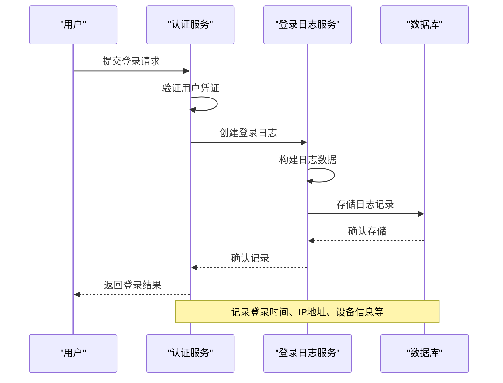

**图示来源**
- [AdminAuthServiceImpl.java](file://yudao-module-system/yudao-module-system-biz/src/main/java/cn/iocoder/yudao/module/system/service/auth/AdminAuthServiceImpl.java#L116-L144)

## 异常登录检测与安全审计
系统通过分析登录日志来检测异常登录行为并执行安全审计。

### 登录失败处理
当用户登录失败时，系统会记录相应的登录日志。

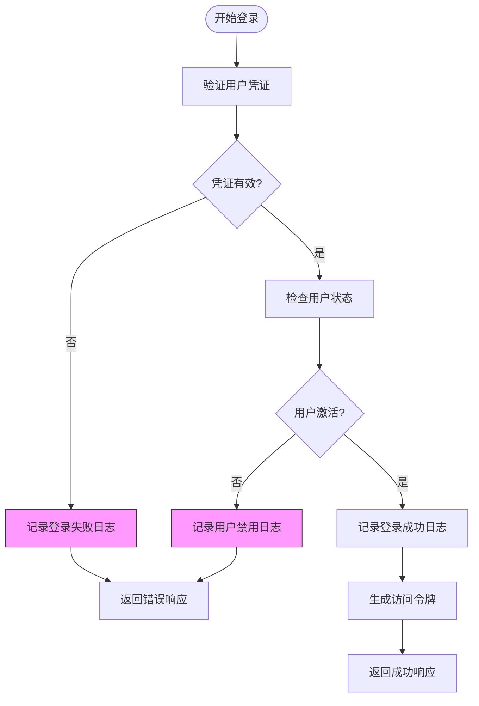

**图示来源**
- [AdminAuthServiceImpl.java](file://yudao-module-system/yudao-module-system-biz/src/main/java/cn/iocoder/yudao/module/system/service/auth/AdminAuthServiceImpl.java#L68-L85)

### 登出日志记录
当用户登出时，系统会记录登出日志。

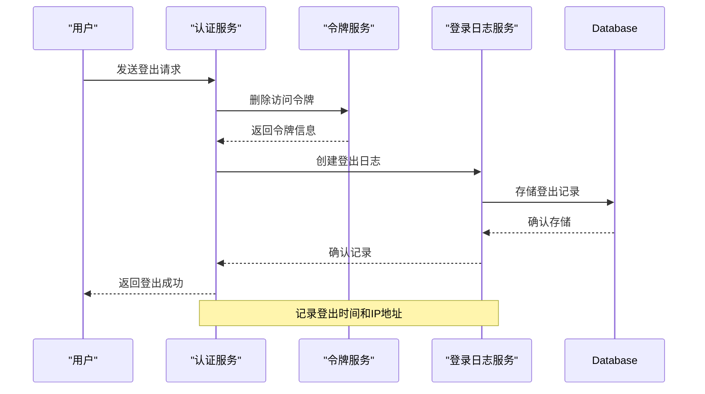

**图示来源**
- [AdminAuthServiceImpl.java](file://yudao-module-system/yudao-module-system-biz/src/main/java/cn/iocoder/yudao/module/system/service/auth/AdminAuthServiceImpl.java#L153-L178)

## IP地址解析与地理信息
系统使用IP地址解析技术来获取用户地理位置信息。

### IP地址工具类
`IPUtils` 类提供了IP地址解析功能。

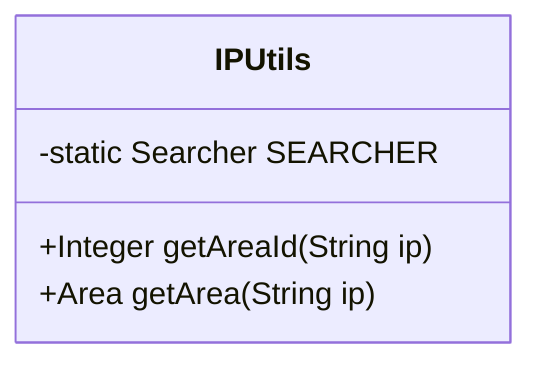

**图示来源**
- [IPUtils.java](file://yudao-framework/yudao-spring-boot-starter-ip/src/main/java/cn/iocoder/yudao/framework/ip/core/utils/IPUtils.java#L1-L87)

### 地区数据结构
`Area` 类定义了地区信息的数据结构。

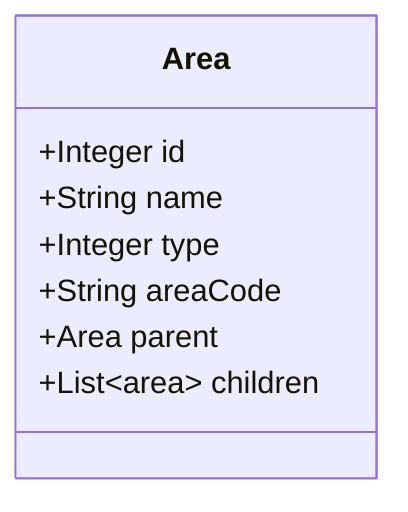

**图示来源**
- [Area.java](file://yudao-framework/yudao-spring-boot-starter-ip/src/main/java/cn/iocoder/yudao/framework/ip/core/Area.java#L1-L60)

### 地区工具类
`AreaUtils` 类提供了地区信息的处理功能。

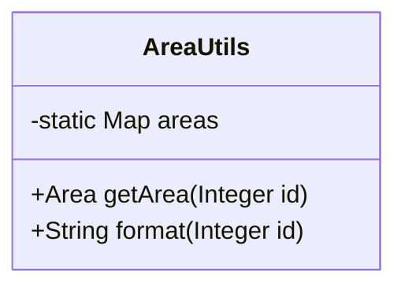

**图示来源**
- [AreaUtils.java](file://yudao-framework/yudao-spring-boot-starter-ip/src/main/java/cn/iocoder/yudao/framework/ip/core/utils/AreaUtils.java#L1-L36)

### IP地址解析流程
系统通过IP地址解析获取用户地理位置。

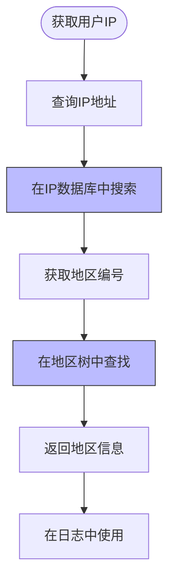

**图示来源**
- [IPUtils.java](file://yudao-framework/yudao-spring-boot-starter-ip/src/main/java/cn/iocoder/yudao/framework/ip/core/utils/IPUtils.java#L46-L86)

## 登录日志统计分析
系统提供多种统计分析功能，帮助了解用户登录行为。

### 活跃用户分析
通过登录日志分析活跃用户。

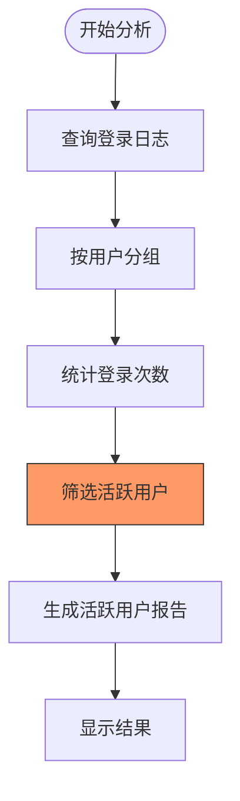

### 登录成功率分析
计算登录成功率。

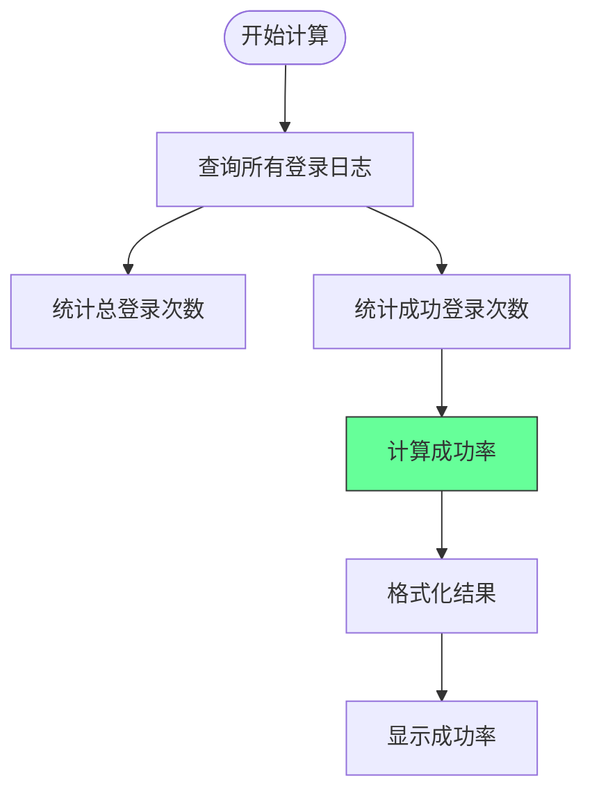

### 地域分布分析
分析用户登录的地域分布。

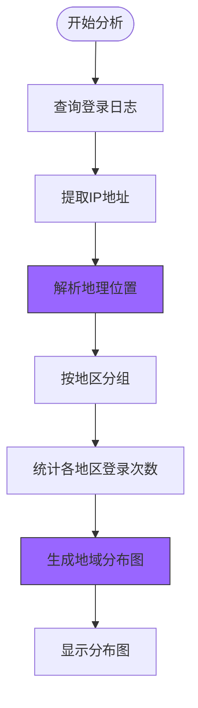

## 系统集成与归档策略
系统支持与第三方安全系统集成，并实施长期归档策略。

### 与SIEM系统集成
登录日志可以与SIEM（安全信息和事件管理）系统集成。

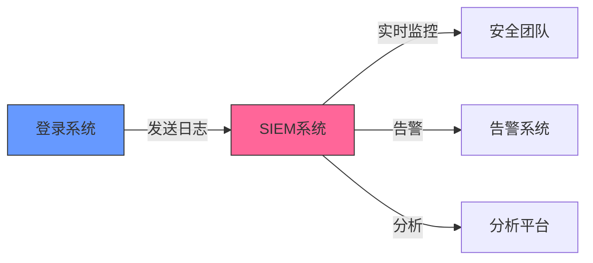

### 长期归档策略
实施登录日志的长期归档策略。

```mermaid
flowchart TD
Start([日志生成]) --> StoreInDB["存储在数据库"]
StoreInDB --> CheckAge["检查日志年龄"]
CheckAge --> IsOld{"超过归档期限?"}
IsOld --> |是| CompressLog["压缩日志数据"]
CompressLog --> MoveToArchive["移动到归档存储"]
MoveToArchive --> UpdateIndex["更新索引"]
UpdateIndex --> Complete["归档完成"]
IsOld --> |否| KeepInDB["保留在数据库"]
style CompressLog fill:#696,stroke:#333
style MoveToArchive fill:#696,stroke:#333
```