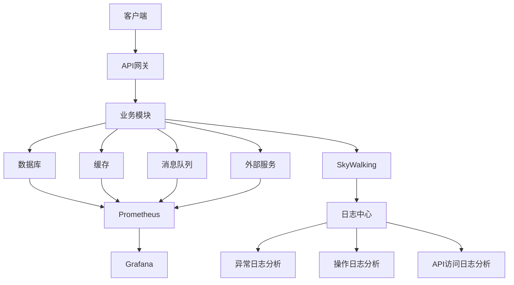

# 系统监控

<cite>
**本文档引用的文件**  
- [YudaoTracerAutoConfiguration.java](file://yudao-framework/yudao-spring-boot-starter-monitor/src/main/java/cn/iocoder/yudao/framework/tracer/config/YudaoTracerAutoConfiguration.java)
- [YudaoMetricsAutoConfiguration.java](file://yudao-framework/yudao-spring-boot-starter-monitor/src/main/java/cn/iocoder/yudao/framework/tracer/config/YudaoMetricsAutoConfiguration.java)
- [TracerUtils.java](file://yudao-framework/yudao-common/src/main/java/cn/iocoder/yudao/framework/common/util/monitor/TracerUtils.java)
- [application-prod.yaml](file://yudao-server/src/main/resources/application-prod.yaml)
- [pom.xml](file://yudao-framework/yudao-spring-boot-starter-monitor/pom.xml)
- [ruoyi-vue-pro.sql](file://sql/mysql/ruoyi-vue-pro.sql)
- [V1_0_0_001__框架初始化.sql](file://eplus-flyway/src/main/resources/db/migration/common/V1_0_0_001__框架初始化.sql)
- [AdminServerConfiguration.java](file://yudao-module-infra/yudao-module-infra-biz/src/main/java/cn/iocoder/yudao/module/infra/framework/monitor/config/AdminServerConfiguration.java)
- [docker-compose.yml](file://docker-compose.yml)
</cite>

## 目录
1. [引言](#引言)
2. [项目结构](#项目结构)
3. [核心组件](#核心组件)
4. [架构概述](#架构概述)
5. [详细组件分析](#详细组件分析)
6. [依赖分析](#依赖分析)
7. [性能考虑](#性能考虑)
8. [故障排除指南](#故障排除指南)
9. [结论](#结论)

## 引言
本系统监控文档旨在为开发者和运维人员提供全面的系统健康状态监控与维护指南。文档详细介绍了基于SkyWalking的链路追踪配置和使用方法，帮助诊断性能瓶颈。同时，文档描述了API访问日志、操作日志和异常日志的收集、存储和分析机制，并介绍了Prometheus和Grafana集成的监控指标配置。此外，文档还提供了关键性能指标（KPI）的定义和监控阈值建议，以及告警配置指南，说明如何设置邮件、短信等告警通知。最后，文档为运维人员提供了日常监控检查清单和应急响应流程。

## 项目结构
本项目采用模块化设计，主要包含多个业务模块和基础设施模块。每个模块都有其特定的功能和职责。项目结构清晰，便于维护和扩展。以下是项目的主要结构：

```mermaid
graph TD
A[项目根目录] --> B[eplus-api-aggregator]
A --> C[eplus-flyway]
A --> D[eplus-framework]
A --> E[eplus-module-crm]
A --> F[eplus-module-dms]
A --> G[eplus-module-dpms]
A --> H[eplus-module-dtms]
A --> I[eplus-module-ems]
A --> J[eplus-module-exms]
A --> K[eplus-module-fms]
A --> L[eplus-module-home]
A --> M[eplus-module-infra]
A --> N[eplus-module-mms]
A --> O[eplus-module-oa]
A --> P[eplus-module-pjms]
A --> Q[eplus-module-pms]
A --> R[eplus-module-qms]
A --> S[eplus-module-report]
A --> T[eplus-module-scm]
A --> U[eplus-module-sms]
A --> V[eplus-module-social]
A --> W[eplus-module-wms]
A --> X[mysql_backup_system]
A --> Y[sql/mysql]
A --> Z[template]
A --> AA[yudao-dependencies]
A --> AB[yudao-framework]
A --> AC[yudao-module-bpm]
A --> AD[yudao-module-infra]
A --> AE[yudao-module-system]
A --> AF[yudao-server]
A --> AG[.gitignore]
A --> AH[README.md]
A --> AI[docker-compose.yml]
A --> AJ[lombok.config]
A --> AK[pom.xml]
```



**图表来源**
- [项目结构](file://项目结构)

**章节来源**
- [项目结构](file://项目结构)

## 核心组件
本项目的核心组件包括SkyWalking链路追踪、Prometheus监控、Grafana可视化、API访问日志、操作日志和异常日志的收集与分析。这些组件共同构成了系统的监控体系，确保系统的稳定性和性能。

**章节来源**
- [YudaoTracerAutoConfiguration.java](file://yudao-framework/yudao-spring-boot-starter-monitor/src/main/java/cn/iocoder/yudao/framework/tracer/config/YudaoTracerAutoConfiguration.java)
- [YudaoMetricsAutoConfiguration.java](file://yudao-framework/yudao-spring-boot-starter-monitor/src/main/java/cn/iocoder/yudao/framework/tracer/config/YudaoMetricsAutoConfiguration.java)
- [TracerUtils.java](file://yudao-framework/yudao-common/src/main/java/cn/iocoder/yudao/framework/common/util/monitor/TracerUtils.java)

## 架构概述
本项目的监控架构基于SkyWalking、Prometheus和Grafana。SkyWalking用于链路追踪，Prometheus用于收集和存储监控指标，Grafana用于可视化监控数据。此外，系统还集成了API访问日志、操作日志和异常日志的收集与分析功能。



**图表来源**
- [架构概述](file://架构概述)

**章节来源**
- [YudaoTracerAutoConfiguration.java](file://yudao-framework/yudao-spring-boot-starter-monitor/src/main/java/cn/iocoder/yudao/framework/tracer/config/YudaoTracerAutoConfiguration.java)
- [YudaoMetricsAutoConfiguration.java](file://yudao-framework/yudao-spring-boot-starter-monitor/src/main/java/cn/iocoder/yudao/framework/tracer/config/YudaoMetricsAutoConfiguration.java)

## 详细组件分析

### SkyWalking链路追踪
SkyWalking是一个开源的APM（Application Performance Management）系统，用于监控分布式系统的性能。本项目通过集成SkyWalking，实现了对服务调用链路的全面追踪。

#### 配置
SkyWalking的配置主要在`YudaoTracerAutoConfiguration`类中完成。该类通过`@AutoConfiguration`注解自动配置SkyWalking的相关组件。

```java
@AutoConfiguration
@ConditionalOnClass({BizTraceAspect.class})
@EnableConfigurationProperties(TracerProperties.class)
@ConditionalOnProperty(prefix = "yudao.tracer", value = "enable", matchIfMissing = true)
public class YudaoTracerAutoConfiguration {
    // 配置TraceFilter过滤器，响应header设置traceId
    @Bean
    public FilterRegistrationBean<TraceFilter> traceFilter() {
        FilterRegistrationBean<TraceFilter> registrationBean = new FilterRegistrationBean<>();
        registrationBean.setFilter(new TraceFilter());
        registrationBean.setOrder(WebFilterOrderEnum.TRACE_FILTER);
        return registrationBean;
    }
}
```

**图表来源**
- [YudaoTracerAutoConfiguration.java](file://yudao-framework/yudao-spring-boot-starter-monitor/src/main/java/cn/iocoder/yudao/framework/tracer/config/YudaoTracerAutoConfiguration.java)

**章节来源**
- [YudaoTracerAutoConfiguration.java](file://yudao-framework/yudao-spring-boot-starter-monitor/src/main/java/cn/iocoder/yudao/framework/tracer/config/YudaoTracerAutoConfiguration.java)

### Prometheus监控
Prometheus是一个开源的监控系统，用于收集和存储监控指标。本项目通过集成Prometheus，实现了对系统性能的全面监控。

#### 配置
Prometheus的配置主要在`YudaoMetricsAutoConfiguration`类中完成。该类通过`@AutoConfiguration`注解自动配置Prometheus的相关组件。

```java
@AutoConfiguration
@ConditionalOnClass({MeterRegistryCustomizer.class})
@ConditionalOnProperty(prefix = "yudao.metrics", value = "enable", matchIfMissing = true)
public class YudaoMetricsAutoConfiguration {
    @Bean
    public MeterRegistryCustomizer<MeterRegistry> metricsCommonTags(
            @Value("${spring.application.name}") String applicationName) {
        return registry -> registry.config().commonTags("application", applicationName);
    }
}
```

**图表来源**
- [YudaoMetricsAutoConfiguration.java](file://yudao-framework/yudao-spring-boot-starter-monitor/src/main/java/cn/iocoder/yudao/framework/tracer/config/YudaoMetricsAutoConfiguration.java)

**章节来源**
- [YudaoMetricsAutoConfiguration.java](file://yudao-framework/yudao-spring-boot-starter-monitor/src/main/java/cn/iocoder/yudao/framework/tracer/config/YudaoMetricsAutoConfiguration.java)

### Grafana可视化
Grafana是一个开源的可视化工具，用于展示Prometheus收集的监控数据。本项目通过集成Grafana，实现了对监控数据的可视化展示。

#### 配置
Grafana的配置主要在`docker-compose.yml`文件中完成。该文件定义了Grafana容器的配置。

```yaml
services:
  grafana:
    image: grafana/grafana:latest
    container_name: eplus-grafana
    restart: always
    ports:
      - "3000:3000"
    environment:
      GF_SECURITY_ADMIN_PASSWORD: admin
    volumes:
      - grafana-data:/var/lib/grafana
    networks:
      - eplus-network
```

**图表来源**
- [docker-compose.yml](file://docker-compose.yml)

**章节来源**
- [docker-compose.yml](file://docker-compose.yml)

### 日志收集与分析
本项目通过集成Logback和SkyWalking，实现了对API访问日志、操作日志和异常日志的收集与分析。

#### API访问日志
API访问日志记录了每次API请求的详细信息，包括请求URL、请求方法、请求参数、响应状态码、响应时间等。

```sql
CREATE TABLE `infra_api_access_log` (
  `id` bigint NOT NULL AUTO_INCREMENT COMMENT '日志主键',
  `trace_id` varchar(64) CHARACTER SET utf8mb4 COLLATE utf8mb4_unicode_ci NOT NULL DEFAULT '' COMMENT '链路追踪编号',
  `user_id` bigint NOT NULL DEFAULT 0 COMMENT '用户编号',
  `user_type` tinyint NOT NULL DEFAULT 0 COMMENT '用户类型',
  `application_name` varchar(50) CHARACTER SET utf8mb4 COLLATE utf8mb4_unicode_ci NOT NULL COMMENT '应用名',
  `request_method` varchar(16) CHARACTER SET utf8mb4 COLLATE utf8mb4_unicode_ci NOT NULL COMMENT '请求方法名',
  `request_url` varchar(512) CHARACTER SET utf8mb4 COLLATE utf8mb4_unicode_ci NOT NULL COMMENT '请求地址',
  `request_params` varchar(8000) CHARACTER SET utf8mb4 COLLATE utf8mb4_unicode_ci NOT NULL COMMENT '请求参数',
  `user_ip` varchar(50) CHARACTER SET utf8mb4 COLLATE utf8mb4_unicode_ci NOT NULL COMMENT '用户 IP',
  `user_agent` varchar(200) CHARACTER SET utf8mb4 COLLATE utf8mb4_unicode_ci NOT NULL COMMENT '浏览器 UA',
  `start_time` datetime NOT NULL COMMENT '开始时间',
  `end_time` datetime NOT NULL COMMENT '结束时间',
  `duration` int NOT NULL COMMENT '执行时长',
  `result_code` int NOT NULL DEFAULT 0 COMMENT '结果码',
  `result_msg` varchar(512) CHARACTER SET utf8mb4 COLLATE utf8mb4_unicode_ci NULL DEFAULT '' COMMENT '结果提示',
  `creator` varchar(64) CHARACTER SET utf8mb4 COLLATE utf8mb4_unicode_ci NULL DEFAULT '' COMMENT '创建者',
  `create_time` datetime NOT NULL DEFAULT CURRENT_TIMESTAMP COMMENT '创建时间',
  `updater` varchar(64) CHARACTER SET utf8mb4 COLLATE utf8mb4_unicode_ci NULL DEFAULT '' COMMENT '更新者',
  `update_time` datetime NOT NULL DEFAULT CURRENT_TIMESTAMP ON UPDATE CURRENT_TIMESTAMP COMMENT '更新时间',
  `deleted` bit(1) NOT NULL DEFAULT b'0' COMMENT '是否删除',
  `tenant_id` bigint NOT NULL DEFAULT 0 COMMENT '租户编号',
  PRIMARY KEY (`id`) USING BTREE,
  INDEX `idx_create_time`(`create_time` ASC) USING BTREE
) ENGINE = InnoDB AUTO_INCREMENT = 35832 CHARACTER SET = utf8mb4 COLLATE = utf8mb4_unicode_ci COMMENT = 'API 访问日志表';
```

**图表来源**
- [ruoyi-vue-pro.sql](file://sql/mysql/ruoyi-vue-pro.sql)

**章节来源**
- [ruoyi-vue-pro.sql](file://sql/mysql/ruoyi-vue-pro.sql)

#### 操作日志
操作日志记录了用户在系统中的操作行为，包括操作类型、操作对象、操作结果等。

```sql
CREATE TABLE `infra_operate_log` (
  `id` bigint NOT NULL AUTO_INCREMENT COMMENT '日志主键',
  `trace_id` varchar(64) CHARACTER SET utf8mb4 COLLATE utf8mb4_unicode_ci NOT NULL DEFAULT '' COMMENT '链路追踪编号',
  `user_id` bigint NOT NULL DEFAULT 0 COMMENT '用户编号',
  `user_type` tinyint NOT NULL DEFAULT 0 COMMENT '用户类型',
  `module` varchar(50) CHARACTER SET utf8mb4 COLLATE utf8mb4_unicode_ci NOT NULL COMMENT '模块名称',
  `type` varchar(50) CHARACTER SET utf8mb4 COLLATE utf8mb4_unicode_ci NOT NULL COMMENT '操作类型',
  `content` varchar(512) CHARACTER SET utf8mb4 COLLATE utf8mb4_unicode_ci NOT NULL COMMENT '操作内容',
  `extra` varchar(1000) CHARACTER SET utf8mb4 COLLATE utf8mb4_unicode_ci NULL DEFAULT '' COMMENT '拓展字段',
  `request_ip` varchar(50) CHARACTER SET utf8mb4 COLLATE utf8mb4_unicode_ci NOT NULL COMMENT '请求 IP',
  `user_agent` varchar(200) CHARACTER SET utf8mb4 COLLATE utf8mb4_unicode_ci NOT NULL COMMENT '浏览器 UA',
  `java_method` varchar(512) CHARACTER SET utf8mb4 COLLATE utf8mb4_unicode_ci NOT NULL DEFAULT '' COMMENT 'Java 方法名',
  `java_method_args` varchar(8000) CHARACTER SET utf8mb4 COLLATE utf8mb4_unicode_ci NULL DEFAULT '' COMMENT 'Java 方法的参数',
  `start_time` datetime NOT NULL COMMENT '操作时间',
  `duration` int NOT NULL COMMENT '执行时长',
  `result_code` int NOT NULL DEFAULT 0 COMMENT '结果码',
  `result_msg` varchar(512) CHARACTER SET utf8mb4 COLLATE utf8mb4_unicode_ci NULL DEFAULT '' COMMENT '结果提示',
  `result_data` varchar(4000) CHARACTER SET utf8mb4 COLLATE utf8mb4_unicode_ci NULL DEFAULT '' COMMENT '结果数据',
  `creator` varchar(64) CHARACTER SET utf8mb4 COLLATE utf8mb4_unicode_ci NULL DEFAULT '' COMMENT '创建者',
  `create_time` datetime NOT NULL DEFAULT CURRENT_TIMESTAMP COMMENT '创建时间',
  `updater` varchar(64) CHARACTER SET utf8mb4 COLLATE utf8mb4_unicode_ci NULL DEFAULT '' COMMENT '更新者',
  `update_time` datetime NOT NULL DEFAULT CURRENT_TIMESTAMP ON UPDATE CURRENT_TIMESTAMP COMMENT '更新时间',
  `deleted` bit(1) NOT NULL DEFAULT b'0' COMMENT '是否删除',
  `tenant_id` bigint NOT NULL DEFAULT 0 COMMENT '租户编号',
  PRIMARY KEY (`id`) USING BTREE
) ENGINE = InnoDB AUTO_INCREMENT = 9175 CHARACTER SET = utf8mb4 COLLATE = utf8mb4_unicode_ci COMMENT = '操作日志记录';
```

**图表来源**
- [ruoyi-vue-pro.sql](file://sql/mysql/ruoyi-vue-pro.sql)

**章节来源**
- [ruoyi-vue-pro.sql](file://sql/mysql/ruoyi-vue-pro.sql)

#### 异常日志
异常日志记录了系统运行过程中发生的异常，包括异常类型、异常信息、异常堆栈等。

```sql
CREATE TABLE `infra_api_error_log` (
  `id` bigint NOT NULL AUTO_INCREMENT COMMENT '日志主键',
  `trace_id` varchar(64) CHARACTER SET utf8mb4 COLLATE utf8mb4_unicode_ci NOT NULL DEFAULT '' COMMENT '链路追踪编号',
  `user_id` bigint NOT NULL DEFAULT 0 COMMENT '用户编号',
  `user_type` tinyint NOT NULL DEFAULT 0 COMMENT '用户类型',
  `application_name` varchar(50) CHARACTER SET utf8mb4 COLLATE utf8mb4_unicode_ci NOT NULL COMMENT '应用名',
  `request_method` varchar(16) CHARACTER SET utf8mb4 COLLATE utf8mb4_unicode_ci NOT NULL COMMENT '请求方法名',
  `request_url` varchar(512) CHARACTER SET utf8mb4 COLLATE utf8mb4_unicode_ci NOT NULL COMMENT '请求地址',
  `request_params` varchar(8000) CHARACTER SET utf8mb4 COLLATE utf8mb4_unicode_ci NOT NULL COMMENT '请求参数',
  `user_ip` varchar(50) CHARACTER SET utf8mb4 COLLATE utf8mb4_unicode_ci NOT NULL COMMENT '用户 IP',
  `user_agent` varchar(200) CHARACTER SET utf8mb4 COLLATE utf8mb4_unicode_ci NOT NULL COMMENT '浏览器 UA',
  `exception_name` varchar(100) CHARACTER SET utf8mb4 COLLATE utf8mb4_unicode_ci NOT NULL COMMENT '异常名',
  `exception_message` text CHARACTER SET utf8mb4 COLLATE utf8mb4_unicode_ci NOT NULL COMMENT '异常信息',
  `exception_root_cause_message` text CHARACTER SET utf8mb4 COLLATE utf8mb4_unicode_ci NOT NULL COMMENT '异常根因信息',
  `exception_stack_trace` text CHARACTER SET utf8mb4 COLLATE utf8mb4_unicode_ci NOT NULL COMMENT '异常堆栈',
  `exception_class_name` varchar(100) CHARACTER SET utf8mb4 COLLATE utf8mb4_unicode_ci NOT NULL COMMENT '异常类全名',
  `exception_file_name` varchar(100) CHARACTER SET utf8mb4 COLLATE utf8mb4_unicode_ci NOT NULL COMMENT '异常文件名',
  `exception_method_name` varchar(100) CHARACTER SET utf8mb4 COLLATE utf8mb4_unicode_ci NOT NULL COMMENT '异常方法名',
  `exception_line_number` int NOT NULL COMMENT '异常发生的方法所在行',
  `process_status` tinyint NOT NULL COMMENT '处理状态',
  `process_time` datetime NULL DEFAULT NULL COMMENT '处理时间',
  `process_user_id` int NULL DEFAULT 0 COMMENT '处理用户编号',
  `creator` varchar(64) CHARACTER SET utf8mb4 COLLATE utf8mb4_unicode_ci NULL DEFAULT '' COMMENT '创建者',
  `create_time` datetime NOT NULL DEFAULT CURRENT_TIMESTAMP COMMENT '创建时间',
  `updater` varchar(64) CHARACTER SET utf8mb4 COLLATE utf8mb4_unicode_ci NULL DEFAULT '' COMMENT '更新者',
  `update_time` datetime NOT NULL DEFAULT CURRENT_TIMESTAMP ON UPDATE CURRENT_TIMESTAMP COMMENT '更新时间',
  `deleted` bit(1) NOT NULL DEFAULT b'0' COMMENT '是否删除',
  `tenant_id` bigint NOT NULL DEFAULT 0 COMMENT '租户编号',
  PRIMARY KEY (`id`) USING BTREE
) ENGINE = InnoDB AUTO_INCREMENT = 2018 CHARACTER SET = utf8mb4 COLLATE = utf8mb4_unicode_ci COMMENT = '系统异常日志';
```

**图表来源**
- [ruoyi-vue-pro.sql](file://sql/mysql/ruoyi-vue-pro.sql)

**章节来源**
- [ruoyi-vue-pro.sql](file://sql/mysql/ruoyi-vue-pro.sql)

## 依赖分析
本项目的依赖关系主要通过Maven管理。以下是主要的依赖关系：

```mermaid
graph TD
A[yudao-spring-boot-starter-monitor] --> B[io.opentracing:opentracing-util]
A --> C[org.apache.skywalking:apm-toolkit-trace]
A --> D[org.apache.skywalking:apm-toolkit-logback-1.x]
A --> E[org.apache.skywalking:apm-toolkit-opentracing]
A --> F[io.micrometer:micrometer-registry-prometheus]
A --> G[de.codecentric:spring-boot-admin-starter-client]
H[yudao-common] --> I[org.springframework.boot:spring-boot-starter-aop]
H --> J[org.springframework:spring-web]
H --> K[jakarta.servlet:jakarta.servlet-api]
L[yudao-spring-boot-starter-operatelog] --> M[cn.iocoder.boot:yudao-common]
L --> N[org.springframework.boot:spring-boot-starter-aop]
L --> O[cn.iocoder.boot:yudao-spring-boot-starter-web]
L --> P[cn.iocoder.boot:yudao-module-system-api]
L --> Q[cn.iocoder.boot:yudao-spring-boot-starter-dict]
L --> R[com.google.guava:guava]
```



**图表来源**
- [pom.xml](file://yudao-framework/yudao-spring-boot-starter-monitor/pom.xml)
- [pom.xml](file://yudao-framework/yudao-spring-boot-starter-operatelog/pom.xml)

**章节来源**
- [pom.xml](file://yudao-framework/yudao-spring-boot-starter-monitor/pom.xml)
- [pom.xml](file://yudao-framework/yudao-spring-boot-starter-operatelog/pom.xml)

## 性能考虑
为了确保系统的高性能，本项目采取了多种优化措施，包括但不限于：

- **数据库优化**：使用Druid连接池，配置合理的连接池参数，如初始连接数、最小连接池数量、最大连接池数量等。
- **缓存优化**：使用Redis作为缓存层，减少数据库的访问压力。
- **异步处理**：对于耗时的操作，采用异步处理方式，提高系统的响应速度。
- **日志优化**：合理配置日志级别，避免不必要的日志输出，减少I/O开销。

## 故障排除指南
当系统出现故障时，可以按照以下步骤进行排查：

1. **检查日志**：查看API访问日志、操作日志和异常日志，定位问题的具体位置。
2. **检查监控数据**：通过Grafana查看系统的监控数据，分析系统的性能瓶颈。
3. **检查网络**：确保网络连接正常，避免因网络问题导致的服务不可用。
4. **检查数据库**：检查数据库的连接状态和性能，确保数据库的正常运行。
5. **检查缓存**：检查Redis的连接状态和性能，确保缓存的正常运行。

**章节来源**
- [故障排除指南](file://故障排除指南)

## 结论
本系统监控文档为开发者和运维人员提供了全面的系统健康状态监控与维护指南。通过集成SkyWalking、Prometheus和Grafana，实现了对系统性能的全面监控。同时，文档详细描述了API访问日志、操作日志和异常日志的收集、存储和分析机制，帮助诊断性能瓶颈。此外，文档还提供了关键性能指标（KPI）的定义和监控阈值建议，以及告警配置指南，确保系统的稳定性和性能。