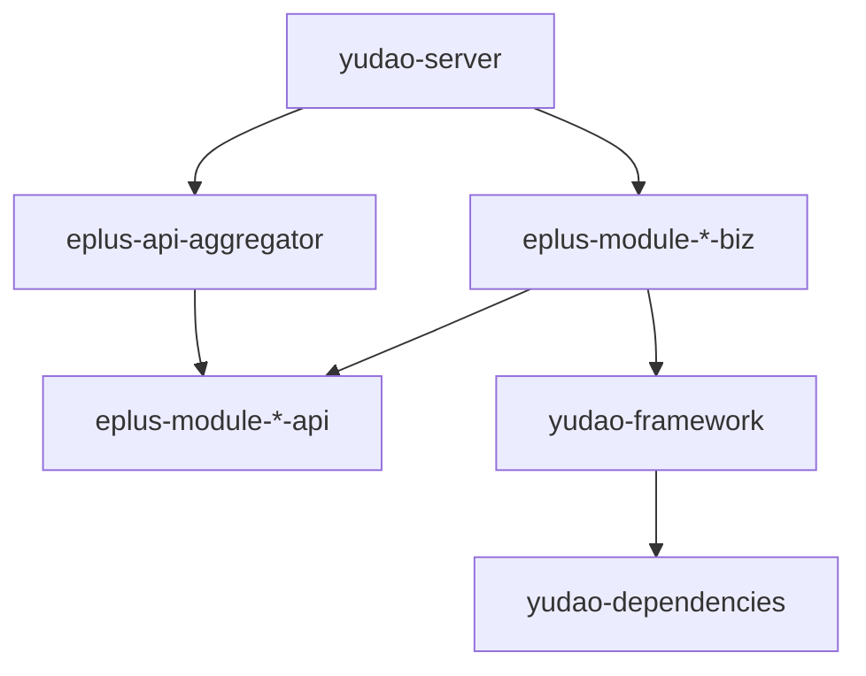

# 项目概述

<cite>
**本文档引用的文件**   
- [README.md](file://README.md)
- [pom.xml](file://pom.xml)
- [yudao-server/pom.xml](file://yudao-server/pom.xml)
- [yudao-dependencies/pom.xml](file://yudao-dependencies/pom.xml)
- [eplus-framework/README.md](file://eplus-framework/README.md)
- [eplus-framework/OPTIMIZATION_PLAN.md](file://eplus-framework/OPTIMIZATION_PLAN.md)
- [docker-compose.yml](file://docker-compose.yml)
- [yudao-server/src/main/resources/application-dev.yaml](file://yudao-server/src/main/resources/application-dev.yaml)
- [eplus-module-scm/eplus-module-scm-api/pom.xml](file://eplus-module-scm/eplus-module-scm-api/pom.xml)
- [eplus-module-scm/eplus-module-scm-biz/pom.xml](file://eplus-module-scm/eplus-module-scm-biz/pom.xml)
- [yudao-server/src/main/java/cn/iocoder/yudao/server/YudaoServerApplication.java](file://yudao-server/src/main/java/cn/iocoder/yudao/server/YudaoServerApplication.java)
- [yudao-server/src/main/java/cn/iocoder/yudao/server/config/ModuleLoaderListener.java](file://yudao-server/src/main/java/cn/iocoder/yudao/server/config/ModuleLoaderListener.java)
</cite>

## 目录

1. [项目介绍](#项目介绍)
2. [技术架构](#技术架构)
3. [项目结构](#项目结构)
4. [核心业务模块](#核心业务模块)
5. [系统基础模块](#系统基础模块)
6. [模块化设计](#模块化设计)
7. [开发与部署](#开发与部署)
8. [学习路径建议](#学习路径建议)

## 项目介绍

eplus-admin-server 是一个基于 Spring Boot 的企业级 ERP 管理系统，旨在为中大型企业提供一体化的业务管理解决方案。该项目基于优秀的开源框架 [ruoyi-vue-pro](https://gitee.com/zhijiantianya/ruoyi-vue-pro) 进行深度定制开发，涵盖了供应链、销售、仓储、财务、客户关系管理（CRM）、生产制造、质量管理等多个核心业务领域。

项目采用主流技术栈，提供了完整的权限管理、工作流审批、数据权限控制等企业级特性，支持灵活的模块化扩展和二次开发。通过清晰的分层架构和模块化设计，eplus-admin-server 能够满足复杂企业业务场景的需求，提升开发效率和系统可维护性。

**Section sources**
- [README.md](file://README.md#L11-L15)

## 技术架构

eplus-admin-server 采用了现代化的后端技术栈，确保了系统的高性能、安全性和可扩展性。

### 后端技术栈

| 技术 | 版本 | 说明 |
|------|------|------|
| Spring Boot | 2.7.18 | 应用开发框架 |
| Spring Security | 5.7.x | 安全框架 |
| MyBatis Plus | 3.5.4 | ORM 框架 |
| MySQL | 5.7 / 8.0+ | 数据库 |
| Redis | 5.0 / 6.0 / 7.0 | 缓存数据库 |
| Redisson | 3.18.0 | 分布式锁 |
| Flowable | 6.8.0 | 工作流引擎 |
| Flyway | - | 数据库版本管理 |
| Quartz | 2.3.2 | 任务调度 |
| Springdoc | 1.6.15 | API 文档 |
| Druid | 1.2.20 | 数据库连接池 |
| Hutool | 5.8.22 | Java 工具类库 |
| Lombok | 1.18.30 | 简化开发 |
| MapStruct | 1.5.5.Final | 对象映射 |

项目基于“芋道”框架进行二次开发，该框架提供了 26 个开箱即用的 Starter 组件，包括 Redis 缓存、MyBatis ORM、Spring Security 安全、Web MVC、文件存储、Excel 导入导出、Flowable 工作流、定时任务、消息队列、数据权限、操作日志等，极大地提升了开发效率。

**Section sources**
- [README.md](file://README.md#L30-L48)

## 项目结构

eplus-admin-server 采用模块化设计，整体架构清晰，分为核心基础层、系统基础模块、核心业务模块、工具模块和应用启动模块。

```mermaid
graph TD
subgraph "核心基础层"
A[yudao-dependencies] --> B[yudao-framework]
B --> C[eplus-framework]
end
subgraph "系统基础模块"
D[yudao-module-system]
E[yudao-module-infra]
F[eplus-module-infra]
G[yudao-module-bpm]
end
subgraph "核心业务模块"
H[eplus-module-scm]
I[eplus-module-sms]
J[eplus-module-wms]
K[eplus-module-fms]
L[eplus-module-pms]
M[eplus-module-crm]
N[eplus-module-qms]
O[eplus-module-mms]
P[eplus-module-dms]
Q[eplus-module-oa]
R[eplus-module-home]
S[eplus-module-dpms]
T[eplus-module-dtms]
U[eplus-module-ems]
V[eplus-module-exms]
W[eplus-module-pjms]
X[eplus-module-report]
Y[eplus-module-social]
end
subgraph "工具模块"
Z[eplus-api-aggregator]
AA[eplus-flyway]
end
subgraph "应用启动"
AB[yudao-server]
end
AB --> H
AB --> I
AB --> J
AB --> K
AB --> L
AB --> M
AB --> N
AB --> O
AB --> P
AB --> Q
AB --> R
AB --> S
AB --> T
AB --> U
AB --> V
AB --> W
AB --> X
AB --> Y
AB --> D
AB --> E
AB --> F
AB --> G
AB --> Z
AB --> AA
Z --> H
Z --> I
Z --> J
Z --> K
Z --> L
Z --> M
Z --> N
Z --> O
Z --> P
Z --> Q
Z --> R
Z --> S
Z --> T
Z --> U
Z --> V
Z --> W
Z --> X
Z --> Y
B --> D
B --> E
B --> F
B --> G
B --> H
B --> I
B --> J
B --> K
B --> L
B --> M
B --> N
B --> O
B --> P
B --> Q
B --> R
B --> S
B --> T
B --> U
B --> V
B --> W
B --> X
B --> Y
```



**Diagram sources **
- [README.md](file://README.md#L62-L179)

**Section sources**
- [README.md](file://README.md#L58-L179)
- [pom.xml](file://pom.xml#L10-L44)

## 核心业务模块

eplus-admin-server 包含了 18 个核心业务模块，覆盖了企业运营的各个方面。

### 供应链管理 (SCM)
- **采购管理**: 采购计划、采购合同、采购登记
- **供应商管理**: 供应商档案、资质管理、供应商评估
- **询价报价**: 询价单、供应商报价
- **付款管理**: 付款申请、付款记录
- **开票管理**: 发票通知、发票登记

### 销售管理 (SMS)
- **销售合同**: 合同创建、审批、变更
- **报价管理**: 客户报价、报价审批
- **订单管理**: 销售订单、发货管理
- **客户服务**: 售后服务、客户投诉

### 仓储管理 (WMS)
- **库存管理**: 实时库存、库存预警、库存盘点
- **入库管理**: 采购入库、退货入库、调拨入库
- **出库管理**: 销售出库、生产领料、调拨出库
- **仓库管理**: 仓库设置、库位管理
- **库存调整**: 盘盈盘亏、库存调整

### 财务管理 (FMS)
- **应收管理**: 客户账款、收款登记、账龄分析
- **应付管理**: 供应商账款、付款登记
- **资金管理**: 银行账户、资金流水
- **财务报表**: 财务报表、资金报表

### 产品管理 (PMS)
- **产品档案**: SPU、SKU 管理
- **分类管理**: 产品分类、品牌管理
- **BOM 管理**: 物料清单、成本核算
- **海关数据**: HS 编码、报关要素

### 其他模块
- **客户关系管理 (CRM)**: 客户档案、商机管理、客户服务
- **质量管理 (QMS)**: 来料检验、过程检验、出货检验
- **制造管理 (MMS)**: 生产计划、生产执行、设备管理
- **单证管理 (DMS)**: 报关管理、物流管理、单证归档
- **办公自动化 (OA)**: 费用报销、费用分摊、借款还款、付款申请、出差管理
- **首页模块 (HOME)**: 首页卡片、数据统计
- **动态报表 (DPMS)**: 动态报表设计
- **设计任务管理 (DTMS)**: 设计任务
- **邮件管理 (EMS)**: 邮件发送
- **展会管理 (EXMS)**: 展会管理
- **项目管理 (PJMS)**: 项目管理
- **报表模块 (REPORT)**: 报表查询
- **社交集成 (SOCIAL)**: 社交媒体集成（待开发）

**Section sources**
- [README.md](file://README.md#L360-L422)

## 系统基础模块

除了核心业务模块，eplus-admin-server 还提供了强大的系统基础模块，为整个系统提供支撑。

### 系统管理 (yudao-module-system)
- **用户管理**: 用户账号、角色权限、部门岗位
- **菜单管理**: 菜单配置、权限标识
- **字典管理**: 数据字典、配置管理
- **日志管理**: 操作日志、登录日志、错误日志
- **通知公告**: 系统通知、公告管理

### 工作流 (yudao-module-bpm)
- **流程设计**: 在线流程设计器、流程发布
- **流程管理**: 我的流程、待办任务、已办任务
- **表单设计**: 动态表单设计
- **任务规则**: 审批规则、用户分组

### 基础设施 (yudao-module-infra)
- **代码生成**: 前后端代码生成、SQL 生成
- **文件管理**: 文件上传、文件存储
- **定时任务**: 任务调度、执行日志
- **数据源**: 多数据源管理
- **API 日志**: 接口访问日志、异常日志

### Eplus 基础设施 (eplus-module-infra)
- **国家信息**: 国家代码、国家名称、区域管理
- **公司路径**: 公司组织架构路径管理
- **结算方式**: 结算方式配置与管理
- **基础数据**: 其他业务基础数据维护

**Section sources**
- [README.md](file://README.md#L423-L450)

## 模块化设计

eplus-admin-server 采用了清晰的模块化设计，将系统划分为多个独立的模块，每个模块都有明确的职责和边界。

### 模块命名规范

| 层级 | 命名格式 | 说明 | 示例 |
|------|---------|------|------|
| **Parent** | `{project}-module-{name}` | 模块父 POM | `eplus-module-scm` |
| **API** | `{project}-module-{name}-api` | 接口定义（DTO、枚举、常量） | `eplus-module-scm-api` |
| **BIZ** | `{project}-module-{name}-biz` | 业务实现（Controller、Service、Mapper） | `eplus-module-scm-biz` |

### 模块依赖关系



**Diagram sources **
- [README.md](file://README.md#L184-L221)

**Section sources**
- [README.md](file://README.md#L224-L240)
- [eplus-module-scm/eplus-module-scm-api/pom.xml](file://eplus-module-scm/eplus-module-scm-api/pom.xml)
- [eplus-module-scm/eplus-module-scm-biz/pom.xml](file://eplus-module-scm/eplus-module-scm-biz/pom.xml)

## 开发与部署

### 环境要求
- **JDK**: 17+
- **Maven**: 3.6+
- **MySQL**: 5.7+ 或 8.0+
- **Redis**: 5.0+
- **Node.js**: 16+ (前端项目)

### 快速启动
1. **克隆项目**
   ```bash
   git clone <repository-url>
   cd eplus-admin-server
   ```
2. **初始化数据库**
   ```sql
   CREATE DATABASE `foreign_trade` DEFAULT CHARACTER SET utf8mb4 COLLATE utf8mb4_unicode_ci;
   ```
3. **修改配置**
   编辑 `yudao-server/src/main/resources/application-dev.yaml`，配置数据库和 Redis 连接信息。
4. **启动 Redis**
   ```bash
   redis-server
   ```
5. **启动应用**
   ```bash
   mvn clean install
   cd yudao-server
   mvn spring-boot:run
   ```
6. **访问应用**
   - 后端接口: http://localhost:18080
   - API 文档: http://localhost:18080/doc.html

### Docker 部署
项目提供了 `docker-compose.yml` 文件，可以一键启动 MySQL 和 Redis 服务。

```yaml
services:
  mysql:
    image: mysql:8.0
    container_name: eplus-mysql
    restart: always
    ports:
      - "3306:3306"
    environment:
      MYSQL_ROOT_PASSWORD: root123
      MYSQL_DATABASE: foreign_trade
      TZ: Asia/Shanghai
    volumes:
      - mysql-data:/var/lib/mysql
      - ./sql/mysql:/docker-entrypoint-initdb.d
  redis:
    image: redis:5.0
    container_name: eplus-redis
    restart: always
    ports:
      - "6379:6379"
    command: redis-server --appendonly yes
    volumes:
      - redis-data:/data
volumes:
  mysql-data:
  redis-data:
```

**Section sources**
- [README.md](file://README.md#L277-L353)
- [docker-compose.yml](file://docker-compose.yml)
- [yudao-server/src/main/resources/application-dev.yaml](file://yudao-server/src/main/resources/application-dev.yaml)

## 学习路径建议

### 初学者
1. **阅读文档**: 仔细阅读 `README.md` 和 `eplus-framework/README.md`，了解项目整体架构和核心概念。
2. **启动项目**: 按照快速启动指南，成功运行项目，熟悉开发环境。
3. **探索模块**: 从简单的业务模块（如 `eplus-module-home`）开始，了解模块的结构和实现方式。
4. **学习框架**: 了解“芋道”框架提供的 Starter 组件，学习如何使用这些组件进行开发。

### 经验丰富的开发者
1. **深入架构**: 研究 `yudao-dependencies` 和 `yudao-framework`，理解依赖管理和框架扩展机制。
2. **分析源码**: 阅读 `yudao-server` 的启动类和配置，理解模块加载和依赖注入的原理。
3. **贡献代码**: 参与项目贡献，修复 Bug 或开发新功能，遵循 Git 提交规范。
4. **性能优化**: 研究性能优化建议，如数据库优化、缓存优化、异步处理等，提升系统性能。

**Section sources**
- [README.md](file://README.md#L671-L680)
- [eplus-framework/README.md](file://eplus-framework/README.md#L169-L227)
- [eplus-framework/OPTIMIZATION_PLAN.md](file://eplus-framework/OPTIMIZATION_PLAN.md#L516-L571)
- [yudao-server/src/main/java/cn/iocoder/yudao/server/YudaoServerApplication.java](file://yudao-server/src/main/java/cn/iocoder/yudao/server/YudaoServerApplication.java)
- [yudao-server/src/main/java/cn/iocoder/yudao/server/config/ModuleLoaderListener.java](file://yudao-server/src/main/java/cn/iocoder/yudao/server/config/ModuleLoaderListener.java)