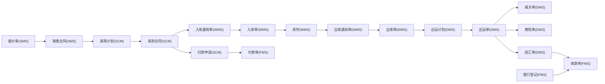

# 单据总览与流转图谱

## 统计口径与单据总数

### 口径说明
- 口径A（系统表规模）：以 `数据库模型.md` 的模块概览为口径，系统共 **115** 张业务/基础表（含主数据、配置、单据等）。
- 口径B（单据类表清单）：以“业务单据/计划/通知/合同/结算类表”为口径，统计 **40** 张单据类表（含明细与辅助单据表，不含基础主数据表）。
- 口径C（单据类型配置）：`doc_document_definition`/`doc_document_link`/`doc_document_relation_rule`/`doc_document_flow_log` 负责单据类型与关联规则的配置，但初始化脚本未包含类型数据，无法静态统计“配置的单据类型总数”。

### 口径B单据类表清单（40）
- **SCM（9）**：`scm_purchase_plan`、`scm_purchase_plan_item`、`scm_purchase_contract`、`scm_purchase_contract_item`、`scm_payment_apply`、`scm_payment_apply_item`、`scm_invoicing_notices`、`scm_concession_release`、`scm_quote_item`
- **SMS（8）**：`sms_sale_contract`、`sms_sale_contract_item`、`sms_quotation`、`sms_quotation_item`、`sms_collection_plan`、`sms_add_sub_item`、`sms_other_fee`、`sms_sale_auxiliary_allocation`
- **WMS（7）**：`wms_stock_notice`、`wms_stock_notice_item`、`wms_bill`、`wms_bill_item`、`wms_stocktake`、`wms_adjustment`、`wms_transfer_order`
- **DMS（7）**：`dms_shipment_plan`、`dms_shipment`、`dms_shipment_item`、`dms_declaration`、`dms_commodity_inspection`、`dms_forwarder_fee`、`dms_settlement_form`
- **OA（5）**：`oa_reimb`、`oa_loan_app`、`oa_travel_app`、`oa_payment_app`、`oa_repay_app`
- **FMS（3）**：`fms_receipt`、`fms_payment`、`fms_bank_registration`
- **MMS（1）**：`mms_manufacture`

> 说明：该清单来自数据库模型文档与业务模块说明，可能存在“业务上算作单据但未显式落表”的情况，需结合运行库或配置表进一步核对。

## 核心单据流转（总览）

## 上下游单据关联关系（关键链路）

### 销售 → 采购
- `sms_sale_contract`（销售合同）  
  ⮕ `scm_purchase_plan.sale_contract_id/sale_contract_code`  
  ⮕ `scm_purchase_plan_item.sale_contract_item_id`  
- `scm_purchase_plan`（采购计划）  
  ⮕ `scm_purchase_contract.purchase_plan_id/purchase_plan_code`  
  ⮕ `scm_purchase_contract_item.source_unique_code`（计划明细唯一标识映射）

### 采购 → 仓储（入库）
- `scm_purchase_contract`（采购合同）  
  ⮕ `wms_stock_notice.purchase_contract_id/purchase_contract_code`  
  ⮕ `wms_stock_notice_item.purchase_item_unique_code`  
- `wms_stock_notice`（入库通知）  
  ⮕ `wms_bill.notice_code`（通知转单）  
  ⮕ `wms_bill_item.source_id/source_type`（转单来源）

### 仓储（出库） → 单证
- `wms_bill`（出库单）  
  ⮕ `dms_shipment_plan`（出运计划）  
  ⮕ `dms_shipment`（出运单）  
- `dms_shipment`（出运单）  
  ⮕ `dms_declaration.shipment_id`（报关单）  
  ⮕ `dms_commodity_inspection.shipment_id`（商检单）  
  ⮕ `dms_settlement_form`（结汇单）

### 销售 ↔ 财务
- `sms_sale_contract`（销售合同）  
  ⮕ `sms_collection_plan`（收款计划）  
  ⮕ `fms_receipt.business_code/business_type`（收款单业务关联）
- `fms_bank_registration`（银行登记）  
  ⮕ `fms_receipt`（收款单）  

### 元关系（配置级）
- `doc_document_definition`：单据类型与模块映射  
- `doc_document_link`：单据上下游链接记录  
- `doc_document_relation_rule`：单据关联规则  
- `doc_document_flow_log`：单据流转日志

## 数据回写逻辑（核心路径）

### 销售合同回写
- **出运计划创建/变更**：回写销售明细已出运数量  
  - `ShipmentPlanServiceImpl` 创建/更新时调用 `saleContractApi.updateShipmentQuantity(...)`
- **出运单生成/关闭**：回写销售明细已转出运数量、重新分配状态  
  - `ShipmentServiceImpl` 中 `updateShipmentTotalQuantity(...)`、`setReLockFlag(...)`、关闭时回写
- **财务回写**：回写收款计划/加减项  
  - `SaleContractServiceImpl.writeBackContract(...)`

### 采购计划回写
- **采购计划创建**：回写销售明细“已转采购”标识  
  - `PurchasePlanServiceImpl` 调用 `saleContractApi.updateSaleItemPurchaseFlag(...)`
- **采购计划转合同**：回写销售明细真实采购数量、拆分信息  
  - `PurchasePlanServiceImpl` 内部更新真实采购数量与拆分回写
- **作废/回滚**：回写源采购明细数量  
  - `PurchasePlanServiceImpl` 中回滚逻辑

### 采购合同回写
- **采购合同审批通过**：回写销售合同采购含税价、跟单员、真实采购员、赠品数量  
  - `PurchaseContractServiceImpl` 审批通过时调用 `saleContractApi.updateRealPurchasePrice(...)` 等
- **采购合同创建（可选）**：回写出运明细采购合同编号  
  - `PurchaseContractServiceImpl` 创建时根据 `rollbackCodeToShipmentFlag` 回写

### 仓储回写
- **出入库通知作废**：释放锁定库存或回退采购转入库数量  
  - `StockNoticeServiceImpl.closeNotice(...)` 中  
    - 出库通知：释放库存锁定  
    - 入库通知：`purchaseContractApi.rollBackPurchaseNoticeQuantity(...)`
- **通知转单状态**：根据明细实际转单数量更新通知单状态  
  - `StockNoticeServiceImpl.updateConvertStatusByCode(...)`

## 参考
- `eplus-admin-server/数据库模型.md`
- `eplus-admin-server/.qoder/repowiki/zh/content/业务模块说明/销售管理/销售订单/销售订单.md`
- `eplus-admin-server/.qoder/repowiki/zh/content/业务模块说明/供应链管理/采购计划.md`
- `eplus-admin-server/.qoder/repowiki/zh/content/业务模块说明/供应链管理/采购合同/采购合同管理.md`
- `eplus-admin-server/.qoder/repowiki/zh/content/业务模块说明/仓储管理/入库管理/入库流程.md`
- `eplus-admin-server/.qoder/repowiki/zh/content/数据库管理/数据库设计/仓储数据模型/出入库管理.md`
- `eplus-admin-server/.qoder/repowiki/zh/content/业务模块说明/单证管理.md`
- 代码位置：`eplus-module-sms`、`eplus-module-scm`、`eplus-module-wms`、`eplus-module-dms`
