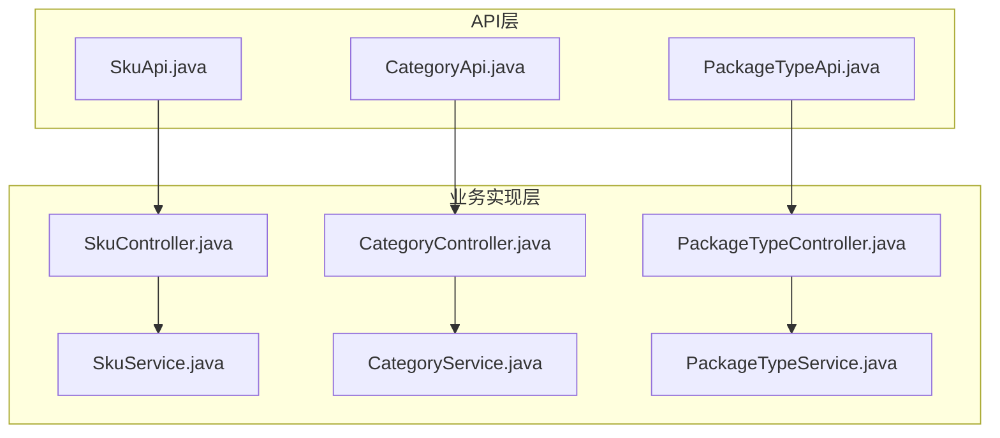
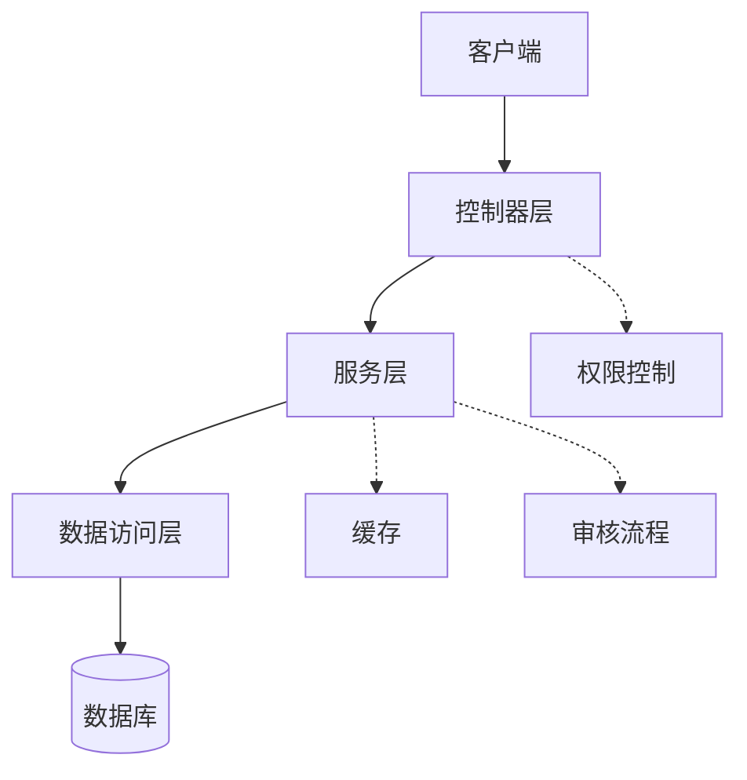
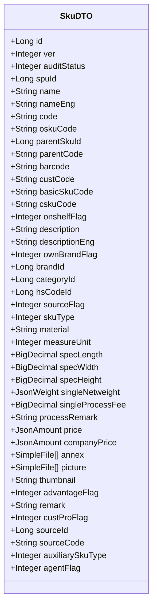
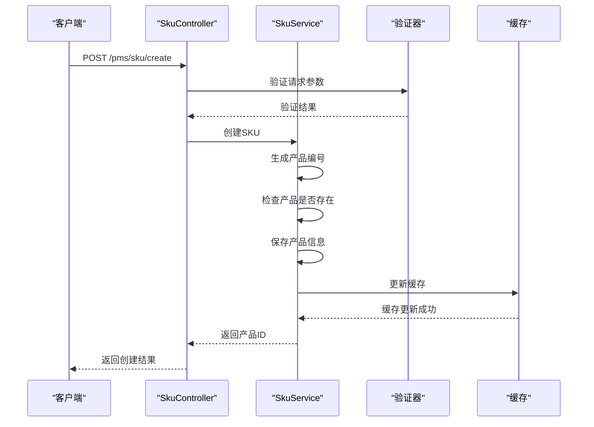
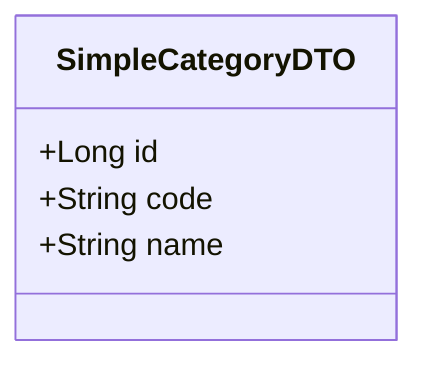
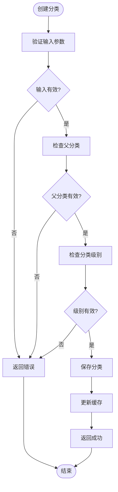
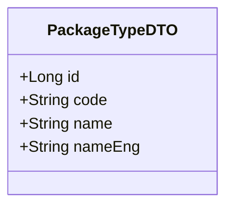
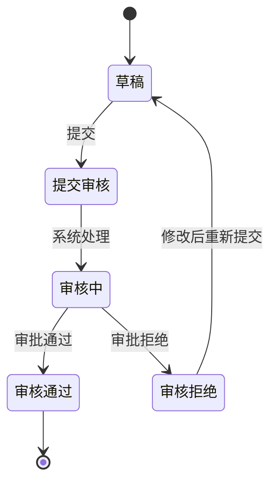
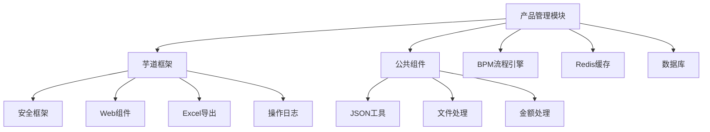

# 产品管理API

<cite>
**本文档引用的文件**  
- [SkuApi.java](file://eplus-module-pms/eplus-module-pms-api/src/main/java/com/syj/eplus/module/pms/api/sku/SkuApi.java)
- [CategoryApi.java](file://eplus-module-pms/eplus-module-pms-api/src/main/java/com/syj/eplus/module/pms/api/Category/CategoryApi.java)
- [PackageTypeApi.java](file://eplus-module-pms/eplus-module-pms-api/src/main/java/com/syj/eplus/module/pms/api/packageType/PackageTypeApi.java)
- [ErrorCodeConstants.java](file://eplus-module-pms/eplus-module-pms-api/src/main/java/com/syj/eplus/module/pms/enums/ErrorCodeConstants.java)
- [SkuDTO.java](file://eplus-module-pms/eplus-module-pms-api/src/main/java/com/syj/eplus/module/pms/api/sku/dto/SkuDTO.java)
- [SimpleCategoryDTO.java](file://eplus-module-pms/eplus-module-pms-api/src/main/java/com/syj/eplus/module/pms/api/Category/dto/SimpleCategoryDTO.java)
- [PackageTypeDTO.java](file://eplus-module-pms/eplus-module-pms-api/src/main/java/com/syj/eplus/module/pms/api/packageType/dto/PackageTypeDTO.java)
- [CategoryController.java](file://eplus-module-pms/eplus-module-pms-biz/src/main/java/com/syj/eplus/module/pms/controller/admin/category/CategoryController.java)
- [PackageTypeController.java](file://eplus-module-pms/eplus-module-pms-biz/src/main/java/com/syj/eplus/module/pms/controller/admin/packagetype/PackageTypeController.java)
- [SkuController.java](file://eplus-module-pms/eplus-module-pms-biz/src/main/java/com/syj/eplus/module/pms/controller/admin/sku/SkuController.java)
- [CategorySaveReqVO.java](file://eplus-module-pms/eplus-module-pms-biz/src/main/java/com/syj/eplus/module/pms/controller/admin/category/vo/CategorySaveReqVO.java)
- [PackageTypeSaveReqVO.java](file://eplus-module-pms/eplus-module-pms-biz/src/main/java/com/syj/eplus/module/pms/controller/admin/packagetype/vo/PackageTypeSaveReqVO.java)
- [SkuInfoSaveReqVO.java](file://eplus-module-pms/eplus-module-pms-biz/src/main/java/com/syj/eplus/module/pms/controller/admin/sku/vo/SkuInfoSaveReqVO.java)
</cite>

## 目录
1. [简介](#简介)
2. [项目结构](#项目结构)
3. [核心组件](#核心组件)
4. [架构概述](#架构概述)
5. [详细组件分析](#详细组件分析)
6. [依赖分析](#依赖分析)
7. [性能考虑](#性能考虑)
8. [故障排除指南](#故障排除指南)
9. [结论](#结论)
10. [附录](#附录)（如有必要）

## 简介
本文档系统性地描述了产品管理模块的API接口，涵盖SKU管理、产品分类和包装类型等核心功能。文档遵循OpenAPI/Swagger标准，为所有RESTful端点提供完整的技术规范，包括HTTP方法、URL路径、请求参数、请求体结构、响应数据格式和状态码。详细说明了每个API参数的业务含义、数据约束和验证规则，并提供了产品生命周期管理的典型请求/响应示例。文档还解释了API的认证授权机制和数据权限控制，提供了完整的错误码列表及其处理策略，以及产品数据同步和集成的最佳实践指南。

## 项目结构
产品管理模块（eplus-module-pms）包含API定义和业务实现两个主要部分。API定义位于`eplus-module-pms-api`模块中，包括SKU、产品分类和包装类型等接口。业务实现位于`eplus-module-pms-biz`模块中，包含控制器、服务和数据访问层。

**图示来源**
- [SkuApi.java](file://eplus-module-pms/eplus-module-pms-api/src/main/java/com/syj/eplus/module/pms/api/sku/SkuApi.java)
- [CategoryApi.java](file://eplus-module-pms/eplus-module-pms-api/src/main/java/com/syj/eplus/module/pms/api/Category/CategoryApi.java)
- [PackageTypeApi.java](file://eplus-module-pms/eplus-module-pms-api/src/main/java/com/syj/eplus/module/pms/api/packageType/PackageTypeApi.java)
- [SkuController.java](file://eplus-module-pms/eplus-module-pms-biz/src/main/java/com/syj/eplus/module/pms/controller/admin/sku/SkuController.java)
- [CategoryController.java](file://eplus-module-pms/eplus-module-pms-biz/src/main/java/com/syj/eplus/module/pms/controller/admin/category/CategoryController.java)
- [PackageTypeController.java](file://eplus-module-pms/eplus-module-pms-biz/src/main/java/com/syj/eplus/module/pms/controller/admin/packagetype/PackageTypeController.java)

**本节来源**
- [SkuApi.java](file://eplus-module-pms/eplus-module-pms-api/src/main/java/com/syj/eplus/module/pms/api/sku/SkuApi.java)
- [CategoryApi.java](file://eplus-module-pms/eplus-module-pms-api/src/main/java/com/syj/eplus/module/pms/api/Category/CategoryApi.java)
- [PackageTypeApi.java](file://eplus-module-pms/eplus-module-pms-api/src/main/java/com/syj/eplus/module/pms/api/packageType/PackageTypeApi.java)
- [SkuController.java](file://eplus-module-pms/eplus-module-pms-biz/src/main/java/com/syj/eplus/module/pms/controller/admin/sku/SkuController.java)
- [CategoryController.java](file://eplus-module-pms/eplus-module-pms-biz/src/main/java/com/syj/eplus/module/pms/controller/admin/category/CategoryController.java)
- [PackageTypeController.java](file://eplus-module-pms/eplus-module-pms-biz/src/main/java/com/syj/eplus/module/pms/controller/admin/packagetype/PackageTypeController.java)

## 核心组件
产品管理模块的核心组件包括SKU管理、产品分类管理和包装类型管理。SKU管理提供产品信息的增删改查、组合产品管理、客户产品管理等功能。产品分类管理提供产品分类的树形结构管理。包装类型管理提供包装方式的增删改查和审核流程。

**本节来源**
- [SkuApi.java](file://eplus-module-pms/eplus-module-pms-api/src/main/java/com/syj/eplus/module/pms/api/sku/SkuApi.java)
- [CategoryApi.java](file://eplus-module-pms/eplus-module-pms-api/src/main/java/com/syj/eplus/module/pms/api/Category/CategoryApi.java)
- [PackageTypeApi.java](file://eplus-module-pms/eplus-module-pms-api/src/main/java/com/syj/eplus/module/pms/api/packageType/PackageTypeApi.java)

## 架构概述
产品管理模块采用典型的分层架构，包括API层、控制器层、服务层和数据访问层。API层定义了供其他模块调用的接口。控制器层处理HTTP请求，进行参数验证和权限控制。服务层实现核心业务逻辑。数据访问层负责与数据库交互。

**图示来源**
- [SkuController.java](file://eplus-module-pms/eplus-module-pms-biz/src/main/java/com/syj/eplus/module/pms/controller/admin/sku/SkuController.java)
- [CategoryController.java](file://eplus-module-pms/eplus-module-pms-biz/src/main/java/com/syj/eplus/module/pms/controller/admin/category/CategoryController.java)
- [PackageTypeController.java](file://eplus-module-pms/eplus-module-pms-biz/src/main/java/com/syj/eplus/module/pms/controller/admin/packagetype/PackageTypeController.java)

## 详细组件分析

### SKU管理分析
SKU管理是产品管理模块的核心功能，提供产品信息的全生命周期管理。

#### SKU数据结构

**图示来源**
- [SkuDTO.java](file://eplus-module-pms/eplus-module-pms-api/src/main/java/com/syj/eplus/module/pms/api/sku/dto/SkuDTO.java)

#### SKU创建流程

**图示来源**
- [SkuController.java](file://eplus-module-pms/eplus-module-pms-biz/src/main/java/com/syj/eplus/module/pms/controller/admin/sku/SkuController.java)
- [SkuService.java](file://eplus-module-pms/eplus-module-pms-biz/src/main/java/com/syj/eplus/module/pms/service/sku/SkuService.java)

**本节来源**
- [SkuApi.java](file://eplus-module-pms/eplus-module-pms-api/src/main/java/com/syj/eplus/module/pms/api/sku/SkuApi.java)
- [SkuDTO.java](file://eplus-module-pms/eplus-module-pms-api/src/main/java/com/syj/eplus/module/pms/api/sku/dto/SkuDTO.java)
- [SkuController.java](file://eplus-module-pms/eplus-module-pms-biz/src/main/java/com/syj/eplus/module/pms/controller/admin/sku/SkuController.java)
- [SkuInfoSaveReqVO.java](file://eplus-module-pms/eplus-module-pms-biz/src/main/java/com/syj/eplus/module/pms/controller/admin/sku/vo/SkuInfoSaveReqVO.java)

### 产品分类管理分析
产品分类管理提供产品分类的树形结构管理，支持多级分类。

#### 产品分类数据结构

**图示来源**
- [SimpleCategoryDTO.java](file://eplus-module-pms/eplus-module-pms-api/src/main/java/com/syj/eplus/module/pms/api/Category/dto/SimpleCategoryDTO.java)

#### 产品分类管理API

**图示来源**
- [CategoryController.java](file://eplus-module-pms/eplus-module-pms-biz/src/main/java/com/syj/eplus/module/pms/controller/admin/category/CategoryController.java)
- [CategoryService.java](file://eplus-module-pms/eplus-module-pms-biz/src/main/java/com/syj/eplus/module/pms/service/category/CategoryService.java)

**本节来源**
- [CategoryApi.java](file://eplus-module-pms/eplus-module-pms-api/src/main/java/com/syj/eplus/module/pms/api/Category/CategoryApi.java)
- [SimpleCategoryDTO.java](file://eplus-module-pms/eplus-module-pms-api/src/main/java/com/syj/eplus/module/pms/api/Category/dto/SimpleCategoryDTO.java)
- [CategoryController.java](file://eplus-module-pms/eplus-module-pms-biz/src/main/java/com/syj/eplus/module/pms/controller/admin/category/CategoryController.java)
- [CategorySaveReqVO.java](file://eplus-module-pms/eplus-module-pms-biz/src/main/java/com/syj/eplus/module/pms/controller/admin/category/vo/CategorySaveReqVO.java)

### 包装类型管理分析
包装类型管理提供包装方式的增删改查和审核流程。

#### 包装类型数据结构

**图示来源**
- [PackageTypeDTO.java](file://eplus-module-pms/eplus-module-pms-api/src/main/java/com/syj/eplus/module/pms/api/packageType/dto/PackageTypeDTO.java)

#### 包装类型审核流程

**图示来源**
- [PackageTypeController.java](file://eplus-module-pms/eplus-module-pms-biz/src/main/java/com/syj/eplus/module/pms/controller/admin/packagetype/PackageTypeController.java)
- [PackageTypeService.java](file://eplus-module-pms/eplus-module-pms-biz/src/main/java/com/syj/eplus/module/pms/service/packagetype/PackageTypeService.java)

**本节来源**
- [PackageTypeApi.java](file://eplus-module-pms/eplus-module-pms-api/src/main/java/com/syj/eplus/module/pms/api/packageType/PackageTypeApi.java)
- [PackageTypeDTO.java](file://eplus-module-pms/eplus-module-pms-api/src/main/java/com/syj/eplus/module/pms/api/packageType/dto/PackageTypeDTO.java)
- [PackageTypeController.java](file://eplus-module-pms/eplus-module-pms-biz/src/main/java/com/syj/eplus/module/pms/controller/admin/packagetype/PackageTypeController.java)
- [PackageTypeSaveReqVO.java](file://eplus-module-pms/eplus-module-pms-biz/src/main/java/com/syj/eplus/module/pms/controller/admin/packagetype/vo/PackageTypeSaveReqVO.java)

## 依赖分析
产品管理模块依赖于多个基础组件和外部服务。

**图示来源**
- [pom.xml](file://eplus-module-pms/pom.xml)
- [SkuController.java](file://eplus-module-pms/eplus-module-pms-biz/src/main/java/com/syj/eplus/module/pms/controller/admin/sku/SkuController.java)
- [CategoryController.java](file://eplus-module-pms/eplus-module-pms-biz/src/main/java/com/syj/eplus/module/pms/controller/admin/category/CategoryController.java)
- [PackageTypeController.java](file://eplus-module-pms/eplus-module-pms-biz/src/main/java/com/syj/eplus/module/pms/controller/admin/packagetype/PackageTypeController.java)

**本节来源**
- [pom.xml](file://eplus-module-pms/pom.xml)
- [SkuController.java](file://eplus-module-pms/eplus-module-pms-biz/src/main/java/com/syj/eplus/module/pms/controller/admin/sku/SkuController.java)
- [CategoryController.java](file://eplus-module-pms/eplus-module-pms-biz/src/main/java/com/syj/eplus/module/pms/controller/admin/category/CategoryController.java)
- [PackageTypeController.java](file://eplus-module-pms/eplus-module-pms-biz/src/main/java/com/syj/eplus/module/pms/controller/admin/packagetype/PackageTypeController.java)

## 性能考虑
产品管理模块在设计时考虑了性能优化，主要体现在以下几个方面：

1. **缓存机制**：频繁访问的数据如产品分类、包装类型等都使用了缓存，减少数据库查询次数。
2. **批量操作**：提供了批量获取产品信息的API，减少网络请求次数。
3. **分页查询**：对于列表查询，都支持分页，避免一次性加载大量数据。
4. **异步处理**：一些耗时操作如图片处理、数据导出等采用异步方式处理。
5. **数据库优化**：关键字段建立了索引，优化查询性能。

**本节来源**
- [SkuApi.java](file://eplus-module-pms/eplus-module-pms-api/src/main/java/com/syj/eplus/module/pms/api/sku/SkuApi.java)
- [CategoryApi.java](file://eplus-module-pms/eplus-module-pms-api/src/main/java/com/syj/eplus/module/pms/api/Category/CategoryApi.java)
- [PackageTypeApi.java](file://eplus-module-pms/eplus-module-pms-api/src/main/java/com/syj/eplus/module/pms/api/packageType/PackageTypeApi.java)

## 故障排除指南
### 常见错误码
| 错误码 | 错误信息 | 原因 | 解决方案 |
|--------|--------|------|----------|
| 1120000000 | 产品信息不存在 | 请求的产品ID不存在 | 检查产品ID是否正确 |
| 1120000001 | 产品分类不存在 | 请求的分类ID不存在 | 检查分类ID是否正确 |
| 1120000002 | 产品SKU不存在 | 请求的SKU不存在 | 检查SKU编号是否正确 |
| 1120000005 | 审核中,禁止修改 | 产品正在审核流程中 | 等待审核完成后再修改 |
| 1120000006 | 禁止该分类创建产品 | 该分类不允许创建产品 | 检查分类设置 |
| 1120000016 | 自营产品货号为空 | 创建自营产品时货号为空 | 确保货号字段不为空 |
| 1120000017 | 自营产品货号已经存在 | 货号重复 | 使用不同的货号 |

**本节来源**
- [ErrorCodeConstants.java](file://eplus-module-pms/eplus-module-pms-api/src/main/java/com/syj/eplus/module/pms/enums/ErrorCodeConstants.java)

## 结论
产品管理模块提供了完整的SKU管理、产品分类管理和包装类型管理功能，支持产品全生命周期的管理。API设计遵循RESTful规范，提供了丰富的查询和操作接口。模块采用了分层架构，代码结构清晰，易于维护和扩展。通过缓存、批量操作等机制优化了性能，提供了完善的错误处理和日志记录。

## 附录
### API权限说明
| 权限标识 | 说明 |
|---------|------|
| pms:category:create | 产品分类创建权限 |
| pms:category:update | 产品分类修改权限 |
| pms:category:delete | 产品分类删除权限 |
| pms:category:query | 产品分类查询权限 |
| pms:category:export | 产品分类导出权限 |
| pms:package-type:create | 包装方式创建权限 |
| pms:package-type:update | 包装方式修改权限 |
| pms:package-type:delete | 包装方式删除权限 |
| pms:package-type:query | 包装方式查询权限 |
| pms:package-type:export | 包装方式导出权限 |
| pms:package-type:audit | 包装方式审核权限 |
| pms:package-type:submit | 包装方式提交权限 |

**本节来源**
- [CategoryController.java](file://eplus-module-pms/eplus-module-pms-biz/src/main/java/com/syj/eplus/module/pms/controller/admin/category/CategoryController.java)
- [PackageTypeController.java](file://eplus-module-pms/eplus-module-pms-biz/src/main/java/com/syj/eplus/module/pms/controller/admin/packagetype/PackageTypeController.java)