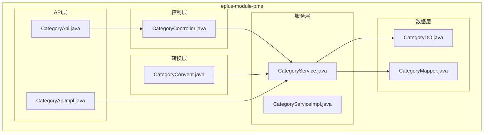
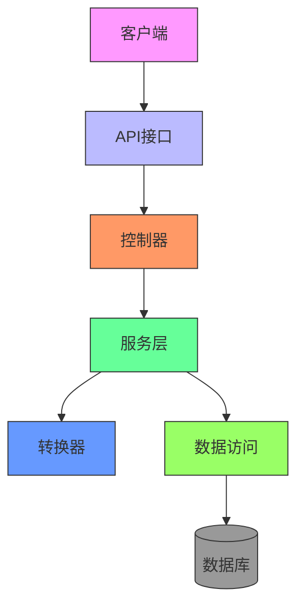
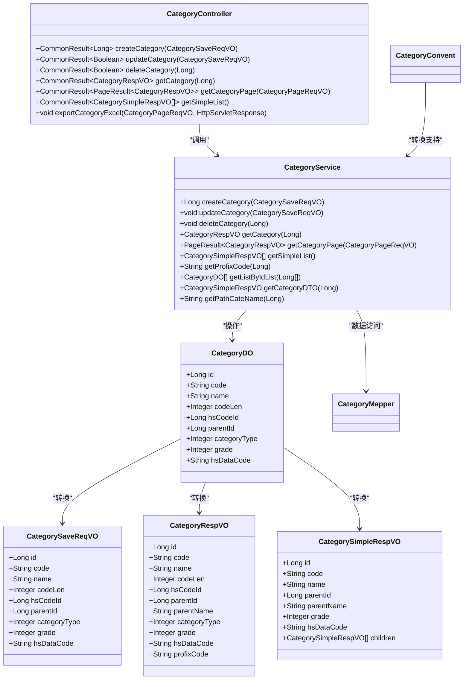
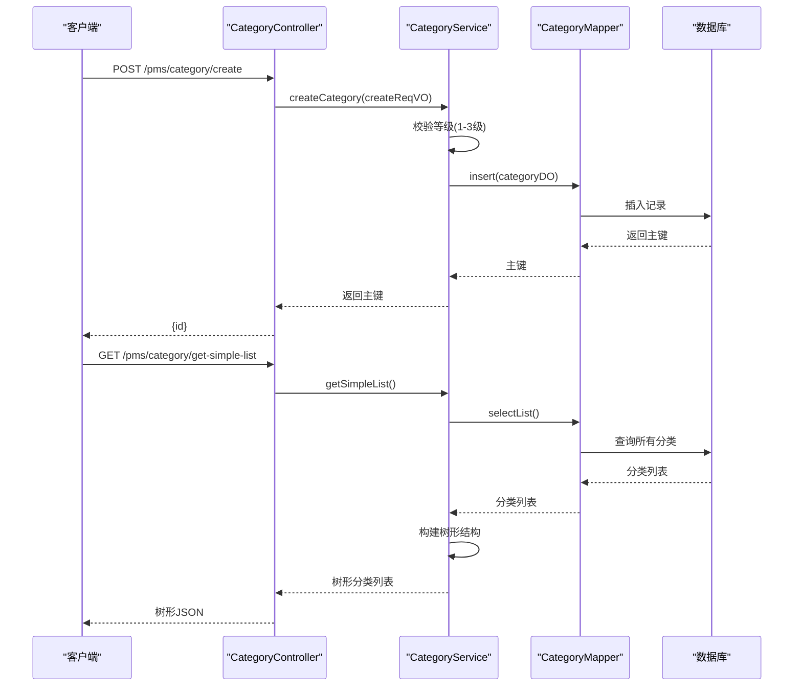
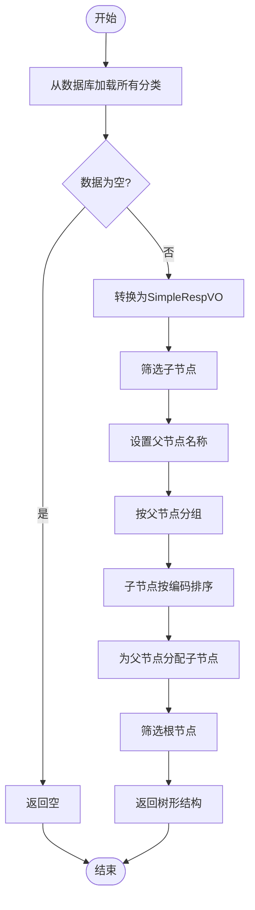
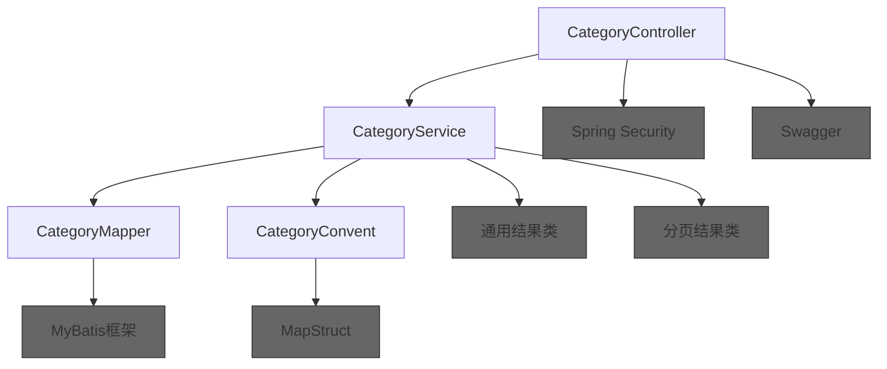

# 分类管理API

<cite>
**本文档引用的文件**  
- [CategoryApi.java](file://eplus-module-pms/eplus-module-pms-api/src/main/java/com/syj/eplus/module/pms/api/Category/CategoryApi.java)
- [CategoryApiImpl.java](file://eplus-module-pms/eplus-module-pms-biz/src/main/java/com/syj/eplus/module/pms/api/CategoryApiImpl.java)
- [CategoryController.java](file://eplus-module-pms/eplus-module-pms-biz/src/main/java/com/syj/eplus/module/pms/controller/admin/category/CategoryController.java)
- [CategoryService.java](file://eplus-module-pms/eplus-module-pms-biz/src/main/java/com/syj/eplus/module/pms/service/category/CategoryService.java)
- [CategoryServiceImpl.java](file://eplus-module-pms/eplus-module-pms-biz/src/main/java/com/syj/eplus/module/pms/service/category/CategoryServiceImpl.java)
- [CategoryDO.java](file://eplus-module-pms/eplus-module-pms-biz/src/main/java/com/syj/eplus/module/pms/dal/dataobject/category/CategoryDO.java)
- [CategorySaveReqVO.java](file://eplus-module-pms/eplus-module-pms-biz/src/main/java/com/syj/eplus/module/pms/controller/admin/category/vo/CategorySaveReqVO.java)
- [CategorySimpleRespVO.java](file://eplus-module-pms/eplus-module-pms-biz/src/main/java/com/syj/eplus/module/pms/controller/admin/category/vo/CategorySimpleRespVO.java)
- [ErrorCodeConstants.java](file://eplus-module-pms/eplus-module-pms-api/src/main/java/com/syj/eplus/module/pms/enums/ErrorCodeConstants.java)
- [CategoryConvent.java](file://eplus-module-pms/eplus-module-pms-biz/src/main/java/com/syj/eplus/module/pms/service/convent/CategoryConvent.java)
</cite>

## 目录
1. [简介](#简介)
2. [项目结构](#项目结构)
3. [核心组件](#核心组件)
4. [架构概述](#架构概述)
5. [详细组件分析](#详细组件分析)
6. [依赖分析](#依赖分析)
7. [性能考虑](#性能考虑)
8. [故障排除指南](#故障排除指南)
9. [结论](#结论)

## 简介
本文档详细描述了产品分类管理的树形结构接口，涵盖分类的创建、修改、删除、移动等操作的API规范。文档详细说明了分类层级、编码规则、属性配置等业务约束，以及分类树查询接口的递归查询、路径查询、扁平化查询等不同模式的技术细节。同时，解释了分类与SKU、品牌、属性模板的关联关系及其API操作方式，并提供分类数据同步和迁移的最佳实践，包括批量导入导出接口的使用方法。文档还包含分类权限控制、数据一致性保障和性能优化建议。

## 项目结构
产品分类管理功能主要位于`eplus-module-pms`模块中，该模块负责产品管理系统的各项功能。分类管理相关的代码分布在API接口、业务逻辑、数据访问和控制器等层次中。

**图示来源**
- [CategoryApi.java](file://eplus-module-pms/eplus-module-pms-api/src/main/java/com/syj/eplus/module/pms/api/Category/CategoryApi.java)
- [CategoryApiImpl.java](file://eplus-module-pms/eplus-module-pms-biz/src/main/java/com/syj/eplus/module/pms/api/CategoryApiImpl.java)
- [CategoryController.java](file://eplus-module-pms/eplus-module-pms-biz/src/main/java/com/syj/eplus/module/pms/controller/admin/category/CategoryController.java)
- [CategoryService.java](file://eplus-module-pms/eplus-module-pms-biz/src/main/java/com/syj/eplus/module/pms/service/category/CategoryService.java)
- [CategoryServiceImpl.java](file://eplus-module-pms/eplus-module-pms-biz/src/main/java/com/syj/eplus/module/pms/service/category/CategoryServiceImpl.java)
- [CategoryDO.java](file://eplus-module-pms/eplus-module-pms-biz/src/main/java/com/syj/eplus/module/pms/dal/dataobject/category/CategoryDO.java)
- [CategoryConvent.java](file://eplus-module-pms/eplus-module-pms-biz/src/main/java/com/syj/eplus/module/pms/service/convent/CategoryConvent.java)

**章节来源**
- [CategoryApi.java](file://eplus-module-pms/eplus-module-pms-api/src/main/java/com/syj/eplus/module/pms/api/Category/CategoryApi.java)
- [CategoryController.java](file://eplus-module-pms/eplus-module-pms-biz/src/main/java/com/syj/eplus/module/pms/controller/admin/category/CategoryController.java)

## 核心组件
产品分类管理的核心组件包括API接口、控制器、服务实现、数据对象和转换器。这些组件共同实现了分类的增删改查、树形结构构建、权限控制和数据一致性保障等功能。

**章节来源**
- [CategoryApi.java](file://eplus-module-pms/eplus-module-pms-api/src/main/java/com/syj/eplus/module/pms/api/Category/CategoryApi.java)
- [CategoryController.java](file://eplus-module-pms/eplus-module-pms-biz/src/main/java/com/syj/eplus/module/pms/controller/admin/category/CategoryController.java)
- [CategoryService.java](file://eplus-module-pms/eplus-module-pms-biz/src/main/java/com/syj/eplus/module/pms/service/category/CategoryService.java)
- [CategoryDO.java](file://eplus-module-pms/eplus-module-pms-biz/src/main/java/com/syj/eplus/module/pms/dal/dataobject/category/CategoryDO.java)

## 架构概述
产品分类管理采用典型的分层架构，包括API层、控制层、服务层、转换层和数据层。各层职责分明，通过接口进行通信，确保了系统的可维护性和可扩展性。

**图示来源**
- [CategoryApi.java](file://eplus-module-pms/eplus-module-pms-api/src/main/java/com/syj/eplus/module/pms/api/Category/CategoryApi.java)
- [CategoryController.java](file://eplus-module-pms/eplus-module-pms-biz/src/main/java/com/syj/eplus/module/pms/controller/admin/category/CategoryController.java)
- [CategoryService.java](file://eplus-module-pms/eplus-module-pms-biz/src/main/java/com/syj/eplus/module/pms/service/category/CategoryService.java)
- [CategoryDO.java](file://eplus-module-pms/eplus-module-pms-biz/src/main/java/com/syj/eplus/module/pms/dal/dataobject/category/CategoryDO.java)

## 详细组件分析

### 分类管理组件分析
分类管理组件实现了产品分类的完整生命周期管理，包括创建、更新、删除、查询等操作。系统采用树形结构管理分类，支持多级分类（最多三级），并提供了丰富的查询接口。

#### 对象关系图

**图示来源**
- [CategoryDO.java](file://eplus-module-pms/eplus-module-pms-biz/src/main/java/com/syj/eplus/module/pms/dal/dataobject/category/CategoryDO.java)
- [CategorySaveReqVO.java](file://eplus-module-pms/eplus-module-pms-biz/src/main/java/com/syj/eplus/module/pms/controller/admin/category/vo/CategorySaveReqVO.java)
- [CategoryRespVO.java](file://eplus-module-pms/eplus-module-pms-biz/src/main/java/com/syj/eplus/module/pms/controller/admin/category/vo/CategoryRespVO.java)
- [CategorySimpleRespVO.java](file://eplus-module-pms/eplus-module-pms-biz/src/main/java/com/syj/eplus/module/pms/controller/admin/category/vo/CategorySimpleRespVO.java)
- [CategoryService.java](file://eplus-module-pms/eplus-module-pms-biz/src/main/java/com/syj/eplus/module/pms/service/category/CategoryService.java)
- [CategoryController.java](file://eplus-module-pms/eplus-module-pms-biz/src/main/java/com/syj/eplus/module/pms/controller/admin/category/CategoryController.java)

#### API操作流程

**图示来源**
- [CategoryController.java](file://eplus-module-pms/eplus-module-pms-biz/src/main/java/com/syj/eplus/module/pms/controller/admin/category/CategoryController.java)
- [CategoryService.java](file://eplus-module-pms/eplus-module-pms-biz/src/main/java/com/syj/eplus/module/pms/service/category/CategoryService.java)
- [CategoryServiceImpl.java](file://eplus-module-pms/eplus-module-pms-biz/src/main/java/com/syj/eplus/module/pms/service/category/CategoryServiceImpl.java)

#### 分类树构建流程

**图示来源**
- [CategoryServiceImpl.java](file://eplus-module-pms/eplus-module-pms-biz/src/main/java/com/syj/eplus/module/pms/service/category/CategoryServiceImpl.java)
- [CategoryConvent.java](file://eplus-module-pms/eplus-module-pms-biz/src/main/java/com/syj/eplus/module/pms/service/convent/CategoryConvent.java)

**章节来源**
- [CategoryController.java](file://eplus-module-pms/eplus-module-pms-biz/src/main/java/com/syj/eplus/module/pms/controller/admin/category/CategoryController.java)
- [CategoryService.java](file://eplus-module-pms/eplus-module-pms-biz/src/main/java/com/syj/eplus/module/pms/service/category/CategoryService.java)
- [CategoryServiceImpl.java](file://eplus-module-pms/eplus-module-pms-biz/src/main/java/com/syj/eplus/module/pms/service/category/CategoryServiceImpl.java)
- [CategoryDO.java](file://eplus-module-pms/eplus-module-pms-biz/src/main/java/com/syj/eplus/module/pms/dal/dataobject/category/CategoryDO.java)
- [CategoryConvent.java](file://eplus-module-pms/eplus-module-pms-biz/src/main/java/com/syj/eplus/module/pms/service/convent/CategoryConvent.java)

### 分类与SKU关联分析
分类与SKU的关联主要通过分类ID建立关系，SKU在创建时必须指定所属分类，系统通过分类ID进行数据关联和查询。

**章节来源**
- [CategoryDO.java](file://eplus-module-pms/eplus-module-pms-biz/src/main/java/com/syj/eplus/module/pms/dal/dataobject/category/CategoryDO.java)

## 依赖分析
分类管理模块依赖于多个基础组件和框架，包括MyBatis用于数据访问，MapStruct用于对象转换，以及权限控制框架用于操作权限管理。

**图示来源**
- [CategoryController.java](file://eplus-module-pms/eplus-module-pms-biz/src/main/java/com/syj/eplus/module/pms/controller/admin/category/CategoryController.java)
- [CategoryService.java](file://eplus-module-pms/eplus-module-pms-biz/src/main/java/com/syj/eplus/module/pms/service/category/CategoryService.java)
- [CategoryMapper.java](file://eplus-module-pms/eplus-module-pms-biz/src/main/java/com/syj/eplus/module/pms/dal/mysql/category/CategoryMapper.java)

**章节来源**
- [CategoryController.java](file://eplus-module-pms/eplus-module-pms-biz/src/main/java/com/syj/eplus/module/pms/controller/admin/category/CategoryController.java)
- [CategoryService.java](file://eplus-module-pms/eplus-module-pms-biz/src/main/java/com/syj/eplus/module/pms/service/category/CategoryService.java)

## 性能考虑
分类管理在性能方面有以下考虑：
1. **树形结构缓存**：分类树结构相对稳定，建议在应用启动时加载到缓存中，减少数据库查询。
2. **分页查询优化**：分页查询时对结果按编码排序，提高数据展示的一致性。
3. **批量操作支持**：虽然当前API未提供批量操作接口，但可通过扩展支持批量导入导出功能。
4. **数据一致性**：在删除分类时，应先检查是否有SKU关联，避免出现孤立数据。

**章节来源**
- [CategoryServiceImpl.java](file://eplus-module-pms/eplus-module-pms-biz/src/main/java/com/syj/eplus/module/pms/service/category/CategoryServiceImpl.java)
- [CategoryController.java](file://eplus-module-pms/eplus-module-pms-biz/src/main/java/com/syj/eplus/module/pms/controller/admin/category/CategoryController.java)

## 故障排除指南
### 常见错误及解决方案
| 错误码 | 错误信息 | 原因 | 解决方案 |
|--------|--------|------|----------|
| 1120000001 | 产品分类不存在 | 分类ID不存在 | 检查分类ID是否正确 |
| 1120000008 | 产品分类等级不可为空 | 创建分类时未指定等级 | 确保创建时提供有效的等级值(1-3) |
| 1120000008 | 产品分类等级不可超过三级 | 分类等级超过3级 | 调整分类等级为1-3级 |
| 1120003003 | 产品编号已存在 | 分类编码重复 | 使用唯一的分类编码 |

**章节来源**
- [ErrorCodeConstants.java](file://eplus-module-pms/eplus-module-pms-api/src/main/java/com/syj/eplus/module/pms/enums/ErrorCodeConstants.java)
- [CategoryServiceImpl.java](file://eplus-module-pms/eplus-module-pms-biz/src/main/java/com/syj/eplus/module/pms/service/category/CategoryServiceImpl.java)

## 结论
产品分类管理API提供了完整的分类生命周期管理功能，支持树形结构的创建、维护和查询。系统设计考虑了业务约束（如最多三级分类）、数据一致性（通过外键和验证）和性能优化（分页排序）。通过清晰的分层架构和职责分离，系统具有良好的可维护性和扩展性。建议在实际使用中结合缓存机制进一步提升性能，并考虑增加批量操作接口以满足大规模数据处理需求。