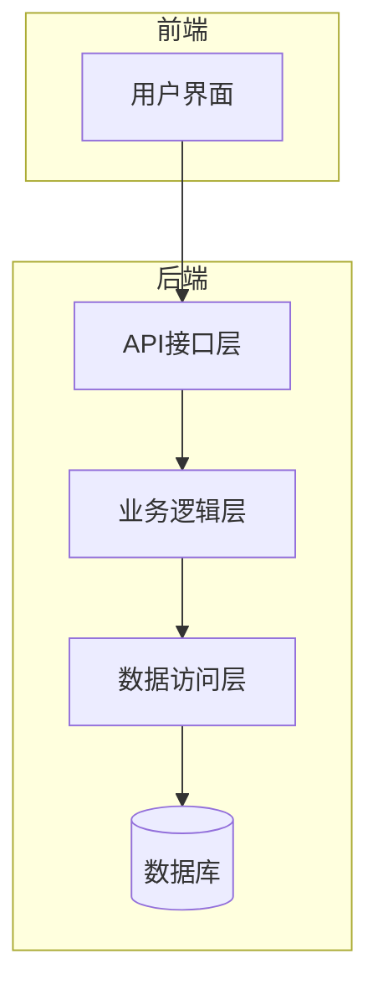
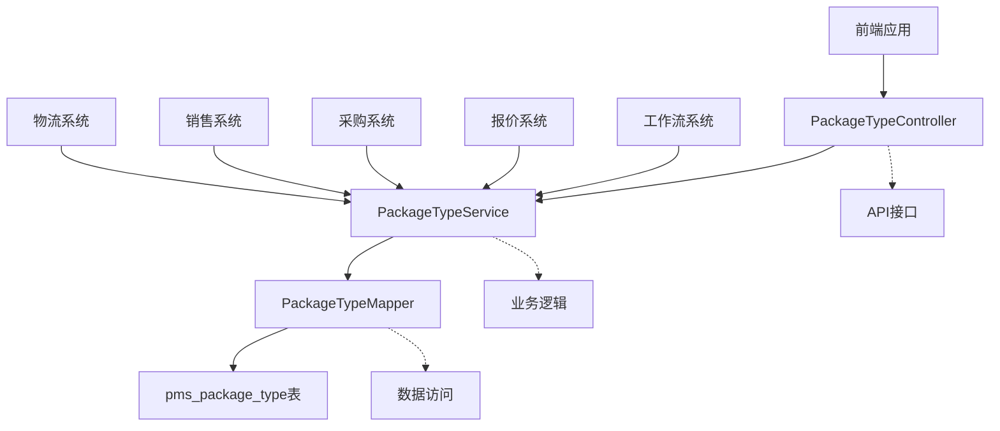
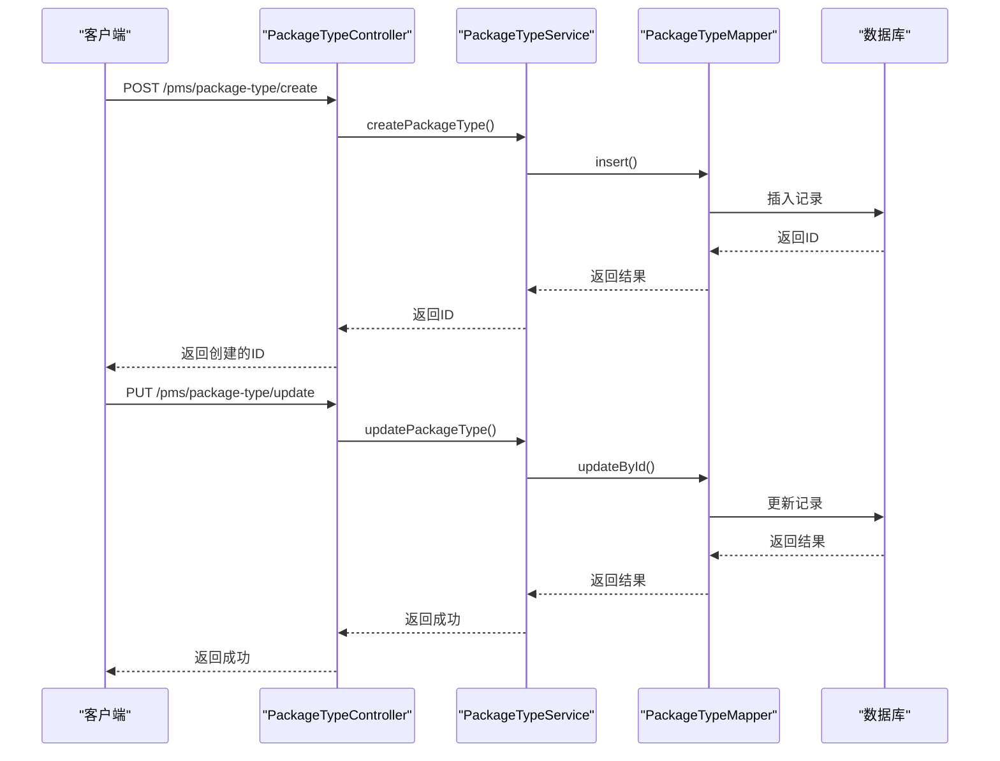
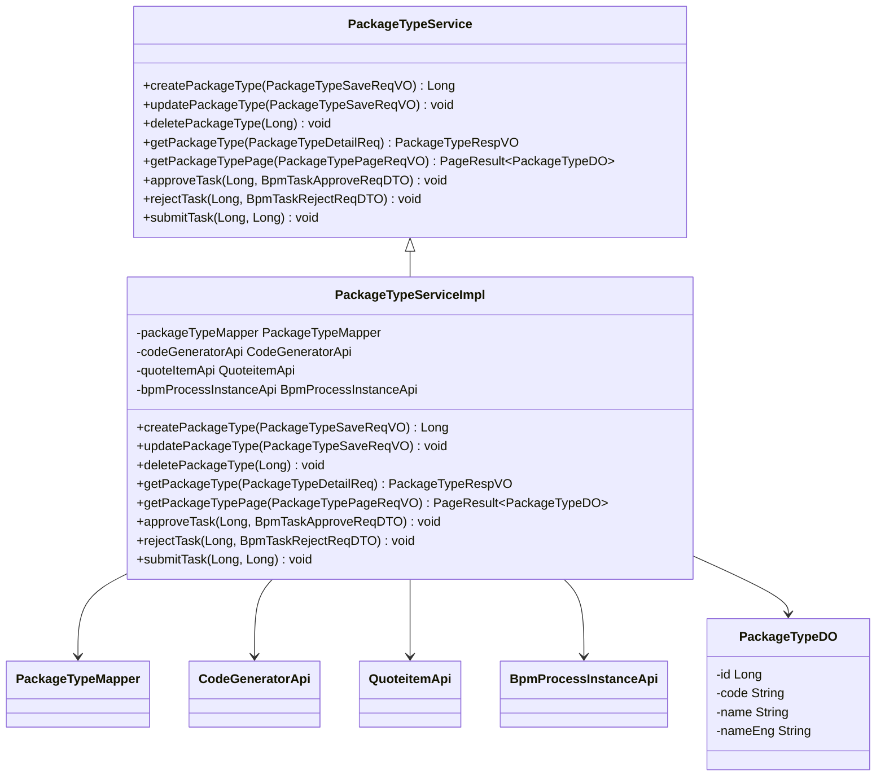
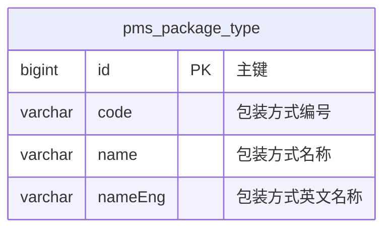
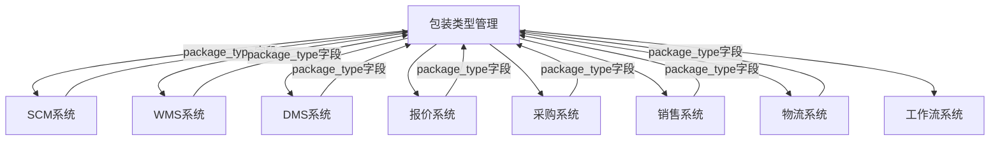

# 包装类型API

<cite>
**本文档引用文件**  
- [PackageTypeController.java](file://eplus-module-pms/eplus-module-pms-biz/src/main/java/com/syj/eplus/module/pms/controller/admin/packagetype/PackageTypeController.java)
- [PackageTypeService.java](file://eplus-module-pms/eplus-module-pms-biz/src/main/java/com/syj/eplus/module/pms/service/packagetype/PackageTypeService.java)
- [PackageTypeServiceImpl.java](file://eplus-module-pms/eplus-module-pms-biz/src/main/java/com/syj/eplus/module/pms/service/packagetype/PackageTypeServiceImpl.java)
- [PackageTypeDO.java](file://eplus-module-pms/eplus-module-pms-biz/src/main/java/com/syj/eplus/module/pms/dal/dataobject/packagetype/PackageTypeDO.java)
- [PackageTypeMapper.java](file://eplus-module-pms/eplus-module-pms-biz/src/main/java/com/syj/eplus/module/pms/dal/mysql/packagetype/PackageTypeMapper.java)
- [PackageTypeApi.java](file://eplus-module-pms/eplus-module-pms-api/src/main/java/com/syj/eplus/module/pms/api/packageType/PackageTypeApi.java)
- [PackageTypeApiImpl.java](file://eplus-module-pms/eplus-module-pms-biz/src/main/java/com/syj/eplus/module/pms/api/PackageTypeApiImpl.java)
- [PackageTypeSaveReqVO.java](file://eplus-module-pms/eplus-module-pms-biz/src/main/java/com/syj/eplus/module/pms/controller/admin/packagetype/vo/PackageTypeSaveReqVO.java)
- [PackageTypeRespVO.java](file://eplus-module-pms/eplus-module-pms-biz/src/main/java/com/syj/eplus/module/pms/controller/admin/packagetype/vo/PackageTypeRespVO.java)
- [PackageTypePageReqVO.java](file://eplus-module-pms/eplus-module-pms-biz/src/main/java/com/syj/eplus/module/pms/controller/admin/packagetype/vo/PackageTypePageReqVO.java)
- [V1_0_0_145__供应商报价修改package_type类型.java](file://eplus-flyway/src/main/java/db/migration/common/V1_0_0_145__供应商报价修改package_type类型.java)
- [V1_0_0_186__供应商报价修改package_type类型.java](file://eplus-flyway/src/main/java/db/migration/common/V1_0_0_186__供应商报价修改package_type类型.java)
- [V1_0_0_323__包装方式字段类型修改外销合同增加送货地址佣金收否扣减总金额.java](file://eplus-flyway/src/main/java/db/migration/common/V1_0_0_323__包装方式字段类型修改外销合同增加送货地址佣金收否扣减总金额.java)
</cite>

## 目录
1. [简介](#简介)
2. [项目结构](#项目结构)
3. [核心组件](#核心组件)
4. [架构概述](#架构概述)
5. [详细组件分析](#详细组件分析)
6. [依赖分析](#依赖分析)
7. [性能考虑](#性能考虑)
8. [故障排除指南](#故障排除指南)
9. [结论](#结论)

## 简介
本文档全面描述了产品包装类型的定义、管理和应用接口。详细说明了包装类型创建接口的参数，包括包装规格、材质、承重、体积等物理属性的定义。提供了包装类型与SKU的关联管理接口，解释了包装配置的继承和覆盖规则。文档包含包装类型在采购、仓储、物流等场景中的应用说明，以及与其他模块（如SCM、WMS）的集成方式。同时提供了包装数据标准化和迁移的最佳实践指南，包括错误处理机制和性能优化建议。

## 项目结构
包装类型管理功能主要位于`eplus-module-pms`模块中，该模块负责产品管理系统的包装类型相关功能。系统采用分层架构，包括API接口层、业务逻辑层、数据访问层和数据库层。

**图表来源**
- [PackageTypeController.java](file://eplus-module-pms/eplus-module-pms-biz/src/main/java/com/syj/eplus/module/pms/controller/admin/packagetype/PackageTypeController.java)
- [PackageTypeService.java](file://eplus-module-pms/eplus-module-pms-biz/src/main/java/com/syj/eplus/module/pms/service/packagetype/PackageTypeService.java)
- [PackageTypeMapper.java](file://eplus-module-pms/eplus-module-pms-biz/src/main/java/com/syj/eplus/module/pms/dal/mysql/packagetype/PackageTypeMapper.java)
- [PackageTypeDO.java](file://eplus-module-pms/eplus-module-pms-biz/src/main/java/com/syj/eplus/module/pms/dal/dataobject/packagetype/PackageTypeDO.java)

**章节来源**
- [PackageTypeController.java](file://eplus-module-pms/eplus-module-pms-biz/src/main/java/com/syj/eplus/module/pms/controller/admin/packagetype/PackageTypeController.java)
- [PackageTypeService.java](file://eplus-module-pms/eplus-module-pms-biz/src/main/java/com/syj/eplus/module/pms/service/packagetype/PackageTypeService.java)

## 核心组件
包装类型管理的核心组件包括包装类型控制器、服务接口、服务实现、数据对象和映射器。这些组件共同实现了包装类型的创建、更新、删除、查询等基本操作，以及与工作流系统的集成。

**章节来源**
- [PackageTypeController.java](file://eplus-module-pms/eplus-module-pms-biz/src/main/java/com/syj/eplus/module/pms/controller/admin/packagetype/PackageTypeController.java)
- [PackageTypeService.java](file://eplus-module-pms/eplus-module-pms-biz/src/main/java/com/syj/eplus/module/pms/service/packagetype/PackageTypeService.java)
- [PackageTypeDO.java](file://eplus-module-pms/eplus-module-pms-biz/src/main/java/com/syj/eplus/module/pms/dal/dataobject/packagetype/PackageTypeDO.java)

## 架构概述
包装类型管理系统的架构遵循典型的分层设计模式，从上到下分为表现层、业务逻辑层、数据访问层和持久层。系统通过RESTful API提供服务，支持包装类型的全生命周期管理。

**图表来源**
- [PackageTypeController.java](file://eplus-module-pms/eplus-module-pms-biz/src/main/java/com/syj/eplus/module/pms/controller/admin/packagetype/PackageTypeController.java)
- [PackageTypeService.java](file://eplus-module-pms/eplus-module-pms-biz/src/main/java/com/syj/eplus/module/pms/service/packagetype/PackageTypeService.java)
- [PackageTypeMapper.java](file://eplus-module-pms/eplus-module-pms-biz/src/main/java/com/syj/eplus/module/pms/dal/mysql/packagetype/PackageTypeMapper.java)

## 详细组件分析
### 包装类型控制器分析
包装类型控制器提供了RESTful API接口，支持包装类型的创建、更新、删除、查询等操作。控制器还集成了工作流审批功能，支持包装类型的提交、通过和拒绝操作。

**图表来源**
- [PackageTypeController.java](file://eplus-module-pms/eplus-module-pms-biz/src/main/java/com/syj/eplus/module/pms/controller/admin/packagetype/PackageTypeController.java)
- [PackageTypeService.java](file://eplus-module-pms/eplus-module-pms-biz/src/main/java/com/syj/eplus/module/pms/service/packagetype/PackageTypeService.java)
- [PackageTypeMapper.java](file://eplus-module-pms/eplus-module-pms-biz/src/main/java/com/syj/eplus/module/pms/dal/mysql/packagetype/PackageTypeMapper.java)

**章节来源**
- [PackageTypeController.java](file://eplus-module-pms/eplus-module-pms-biz/src/main/java/com/syj/eplus/module/pms/controller/admin/packagetype/PackageTypeController.java)

### 包装类型服务分析
包装类型服务实现了业务逻辑，包括包装类型的创建、更新、删除、查询等操作。服务层还负责与工作流系统集成，处理审批流程。

**图表来源**
- [PackageTypeService.java](file://eplus-module-pms/eplus-module-pms-biz/src/main/java/com/syj/eplus/module/pms/service/packagetype/PackageTypeService.java)
- [PackageTypeServiceImpl.java](file://eplus-module-pms/eplus-module-pms-biz/src/main/java/com/syj/eplus/module/pms/service/packagetype/PackageTypeServiceImpl.java)
- [PackageTypeDO.java](file://eplus-module-pms/eplus-module-pms-biz/src/main/java/com/syj/eplus/module/pms/dal/dataobject/packagetype/PackageTypeDO.java)

**章节来源**
- [PackageTypeService.java](file://eplus-module-pms/eplus-module-pms-biz/src/main/java/com/syj/eplus/module/pms/service/packagetype/PackageTypeService.java)
- [PackageTypeServiceImpl.java](file://eplus-module-pms/eplus-module-pms-biz/src/main/java/com/syj/eplus/module/pms/service/packagetype/PackageTypeServiceImpl.java)

### 包装类型数据对象分析
包装类型数据对象定义了包装类型在数据库中的结构，包括主键、编号、名称和英文名称等字段。该对象通过MyBatis Plus映射到数据库表pms_package_type。

**图表来源**
- [PackageTypeDO.java](file://eplus-module-pms/eplus-module-pms-biz/src/main/java/com/syj/eplus/module/pms/dal/dataobject/packagetype/PackageTypeDO.java)

**章节来源**
- [PackageTypeDO.java](file://eplus-module-pms/eplus-module-pms-biz/src/main/java/com/syj/eplus/module/pms/dal/dataobject/packagetype/PackageTypeDO.java)

## 依赖分析
包装类型管理系统与其他多个模块存在依赖关系，包括SCM（供应链管理）、WMS（仓储管理）、DMS（物流管理）等。这些依赖关系主要通过数据库字段引用和API调用实现。

**图表来源**
- [V1_0_0_145__供应商报价修改package_type类型.java](file://eplus-flyway/src/main/java/db/migration/common/V1_0_0_145__供应商报价修改package_type类型.java)
- [V1_0_0_186__供应商报价修改package_type类型.java](file://eplus-flyway/src/main/java/db/migration/common/V1_0_0_186__供应商报价修改package_type类型.java)
- [V1_0_0_323__包装方式字段类型修改外销合同增加送货地址佣金收否扣减总金额.java](file://eplus-flyway/src/main/java/db/migration/common/V1_0_0_323__包装方式字段类型修改外销合同增加送货地址佣金收否扣减总金额.java)

**章节来源**
- [PackageTypeServiceImpl.java](file://eplus-module-pms/eplus-module-pms-biz/src/main/java/com/syj/eplus/module/pms/service/packagetype/PackageTypeServiceImpl.java)
- [V1_0_0_145__供应商报价修改package_type类型.java](file://eplus-flyway/src/main/java/db/migration/common/V1_0_0_145__供应商报价修改package_type类型.java)

## 性能考虑
包装类型管理系统的性能优化主要体现在以下几个方面：
1. 使用缓存机制，通过getAllNameCache方法缓存所有包装名称
2. 分页查询支持，避免一次性加载大量数据
3. 数据库索引优化，确保查询性能
4. 批量操作支持，提高数据处理效率

## 故障排除指南
### 常见错误及解决方案
1. **包装类型删除失败**：检查是否有其他模块正在使用该包装类型，如报价、采购、销售等
2. **创建包装类型失败**：检查名称和英文名称是否为空，确保必填字段已填写
3. **审批流程异常**：检查工作流引擎是否正常运行，确认流程定义是否存在

**章节来源**
- [PackageTypeServiceImpl.java](file://eplus-module-pms/eplus-module-pms-biz/src/main/java/com/syj/eplus/module/pms/service/packagetype/PackageTypeServiceImpl.java)
- [PackageTypeService.java](file://eplus-module-pms/eplus-module-pms-biz/src/main/java/com/syj/eplus/module/pms/service/packagetype/PackageTypeService.java)

## 结论
包装类型管理系统提供了完整的包装类型管理功能，支持创建、更新、删除、查询等基本操作，并与工作流系统集成实现审批流程。系统通过API接口与其他模块集成，在采购、仓储、物流等场景中发挥重要作用。建议在使用过程中注意数据一致性维护，合理利用缓存机制提高系统性能。