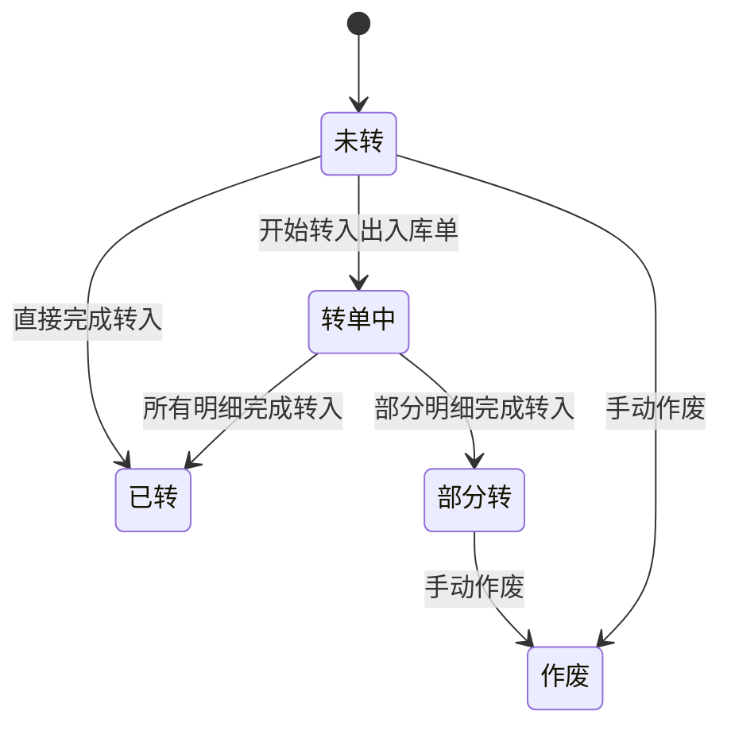
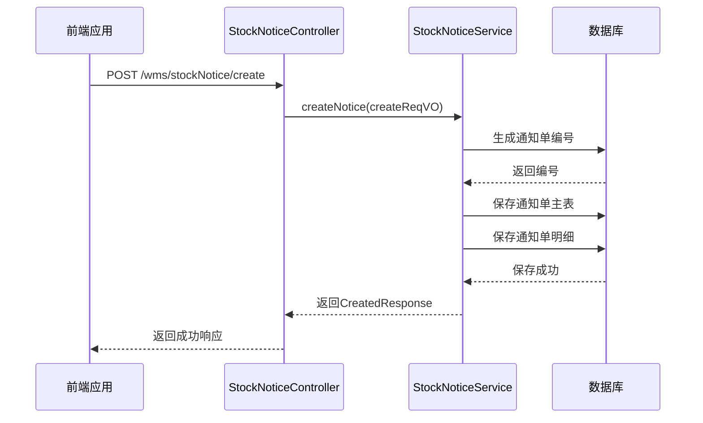
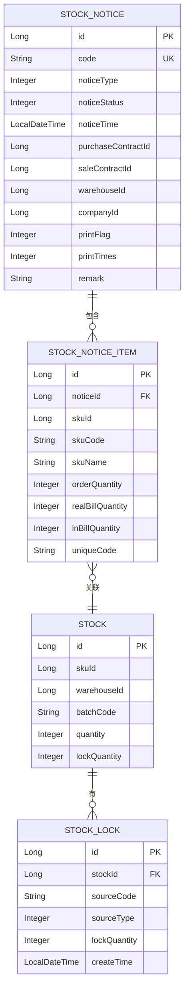
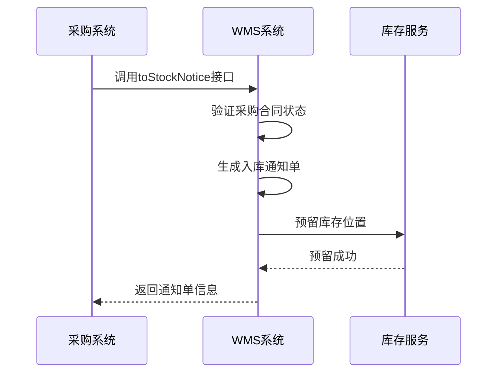
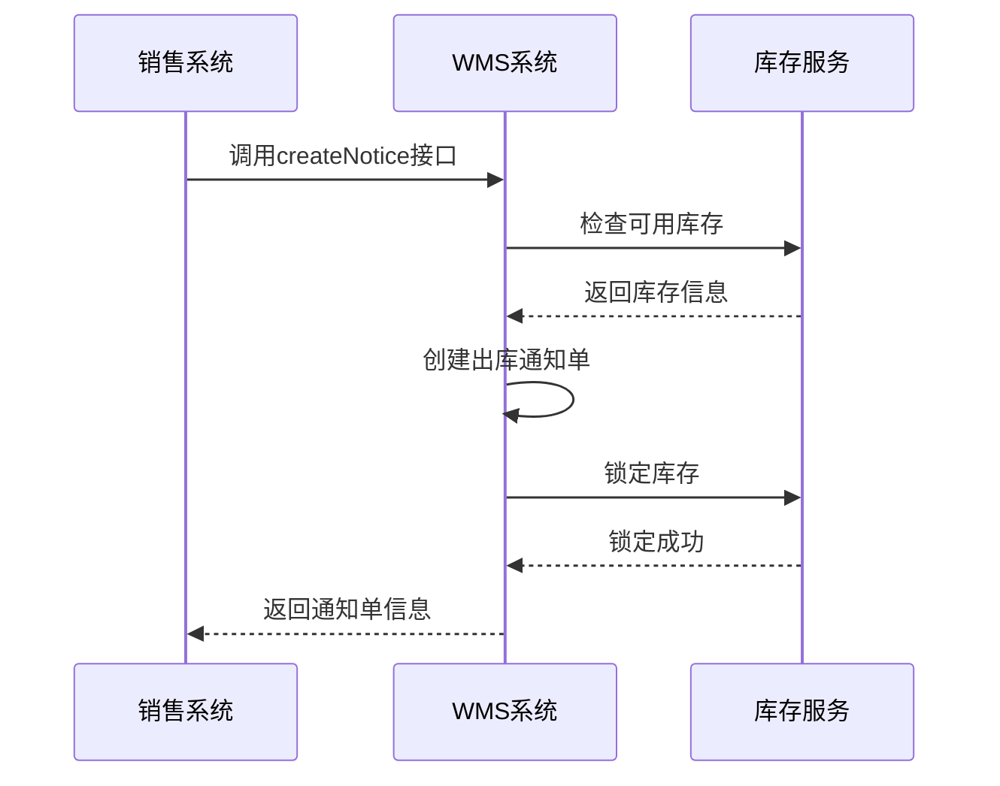

# 入出库通知API

<cite>
**本文档引用的文件**  
- [StockNoticeController.java](file://eplus-module-wms/eplus-module-wms-biz/src/main/java/com/syj/eplus/module/wms/controller/admin/stockNotice/StockNoticeController.java)
- [StockNoticeItemController.java](file://eplus-module-wms/eplus-module-wms-biz/src/main/java/com/syj/eplus/module/wms/controller/admin/stockNoticeItem/StockNoticeItemController.java)
- [StockNoticeServiceImpl.java](file://eplus-module-wms/eplus-module-wms-biz/src/main/java/com/syj/eplus/module/wms/service/stockNotice/StockNoticeServiceImpl.java)
- [StockNoticeApiImpl.java](file://eplus-module-wms/eplus-module-wms-biz/src/main/java/com/syj/eplus/module/wms/api/stockNotice/StockNoticeApiImpl.java)
- [IStockNoticeApi.java](file://eplus-module-wms/eplus-module-wms-api/src/main/java/com/syj/eplus/module/wms/api/stockNotice/IStockNoticeApi.java)
- [StockNoticeSaveReqDTO.java](file://eplus-module-wms/eplus-module-wms-api/src/main/java/com/syj/eplus/module/wms/api/stockNotice/dto/StockNoticeSaveReqDTO.java)
- [StockNoticeRespDTO.java](file://eplus-module-wms/eplus-module-wms-api/src/main/java/com/syj/eplus/module/wms/api/stockNotice/dto/StockNoticeRespDTO.java)
- [NoticeStatusEnum.java](file://eplus-module-wms/eplus-module-wms-api/src/main/java/com/syj/eplus/module/wms/enums/NoticeStatusEnum.java)
- [ErrorCodeConstants.java](file://eplus-module-wms/eplus-module-wms-api/src/main/java/com/syj/eplus/module/wms/enums/ErrorCodeConstants.java)
</cite>

## 目录
1. [简介](#简介)
2. [核心API接口](#核心api接口)
3. [出入库通知状态流转机制](#出入库通知状态流转机制)
4. [业务场景示例](#业务场景示例)
5. [通知单与库存明细的关联关系](#通知单与库存明细的关联关系)
6. [API安全要求](#api安全要求)
7. [错误码字典](#错误码字典)
8. [开发者调用示例](#开发者调用示例)

## 简介

出入库通知API是仓储管理系统的核心接口，用于管理入(出)库通知单的创建、查询、修改和状态变更等操作。该API支持采购入库通知、销售出库通知等多种业务场景，并与库存明细保持数据一致性。系统通过权限控制确保只有授权用户才能执行相关操作。

**本文档引用的文件**  
- [StockNoticeController.java](file://eplus-module-wms/eplus-module-wms-biz/src/main/java/com/syj/eplus/module/wms/controller/admin/stockNotice/StockNoticeController.java)
- [StockNoticeItemController.java](file://eplus-module-wms/eplus-module-wms-biz/src/main/java/com/syj/eplus/module/wms/controller/admin/stockNoticeItem/StockNoticeItemController.java)

## 核心API接口

### 创建出入库通知单

- **HTTP动词**: POST
- **URL模式**: `/wms/stockNotice/create`
- **权限要求**: `wms:notice:create` 或 `wms:notice-out:create`
- **请求体Schema**: `StockNoticeSaveReqVO`
- **响应结构**: `CommonResult<CreatedResponse>`
- **状态码**:
  - 200: 创建成功
  - 400: 参数校验失败
  - 403: 权限不足

### 更新出入库通知单

- **HTTP动词**: PUT
- **URL模式**: `/wms/stockNotice/update`
- **权限要求**: `wms:notice:update` 或 `wms:notice-out:update`
- **请求体Schema**: `StockNoticeSaveReqVO`
- **响应结构**: `CommonResult<Boolean>`
- **状态码**:
  - 200: 更新成功
  - 400: 参数校验失败
  - 403: 权限不足
  - 404: 通知单不存在

### 删除出入库通知单

- **HTTP动词**: DELETE
- **URL模式**: `/wms/stockNotice/delete`
- **权限要求**: `wms:notice:delete` 或 `wms:notice-out:delete`
- **查询参数**: `id` (通知单ID)
- **响应结构**: `CommonResult<Boolean>`
- **状态码**:
  - 200: 删除成功
  - 403: 权限不足
  - 404: 通知单不存在

### 查询出入库通知单分页

- **HTTP动词**: GET
- **URL模式**: `/wms/stockNotice/page`
- **权限要求**: `wms:notice:query` 或 `wms:notice-out:query`
- **查询参数**: `StockNoticePageReqVO`
- **响应结构**: `CommonResult<PageResult<StockNoticeRespVO>>`
- **状态码**:
  - 200: 查询成功
  - 403: 权限不足

### 创建出入库通知单明细

- **HTTP动词**: POST
- **URL模式**: `/wms/stockNotice-item/create`
- **权限要求**: `wms:notice-item:create`
- **请求体Schema**: `StockNoticeItemSaveReqVO`
- **响应结构**: `CommonResult<Long>`
- **状态码**:
  - 200: 创建成功
  - 400: 参数校验失败
  - 403: 权限不足

**本文档引用的文件**  
- [StockNoticeController.java](file://eplus-module-wms/eplus-module-wms-biz/src/main/java/com/syj/eplus/module/wms/controller/admin/stockNotice/StockNoticeController.java)
- [StockNoticeItemController.java](file://eplus-module-wms/eplus-module-wms-biz/src/main/java/com/syj/eplus/module/wms/controller/admin/stockNoticeItem/StockNoticeItemController.java)
- [StockNoticeSaveReqDTO.java](file://eplus-module-wms/eplus-module-wms-api/src/main/java/com/syj/eplus/module/wms/api/stockNotice/dto/StockNoticeSaveReqDTO.java)
- [StockNoticeRespDTO.java](file://eplus-module-wms/eplus-module-wms-api/src/main/java/com/syj/eplus/module/wms/api/stockNotice/dto/StockNoticeRespDTO.java)

## 入出库通知状态流转机制

### NoticeStatusEnum状态定义

出入库通知单的状态由`NoticeStatusEnum`枚举类定义，包含以下状态：

| 状态值 | 状态名称 | 描述 |
|--------|----------|------|
| 1 | 未转 | 通知单创建后初始状态，尚未转入出入库单 |
| 2 | 已转 | 通知单已完全转入出入库单 |
| 3 | 作废 | 通知单已被作废，不可再使用 |
| 4 | 部分转 | 通知单部分转入出入库单 |
| 5 | 转单中 | 通知单正在转入出入库单过程中 |

### 状态流转规则



### 状态变更业务约束

1. **创建时状态**: 新创建的通知单默认状态为"未转"(1)
2. **转入处理**: 当通知单转入出入库单时，状态变为"转单中"(5)
3. **完成转入**: 
   - 如果所有明细都完成转入，则状态变为"已转"(2)
   - 如果只有部分明细完成转入，则状态变为"部分转"(4)
4. **作废规则**:
   - 已转入出入库单的通知单不可作废
   - 下推生成的通知单不可作废
   - 作废前需检查是否存在关联的出入库单

### 状态变更实现逻辑

当系统检测到通知单的转入状态发生变化时，会调用`updateConvertStatusByCode`方法更新通知单状态：

```java
public void updateConvertStatusByCode(String code) {
    // 查询通知单
    List<StockNoticeDO> stockNoticeDOS = stockNoticeMapper.selectList(
        new LambdaQueryWrapperX<StockNoticeDO>().eq(StockNoticeDO::getCode, code));
    
    if (CollUtil.isEmpty(stockNoticeDOS)) {
        return;
    }
    
    StockNoticeDO stockNoticeDO = stockNoticeDOS.stream().findFirst().get();
    List<StockNoticeItemDO> stockNoticeItemDOS = stockNoticeItemMapper.selectList(
        new LambdaQueryWrapperX<StockNoticeItemDO>().eq(StockNoticeItemDO::getNoticeId, stockNoticeDO.getId()));
    
    // 检查是否所有明细都已完成转入
    boolean allConvertFlag = stockNoticeItemDOS.stream().allMatch(s -> {
        int realBillQuantity = Objects.isNull(s.getRealBillQuantity()) ? 0 : s.getRealBillQuantity();
        int orderQuantity = Objects.isNull(s.getOrderQuantity()) ? 0 : s.getOrderQuantity();
        return realBillQuantity == orderQuantity;
    });
    
    if (allConvertFlag){
        stockNoticeDO.setNoticeStatus(NoticeStatusEnum.CONVERTED.getValue());
    }else {
        stockNoticeDO.setNoticeStatus(NoticeStatusEnum.PART_CONVERT.getValue());
    }
    
    stockNoticeMapper.updateById(stockNoticeDO);
}
```

**本文档引用的文件**  
- [NoticeStatusEnum.java](file://eplus-module-wms/eplus-module-wms-api/src/main/java/com/syj/eplus/module/wms/enums/NoticeStatusEnum.java)
- [StockNoticeServiceImpl.java](file://eplus-module-wms/eplus-module-wms-biz/src/main/java/com/syj/eplus/module/wms/service/stockNotice/StockNoticeServiceImpl.java)

## 业务场景示例

### 采购入库通知

采购入库通知是将采购合同中的商品通知到仓库进行入库操作的业务流程。

#### 请求示例

```json
{
  "noticeType": 1,
  "purchaseContractId": 6613,
  "purchaseContractCode": "PO2023001",
  "warehouseId": 10095,
  "expectDate": "2023-12-01T00:00:00",
  "purchaserId": 14452,
  "purchaserDeptId": 11021,
  "companyId": 5879,
  "remark": "首批货物入库",
  "noticeItems": [
    {
      "skuId": 1001,
      "skuCode": "SKU001",
      "skuName": "产品A",
      "orderQuantity": 100,
      "unit": "件"
    }
  ]
}
```

#### 响应示例

```json
{
  "code": 0,
  "msg": "成功",
  "data": {
    "id": 16203,
    "code": "RE20231201001"
  }
}
```

### 销售出库通知

销售出库通知是根据销售合同安排商品出库的业务流程。

#### 请求示例

```json
{
  "noticeType": 2,
  "saleContractId": 828,
  "saleContractCode": "SO2023001",
  "warehouseId": 10095,
  "expectDate": "2023-12-05T00:00:00",
  "salesId": 10937,
  "salesDeptId": 31806,
  "companyId": 5879,
  "remark": "客户紧急订单",
  "noticeItems": [
    {
      "skuId": 1002,
      "skuCode": "SKU002",
      "skuName": "产品B",
      "orderQuantity": 50,
      "unit": "件"
    }
  ]
}
```

#### 响应示例

```json
{
  "code": 0,
  "msg": "成功",
  "data": {
    "id": 16204,
    "code": "TT20231205001"
  }
}
```

### 拉柜通知单

拉柜通知单是专门用于集装箱运输的特殊通知单。

#### 创建拉柜通知单



**本文档引用的文件**  
- [StockNoticeController.java](file://eplus-module-wms/eplus-module-wms-biz/src/main/java/com/syj/eplus/module/wms/controller/admin/stockNotice/StockNoticeController.java)
- [StockNoticeServiceImpl.java](file://eplus-module-wms/eplus-module-wms-biz/src/main/java/com/syj/eplus/module/wms/service/stockNotice/StockNoticeServiceImpl.java)

## 通知单与库存明细的关联关系

### 数据模型关系



### 数据一致性保证机制

#### 创建时的一致性检查

1. **明细不能为空**: 创建通知单时必须包含至少一个明细项
2. **数量校验**: 明细中的数量必须为正整数
3. **SKU存在性**: 所有SKU必须在系统中存在

#### 转入出入库单时的一致性

当通知单转入出入库单时，系统会执行以下一致性检查：

1. **库存检查**: 对于出库通知单，检查相关SKU的可用库存是否足够
2. **锁定库存**: 对于出库通知单，先锁定相应数量的库存
3. **更新实际转入数量**: 更新通知单明细中的`realBillQuantity`字段
4. **状态更新**: 根据转入情况更新通知单状态

#### 作废时的数据回滚

当通知单被作废时，系统会执行数据回滚操作：

```java
public void closeNotice(Long id) {
    StockNoticeDO stockNoticeDO = validateNoticeExists(id);
    
    // 检查是否存在关联的出入库单
    boolean exists = billService.exists(new LambdaQueryWrapperX<BillDO>()
        .eq(BillDO::getNoticeCode, stockNoticeDO.getCode()));
    if (exists){
        throw exception(STOCK_NOTICE_EXISTS_BILL);
    }
    
    // 检查是否为手动创建的通知单
    if (!BooleanEnum.YES.getValue().equals(stockNoticeDO.getManualFlag())){
        throw exception(STOCK_NOTICE_NOT_ALLOW_CANCEL);
    }
    
    // 更新状态为作废
    stockNoticeDO.setNoticeStatus(NoticeStatusEnum.CANCEL.getValue());
    stockNoticeMapper.updateById(stockNoticeDO);
    
    // 释放锁定的库存或回退采购数量
    if (StockTypeEnum.OUT_STOCK.getValue().equals(stockNoticeDO.getNoticeType())){
        // 出库通知单释放锁定库存
        stockLockService.cancelOutNoticeLockQuantity(
            StockLockSourceTypeEnum.OUT_STOCK.getValue(), stockNoticeDO.getCode());
    } else { 
        // 入库通知单回退采购转入库数量
        List<StockNoticeItemDO> stockNoticeItemDOS = stockNoticeItemMapper.selectList(
            new LambdaQueryWrapperX<StockNoticeItemDO>()
                .select(StockNoticeItemDO::getNoticeId, 
                       StockNoticeItemDO::getPurchaseItemUniqueCode, 
                       StockNoticeItemDO::getPurchaseContractCode,
                       StockNoticeItemDO::getOrderQuantity)
                .eq(StockNoticeItemDO::getNoticeId, stockNoticeDO.getId()));
        
        if (CollUtil.isNotEmpty(stockNoticeItemDOS)){
            Map<String, Map<String, Integer>> updateMap = stockNoticeItemDOS.stream()
                .filter(s -> StrUtil.isNotEmpty(s.getPurchaseContractCode()))
                .collect(Collectors.groupingBy(
                    StockNoticeItemDO::getPurchaseContractCode, 
                    Collectors.groupingBy(
                        StockNoticeItemDO::getPurchaseItemUniqueCode, 
                        Collectors.summingInt(StockNoticeItemDO::getOrderQuantity))));
            purchaseContractApi.rollBackPurchaseNoticeQuantity(updateMap);
        }
    }
}
```

**本文档引用的文件**  
- [StockNoticeServiceImpl.java](file://eplus-module-wms/eplus-module-wms-biz/src/main/java/com/syj/eplus/module/wms/service/stockNotice/StockNoticeServiceImpl.java)
- [StockNoticeItemController.java](file://eplus-module-wms/eplus-module-wms-biz/src/main/java/com/syj/eplus/module/wms/controller/admin/stockNoticeItem/StockNoticeItemController.java)

## API安全要求

### 权限控制

系统采用基于角色的权限控制(RBAC)机制，确保只有授权用户才能执行相关操作。

#### 权限列表

| 权限码 | 描述 | 适用操作 |
|--------|------|----------|
| `wms:notice:create` | 入库通知单创建权限 | 创建入库通知单 |
| `wms:notice-out:create` | 出库通知单创建权限 | 创建出库通知单 |
| `wms:notice:update` | 入库通知单修改权限 | 修改入库通知单 |
| `wms:notice-out:update` | 出库通知单修改权限 | 修改出库通知单 |
| `wms:notice:delete` | 入库通知单删除权限 | 删除入库通知单 |
| `wms:notice-out:delete` | 出库通知单删除权限 | 删除出库通知单 |
| `wms:notice:query` | 入库通知单查询权限 | 查询入库通知单 |
| `wms:notice-out:query` | 出库通知单查询权限 | 查询出库通知单 |
| `wms:notice:audit` | 通知单审核权限 | 审核通知单 |
| `wms:notice:submit` | 通知单提交权限 | 提交通知单 |

#### 权限验证实现

```java
@PostMapping("/create")
@Operation(summary = "创建入(出)库通知单")
@PreAuthorize("@ss.hasPermission('wms:notice:create','wms:notice-out:create')")
public CommonResult<CreatedResponse> createNotice(@Valid @RequestBody StockNoticeSaveReqVO createReqVO) {
    createReqVO.setIsContainerTransportation(BooleanEnum.NO.getValue());
    return success(stockNoticeService.createNotice(createReqVO));
}
```

### 创建人与审核人控制

#### 创建人控制

- 每个通知单记录创建人信息
- 创建人信息通过`WebFrameworkUtils.getLoginUserId()`获取
- 只有创建人才能修改或删除自己创建的通知单（特定权限下）

#### 审核人控制

- 审核流程通过BPM工作流引擎管理
- 审核人必须具有`wms:notice:audit`权限
- 审核操作包括通过和拒绝

```java
@PutMapping("/approve")
@Operation(summary = "通过任务")
@PreAuthorize("@ss.hasPermission('wms:notice:audit')")
public CommonResult<Boolean> approveTask(@Valid @RequestBody BpmTaskApproveReqDTO reqDTO) {
    stockNoticeService.approveTask(WebFrameworkUtils.getLoginUserId(), reqDTO);
    return success(true);
}

@PutMapping("/reject")
@Operation(summary = "不通过任务")
@PreAuthorize("@ss.hasPermission('wms:notice:audit')")
public CommonResult<Boolean> rejectTask(@Valid @RequestBody BpmTaskRejectReqDTO reqDTO) {
    stockNoticeService.rejectTask(WebFrameworkUtils.getLoginUserId(), reqDTO);
    return success(true);
}
```

### 数据访问权限

系统基于业务单据实现数据访问权限控制：

1. **公司隔离**: 用户只能访问自己所属公司的数据
2. **部门隔离**: 用户只能访问自己部门相关的数据
3. **业务关联**: 用户只能访问与自己参与的业务流程相关的数据

**本文档引用的文件**  
- [StockNoticeController.java](file://eplus-module-wms/eplus-module-wms-biz/src/main/java/com/syj/eplus/module/wms/controller/admin/stockNotice/StockNoticeController.java)
- [StockNoticeServiceImpl.java](file://eplus-module-wms/eplus-module-wms-biz/src/main/java/com/syj/eplus/module/wms/service/stockNotice/StockNoticeServiceImpl.java)

## 错误码字典

### 通用错误码

| 错误码 | 错误信息 | 处理建议 |
|--------|--------|--------|
| 1_006_001_001 | 仓库信息不存在 | 检查仓库ID是否正确 |
| 1_006_001_002 | 仓库名称已存在 | 使用其他仓库名称 |
| 1_006_001_003 | 供应商仓库不允许删除 | 不可删除供应商仓库 |

### 入库通知单相关错误码

| 错误码 | 错误信息 | 处理建议 |
|--------|--------|--------|
| 1_006_002_001 | 入库通知单不存在 | 检查通知单ID是否正确 |
| 1_006_003_001 | 入库通知单-明细不存在 | 检查明细ID是否正确 |
| 1_006_003_002 | 入库通知单-明细不可为空 | 至少添加一个明细项 |

### 出库通知单相关错误码

| 错误码 | 错误信息 | 处理建议 |
|--------|--------|--------|
| 1_006_004_001 | 出库通知单不存在 | 检查通知单ID是否正确 |
| 1_006_004_002 | 通知单据正在转单中，请检查 | 等待转单完成或检查流程状态 |
| 1_006_005_001 | 出库通知单-明细不存在 | 检查明细ID是否正确 |
| 1_006_005_002 | 单据明细均已出库 | 无需再次出库 |
| 1_006_005_003 | 外箱装量无效，不能为空或0 | 设置有效的外箱装量 |

### 库存相关错误码

| 错误码 | 错误信息 | 处理建议 |
|--------|--------|--------|
| 1_006_010_001 | 库存明细不存在 | 检查SKU和仓库组合是否存在库存 |
| 1_006_010_002 | 库存明细不足，请检查 | 检查可用库存数量 |
| 1_006_010_003 | 销售合同不存在 | 检查销售合同ID是否正确 |
| 1_006_010_005 | 销售合同已记录已出运总数小于当前出运数量，作废回写失败 | 检查出运记录是否正确 |

### 锁定库存相关错误码

| 错误码 | 错误信息 | 处理建议 |
|--------|--------|--------|
| 1_006_011_001 | 库存明细-占用信息不存在 | 检查锁定记录是否存在 |
| 1_006_011_002 | 可锁定数量不足，请检查 | 检查可用库存数量 |
| 1_006_011_003 | 锁库数据已经存在，不允许删除库存 | 先解除锁定再删除 |

### 业务异常处理建议

1. **状态冲突异常**: 当尝试对已转入出入库单的通知单进行修改时，系统会抛出状态冲突异常。建议先检查通知单状态，确认是否需要创建新的通知单。
2. **库存不足异常**: 当出库数量超过可用库存时，系统会抛出库存不足异常。建议检查库存情况，或调整出库数量。
3. **权限不足异常**: 当用户尝试执行无权限的操作时，系统会抛出权限不足异常。建议联系管理员分配相应权限。
4. **数据一致性异常**: 当系统检测到数据不一致时（如作废已转入的单据），会抛出相应异常。建议按照业务流程正确操作。

**本文档引用的文件**  
- [ErrorCodeConstants.java](file://eplus-module-wms/eplus-module-wms-api/src/main/java/com/syj/eplus/module/wms/enums/ErrorCodeConstants.java)

## 开发者调用示例

### Java调用示例

```java
// 创建出入库通知单
StockNoticeSaveReqVO createReqVO = new StockNoticeSaveReqVO();
createReqVO.setNoticeType(1); // 1-入库通知单
createReqVO.setPurchaseContractId(6613L);
createReqVO.setWarehouseId(10095L);
createReqVO.setExpectDate(LocalDateTime.now().plusDays(1));

List<StockNoticeItemSaveReqVO> noticeItems = new ArrayList<>();
StockNoticeItemSaveReqVO item = new StockNoticeItemSaveReqVO();
item.setSkuId(1001L);
item.setOrderQuantity(100);
item.setUnit("件");
noticeItems.add(item);

createReqVO.setNoticeItems(noticeItems);

CommonResult<CreatedResponse> result = stockNoticeController.createNotice(createReqVO);
if (result.isSuccess()) {
    System.out.println("创建成功，通知单ID: " + result.getData().getId());
} else {
    System.err.println("创建失败: " + result.getMsg());
}
```

### 上游系统集成模式

#### 与采购系统集成



#### 与销售系统集成



### 集成注意事项

1. **幂等性处理**: 所有创建和更新操作都应具备幂等性，避免重复提交造成数据异常
2. **事务一致性**: 跨系统的操作应确保事务一致性，建议使用分布式事务或补偿机制
3. **异步处理**: 对于耗时较长的操作（如大批量数据处理），建议采用异步方式
4. **错误重试**: 实现合理的错误重试机制，对于网络异常等临时性错误应自动重试
5. **数据同步**: 定期进行数据同步校验，确保系统间数据一致性
6. **监控告警**: 建立完善的监控告警机制，及时发现和处理集成异常

**本文档引用的文件**  
- [IStockNoticeApi.java](file://eplus-module-wms/eplus-module-wms-api/src/main/java/com/syj/eplus/module/wms/api/stockNotice/IStockNoticeApi.java)
- [StockNoticeApiImpl.java](file://eplus-module-wms/eplus-module-wms-biz/src/main/java/com/syj/eplus/module/wms/api/stockNotice/StockNoticeApiImpl.java)
- [StockNoticeController.java](file://eplus-module-wms/eplus-module-wms-biz/src/main/java/com/syj/eplus/module/wms/controller/admin/stockNotice/StockNoticeController.java)