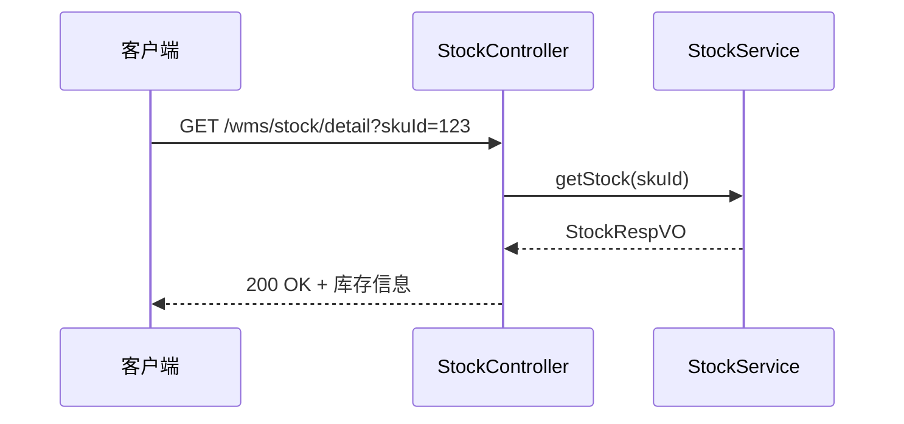
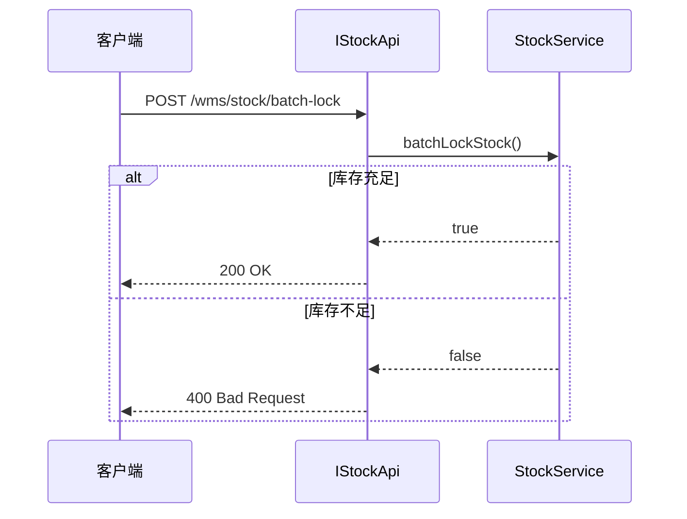
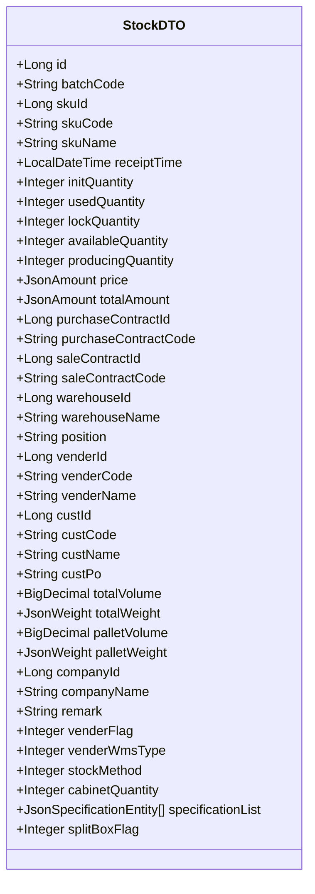

# 库存管理API

<cite>
**本文档引用的文件**
- [IStockApi.java](file://eplus-module-wms/eplus-module-wms-api/src/main/java/com/syj/eplus/module/wms/api/stock/IStockApi.java)
- [StockDTO.java](file://eplus-module-wms/eplus-module-wms-api/src/main/java/com/syj/eplus/module/wms/api/stock/dto/StockDTO.java)
- [StockDetailRespVO.java](file://eplus-module-wms/eplus-module-wms-api/src/main/java/com/syj/eplus/module/wms/api/stock/dto/StockDetailRespVO.java)
- [StockLockRespVO.java](file://eplus-module-wms/eplus-module-wms-api/src/main/java/com/syj/eplus/module/wms/api/stock/dto/StockLockRespVO.java)
- [StockStatusEnum.java](file://eplus-module-wms/eplus-module-wms-api/src/main/java/com/syj/eplus/module/wms/enums/StockStatusEnum.java)
- [StockTypeEnum.java](file://eplus-module-wms/eplus-module-wms-api/src/main/java/com/syj/eplus/module/wms/enums/StockTypeEnum.java)
- [StockSourceTypeEnum.java](file://eplus-module-wms/eplus-module-wms-api/src/main/java/com/syj/eplus/module/wms/enums/StockSourceTypeEnum.java)
- [ErrorCodeConstants.java](file://eplus-module-wms/eplus-module-wms-api/src/main/java/com/syj/eplus/module/wms/enums/ErrorCodeConstants.java)
- [StockController.java](file://eplus-module-wms/eplus-module-wms-biz/src/main/java/com/syj/eplus/module/wms/controller/admin/stock/StockController.java)
</cite>

## 目录
1. [简介](#简介)
2. [核心API接口](#核心api接口)
3. [库存查询接口](#库存查询接口)
4. [库存调整接口](#库存调整接口)
5. [库存锁定接口](#库存锁定接口)
6. [数据模型](#数据模型)
7. [枚举类型](#枚举类型)
8. [错误码字典](#错误码字典)
9. [安全要求](#安全要求)
10. [业务场景示例](#业务场景示例)
11. [开发者指南](#开发者指南)

## 简介
库存管理API提供了一套完整的库存管理功能，包括库存查询、库存调整和库存锁定等核心操作。该系统支持多种库存来源类型，如采购、盘点、调拨和加工单等，能够满足复杂的业务需求。API设计遵循RESTful原则，提供了清晰的端点规范和详细的错误处理机制。

**本节不分析具体源文件**

## 核心API接口
库存管理API主要由三个核心接口组成：库存管理(IStockApi)、入库通知单管理(IStockNoticeApi)和仓库资料管理(IWarehouseApi)。这些接口提供了库存的全生命周期管理功能，从库存创建、查询、调整到锁定和释放。

**本节不分析具体源文件**

## 库存查询接口
库存查询接口提供了多种方式来获取库存信息，包括根据产品编号、销售合同编号、采购合同编号等条件进行查询。

### 获取库存明细
通过产品SKU编号获取库存明细信息。

**接口规范**
- **HTTP动词**: GET
- **URL模式**: /wms/stock/detail
- **参数**: skuId (产品SKU编号)
- **响应结构**: StockRespVO
- **状态码**: 200 (成功), 404 (未找到)



**Diagram sources**
- [StockController.java](file://eplus-module-wms/eplus-module-wms-biz/src/main/java/com/syj/eplus/module/wms/controller/admin/stock/StockController.java#L60-L67)

**Section sources**
- [StockController.java](file://eplus-module-wms/eplus-module-wms-biz/src/main/java/com/syj/eplus/module/wms/controller/admin/stock/StockController.java#L60-L67)

### 批量查询库存
根据产品编号列表批量查询库存信息。

**接口规范**
- **HTTP动词**: POST
- **URL模式**: /wms/stock/list-by-sku-codes
- **请求体**: List<String> skuCodeList
- **响应结构**: List<StockDTO>
- **状态码**: 200 (成功)

**Section sources**
- [IStockApi.java](file://eplus-module-wms/eplus-module-wms-api/src/main/java/com/syj/eplus/module/wms/api/stock/IStockApi.java#L63-L64)

## 库存调整接口
库存调整接口用于处理库存的增减操作，包括采购入库、生产完成入库、加工单出入库等场景。

### 采购合同入库
处理采购合同下单后的入库单和库存处理。

**接口规范**
- **HTTP动词**: POST
- **URL模式**: /wms/stock/after-create-purchase-order
- **请求体**: BillSaveReqVO
- **响应结构**: Boolean
- **状态码**: 200 (成功), 400 (请求参数错误)

**Section sources**
- [IStockApi.java](file://eplus-module-wms/eplus-module-wms-api/src/main/java/com/syj/eplus/module/wms/api/stock/IStockApi.java#L23-L24)

### 生产完成入库
处理采购合同生产完成后的库存转移（供应商在制库存转入库库存）。

**接口规范**
- **HTTP动词**: POST
- **URL模式**: /wms/stock/complete-purchase-order
- **请求体**: 
  - purchaseContractId: 采购合同ID
  - usedQuantityMap: 使用数量映射
  - domesticSaleFlag: 国内销售标志
  - batchCodeList: 批次号列表
- **响应结构**: Boolean
- **状态码**: 200 (成功), 404 (采购合同不存在)

**Section sources**
- [IStockApi.java](file://eplus-module-wms/eplus-module-wms-api/src/main/java/com/syj/eplus/module/wms/api/stock/IStockApi.java#L54-L55)

### 加工单出入库
处理加工单的出入库及库存逻辑，包括子产品出库和主产品入库。

**接口规范**
- **HTTP动词**: POST
- **URL模式**: /wms/stock/handle-manufacture-bill-and-stock
- **请求体**: 
  - childBillSaveReqVO: 子产品入库单
  - billSaveReqVO: 主产品入库单
- **响应结构**: List<String> (批次号列表)
- **状态码**: 200 (成功), 400 (库存不足)

**Section sources**
- [IStockApi.java](file://eplus-module-wms/eplus-module-wms-api/src/main/java/com/syj/eplus/module/wms/api/stock/IStockApi.java#L120-L121)

## 库存锁定接口
库存锁定接口用于管理库存的锁定和释放，确保在业务处理过程中库存数量的准确性。

### 批量锁定库存
批量锁定指定的库存。

**接口规范**
- **HTTP动词**: POST
- **URL模式**: /wms/stock/batch-lock
- **请求体**: List<StockLockSaveReqVO>
- **响应结构**: Boolean
- **状态码**: 200 (成功), 400 (可锁定数量不足)



**Diagram sources**
- [IStockApi.java](file://eplus-module-wms/eplus-module-wms-api/src/main/java/com/syj/eplus/module/wms/api/stock/IStockApi.java#L38-L39)

**Section sources**
- [IStockApi.java](file://eplus-module-wms/eplus-module-wms-api/src/main/java/com/syj/eplus/module/wms/api/stock/IStockApi.java#L38-L39)

### 释放锁定库存
释放之前锁定的库存数量。

**接口规范**
- **HTTP动词**: POST
- **URL模式**: /wms/stock/cancel-lock
- **请求体**: 
  - sourceOrderCode: 原单据单号
  - itemIdList: 明细项ID列表
  - sourceOrderType: 原单据类型
- **响应结构**: Boolean
- **状态码**: 200 (成功), 404 (锁定记录不存在)

**Section sources**
- [IStockApi.java](file://eplus-module-wms/eplus-module-wms-api/src/main/java/com/syj/eplus/module/wms/api/stock/IStockApi.java#L47-L48)

## 数据模型
库存管理API使用了一系列数据传输对象(DTO)来表示库存相关的数据结构。

### StockDTO
表示库存明细的核心数据模型。

**属性说明**
- id: 主键
- batchCode: 批次号
- skuId: 产品主键
- skuCode: 产品编码
- initQuantity: 入库数量
- usedQuantity: 出库数量
- lockQuantity: 锁定数量
- availableQuantity: 可用数量
- receiptTime: 入库时间
- price: 单价
- totalAmount: 总金额



**Diagram sources**
- [StockDTO.java](file://eplus-module-wms/eplus-module-wms-api/src/main/java/com/syj/eplus/module/wms/api/stock/dto/StockDTO.java#L1-L167)

**Section sources**
- [StockDTO.java](file://eplus-module-wms/eplus-module-wms-api/src/main/java/com/syj/eplus/module/wms/api/stock/dto/StockDTO.java#L1-L167)

### StockDetailRespVO
表示库存明细响应的扩展模型，包含更多详细信息。

**Section sources**
- [StockDetailRespVO.java](file://eplus-module-wms/eplus-module-wms-api/src/main/java/com/syj/eplus/module/wms/api/stock/dto/StockDetailRespVO.java#L1-L177)

### StockLockRespVO
表示库存锁定信息的响应模型。

**Section sources**
- [StockLockRespVO.java](file://eplus-module-wms/eplus-module-wms-api/src/main/java/com/syj/eplus/module/wms/api/stock/dto/StockLockRespVO.java#L1-L94)

## 枚举类型
系统定义了多个枚举类型来规范库存相关的状态和类型。

### StockStatusEnum
表示出入库状态的枚举。

**枚举值**
- NOT(1, "未收/出货")
- PART(2, "部分收/出货")
- ALL(3, "完全收/出货")

**业务语义**: 用于标识库存记录的收货或出货完成状态，帮助跟踪物流进度。

**Section sources**
- [StockStatusEnum.java](file://eplus-module-wms/eplus-module-wms-api/src/main/java/com/syj/eplus/module/wms/enums/StockStatusEnum.java#L1-L24)

### StockTypeEnum
表示出入库类型的枚举。

**枚举值**
- IN_STOCK(1, "入库")
- OUT_STOCK(2, "出库")

**业务语义**: 区分库存变动的方向，入库增加库存，出库减少库存。

**Section sources**
- [StockTypeEnum.java](file://eplus-module-wms/eplus-module-wms-api/src/main/java/com/syj/eplus/module/wms/enums/StockTypeEnum.java#L1-L22)

### StockSourceTypeEnum
表示来源单据类型的枚举。

**枚举值**
- PURCHASE(1, "采购")
- STOCK_SURPLUS(2, "盘盈")
- STOCK_LOSS(3, "盘亏")
- ALLOCATION(4, "调拨")
- ASSEMBLE(5, "组套件")
- MANUSACTURE(6, "加工单")
- IMPORT(7, "库存导入")

**业务语义**: 记录库存变动的来源，便于追溯和审计。不同来源类型的库存可能有不同的业务规则和处理流程。

**Section sources**
- [StockSourceTypeEnum.java](file://eplus-module-wms/eplus-module-wms-api/src/main/java/com/syj/eplus/module/wms/enums/StockSourceTypeEnum.java#L1-L24)

## 错误码字典
系统定义了一套完整的错误码体系，用于标准化错误处理。

### 业务异常
- **STOCK_EXCEED (1_006_010_002)**: 库存明细不足，请检查
- **STOCK_LOCK_EXCEED (1_006_011_002)**: 可锁定数量不足，请检查
- **STOCK_NOT_ENOUGH (1_006_016_003)**: 调拨单-库存不足调拨当前数量

**处理建议**: 当遇到库存不足类错误时，应先查询当前库存状态，确认可用数量，然后根据业务需求调整请求数量或等待库存补充。

### 数据不存在
- **STOCK_NOT_EXISTS (1_006_010_001)**: 库存明细不存在
- **STOCK_LOCK_NOT_EXISTS (1_006_011_001)**: 库存明细-占用信息不存在
- **SALE_CONTRACT_NOT_EXITS (1_006_010_003)**: 销售合同不存在

**处理建议**: 检查请求参数是否正确，确认相关业务单据已创建并生效。

### 状态冲突
- **BILL_ITEM_ALL_OUT (1_006_005_002)**: 单据明细均已出库
- **YSBILL_PARENT_MANUFACTURE_BILL_NOT_ENOUGH (1_007_003_004)**: 加工单-父产品数据不全

**处理建议**: 检查业务单据的当前状态，确认是否已处理完成，避免重复操作。

**Section sources**
- [ErrorCodeConstants.java](file://eplus-module-wms/eplus-module-wms-api/src/main/java/com/syj/eplus/module/wms/enums/ErrorCodeConstants.java#L1-L99)

## 安全要求
库存管理API实施了严格的安全控制机制。

### 身份验证
所有API端点都需要有效的身份验证令牌，使用JWT进行身份验证。

### 数据访问权限
基于部门的数据访问权限控制，确保用户只能访问其所属部门的库存数据。

**权限标识**
- wms:stock:create - 创建库存
- wms:stock:update - 更新库存
- wms:stock:delete - 删除库存
- wms:stock:query - 查询库存

**Section sources**
- [StockController.java](file://eplus-module-wms/eplus-module-wms-biz/src/main/java/com/syj/eplus/module/wms/controller/admin/stock/StockController.java#L36-L58)

## 业务场景示例
### 库存盘点场景
处理库存盘点的完整流程。

**请求示例**
```json
{
  "purchaseContractCode": "PC2024001",
  "skuQuantityMap": {
    "SKU001": {
      "skuCode": "SKU001",
      "quantity": 100
    }
  }
}
```

**响应示例**
```json
{
  "code": 200,
  "data": true,
  "msg": "盘点处理成功"
}
```

**Section sources**
- [IStockApi.java](file://eplus-module-wms/eplus-module-wms-api/src/main/java/com/syj/eplus/module/wms/api/stock/IStockApi.java#L194-L195)

### 库存调拨场景
处理库存调拨的完整流程。

**请求示例**
```json
{
  "sourceOrderCode": "SO2024001",
  "itemIdList": [1001, 1002],
  "sourceOrderType": 1
}
```

**响应示例**
```json
{
  "code": 200,
  "data": true,
  "msg": "调拨处理成功"
}
```

**Section sources**
- [IStockApi.java](file://eplus-module-wms/eplus-module-wms-api/src/main/java/com/syj/eplus/module/wms/api/stock/IStockApi.java#L47-L48)

## 开发者指南
### 调用示例
```java
// 创建库存锁定请求
List<StockLockSaveReqVO> lockRequests = new ArrayList<>();
StockLockSaveReqVO lockReq = new StockLockSaveReqVO();
lockReq.setStockId(1001L);
lockReq.setLockQuantity(50);
lockReq.setSourceOrderId(2001L);
lockReq.setSourceOrderType(1);
lockRequests.add(lockReq);

// 调用API
Boolean result = stockApi.batchLockStock(lockRequests);
```

### 集成注意事项
- **事务处理**: 库存操作通常涉及多个数据表的更新，应确保在事务中执行。
- **并发控制**: 在高并发场景下，应对库存记录加锁，防止超卖。
- **幂等性**: 设计API调用时考虑幂等性，避免重复操作导致数据不一致。

**Section sources**
- [IStockApi.java](file://eplus-module-wms/eplus-module-wms-api/src/main/java/com/syj/eplus/module/wms/api/stock/IStockApi.java)