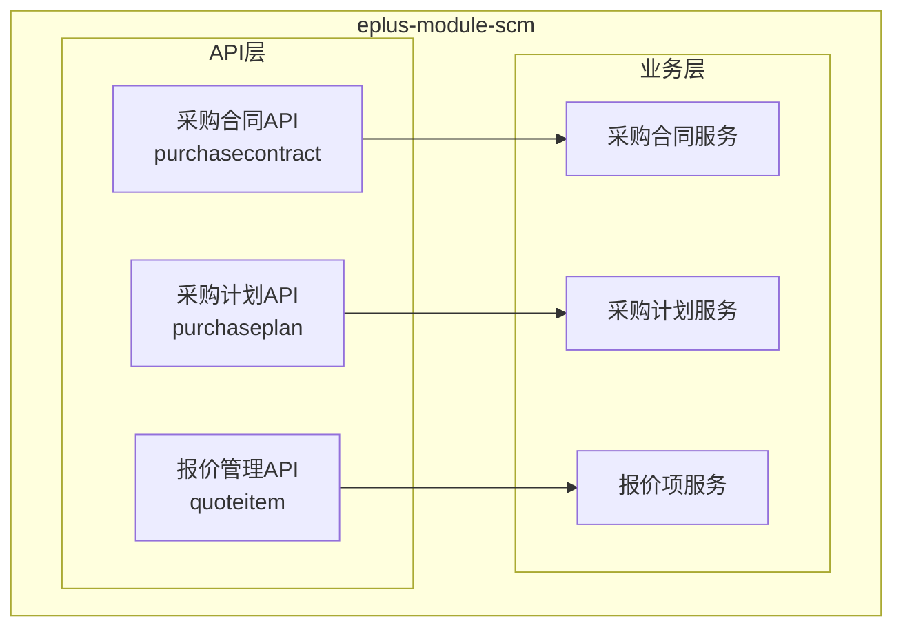
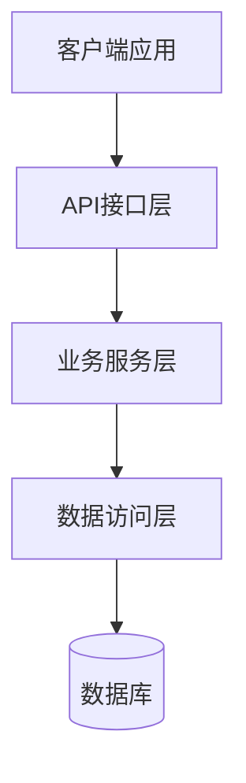
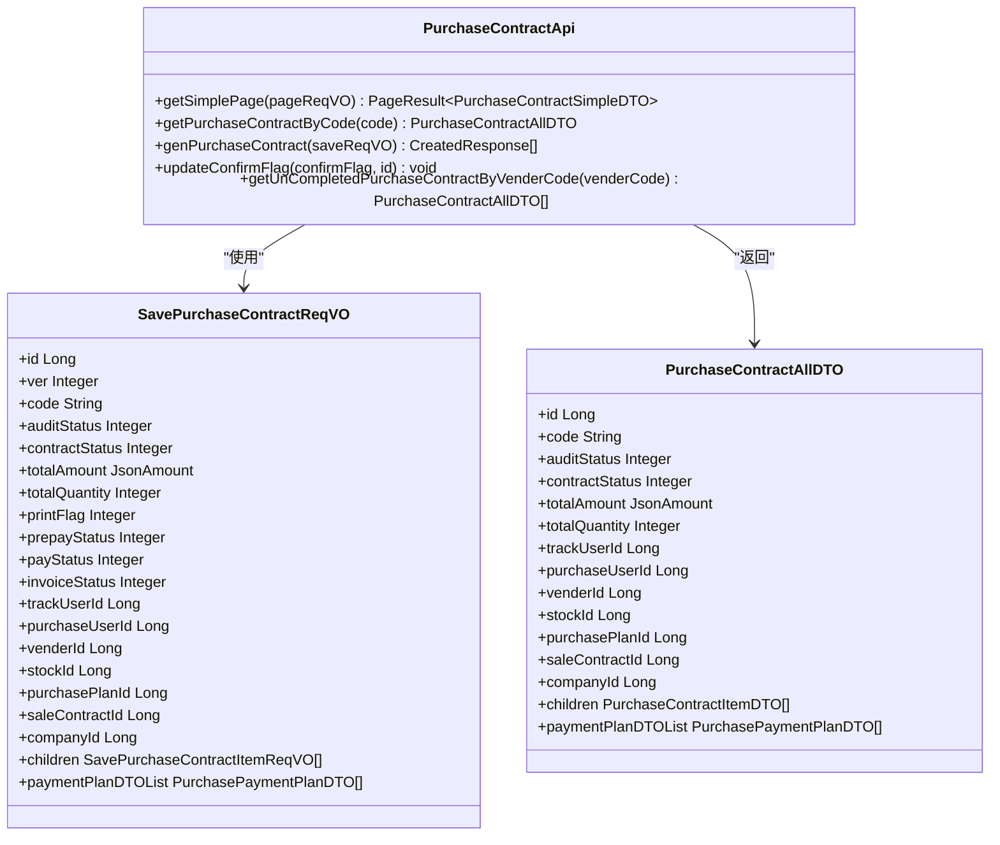
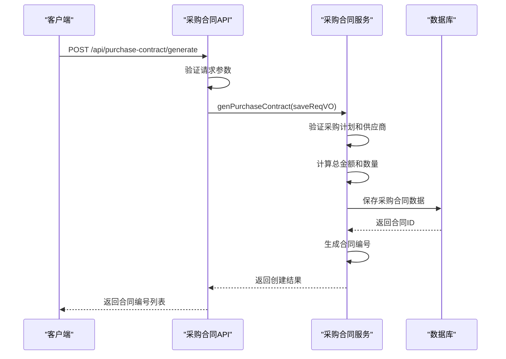
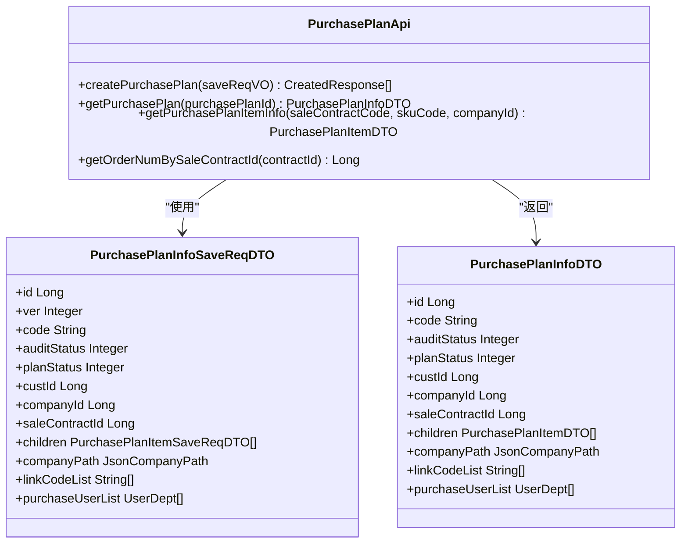
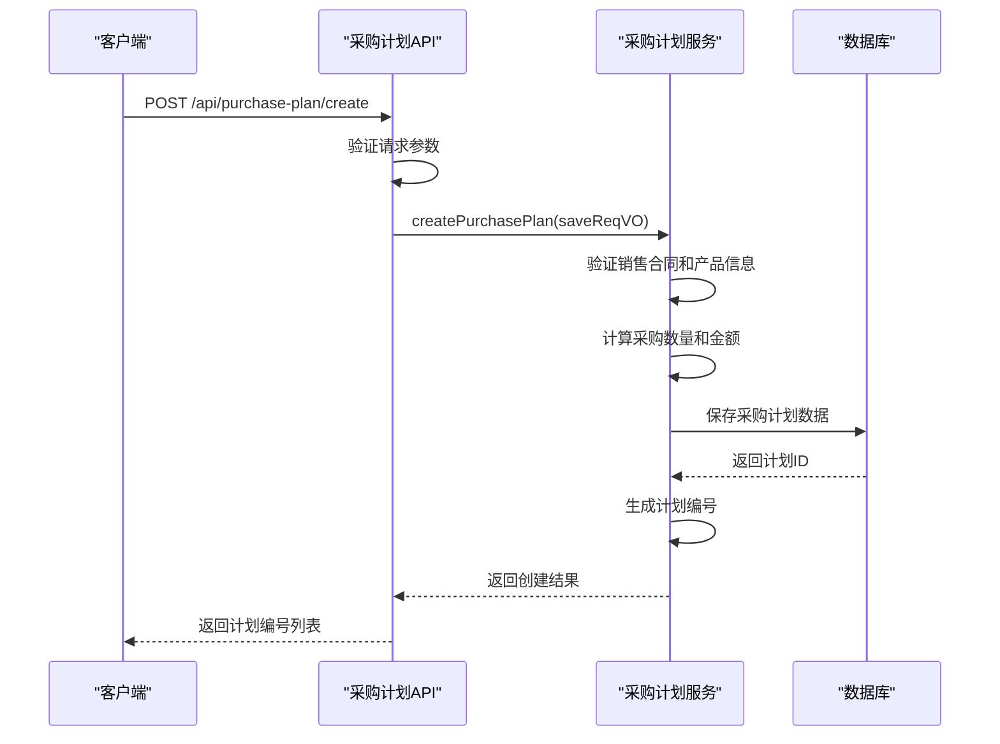
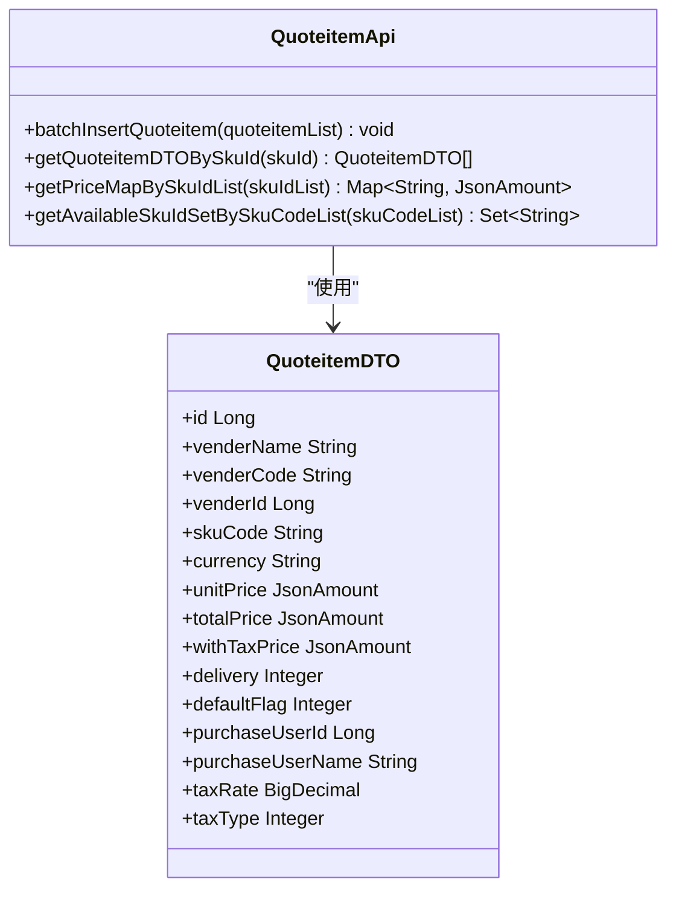
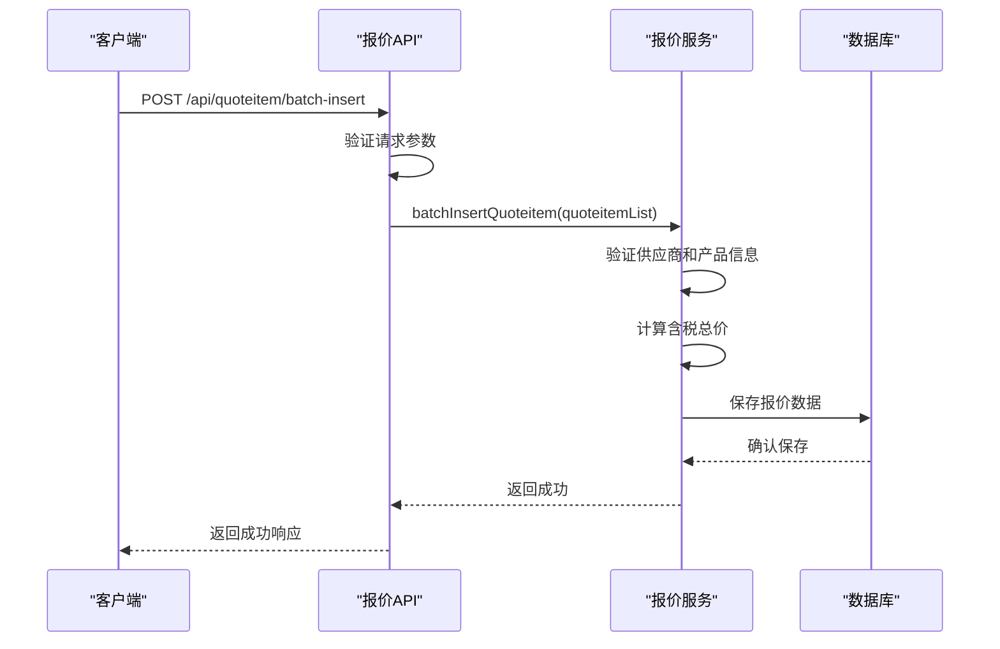
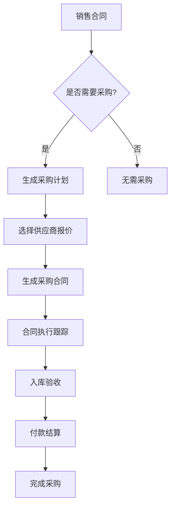

# 供应链管理API

<cite>
**本文档引用的文件**
- [PurchaseContractApi.java](file://eplus-module-scm/eplus-module-scm-api/src/main/java/com/syj/eplus/module/scm/api/purchasecontract/PurchaseContractApi.java)
- [PurchasePlanApi.java](file://eplus-module-scm/eplus-module-scm-api/src/main/java/com/syj/eplus/module/scm/api/purchaseplan/PurchasePlanApi.java)
- [QuoteitemApi.java](file://eplus-module-scm/eplus-module-scm-api/src/main/java/com/syj/eplus/module/scm/api/quoteitem/QuoteitemApi.java)
- [SavePurchaseContractReqVO.java](file://eplus-module-scm/eplus-module-scm-api/src/main/java/com/syj/eplus/module/scm/api/purchasecontract/dto/SavePurchaseContractReqVO.java)
- [PurchasePlanInfoSaveReqDTO.java](file://eplus-module-scm/eplus-module-scm-api/src/main/java/com/syj/eplus/module/scm/api/purchaseplan/dto/PurchasePlanInfoSaveReqDTO.java)
- [QuoteitemDTO.java](file://eplus-module-scm/eplus-module-scm-api/src/main/java/com/syj/eplus/module/scm/api/quoteitem/dto/QuoteitemDTO.java)
- [ErrorCodeConstants.java](file://eplus-module-scm/eplus-module-scm-api/src/main/java/com/syj/eplus/module/scm/enums/ErrorCodeConstants.java)
</cite>

## 目录
1. [简介](#简介)
2. [项目结构](#项目结构)
3. [核心组件](#核心组件)
4. [架构概述](#架构概述)
5. [详细组件分析](#详细组件分析)
6. [依赖分析](#依赖分析)
7. [性能考虑](#性能考虑)
8. [故障排除指南](#故障排除指南)
9. [结论](#结论)
10. [附录](#附录)（如有必要）

## 简介
本文档详细描述了供应链管理模块的API接口，重点涵盖采购合同、采购计划和报价管理等核心功能。文档基于OpenAPI/Swagger规范，为每个RESTful端点提供完整的HTTP方法、URL路径、请求参数、请求体结构、响应格式和状态码说明。同时包含详细的参数说明、实际业务场景的请求/响应示例、认证机制和权限控制要求，以及错误码列表和开发者集成指南。

## 项目结构
供应链管理模块（eplus-module-scm）是企业管理系统中的关键组成部分，主要负责采购合同、采购计划和报价管理等功能。该模块分为API接口层和业务实现层，遵循清晰的分层架构。



**图表来源**
- [PurchaseContractApi.java](file://eplus-module-scm/eplus-module-scm-api/src/main/java/com/syj/eplus/module/scm/api/purchasecontract/PurchaseContractApi.java)
- [PurchasePlanApi.java](file://eplus-module-scm/eplus-module-scm-api/src/main/java/com/syj/eplus/module/scm/api/purchaseplan/PurchasePlanApi.java)
- [QuoteitemApi.java](file://eplus-module-scm/eplus-module-scm-api/src/main/java/com/syj/eplus/module/scm/api/quoteitem/QuoteitemApi.java)

**章节来源**
- [eplus-module-scm](file://eplus-module-scm)

## 核心组件
供应链管理模块的核心组件包括采购合同管理、采购计划管理和报价管理。这些组件通过清晰的API接口对外提供服务，支持企业采购流程的自动化和数字化。

**章节来源**
- [PurchaseContractApi.java](file://eplus-module-scm/eplus-module-scm-api/src/main/java/com/syj/eplus/module/scm/api/purchasecontract/PurchaseContractApi.java)
- [PurchasePlanApi.java](file://eplus-module-scm/eplus-module-scm-api/src/main/java/com/syj/eplus/module/scm/api/purchaseplan/PurchasePlanApi.java)
- [QuoteitemApi.java](file://eplus-module-scm/eplus-module-scm-api/src/main/java/com/syj/eplus/module/scm/api/quoteitem/QuoteitemApi.java)

## 架构概述
供应链管理模块采用典型的分层架构，包括API接口层、业务服务层和数据访问层。API接口层定义了标准化的接口契约，业务服务层实现了核心业务逻辑，数据访问层负责与数据库交互。



**图表来源**
- [PurchaseContractApi.java](file://eplus-module-scm/eplus-module-scm-api/src/main/java/com/syj/eplus/module/scm/api/purchasecontract/PurchaseContractApi.java)
- [PurchasePlanApi.java](file://eplus-module-scm/eplus-module-scm-api/src/main/java/com/syj/eplus/module/scm/api/purchaseplan/PurchasePlanApi.java)
- [QuoteitemApi.java](file://eplus-module-scm/eplus-module-scm-api/src/main/java/com/syj/eplus/module/scm/api/quoteitem/QuoteitemApi.java)

## 详细组件分析
本节详细分析供应链管理模块的各个核心组件，包括其API接口、数据结构和业务逻辑。

### 采购合同管理分析
采购合同管理组件负责采购合同的创建、查询、更新和状态管理。它提供了丰富的API接口来支持采购合同的全生命周期管理。

#### 对象导向组件


**图表来源**
- [PurchaseContractApi.java](file://eplus-module-scm/eplus-module-scm-api/src/main/java/com/syj/eplus/module/scm/api/purchasecontract/PurchaseContractApi.java)
- [SavePurchaseContractReqVO.java](file://eplus-module-scm/eplus-module-scm-api/src/main/java/com/syj/eplus/module/scm/api/purchasecontract/dto/SavePurchaseContractReqVO.java)

#### API/服务组件


**图表来源**
- [PurchaseContractApi.java](file://eplus-module-scm/eplus-module-scm-api/src/main/java/com/syj/eplus/module/scm/api/purchasecontract/PurchaseContractApi.java)
- [PurchaseContractServiceImpl.java](file://eplus-module-scm/eplus-module-scm-biz/src/main/java/com/syj/eplus/module/scm/service/purchasecontract/PurchaseContractServiceImpl.java)

### 采购计划管理分析
采购计划管理组件负责采购计划的创建、查询和状态管理。它与销售合同紧密关联，支持从销售需求到采购计划的自动转换。

#### 对象导向组件


**图表来源**
- [PurchasePlanApi.java](file://eplus-module-scm/eplus-module-scm-api/src/main/java/com/syj/eplus/module/scm/api/purchaseplan/PurchasePlanApi.java)
- [PurchasePlanInfoSaveReqDTO.java](file://eplus-module-scm/eplus-module-scm-api/src/main/java/com/syj/eplus/module/scm/api/purchaseplan/dto/PurchasePlanInfoSaveReqDTO.java)

#### API/服务组件


**图表来源**
- [PurchasePlanApi.java](file://eplus-module-scm/eplus-module-scm-api/src/main/java/com/syj/eplus/module/scm/api/purchaseplan/PurchasePlanApi.java)
- [PurchasePlanServiceImpl.java](file://eplus-module-scm/eplus-module-scm-biz/src/main/java/com/syj/eplus/module/scm/service/purchaseplan/PurchasePlanServiceImpl.java)

### 报价管理分析
报价管理组件负责供应商报价的维护和查询。它支持多供应商报价比较，为采购决策提供数据支持。

#### 对象导向组件


**图表来源**
- [QuoteitemApi.java](file://eplus-module-scm/eplus-module-scm-api/src/main/java/com/syj/eplus/module/scm/api/quoteitem/QuoteitemApi.java)
- [QuoteitemDTO.java](file://eplus-module-scm/eplus-module-scm-api/src/main/java/com/syj/eplus/module/scm/api/quoteitem/dto/QuoteitemDTO.java)

#### API/服务组件


**图表来源**
- [QuoteitemApi.java](file://eplus-module-scm/eplus-module-scm-api/src/main/java/com/syj/eplus/module/scm/api/quoteitem/QuoteitemApi.java)
- [QuoteitemServiceImpl.java](file://eplus-module-scm/eplus-module-scm-biz/src/main/java/com/syj/eplus/module/scm/service/quoteitem/QuoteItemServiceImpl.java)

**章节来源**
- [PurchaseContractApi.java](file://eplus-module-scm/eplus-module-scm-api/src/main/java/com/syj/eplus/module/scm/api/purchasecontract/PurchaseContractApi.java)
- [PurchasePlanApi.java](file://eplus-module-scm/eplus-module-scm-api/src/main/java/com/syj/eplus/module/scm/api/purchaseplan/PurchasePlanApi.java)
- [QuoteitemApi.java](file://eplus-module-scm/eplus-module-scm-api/src/main/java/com/syj/eplus/module/scm/api/quoteitem/QuoteitemApi.java)

### 概念概述
供应链管理模块通过集成采购合同、采购计划和报价管理等功能，实现了从销售需求到采购执行的全流程自动化。系统支持多供应商报价比较、采购计划自动生成、采购合同状态跟踪等核心功能，提高了采购效率和准确性。



## 依赖分析
供应链管理模块与其他多个模块存在依赖关系，形成了完整的业务闭环。

```mermaid
graph TD
SCM["供应链管理模块"]
SMS["销售管理模块"]
WMS["仓库管理模块"]
FMS["财务管理模块"]
DMS["物流管理模块"]
SCM --> SMS : "获取销售合同信息"
SCM --> WMS : "获取仓库信息"
SCM --> FMS : "同步付款信息"
SCM --> DMS : "同步出运信息"
SMS --> SCM : "触发采购计划生成"
WMS --> SCM : "反馈入库状态"
FMS --> SCM : "反馈付款状态"
DMS --> SCM : "反馈出运状态"
```

**图表来源**
- [PurchaseContractApi.java](file://eplus-module-scm/eplus-module-scm-api/src/main/java/com/syj/eplus/module/scm/api/purchasecontract/PurchaseContractApi.java)
- [PurchasePlanApi.java](file://eplus-module-scm/eplus-module-scm-api/src/main/java/com/syj/eplus/module/scm/api/purchaseplan/PurchasePlanApi.java)

**章节来源**
- [eplus-module-scm](file://eplus-module-scm)

## 性能考虑
供应链管理模块在设计时充分考虑了性能因素，采用了多种优化策略：

1. **缓存机制**：对常用的采购合同、采购计划和报价信息进行缓存，减少数据库查询次数。
2. **批量处理**：支持批量插入、更新和查询操作，提高数据处理效率。
3. **分页查询**：对大量数据的查询操作支持分页，避免一次性加载过多数据。
4. **异步处理**：对于耗时较长的操作（如合同生成、计划创建）采用异步处理，提高响应速度。
5. **索引优化**：在关键字段上建立数据库索引，加快查询速度。

## 故障排除指南
本节提供常见问题的解决方案和错误码说明。

### 错误码列表
| 错误码 | 业务含义 | 解决方案 |
|--------|---------|---------|
| 1-003-002-001 | 采购合同不存在 | 检查合同编号是否正确 |
| 1-003-002-002 | 采购计划明细不存在 | 检查计划明细ID是否正确 |
| 1-003-002-003 | 采购计划不存在 | 检查计划ID是否正确 |
| 1-003-002-004 | 采购合同明细不存在 | 检查合同明细ID是否正确 |
| 1-003-002-005 | 采购计划创建失败 | 检查输入数据是否完整 |
| 1-003-002-006 | 采购计划-商品为空 | 确保计划中包含商品信息 |
| 1-003-002-007 | 采购计划-用户数据错误 | 检查用户信息是否正确 |
| 1-003-002-008 | 无效的银行账户 | 检查银行账户信息是否正确 |
| 1-003-002-009 | 产品列表不能为空 | 确保产品列表不为空 |
| 1-003-002-010 | 采购合同明细已出运 | 检查合同状态是否允许修改 |

**章节来源**
- [ErrorCodeConstants.java](file://eplus-module-scm/eplus-module-scm-api/src/main/java/com/syj/eplus/module/scm/enums/ErrorCodeConstants.java)

## 结论
供应链管理模块提供了完整的采购管理解决方案，通过标准化的API接口支持采购合同、采购计划和报价管理等核心功能。系统设计考虑了性能、可靠性和可扩展性，能够满足企业复杂的采购管理需求。建议开发者在集成时遵循文档中的规范，充分利用提供的API接口和工具，确保系统的稳定运行。