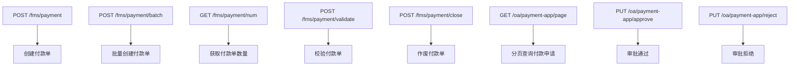
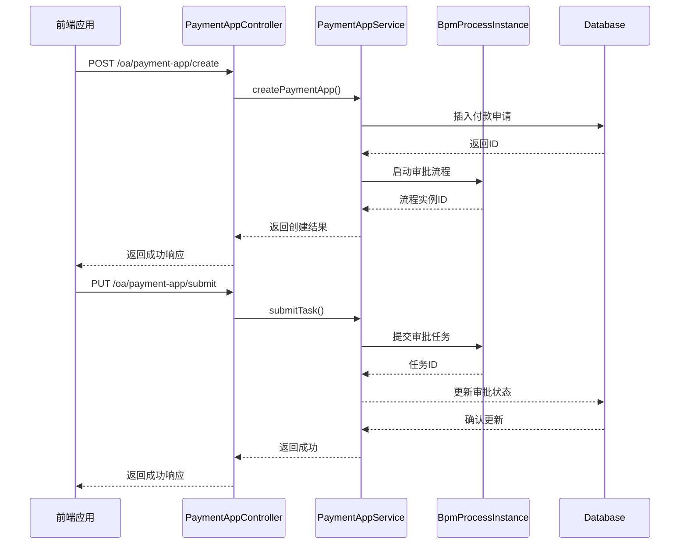
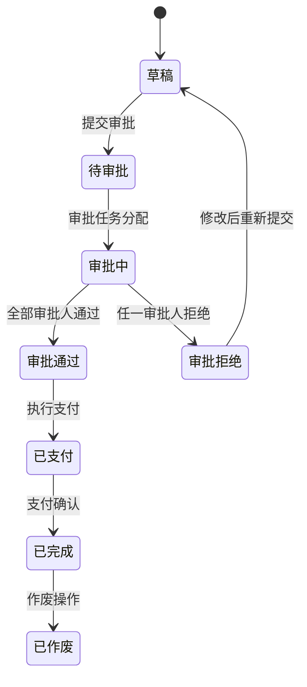
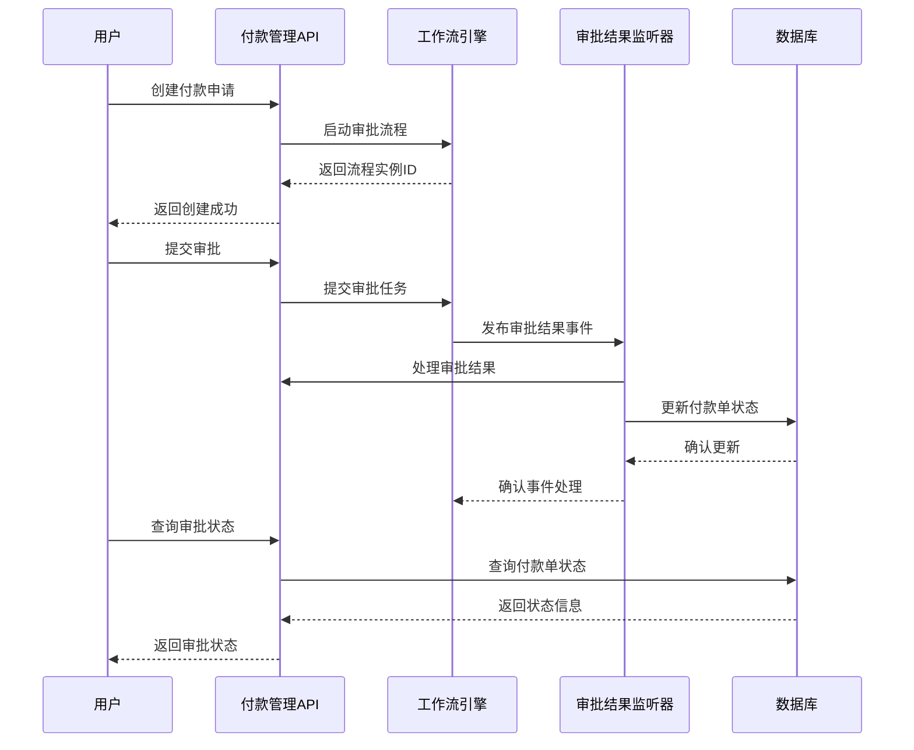
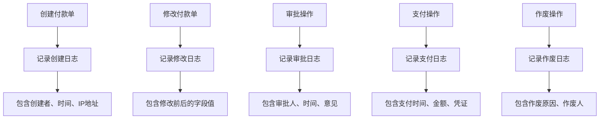
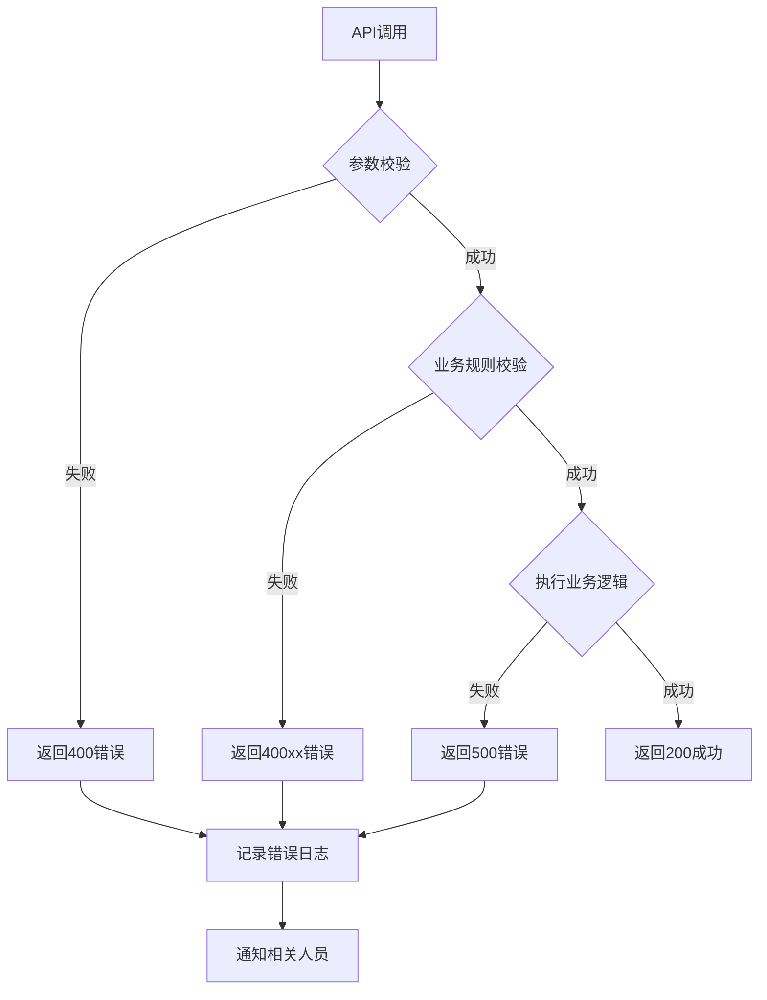

# 付款管理API

<cite>
**本文档引用文件**  
- [PaymentApi.java](file://eplus-module-fms/eplus-module-fms-api/src/main/java/com/syj/eplus/module/fms/api/payment/api/payment/PaymentApi.java)
- [PaymentApiImpl.java](file://eplus-module-fms/eplus-module-fms-biz/src/main/java/com/syj/eplus/module/fms/api/payment/PaymentApiImpl.java)
- [PaymentAppController.java](file://eplus-module-oa/eplus-module-oa-biz/src/main/java/com/syj/eplus/module/oa/controller/admin/paymentapp/PaymentAppController.java)
- [PaymentAppDTO.java](file://eplus-framework/eplus-common/src/main/java/com/syj/eplus/framework/common/entity/PaymentAppDTO.java)
- [PaymentSaveDTO.java](file://eplus-module-fms/eplus-module-fms-api/src/main/java/com/syj/eplus/module/fms/api/payment/api/payment/dto/PaymentSaveDTO.java)
- [PaymentDTO.java](file://eplus-module-fms/eplus-module-fms-api/src/main/java/com/syj/eplus/module/fms/api/payment/api/payment/dto/PaymentDTO.java)
- [ClosePaymentDTO.java](file://eplus-module-fms/eplus-module-fms-api/src/main/java/com/syj/eplus/module/fms/api/payment/api/payment/dto/ClosePaymentDTO.java)
- [SimplePaymentAppResp.java](file://eplus-module-oa/eplus-module-oa-biz/src/main/java/com/syj/eplus/module/oa/controller/admin/paymentapp/vo/SimplePaymentAppResp.java)
- [ErrorCodeConstants.java](file://eplus-module-fms/eplus-module-fms-api/src/main/java/com/syj/eplus/module/fms/api/payment/enums/ErrorCodeConstants.java)
- [BpmProcessInstanceResultEventPublisher.java](file://yudao-module-bpm/yudao-module-bpm-biz/src/main/java/cn/iocoder/yudao/module/bpm/framework/bpm/core/event/BpmProcessInstanceResultEventPublisher.java)
</cite>

## 目录
1. [简介](#简介)
2. [核心API接口](#核心api接口)
3. [付款请求体结构](#付款请求体结构)
4. [响应结构与示例](#响应结构与示例)
5. [审批流程集成](#审批流程集成)
6. [审计日志与数据一致性](#审计日志与数据一致性)
7. [异常处理](#异常处理)
8. [最佳实践](#最佳实践)

## 简介

付款管理API提供了一套完整的财务付款单创建、审批、支付状态更新和作废功能。该系统与工作流引擎深度集成，支持多业务场景的付款需求，包括采购合同付款、供应商付款等。API设计遵循RESTful规范，通过清晰的接口定义和数据结构确保财务数据的准确性和一致性。

**本文档引用文件**  
- [PaymentApi.java](file://eplus-module-fms/eplus-module-fms-api/src/main/java/com/syj/eplus/module/fms/api/payment/api/payment/PaymentApi.java)
- [PaymentAppController.java](file://eplus-module-oa/eplus-module-oa-biz/src/main/java/com/syj/eplus/module/oa/controller/admin/paymentapp/PaymentAppController.java)

## 核心API接口

付款管理API提供了创建、查询、验证和作废付款单的核心功能。以下是主要HTTP接口的详细说明：



**接口说明表**

| 接口名称 | HTTP方法 | URL路径 | 功能描述 |
|---------|---------|--------|--------|
| 创建付款单 | POST | /fms/payment | 创建单个付款单 |
| 批量创建付款单 | POST | /fms/payment/batch | 批量创建多个付款单 |
| 获取付款单数量 | GET | /fms/payment/num | 根据业务类型和编号获取付款单数量 |
| 校验付款单 | POST | /fms/payment/validate | 验证付款单的合法性 |
| 作废付款单 | POST | /fms/payment/close | 作废指定的付款单 |
| 分页查询 | GET | /oa/payment-app/page | 分页获取付款申请列表 |
| 审批通过 | PUT | /oa/payment-app/approve | 审批通过付款申请 |
| 审批拒绝 | PUT | /oa/payment-app/reject | 审批拒绝付款申请 |

**接口调用流程图**



**接口来源**
- [PaymentApi.java](file://eplus-module-fms/eplus-module-fms-api/src/main/java/com/syj/eplus/module/fms/api/payment/api/payment/PaymentApi.java#L10-L40)
- [PaymentAppController.java](file://eplus-module-oa/eplus-module-oa-biz/src/main/java/com/syj/eplus/module/oa/controller/admin/paymentapp/PaymentAppController.java#L38-L199)

## 付款请求体结构

付款请求体使用`PaymentSaveDTO`数据传输对象，包含完整的付款信息。以下是JSON Schema定义：

```json
{
  "type": "object",
  "properties": {
    "companyId": {
      "type": "integer",
      "description": "内部法人单位ID",
      "example": 1001
    },
    "bank": {
      "type": "string",
      "description": "开户行名称",
      "example": "中国银行"
    },
    "bankAccount": {
      "type": "string",
      "description": "银行账号",
      "example": "1234567890123456"
    },
    "bankAddress": {
      "type": "string",
      "description": "开户行地址",
      "example": "北京市朝阳区XX路XX号"
    },
    "bankPoc": {
      "type": "string",
      "description": "开户行联系人",
      "example": "张三"
    },
    "bankCode": {
      "type": "string",
      "description": "银行行号",
      "example": "BKCHCNBJ"
    },
    "amount": {
      "type": "object",
      "description": "支付金额",
      "properties": {
        "currency": {
          "type": "string",
          "description": "币种",
          "example": "CNY"
        },
        "value": {
          "type": "number",
          "description": "金额值",
          "example": 10000.00
        }
      }
    },
    "date": {
      "type": "string",
      "format": "date-time",
      "description": "支付日期",
      "example": "2024-01-15T10:30:00"
    },
    "cashierId": {
      "type": "integer",
      "description": "出纳员ID",
      "example": 2001
    },
    "remark": {
      "type": "string",
      "description": "备注",
      "example": "采购合同付款"
    },
    "businessType": {
      "type": "integer",
      "description": "业务类型",
      "enum": [1, 2, 3],
      "example": 1
    },
    "businessCode": {
      "type": "string",
      "description": "业务编号",
      "example": "PO20240001"
    },
    "businessSubjectType": {
      "type": "integer",
      "description": "支付对象类型",
      "enum": [1, 2],
      "example": 1
    },
    "businessSubjectCode": {
      "type": "string",
      "description": "支付对象编号",
      "example": "V001"
    },
    "applyer": {
      "type": "object",
      "description": "申请人",
      "properties": {
        "id": {
          "type": "integer",
          "example": 3001
        },
        "name": {
          "type": "string",
          "example": "李四"
        },
        "deptId": {
          "type": "integer",
          "example": 4001
        }
      }
    },
    "paymentMethod": {
      "type": "integer",
      "description": "支付方式",
      "enum": [1, 2, 3, 4],
      "example": 1
    },
    "applyPaymentDate": {
      "type": "string",
      "format": "date-time",
      "description": "申请付款日期",
      "example": "2024-01-10T09:00:00"
    },
    "applyCode": {
      "type": "string",
      "description": "申请单编号",
      "example": "APP20240001"
    },
    "targetBank": {
      "type": "string",
      "description": "对方银行",
      "example": "工商银行"
    },
    "targetBankAccount": {
      "type": "string",
      "description": "对方账户",
      "example": "9876543210987654"
    },
    "targetBankPoc": {
      "type": "string",
      "description": "对方账号",
      "example": "王五"
    },
    "linkCodeList": {
      "type": "array",
      "items": {
        "type": "string"
      },
      "description": "链路编号列表",
      "example": ["LINK001", "LINK002"]
    }
  },
  "required": ["companyId", "bank", "bankAccount", "amount", "businessType", "businessCode", "businessSubjectType", "businessSubjectCode"]
}
```

**字段业务含义说明**

| 字段名 | 数据类型 | 是否必填 | 业务含义 | 数据约束 |
|-------|--------|--------|--------|--------|
| companyId | Long | 是 | 内部法人单位ID | 必须存在于系统中 |
| bank | String | 是 | 开户行名称 | 最大长度100字符 |
| bankAccount | String | 是 | 银行账号 | 必须符合银行账号格式 |
| amount | JsonAmount | 是 | 支付金额 | 必须大于0 |
| businessType | Integer | 是 | 业务类型 | 1:采购合同, 2:销售合同, 3:其他 |
| businessCode | String | 是 | 业务编号 | 关联的业务单据编号 |
| businessSubjectType | Integer | 是 | 支付对象类型 | 1:供应商, 2:客户 |
| businessSubjectCode | String | 是 | 支付对象编号 | 必须存在于供应商/客户档案中 |
| paymentMethod | Integer | 否 | 支付方式 | 1:电汇, 2:支票, 3:现金, 4:承兑汇票 |
| applyPaymentDate | LocalDateTime | 否 | 申请付款日期 | 不能早于当前日期 |

**请求体来源**
- [PaymentSaveDTO.java](file://eplus-module-fms/eplus-module-fms-api/src/main/java/com/syj/eplus/module/fms/api/payment/api/payment/dto/PaymentSaveDTO.java#L1-L158)
- [PaymentDTO.java](file://eplus-module-fms/eplus-module-fms-api/src/main/java/com/syj/eplus/module/fms/api/payment/api/payment/dto/PaymentDTO.java#L1-L189)

## 响应结构与示例

API响应遵循统一的格式，包含状态码、消息和数据体。以下是成功和异常情况的响应示例。

**成功响应示例**

```json
{
  "code": 0,
  "msg": "成功",
  "data": {
    "id": 5001,
    "code": "PAY20240001",
    "status": 0,
    "amount": {
      "currency": "CNY",
      "value": 10000.00
    },
    "date": "2024-01-15T10:30:00",
    "businessCode": "PO20240001",
    "auditStatus": 1
  }
}
```

**余额不足异常响应**

```json
{
  "code": 40001,
  "msg": "账户余额不足，无法完成支付",
  "data": null
}
```

**审批未通过响应**

```json
{
  "code": 40002,
  "msg": "付款申请审批未通过",
  "data": {
    "rejectReason": "合同金额与付款金额不匹配",
    "approver": {
      "id": 3002,
      "name": "财务经理",
      "deptId": 4002
    },
    "approvalTime": "2024-01-12T14:20:00"
  }
}
```

**参数校验失败响应**

```json
{
  "code": 400,
  "msg": "参数校验失败",
  "data": {
    "errors": [
      {
        "field": "amount.value",
        "message": "支付金额必须大于0"
      },
      {
        "field": "bankAccount",
        "message": "银行账号格式不正确"
      }
    ]
  }
}
```

**响应结构说明**

| 字段名 | 数据类型 | 说明 |
|-------|--------|------|
| code | Integer | 响应码，0表示成功，非0表示失败 |
| msg | String | 响应消息，描述操作结果 |
| data | Object | 响应数据体，包含具体业务数据 |

**响应来源**
- [PaymentAppDTO.java](file://eplus-framework/eplus-common/src/main/java/com/syj/eplus/framework/common/entity/PaymentAppDTO.java#L1-L46)
- [SimplePaymentAppResp.java](file://eplus-module-oa/eplus-module-oa-biz/src/main/java/com/syj/eplus/module/oa/controller/admin/paymentapp/vo/SimplePaymentAppResp.java#L1-L68)

## 审批流程集成

付款管理API与工作流引擎深度集成，实现了完整的审批流程管理。当创建付款申请后，系统会自动启动预定义的审批流程。



**审批流程接口**



**审批状态转换规则**

| 当前状态 | 触发操作 | 目标状态 | 条件 |
|---------|---------|--------|------|
| 草稿 | 提交审批 | 待审批 | 申请人提交 |
| 待审批 | 审批通过 | 审批中 | 第一个审批人通过 |
| 审批中 | 审批通过 | 审批通过 | 所有审批人通过 |
| 审批中 | 审批拒绝 | 审批拒绝 | 任一审批人拒绝 |
| 审批通过 | 执行支付 | 已支付 | 财务人员执行支付 |
| 已支付 | 支付确认 | 已完成 | 支付结果确认 |
| 任意状态 | 作废操作 | 已作废 | 管理员或申请人作废 |

**审批集成来源**
- [PaymentAppController.java](file://eplus-module-oa/eplus-module-oa-biz/src/main/java/com/syj/eplus/module/oa/controller/admin/paymentapp/PaymentAppController.java#L115-L129)
- [BpmProcessInstanceResultEventPublisher.java](file://yudao-module-bpm/yudao-module-bpm-biz/src/main/java/cn/iocoder/yudao/module/bpm/framework/bpm/core/event/BpmProcessInstanceResultEventPublisher.java#L1-L19)

## 审计日志与数据一致性

系统通过多种机制确保付款操作的审计追踪和数据一致性。

**审计日志记录机制**



**数据一致性保障**

系统通过以下机制确保财务数据的一致性：

1. **事务管理**：所有付款相关操作都在数据库事务中执行
2. **幂等性设计**：关键接口支持幂等操作，防止重复提交
3. **并发控制**：使用乐观锁机制防止并发修改冲突
4. **数据校验**：在多个层级进行数据完整性校验

**审计字段说明**

| 字段名 | 说明 |
|-------|------|
| creator | 创建者 |
| create_time | 创建时间 |
| updater | 更新者 |
| update_time | 更新时间 |
| deleted | 是否删除（软删除标志） |
| tenant_id | 租户编号（多租户支持） |

**审计日志来源**
- [V1_0_0_001__框架初始化.sql](file://eplus-flyway/src/main/resources/db/migration/common/V1_0_0_001__框架初始化.sql#L642-L649)
- [bpm.sql](file://sql/mysql/bpm.sql#L122-L127)

## 异常处理

系统定义了完整的错误码体系，用于处理各种异常情况。

**错误码说明表**

| 错误码 | 错误消息 | 说明 | 建议处理方式 |
|-------|--------|------|------------|
| 40001 | 账户余额不足 | 支付账户余额不足以完成支付 | 检查账户余额，调整支付金额 |
| 40002 | 审批未通过 | 付款申请未通过审批流程 | 查看审批意见，修改后重新提交 |
| 40003 | 业务单据不存在 | 关联的业务单据不存在 | 检查业务编号是否正确 |
| 40004 | 支付对象不存在 | 供应商或客户信息不存在 | 检查支付对象编号 |
| 40005 | 重复付款 | 该业务单据已存在付款记录 | 检查是否已创建过付款单 |
| 40006 | 金额超限 | 支付金额超过审批额度 | 分拆支付或申请特殊审批 |
| 40007 | 支付方式不支持 | 选择的支付方式不被支持 | 选择系统支持的支付方式 |
| 40008 | 银行信息不完整 | 开户行信息不完整 | 补充完整的银行信息 |

**异常处理流程**



**异常处理来源**
- [ErrorCodeConstants.java](file://eplus-module-fms/eplus-module-fms-api/src/main/java/com/syj/eplus/module/fms/api/payment/enums/ErrorCodeConstants.java)
- [GlobalErrorCodeConstants.java](file://yudao-framework/yudao-common/src/main/java/cn/iocoder/yudao/framework/common/exception/enums/GlobalErrorCodeConstants.java)

## 最佳实践

### 幂等性处理

为防止网络重试导致的重复创建，建议在客户端实现幂等性控制：

1. **使用唯一请求ID**：每次请求携带唯一的`requestId`
2. **服务端幂等校验**：服务端根据`requestId`判断是否已处理过该请求
3. **缓存处理结果**：将处理结果缓存一段时间，避免重复处理

### 并发控制

在高并发场景下，建议采用以下策略：

1. **乐观锁机制**：在更新付款单时使用版本号控制
2. **分布式锁**：对关键资源使用Redis分布式锁
3. **队列处理**：将支付请求放入消息队列异步处理

### 财务数据一致性

为确保财务数据的准确性，建议：

1. **双重校验**：在应用层和数据库层都进行数据校验
2. **定期对账**：与银行系统定期对账，确保数据一致
3. **操作留痕**：所有关键操作都记录详细的审计日志
4. **权限控制**：严格控制付款相关操作的权限

### 性能优化建议

1. **批量操作**：对于大量付款单创建，使用批量接口
2. **分页查询**：查询付款单列表时使用分页，避免一次性加载过多数据
3. **缓存热点数据**：对常用的供应商、银行信息进行缓存
4. **异步处理**：将审批结果通知等非关键操作异步化

**最佳实践来源**
- [PaymentApi.java](file://eplus-module-fms/eplus-module-fms-api/src/main/java/com/syj/eplus/module/fms/api/payment/api/payment/PaymentApi.java)
- [PaymentAppController.java](file://eplus-module-oa/eplus-module-oa-biz/src/main/java/com/syj/eplus/module/oa/controller/admin/paymentapp/PaymentAppController.java)