# 客户认领API

<cite>
**本文档引用文件**  
- [CustClaimController.java](file://eplus-module-fms/eplus-module-fms-biz/src/main/java/com/syj/eplus/module/fms/controller/admin/custclaim/CustClaimController.java)
- [CustClaimServiceImpl.java](file://eplus-module-fms/eplus-module-fms-biz/src/main/java/com/syj/eplus/module/fms/service/custclaim/CustClaimServiceImpl.java)
- [CustClaimItem.java](file://eplus-module-fms/eplus-module-fms-biz/src/main/java/com/syj/eplus/module/fms/dal/dataobject/custclaim/CustClaimItem.java)
- [CustClaimSaveReqVO.java](file://eplus-module-fms/eplus-module-fms-biz/src/main/java/com/syj/eplus/module/fms/controller/admin/custclaim/vo/CustClaimSaveReqVO.java)
- [CustClaimDTO.java](file://eplus-module-fms/eplus-module-fms-api/src/main/java/com/syj/eplus/module/fms/api/payment/api/custclaim/dto/CustClaimDTO.java)
- [CustClaimItemMapper.java](file://eplus-module-fms/eplus-module-fms-biz/src/main/java/com/syj/eplus/module/fms/dal/mysql/custclaim/CustClaimItemMapper.java)
- [SimpleRegistrationResp.java](file://eplus-module-fms/eplus-module-fms-biz/src/main/java/com/syj/eplus/module/fms/controller/admin/bankregistration/vo/SimpleRegistrationResp.java)
- [BankRegistrationMapper.java](file://eplus-module-fms/eplus-module-fms-biz/src/main/java/com/syj/eplus/module/fms/dal/mysql/bankregistration/BankRegistrationMapper.java)
</cite>

## 目录
1. [简介](#简介)
2. [核心组件](#核心组件)
3. [客户认领API接口](#客户认领api接口)
4. [认领明细核心字段](#认领明细核心字段)
5. [多对多认领场景示例](#多对多认领场景示例)
6. [财务报表影响](#财务报表影响)
7. [与银行对账模块的协同](#与银行对账模块的协同)
8. [认领冲突与冲销处理](#认领冲突与冲销处理)
9. [结论](#结论)

## 简介

客户认领API是财务管理系统中的核心模块，负责处理客户付款与应收账款的匹配逻辑。该API实现了客户付款的认领、修改、删除和查询功能，支持复杂的多对多认领场景，并与银行对账模块紧密集成。系统通过认领操作实现财务数据的实时更新，确保应收账款余额的准确性。

**本文档引用文件**
- [CustClaimController.java](file://eplus-module-fms/eplus-module-fms-biz/src/main/java/com/syj/eplus/module/fms/controller/admin/custclaim/CustClaimController.java#L1-L87)
- [CustClaimServiceImpl.java](file://eplus-module-fms/eplus-module-fms-biz/src/main/java/com/syj/eplus/module/fms/service/custclaim/CustClaimServiceImpl.java#L1-L480)

## 核心组件

客户认领功能由多个核心组件构成，包括控制器、服务实现、数据对象和Mapper。控制器负责接收HTTP请求并返回响应，服务实现包含业务逻辑，数据对象定义了数据结构，Mapper负责数据库操作。

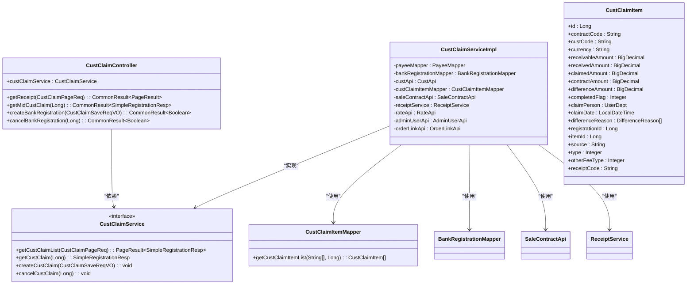

**图表来源**
- [CustClaimController.java](file://eplus-module-fms/eplus-module-fms-biz/src/main/java/com/syj/eplus/module/fms/controller/admin/custclaim/CustClaimController.java#L1-L87)
- [CustClaimServiceImpl.java](file://eplus-module-fms/eplus-module-fms-biz/src/main/java/com/syj/eplus/module/fms/service/custclaim/CustClaimServiceImpl.java#L1-L480)
- [CustClaimItem.java](file://eplus-module-fms/eplus-module-fms-biz/src/main/java/com/syj/eplus/module/fms/dal/dataobject/custclaim/CustClaimItem.java#L1-L182)
- [CustClaimItemMapper.java](file://eplus-module-fms/eplus-module-fms-biz/src/main/java/com/syj/eplus/module/fms/dal/mysql/custclaim/CustClaimItemMapper.java#L1-L92)

**本节来源**
- [CustClaimController.java](file://eplus-module-fms/eplus-module-fms-biz/src/main/java/com/syj/eplus/module/fms/controller/admin/custclaim/CustClaimController.java#L1-L87)
- [CustClaimServiceImpl.java](file://eplus-module-fms/eplus-module-fms-biz/src/main/java/com/syj/eplus/module/fms/service/custclaim/CustClaimServiceImpl.java#L1-L480)
- [CustClaimItem.java](file://eplus-module-fms/eplus-module-fms-biz/src/main/java/com/syj/eplus/module/fms/dal/dataobject/custclaim/CustClaimItem.java#L1-L182)

## 客户认领API接口

客户认领API提供了一组RESTful接口，用于管理客户认领操作。这些接口支持创建、查询、取消认领等操作，确保客户付款能够正确匹配到相应的应收账款。

### 创建认领接口

创建认领接口用于将客户付款与应收账款进行匹配。该接口接收认领请求数据，执行认领逻辑，并返回操作结果。

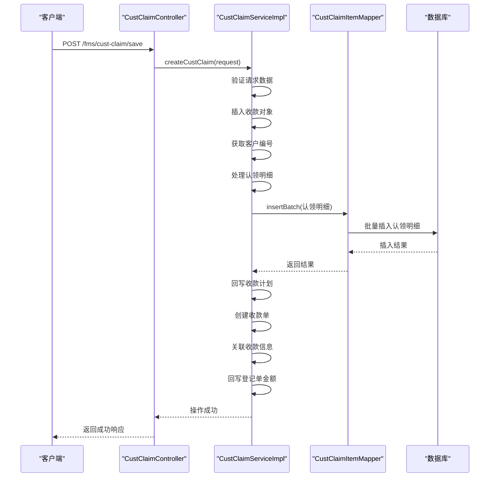

**图表来源**
- [CustClaimController.java](file://eplus-module-fms/eplus-module-fms-biz/src/main/java/com/syj/eplus/module/fms/controller/admin/custclaim/CustClaimController.java#L54-L60)
- [CustClaimServiceImpl.java](file://eplus-module-fms/eplus-module-fms-biz/src/main/java/com/syj/eplus/module/fms/service/custclaim/CustClaimServiceImpl.java#L218-L307)

### 查询认领列表接口

查询认领列表接口用于获取客户认领的分页列表。该接口支持多种查询条件，包括客户名称、公司抬头、认领状态等。

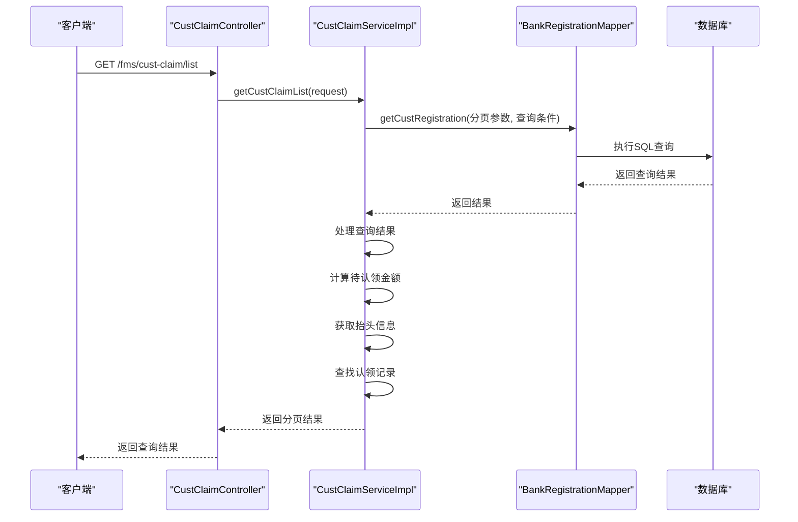

**图表来源**
- [CustClaimController.java](file://eplus-module-fms/eplus-module-fms-biz/src/main/java/com/syj/eplus/module/fms/controller/admin/custclaim/CustClaimController.java#L37-L43)
- [CustClaimServiceImpl.java](file://eplus-module-fms/eplus-module-fms-biz/src/main/java/com/syj/eplus/module/fms/service/custclaim/CustClaimServiceImpl.java#L84-L97)
- [BankRegistrationMapper.java](file://eplus-module-fms/eplus-module-fms-biz/src/main/java/com/syj/eplus/module/fms/dal/mysql/bankregistration/BankRegistrationMapper.java#L46-L162)

### 取消认领接口

取消认领接口用于撤销已创建的认领操作。该接口会删除相关的认领记录，并回滚相应的财务数据。

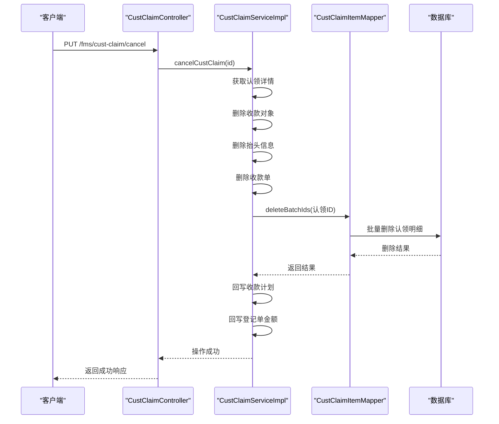

**图表来源**
- [CustClaimController.java](file://eplus-module-fms/eplus-module-fms-biz/src/main/java/com/syj/eplus/module/fms/controller/admin/custclaim/CustClaimController.java#L62-L68)
- [CustClaimServiceImpl.java](file://eplus-module-fms/eplus-module-fms-biz/src/main/java/com/syj/eplus/module/fms/service/custclaim/CustClaimServiceImpl.java#L351-L384)

**本节来源**
- [CustClaimController.java](file://eplus-module-fms/eplus-module-fms-biz/src/main/java/com/syj/eplus/module/fms/controller/admin/custclaim/CustClaimController.java#L37-L87)
- [CustClaimServiceImpl.java](file://eplus-module-fms/eplus-module-fms-biz/src/main/java/com/syj/eplus/module/fms/service/custclaim/CustClaimServiceImpl.java#L84-L384)

## 认领明细核心字段

客户认领明细包含多个核心字段，这些字段定义了认领操作的关键信息和业务规则。

### 核心字段定义

| 字段名称 | 字段类型 | 说明 | 业务规则 |
|---------|--------|------|---------|
| contractCode | String | 订单合同号 | 必填，关联销售合同 |
| custCode | String | 客户编号 | 必填，标识客户 |
| currency | String | 订单币别 | 必填，与合同一致 |
| receivableAmount | BigDecimal | 应收金额 | 只读，从合同获取 |
| receivedAmount | BigDecimal | 已收金额 | 只读，累计已认领金额 |
| claimedAmount | BigDecimal | 本次入账币种认领金额 | 必填，本次认领金额 |
| contractAmount | BigDecimal | 订单币种认领金额 | 计算字段，按汇率转换 |
| differenceAmount | BigDecimal | 差异总金额 | 计算字段，应收与认领差额 |
| completedFlag | Integer | 收款完成标识 | 0-未完成，1-已完成 |
| claimPerson | UserDept | 认领员工 | 自动填充，当前用户 |
| claimDate | LocalDateTime | 认领日期 | 自动填充，当前时间 |
| differenceReason | List~DifferenceReason~ | 差异原因 | 可选，说明金额差异 |
| registrationId | Long | 登记主键 | 关联银行登记记录 |
| itemId | Long | 明细主键 | 关联收款计划或加项 |
| source | String | 来源 | 显示认领来源 |
| type | Integer | 认领类型 | 0-回款认领，1-其他收费 |
| otherFeeType | Integer | 其他收费类型 | 当type=1时必填 |
| receiptCode | String | 收款单编号 | 自动生成，关联收款单 |

**本节来源**
- [CustClaimItem.java](file://eplus-module-fms/eplus-module-fms-biz/src/main/java/com/syj/eplus/module/fms/dal/dataobject/custclaim/CustClaimItem.java#L34-L182)

## 多对多认领场景示例

客户认领系统支持复杂的多对多认领场景，包括一笔收款认领多笔应收，以及一笔应收被多笔收款认领。

### 一笔收款认领多笔应收

当客户支付一笔款项时，可能需要认领多个合同的应收账款。系统支持将一笔收款分配到多个合同。

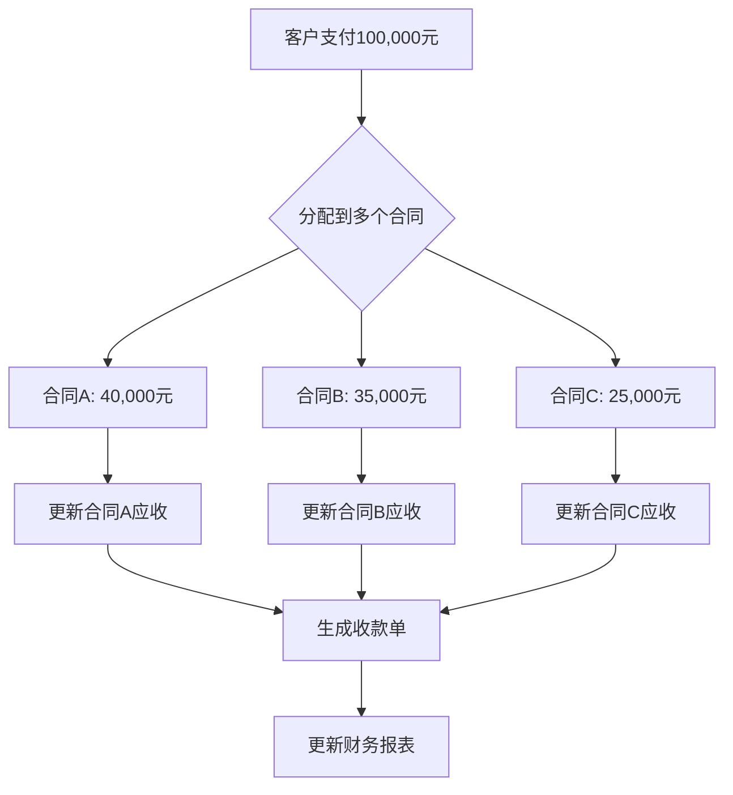

**图表来源**
- [CustClaimServiceImpl.java](file://eplus-module-fms/eplus-module-fms-biz/src/main/java/com/syj/eplus/module/fms/service/custclaim/CustClaimServiceImpl.java#L245-L253)

### 一笔应收被多笔收款认领

对于大额应收账款，客户可能分多次支付。系统支持将多笔收款认领到同一笔应收账款。

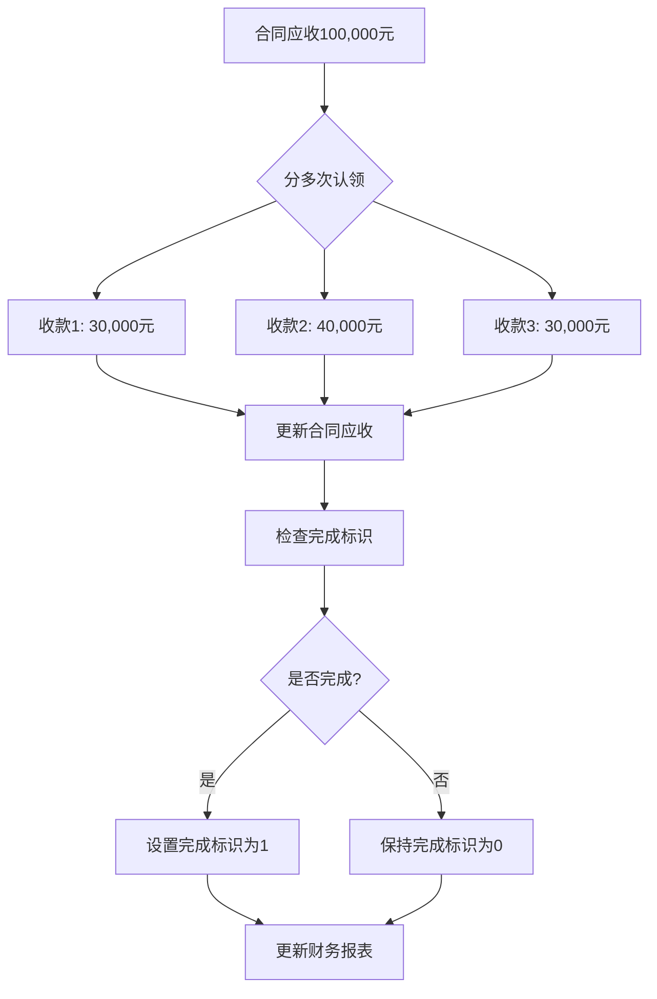

**图表来源**
- [CustClaimServiceImpl.java](file://eplus-module-fms/eplus-module-fms-biz/src/main/java/com/syj/eplus/module/fms/service/custclaim/CustClaimServiceImpl.java#L256-L262)

**本节来源**
- [CustClaimServiceImpl.java](file://eplus-module-fms/eplus-module-fms-biz/src/main/java/com/syj/eplus/module/fms/service/custclaim/CustClaimServiceImpl.java#L218-L307)

## 财务报表影响

客户认领操作对财务报表有直接影响，特别是应收账款余额和收入确认。

### 认领操作对财务报表的影响

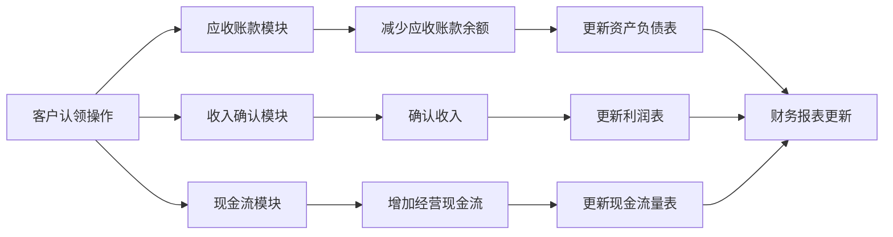

**图表来源**
- [CustClaimServiceImpl.java](file://eplus-module-fms/eplus-module-fms-biz/src/main/java/com/syj/eplus/module/fms/service/custclaim/CustClaimServiceImpl.java#L256-L262)
- [CustClaimServiceImpl.java](file://eplus-module-fms/eplus-module-fms-biz/src/main/java/com/syj/eplus/module/fms/service/custclaim/CustClaimServiceImpl.java#L373-L380)

### 实时影响机制

当执行认领操作时，系统会实时更新相关财务数据：

1. **应收账款余额更新**：根据认领金额减少相应合同的应收账款余额
2. **收入确认**：当认领金额达到合同金额时，确认全部收入
3. **现金流记录**：创建收款单，记录经营现金流
4. **财务比率计算**：更新应收账款周转率等财务指标

**本节来源**
- [CustClaimServiceImpl.java](file://eplus-module-fms/eplus-module-fms-biz/src/main/java/com/syj/eplus/module/fms/service/custclaim/CustClaimServiceImpl.java#L256-L262)
- [CustClaimServiceImpl.java](file://eplus-module-fms/eplus-module-fms-biz/src/main/java/com/syj/eplus/module/fms/service/custclaim/CustClaimServiceImpl.java#L373-L380)

## 与银行对账模块的协同

客户认领模块与银行对账模块紧密集成，实现自动化的对账和认领流程。

### 协同工作流程

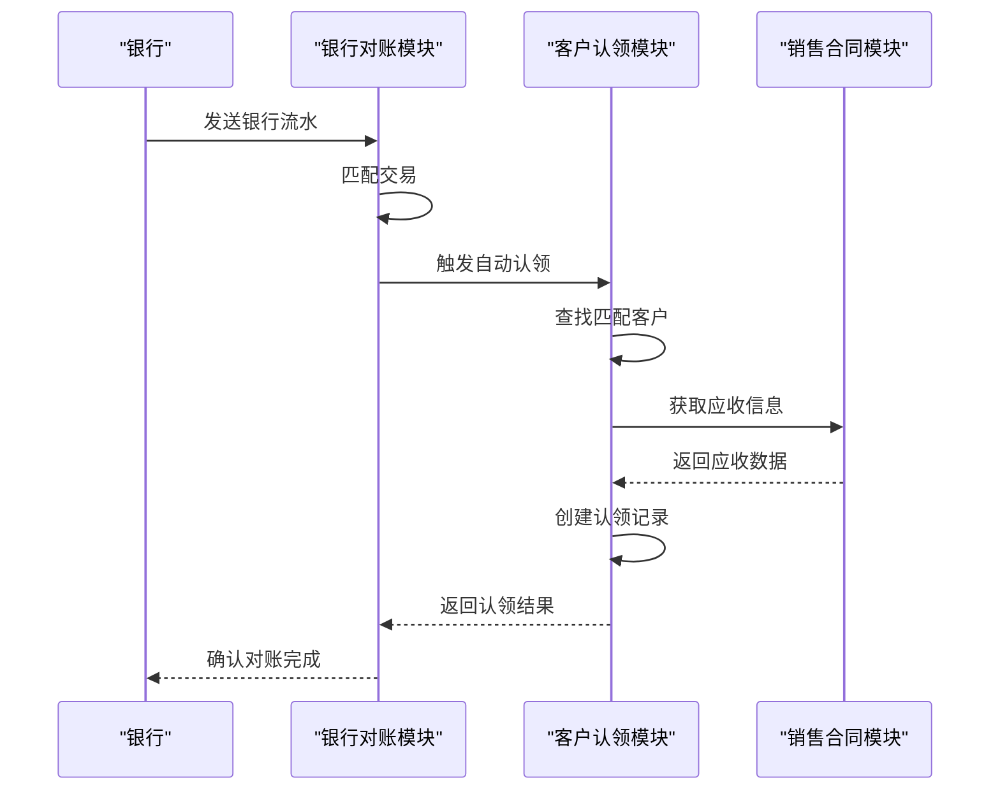

**图表来源**
- [CustClaimServiceImpl.java](file://eplus-module-fms/eplus-module-fms-biz/src/main/java/com/syj/eplus/module/fms/service/custclaim/CustClaimServiceImpl.java#L218-L307)
- [CustClaimServiceImpl.java](file://eplus-module-fms/eplus-module-fms-biz/src/main/java/com/syj/eplus/module/fms/service/custclaim/CustClaimServiceImpl.java#L230-L243)

### 自动认领与手动认领

系统支持两种认领模式：自动认领和手动认领。

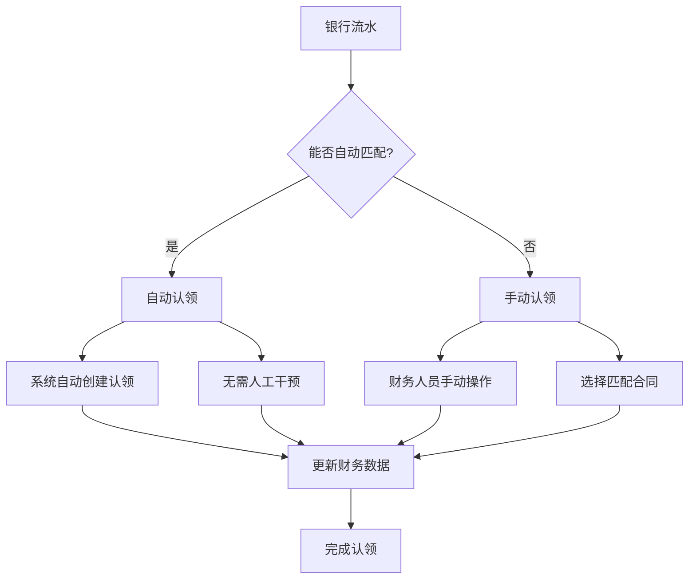

**图表来源**
- [CustClaimServiceImpl.java](file://eplus-module-fms/eplus-module-fms-biz/src/main/java/com/syj/eplus/module/fms/service/custclaim/CustClaimServiceImpl.java#L230-L243)
- [CustClaimServiceImpl.java](file://eplus-module-fms/eplus-module-fms-biz/src/main/java/com/syj/eplus/module/fms/service/custclaim/CustClaimServiceImpl.java#L245-L253)

**本节来源**
- [CustClaimServiceImpl.java](file://eplus-module-fms/eplus-module-fms-biz/src/main/java/com/syj/eplus/module/fms/service/custclaim/CustClaimServiceImpl.java#L218-L307)

## 认领冲突与冲销处理

在复杂的财务场景中，可能会出现认领冲突和需要冲销的情况。系统提供了相应的处理机制。

### 认领冲突处理

当出现认领冲突时，系统会进行以下处理：

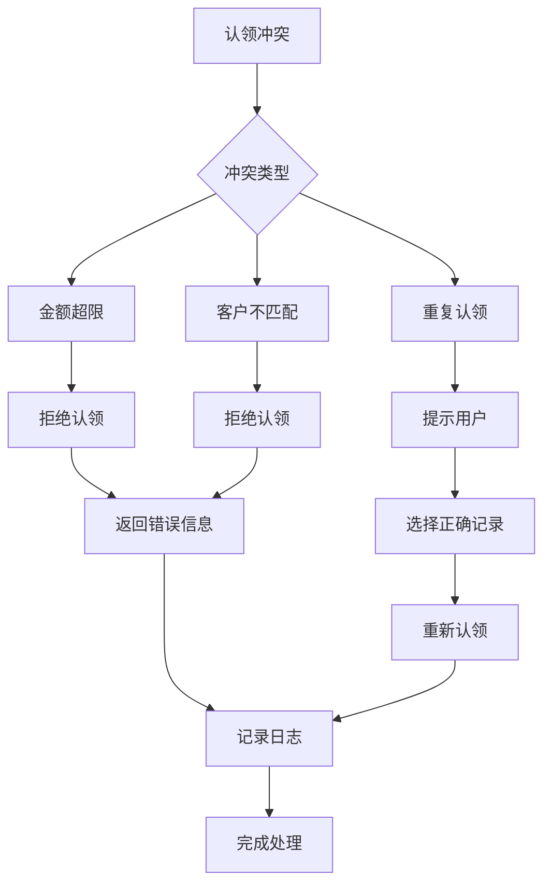

**图表来源**
- [CustClaimServiceImpl.java](file://eplus-module-fms/eplus-module-fms-biz/src/main/java/com/syj/eplus/module/fms/service/custclaim/CustClaimServiceImpl.java#L245-L253)
- [CustClaimServiceImpl.java](file://eplus-module-fms/eplus-module-fms-biz/src/main/java/com/syj/eplus/module/fms/service/custclaim/CustClaimServiceImpl.java#L351-L384)

### 认领冲销处理

当需要冲销已认领的款项时，系统会执行以下流程：

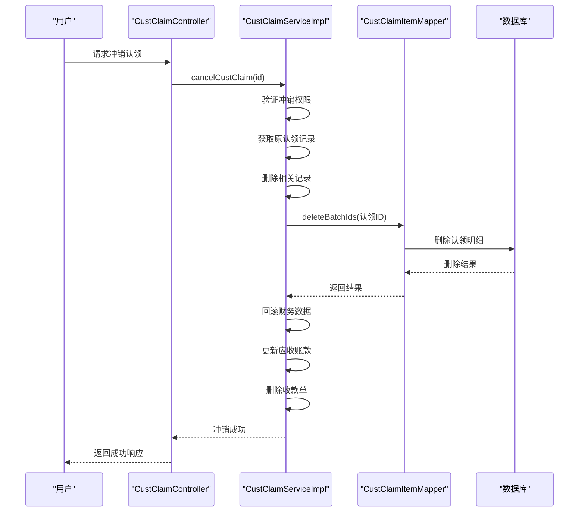

**图表来源**
- [CustClaimServiceImpl.java](file://eplus-module-fms/eplus-module-fms-biz/src/main/java/com/syj/eplus/module/fms/service/custclaim/CustClaimServiceImpl.java#L351-L384)

**本节来源**
- [CustClaimServiceImpl.java](file://eplus-module-fms/eplus-module-fms-biz/src/main/java/com/syj/eplus/module/fms/service/custclaim/CustClaimServiceImpl.java#L351-L384)

## 结论

客户认领API是财务管理系统中的关键组件，实现了客户付款与应收账款的精确匹配。通过详细的接口设计和复杂的业务逻辑处理，系统能够支持各种认领场景，确保财务数据的准确性和实时性。API与银行对账模块的紧密集成，实现了自动化对账和认领，提高了财务工作效率。对于开发者而言，理解认领冲突和冲销处理机制是确保系统稳定运行的关键。

**本节来源**
- [CustClaimController.java](file://eplus-module-fms/eplus-module-fms-biz/src/main/java/com/syj/eplus/module/fms/controller/admin/custclaim/CustClaimController.java#L1-L87)
- [CustClaimServiceImpl.java](file://eplus-module-fms/eplus-module-fms-biz/src/main/java/com/syj/eplus/module/fms/service/custclaim/CustClaimServiceImpl.java#L1-L480)