# 收款管理API

<cite>
**本文档引用的文件**   
- [ReceiptApi.java](file://eplus-module-fms/eplus-module-fms-api/src/main/java/com/syj/eplus/module/fms/api/payment/api/receipt/ReceiptApi.java)
- [ReceiptCreateDTO.java](file://eplus-module-fms/eplus-module-fms-api/src/main/java/com/syj/eplus/module/fms/api/payment/api/receipt/dto/ReceiptCreateDTO.java)
- [ReceiptController.java](file://eplus-module-fms/eplus-module-fms-biz/src/main/java/com/syj/eplus/module/fms/controller/admin/receipt/ReceiptController.java)
- [ReceiptService.java](file://eplus-module-fms/eplus-module-fms-biz/src/main/java/com/syj/eplus/module/fms/service/receipt/ReceiptService.java)
- [ReceiptServiceImpl.java](file://eplus-module-fms/eplus-module-fms-biz/src/main/java/com/syj/eplus/module/fms/service/receipt/ReceiptServiceImpl.java)
- [ReceiptSaveReqVO.java](file://eplus-module-fms/eplus-module-fms-biz/src/main/java/com/syj/eplus/module/fms/controller/admin/receipt/vo/ReceiptSaveReqVO.java)
- [ReceiptRespVO.java](file://eplus-module-fms/eplus-module-fms-biz/src/main/java/com/syj/eplus/module/fms/controller/admin/receipt/vo/ReceiptRespVO.java)
- [ReceiptDO.java](file://eplus-module-fms/eplus-module-fms-biz/src/main/java/com/syj/eplus/module/fms/dal/dataobject/receipt/ReceiptDO.java)
- [ReceiptStatusEnum.java](file://eplus-framework/eplus-common/src/main/java/com/syj/eplus/framework/common/enums/ReceiptStatusEnum.java)
- [ReceiptBusinessType.java](file://eplus-framework/eplus-common/src/main/java/com/syj/eplus/framework/common/enums/ReceiptBusinessType.java)
- [CustClaimController.java](file://eplus-module-fms/eplus-module-fms-biz/src/main/java/com/syj/eplus/module/fms/controller/admin/custclaim/CustClaimController.java)
- [fms_receipt表结构](file://eplus-flyway/src/main/resources/db/migration/common/V1_0_0_002__Eplus初始化.sql)
</cite>

## 目录
1. [引言](#引言)
2. [核心API端点](#核心api端点)
3. [收款数据结构](#收款数据结构)
4. [收款状态机](#收款状态机)
5. [收款登记流程](#收款登记流程)
6. [收款认领与银行流水匹配](#收款认领与银行流水匹配)
7. [与应收账款模块集成](#与应收账款模块集成)
8. [特殊场景处理](#特殊场景处理)
9. [财务凭证生成机制](#财务凭证生成机制)
10. [API调用示例](#api调用示例)

## 引言

收款管理API是企业财务系统的核心组件，负责处理所有与客户收款相关的业务流程。该API提供了完整的收款生命周期管理功能，包括收款登记、收款认领、银行流水匹配、状态管理等。系统通过与应收账款模块的深度集成，实现了收款与应收款的自动核销，确保了财务数据的一致性和准确性。

本API设计遵循RESTful原则，提供了清晰的接口定义和完整的业务逻辑处理。通过标准化的数据结构和状态机管理，确保了收款流程的可追溯性和合规性。API支持多种收款场景，包括全额收款、部分收款、预收款等，并提供了完善的异常处理机制。

**本文档引用的文件**  
- [ReceiptApi.java](file://eplus-module-fms/eplus-module-fms-api/src/main/java/com/syj/eplus/module/fms/api/payment/api/receipt/ReceiptApi.java)
- [ReceiptController.java](file://eplus-module-fms/eplus-module-fms-biz/src/main/java/com/syj/eplus/module/fms/controller/admin/receipt/ReceiptController.java)

## 核心API端点

收款管理API提供了一系列RESTful端点，用于管理收款业务的各个方面。这些端点涵盖了收款的创建、更新、查询、删除以及状态变更等操作。

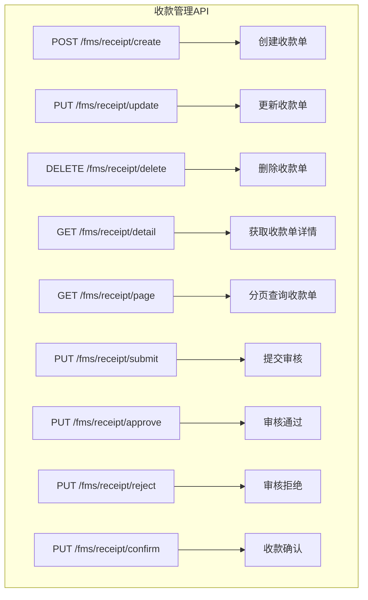

**API端点说明**

| HTTP方法 | 端点路径 | 功能描述 | 权限要求 |
|---------|--------|--------|--------|
| POST | /fms/receipt/create | 创建新的收款单 | fms:receipt:create |
| PUT | /fms/receipt/update | 更新现有收款单 | fms:receipt:update |
| DELETE | /fms/receipt/delete | 删除收款单 | fms:receipt:delete |
| GET | /fms/receipt/detail | 获取收款单详细信息 | fms:receipt:query |
| GET | /fms/receipt/page | 分页查询收款单列表 | fms:receipt:query |
| PUT | /fms/receipt/submit | 提交收款单进行审核 | fms:receipt:submit |
| PUT | /fms/receipt/approve | 审核通过收款单 | fms:receipt:audit |
| PUT | /fms/receipt/reject | 审核拒绝收款单 | fms:receipt:audit |
| PUT | /fms/receipt/confirm | 确认收款完成 | fms:receipt:confirm |

**API端点来源**  
- [ReceiptController.java](file://eplus-module-fms/eplus-module-fms-biz/src/main/java/com/syj/eplus/module/fms/controller/admin/receipt/ReceiptController.java)

## 收款数据结构

收款管理API使用标准化的数据结构来定义收款请求和响应。这些数据结构确保了数据的一致性和完整性。

### 收款请求数据结构

收款请求数据结构（ReceiptSaveReqVO）定义了创建和更新收款单所需的所有字段。

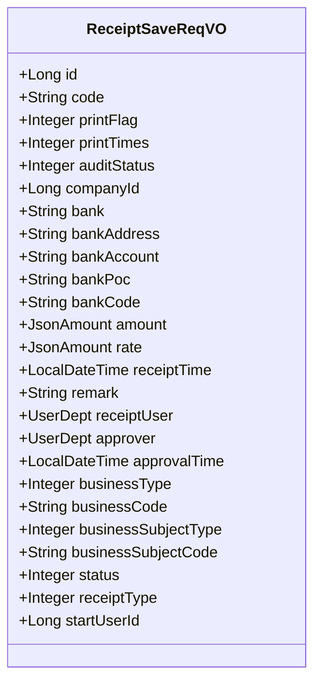

**核心字段说明**

| 字段名称 | 类型 | 必填 | 业务定义 |
|--------|-----|-----|--------|
| amount | JsonAmount | 是 | 收款金额，包含金额值和币种信息 |
| currency | String | 是 | 交易币种，遵循ISO 4217标准 |
| custCode | String | 是 | 客户编号，关联客户主数据 |
| contractCode | String | 否 | 关联销售合同编号 |
| receiptType | Integer | 是 | 收款方式，枚举值：1-银行转账，2-现金，3-支票等 |
| businessType | Integer | 是 | 业务类型，标识收款关联的业务场景 |
| businessCode | String | 是 | 业务编号，关联具体业务单据 |
| receiptTime | LocalDateTime | 是 | 实际收款时间 |
| bankAccount | String | 是 | 收款银行账号 |
| bank | String | 是 | 开户行名称 |

**数据结构来源**  
- [ReceiptSaveReqVO.java](file://eplus-module-fms/eplus-module-fms-biz/src/main/java/com/syj/eplus/module/fms/controller/admin/receipt/vo/ReceiptSaveReqVO.java)
- [ReceiptDO.java](file://eplus-module-fms/eplus-module-fms-biz/src/main/java/com/syj/eplus/module/fms/dal/dataobject/receipt/ReceiptDO.java)

### 收款响应数据结构

收款响应数据结构（ReceiptRespVO）包含了收款单的完整信息，包括系统自动生成的字段和关联信息。

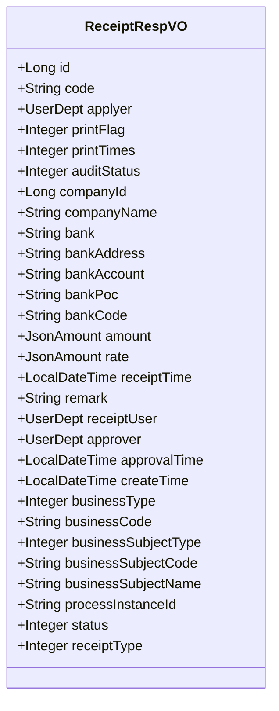

**扩展字段说明**

| 字段名称 | 类型 | 业务定义 |
|--------|-----|--------|
| applyer | UserDept | 申请人信息，包含用户ID和部门信息 |
| companyName | String | 内部法人单位名称，通过companyId关联获取 |
| businessSubjectName | String | 支付对象名称，根据业务类型动态获取 |
| processInstanceId | String | 关联的流程实例ID，用于跟踪审核流程 |

**数据结构来源**  
- [ReceiptRespVO.java](file://eplus-module-fms/eplus-module-fms-biz/src/main/java/com/syj/eplus/module/fms/controller/admin/receipt/vo/ReceiptRespVO.java)

## 收款状态机

收款管理API实现了一个完整的状态机，用于跟踪收款单的生命周期。状态机确保了业务流程的合规性和数据的一致性。

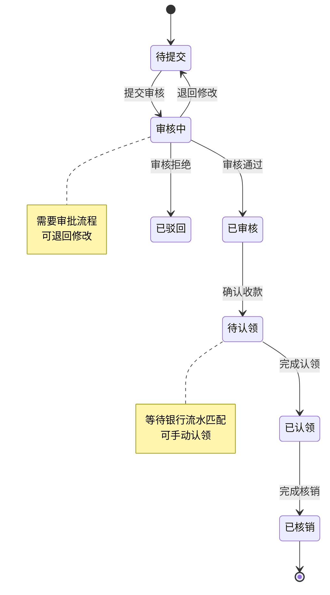

### 状态定义

| 状态值 | 状态名称 | 说明 |
|-------|--------|------|
| 0 | 待提交 | 收款单创建后初始状态，等待提交审核 |
| 1 | 审核中 | 收款单已提交，正在审批流程中 |
| 2 | 已审核 | 收款单已通过审批，等待收款确认 |
| 3 | 已驳回 | 收款单被拒绝，需要修改后重新提交 |
| 4 | 待认领 | 收款已确认，等待与银行流水匹配 |
| 5 | 已认领 | 收款已与银行流水匹配成功 |
| 6 | 已核销 | 收款已与应收款完全核销 |

**状态机来源**  
- [ReceiptStatusEnum.java](file://eplus-framework/eplus-common/src/main/java/com/syj/eplus/framework/common/enums/ReceiptStatusEnum.java)
- [ReceiptDO.java](file://eplus-module-fms/eplus-module-fms-biz/src/main/java/com/syj/eplus/module/fms/dal/dataobject/receipt/ReceiptDO.java#L137-L138)

### 状态转换规则

状态转换受到严格的业务规则约束，确保流程的合规性：

1. **提交审核**：只有"待提交"状态的收款单可以提交审核
2. **审核操作**：只有"审核中"状态的收款单可以进行审核通过或拒绝操作
3. **收款确认**：只有"已审核"状态的收款单可以确认收款
4. **认领操作**：只有"待认领"状态的收款单可以进行认领
5. **核销操作**：只有"已认领"状态的收款单可以进行核销

状态转换通过API端点触发，系统会自动验证状态转换的合法性。

**状态机来源**  
- [ReceiptServiceImpl.java](file://eplus-module-fms/eplus-module-fms-biz/src/main/java/com/syj/eplus/module/fms/service/receipt/ReceiptServiceImpl.java#L160-L170)

## 收款登记流程

收款登记是收款管理的核心流程，涉及多个系统组件的协同工作。

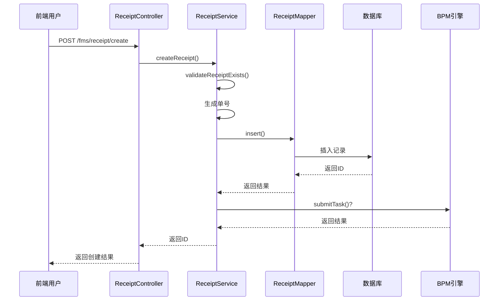

### 登记流程步骤

1. **请求接收**：ReceiptController接收创建收款单的HTTP请求
2. **参数验证**：验证请求参数的完整性和合法性
3. **业务验证**：检查关联的客户、合同等业务数据是否存在
4. **单号生成**：调用CodeGeneratorApi生成唯一的收款单号
5. **数据持久化**：将收款单数据插入fms_receipt表
6. **流程触发**：根据配置决定是否自动提交审批流程
7. **结果返回**：返回创建成功的收款单ID

**流程来源**  
- [ReceiptServiceImpl.java](file://eplus-module-fms/eplus-module-fms-biz/src/main/java/com/syj/eplus/module/fms/service/receipt/ReceiptServiceImpl.java#L85-L96)
- [ReceiptController.java](file://eplus-module-fms/eplus-module-fms-biz/src/main/java/com/syj/eplus/module/fms/controller/admin/receipt/ReceiptController.java#L41-L45)

## 收款认领与银行流水匹配

收款认领是将实际收到的款项与系统中的收款单进行匹配的过程。该功能支持自动匹配和手动认领两种模式。

### 认领流程

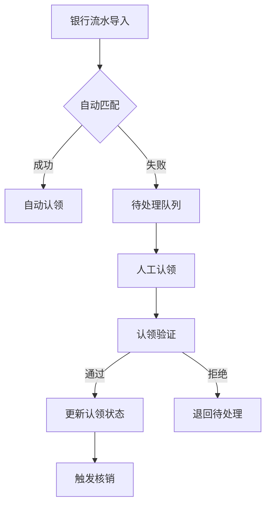

### API接口

收款认领功能通过独立的API接口提供：

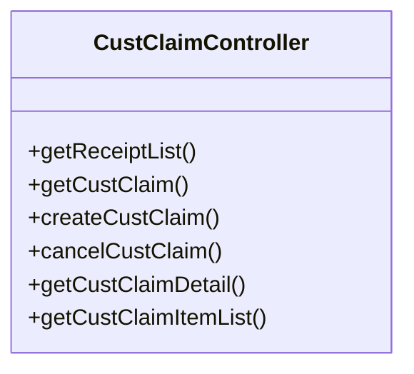

**认领流程说明**

1. **银行流水导入**：从银行系统导入每日的交易流水
2. **自动匹配**：系统根据金额、时间、客户信息等字段自动匹配
3. **人工认领**：对于无法自动匹配的流水，由财务人员手动认领
4. **认领验证**：验证认领的合理性，防止重复认领
5. **状态更新**：更新收款单状态为"已认领"
6. **触发核销**：启动与应收款的核销流程

**认领来源**  
- [CustClaimController.java](file://eplus-module-fms/eplus-module-fms-biz/src/main/java/com/syj/eplus/module/fms/controller/admin/custclaim/CustClaimController.java)
- [V1_0_0_439__收款单增加回款认领Id字段.java](file://eplus-flyway/src/main/java/db/migration/common/V1_0_0_439__收款单增加回款认领Id字段.java)

## 与应收账款模块集成

收款管理API与应收账款模块深度集成，实现了收款与应收款的自动核销。

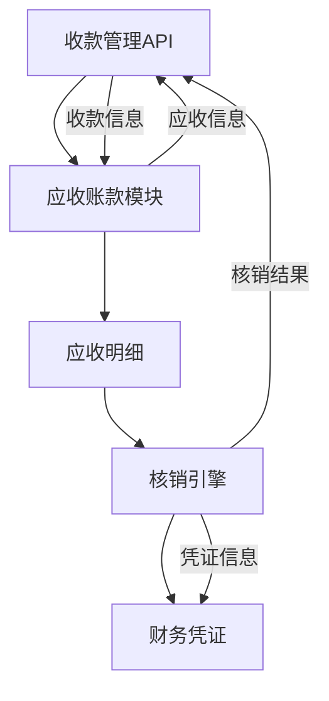

### 集成机制

1. **双向查询**：收款管理API可以查询应收账款余额，应收账款模块可以查询未核销收款
2. **自动核销**：当收款金额等于应收金额时，系统自动完成核销
3. **部分核销**：支持部分金额核销，剩余金额继续挂账
4. **预收款处理**：对于预收款，系统创建预收账款科目
5. **冲销处理**：支持收款冲销，恢复应收状态

**集成来源**  
- [ReceiptServiceImpl.java](file://eplus-module-fms/eplus-module-fms-biz/src/main/java/com/syj/eplus/module/fms/service/receipt/ReceiptServiceImpl.java#L171-L173)
- [ReceiptApi.java](file://eplus-module-fms/eplus-module-fms-api/src/main/java/com/syj/eplus/module/fms/api/payment/api/receipt/ReceiptApi.java)

## 特殊场景处理

收款管理API提供了完善的特殊场景处理机制，确保系统的健壮性和业务的连续性。

### 重复收款处理

当系统检测到可能的重复收款时，会触发以下处理流程：

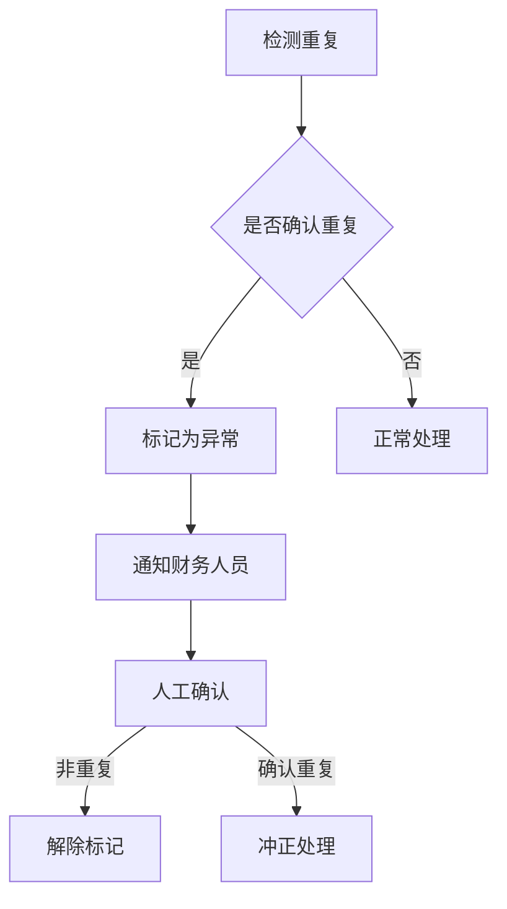

### 收款冲正

收款冲正用于撤销错误的收款操作：

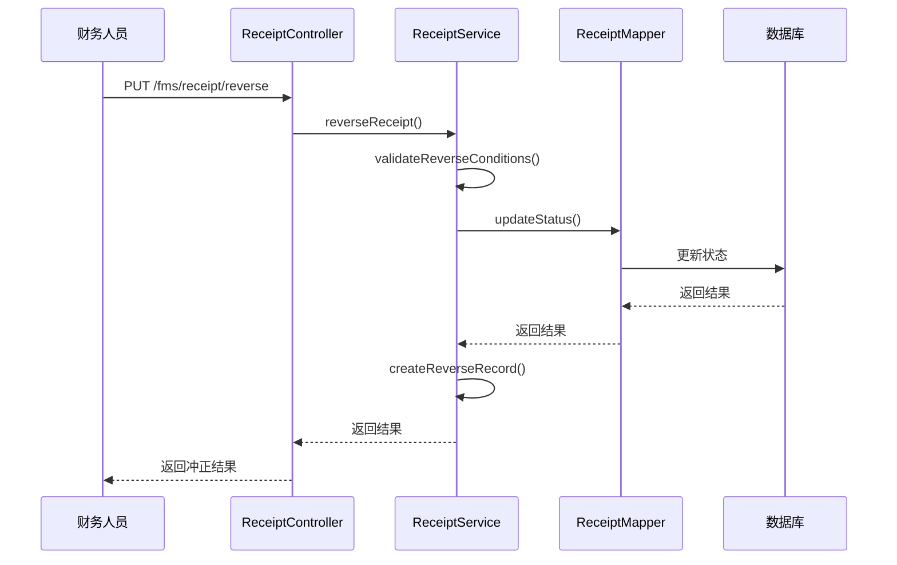

**特殊场景来源**  
- [ReceiptServiceImpl.java](file://eplus-module-fms/eplus-module-fms-biz/src/main/java/com/syj/eplus/module/fms/service/receipt/ReceiptServiceImpl.java)
- [ReceiptService.java](file://eplus-module-fms/eplus-module-fms-biz/src/main/java/com/syj/eplus/module/fms/service/receipt/ReceiptService.java)

## 财务凭证生成机制

收款操作会触发财务凭证的自动生成，确保财务数据的及时性和准确性。

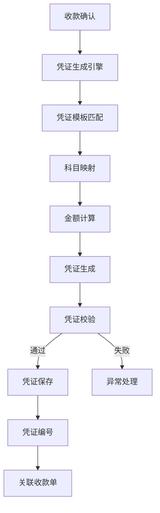

### 凭证生成规则

1. **科目映射**：根据业务类型和收款方式确定会计科目
2. **金额计算**：考虑汇率、手续费等因素计算实际入账金额
3. **辅助核算**：包含客户、项目、部门等辅助核算信息
4. **凭证类型**：根据业务场景生成不同类型的凭证
5. **自动过账**：生成的凭证自动过账到总账系统

**凭证机制来源**  
- [ReceiptServiceImpl.java](file://eplus-module-fms/eplus-module-fms-biz/src/main/java/com/syj/eplus/module/fms/service/receipt/ReceiptServiceImpl.java)

## API调用示例

### 全额收款示例

```json
{
  "code": "SK20240101001",
  "companyId": 1001,
  "bankAccount": "1234567890",
  "amount": {
    "value": 10000.00,
    "currency": "CNY"
  },
  "receiptTime": "2024-01-01T10:00:00",
  "businessType": 1,
  "businessCode": "SO20240101001",
  "businessSubjectType": 1,
  "businessSubjectCode": "CUST001",
  "receiptType": 1,
  "remark": "销售合同全额收款"
}
```

### 部分收款示例

```json
{
  "code": "SK20240101002",
  "companyId": 1001,
  "bankAccount": "1234567890",
  "amount": {
    "value": 5000.00,
    "currency": "CNY"
  },
  "receiptTime": "2024-01-01T10:00:00",
  "businessType": 1,
  "businessCode": "SO20240101001",
  "businessSubjectType": 1,
  "businessSubjectCode": "CUST001",
  "receiptType": 1,
  "remark": "销售合同部分收款"
}
```

### 预收款示例

```json
{
  "code": "SK20240101003",
  "companyId": 1001,
  "bankAccount": "1234567890",
  "amount": {
    "value": 2000.00,
    "currency": "CNY"
  },
  "receiptTime": "2024-01-01T10:00:00",
  "businessType": 2,
  "businessCode": "ADV20240101001",
  "businessSubjectType": 1,
  "businessSubjectCode": "CUST001",
  "receiptType": 1,
  "remark": "客户预付款"
}
```

**API示例来源**  
- [ReceiptCreateDTO.java](file://eplus-module-fms/eplus-module-fms-api/src/main/java/com/syj/eplus/module/fms/api/payment/api/receipt/dto/ReceiptCreateDTO.java)
- [ReceiptSaveReqVO.java](file://eplus-module-fms/eplus-module-fms-biz/src/main/java/com/syj/eplus/module/fms/controller/admin/receipt/vo/ReceiptSaveReqVO.java)