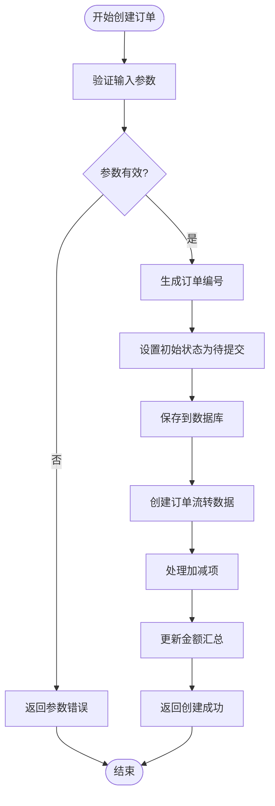
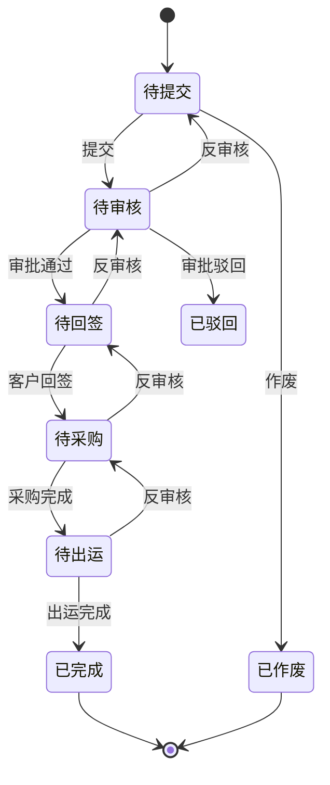
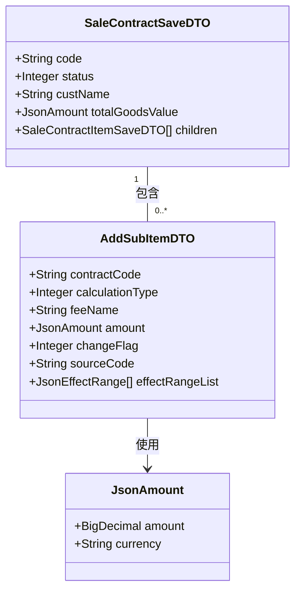
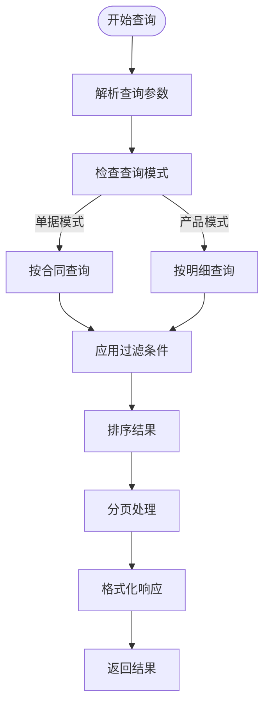
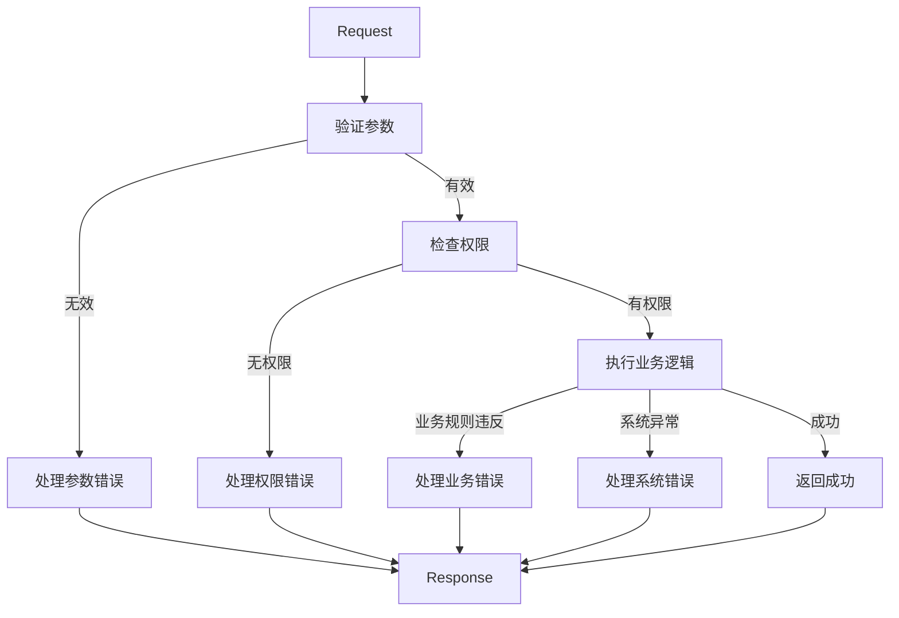

# 订单处理API

<cite>
**本文档引用的文件**   
- [AddSubItemApi.java](file://eplus-module-sms/eplus-module-sms-api/src/main/java/com/syj/eplus/module/sms/api/AddSubItemApi.java)
- [SaleContractApi.java](file://eplus-module-sms/eplus-module-sms-api/src/main/java/com/syj/eplus/module/sms/api/SaleContractApi.java)
- [SaleContractSaveDTO.java](file://eplus-module-sms/eplus-module-sms-api/src/main/java/com/syj/eplus/module/sms/api/dto/SaleContractSaveDTO.java)
- [SaleContractItemSaveDTO.java](file://eplus-module-sms/eplus-module-sms-api/src/main/java/com/syj/eplus/module/sms/api/dto/SaleContractItemSaveDTO.java)
- [AddSubItemDTO.java](file://eplus-module-sms/eplus-module-sms-api/src/main/java/com/syj/eplus/module/sms/api/dto/AddSubItemDTO.java)
- [AddSubItemApiImpl.java](file://eplus-module-sms/eplus-module-sms-biz/src/main/java/com/syj/eplus/module/sms/api/AddSubItemApiImpl.java)
- [DomesticSaleContractController.java](file://eplus-module-sms/eplus-module-sms-biz/src/main/java/com/syj/eplus/module/sms/controller/admin/salecontract/DomesticSaleContractController.java)
- [ExportSaleContractController.java](file://eplus-module-sms/eplus-module-sms-biz/src/main/java/com/syj/eplus/module/sms/controller/admin/salecontract/ExportSaleContractController.java)
- [SaleContractStatusEnum.java](file://eplus-framework/eplus-common/src/main/java/com/syj/eplus/framework/common/enums/SaleContractStatusEnum.java)
</cite>

## 目录
1. [简介](#简介)
2. [核心组件](#核心组件)
3. [订单创建接口](#订单创建接口)
4. [订单状态流转](#订单状态流转)
5. [子订单管理](#子订单管理)
6. [订单查询接口](#订单查询接口)
7. [API安全要求](#api安全要求)
8. [常见错误处理](#常见错误处理)
9. [请求响应示例](#请求响应示例)
10. [结论](#结论)

## 简介

订单处理API是企业销售管理系统的核心组件，负责处理销售订单的全生命周期管理。该API支持内销合同、外销合同和外币采购合同等多种销售类型，提供完整的增删改查功能。系统通过RESTful接口设计，实现了订单创建、修改、删除、查询等基本操作，同时支持订单变更、审批、作废等业务流程。

API设计遵循模块化原则，将订单处理功能分为多个独立的控制器，包括内销合同控制器、外销合同控制器和工厂合同控制器。每个控制器负责特定类型的订单处理，确保了系统的可维护性和扩展性。订单数据结构设计完整，包含了客户信息、产品明细、价格条款、交货日期等关键业务字段，满足了复杂销售场景的需求。

系统实现了完整的订单状态流转机制，从创建、审核到完成或作废，每个状态都有明确的业务含义和操作规则。通过与工作流引擎集成，实现了订单的审批流程自动化。同时，API提供了丰富的查询功能，支持按多种条件过滤和分页查询，便于用户快速定位所需订单。

**本文档引用的文件**   
- [SaleContractApi.java](file://eplus-module-sms/eplus-module-sms-api/src/main/java/com/syj/eplus/module/sms/api/SaleContractApi.java)
- [DomesticSaleContractController.java](file://eplus-module-sms/eplus-module-sms-biz/src/main/java/com/syj/eplus/module/sms/controller/admin/salecontract/DomesticSaleContractController.java)
- [ExportSaleContractController.java](file://eplus-module-sms/eplus-module-sms-biz/src/main/java/com/syj/eplus/module/sms/controller/admin/salecontract/ExportSaleContractController.java)

## 核心组件

订单处理API的核心组件包括订单API接口、订单控制器和订单数据传输对象。`SaleContractApi`接口定义了所有订单操作的方法，包括创建、更新、删除、查询等基本功能，以及特殊业务操作如回签、作废、下推采购计划等。该接口作为服务层的契约，确保了业务逻辑的统一性和可测试性。

订单控制器分为`DomesticSaleContractController`（内销合同控制器）和`ExportSaleContractController`（外销合同控制器），分别处理不同类型的订单请求。控制器通过Spring MVC框架暴露RESTful API，处理HTTP请求并调用服务层完成业务逻辑。控制器实现了权限控制，通过`@PreAuthorize`注解确保只有授权用户才能执行特定操作。

数据传输对象（DTO）是API的重要组成部分，包括`SaleContractSaveDTO`（订单保存数据传输对象）和`SaleContractItemSaveDTO`（订单明细保存数据传输对象）。这些DTO类使用Lombok注解简化代码，通过`@Data`注解自动生成getter、setter、toString等方法。DTO设计遵循单一职责原则，每个字段都有明确的业务含义和验证规则。

系统还实现了加减项管理功能，通过`AddSubItemApi`接口和`AddSubItemDTO`数据传输对象，支持为订单添加附加费用或扣除项。这种设计提高了订单的灵活性，能够处理复杂的定价场景。所有核心组件都遵循了良好的编程实践，包括异常处理、日志记录和性能优化。

**本文档引用的文件**   
- [SaleContractApi.java](file://eplus-module-sms/eplus-module-sms-api/src/main/java/com/syj/eplus/module/sms/api/SaleContractApi.java)
- [SaleContractSaveDTO.java](file://eplus-module-sms/eplus-module-sms-api/src/main/java/com/syj/eplus/module/sms/api/dto/SaleContractSaveDTO.java)
- [SaleContractItemSaveDTO.java](file://eplus-module-sms/eplus-module-sms-api/src/main/java/com/syj/eplus/module/sms/api/dto/SaleContractItemSaveDTO.java)
- [AddSubItemApi.java](file://eplus-module-sms/eplus-module-sms-api/src/main/java/com/syj/eplus/module/sms/api/AddSubItemApi.java)
- [AddSubItemDTO.java](file://eplus-module-sms/eplus-module-sms-api/src/main/java/com/syj/eplus/module/sms/api/dto/AddSubItemDTO.java)

## 订单创建接口

订单创建接口是订单处理API的基础功能，通过`SaleContractSaveDTO`数据传输对象定义了完整的请求体结构。该接口支持创建内销合同、外销合同和外币采购合同，通过`saleType`字段区分不同类型的订单。请求体包含订单的基本信息、客户信息、产品明细、价格条款和交货日期等关键字段。

订单基本信息包括编号、确认状态、内部法人单位等字段。客户信息部分包含客户主键、客户编号、客户名称、应收客户和收货客户等详细信息，确保了订单与客户关系的准确关联。交易信息包括交易币别、价格条款、收款方式等财务相关字段，为后续的财务处理提供了基础数据。

产品明细是订单的核心内容，通过`children`字段以列表形式包含多个`SaleContractItemSaveDTO`对象。每个明细项包含产品编号、品名、数量、销售单价、采购信息等详细数据。系统对关键字段实施了严格的验证规则，如数量必须为正整数，价格必须为有效数值，确保了数据的完整性和准确性。

接口设计考虑了用户体验，支持批量创建订单，返回`List<CreatedResponse>`包含新创建订单的ID和编号。通过`@Valid`注解实现了请求参数的自动验证，确保了输入数据的合法性。创建成功后，系统会自动分配订单编号，并设置初始状态为"待提交"，启动订单的生命周期。



**图示来源**
- [SaleContractSaveDTO.java](file://eplus-module-sms/eplus-module-sms-api/src/main/java/com/syj/eplus/module/sms/api/dto/SaleContractSaveDTO.java)
- [SaleContractItemSaveDTO.java](file://eplus-module-sms/eplus-module-sms-api/src/main/java/com/syj/eplus/module/sms/api/dto/SaleContractItemSaveDTO.java)

**本文档引用的文件**   
- [SaleContractSaveDTO.java](file://eplus-module-sms/eplus-module-sms-api/src/main/java/com/syj/eplus/module/sms/api/dto/SaleContractSaveDTO.java)
- [SaleContractItemSaveDTO.java](file://eplus-module-sms/eplus-module-sms-api/src/main/java/com/syj/eplus/module/sms/api/dto/SaleContractItemSaveDTO.java)
- [DomesticSaleContractController.java](file://eplus-module-sms/eplus-module-sms-biz/src/main/java/com/syj/eplus/module/sms/controller/admin/salecontract/DomesticSaleContractController.java)

## 订单状态流转

订单状态流转是订单处理API的核心业务逻辑，通过`SaleContractStatusEnum`枚举定义了完整的状态机。系统实现了从创建到完成或作废的完整生命周期管理，每个状态都有明确的业务含义和转换规则。状态流转通过API接口和工作流引擎协同实现，确保了业务流程的规范性和可追溯性。

初始状态为"待提交"，订单创建后处于此状态。用户提交订单后，状态变为"待审核"，进入审批流程。审批通过后，状态变为"待回签"，等待客户确认。客户回签后，订单进入执行阶段，状态变为"待采购"。随着业务进展，订单依次经历"待出运"、"已完成"等状态，最终完成整个生命周期。

系统提供了丰富的状态操作接口，包括提交、审批、驳回、反审核、作废等。每个操作都有严格的权限控制，确保只有授权人员才能执行。例如，审批操作需要具有"audit"权限，作废操作需要具有"close"权限。状态转换时，系统会进行业务规则验证，如库存检查、信用额度检查等，防止非法状态转换。

状态流转与工作流引擎深度集成，实现了审批流程的可视化和自动化。每个状态转换都会生成相应的审计日志，记录操作人、操作时间和操作详情，满足了审计要求。系统还支持状态回退，在特定条件下允许订单状态回退到之前的某个状态，提高了业务处理的灵活性。



**图示来源**
- [SaleContractStatusEnum.java](file://eplus-framework/eplus-common/src/main/java/com/syj/eplus/framework/common/enums/SaleContractStatusEnum.java)
- [DomesticSaleContractController.java](file://eplus-module-sms/eplus-module-sms-biz/src/main/java/com/syj/eplus/module/sms/controller/admin/salecontract/DomesticSaleContractController.java)

**本文档引用的文件**   
- [SaleContractStatusEnum.java](file://eplus-framework/eplus-common/src/main/java/com/syj/eplus/framework/common/enums/SaleContractStatusEnum.java)
- [DomesticSaleContractController.java](file://eplus-module-sms/eplus-module-sms-biz/src/main/java/com/syj/eplus/module/sms/controller/admin/salecontract/DomesticSaleContractController.java)
- [ExportSaleContractController.java](file://eplus-module-sms/eplus-module-sms-biz/src/main/java/com/syj/eplus/module/sms/controller/admin/salecontract/ExportSaleContractController.java)

## 子订单管理

子订单管理功能通过`AddSubItemApi`接口实现，支持为现有订单添加附加项目或子订单。该功能在处理复杂订单场景时尤为重要，如添加额外费用、调整价格或处理特殊条款。`AddSubItemDTO`数据传输对象定义了加减项的结构，包括合同编号、计算类型、费用名称和金额等关键字段。

加减项的计算类型分为"加项"和"减项"，通过`calculationType`字段区分。系统在计算订单总金额时，会自动将所有加项金额相加，减项金额相减，确保了金额计算的准确性。每个加减项都有独立的金额字段，使用`JsonAmount`对象存储金额值和币种信息，支持多币种处理。

API提供了完整的加减项管理接口，包括批量查询、批量插入和批量删除。`insertBatch`方法支持一次性插入多个加减项，提高了处理效率。系统在插入加减项时会进行事务处理，确保数据的一致性。如果插入过程中发生错误，所有操作都会回滚，防止数据不一致。

加减项与主订单保持强关联，通过合同编号建立连接。当主订单被删除时，相关的加减项也会被级联删除，维护了数据的完整性。系统还实现了加减项的审计功能，记录每个加减项的创建人、创建时间和修改历史，满足了财务审计的要求。加减项的金额会实时反映在订单的总金额中，确保了财务数据的准确性。



**图示来源**
- [AddSubItemDTO.java](file://eplus-module-sms/eplus-module-sms-api/src/main/java/com/syj/eplus/module/sms/api/dto/AddSubItemDTO.java)
- [AddSubItemApi.java](file://eplus-module-sms/eplus-module-sms-api/src/main/java/com/syj/eplus/module/sms/api/AddSubItemApi.java)
- [SaleContractSaveDTO.java](file://eplus-module-sms/eplus-module-sms-api/src/main/java/com/syj/eplus/module/sms/api/dto/SaleContractSaveDTO.java)

**本文档引用的文件**   
- [AddSubItemApi.java](file://eplus-module-sms/eplus-module-sms-api/src/main/java/com/syj/eplus/module/sms/api/AddSubItemApi.java)
- [AddSubItemDTO.java](file://eplus-module-sms/eplus-module-sms-api/src/main/java/com/syj/eplus/module/sms/api/dto/AddSubItemDTO.java)
- [AddSubItemApiImpl.java](file://eplus-module-sms/eplus-module-sms-biz/src/main/java/com/syj/eplus/module/sms/api/AddSubItemApiImpl.java)

## 订单查询接口

订单查询接口提供了灵活的过滤和分页功能，满足不同场景下的查询需求。系统支持两种查询模式：单据模式和产品模式。单据模式按合同分页，返回树形结构的订单数据；产品模式按明细分页，返回扁平结构的明细数据。通过`queryMode`参数控制查询模式，`1`表示单据模式，`2`表示产品模式。

查询条件丰富多样，包括订单编号、客户名称、销售员、状态、日期范围等。系统对每个查询条件都实现了高效的索引支持，确保了查询性能。分页参数遵循标准的分页模式，包含`pageNo`（页码）和`pageSize`（每页大小），默认每页显示10条记录，最多支持每页100条记录。

API设计考虑了性能优化，对大数据量查询实现了懒加载和分批处理。对于导出操作，系统提供了专门的导出接口，支持将查询结果导出为Excel文件。导出功能支持自定义模板，用户可以选择不同的报表模板来满足不同的业务需求。

系统还实现了高级查询功能，如模糊搜索、范围查询和组合查询。模糊搜索支持对订单编号、客户名称等文本字段进行部分匹配查询。范围查询支持对金额、数量、日期等数值字段进行区间查询。组合查询允许用户同时使用多个查询条件，通过逻辑与操作符连接，实现精确的数据筛选。



**图示来源**
- [DomesticSaleContractController.java](file://eplus-module-sms/eplus-module-sms-biz/src/main/java/com/syj/eplus/module/sms/controller/admin/salecontract/DomesticSaleContractController.java)
- [ExportSaleContractController.java](file://eplus-module-sms/eplus-module-sms-biz/src/main/java/com/syj/eplus/module/sms/controller/admin/salecontract/ExportSaleContractController.java)

**本文档引用的文件**   
- [DomesticSaleContractController.java](file://eplus-module-sms/eplus-module-sms-biz/src/main/java/com/syj/eplus/module/sms/controller/admin/salecontract/DomesticSaleContractController.java)
- [ExportSaleContractController.java](file://eplus-module-sms/eplus-module-sms-biz/src/main/java/com/syj/eplus/module/sms/controller/admin/salecontract/ExportSaleContractController.java)
- [SaleContractPageReqVO.java](file://eplus-module-sms/eplus-module-sms-biz/src/main/java/com/syj/eplus/module/sms/controller/admin/salecontract/vo/SaleContractPageReqVO.java)

## API安全要求

API安全要求通过多层次的安全机制实现，确保系统的数据安全和访问控制。系统基于Spring Security框架实现了全面的权限管理，通过`@PreAuthorize`注解对每个API接口进行细粒度的权限控制。每个操作都有对应的权限码，如"create"、"update"、"delete"、"query"等，只有拥有相应权限的用户才能执行操作。

数据权限控制是安全体系的重要组成部分，确保用户只能访问自己负责的订单。系统通过数据权限注解`@DataPermission`实现行级数据过滤，自动为查询语句添加用户相关的过滤条件。例如，销售员只能看到自己负责的订单，部门经理可以看到本部门的所有订单，实现了基于角色的数据隔离。

API接口采用了HTTPS协议进行通信，确保数据传输过程中的安全性。所有敏感数据，如客户信息、财务数据等，在传输过程中都进行了加密处理。系统还实现了请求签名机制，防止请求被篡改或重放攻击。每个API请求都需要包含有效的身份认证信息，通常通过JWT（JSON Web Token）实现。

系统记录了完整的操作审计日志，包括操作人、操作时间、操作类型和操作详情。审计日志不可篡改，满足了合规性要求。对于敏感操作，如删除订单、修改金额等，系统还实现了二次确认机制，防止误操作。所有安全相关的配置都集中在安全配置类中，便于维护和审计。

**本文档引用的文件**   
- [DomesticSaleContractController.java](file://eplus-module-sms/eplus-module-sms-biz/src/main/java/com/syj/eplus/module/sms/controller/admin/salecontract/DomesticSaleContractController.java)
- [ExportSaleContractController.java](file://eplus-module-sms/eplus-module-sms-biz/src/main/java/com/syj/eplus/module/sms/controller/admin/salecontract/ExportSaleContractController.java)
- [SaleContractService.java](file://eplus-module-sms/eplus-module-sms-biz/src/main/java/com/syj/eplus/module/sms/service/salecontract/SaleContractService.java)

## 常见错误处理

常见错误处理机制通过统一的异常处理框架实现，确保了API的稳定性和用户体验。系统定义了完整的错误码体系，每个错误都有唯一的错误码和明确的错误信息。错误码分为多个类别，如参数错误、权限错误、业务规则错误、系统错误等，便于客户端进行错误分类和处理。

对于参数验证错误，系统在接收到请求时立即进行验证，返回400 Bad Request状态码和详细的错误信息。错误信息包含具体的验证失败字段和原因，帮助客户端快速定位问题。例如，当数量字段为负数时，返回"数量必须为正整数"的错误信息。

业务规则错误通常发生在状态转换或数据操作时，如库存不足、信用额度超限等。这类错误返回409 Conflict状态码，表示请求与当前资源状态冲突。系统会提供具体的业务规则信息，如"当前库存不足，无法完成出运"，帮助用户理解错误原因并采取相应措施。

系统错误包括数据库连接失败、网络超时等技术性问题，返回500 Internal Server Error状态码。对于这类错误，系统会记录详细的错误日志，包括堆栈跟踪信息，便于开发人员排查问题。同时，向客户端返回通用的错误信息，避免暴露系统内部细节。



**图示来源**
- [SaleContractService.java](file://eplus-module-sms/eplus-module-sms-biz/src/main/java/com/syj/eplus/module/sms/service/salecontract/SaleContractService.java)
- [SaleContractApi.java](file://eplus-module-sms/eplus-module-sms-api/src/main/java/com/syj/eplus/module/sms/api/SaleContractApi.java)

**本文档引用的文件**   
- [SaleContractService.java](file://eplus-module-sms/eplus-module-sms-biz/src/main/java/com/syj/eplus/module/sms/service/salecontract/SaleContractService.java)
- [ErrorCodeConstants.java](file://eplus-module-sms/eplus-module-sms-api/src/main/java/com/syj/eplus/module/sms/api/enums/ErrorCodeConstants.java)

## 请求响应示例

请求响应示例展示了订单创建和修改的典型流程。创建订单的请求体包含完整的订单信息，包括客户信息、产品明细、价格条款等。响应返回新创建订单的ID和编号，便于客户端后续操作。以下是一个创建外销合同的请求示例：

```json
POST /sms/export/sale-contract/create
{
  "code": "SO20240001",
  "custId": 1001,
  "custName": "ABC International",
  "currency": "USD",
  "settlementTermType": "FOB",
  "custDeliveryDate": "2024-12-31T00:00:00",
  "children": [
    {
      "skuCode": "P001",
      "name": "Product A",
      "quantity": 1000,
      "unitPrice": {
        "amount": 10.50,
        "currency": "USD"
      }
    }
  ]
}
```

响应示例：
```json
{
  "code": 0,
  "msg": "成功",
  "data": [
    {
      "id": 2001,
      "code": "SO20240001"
    }
  ]
}
```

修改订单的请求类似，需要提供订单ID和要修改的字段。系统会验证修改权限和业务规则，如不能修改已完成订单的金额。成功修改后返回成功状态，失败则返回相应的错误码和信息。

**本文档引用的文件**   
- [SaleContractSaveReqVO.java](file://eplus-module-sms/eplus-module-sms-biz/src/main/java/com/syj/eplus/module/sms/controller/admin/salecontract/vo/SaleContractSaveReqVO.java)
- [CreatedResponse.java](file://eplus-framework/eplus-common/src/main/java/com/syj/eplus/framework/common/entity/CreatedResponse.java)
- [CommonResult.java](file://yudao-framework/yudao-common/src/main/java/cn/iocoder/yudao/framework/common/pojo/CommonResult.java)

## 结论

订单处理API设计完整，功能丰富，能够满足企业复杂的销售管理需求。系统通过模块化设计，将不同类型的订单处理分离，提高了代码的可维护性和扩展性。API接口设计遵循RESTful规范，使用标准的HTTP方法和状态码，便于客户端集成和使用。

核心功能包括订单的增删改查、状态流转、子订单管理和查询过滤，覆盖了订单生命周期的各个阶段。系统实现了严格的权限控制和数据验证，确保了数据的安全性和完整性。通过与工作流引擎集成，实现了订单审批流程的自动化，提高了业务处理效率。

API的错误处理机制完善，提供了清晰的错误码和信息，便于客户端进行错误处理和用户提示。性能优化方面，系统对关键查询实现了索引支持和分页处理，确保了大数据量下的响应速度。未来可以考虑增加更多的业务规则验证和自动化功能，如智能定价、风险预警等，进一步提升系统的智能化水平。

**本文档引用的文件**   
- [SaleContractApi.java](file://eplus-module-sms/eplus-module-sms-api/src/main/java/com/syj/eplus/module/sms/api/SaleContractApi.java)
- [SaleContractStatusEnum.java](file://eplus-framework/eplus-common/src/main/java/com/syj/eplus/framework/common/enums/SaleContractStatusEnum.java)
- [AddSubItemApi.java](file://eplus-module-sms/eplus-module-sms-api/src/main/java/com/syj/eplus/module/sms/api/AddSubItemApi.java)