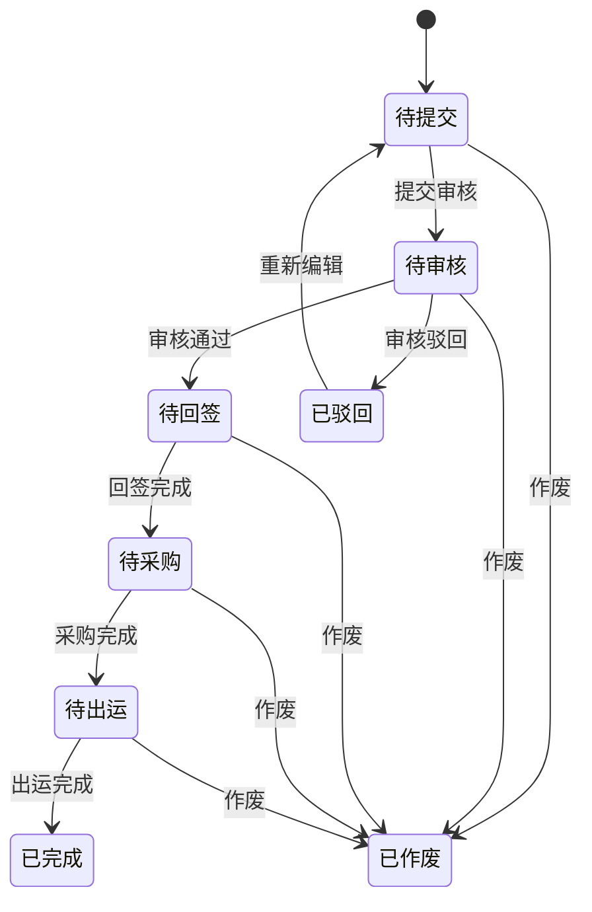

# 销售合同API

<cite>
**本文档引用的文件**   
- [SaleContractApi.java](file://eplus-module-sms/eplus-module-sms-api/src/main/java/com/syj/eplus/module/sms/api/SaleContractApi.java)
- [SaleContractDTO.java](file://eplus-module-sms/eplus-module-sms-api/src/main/java/com/syj/eplus/module/sms/api/dto/SaleContractDTO.java)
- [SaleContractSaveDTO.java](file://eplus-module-sms/eplus-module-sms-api/src/main/java/com/syj/eplus/module/sms/api/dto/SaleContractSaveDTO.java)
- [SaleContractItemSaveDTO.java](file://eplus-module-sms/eplus-module-sms-api/src/main/java/com/syj/eplus/module/sms/api/dto/SaleContractItemSaveDTO.java)
- [SaleContractStatusEnum.java](file://eplus-framework/eplus-common/src/main/java/com/syj/eplus/framework/common/enums/SaleContractStatusEnum.java)
- [DomesticSaleContractController.java](file://eplus-module-sms/eplus-module-sms-biz/src/main/java/com/syj/eplus/module/sms/controller/admin/salecontract/DomesticSaleContractController.java)
- [ExportSaleContractController.java](file://eplus-module-sms/eplus-module-sms-biz/src/main/java/com/syj/eplus/module/sms/controller/admin/salecontract/ExportSaleContractController.java)
- [FactorySaleContractController.java](file://eplus-module-sms/eplus-module-sms-biz/src/main/java/com/syj/eplus/module/sms/controller/admin/salecontract/FactorySaleContractController.java)
- [SaleContractSaveReqVO.java](file://eplus-module-sms/eplus-module-sms-biz/src/main/java/com/syj/eplus/module/sms/controller/admin/salecontract/vo/SaleContractSaveReqVO.java)
- [SaleContractDetailReq.java](file://eplus-module-sms/eplus-module-sms-biz/src/main/java/com/syj/eplus/module/sms/controller/admin/salecontract/vo/SaleContractDetailReq.java)
- [CloseSaleContractReq.java](file://eplus-module-sms/eplus-module-sms-biz/src/main/java/com/syj/eplus/module/sms/controller/admin/salecontract/vo/CloseSaleContractReq.java)
</cite>

## 目录
1. [简介](#简介)
2. [销售合同数据模型](#销售合同数据模型)
3. [核心操作API](#核心操作api)
4. [合同状态机与审批流程](#合同状态机与审批流程)
5. [权限控制](#权限控制)
6. [错误码说明](#错误码说明)
7. [集成点说明](#集成点说明)

## 简介

销售合同API提供了一套完整的销售合同管理功能，支持内销合同、外销合同和外币采购合同的创建、查询、修改、删除等核心操作。系统实现了完整的合同生命周期管理，包括合同创建、审批、回签、变更和关闭等状态转换。API通过RESTful接口提供服务，支持分页查询、批量操作和数据导出等功能。合同数据模型设计灵活，支持多级审批流程和复杂的业务规则，能够满足不同业务场景的需求。

**本文档引用的文件**  
- [DomesticSaleContractController.java](file://eplus-module-sms/eplus-module-sms-biz/src/main/java/com/syj/eplus/module/sms/controller/admin/salecontract/DomesticSaleContractController.java)
- [ExportSaleContractController.java](file://eplus-module-sms/eplus-module-sms-biz/src/main/java/com/syj/eplus/module/sms/controller/admin/salecontract/ExportSaleContractController.java)
- [FactorySaleContractController.java](file://eplus-module-sms/eplus-module-sms-biz/src/main/java/com/syj/eplus/module/sms/controller/admin/salecontract/FactorySaleContractController.java)

## 销售合同数据模型

销售合同数据模型包含合同主信息和合同明细两个层级。主信息包含合同的基本属性、客户信息、财务信息和状态信息，明细信息包含产品信息、价格信息和库存信息。

### 主要字段说明

| 字段名称 | 数据类型 | 是否必填 | 业务含义 |
|---------|--------|--------|--------|
| id | Long | 是 | 合同主键 |
| code | String | 是 | 合同编号 |
| status | Integer | 是 | 合同状态 |
| auditStatus | Integer | 是 | 审核状态 |
| confirmFlag | Integer | 是 | 确认状态 |
| companyId | Long | 是 | 内部法人单位主键 |
| custId | Long | 是 | 客户主键 |
| currency | String | 是 | 交易币别 |
| settlementId | Long | 是 | 收款方式主键 |
| custCountryId | Long | 是 | 客户国别主键 |
| departureCountryId | Long | 是 | 出运国主键 |
| departurePortId | Long | 是 | 出运口岸主键 |
| destinationPortId | Long | 是 | 目的口岸主键 |
| transportType | Integer | 是 | 运输方式 |
| custDeliveryDate | LocalDateTime | 是 | 客户交期 |
| totalQuantity | Integer | 是 | 数量合计 |
| totalGoodsValue | JsonAmount | 是 | 货值合计 |
| orderGrossProfit | JsonAmount | 是 | 订单毛利 |
| grossProfitMargin | BigDecimal | 是 | 毛利率 |
| receivableExchange | JsonAmount | 是 | 应收汇款 |
| saleType | Integer | 是 | 销售合同类型 |

### 合同明细字段说明

| 字段名称 | 数据类型 | 是否必填 | 业务含义 |
|---------|--------|--------|--------|
| id | Long | 是 | 明细主键 |
| contractId | Long | 是 | 所属合同主键 |
| skuCode | String | 是 | 产品编号 |
| name | String | 是 | 中文品名 |
| nameEng | String | 是 | 英文品名 |
| quantity | Integer | 是 | 数量 |
| unitPrice | JsonAmount | 是 | 销售单价 |
| totalSaleAmount | JsonAmount | 是 | 外销总金额 |
| purchaseUnitPrice | JsonAmount | 是 | 采购单价 |
| purchaseWithTaxPrice | JsonAmount | 是 | 含税总价 |
| venderName | String | 是 | 供应商名称 |
| venderId | String | 是 | 供应商主键 |
| commissionType | Integer | 是 | 佣金类型 |
| commissionRate | BigDecimal | 是 | 佣金比例 |
| commissionAmount | JsonAmount | 是 | 佣金金额 |
| inventoryQuantity | Integer | 是 | 库存 |
| currentLockQuantity | Integer | 是 | 锁定数量 |
| needPurQuantity | Integer | 是 | 待采购数量 |
| unit | String | 是 | 单位 |
| venderDeliveryDate | LocalDateTime | 是 | 工厂交期 |
| qtyPerOuterbox | Integer | 是 | 外箱装量 |
| qtyPerInnerbox | Integer | 是 | 内盒装量 |
| boxCount | Integer | 是 | 箱数 |
| volume | BigDecimal | 是 | 体积 |
| hsCode | String | 是 | 海关编码 |
| taxRefundRate | BigDecimal | 是 | 退税率 |
| taxRefundPrice | JsonAmount | 是 | 退税金额 |
| billStatus | Integer | 是 | 入库状态 |

**本文档引用的文件**  
- [SaleContractDTO.java](file://eplus-module-sms/eplus-module-sms-api/src/main/java/com/syj/eplus/module/sms/api/dto/SaleContractDTO.java)
- [SaleContractItemSaveDTO.java](file://eplus-module-sms/eplus-module-sms-api/src/main/java/com/syj/eplus/module/sms/api/dto/SaleContractItemSaveDTO.java)

## 核心操作API

### 合同创建

#### 创建内销合同
- **HTTP方法**: POST
- **URL路径**: `/sms/domestic/sale-contract/create`
- **权限要求**: `sms:domestic-sale-contract:create`

#### 创建外销合同
- **HTTP方法**: POST
- **URL路径**: `/sms/export/sale-contract/create`
- **权限要求**: `sms:export-sale-contract:create`

#### 创建外币采购合同
- **HTTP方法**: POST
- **URL路径**: `/sms/factory/sale-contract/create`
- **权限要求**: `sms:factory-sale-contract:create`

**请求体JSON结构 (SaleContractSaveReqVO)**

```json
{
  "companyId": 12365,
  "companyName": "公司名称",
  "companyPath": {
    "path": ["公司1", "公司2"]
  },
  "custId": 1001,
  "custCode": "CUST001",
  "custName": "客户名称",
  "currency": "USD",
  "settlementId": 2001,
  "settlementName": "收款方式",
  "custCountryId": 3001,
  "custCountryName": "美国",
  "departureCountryId": 3001,
  "departureCountryName": "中国",
  "departurePortId": 4001,
  "departurePortName": "上海港",
  "destinationPortId": 4002,
  "destinationPortName": "洛杉矶港",
  "transportType": 1,
  "custDeliveryDate": "2024-12-31T00:00:00",
  "totalQuantity": 1000,
  "totalGoodsValue": {
    "amount": 100000,
    "currency": "USD"
  },
  "orderGrossProfit": {
    "amount": 20000,
    "currency": "USD"
  },
  "grossProfitMargin": 0.2,
  "receivableExchange": {
    "amount": 100000,
    "currency": "USD"
  },
  "saleType": 1,
  "children": [
    {
      "skuCode": "SKU001",
      "name": "产品1",
      "nameEng": "Product 1",
      "quantity": 500,
      "unitPrice": {
        "amount": 100,
        "currency": "USD"
      },
      "totalSaleAmount": {
        "amount": 50000,
        "currency": "USD"
      },
      "purchaseUnitPrice": {
        "amount": 80,
        "currency": "USD"
      },
      "venderName": "供应商1",
      "venderId": "VEND001"
    }
  ]
}
```

**正常响应示例**

```json
{
  "code": 0,
  "msg": "成功",
  "data": [
    {
      "id": 5001,
      "code": "SC20240001"
    }
  ]
}
```

### 合同查询

#### 查询内销合同
- **HTTP方法**: GET
- **URL路径**: `/sms/domestic/sale-contract/detail`
- **查询参数**: `id` (合同主键)
- **权限要求**: `sms:domestic-sale-contract:query`

#### 查询外销合同
- **HTTP方法**: GET
- **URL路径**: `/sms/export/sale-contract/detail`
- **查询参数**: `id` (合同主键)
- **权限要求**: `sms:export-sale-contract:query`

#### 查询外币采购合同
- **HTTP方法**: GET
- **URL路径**: `/sms/factory/sale-contract/detail`
- **查询参数**: `id` (合同主键)
- **权限要求**: `sms:factory-sale-contract:query`

**请求参数 (SaleContractDetailReq)**

| 参数名称 | 数据类型 | 是否必填 | 业务含义 |
|---------|--------|--------|--------|
| id | Long | 是 | 合同主键 |

**正常响应示例**

```json
{
  "code": 0,
  "msg": "成功",
  "data": {
    "id": 5001,
    "code": "SC20240001",
    "status": 2,
    "auditStatus": 1,
    "confirmFlag": 1,
    "companyId": 12365,
    "custId": 1001,
    "currency": "USD",
    "totalQuantity": 1000,
    "totalGoodsValue": {
      "amount": 100000,
      "currency": "USD"
    },
    "orderGrossProfit": {
      "amount": 20000,
      "currency": "USD"
    },
    "children": [
      {
        "id": 6001,
        "skuCode": "SKU001",
        "name": "产品1",
        "quantity": 500,
        "unitPrice": {
          "amount": 100,
          "currency": "USD"
        }
      }
    ]
  }
}
```

### 合同修改

#### 修改内销合同
- **HTTP方法**: PUT
- **URL路径**: `/sms/domestic/sale-contract/update`
- **权限要求**: `sms:domestic-sale-contract:update`

#### 修改外销合同
- **HTTP方法**: PUT
- **URL路径**: `/sms/export/sale-contract/update`
- **权限要求**: `sms:export-sale-contract:update`

#### 修改外币采购合同
- **HTTP方法**: PUT
- **URL路径**: `/sms/factory/sale-contract/update`
- **权限要求**: `sms:factory-sale-contract:update`

**请求体JSON结构 (SaleContractSaveReqVO)**

```json
{
  "id": 5001,
  "code": "SC20240001",
  "totalQuantity": 1200,
  "totalGoodsValue": {
    "amount": 120000,
    "currency": "USD"
  },
  "children": [
    {
      "id": 6001,
      "quantity": 600,
      "unitPrice": {
        "amount": 100,
        "currency": "USD"
      }
    }
  ]
}
```

**正常响应示例**

```json
{
  "code": 0,
  "msg": "成功",
  "data": true
}
```

### 合同删除

#### 删除内销合同
- **HTTP方法**: DELETE
- **URL路径**: `/sms/domestic/sale-contract/delete`
- **查询参数**: `id` (合同主键)
- **权限要求**: `sms:domestic-sale-contract:delete`

#### 删除外销合同
- **HTTP方法**: DELETE
- **URL路径**: `/sms/export/sale-contract/delete`
- **查询参数**: `id` (合同主键)
- **权限要求**: `sms:export-sale-contract:delete`

#### 删除外币采购合同
- **HTTP方法**: DELETE
- **URL路径**: `/sms/factory/sale-contract/delete`
- **查询参数**: `id` (合同主键)
- **权限要求**: `sms:factory-sale-contract:delete`

**正常响应示例**

```json
{
  "code": 0,
  "msg": "成功",
  "data": true
}
```

**本文档引用的文件**  
- [DomesticSaleContractController.java](file://eplus-module-sms/eplus-module-sms-biz/src/main/java/com/syj/eplus/module/sms/controller/admin/salecontract/DomesticSaleContractController.java)
- [ExportSaleContractController.java](file://eplus-module-sms/eplus-module-sms-biz/src/main/java/com/syj/eplus/module/sms/controller/admin/salecontract/ExportSaleContractController.java)
- [FactorySaleContractController.java](file://eplus-module-sms/eplus-module-sms-biz/src/main/java/com/syj/eplus/module/sms/controller/admin/salecontract/FactorySaleContractController.java)
- [SaleContractSaveReqVO.java](file://eplus-module-sms/eplus-module-sms-biz/src/main/java/com/syj/eplus/module/sms/controller/admin/salecontract/vo/SaleContractSaveReqVO.java)

## 合同状态机与审批流程

销售合同系统实现了完整的状态机管理，支持合同从创建到完成的完整生命周期。

### 合同状态定义

```java
public enum SaleContractStatusEnum {
    WAITING_FOR_SUBMISSION(1, "待提交"),
    WAITING_FOR_APPROVAL(2, "待审核"),
    WAITING_FOR_COUNTERSIGNATURE(3, "待回签"),
    REJECTED(4, "已驳回"),
    WAITING_FOR_PROCUREMENT(5, "待采购"),
    WAITING_FOR_SHIPMENT(6, "待出运"),
    COMPLETED(7, "已完成"),
    CASE_CLOSED(8, "已作废");
}
```

### 状态转换流程



**图示来源**  
- [SaleContractStatusEnum.java](file://eplus-framework/eplus-common/src/main/java/com/syj/eplus/framework/common/enums/SaleContractStatusEnum.java)

### 审批接口

#### 提交审批
- **HTTP方法**: PUT
- **URL路径**: 
  - 内销合同: `/sms/domestic/sale-contract/submit`
  - 外销合同: `/sms/export/sale-contract/submit`
  - 外币采购合同: `/sms/factory/sale-contract/submit`
- **查询参数**: `contactId` (合同主键)
- **权限要求**: `sms:domestic-sale-contract:submit`, `sms:export-sale-contract:submit`, `sms:factory-sale-contract:submit`

#### 审批通过
- **HTTP方法**: PUT
- **URL路径**: 
  - 内销合同: `/sms/domestic/sale-contract/approve`
  - 外销合同: `/sms/export/sale-contract/approve`
  - 外币采购合同: `/sms/factory/sale-contract/approve`
- **请求体**: BpmTaskApproveReqDTO
- **权限要求**: `sms:domestic-sale-contract:audit`, `sms:export-sale-contract:audit`, `sms:factory-sale-contract:audit`

#### 审批驳回
- **HTTP方法**: PUT
- **URL路径**: 
  - 内销合同: `/sms/domestic/sale-contract/reject`
  - 外销合同: `/sms/export/sale-contract/reject`
  - 外币采购合同: `/sms/factory/sale-contract/reject`
- **请求体**: BpmTaskRejectReqDTO
- **权限要求**: `sms:domestic-sale-contract:audit`, `sms:export-sale-contract:audit`, `sms:factory-sale-contract:audit`

**本文档引用的文件**  
- [DomesticSaleContractController.java](file://eplus-module-sms/eplus-module-sms-biz/src/main/java/com/syj/eplus/module/sms/controller/admin/salecontract/DomesticSaleContractController.java)
- [ExportSaleContractController.java](file://eplus-module-sms/eplus-module-sms-biz/src/main/java/com/syj/eplus/module/sms/controller/admin/salecontract/ExportSaleContractController.java)
- [FactorySaleContractController.java](file://eplus-module-sms/eplus-module-sms-biz/src/main/java/com/syj/eplus/module/sms/controller/admin/salecontract/FactorySaleContractController.java)
- [SaleContractStatusEnum.java](file://eplus-framework/eplus-common/src/main/java/com/syj/eplus/framework/common/enums/SaleContractStatusEnum.java)

## 权限控制

销售合同API实现了细粒度的权限控制，不同操作需要不同的权限码。

### 权限码说明

| 权限码 | 操作说明 |
|-------|--------|
| sms:domestic-sale-contract:create | 创建内销合同 |
| sms:domestic-sale-contract:update | 修改内销合同 |
| sms:domestic-sale-contract:delete | 删除内销合同 |
| sms:domestic-sale-contract:query | 查询内销合同 |
| sms:domestic-sale-contract:export | 导出内销合同 |
| sms:domestic-sale-contract:print | 打印内销合同 |
| sms:domestic-sale-contract:submit | 提交内销合同审批 |
| sms:domestic-sale-contract:audit | 审批内销合同 |
| sms:export-sale-contract:create | 创建外销合同 |
| sms:export-sale-contract:update | 修改外销合同 |
| sms:export-sale-contract:delete | 删除外销合同 |
| sms:export-sale-contract:query | 查询外销合同 |
| sms:export-sale-contract:export | 导出外销合同 |
| sms:export-sale-contract:print | 打印外销合同 |
| sms:export-sale-contract:submit | 提交外销合同审批 |
| sms:export-sale-contract:audit | 审批外销合同 |
| sms:factory-sale-contract:create | 创建外币采购合同 |
| sms:factory-sale-contract:update | 修改外币采购合同 |
| sms:factory-sale-contract:delete | 删除外币采购合同 |
| sms:factory-sale-contract:query | 查询外币采购合同 |
| sms:factory-sale-contract:submit | 提交外币采购合同审批 |
| sms:factory-sale-contract:audit | 审批外币采购合同 |

**本文档引用的文件**  
- [DomesticSaleContractController.java](file://eplus-module-sms/eplus-module-sms-biz/src/main/java/com/syj/eplus/module/sms/controller/admin/salecontract/DomesticSaleContractController.java)
- [ExportSaleContractController.java](file://eplus-module-sms/eplus-module-sms-biz/src/main/java/com/syj/eplus/module/sms/controller/admin/salecontract/ExportSaleContractController.java)
- [FactorySaleContractController.java](file://eplus-module-sms/eplus-module-sms-biz/src/main/java/com/syj/eplus/module/sms/controller/admin/salecontract/FactorySaleContractController.java)

## 错误码说明

### 常见错误码

| 错误码 | 错误信息 | 解决方案 |
|-------|--------|--------|
| 400 | 请求参数错误 | 检查请求参数是否符合要求，确保必填字段不为空 |
| 401 | 未授权访问 | 检查用户是否登录，权限是否足够 |
| 403 | 禁止访问 | 检查用户是否有执行该操作的权限 |
| 404 | 资源不存在 | 检查合同ID是否正确，资源是否已被删除 |
| 409 | 资源冲突 | 检查合同编号是否重复，状态是否允许操作 |
| 500 | 服务器内部错误 | 联系系统管理员，检查服务器日志 |

### 业务错误码

| 错误码 | 错误信息 | 解决方案 |
|-------|--------|--------|
| CONTRACT_CODE_EXISTS | 合同编号已存在 | 使用不同的合同编号 |
| CUSTOMER_INVALID | 客户信息无效 | 检查客户信息是否正确，客户是否存在 |
| CURRENCY_REQUIRED | 交易币别不能为空 | 确保交易币别字段不为空 |
| SETTLEMENT_REQUIRED | 收款方式不能为空 | 确保收款方式字段不为空 |
| COUNTRY_REQUIRED | 客户国别不能为空 | 确保客户国别字段不为空 |
| PORT_REQUIRED | 出运口岸不能为空 | 确保出运口岸字段不为空 |
| QUANTITY_REQUIRED | 数量不能为空 | 确保数量字段不为空 |
| PRICE_REQUIRED | 价格不能为空 | 确保价格字段不为空 |
| STATUS_NOT_ALLOWED | 当前状态不允许此操作 | 检查合同当前状态，确认是否可以执行该操作 |
| APPROVAL_IN_PROGRESS | 审批中，不能修改 | 等待审批完成后再进行修改 |
| CONTRACT_CLOSED | 合同已作废，不能操作 | 不能对已作废的合同进行操作 |

**本文档引用的文件**  
- [SaleContractApi.java](file://eplus-module-sms/eplus-module-sms-api/src/main/java/com/syj/eplus/module/sms/api/SaleContractApi.java)
- [DomesticSaleContractController.java](file://eplus-module-sms/eplus-module-sms-biz/src/main/java/com/syj/eplus/module/sms/controller/admin/salecontract/DomesticSaleContractController.java)

## 集成点说明

销售合同系统与其他模块有多个集成点，支持业务流程的自动化和数据同步。

### 与库存模块集成

销售合同系统与库存模块集成，实现库存锁定和库存查询功能。当创建或修改销售合同时，系统会自动锁定相应产品的库存。用户可以通过API查询销售明细的库存信息。

**集成接口**:
- 获取销售明细库存信息: `GET /sms/export/sale-contract/get-item-stock`

### 与财务模块集成

销售合同系统与财务模块集成，实现收款计划同步和财务数据回写功能。当合同状态变更时，系统会将相关信息回写到财务模块，确保财务数据的准确性。

**集成接口**:
- 认领回写收款计划及加项: `SaleContractApi.writeBackContract()`

### 与采购模块集成

销售合同系统与采购模块集成，实现采购计划生成和采购合同创建功能。当销售合同需要采购时，系统可以自动生成采购计划和采购合同。

**集成接口**:
- 生成订单路径中的购销合同: `SaleContractApi.generateContract()`
- 批量更新销售合同转采购计划标识: `SaleContractApi.batchUpdatePurchaseFlag()`

### 与出运模块集成

销售合同系统与出运模块集成，实现出运数量回写和出运计划同步功能。当货物出运时，系统会将出运数量回写到销售合同中。

**集成接口**:
- 回写出运数量: `SaleContractApi.updateShipmentQuantity()`
- 批量更新销售合同转出运标识: `SaleContractApi.batchUpdateConvertShipmentFlag()`

**本文档引用的文件**  
- [SaleContractApi.java](file://eplus-module-sms/eplus-module-sms-api/src/main/java/com/syj/eplus/module/sms/api/SaleContractApi.java)
- [ExportSaleContractController.java](file://eplus-module-sms/eplus-module-sms-biz/src/main/java/com/syj/eplus/module/sms/controller/admin/salecontract/ExportSaleContractController.java)