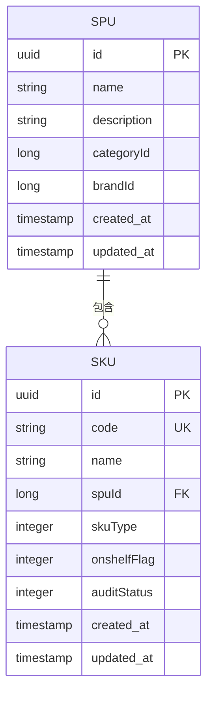
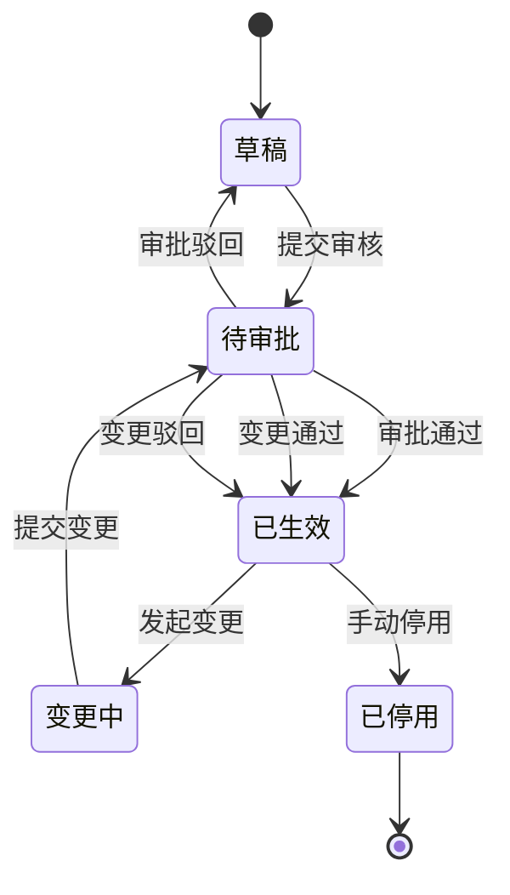
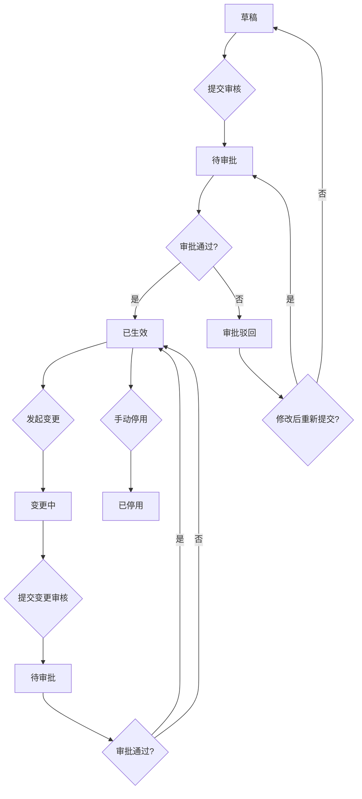
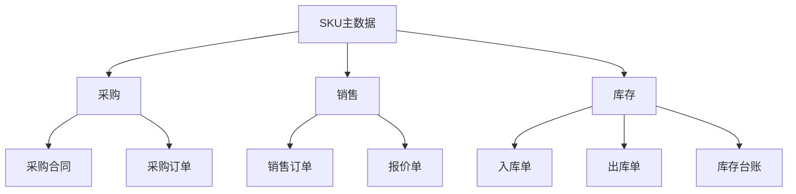

# SKU基础管理

<cite>
**本文档引用文件**  
- [SkuApi.java](file://eplus-module-pms/eplus-module-pms-api/src/main/java/com/syj/eplus/module/pms/api/sku/SkuApi.java)
- [SkuDTO.java](file://eplus-module-pms/eplus-module-pms-api/src/main/java/com/syj/eplus/module/pms/api/sku/dto/SkuDTO.java)
- [SkuSaveReqVO.java](file://eplus-module-pms/eplus-module-pms-biz/src/main/java/com/syj/eplus/module/pms/controller/admin/sku/vo/SkuSaveReqVO.java)
- [SkuController.java](file://eplus-module-pms/eplus-module-pms-biz/src/main/java/com/syj/eplus/module/pms/controller/admin/sku/SkuController.java)
- [SkuService.java](file://eplus-module-pms/eplus-module-pms-biz/src/main/java/com/syj/eplus/module/pms/service/sku/SkuService.java)
- [SkuDO.java](file://eplus-module-pms/eplus-module-pms-biz/src/main/java/com/syj/eplus/module/pms/dal/dataobject/sku/SkuDO.java)
- [SkuMapper.xml](file://eplus-module-pms/eplus-module-pms-biz/src/main/resources/mapper/SkuMapper.xml)
</cite>

## 目录
1. [简介](#简介)
2. [SKU数据模型](#sku数据模型)
3. [SKU与SPU关系](#sku与spu关系)
4. [SKU生命周期管理](#sku生命周期管理)
5. [SKU基础操作API](#sku基础操作api)
6. [审批流程与状态变更](#审批流程与状态变更)
7. [业务流程集成](#业务流程集成)

## 简介

SKU（Stock Keeping Unit）是库存管理的最小单位，代表具有特定属性组合的可销售产品。本系统中的SKU管理模块提供了完整的SKU创建、编辑、查询和生命周期管理功能，支持自营产品、客户产品、组合产品等多种业务形态。SKU信息贯穿采购、销售、库存等核心业务流程，是企业数字化运营的重要基础数据。

**本文档引用文件**  
- [SkuApi.java](file://eplus-module-pms/eplus-module-pms-api/src/main/java/com/syj/eplus/module/pms/api/sku/SkuApi.java)
- [SkuDTO.java](file://eplus-module-pms/eplus-module-pms-api/src/main/java/com/syj/eplus/module/pms/api/sku/dto/SkuDTO.java)

## SKU数据模型

SKU数据模型定义了产品核心属性，包含基本信息、规格参数、计量单位、采购与销售信息等关键字段。

### 核心字段定义

| 字段名称 | 字段代码 | 数据类型 | 说明 |
|---------|--------|--------|------|
| 主键 | id | Long | 唯一标识符 |
| 商品编码 | code | String | 唯一产品编码 |
| 名称 | name | String | 产品中文名称 |
| 英文名称 | nameEng | String | 产品英文名称 |
| 条码 | barcode | String | 产品条形码 |
| 产品状态 | onshelfFlag | Integer | 0:草稿, 1:已生效, 2:已停用 |
| 审核状态 | auditStatus | Integer | 审批流程状态 |
| SPU ID | spuId | Long | 所属SPU标识 |
| 品牌ID | brandId | Long | 品牌关联标识 |
| 产品分类 | categoryId | Long | 分类树节点ID |
| 海关编码ID | hsCodeId | Long | 报关用HS编码 |
| 产品来源 | sourceFlag | Integer | 产品获取渠道 |
| 产品类型 | skuType | Integer | 1:基础, 2:组合, 3:客户, 4:自营 |
| 产品材质 | material | String | 主要材料成分 |
| 计量单位 | measureUnit | Integer | 销售计量单位 |
| 单品规格长 | specLength | BigDecimal | 长度（cm） |
| 单品规格宽 | specWidth | BigDecimal | 宽度（cm） |
| 单品规格高 | specHeight | BigDecimal | 高度（cm） |
| 单品净重 | singleNetweight | JsonWeight | 净重信息 |
| 销售单价 | price | JsonAmount | 销售价格 |
| 公司定价 | companyPrice | JsonAmount | 内部定价 |
| 附件 | annex | List<SimpleFile> | 关联文件列表 |
| 图片 | picture | List<SimpleFile> | 产品图片集 |
| 缩略图 | thumbnail | String | 缩略图URL |
| 是否优势产品 | advantageFlag | Integer | 1:是, 0:否 |

**本文档引用文件**  
- [SkuDTO.java](file://eplus-module-pms/eplus-module-pms-api/src/main/java/com/syj/eplus/module/pms/api/sku/dto/SkuDTO.java)
- [SkuDO.java](file://eplus-module-pms/eplus-module-pms-biz/src/main/java/com/syj/eplus/module/pms/dal/dataobject/sku/SkuDO.java)

## SKU与SPU关系

SKU与SPU（Standard Product Unit）构成产品管理体系的核心关系。SPU代表产品标准单元，定义产品的基本属性和分类；SKU则是在SPU基础上，通过规格、颜色、包装等维度组合形成的可销售库存单元。



**图源**  
- [SkuDO.java](file://eplus-module-pms/eplus-module-pms-biz/src/main/java/com/syj/eplus/module/pms/dal/dataobject/sku/SkuDO.java)

## SKU生命周期管理

SKU的生命周期包含创建、审批、生效、变更、停用等关键阶段，通过状态机进行严格管控。

### 生命周期状态



**图源**  
- [SkuDO.java](file://eplus-module-pms/eplus-module-pms-biz/src/main/java/com/syj/eplus/module/pms/dal/dataobject/sku/SkuDO.java)
- [SkuService.java](file://eplus-module-pms/eplus-module-pms-biz/src/main/java/com/syj/eplus/module/pms/service/sku/SkuService.java)

## SKU基础操作API

提供标准化的RESTful API接口，支持SKU的增删改查操作。

### 创建SKU

**请求路径**：`POST /pms/sku`

**请求参数**：
```json
{
  "name": "产品名称",
  "nameEng": "Product Name",
  "code": "SKU001",
  "barcode": "1234567890123",
  "spuId": 1001,
  "categoryId": 2001,
  "brandId": 3001,
  "skuType": 1,
  "measureUnit": 1,
  "specLength": 10.5,
  "specWidth": 8.2,
  "specHeight": 5.0,
  "singleNetweight": {
    "value": 1.2,
    "unit": "kg"
  },
  "price": {
    "amount": 99.99,
    "currency": "CNY"
  }
}
```

**响应格式**：
```json
{
  "code": 0,
  "data": {
    "id": 4001,
    "code": "SKU001"
  },
  "msg": "成功"
}
```

### 更新SKU

**请求路径**：`PUT /pms/sku`

**请求参数**：
```json
{
  "id": 4001,
  "name": "更新后的产品名称",
  "price": {
    "amount": 89.99,
    "currency": "CNY"
  }
}
```

### 查询SKU列表

**请求路径**：`GET /pms/sku/page`

**请求参数**：
- `name`: 产品名称（模糊查询）
- `code`: 商品编码
- `categoryId`: 分类ID
- `pageNum`: 页码
- `pageSize`: 每页数量

**响应格式**：
```json
{
  "code": 0,
  "data": {
    "list": [
      {
        "id": 4001,
        "name": "产品名称",
        "code": "SKU001",
        "price": {
          "amount": 99.99,
          "currency": "CNY"
        }
      }
    ],
    "total": 1
  },
  "msg": "成功"
}
```

**本文档引用文件**  
- [SkuController.java](file://eplus-module-pms/eplus-module-pms-biz/src/main/java/com/syj/eplus/module/pms/controller/admin/sku/SkuController.java)
- [SkuService.java](file://eplus-module-pms/eplus-module-pms-biz/src/main/java/com/syj/eplus/module/pms/service/sku/SkuService.java)
- [SkuSaveReqVO.java](file://eplus-module-pms/eplus-module-pms-biz/src/main/java/com/syj/eplus/module/pms/controller/admin/sku/vo/SkuSaveReqVO.java)

## 审批流程与状态变更

SKU管理采用工作流驱动的审批机制，确保数据变更的合规性和可追溯性。

### 审批流程配置

| 流程类型 | 流程标识 | 说明 |
|---------|--------|------|
| 新建SKU | pms_sku_create | 基础产品创建审批 |
| 变更SKU | pms_sku_change | 产品信息变更审批 |
| 客户产品 | pms_csku_create | 客户专属产品审批 |
| 自营产品 | pms_ownsku_create | 自营品牌产品审批 |
| 辅料产品 | pms_auxiliary_create | 通用辅料产品审批 |

### 状态转换规则



**图源**  
- [SkuService.java](file://eplus-module-pms/eplus-module-pms-biz/src/main/java/com/syj/eplus/module/pms/service/sku/SkuService.java)
- [SkuDO.java](file://eplus-module-pms/eplus-module-pms-biz/src/main/java/com/syj/eplus/module/pms/dal/dataobject/sku/SkuDO.java)

## 业务流程集成

SKU作为核心主数据，在采购、销售、库存等业务流程中发挥关键作用。

### 采购流程集成

在采购合同中引用SKU，自动带出产品规格、计量单位、采购价格等信息，确保采购数据的一致性。

### 销售流程集成

销售订单中选择SKU，系统自动校验库存可用性、价格有效性，并支持按客户专属SKU进行报价。

### 库存管理集成

库存台账以SKU为最小管理单元，支持按批次、序列号等维度进行精细化管理，实现库存的准确追溯。



**图源**  
- [SkuApi.java](file://eplus-module-pms/eplus-module-pms-api/src/main/java/com/syj/eplus/module/pms/api/sku/SkuApi.java)
- [SkuService.java](file://eplus-module-pms/eplus-module-pms-biz/src/main/java/com/syj/eplus/module/pms/service/sku/SkuService.java)