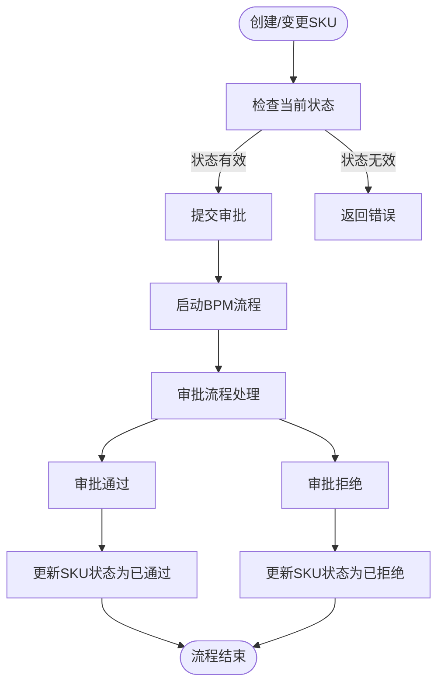
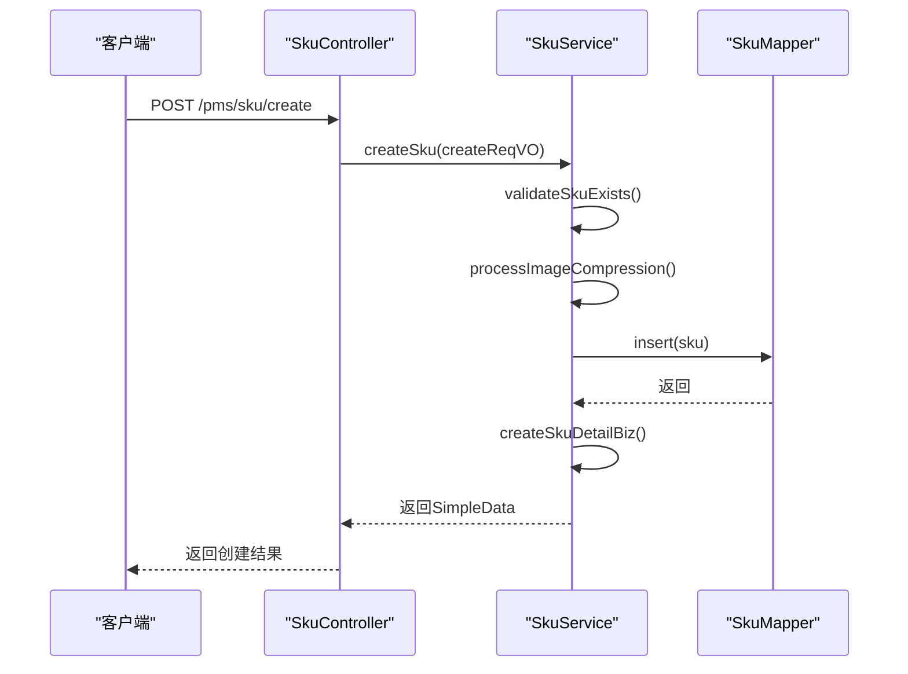

# SKU管理

<cite>
**本文档引用的文件**
- [SkuApi.java](file://eplus-module-pms/eplus-module-pms-api/src/main/java/com/syj/eplus/module/pms/api/sku/SkuApi.java)
- [SkuDTO.java](file://eplus-module-pms/eplus-module-pms-api/src/main/java/com/syj/eplus/module/pms/api/sku/dto/SkuDTO.java)
- [SkuDO.java](file://eplus-module-pms/eplus-module-pms-biz/src/main/java/com/syj/eplus/module/pms/dal/dataobject/sku/SkuDO.java)
- [SkuServiceImpl.java](file://eplus-module-pms/eplus-module-pms-biz/src/main/java/com/syj/eplus/module/pms/service/sku/SkuServiceImpl.java)
- [SkuService.java](file://eplus-module-pms/eplus-module-pms-biz/src/main/java/com/syj/eplus/module/pms/service/sku/SkuService.java)
- [SkuController.java](file://eplus-module-pms/eplus-module-pms-biz/src/main/java/com/syj/eplus/module/pms/controller/admin/sku/SkuController.java)
- [SkuInfoSaveReqVO.java](file://eplus-module-pms/eplus-module-pms-biz/src/main/java/com/syj/eplus/module/pms/controller/admin/sku/vo/SkuInfoSaveReqVO.java)
- [SkuDetailReq.java](file://eplus-module-pms/eplus-module-pms-biz/src/main/java/com/syj/eplus/module/pms/controller/admin/sku/vo/SkuDetailReq.java)
- [SimpleSkuDTO.java](file://eplus-module-pms/eplus-module-pms-api/src/main/java/com/syj/eplus/module/pms/api/sku/dto/SimpleSkuDTO.java)
</cite>

## 目录
1. [SKU数据模型](#sku数据模型)
2. [SKU与SPU关系](#sku与spu关系)
3. [SKU生命周期管理](#sku生命周期管理)
4. [SKU审批流程](#sku审批流程)
5. [SKU API接口文档](#sku-api接口文档)
6. [SKU在业务流程中的使用](#sku在业务流程中的使用)
7. [SKU数据同步机制](#sku数据同步机制)

## SKU数据模型

SKU（库存单位）是商品管理的最小单元，其数据模型包含以下核心字段：

### 基础信息
- **主键 (id)**: 唯一标识SKU的主键
- **商品编码 (code)**: 商品的唯一编码，用于系统内识别
- **名称 (name)**: 商品的中文名称
- **英文名称 (nameEng)**: 商品的英文名称
- **条码 (barcode)**: 商品的条形码信息
- **产品状态 (onshelfFlag)**: 标识产品是否上架销售
- **产品说明 (description)**: 产品的详细描述信息
- **产品说明英文 (descriptionEng)**: 产品的英文描述信息

### 分类与属性
- **spuId**: 关联的SPU（标准产品单元）主键
- **品牌id (brandId)**: 所属品牌标识
- **产品分类 (categoryId)**: 所属产品分类标识
- **产品来源 (sourceFlag)**: 产品来源类型
- **产品类型 (skuType)**: 产品类型，如普通产品、组合产品、配件等
- **产品材质 (material)**: 产品的主要材质
- **计量单位 (measureUnit)**: 产品的计量单位

### 规格参数
- **单品规格长 (specLength)**: 产品的长度
- **单品规格宽 (specWidth)**: 产品的宽度
- **单品规格高 (specHeight)**: 产品的高度
- **单品净重 (singleNetweight)**: 产品的净重，使用JsonWeight类型处理
- **加工备注 (processRemark)**: 加工过程中的特殊备注

### 商业信息
- **销售单价 (price)**: 产品的销售价格，使用JsonAmount类型处理货币信息
- **公司定价 (companyPrice)**: 公司内部定价
- **单位加工费 (singleProcessFee)**: 单位产品的加工费用
- **附件 (annex)**: 产品相关的附件文件列表
- **图片 (picture)**: 产品图片列表
- **缩略图 (thumbnail)**: 产品缩略图URL

### 客户与代理信息
- **客户编号 (custCode)**: 关联的客户编号
- **客户货号 (cskuCode)**: 客户指定的产品货号
- **自营产品货号 (oskuCode)**: 自营产品的货号
- **是否客户产品 (custProFlag)**: 标识是否为客户产品
- **是否自主品牌 (ownBrandFlag)**: 标识是否为自主品牌
- **是否代理产品 (agentFlag)**: 标识是否为代理产品
- **基础产品编号 (basicSkuCode)**: 基础产品的编号

### 状态与版本
- **审核状态 (auditStatus)**: 产品当前的审核状态
- **版本号 (ver)**: 产品版本号，用于版本控制
- **变更状态 (changeStatus)**: 变更流程中的状态
- **变更标识 (changeFlag)**: 标识产品是否处于变更流程中

**Section sources**
- [SkuDTO.java](file://eplus-module-pms/eplus-module-pms-api/src/main/java/com/syj/eplus/module/pms/api/sku/dto/SkuDTO.java#L22-L247)
- [SkuDO.java](file://eplus-module-pms/eplus-module-pms-biz/src/main/java/com/syj/eplus/module/pms/dal/dataobject/sku/SkuDO.java#L44-L327)

## SKU与SPU关系

SKU（库存单位）与SPU（标准产品单元）是商品管理系统中的两个核心概念，它们之间存在明确的层级关系。

SPU代表一类产品的抽象概念，是产品信息的集合体。例如，"iPhone 15 Pro"可以作为一个SPU，它包含了该系列产品的共同属性，如品牌、基本功能、设计风格等。SPU主要用于产品分类和信息管理。

SKU则是SPU的具体实例，代表了具有特定属性组合的可销售商品。继续以上述例子，"iPhone 15 Pro 256GB 钛金属色"就是一个具体的SKU。一个SPU可以衍生出多个SKU，这些SKU在颜色、容量、配置等维度上有所区别。

在系统实现中，SKU通过`spuId`字段与SPU建立关联。这种设计模式实现了产品信息的高效管理：
- SPU层存储产品的共性信息，避免重复
- SKU层存储产品的个性信息，支持精细化管理
- 通过SPU-SKU结构，可以快速查询某类产品下的所有具体型号

这种分层结构不仅提高了数据存储效率，还支持灵活的产品扩展和管理，是现代商品管理系统的基础架构。

**Section sources**
- [SkuDTO.java](file://eplus-module-pms/eplus-module-pms-api/src/main/java/com/syj/eplus/module/pms/api/sku/dto/SkuDTO.java#L38)
- [SkuDO.java](file://eplus-module-pms/eplus-module-pms-biz/src/main/java/com/syj/eplus/module/pms/dal/dataobject/sku/SkuDO.java#L87)

## SKU生命周期管理

SKU的生命周期管理涵盖了从创建到废弃的全过程，系统通过状态机模式对SKU的各个阶段进行精确控制。

### 生命周期阶段
SKU的生命周期主要包括以下几个阶段：
- **草稿状态**: SKU信息创建但未提交审核
- **审核中**: SKU信息已提交，等待审批流程处理
- **已审核**: SKU通过审批，可以用于业务操作
- **变更中**: SKU信息正在变更流程中
- **已废弃**: SKU被标记为废弃，不再使用

### 状态转换机制
系统通过`auditStatus`字段管理SKU的审核状态，其值对应不同的状态：
- `UNSUBMITTED(0)`: 未提交
- `PROCESS(1)`: 审核中
- `APPROVE(2)`: 已通过
- `REJECT(3)`: 已拒绝

变更流程通过`changeStatus`字段管理：
- `NOT_CHANGED(0)`: 未变更
- `IN_CHANGE(1)`: 变更中
- `CHANGED(2)`: 已变更

### 版本控制
系统采用版本号(`ver`)机制实现SKU的版本控制。每次对SKU进行变更操作时，系统会创建新版本的SKU记录，保留历史版本信息。这种设计确保了：
- 业务操作的可追溯性
- 历史数据的完整性
- 变更影响的可评估性

当SKU需要变更时，系统会检查是否存在更高版本的产品信息，避免版本冲突。

**Section sources**
- [SkuDO.java](file://eplus-module-pms/eplus-module-pms-biz/src/main/java/com/syj/eplus/module/pms/dal/dataobject/sku/SkuDO.java#L72-L83)
- [SkuServiceImpl.java](file://eplus-module-pms/eplus-module-pms-biz/src/main/java/com/syj/eplus/module/pms/service/sku/SkuServiceImpl.java#L753-L800)
- [SkuService.java](file://eplus-module-pms/eplus-module-pms-biz/src/main/java/com/syj/eplus/module/pms/service/sku/SkuService.java#L48-L49)

## SKU审批流程

SKU的审批流程是确保产品信息准确性和合规性的关键环节，系统实现了多类型审批流程的统一管理。

### 审批流程类型
系统定义了多种审批流程，通过`modelKey`字段进行区分：
- **基础SKU审批**: `pms_sku`
- **SKU变更审批**: `pms_change_sku`
- **客户产品审批**: `pms_csku`
- **自营产品审批**: `pms_own_brand`
- **辅料产品审批**: `pms_auxiliary_sku`

### 审批流程控制
审批流程通过以下机制实现：
1. **流程启动**: 调用`submitTask`系列方法启动相应流程
2. **审批处理**: 通过`approveTask`和`rejectTask`系列方法处理审批
3. **状态更新**: 审批结果通过`updateAuditStatus`方法更新SKU状态

### 审批权限
系统通过注解`@PreAuthorize`实现审批权限控制，确保只有具备相应权限的用户才能执行审批操作。例如，变更审批需要`pms:sku:change`等权限。

### 审批流程实现
审批流程的具体实现位于`SkuServiceImpl`类中，通过调用BPM（业务流程管理）系统的API实现流程的启动和处理。系统会根据SKU的类型和操作类型选择相应的流程定义。



**Diagram sources**
- [SkuServiceImpl.java](file://eplus-module-pms/eplus-module-pms-biz/src/main/java/com/syj/eplus/module/pms/service/sku/SkuServiceImpl.java#L125-L132)
- [SkuService.java](file://eplus-module-pms/eplus-module-pms-biz/src/main/java/com/syj/eplus/module/pms/service/sku/SkuService.java#L216-L221)

**Section sources**
- [SkuServiceImpl.java](file://eplus-module-pms/eplus-module-pms-biz/src/main/java/com/syj/eplus/module/pms/service/sku/SkuServiceImpl.java#L125-L132)
- [SkuService.java](file://eplus-module-pms/eplus-module-pms-biz/src/main/java/com/syj/eplus/module/pms/service/sku/SkuService.java#L216-L221)

## SKU API接口文档

SKU管理提供了完整的API接口，支持系统的集成和外部调用。

### 创建SKU
**接口**: `POST /pms/sku/create`  
**描述**: 创建新的SKU  
**请求参数**: SkuInfoSaveReqVO对象  
**响应**: SimpleData对象，包含新创建SKU的ID和编码

### 更新SKU
**接口**: `PUT /pms/sku/update`  
**描述**: 更新现有SKU信息  
**请求参数**: SkuInfoSaveReqVO对象  
**响应**: 无

### 查询SKU列表
**接口**: `GET /pms/sku/page`  
**描述**: 分页查询SKU列表  
**请求参数**: SkuPageReqVO对象  
**响应**: PageResult<SkuRespVO>对象

### 获取SKU详情
**接口**: `GET /pms/sku/get-simple-detail`  
**描述**: 获取SKU详细信息  
**请求参数**: skuCode（SKU编码）  
**响应**: SkuInfoRespVO对象

### 变更SKU
**接口**: `POST /pms/sku/change`  
**描述**: 变更SKU信息  
**请求参数**: SkuInfoSaveReqVO对象  
**响应**: SimpleData对象

### 获取变更影响
**接口**: `POST /pms/sku/change-effect`  
**描述**: 获取SKU变更的影响范围  
**请求参数**: SkuInfoSaveReqVO对象  
**响应**: ChangeEffectRespVO对象

### 批量查询
系统提供了多个批量查询接口，支持高效的数据获取：
- `getSimpleSkuDTOMap`: 根据ID列表获取SKU精简信息映射
- `getSkuDTOMap`: 根据ID列表获取SKU完整信息映射
- `getSkuNameCacheByCodeList`: 根据编码列表获取产品名称缓存



**Diagram sources**
- [SkuController.java](file://eplus-module-pms/eplus-module-pms-biz/src/main/java/com/syj/eplus/module/pms/controller/admin/sku/SkuController.java#L30-L99)
- [SkuServiceImpl.java](file://eplus-module-pms/eplus-module-pms-biz/src/main/java/com/syj/eplus/module/pms/service/sku/SkuServiceImpl.java#L528-L614)

**Section sources**
- [SkuApi.java](file://eplus-module-pms/eplus-module-pms-api/src/main/java/com/syj/eplus/module/pms/api/sku/SkuApi.java#L22-L197)
- [SkuService.java](file://eplus-module-pms/eplus-module-pms-biz/src/main/java/com/syj/eplus/module/pms/service/sku/SkuService.java#L27-L674)

## SKU在业务流程中的使用

SKU作为商品管理的核心单元，在采购、销售、库存等业务流程中扮演着关键角色。

### 采购流程
在采购流程中，SKU与供应商报价系统紧密集成：
- 每个SKU可以关联多个供应商的报价信息
- 通过`quoteitemList`字段存储供应商报价明细
- 支持比较不同供应商的价格、包装费、运费等成本

采购合同与SKU的关联通过`purchasecontractitem`模块实现，确保采购订单与具体产品的一致性。

### 销售流程
在销售流程中，SKU是销售合同的基础：
- 销售合同项(`salecontractitem`)直接引用SKU编码
- 支持基于SKU的定价策略和折扣计算
- 销售价格从SKU的`price`字段获取

系统通过`SaleContractApi`接口实现销售合同与SKU的集成，确保销售数据的准确性。

### 库存管理
在库存管理中，SKU是库存记录的基本单位：
- 每个库存记录对应一个具体的SKU
- 支持按SKU进行库存查询、调拨、盘点等操作
- 库存变动与SKU状态同步更新

WMS（仓库管理系统）通过`IStockApi`接口与SKU系统集成，实现库存数据的实时同步。

### 组合产品管理
系统支持组合产品的管理，通过`SkuBom`（物料清单）实现：
- 组合产品由多个子SKU组成
- 每个子SKU有相应的数量配比
- 支持多层次的组合结构

这种设计支持复杂产品的管理，如套装、礼盒等。

**Section sources**
- [SkuDTO.java](file://eplus-module-pms/eplus-module-pms-api/src/main/java/com/syj/eplus/module/pms/api/sku/dto/SkuDTO.java#L210-L218)
- [SkuServiceImpl.java](file://eplus-module-pms/eplus-module-pms-biz/src/main/java/com/syj/eplus/module/pms/service/sku/SkuServiceImpl.java#L424-L464)
- [SkuBomDO.java](file://eplus-module-pms/eplus-module-pms-biz/src/main/java/com/syj/eplus/module/pms/dal/dataobject/skubom/SkuBomDO.java)

## SKU数据同步机制

SKU数据需要与其他业务模块保持同步，系统通过多种机制确保数据的一致性。

### 实时同步
对于关键业务操作，系统采用实时同步机制：
- SKU创建/更新时，立即通知相关模块
- 使用事件驱动架构，通过消息队列实现异步通知
- 确保WMS、SCM等系统及时获取最新的SKU信息

### 批量同步
对于大量数据的同步，系统提供批量处理接口：
- 支持按条件批量导出SKU数据
- 提供数据校验机制，确保同步数据的完整性
- 支持断点续传，提高大容量数据同步的可靠性

### 数据一致性保障
系统通过以下机制保障数据一致性：
- **事务管理**: 关键操作使用@Transactional注解确保数据原子性
- **版本控制**: 通过版本号防止数据覆盖
- **变更追踪**: 记录所有变更操作，支持审计和回溯

### 同步接口
系统提供了标准化的同步接口：
- **WMS同步**: 通过`IStockApi`接口实现库存系统同步
- **SCM同步**: 通过采购合同、供应商管理接口实现供应链系统同步
- **CRM同步**: 通过客户产品管理接口实现客户关系系统同步

```mermaid
graph TB
subgraph "PMS"
SKU[SKU管理系统]
end
subgraph "WMS"
WMS[仓库管理系统]
end
subgraph "SCM"
SCM[供应链管理系统]
end
subgraph "CRM"
CRM[客户关系管理系统]
end
SKU --> |实时通知| WMS
SKU --> |批量导出| SCM
SKU --> |客户产品同步| CRM
WMS --> |库存反馈| SKU
SCM --> |采购反馈| SKU
CRM --> |客户反馈| SKU
```

**Diagram sources**
- [SkuServiceImpl.java](file://eplus-module-pms/eplus-module-pms-biz/src/main/java/com/syj/eplus/module/pms/service/sku/SkuServiceImpl.java#L170-L185)
- [SkuApi.java](file://eplus-module-pms/eplus-module-pms-api/src/main/java/com/syj/eplus/module/pms/api/sku/SkuApi.java#L22-L197)

**Section sources**
- [SkuServiceImpl.java](file://eplus-module-pms/eplus-module-pms-biz/src/main/java/com/syj/eplus/module/pms/service/sku/SkuServiceImpl.java#L170-L185)
- [SkuApi.java](file://eplus-module-pms/eplus-module-pms-api/src/main/java/com/syj/eplus/module/pms/api/sku/SkuApi.java#L22-L197)