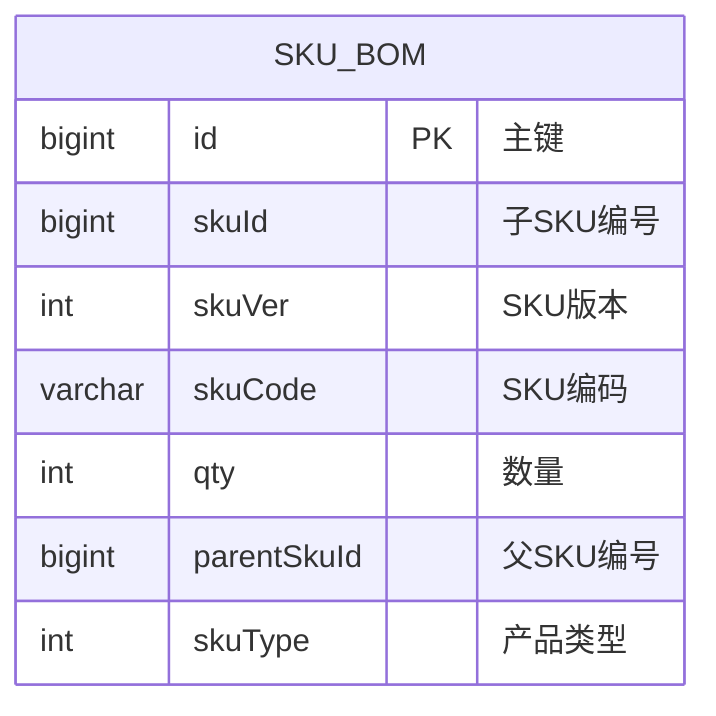
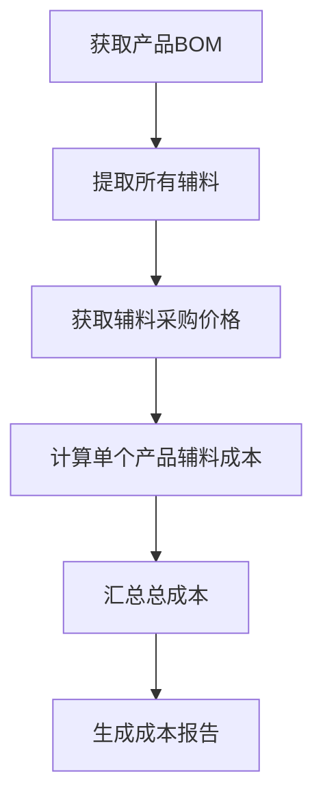
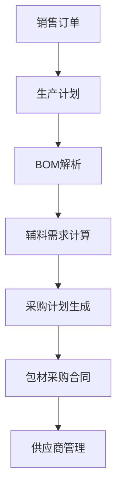

# SKU辅料管理

<cite>
**本文档引用文件**   
- [SkuBomDO.java](file://eplus-module-pms/eplus-module-pms-biz/src/main/java/com/syj/eplus/module/pms/dal/dataobject/skubom/SkuBomDO.java)
- [SkuBomDTO.java](file://eplus-module-pms/eplus-module-pms-api/src/main/java/com/syj/eplus/module/pms/api/sku/dto/SkuBomDTO.java)
- [SkuBomController.java](file://eplus-module-pms/eplus-module-pms-biz/src/main/java/com/syj/eplus/module/pms/controller/admin/skubom/SkuBomController.java)
- [SkuBomServiceImpl.java](file://eplus-module-pms/eplus-module-pms-biz/src/main/java/com/syj/eplus/module/pms/service/skubom/SkuBomServiceImpl.java)
- [SkuTypeEnum.java](file://eplus-framework/eplus-common/src/main/java/com/syj/eplus/framework/common/enums/SkuTypeEnum.java)
- [PurchasePlanServiceImpl.java](file://eplus-module-scm/eplus-module-scm-biz/src/main/java/com/syj/eplus/module/scm/service/purchaseplan/PurchasePlanServiceImpl.java)
- [V1_0_0_187__新建采购合同辅料分摊表表.sql](file://eplus-flyway/src/main/resources/db/migration/common/V1_0_0_187__新建采购合同辅料分摊表表.sql)
- [R__菜单相关.sql](file://eplus-flyway/src/main/resources/db/migration/common/R__菜单相关.sql)
</cite>

## 目录
1. [引言](#引言)
2. [SKU与辅料关联关系](#sku与辅料关联关系)
3. [辅料数据模型](#辅料数据模型)
4. [BOM中的辅料作用](#bom中的辅料作用)
5. [辅料管理API接口](#辅料管理api接口)
6. [采购与生产计划影响](#采购与生产计划影响)
7. [结论](#结论)

## 引言
SKU辅料管理是产品物料清单（BOM）管理的重要组成部分，用于定义产品与其所需辅料之间的关联关系。本系统通过BOM结构实现SKU与辅料的精确关联，支持产品成本核算、采购计划生成和生产计划制定。辅料作为产品制造过程中的必要组成部分，其管理直接影响到成本控制和供应链效率。

## SKU与辅料关联关系
SKU与辅料通过物料清单（BOM）进行关联管理。在系统中，每个父级SKU可以关联多个子SKU，其中子SKU的类型可以是辅料。这种关联关系通过`SkuBomDO`实体进行建模，包含父SKU编号（parentSkuId）和子SKU编号（skuId）字段来建立层级关系。

当一个SKU被定义为辅料类型时，它可以通过BOM结构被多个主产品SKU引用。这种设计支持辅料的通用化管理，即同一辅料可以用于多个不同产品的生产。系统通过`skuType`字段区分不同类型的SKU，其中辅料类型有专门的枚举值标识。

**Section sources**
- [SkuBomDO.java](file://eplus-module-pms/eplus-module-pms-biz/src/main/java/com/syj/eplus/module/pms/dal/dataobject/skubom/SkuBomDO.java#L48-L53)
- [SkuTypeEnum.java](file://eplus-framework/eplus-common/src/main/java/com/syj/eplus/framework/common/enums/SkuTypeEnum.java#L21)

## 辅料数据模型
辅料数据模型主要由`SkuBomDO`类定义，包含以下关键字段：



**字段定义：**
- **主键 (id)**: 唯一标识BOM记录的主键
- **子SKU编号 (skuId)**: 关联的辅料SKU的唯一标识
- **SKU版本 (skuVer)**: SKU的版本号，支持版本化管理
- **SKU编码 (skuCode)**: SKU的业务编码，便于识别
- **数量 (qty)**: 生产一个父SKU所需该辅料的数量
- **父SKU编号 (parentSkuId)**: 主产品SKU的唯一标识
- **产品类型 (skuType)**: 标识SKU的类型，如辅料、普通产品等

辅料的规格信息存储在独立的规格列表中，通过`JsonSpecificationEntity`对象表示，包含尺寸、材质等详细属性。辅料成本信息则通过采购价格和用量计算得出。

**Diagram sources **
- [SkuBomDO.java](file://eplus-module-pms/eplus-module-pms-biz/src/main/java/com/syj/eplus/module/pms/dal/dataobject/skubom/SkuBomDO.java)

**Section sources**
- [SkuBomDO.java](file://eplus-module-pms/eplus-module-pms-biz/src/main/java/com/syj/eplus/module/pms/dal/dataobject/skubom/SkuBomDO.java#L27-L53)

## BOM中的辅料作用
在产品BOM中，辅料作为子组件存在，其主要作用包括：

1. **成本核算基础**: 辅料的用量和采购价格是产品成本核算的重要组成部分。系统通过BOM结构自动计算每个产品的辅料成本。

2. **物料需求计算**: 根据生产计划和BOM结构，系统可以自动计算所需辅料的总需求量，为采购计划提供依据。

3. **生产指导**: BOM中的辅料信息为生产车间提供明确的物料使用指导，确保生产过程的标准化。

4. **库存管理**: 系统根据BOM结构和生产计划，可以精确预测辅料的库存需求，避免缺料或过度库存。

产品成本核算流程如下：


**Diagram sources **
- [SkuBomDO.java](file://eplus-module-pms/eplus-module-pms-biz/src/main/java/com/syj/eplus/module/pms/dal/dataobject/skubom/SkuBomDO.java)
- [SkuBomServiceImpl.java](file://eplus-module-pms/eplus-module-pms-biz/src/main/java/com/syj/eplus/module/pms/service/skubom/SkuBomServiceImpl.java)

**Section sources**
- [SkuBomDO.java](file://eplus-module-pms/eplus-module-pms-biz/src/main/java/com/syj/eplus/module/pms/dal/dataobject/skubom/SkuBomDO.java#L27-L53)
- [SkuBomServiceImpl.java](file://eplus-module-pms/eplus-module-pms-biz/src/main/java/com/syj/eplus/module/pms/service/skubom/SkuBomServiceImpl.java#L145-L152)

## 辅料管理API接口
系统提供了完整的辅料管理API接口，支持对BOM数据的增删改查操作。

### 添加辅料
**接口**: POST /pms/sku-bom/create  
**请求参数**:
```json
{
  "skuId": 22451,
  "skuVer": 1,
  "skuCode": "ACC001",
  "qty": 2,
  "parentSkuId": 27839,
  "skuType": 4
}
```
**响应格式**:
```json
{
  "code": 0,
  "data": 9993,
  "msg": "成功"
}
```

### 修改辅料
**接口**: PUT /pms/sku-bom/update  
**请求参数**:
```json
{
  "id": 9993,
  "qty": 3,
  "skuVer": 2
}
```
**响应格式**:
```json
{
  "code": 0,
  "data": true,
  "msg": "成功"
}
```

### 查询辅料列表
**接口**: GET /pms/sku-bom/page  
**请求参数**:
```
?pageNo=1&pageSize=10&parentSkuId=27839
```
**响应格式**:
```json
{
  "code": 0,
  "data": {
    "list": [
      {
        "id": 9993,
        "skuId": 22451,
        "skuVer": 1,
        "skuCode": "ACC001",
        "qty": 2,
        "parentSkuId": 27839,
        "createTime": "2024-01-01T10:00:00"
      }
    ],
    "total": 1
  },
  "msg": "成功"
}
```

**Section sources**
- [SkuBomController.java](file://eplus-module-pms/eplus-module-pms-biz/src/main/java/com/syj/eplus/module/pms/controller/admin/skubom/SkuBomController.java#L40-L89)
- [SkuBomSaveReqVO.java](file://eplus-module-pms/eplus-module-pms-biz/src/main/java/com/syj/eplus/module/pms/controller/admin/skubom/vo/SkuBomSaveReqVO.java)
- [SkuBomPageReqVO.java](file://eplus-module-pms/eplus-module-pms-biz/src/main/java/com/syj/eplus/module/pms/controller/admin/skubom/vo/SkuBomPageReqVO.java)

## 采购与生产计划影响
辅料管理数据直接影响采购计划和生产计划的生成：

1. **采购计划生成**: 系统根据销售订单、生产计划和BOM结构，自动计算所需辅料的采购数量。采购计划中包含专门的"包材采购计划"模块，用于管理辅料采购。

2. **生产计划指导**: 生产计划系统读取BOM中的辅料信息，确保生产过程中使用正确的辅料种类和数量。

3. **成本控制**: 通过精确的辅料用量管理，实现产品成本的精确核算和控制。

4. **库存预警**: 系统根据BOM用量和库存水平，自动触发辅料补货提醒。



辅料采购流程通过专门的工作流进行管理，包括"包材采购计划"、"包材采购合同"等环节，确保采购过程的规范性和可追溯性。

**Diagram sources **
- [PurchasePlanServiceImpl.java](file://eplus-module-scm/eplus-module-scm-biz/src/main/java/com/syj/eplus/module/scm/service/purchaseplan/PurchasePlanServiceImpl.java)
- [R__菜单相关.sql](file://eplus-flyway/src/main/resources/db/migration/common/R__菜单相关.sql)

**Section sources**
- [PurchasePlanServiceImpl.java](file://eplus-module-scm/eplus-module-scm-biz/src/main/java/com/syj/eplus/module/scm/service/purchaseplan/PurchasePlanServiceImpl.java#L192-L332)
- [R__菜单相关.sql](file://eplus-flyway/src/main/resources/db/migration/common/R__菜单相关.sql#L581-L586)

## 结论
SKU辅料管理系统通过BOM结构实现了产品与辅料的精确关联，为成本核算、采购计划和生产计划提供了数据基础。系统采用标准化的数据模型和API接口，支持辅料的全生命周期管理。通过将辅料管理集成到采购和生产流程中，实现了供应链的协同管理，提高了运营效率和成本控制能力。