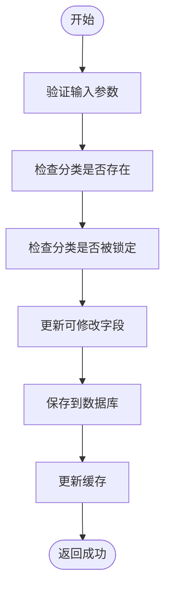

# 产品分类管理

<cite>
**本文档引用文件**  
- [CategoryDO.java](file://eplus-module-pms/eplus-module-pms-biz/src/main/java/com/syj/eplus/module/pms/dal/dataobject/category/CategoryDO.java)
- [CategoryService.java](file://eplus-module-pms/eplus-module-pms-biz/src/main/java/com/syj/eplus/module/pms/service/category/CategoryService.java)
- [CategoryController.java](file://eplus-module-pms/eplus-module-pms-biz/src/main/java/com/syj/eplus/module/pms/controller/admin/category/CategoryController.java)
- [CategorySaveReqVO.java](file://eplus-module-pms/eplus-module-pms-biz/src/main/java/com/syj/eplus/module/pms/controller/admin/category/vo/CategorySaveReqVO.java)
- [CategoryRespVO.java](file://eplus-module-pms/eplus-module-pms-biz/src/main/java/com/syj/eplus/module/pms/controller/admin/category/vo/CategoryRespVO.java)
- [CategorySimpleRespVO.java](file://eplus-module-pms/eplus-module-pms-biz/src/main/java/com/syj/eplus/module/pms/controller/admin/category/vo/CategorySimpleRespVO.java)
- [CategoryMapper.java](file://eplus-module-pms/eplus-module-pms-biz/src/main/java/com/syj/eplus/module/pms/dal/mysql/category/CategoryMapper.java)
- [CategoryConvent.java](file://eplus-module-pms/eplus-module-pms-biz/src/main/java/com/syj/eplus/module/pms/service/convent/CategoryConvent.java)
- [CodeGeneratorUtil.java](file://eplus-module-infra/eplus-module-infra-biz/src/main/java/com/syj/eplus/module/infra/util/code/CodeGeneratorUtil.java)
- [SerialNumberCodeRule.java](file://eplus-module-infra/eplus-module-infra-biz/src/main/java/com/syj/eplus/module/infra/code/SerialNumberCodeRule.java)
- [DateTimeCodeRule.java](file://eplus-module-infra/eplus-module-infra-biz/src/main/java/com/syj/eplus/module/infra/code/DateTimeCodeRule.java)
- [ConstantCodeRule.java](file://eplus-module-infra/eplus-module-infra-biz/src/main/java/com/syj/eplus/module/infra/code/ConstantCodeRule.java)
- [R__菜单相关.sql](file://eplus-flyway/src/main/resources/db/migration/common/R__菜单相关.sql)
</cite>

## 目录
1. [引言](#引言)
2. [产品分类体系结构](#产品分类体系结构)
3. [分类层级结构与管理方式](#分类层级结构与管理方式)
4. [分类操作流程](#分类操作流程)
5. [分类编码规则](#分类编码规则)
6. [分类路径管理机制](#分类路径管理机制)
7. [分类与SKU的关联关系](#分类与sku的关联关系)
8. [分类在商品搜索与报表统计中的应用](#分类在商品搜索与报表统计中的应用)
9. [分类API接口文档](#分类api接口文档)
10. [权限控制与审批流程](#权限控制与审批流程)
11. [管理界面操作指南](#管理界面操作指南)
12. [最佳实践](#最佳实践)

## 引言

产品分类管理是企业商品管理体系的核心组成部分，用于组织和管理产品信息，支持商品搜索、报表统计、权限控制等关键业务功能。本系统实现了完整的产品分类管理功能，包括分类的创建、编辑、删除、查询等操作，支持树形层级结构，并提供了完善的API接口和权限控制机制。

**本文档引用文件**  
- [CategoryDO.java](file://eplus-module-pms/eplus-module-pms-biz/src/main/java/com/syj/eplus/module/pms/dal/dataobject/category/CategoryDO.java)
- [CategoryService.java](file://eplus-module-pms/eplus-module-pms-biz/src/main/java/com/syj/eplus/module/pms/service/category/CategoryService.java)

## 产品分类体系结构

产品分类体系采用树形层级结构，每个分类节点包含基本信息、层级关系和扩展属性。系统通过数据库表`pms_category`存储分类数据，主要字段包括：

- **id**: 主键，唯一标识分类
- **code**: 商品分类编号
- **name**: 分类名称
- **codeLen**: 流水号长度
- **hsCodeId**: 海关编码
- **parentId**: 父节点编号，用于构建层级关系
- **categoryType**: 种类
- **grade**: 级别
- **hsDataCode**: 海关编码编号
- **createTime**: 创建时间
- **updateTime**: 更新时间
- **deleted**: 删除标记


**图源**  
- [CategoryDO.java](file://eplus-module-pms/eplus-module-pms-biz/src/main/java/com/syj/eplus/module/pms/dal/dataobject/category/CategoryDO.java#L24-L64)
- [V1_0_0_002__Eplus初始化.sql](file://eplus-flyway/src/main/resources/db/migration/common/V1_0_0_002__Eplus初始化.sql#L827-L842)

**本节源**  
- [CategoryDO.java](file://eplus-module-pms/eplus-module-pms-biz/src/main/java/com/syj/eplus/module/pms/dal/dataobject/category/CategoryDO.java)

## 分类层级结构与管理方式

产品分类采用树形层级结构，支持多级分类管理。系统通过`parentId`字段建立父子关系，形成完整的分类树。每个分类节点具有以下属性：

- **级别(grade)**: 表示分类在层级结构中的深度
- **父节点(parentId)**: 指向父分类的ID，根节点的父节点为null或0
- **子节点**: 通过查询具有相同`parentId`的分类获取

系统提供了获取分类树形结构的接口，返回包含子节点的嵌套结构，便于前端展示树形控件。


**图源**  
- [CategorySimpleRespVO.java](file://eplus-module-pms/eplus-module-pms-biz/src/main/java/com/syj/eplus/module/pms/controller/admin/category/vo/CategorySimpleRespVO.java#L38-L39)
- [CategoryConvent.java](file://eplus-module-pms/eplus-module-pms-biz/src/main/java/com/syj/eplus/module/pms/service/convent/CategoryConvent.java#L42-L69)

**本节源**  
- [CategorySimpleRespVO.java](file://eplus-module-pms/eplus-module-pms-biz/src/main/java/com/syj/eplus/module/pms/controller/admin/category/vo/CategorySimpleRespVO.java)
- [CategoryConvent.java](file://eplus-module-pms/eplus-module-pms-biz/src/main/java/com/syj/eplus/module/pms/service/convent/CategoryConvent.java)

## 分类操作流程

### 创建分类

创建分类需要提供完整的分类信息，包括分类编号、名称、父节点等。系统会验证分类编号的唯一性，并确保父节点存在。


### 编辑分类

编辑分类允许修改分类的基本信息，但不能修改分类编号和父节点，以确保数据一致性。



### 删除分类

删除分类前需要检查该分类是否被其他数据引用，以及是否有子分类存在。


**本节源**  
- [CategoryService.java](file://eplus-module-pms/eplus-module-pms-biz/src/main/java/com/syj/eplus/module/pms/service/category/CategoryService.java)
- [CategoryController.java](file://eplus-module-pms/eplus-module-pms-biz/src/main/java/com/syj/eplus/module/pms/controller/admin/category/CategoryController.java)

## 分类编码规则

产品分类编码采用组合规则生成，通常包含固定前缀、日期信息和序列号。系统提供了灵活的编码生成器，支持多种编码规则的组合。

### 编码规则组件

- **ConstantCodeRule**: 固定常量规则，用于添加固定前缀
- **DateTimeCodeRule**: 日期时间规则，支持多种日期格式
- **SerialNumberCodeRule**: 序列号规则，生成递增的数字序列

### 编码示例

| 规则组合 | 示例编码 | 说明 |
|---------|--------|------|
| PO + yyMM + 4位序列号 | PO24010001 | 采购订单编号 |
| SN + yyMM + 6位序列号 | SN2401000001 | 序列号 |
| INV + yyyy + 5位序列号 | INV202400001 | 发票编号 |


**图源**  
- [ConstantCodeRule.java](file://eplus-module-infra/eplus-module-infra-biz/src/main/java/com/syj/eplus/module/infra/code/ConstantCodeRule.java)
- [DateTimeCodeRule.java](file://eplus-module-infra/eplus-module-infra-biz/src/main/java/com/syj/eplus/module/infra/code/DateTimeCodeRule.java)
- [SerialNumberCodeRule.java](file://eplus-module-infra/eplus-module-infra-biz/src/main/java/com/syj/eplus/module/infra/code/SerialNumberCodeRule.java)

**本节源**  
- [CodeGeneratorUtil.java](file://eplus-module-infra/eplus-module-infra-biz/src/main/java/com/syj/eplus/module/infra/util/code/CodeGeneratorUtil.java)
- [ConstantCodeRule.java](file://eplus-module-infra/eplus-module-infra-biz/src/main/java/com/syj/eplus/module/infra/code/ConstantCodeRule.java)
- [DateTimeCodeRule.java](file://eplus-module-infra/eplus-module-infra-biz/src/main/java/com/syj/eplus/module/infra/code/DateTimeCodeRule.java)
- [SerialNumberCodeRule.java](file://eplus-module-infra/eplus-module-infra-biz/src/main/java/com/syj/eplus/module/infra/code/SerialNumberCodeRule.java)

## 分类路径管理机制

系统提供了分类路径管理功能，支持获取分类的完整路径和前缀编码。通过递归查询数据库，可以构建从根节点到当前节点的完整路径。

### 路径查询SQL

```sql
WITH RECURSIVE category_path AS (
    SELECT id, parent_id, name, name AS full_path
    FROM pms_category WHERE id = #{id}
    
    UNION ALL
    
    SELECT c.id, c.parent_id, c.name, CONCAT(c.name, '->', cp.full_path)
    FROM pms_category c
    INNER JOIN category_path cp ON c.id = cp.parent_id
)
SELECT full_path
FROM category_path
ORDER BY LENGTH(full_path) DESC
LIMIT 1
```

### 路径管理功能

- **getPathCateName**: 获取分类的完整路径名称
- **getProfixCode**: 获取分类的前缀编码
- **getParentCateGoryById**: 获取分类的所有父节点信息


**图源**  
- [CategoryMapper.java](file://eplus-module-pms/eplus-module-pms-biz/src/main/java/com/syj/eplus/module/pms/dal/mysql/category/CategoryMapper.java#L49-L66)
- [CategoryService.java](file://eplus-module-pms/eplus-module-pms-biz/src/main/java/com/syj/eplus/module/pms/service/category/CategoryService.java#L72-L73)

**本节源**  
- [CategoryMapper.java](file://eplus-module-pms/eplus-module-pms-biz/src/main/java/com/syj/eplus/module/pms/dal/mysql/category/CategoryMapper.java)
- [CategoryService.java](file://eplus-module-pms/eplus-module-pms-biz/src/main/java/com/syj/eplus/module/pms/service/category/CategoryService.java)

## 分类与SKU的关联关系

产品分类与SKU（库存单位）存在直接关联关系。每个SKU必须归属于一个产品分类，这种关联关系支持：

- **商品分类**: SKU继承其所属分类的属性和规则
- **权限控制**: 基于分类的权限管理，控制用户对特定类别商品的访问
- **报表统计**: 按分类维度进行销售、库存等数据分析
- **搜索过滤**: 在商品搜索中按分类进行筛选

系统通过SKU对象中的分类ID字段建立与分类的关联，确保数据的一致性和完整性。

**本节源**  
- [CategoryDO.java](file://eplus-module-pms/eplus-module-pms-biz/src/main/java/com/syj/eplus/module/pms/dal/dataobject/category/CategoryDO.java)
- [SkuTypeEnum.java](file://eplus-framework/eplus-common/src/main/java/com/syj/eplus/framework/common/enums/SkuTypeEnum.java)

## 分类在商品搜索与报表统计中的应用

### 商品搜索应用

产品分类在商品搜索中发挥重要作用：

- **分类筛选**: 提供分类树形选择器，用户可按分类层级筛选商品
- **智能推荐**: 基于用户浏览的分类，推荐相关类别商品
- **搜索优化**: 将分类信息纳入搜索索引，提高搜索相关性

### 报表统计应用

分类体系为报表统计提供重要维度：

- **销售分析**: 按分类统计销售额、销售量
- **库存分析**: 按分类统计库存数量、库存周转率
- **利润分析**: 按分类统计毛利率、利润率
- **趋势分析**: 分析各分类的销售趋势和季节性特征


**本节源**  
- [CategoryRespVO.java](file://eplus-module-pms/eplus-module-pms-biz/src/main/java/com/syj/eplus/module/pms/controller/admin/category/vo/CategoryRespVO.java)
- [CategoryService.java](file://eplus-module-pms/eplus-module-pms-biz/src/main/java/com/syj/eplus/module/pms/service/category/CategoryService.java)

## 分类API接口文档

### 分类树查询接口

**接口**: GET /pms/category/get-simple-list  
**描述**: 获取产品分类树形结构  
**权限**: pms:category:query  
**返回**: List<CategorySimpleRespVO>

### 分类创建接口

**接口**: POST /pms/category/create  
**描述**: 创建产品分类  
**权限**: pms:category:create  
**请求体**: CategorySaveReqVO  
**返回**: 分类ID

### 分类更新接口

**接口**: PUT /pms/category/update  
**描述**: 更新产品分类  
**权限**: pms:category:update  
**请求体**: CategorySaveReqVO  
**返回**: 成功标志

### 分类删除接口

**接口**: DELETE /pms/category/delete  
**描述**: 删除产品分类  
**权限**: pms:category:delete  
**参数**: id (分类ID)  
**返回**: 成功标志

### 分类分页查询接口

**接口**: GET /pms/category/page  
**描述**: 分页查询产品分类  
**权限**: pms:category:query  
**参数**: CategoryPageReqVO  
**返回**: PageResult<CategoryRespVO>


**图源**  
- [CategorySaveReqVO.java](file://eplus-module-pms/eplus-module-pms-biz/src/main/java/com/syj/eplus/module/pms/controller/admin/category/vo/CategorySaveReqVO.java)
- [CategoryRespVO.java](file://eplus-module-pms/eplus-module-pms-biz/src/main/java/com/syj/eplus/module/pms/controller/admin/category/vo/CategoryRespVO.java)
- [CategorySimpleRespVO.java](file://eplus-module-pms/eplus-module-pms-biz/src/main/java/com/syj/eplus/module/pms/controller/admin/category/vo/CategorySimpleRespVO.java)
- [CategoryPageReqVO.java](file://eplus-module-pms/eplus-module-pms-biz/src/main/java/com/syj/eplus/module/pms/controller/admin/category/vo/CategoryPageReqVO.java)

**本节源**  
- [CategoryController.java](file://eplus-module-pms/eplus-module-pms-biz/src/main/java/com/syj/eplus/module/pms/controller/admin/category/CategoryController.java)
- [CategoryService.java](file://eplus-module-pms/eplus-module-pms-biz/src/main/java/com/syj/eplus/module/pms/service/category/CategoryService.java)

## 权限控制与审批流程

### 权限控制

系统通过RBAC（基于角色的访问控制）模型实现分类管理的权限控制：

- **查询权限**: pms:category:query
- **创建权限**: pms:category:create
- **更新权限**: pms:category:update
- **删除权限**: pms:category:delete
- **导出权限**: pms:category:export

权限配置存储在`system_menu`表中，通过菜单权限控制用户的操作能力。

### 审批流程

对于重要分类的变更，系统支持审批流程：

1. 用户提交分类变更申请
2. 系统生成审批任务
3. 审批人审核变更内容
4. 审批通过后生效变更
5. 审批拒绝则保持原状


**本节源**  
- [R__菜单相关.sql](file://eplus-flyway/src/main/resources/db/migration/common/R__菜单相关.sql)
- [CategoryController.java](file://eplus-module-pms/eplus-module-pms-biz/src/main/java/com/syj/eplus/module/pms/controller/admin/category/CategoryController.java)

## 管理界面操作指南

### 分类列表界面

- **搜索功能**: 支持按分类编号、名称等条件搜索
- **分页显示**: 每页显示固定数量的分类
- **导出功能**: 支持导出分类数据到Excel
- **操作按钮**: 包含新增、编辑、删除等操作

### 分类树形界面

- **展开/折叠**: 支持展开和折叠分类层级
- **拖拽排序**: 支持通过拖拽调整分类顺序
- **快速定位**: 支持通过搜索快速定位到特定分类
- **右键菜单**: 提供上下文操作菜单

### 分类编辑界面

- **必填字段**: 分类编号、名称、父节点等为必填项
- **字段验证**: 实时验证输入数据的有效性
- **提示信息**: 提供字段填写的提示和说明
- **保存取消**: 提供保存和取消按钮

**本节源**  
- [CategoryController.java](file://eplus-module-pms/eplus-module-pms-biz/src/main/java/com/syj/eplus/module/pms/controller/admin/category/CategoryController.java)
- [CategoryRespVO.java](file://eplus-module-pms/eplus-module-pms-biz/src/main/java/com/syj/eplus/module/pms/controller/admin/category/vo/CategoryRespVO.java)

## 最佳实践

1. **分类规划**: 在系统上线前做好分类体系的规划，避免频繁调整
2. **命名规范**: 采用统一的命名规范，确保分类名称的清晰和一致
3. **层级控制**: 控制分类层级深度，建议不超过5级
4. **权限管理**: 严格控制分类管理权限，避免误操作
5. **数据备份**: 定期备份分类数据，防止数据丢失
6. **变更记录**: 记录重要的分类变更，便于追溯和审计
7. **性能优化**: 对分类查询进行缓存，提高系统响应速度
8. **用户培训**: 对相关人员进行分类管理培训，确保正确使用

**本节源**  
- [CategoryService.java](file://eplus-module-pms/eplus-module-pms-biz/src/main/java/com/syj/eplus/module/pms/service/category/CategoryService.java)
- [CategoryController.java](file://eplus-module-pms/eplus-module-pms-biz/src/main/java/com/syj/eplus/module/pms/controller/admin/category/CategoryController.java)