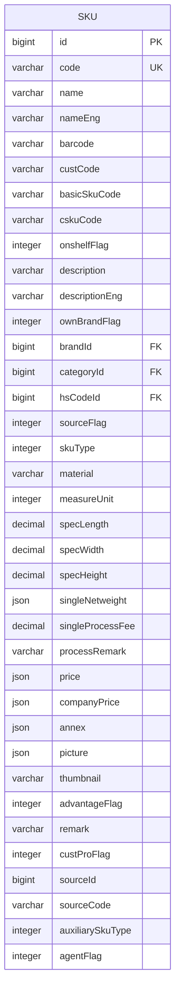
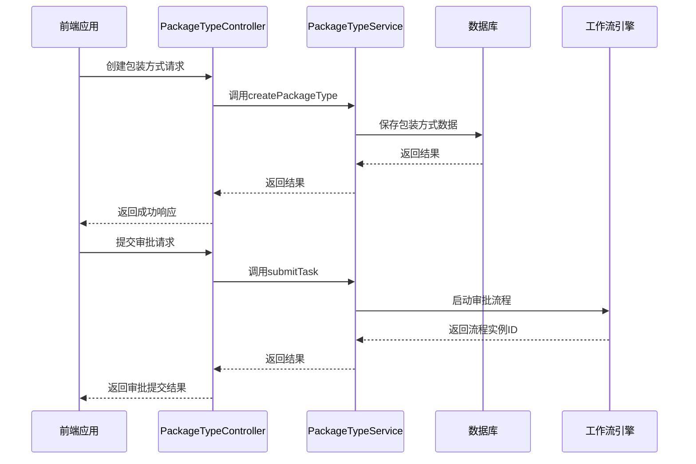
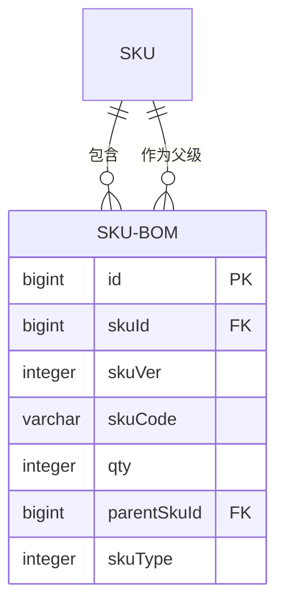
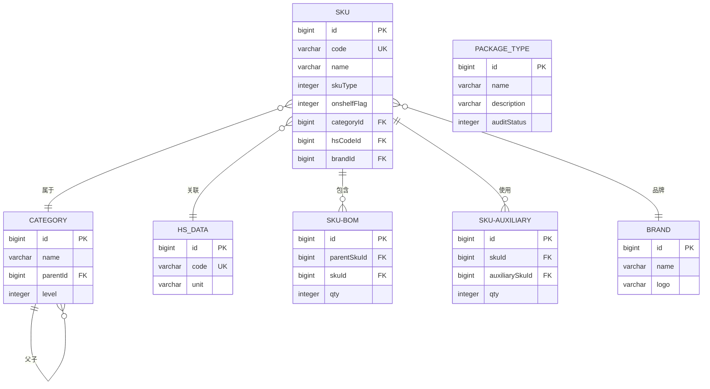
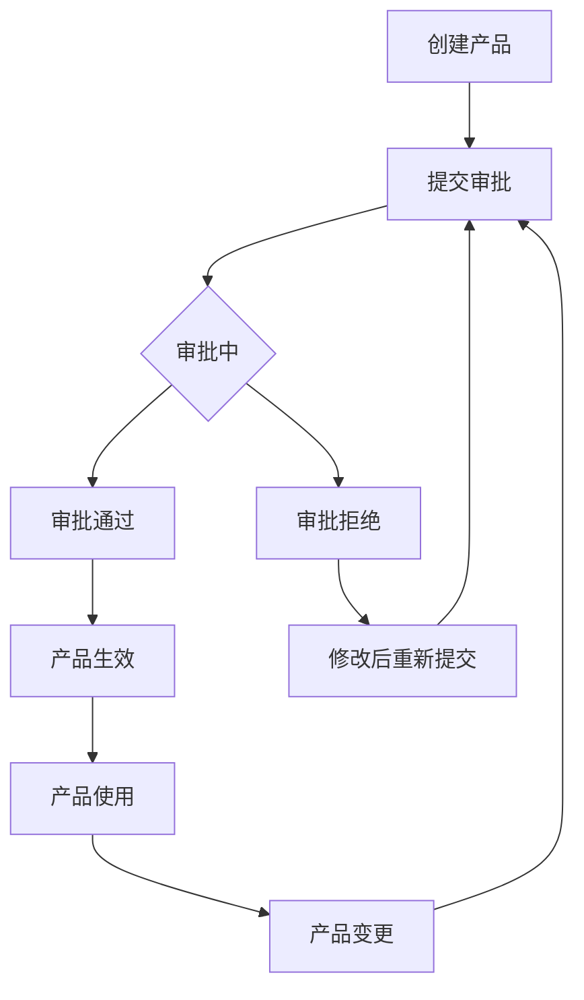

# 产品管理

<cite>
**本文档引用的文件**
- [SkuApi.java](file://eplus-module-pms/eplus-module-pms-api/src/main/java/com/syj/eplus/module/pms/api/sku/SkuApi.java)
- [SkuDTO.java](file://eplus-module-pms/eplus-module-pms-api/src/main/java/com/syj/eplus/module/pms/api/sku/dto/SkuDTO.java)
- [SkuBomDTO.java](file://eplus-module-pms/eplus-module-pms-api/src/main/java/com/syj/eplus/module/pms/api/sku/dto/SkuBomDTO.java)
- [HsDataDTO.java](file://eplus-module-pms/eplus-module-pms-api/src/main/java/com/syj/eplus/module/pms/api/sku/dto/HsDataDTO.java)
- [CategoryApi.java](file://eplus-module-pms/eplus-module-pms-api/src/main/java/com/syj/eplus/module/pms/api/Category/CategoryApi.java)
- [PackageTypeApi.java](file://eplus-module-pms/eplus-module-pms-api/src/main/java/com/syj/eplus/module/pms/api/packageType/PackageTypeApi.java)
- [SkuApiImpl.java](file://eplus-module-pms/eplus-module-pms-biz/src/main/java/com/syj/eplus/module/pms/api/SkuApiImpl.java)
- [CategoryController.java](file://eplus-module-pms/eplus-module-pms-biz/src/main/java/com/syj/eplus/module/pms/controller/admin/category/CategoryController.java)
- [PackageTypeController.java](file://eplus-module-pms/eplus-module-pms-biz/src/main/java/com/syj/eplus/module/pms/controller/admin/packageType/PackageTypeController.java)
- [SkuMapper.xml](file://eplus-module-pms/eplus-module-pms-biz/src/main/resources/mapper/SkuMapper.xml)
- [SkuBomMapper.xml](file://eplus-module-pms/eplus-module-pms-biz/src/main/resources/mapper/SkuBomMapper.xml)
</cite>

## 目录
1. [简介](#简介)
2. [产品分类体系](#产品分类体系)
3. [SKU管理](#sku管理)
4. [包装方式管理](#包装方式管理)
5. [产品BOM管理](#产品bom管理)
6. [产品数据模型](#产品数据模型)
7. [产品审批流程](#产品审批流程)
8. [产品数据同步机制](#产品数据同步机制)

## 简介

本文档详细介绍了产品管理模块的核心功能，包括SKU管理、产品分类、包装方式等关键特性。文档重点阐述了产品（SKU）的创建、维护和生命周期管理流程，解释了产品与辅料的BOM（物料清单）关系，以及产品规格、属性的管理方式。同时，文档描述了产品分类体系和层级结构，说明了包装方式、海关编码等产品相关数据的管理，并提供了产品数据模型图展示产品核心实体及其关系。此外，文档还包含了产品审批流程和产品数据同步机制的说明。

## 产品分类体系

产品分类体系是产品管理的基础，用于对产品进行系统化的组织和管理。通过分类体系，可以实现产品的层级化管理，便于查找、统计和分析。

产品分类管理提供了完整的CRUD（创建、读取、更新、删除）操作接口，支持分页查询和数据导出功能。系统通过`CategoryController`提供RESTful API接口，实现了产品分类的创建、更新、删除和查询功能。

产品分类支持树形结构，可以构建多级分类体系，满足不同业务场景的需求。通过`getSimpleList`接口可以获取产品分类树，便于前端展示和选择。

**本节来源**
- [CategoryApi.java](file://eplus-module-pms/eplus-module-pms-api/src/main/java/com/syj/eplus/module/pms/api/Category/CategoryApi.java)
- [CategoryController.java](file://eplus-module-pms/eplus-module-pms-biz/src/main/java/com/syj/eplus/module/pms/controller/admin/category/CategoryController.java)

## SKU管理

SKU（Stock Keeping Unit）管理是产品管理的核心功能，负责产品的创建、维护和生命周期管理。系统通过`SkuApi`接口为其他模块提供SKU相关数据的访问能力。

### SKU核心属性

SKU实体包含丰富的属性信息，涵盖了产品管理的各个方面：

**图示来源**
- [SkuDTO.java](file://eplus-module-pms/eplus-module-pms-api/src/main/java/com/syj/eplus/module/pms/api/sku/dto/SkuDTO.java)

### SKU生命周期管理

SKU的生命周期管理包括创建、审核、更新和停用等操作。每个SKU都有审核状态（auditStatus）和产品状态（onshelfFlag）两个关键状态字段：

- **审核状态**：标识SKU的审核流程状态，通过工作流引擎进行管理
- **产品状态**：标识SKU的上架状态，控制产品是否可用于业务操作

系统提供了丰富的API接口来管理SKU的生命周期，包括获取SKU信息、验证SKU存在性、更新条码等操作。

**本节来源**
- [SkuDTO.java](file://eplus-module-pms/eplus-module-pms-api/src/main/java/com/syj/eplus/module/pms/api/sku/dto/SkuDTO.java)
- [SkuApi.java](file://eplus-module-pms/eplus-module-pms-api/src/main/java/com/syj/eplus/module/pms/api/sku/SkuApi.java)

## 包装方式管理

包装方式管理负责维护产品的包装信息，包括包装类型、规格等属性。系统通过`PackageTypeController`提供包装方式的管理接口。

### 包装方式功能特性

包装方式管理具有以下功能特性：

- **完整的CRUD操作**：支持包装方式的创建、更新、删除和查询
- **分页查询**：支持分页获取包装方式列表
- **数据导出**：支持将包装方式数据导出为Excel文件
- **审批流程**：支持包装方式变更的审批流程

包装方式管理还实现了与工作流系统的集成，支持审批任务的通过、拒绝和提交操作，确保包装方式变更的合规性。

**图示来源**
- [PackageTypeController.java](file://eplus-module-pms/eplus-module-pms-biz/src/main/java/com/syj/eplus/module/pms/controller/admin/packageType/PackageTypeController.java)
- [PackageTypeApi.java](file://eplus-module-pms/eplus-module-pms-api/src/main/java/com/syj/eplus/module/pms/api/packageType/PackageTypeApi.java)

**本节来源**
- [PackageTypeController.java](file://eplus-module-pms/eplus-module-pms-biz/src/main/java/com/syj/eplus/module/pms/controller/admin/packageType/PackageTypeController.java)
- [PackageTypeApi.java](file://eplus-module-pms/eplus-module-pms-api/src/main/java/com/syj/eplus/module/pms/api/packageType/PackageTypeApi.java)

## 产品BOM管理

产品BOM（Bill of Materials）管理是产品结构管理的核心，用于定义组合产品与其子产品之间的关系。

### BOM数据结构

BOM实体定义了父产品与子产品之间的组成关系：

**图示来源**
- [SkuBomDTO.java](file://eplus-module-pms/eplus-module-pms-api/src/main/java/com/syj/eplus/module/pms/api/sku/dto/SkuBomDTO.java)
- [SkuDTO.java](file://eplus-module-pms/eplus-module-pms-api/src/main/java/com/syj/eplus/module/pms/api/sku/dto/SkuDTO.java)

### BOM管理功能

BOM管理提供了以下核心功能：

- **获取子产品列表**：根据SKU编码获取其包含的子产品列表
- **获取组合产品树**：获取所有BOM关系的映射
- **批量获取子产品**：根据多个SKU编码批量获取子产品信息
- **BOM关系维护**：支持BOM关系的创建、更新和删除

系统通过`getSonSkuListBySkuCode`等API接口提供BOM数据的访问能力，支持产品结构的查询和分析。

**本节来源**
- [SkuBomDTO.java](file://eplus-module-pms/eplus-module-pms-api/src/main/java/com/syj/eplus/module/pms/api/sku/dto/SkuBomDTO.java)
- [SkuApi.java](file://eplus-module-pms/eplus-module-pms-api/src/main/java/com/syj/eplus/module/pms/api/sku/SkuApi.java)
- [SkuBomMapper.xml](file://eplus-module-pms/eplus-module-pms-biz/src/main/resources/mapper/SkuBomMapper.xml)

## 产品数据模型

产品数据模型是产品管理模块的核心，定义了产品相关的实体及其关系。以下为产品管理模块的核心数据模型：

**图示来源**
- [SkuDTO.java](file://eplus-module-pms/eplus-module-pms-api/src/main/java/com/syj/eplus/module/pms/api/sku/dto/SkuDTO.java)
- [SkuBomDTO.java](file://eplus-module-pms/eplus-module-pms-api/src/main/java/com/syj/eplus/module/pms/api/sku/dto/SkuBomDTO.java)
- [HsDataDTO.java](file://eplus-module-pms/eplus-module-pms-api/src/main/java/com/syj/eplus/module/pms/api/sku/dto/HsDataDTO.java)
- [CategoryApi.java](file://eplus-module-pms/eplus-module-pms-api/src/main/java/com/syj/eplus/module/pms/api/Category/CategoryApi.java)
- [PackageTypeApi.java](file://eplus-module-pms/eplus-module-pms-api/src/main/java/com/syj/eplus/module/pms/api/packageType/PackageTypeApi.java)

## 产品审批流程

产品审批流程是确保产品数据质量和合规性的重要机制。系统通过集成工作流引擎，实现了产品相关数据的审批管理。

### 审批流程特点

产品审批流程具有以下特点：

- **状态驱动**：基于审核状态（auditStatus）驱动审批流程
- **任务管理**：与工作流系统集成，支持任务的审批、拒绝和提交
- **权限控制**：基于RBAC（基于角色的访问控制）实现审批权限管理
- **流程可配置**：审批流程可根据业务需求进行配置和调整

对于包装方式等关键数据的变更，系统要求必须经过审批流程才能生效，确保数据变更的合规性和可追溯性。

**图示来源**
- [PackageTypeController.java](file://eplus-module-pms/eplus-module-pms-biz/src/main/java/com/syj/eplus/module/pms/controller/admin/packageType/PackageTypeController.java)
- [SkuDTO.java](file://eplus-module-pms/eplus-module-pms-api/src/main/java/com/syj/eplus/module/pms/api/sku/dto/SkuDTO.java)

## 产品数据同步机制

产品数据同步机制确保产品数据在系统内部以及与其他系统之间的数据一致性。

### 数据同步方式

系统采用以下数据同步机制：

- **API接口同步**：通过`SkuApi`等API接口为其他模块提供产品数据访问
- **缓存机制**：使用缓存提高数据访问性能，如`getSimpleSkuDTOMap`等接口
- **事件驱动**：通过监听器实现数据变更的事件通知
- **批量处理**：支持批量获取和更新产品数据，提高同步效率

数据同步机制确保了产品数据的实时性和一致性，支持系统的高效运行。

**本节来源**
- [SkuApi.java](file://eplus-module-pms/eplus-module-pms-api/src/main/java/com/syj/eplus/module/pms/api/sku/SkuApi.java)
- [SkuApiImpl.java](file://eplus-module-pms/eplus-module-pms-biz/src/main/java/com/syj/eplus/module/pms/api/SkuApiImpl.java)