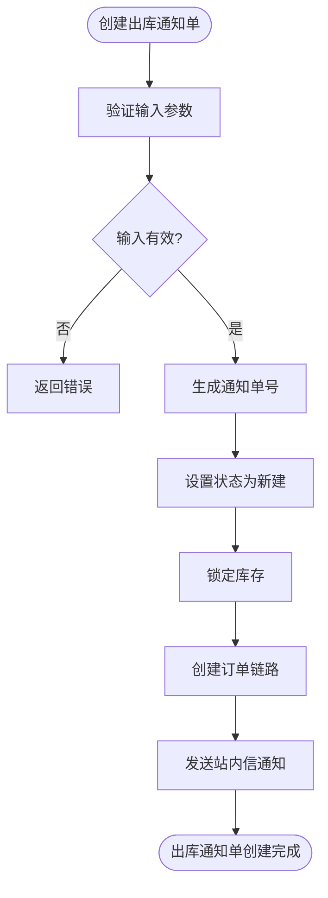
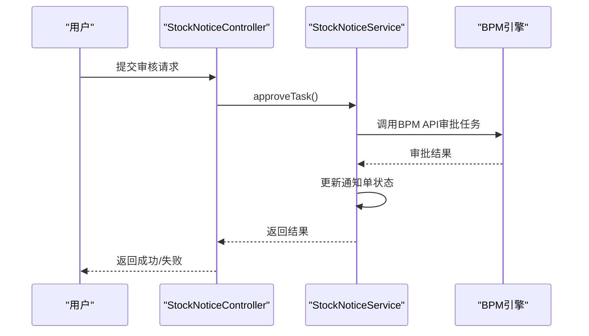
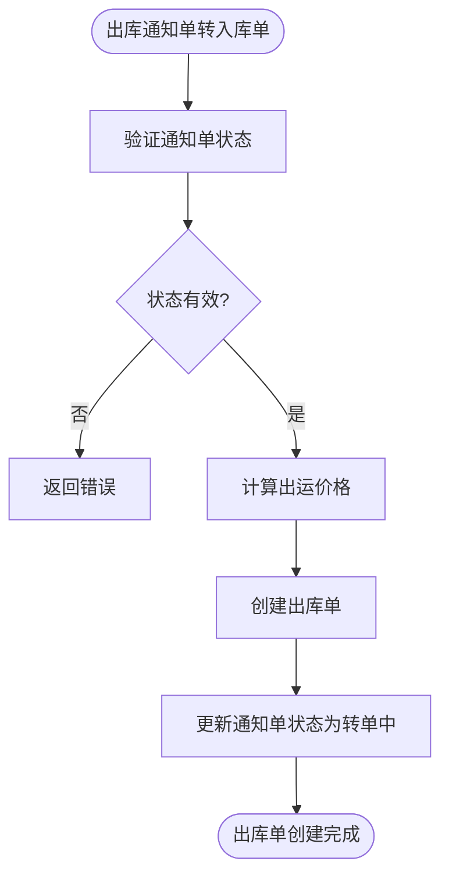
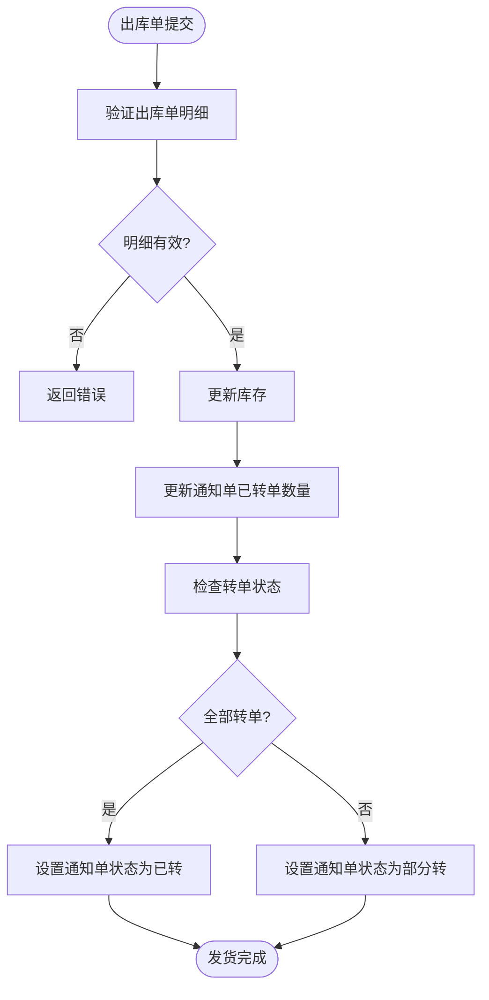
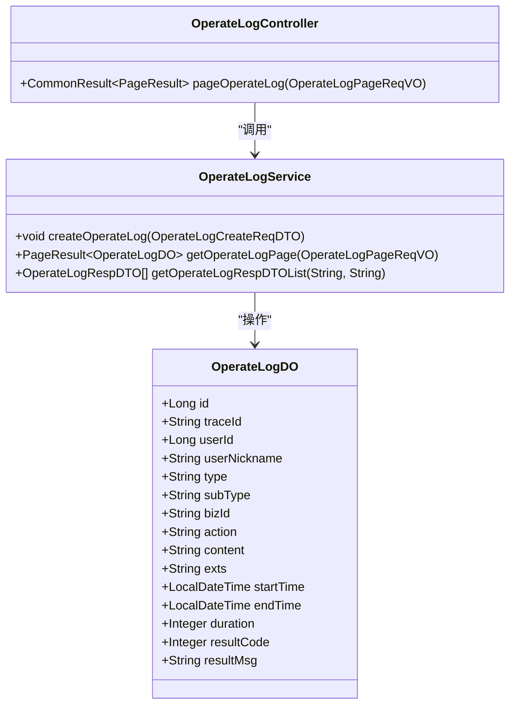

# 出库流程

<cite>
**本文档引用文件**   
- [StockNoticeServiceImpl.java](file://eplus-module-wms/eplus-module-wms-biz/src/main/java/com/syj/eplus/module/wms/service/stockNotice/StockNoticeServiceImpl.java)
- [StockNoticeController.java](file://eplus-module-wms/eplus-module-wms-biz/src/main/java/com/syj/eplus/module/wms/controller/admin/stockNotice/StockNoticeController.java)
- [StockNoticeApi.java](file://eplus-module-wms/eplus-module-wms-api/src/main/java/com/syj/eplus/module/wms/api/stockNotice/IStockNoticeApi.java)
- [BillServiceImpl.java](file://eplus-module-wms/eplus-module-wms-biz/src/main/java/com/syj/eplus/module/wms/service/bill/BillServiceImpl.java)
- [ShipmentServiceImpl.java](file://eplus-module-dms/eplus-module-dms-biz/src/main/java/com/syj/eplus/module/dms/service/shipment/ShipmentServiceImpl.java)
- [NoticeStatusEnum.java](file://eplus-module-wms/eplus-module-wms-api/src/main/java/com/syj/eplus/module/wms/enums/NoticeStatusEnum.java)
- [StockStatusEnum.java](file://eplus-module-wms/eplus-module-wms-api/src/main/java/com/syj/eplus/module/wms/enums/StockStatusEnum.java)
- [OperateLogServiceImpl.java](file://yudao-module-system/yudao-module-system-biz/src/main/java/cn/iocoder/yudao/module/system/service/logger/OperateLogServiceImpl.java)
</cite>

## 目录
1. [出库流程概述](#出库流程概述)
2. [出库通知单创建](#出库通知单创建)
3. [出库通知单审核](#出库通知单审核)
4. [拣货与打包](#拣货与打包)
5. [发货与库存减少](#发货与库存减少)
6. [出库单状态机](#出库单状态机)
7. [权限控制与操作日志](#权限控制与操作日志)

## 出库流程概述

出库管理是仓储管理系统中的核心业务流程，主要包含出库通知单创建、审核、拣货、打包、发货等环节。整个流程从销售订单触发，最终导致库存实际减少。出库流程通过出库通知单作为核心单据，驱动整个出库过程的执行。

出库流程的关键在于状态机的管理，出库单在不同环节会经历不同的状态转换，每个状态都有明确的业务规则和触发机制。系统通过状态机来控制流程的推进，确保业务的完整性和数据的一致性。

**Section sources**
- [StockNoticeServiceImpl.java](file://eplus-module-wms/eplus-module-wms-biz/src/main/java/com/syj/eplus/module/wms/service/stockNotice/StockNoticeServiceImpl.java#L1-L100)
- [StockNoticeController.java](file://eplus-module-wms/eplus-module-wms-biz/src/main/java/com/syj/eplus/module/wms/controller/admin/stockNotice/StockNoticeController.java#L1-L50)

## 出库通知单创建

出库通知单的创建是出库流程的起点，可以通过手动创建或由销售订单自动触发。创建出库通知单时，需要填写必要的业务信息，包括归属公司、产品明细、数量、备注等。



**Diagram sources**
- [StockNoticeServiceImpl.java](file://eplus-module-wms/eplus-module-wms-biz/src/main/java/com/syj/eplus/module/wms/service/stockNotice/StockNoticeServiceImpl.java#L180-L256)

**Section sources**
- [StockNoticeServiceImpl.java](file://eplus-module-wms/eplus-module-wms-biz/src/main/java/com/syj/eplus/module/wms/service/stockNotice/StockNoticeServiceImpl.java#L180-L256)
- [StockNoticeController.java](file://eplus-module-wms/eplus-module-wms-biz/src/main/java/com/syj/eplus/module/wms/controller/admin/stockNotice/StockNoticeController.java#L48-L54)

## 出库通知单审核

出库通知单创建后需要经过审核流程，只有审核通过的出库通知单才能进入后续的拣货和发货环节。审核流程通过工作流引擎实现，支持多级审批。



**Diagram sources**
- [StockNoticeController.java](file://eplus-module-wms/eplus-module-wms-biz/src/main/java/com/syj/eplus/module/wms/controller/admin/stockNotice/StockNoticeController.java#L187-L193)
- [StockNoticeServiceImpl.java](file://eplus-module-wms/eplus-module-wms-biz/src/main/java/com/syj/eplus/module/wms/service/stockNotice/StockNoticeServiceImpl.java#L140-L169)

**Section sources**
- [StockNoticeController.java](file://eplus-module-wms/eplus-module-wms-biz/src/main/java/com/syj/eplus/module/wms/controller/admin/stockNotice/StockNoticeController.java#L187-L201)
- [StockNoticeServiceImpl.java](file://eplus-module-wms/eplus-module-wms-biz/src/main/java/com/syj/eplus/module/wms/service/stockNotice/StockNoticeServiceImpl.java#L140-L169)

## 拣货与打包

拣货与打包环节是将出库通知单转化为实际出库单的过程。系统根据出库通知单中的产品明细和数量，生成对应的出库单，用于指导仓库人员进行拣货和打包操作。



**Diagram sources**
- [StockNoticeServiceImpl.java](file://eplus-module-wms/eplus-module-wms-biz/src/main/java/com/syj/eplus/module/wms/service/stockNotice/StockNoticeServiceImpl.java#L530-L635)

**Section sources**
- [StockNoticeServiceImpl.java](file://eplus-module-wms/eplus-module-wms-biz/src/main/java/com/syj/eplus/module/wms/service/stockNotice/StockNoticeServiceImpl.java#L530-L635)
- [StockNoticeController.java](file://eplus-module-wms/eplus-module-wms-biz/src/main/java/com/syj/eplus/module/wms/controller/admin/stockNotice/StockNoticeController.java#L124-L137)

## 发货与库存减少

发货环节是出库流程的最后一步，当货物实际发出后，系统会更新库存数据，完成整个出库流程。发货操作会触发库存的实际减少，同时更新相关业务单据的状态。



**Diagram sources**
- [BillServiceImpl.java](file://eplus-module-wms/eplus-module-wms-biz/src/main/java/com/syj/eplus/module/wms/service/bill/BillServiceImpl.java#L300-L349)

**Section sources**
- [BillServiceImpl.java](file://eplus-module-wms/eplus-module-wms-biz/src/main/java/com/syj/eplus/module/wms/service/bill/BillServiceImpl.java#L284-L374)

## 出库单状态机

出库单的状态机是整个出库流程的核心，通过状态转换来控制流程的推进。出库单主要有以下几种状态：

- **新建 (UN_CONVERT)**: 出库通知单刚创建时的状态
- **已审核 (IN_CONVERT)**: 出库通知单通过审核后的状态
- **部分拣货 (PART_CONVERT)**: 部分产品已完成拣货和出库的状态
- **已发货 (CONVERTED)**: 所有产品都已完成出库的状态

状态转换条件和触发机制如下：

```mermaid
stateDiagram-v2
[*] --> UN_CONVERT
UN_CONVERT --> IN_CONVERT : 提交审核
IN_CONVERT --> PART_CONVERT : 部分出库
IN_CONVERT --> CONVERTED : 全部出库
PART_CONVERT --> CONVERTED : 完成剩余出库
UN_CONVERT --> CANCEL : 作废
IN_CONVERT --> CANCEL : 作废
PART_CONVERT --> CANCEL : 作废
CONVERTED --> CANCEL : 作废
state UN_CONVERT {
状态值 : 1
描述 : 未转
}
state IN_CONVERT {
状态值 : 5
描述 : 转单中
}
state PART_CONVERT {
状态值 : 4
描述 : 部分转
}
state CONVERTED {
状态值 : 2
描述 : 已转
}
state CANCEL {
状态值 : 3
描述 : 作废
}
```

**Diagram sources**
- [NoticeStatusEnum.java](file://eplus-module-wms/eplus-module-wms-api/src/main/java/com/syj/eplus/module/wms/enums/NoticeStatusEnum.java#L1-L27)
- [StockStatusEnum.java](file://eplus-module-wms/eplus-module-wms-api/src/main/java/com/syj/eplus/module/wms/enums/StockStatusEnum.java#L1-L24)

**Section sources**
- [NoticeStatusEnum.java](file://eplus-module-wms/eplus-module-wms-api/src/main/java/com/syj/eplus/module/wms/enums/NoticeStatusEnum.java#L1-L27)
- [StockStatusEnum.java](file://eplus-module-wms/eplus-module-wms-api/src/main/java/com/syj/eplus/module/wms/enums/StockStatusEnum.java#L1-L24)

## 权限控制与操作日志

系统对出库流程的各个环节都实施了严格的权限控制，确保只有授权用户才能执行相应操作。同时，所有关键操作都会被记录到操作日志中，用于审计和追溯。

### 权限控制

出库流程各环节的权限控制如下：

| 操作 | 所需权限 |
|------|----------|
| 创建出库通知单 | wms:notice:create 或 wms:notice-out:create |
| 更新出库通知单 | wms:notice:update 或 wms:notice-out:update |
| 删除出库通知单 | wms:notice:delete 或 wms:notice-out:delete |
| 审核出库通知单 | wms:notice:audit |
| 提交出库任务 | wms:notice:submit |
| 作废出库通知单 | wms:notice:close |

### 操作日志

系统通过操作日志记录所有关键操作，包括操作人、操作时间、操作类型、操作对象等信息。操作日志主要用于审计和问题追溯。



**Diagram sources**
- [OperateLogServiceImpl.java](file://yudao-module-system/yudao-module-system-biz/src/main/java/cn/iocoder/yudao/module/system/service/logger/OperateLogServiceImpl.java#L23-L82)
- [OperateLogController.java](file://yudao-module-system/yudao-module-system-biz/src/main/java/cn/iocoder/yudao/module/system/controller/admin/logger/OperateLogController.java#L23-L55)

**Section sources**
- [OperateLogServiceImpl.java](file://yudao-module-system/yudao-module-system-biz/src/main/java/cn/iocoder/yudao/module/system/service/logger/OperateLogServiceImpl.java#L23-L82)
- [OperateLogController.java](file://yudao-module-system/yudao-module-system-biz/src/main/java/cn/iocoder/yudao/module/system/controller/admin/logger/OperateLogController.java#L23-L55)