# 库存盘点

<cite>
**本文档引用的文件**   
- [StocktakeController.java](file://eplus-module-wms/eplus-module-wms-biz/src/main/java/com/syj/eplus/module/wms/controller/admin/stocktake/StocktakeController.java)
- [StocktakeService.java](file://eplus-module-wms/eplus-module-wms-biz/src/main/java/com/syj/eplus/module/wms/service/stocktake/StocktakeService.java)
- [StocktakeDO.java](file://eplus-module-wms/eplus-module-wms-biz/src/main/java/com/syj/eplus/module/wms/dal/dataobject/stocktake/StocktakeDO.java)
- [StocktakeItemDO.java](file://eplus-module-wms/eplus-module-wms-biz/src/main/java/com/syj/eplus/module/wms/dal/dataobject/stocktake/StocktakeItemDO.java)
- [StocktakeStatusEnum.java](file://eplus-module-wms/eplus-module-wms-api/src/main/java/com/syj/eplus/module/wms/enums/StocktakeStatusEnum.java)
- [StocktakeResultEnum.java](file://eplus-module-wms/eplus-module-wms-api/src/main/java/com/syj/eplus/module/wms/enums/StocktakeResultEnum.java)
- [AdjustmentDO.java](file://eplus-module-wms/eplus-module-wms-biz/src/main/java/com/syj/eplus/module/wms/dal/dataobject/adjustment/AdjustmentDO.java)
- [StockDO.java](file://eplus-module-wms/eplus-module-wms-biz/src/main/java/com/syj/eplus/module/wms/dal/dataobject/stock/StockDO.java)
- [V1_0_0_002__Eplus初始化.sql](file://eplus-flyway/src/main/resources/db/migration/common/V1_0_0_002__Eplus初始化.sql)
- [V1_0_0_421__盘盈盘亏单增加差异原因.java](file://eplus-flyway/src/main/java/db/migration/common/V1_0_0_421__盘盈盘亏单增加差异原因.java)
- [V1_0_0_582__增加条形码.java](file://eplus-flyway/src/main/java/db/migration/common/V1_0_0_582__增加条形码.java)
- [SkuDTO.java](file://eplus-module-pms/eplus-module-pms-api/src/main/java/com/syj/eplus/module/pms/api/sku/dto/SkuDTO.java)
</cite>

## 目录
1. [引言](#引言)
2. [盘点流程概述](#盘点流程概述)
3. [盘点计划创建](#盘点计划创建)
4. [盘点任务分配](#盘点任务分配)
5. [实地盘点数据录入](#实地盘点数据录入)
6. [盘点差异分析](#盘点差异分析)
7. [账务调整](#账务调整)
8. [盘点模式](#盘点模式)
9. [盘点单状态管理](#盘点单状态管理)
10. [盘点结果确认机制](#盘点结果确认机制)
11. [移动端设备集成](#移动端设备集成)
12. [条码扫描支持](#条码扫描支持)
13. [盘点差异预警设置](#盘点差异预警设置)

## 引言
库存盘点是企业仓储管理中的关键环节，用于确保账面库存与实际库存的一致性。本文档详细介绍了库存盘点的完整流程，包括盘点计划的创建、任务分配、数据录入、差异分析和账务调整。同时，文档说明了周期性盘点、循环盘点和临时盘点三种模式的适用场景和配置方法，以及盘点单状态管理和结果确认机制。

## 盘点流程概述
库存盘点流程包括以下几个主要阶段：盘点计划创建、盘点任务分配、实地盘点数据录入、盘点差异分析和账务调整。整个流程通过系统化管理，确保盘点工作的准确性和效率。

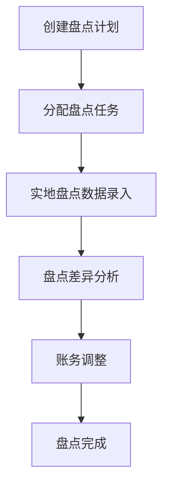

**图源**
- [StocktakeController.java](file://eplus-module-wms/eplus-module-wms-biz/src/main/java/com/syj/eplus/module/wms/controller/admin/stocktake/StocktakeController.java#L43-L203)
- [StocktakeService.java](file://eplus-module-wms/eplus-module-wms-biz/src/main/java/com/syj/eplus/module/wms/service/stocktake/StocktakeService.java#L21-L156)

## 盘点计划创建
盘点计划的创建是盘点流程的第一步。用户可以通过系统界面创建新的盘点计划，指定盘点单号、预计盘点日期、仓库、盘点人等信息。

**盘点计划创建参数：**
- **盘点单号**：系统自动生成的唯一标识
- **预计盘点日期**：计划进行盘点的日期
- **仓库**：需要盘点的仓库
- **盘点人**：负责盘点的人员
- **备注**：额外的说明信息

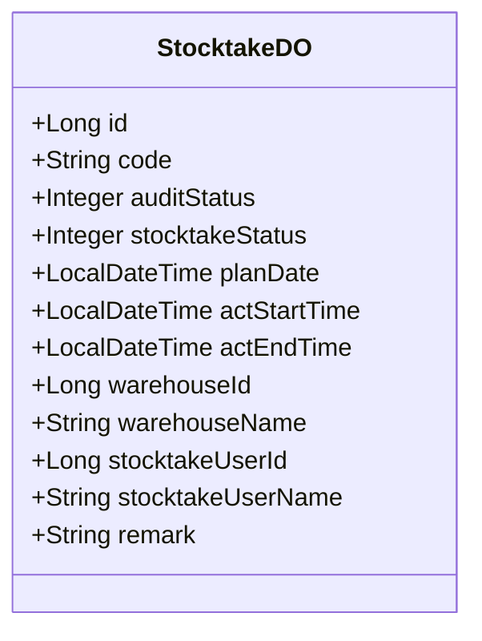

**图源**
- [StocktakeDO.java](file://eplus-module-wms/eplus-module-wms-biz/src/main/java/com/syj/eplus/module/wms/dal/dataobject/stocktake/StocktakeDO.java#L27-L109)
- [V1_0_0_002__Eplus初始化.sql](file://eplus-flyway/src/main/resources/db/migration/common/V1_0_0_002__Eplus初始化.sql#L2446-L2459)

## 盘点任务分配
盘点任务分配是将创建的盘点计划分配给具体的盘点人员。系统支持将任务分配给一个或多个盘点人员，并可以设置任务的优先级和截止日期。

**盘点任务分配功能：**
- **任务分配**：将盘点任务分配给指定人员
- **任务优先级**：设置任务的紧急程度
- **截止日期**：指定任务完成的最后期限
- **任务通知**：通过系统消息或邮件通知盘点人员

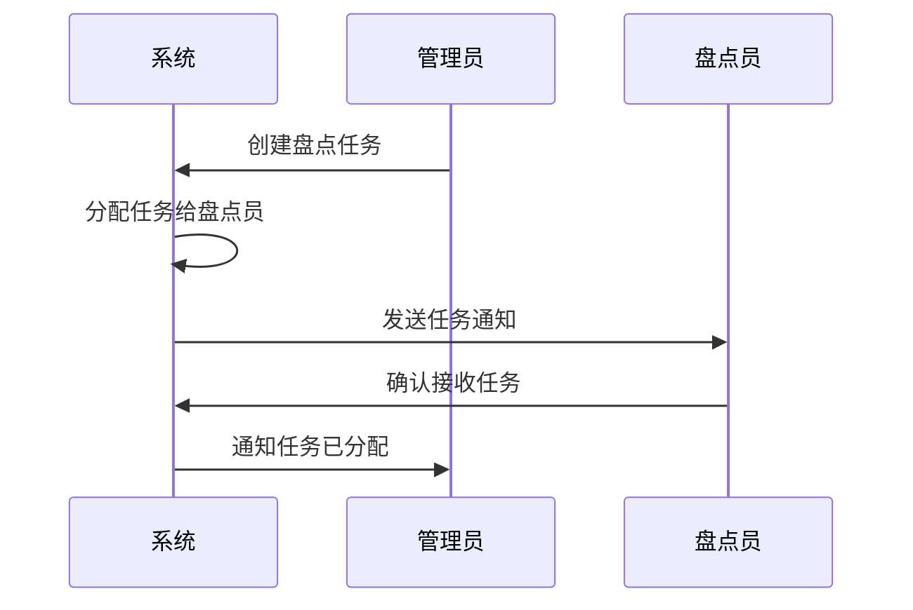

**图源**
- [StocktakeController.java](file://eplus-module-wms/eplus-module-wms-biz/src/main/java/com/syj/eplus/module/wms/controller/admin/stocktake/StocktakeController.java#L43-L203)
- [StocktakeService.java](file://eplus-module-wms/eplus-module-wms-biz/src/main/java/com/syj/eplus/module/wms/service/stocktake/StocktakeService.java#L21-L156)

## 实地盘点数据录入
实地盘点数据录入是盘点流程的核心环节。盘点人员在仓库现场通过移动设备扫描条码或手动输入数据，将实际库存数量录入系统。

**数据录入方式：**
- **条码扫描**：使用移动设备扫描产品条码
- **手动输入**：在移动设备上手动输入产品编号和数量
- **批量录入**：支持批量导入盘点数据

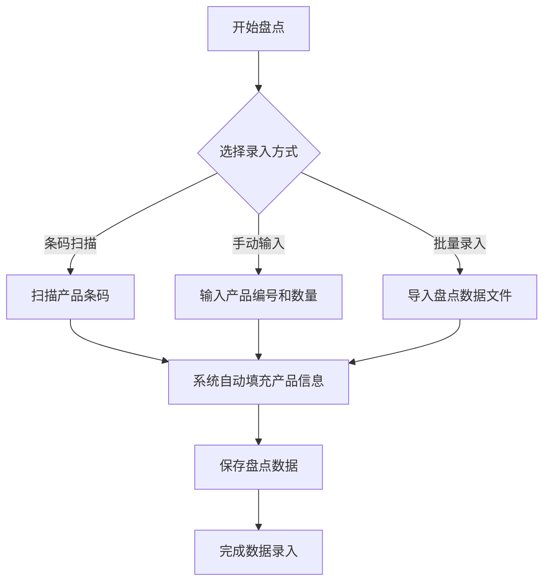

**图源**
- [StocktakeItemDO.java](file://eplus-module-wms/eplus-module-wms-biz/src/main/java/com/syj/eplus/module/wms/dal/dataobject/stocktake/StocktakeItemDO.java#L32-L202)
- [StocktakeController.java](file://eplus-module-wms/eplus-module-wms-biz/src/main/java/com/syj/eplus/module/wms/controller/admin/stocktake/StocktakeController.java#L172-L186)

## 盘点差异分析
盘点差异分析是将系统账面库存与实际盘点数量进行对比，识别差异并分析原因。系统会自动计算盘盈、盘亏和盘平的数量。

**差异分析步骤：**
1. 获取系统账面库存数据
2. 获取实际盘点数据
3. 计算差异数量
4. 分析差异原因
5. 生成差异报告

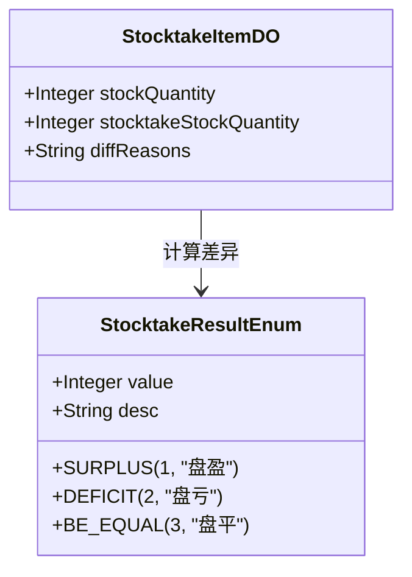

**图源**
- [StocktakeResultEnum.java](file://eplus-module-wms/eplus-module-wms-api/src/main/java/com/syj/eplus/module/wms/enums/StocktakeResultEnum.java#L1-L24)
- [StocktakeItemDO.java](file://eplus-module-wms/eplus-module-wms-biz/src/main/java/com/syj/eplus/module/wms/dal/dataobject/stocktake/StocktakeItemDO.java#L32-L202)

## 账务调整
账务调整是根据盘点差异分析结果，对系统账面库存进行调整的过程。系统会自动生成盘盈单和盘亏单，用于调整库存数量。

**账务调整流程：**
1. 生成盘盈单（库存数量少于实际数量）
2. 生成盘亏单（库存数量多于实际数量）
3. 审核调整单
4. 执行库存调整
5. 更新账面库存

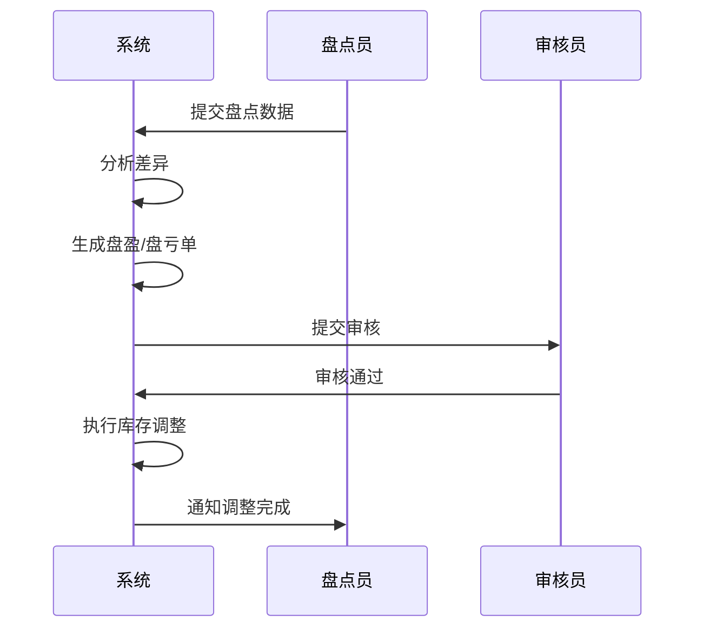

**图源**
- [AdjustmentDO.java](file://eplus-module-wms/eplus-module-wms-biz/src/main/java/com/syj/eplus/module/wms/dal/dataobject/adjustment/AdjustmentDO.java#L1-L105)
- [StocktakeController.java](file://eplus-module-wms/eplus-module-wms-biz/src/main/java/com/syj/eplus/module/wms/controller/admin/stocktake/StocktakeController.java#L104-L118)

## 盘点模式
系统支持三种盘点模式：周期性盘点、循环盘点和临时盘点，以满足不同场景的需求。

### 周期性盘点
周期性盘点是按照固定的时间间隔（如每月、每季度）进行的全面盘点。适用于需要定期核对所有库存的场景。

**配置方法：**
- 设置盘点周期（日、周、月、季度）
- 指定盘点日期
- 配置盘点范围（全部仓库或指定仓库）

### 循环盘点
循环盘点是将库存分为多个批次，按计划轮流进行盘点。适用于大型仓库，可以减少一次性盘点的工作量。

**配置方法：**
- 将库存分类（按产品类别、仓库区域等）
- 设置每个类别的盘点频率
- 制定循环盘点计划

### 临时盘点
临时盘点是根据特殊需求临时发起的盘点，如发现库存异常或重要产品变动时。适用于应急情况。

**配置方法：**
- 手动创建盘点计划
- 指定盘点范围和时间
- 分配盘点任务

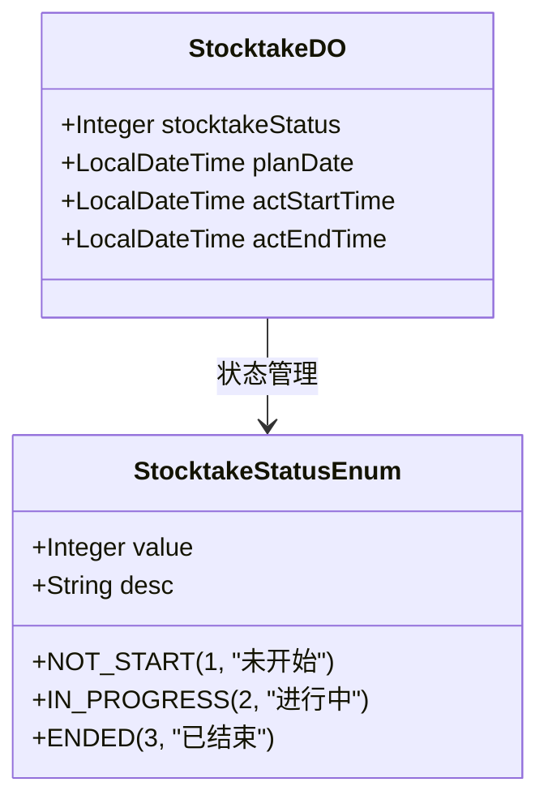

**图源**
- [StocktakeStatusEnum.java](file://eplus-module-wms/eplus-module-wms-api/src/main/java/com/syj/eplus/module/wms/enums/StocktakeStatusEnum.java#L1-L22)
- [StocktakeDO.java](file://eplus-module-wms/eplus-module-wms-biz/src/main/java/com/syj/eplus/module/wms/dal/dataobject/stocktake/StocktakeDO.java#L27-L109)

## 盘点单状态管理
盘点单的状态管理包括计划中、进行中、已完成和已审核四个主要状态，确保盘点流程的有序进行。

**状态转换流程：**
- **计划中**：盘点计划已创建，但尚未开始
- **进行中**：盘点任务已分配，正在执行盘点
- **已完成**：实地盘点数据已录入，等待审核
- **已审核**：盘点结果已审核，账务调整已完成

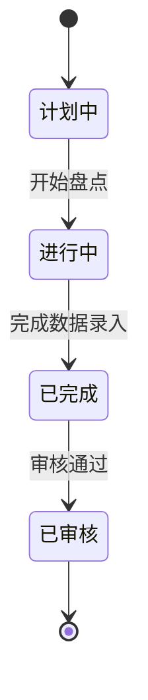

**图源**
- [StocktakeStatusEnum.java](file://eplus-module-wms/eplus-module-wms-api/src/main/java/com/syj/eplus/module/wms/enums/StocktakeStatusEnum.java#L1-L22)
- [StocktakeDO.java](file://eplus-module-wms/eplus-module-wms-biz/src/main/java/com/syj/eplus/module/wms/dal/dataobject/stocktake/StocktakeDO.java#L40-L43)

## 盘点结果确认机制
盘点结果确认机制确保盘点数据的准确性和可靠性。系统提供多层次的确认流程，包括数据录入确认、差异分析确认和最终审核确认。

**确认流程：**
1. **数据录入确认**：盘点人员在录入数据后进行二次确认
2. **差异分析确认**：系统自动分析差异，提示可能的错误
3. **最终审核确认**：管理人员对盘点结果进行最终审核

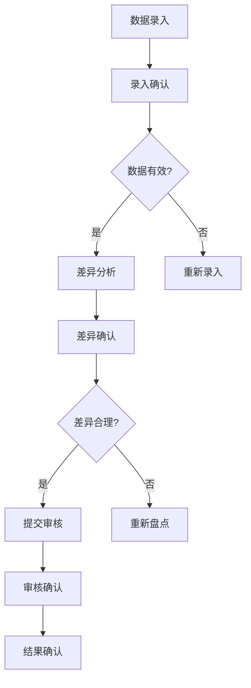

**图源**
- [StocktakeController.java](file://eplus-module-wms/eplus-module-wms-biz/src/main/java/com/syj/eplus/module/wms/controller/admin/stocktake/StocktakeController.java#L172-L186)
- [StocktakeService.java](file://eplus-module-wms/eplus-module-wms-biz/src/main/java/com/syj/eplus/module/wms/service/stocktake/StocktakeService.java#L140-L152)

## 移动端设备集成
系统支持与移动端盘点设备的集成，提高盘点效率和准确性。移动端设备可以通过Wi-Fi或移动网络与系统进行实时数据同步。

**集成方案：**
- **设备兼容性**：支持主流的移动设备和操作系统
- **数据同步**：实时同步盘点数据，确保数据一致性
- **离线模式**：支持离线盘点，网络恢复后自动同步
- **安全认证**：设备需要通过身份认证才能访问系统

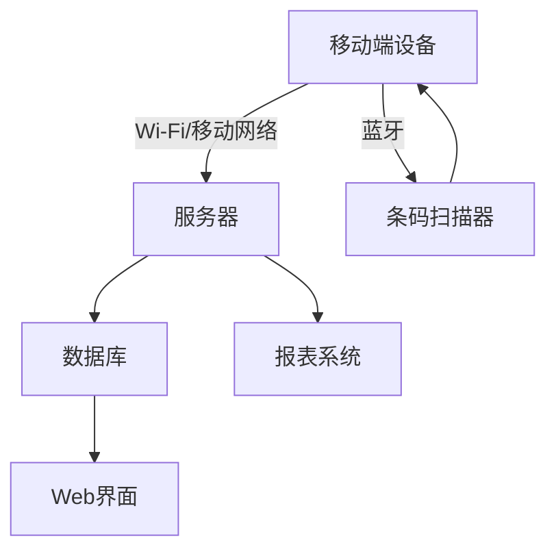

**图源**
- [StocktakeController.java](file://eplus-module-wms/eplus-module-wms-biz/src/main/java/com/syj/eplus/module/wms/controller/admin/stocktake/StocktakeController.java#L172-L186)
- [StocktakeService.java](file://eplus-module-wms/eplus-module-wms-biz/src/main/java/com/syj/eplus/module/wms/service/stocktake/StocktakeService.java#L140-L152)

## 条码扫描支持
系统全面支持条码扫描功能，提高盘点数据录入的效率和准确性。条码信息存储在产品主数据中，与库存记录关联。

**条码扫描功能：**
- **条码生成**：系统自动生成产品条码
- **条码打印**：支持条码标签打印
- **扫描识别**：快速识别各种条码格式
- **错误处理**：处理扫描错误和无效条码

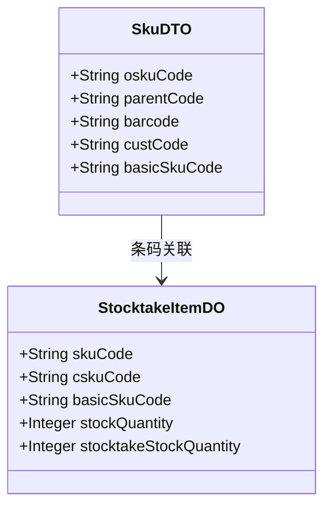

**图源**
- [SkuDTO.java](file://eplus-module-pms/eplus-module-pms-api/src/main/java/com/syj/eplus/module/pms/api/sku/dto/SkuDTO.java#L55-L80)
- [V1_0_0_582__增加条形码.java](file://eplus-flyway/src/main/java/db/migration/common/V1_0_0_582__增加条形码.java#L1-L24)

## 盘点差异预警设置
系统提供盘点差异预警功能，当盘点差异超过预设阈值时，自动发出预警通知。这有助于及时发现和处理库存异常。

**预警设置：**
- **差异阈值**：设置盘盈或盘亏的数量或金额阈值
- **预警级别**：根据差异程度设置不同级别的预警
- **通知方式**：通过系统消息、邮件或短信发送预警
- **处理流程**：定义预警后的处理步骤

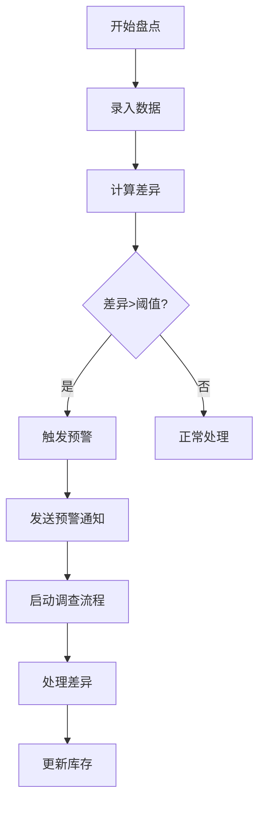

**图源**
- [DifferenceReason.java](file://eplus-framework/eplus-common/src/main/java/com/syj/eplus/framework/common/entity/DifferenceReason.java#L1-L26)
- [V1_0_0_421__盘盈盘亏单增加差异原因.java](file://eplus-flyway/src/main/java/db/migration/common/V1_0_0_421__盘盈盘亏单增加差异原因.java#L1-L15)