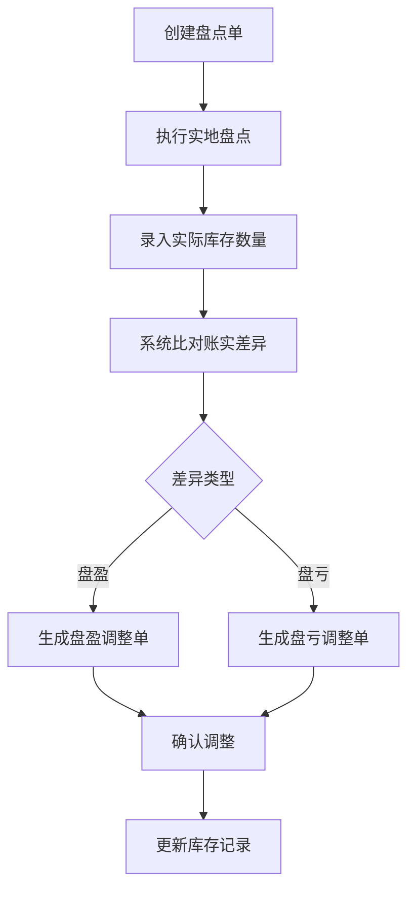
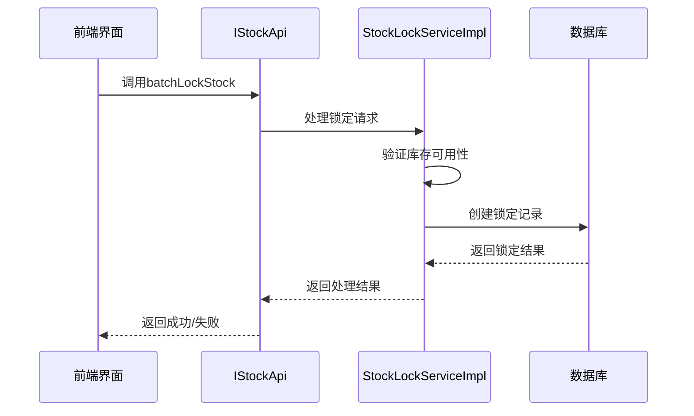
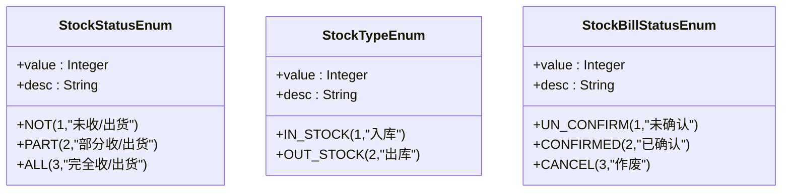
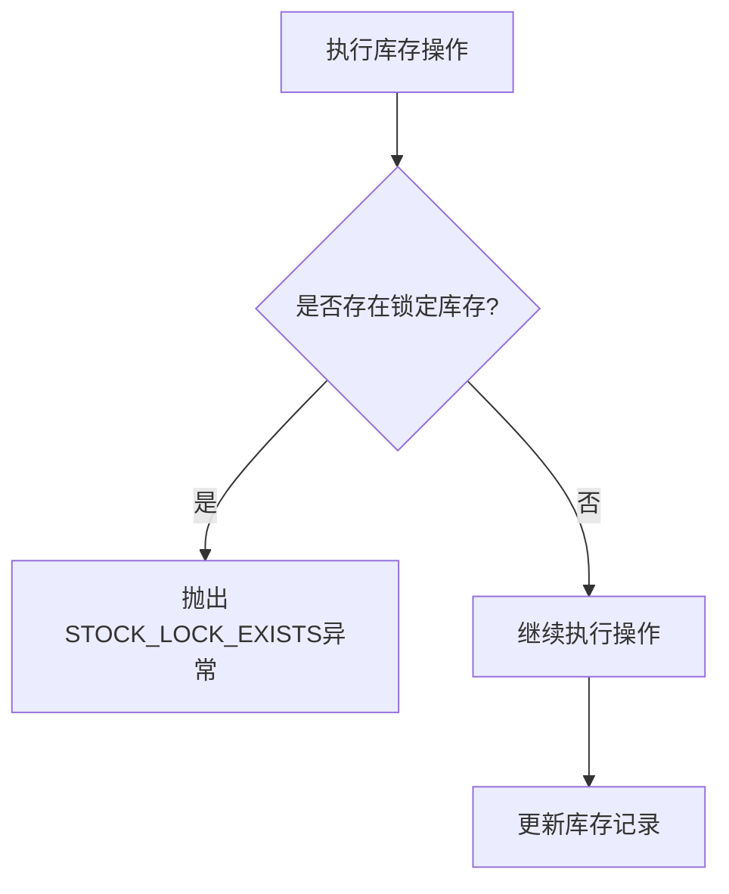

# 库存管理

<cite>
**本文档引用文件**   
- [StockDO.java](file://eplus-module-wms/eplus-module-wms-biz/src/main/java/com/syj/eplus/module/wms/dal/dataobject/stock/StockDO.java)
- [StockServiceImpl.java](file://eplus-module-wms/eplus-module-wms-biz/src/main/java/com/syj/eplus/module/wms/service/stock/StockServiceImpl.java)
- [StockLockDO.java](file://eplus-module-wms/eplus-module-wms-biz/src/main/java/com/syj/eplus/module/wms/dal/dataobject/stocklock/StockLockDO.java)
- [StockLockServiceImpl.java](file://eplus-module-wms/eplus-module-wms-biz/src/main/java/com/syj/eplus/module/wms/service/stocklock/StockLockServiceImpl.java)
- [StockApi.java](file://eplus-module-wms/eplus-module-wms-api/src/main/java/com/syj/eplus/module/wms/api/stock/IStockApi.java)
- [StocktakeResultEnum.java](file://eplus-module-wms/eplus-module-wms-api/src/main/java/com/syj/eplus/module/wms/enums/StocktakeResultEnum.java)
- [StockStatusEnum.java](file://eplus-module-wms/eplus-module-wms-api/src/main/java/com/syj/eplus/module/wms/enums/StockStatusEnum.java)
- [StockTypeEnum.java](file://eplus-module-wms/eplus-module-wms-api/src/main/java/com/syj/eplus/module/wms/enums/StockTypeEnum.java)
- [StockBillStatusEnum.java](file://eplus-module-wms/eplus-module-wms-api/src/main/java/com/syj/eplus/module/wms/enums/StockBillStatusEnum.java)
- [StockSourceTypeEnum.java](file://eplus-module-wms/eplus-module-wms-api/src/main/java/com/syj/eplus/module/wms/enums/StockSourceTypeEnum.java)
- [StockLockSourceTypeEnum.java](file://eplus-module-wms/eplus-module-wms-api/src/main/java/com/syj/eplus/module/wms/enums/StockLockSourceTypeEnum.java)
- [AdjustmentDO.java](file://eplus-module-wms/eplus-module-wms-biz/src/main/java/com/syj/eplus/module/wms/dal/dataobject/adjustment/AdjustmentDO.java)
- [AdjustmentItemDO.java](file://eplus-module-wms/eplus-module-wms-biz/src/main/java/com/syj/eplus/module/wms/dal/dataobject/adjustment/AdjustmentItemDO.java)
- [StockMapper.java](file://eplus-module-wms/eplus-module-wms-biz/src/main/java/com/syj/eplus/module/wms/dal/mysql/stock/StockMapper.java)
- [StockLockMapper.java](file://eplus-module-wms/eplus-module-wms-biz/src/main/java/com/syj/eplus/module/wms/dal/mysql/stocklock/StockLockMapper.java)
- [StocktakeAuditResultListener.java](file://eplus-module-wms/eplus-module-wms-biz/src/main/java/com/syj/eplus/module/wms/listener/stocktake/StocktakeAuditResultListener.java)
</cite>

## 目录
1. [库存查询功能](#库存查询功能)
2. [库存调整与盘点流程](#库存调整与盘点流程)
3. [库存锁定机制](#库存锁定机制)
4. [库存状态管理](#库存状态管理)
5. [库存核算方法](#库存核算方法)
6. [库存预警设置](#库存预警设置)

## 库存查询功能

系统提供多维度的库存明细查询功能，支持按产品、仓库、批次等条件进行精确查询。通过`StockServiceImpl`类中的`listBatch`和`queryBatch`方法实现库存查询逻辑，能够根据查询条件返回符合条件的库存记录。

库存查询支持以下维度：
- 产品维度：通过产品SKU编码、产品名称等进行查询
- 仓库维度：指定仓库ID或名称进行查询
- 批次维度：按批次号进行精确查询
- 时间维度：按入库时间范围进行查询
- 客户维度：按客户信息进行查询

查询结果包含详细的库存信息，包括批次号、入库数量、出库数量、锁定数量、可用数量等关键指标。系统通过`StockMapper`接口与数据库交互，使用MyBatis Plus的Lambda查询构建器实现灵活的查询条件组合。

**Section sources**
- [StockServiceImpl.java](file://eplus-module-wms/eplus-module-wms-biz/src/main/java/com/syj/eplus/module/wms/service/stock/StockServiceImpl.java#L373-L495)
- [StockMapper.java](file://eplus-module-wms/eplus-module-wms-biz/src/main/java/com/syj/eplus/module/wms/dal/mysql/stock/StockMapper.java#L52-L81)
- [StockDO.java](file://eplus-module-wms/eplus-module-wms-biz/src/main/java/com/syj/eplus/module/wms/dal/dataobject/stock/StockDO.java#L36-L258)

## 库存调整与盘点流程

库存调整和盘点是确保库存数据准确性的关键流程。系统通过盘点单和调整单的协同工作实现库存的准确管理。

### 盘点流程
1. 创建盘点单，选择需要盘点的仓库和产品范围
2. 执行实地盘点，录入实际库存数量
3. 系统自动比对账面库存与实际库存
4. 生成盘盈或盘亏结果

### 调整流程
当盘点结果显示账实不符时，系统自动生成相应的调整单：



**Diagram sources**
- [StocktakeAuditResultListener.java](file://eplus-module-wms/eplus-module-wms-biz/src/main/java/com/syj/eplus/module/wms/listener/stocktake/StocktakeAuditResultListener.java#L65-L160)
- [AdjustmentDO.java](file://eplus-module-wms/eplus-module-wms-biz/src/main/java/com/syj/eplus/module/wms/dal/dataobject/adjustment/AdjustmentDO.java#L27-L104)
- [AdjustmentItemDO.java](file://eplus-module-wms/eplus-module-wms-biz/src/main/java/com/syj/eplus/module/wms/dal/dataobject/adjustment/AdjustmentItemDO.java#L28-L107)

**Section sources**
- [StocktakeAuditResultListener.java](file://eplus-module-wms/eplus-module-wms-biz/src/main/java/com/syj/eplus/module/wms/listener/stocktake/StocktakeAuditResultListener.java#L65-L160)
- [AdjustmentDO.java](file://eplus-module-wms/eplus-module-wms-biz/src/main/java/com/syj/eplus/module/wms/dal/dataobject/adjustment/AdjustmentDO.java#L27-L104)

## 库存锁定机制

库存锁定机制是确保库存分配准确性的核心功能，主要用于销售、采购等业务场景中防止库存超卖。

### 锁定类型
系统支持多种锁定类型，通过`StockLockSourceTypeEnum`枚举定义：
- 销售合同：为销售订单锁定库存
- 加工单：为生产加工锁定原材料
- 调拨单：为仓库间调拨锁定库存
- 采购计划：为采购需求锁定库存
- 出库通知单：为出库操作锁定库存

### 锁定流程


**Diagram sources**
- [StockLockServiceImpl.java](file://eplus-module-wms/eplus-module-wms-biz/src/main/java/com/syj/eplus/module/wms/service/stocklock/StockLockServiceImpl.java#L73-L87)
- [StockLockDO.java](file://eplus-module-wms/eplus-module-wms-biz/src/main/java/com/syj/eplus/module/wms/dal/dataobject/stocklock/StockLockDO.java#L27-L111)
- [IStockApi.java](file://eplus-module-wms/eplus-module-wms-api/src/main/java/com/syj/eplus/module/wms/api/stock/IStockApi.java#L38-L47)

**Section sources**
- [StockLockServiceImpl.java](file://eplus-module-wms/eplus-module-wms-biz/src/main/java/com/syj/eplus/module/wms/service/stocklock/StockLockServiceImpl.java#L73-L87)
- [StockLockDO.java](file://eplus-module-wms/eplus-module-wms-biz/src/main/java/com/syj/eplus/module/wms/dal/dataobject/stocklock/StockLockDO.java#L27-L111)

## 库存状态管理

系统定义了多种库存状态，用于准确反映库存的实际状况。

### 库存状态类型
通过`StockStatusEnum`枚举定义了以下状态：
- 未收/出货：初始状态，表示尚未进行收货或出货操作
- 部分收/出货：部分完成状态，表示已部分完成收货或出货
- 完全收/出货：完成状态，表示收货或出货操作已全部完成

### 库存类型
通过`StockTypeEnum`枚举定义了出入库类型：
- 入库：表示库存增加的操作
- 出库：表示库存减少的操作

### 单据状态
通过`StockBillStatusEnum`枚举定义了单据状态：
- 未确认：单据创建但未确认
- 已确认：单据已确认，相关库存操作已生效
- 作废：单据已作废，不产生库存变动



**Diagram sources**
- [StockStatusEnum.java](file://eplus-module-wms/eplus-module-wms-api/src/main/java/com/syj/eplus/module/wms/enums/StockStatusEnum.java#L1-L24)
- [StockTypeEnum.java](file://eplus-module-wms/eplus-module-wms-api/src/main/java/com/syj/eplus/module/wms/enums/StockTypeEnum.java#L1-L22)
- [StockBillStatusEnum.java](file://eplus-module-wms/eplus-module-wms-api/src/main/java/com/syj/eplus/module/wms/enums/StockBillStatusEnum.java#L1-L22)

**Section sources**
- [StockStatusEnum.java](file://eplus-module-wms/eplus-module-wms-api/src/main/java/com/syj/eplus/module/wms/enums/StockStatusEnum.java#L1-L24)
- [StockTypeEnum.java](file://eplus-module-wms/eplus-module-wms-api/src/main/java/com/syj/eplus/module/wms/enums/StockTypeEnum.java#L1-L22)

## 库存核算方法

系统支持多种库存核算方法，确保成本计算的准确性。

### 可用数量计算
系统采用以下公式计算可用数量：
```
可用数量 = (入库数量 - 在制数量) - 出库数量
```

在`StockServiceImpl`类中，通过`calcAvailableQuantitySubLockQuantity`方法实现可用数量的计算逻辑，考虑了锁定库存的影响。

### 计价方式
虽然代码中未明确实现FIFO（先进先出）计价方式的具体逻辑，但系统具备支持多种计价方式的基础架构。通过`JsonAmount`对象存储价格信息，支持不同货币的金额计算。

库存成本计算涉及以下要素：
- 单价：每单位产品的采购价格
- 总金额：单价与数量的乘积
- 剩余总金额：根据剩余库存数量动态计算

**Section sources**
- [StockServiceImpl.java](file://eplus-module-wms/eplus-module-wms-biz/src/main/java/com/syj/eplus/module/wms/service/stock/StockServiceImpl.java#L503-L520)
- [StockDO.java](file://eplus-module-wms/eplus-module-wms-biz/src/main/java/com/syj/eplus/module/wms/dal/dataobject/stock/StockDO.java#L93-L105)

## 库存预警设置

系统通过业务逻辑和数据验证机制实现库存预警功能，防止库存异常操作。

### 预警规则
1. **锁定库存检查**：在删除采购合同时，检查是否存在关联的锁定库存，防止误操作
2. **库存可用性验证**：在执行出库操作前，验证库存是否足够
3. **重复锁定检查**：防止同一库存被重复锁定

### 预警处理
当触发预警条件时，系统通过异常机制抛出相应的错误信息。例如，在`StockServiceImpl`的`deleteByPurchaseContractCode`方法中，如果存在锁定库存，则抛出`STOCK_LOCK_EXISTS`异常。



**Diagram sources**
- [StockServiceImpl.java](file://eplus-module-wms/eplus-module-wms-biz/src/main/java/com/syj/eplus/module/wms/service/stock/StockServiceImpl.java#L634-L645)
- [ErrorCodeConstants.java](file://eplus-module-wms/eplus-module-wms-api/src/main/java/com/syj/eplus/module/wms/enums/ErrorCodeConstants.java)

**Section sources**
- [StockServiceImpl.java](file://eplus-module-wms/eplus-module-wms-biz/src/main/java/com/syj/eplus/module/wms/service/stock/StockServiceImpl.java#L634-L645)