# 库存锁定

<cite>
**本文档引用的文件**   
- [StockLockServiceImpl.java](file://eplus-module-wms/eplus-module-wms-biz/src/main/java/com/syj/eplus/module/wms/service/stocklock/StockLockServiceImpl.java)
- [StockLockDO.java](file://eplus-module-wms/eplus-module-wms-biz/src/main/java/com/syj/eplus/module/wms/dal/dataobject/stocklock/StockLockDO.java)
- [StockLockVO.java](file://eplus-module-wms/eplus-module-wms-biz/src/main/java/com/syj/eplus/module/wms/controller/admin/stocklock/vo/StockLockVO.java)
- [SaleContractServiceImpl.java](file://eplus-module-sms/eplus-module-sms-biz/src/main/java/com/syj/eplus/module/sms/service/salecontract/SaleContractServiceImpl.java)
- [PurchasePlanServiceImpl.java](file://eplus-module-scm/eplus-module-scm-biz/src/main/java/com/syj/eplus/module/scm/service/purchaseplan/PurchasePlanServiceImpl.java)
- [StockApiImpl.java](file://eplus-module-wms/eplus-module-wms-biz/src/main/java/com/syj/eplus/module/wms/api/stock/StockApiImpl.java)
- [StockApi.java](file://eplus-module-wms/eplus-module-wms-api/src/main/java/com/syj/eplus/module/wms/api/stock/IStockApi.java)
- [StockLockSourceTypeEnum.java](file://eplus-module-wms/eplus-module-wms-api/src/main/java/com/syj/eplus/module/wms/enums/StockLockSourceTypeEnum.java)
- [V1_0_0_002__Eplus初始化.sql](file://eplus-flyway/src/main/resources/db/migration/common/V1_0_0_002__Eplus初始化.sql)
</cite>

## 目录
1. [库存锁定机制概述](#库存锁定机制概述)
2. [核心组件分析](#核心组件分析)
3. [库存锁定创建与释放流程](#库存锁定创建与释放流程)
4. [业务场景中的库存预占实现](#业务场景中的库存预占实现)
5. [锁定状态与可用库存计算关系](#锁定状态与可用库存计算关系)
6. [锁定优先级处理规则](#锁定优先级处理规则)
7. [锁定冲突解决策略](#锁定冲突解决策略)
8. [性能优化建议](#性能优化建议)

## 库存锁定机制概述

库存锁定机制是企业资源规划系统中的关键功能，用于在销售合同、采购订单、生产计划等业务场景中实现库存预占。该机制通过在数据库中创建锁定记录来确保特定数量的库存被预留，防止其他业务流程占用，从而保证业务的顺利执行。系统支持多种业务单据类型的库存锁定，包括销售合同、采购计划、加工单和调拨单等。

**Section sources**
- [StockLockSourceTypeEnum.java](file://eplus-module-wms/eplus-module-wms-api/src/main/java/com/syj/eplus/module/wms/enums/StockLockSourceTypeEnum.java#L1-L24)
- [V1_0_0_002__Eplus初始化.sql](file://eplus-flyway/src/main/resources/db/migration/common/V1_0_0_002__Eplus初始化.sql#L2405-L2427)

## 核心组件分析

库存锁定功能由多个核心组件构成，包括数据对象、服务实现、API接口和控制器。这些组件协同工作，实现了完整的库存锁定生命周期管理。

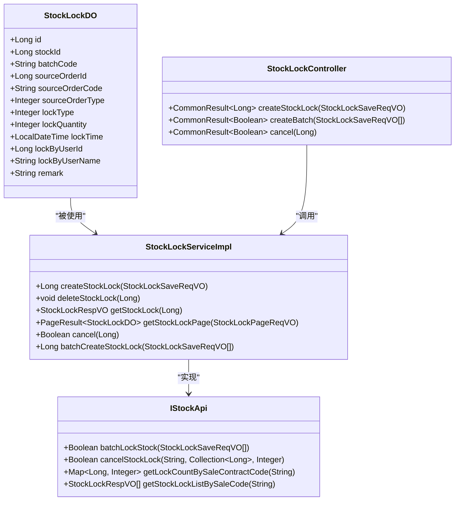

**Diagram sources **
- [StockLockDO.java](file://eplus-module-wms/eplus-module-wms-biz/src/main/java/com/syj/eplus/module/wms/dal/dataobject/stocklock/StockLockDO.java#L1-L25)
- [StockLockServiceImpl.java](file://eplus-module-wms/eplus-module-wms-biz/src/main/java/com/syj/eplus/module/wms/service/stocklock/StockLockServiceImpl.java#L53-L393)
- [StockApi.java](file://eplus-module-wms/eplus-module-wms-api/src/main/java/com/syj/eplus/module/wms/api/stock/IStockApi.java#L1-L246)
- [StockLockController.java](file://eplus-module-wms/eplus-module-wms-biz/src/main/java/com/syj/eplus/module/wms/controller/admin/stocklock/StockLockController.java#L35-L61)

**Section sources**
- [StockLockDO.java](file://eplus-module-wms/eplus-module-wms-biz/src/main/java/com/syj/eplus/module/wms/dal/dataobject/stocklock/StockLockDO.java#L1-L25)
- [StockLockServiceImpl.java](file://eplus-module-wms/eplus-module-wms-biz/src/main/java/com/syj/eplus/module/wms/service/stocklock/StockLockServiceImpl.java#L53-L393)
- [StockApi.java](file://eplus-module-wms/eplus-module-wms-api/src/main/java/com/syj/eplus/module/wms/api/stock/IStockApi.java#L1-L246)
- [StockLockController.java](file://eplus-module-wms/eplus-module-wms-biz/src/main/java/com/syj/eplus/module/wms/controller/admin/stocklock/StockLockController.java#L35-L61)

## 库存锁定创建与释放流程

库存锁定的创建和释放是通过一系列协调的操作完成的，确保数据的一致性和业务的完整性。创建流程首先验证库存可用性，然后更新库存数量并创建锁定记录；释放流程则相反，先删除锁定记录，再更新库存数量。

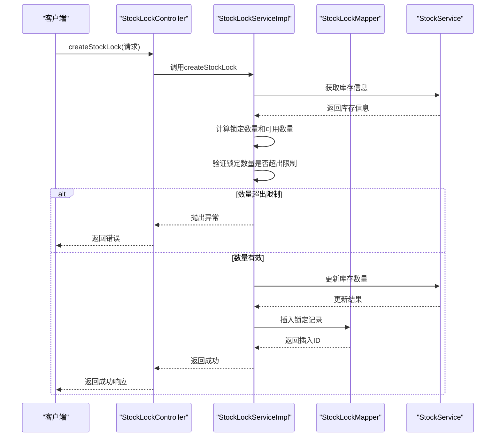

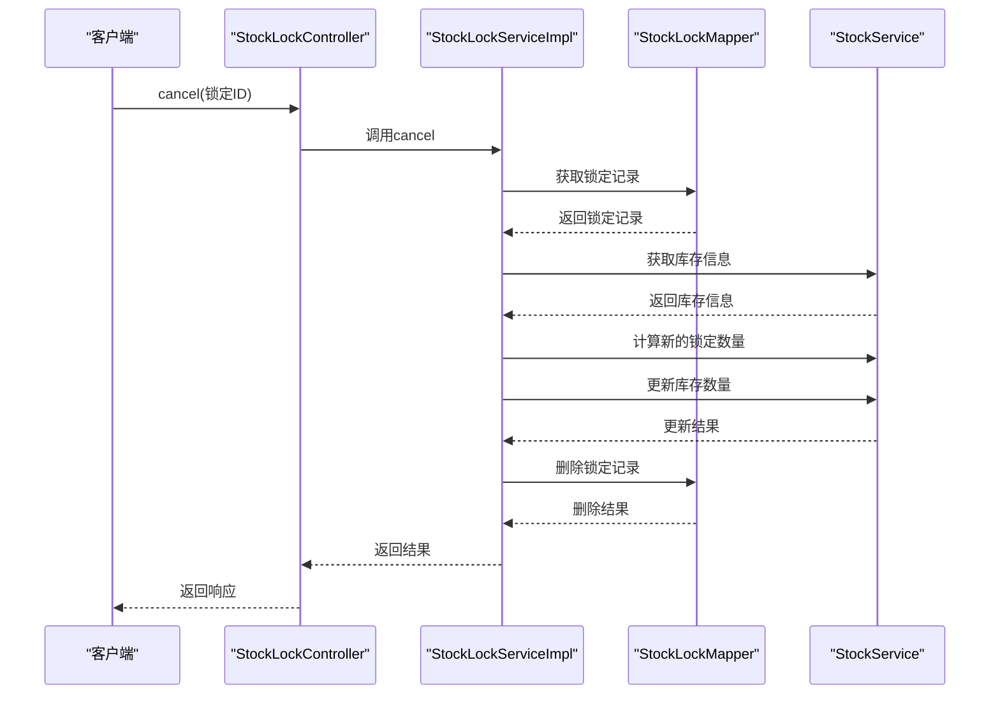

**Diagram sources **
- [StockLockServiceImpl.java](file://eplus-module-wms/eplus-module-wms-biz/src/main/java/com/syj/eplus/module/wms/service/stocklock/StockLockServiceImpl.java#L73-L150)
- [StockApiImpl.java](file://eplus-module-wms/eplus-module-wms-biz/src/main/java/com/syj/eplus/module/wms/api/stock/StockApiImpl.java#L184-L206)

**Section sources**
- [StockLockServiceImpl.java](file://eplus-module-wms/eplus-module-wms-biz/src/main/java/com/syj/eplus/module/wms/service/stocklock/StockLockServiceImpl.java#L73-L150)
- [StockApiImpl.java](file://eplus-module-wms/eplus-module-wms-biz/src/main/java/com/syj/eplus/module/wms/api/stock/StockApiImpl.java#L184-L206)

## 业务场景中的库存预占实现

在不同的业务场景中，库存预占的实现方式有所不同。销售合同、采购计划等业务模块通过调用库存API来实现库存锁定，确保业务流程的顺利进行。

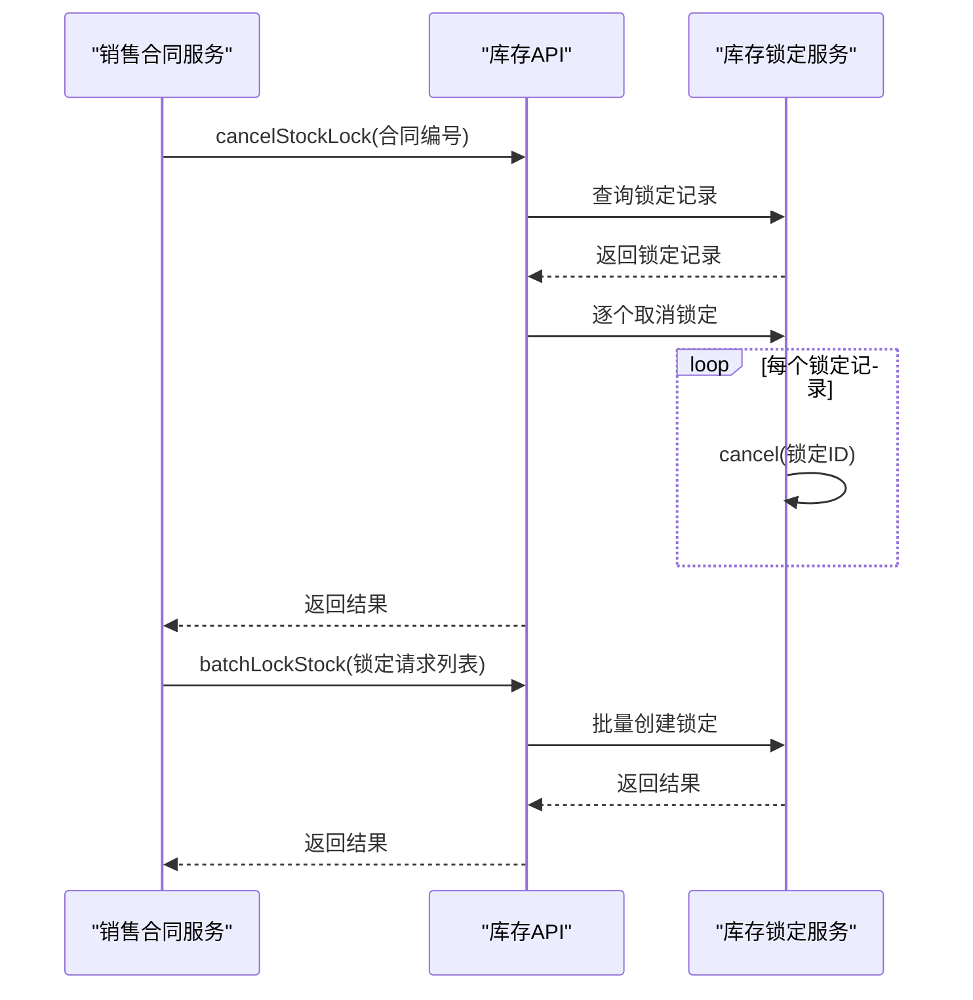

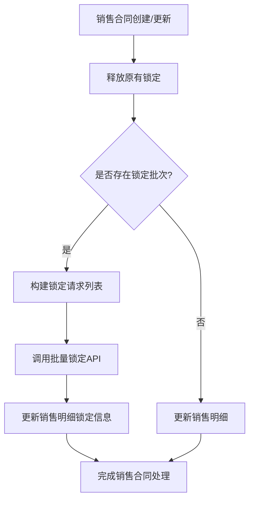

**Diagram sources **
- [SaleContractServiceImpl.java](file://eplus-module-sms/eplus-module-sms-biz/src/main/java/com/syj/eplus/module/sms/service/salecontract/SaleContractServiceImpl.java#L763-L793)
- [PurchasePlanServiceImpl.java](file://eplus-module-scm/eplus-module-scm-biz/src/main/java/com/syj/eplus/module/scm/service/purchaseplan/PurchasePlanServiceImpl.java#L649-L686)

**Section sources**
- [SaleContractServiceImpl.java](file://eplus-module-sms/eplus-module-sms-biz/src/main/java/com/syj/eplus/module/sms/service/salecontract/SaleContractServiceImpl.java#L763-L793)
- [PurchasePlanServiceImpl.java](file://eplus-module-scm/eplus-module-scm-biz/src/main/java/com/syj/eplus/module/scm/service/purchaseplan/PurchasePlanServiceImpl.java#L649-L686)

## 锁定状态与可用库存计算关系

库存锁定状态与可用库存的计算关系是库存管理的核心逻辑。系统通过维护库存的多个数量字段来精确跟踪库存状态，确保库存数据的准确性和一致性。

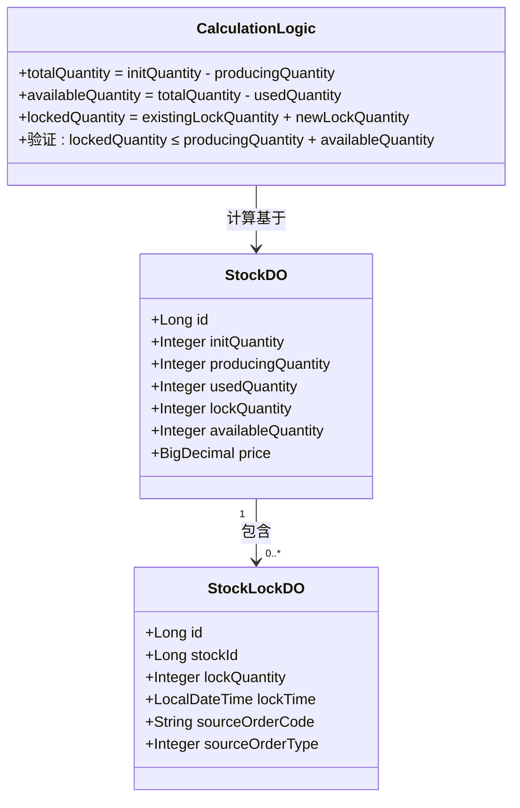

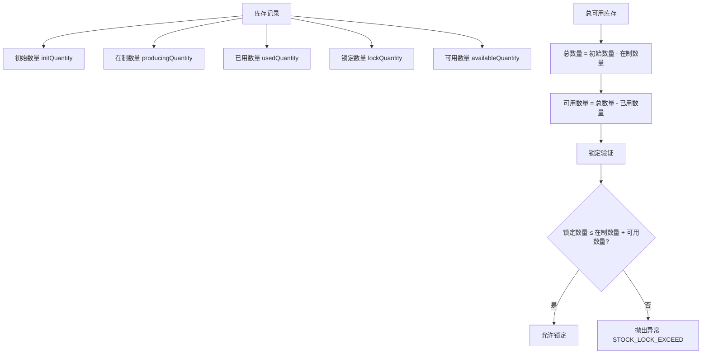

**Diagram sources **
- [StockLockServiceImpl.java](file://eplus-module-wms/eplus-module-wms-biz/src/main/java/com/syj/eplus/module/wms/service/stocklock/StockLockServiceImpl.java#L81-L91)
- [StockDO.java](file://eplus-module-wms/eplus-module-wms-biz/src/main/java/com/syj/eplus/module/wms/dal/dataobject/stock/StockDO.java)

**Section sources**
- [StockLockServiceImpl.java](file://eplus-module-wms/eplus-module-wms-biz/src/main/java/com/syj/eplus/module/wms/service/stocklock/StockLockServiceImpl.java#L81-L91)

## 锁定优先级处理规则

系统通过多种因素来确定库存锁定的优先级，包括订单紧急程度、客户等级等业务属性。这些规则在业务逻辑层实现，确保高优先级的订单能够优先获得库存资源。

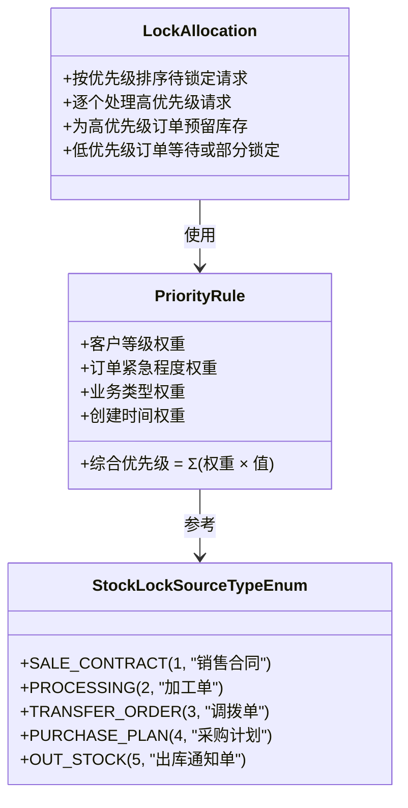

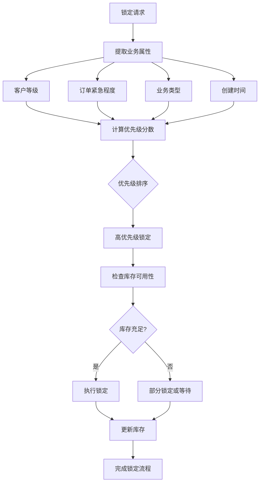

**Diagram sources **
- [StockLockSourceTypeEnum.java](file://eplus-module-wms/eplus-module-wms-api/src/main/java/com/syj/eplus/module/wms/enums/StockLockSourceTypeEnum.java#L1-L24)
- [SaleContractServiceImpl.java](file://eplus-module-sms/eplus-module-sms-biz/src/main/java/com/syj/eplus/module/sms/service/salecontract/SaleContractServiceImpl.java)
- [PurchasePlanServiceImpl.java](file://eplus-module-scm/eplus-module-scm-biz/src/main/java/com/syj/eplus/module/scm/service/purchaseplan/PurchasePlanServiceImpl.java)

**Section sources**
- [StockLockSourceTypeEnum.java](file://eplus-module-wms/eplus-module-wms-api/src/main/java/com/syj/eplus/module/wms/enums/StockLockSourceTypeEnum.java#L1-L24)

## 锁定冲突解决策略

当多个业务流程同时尝试锁定同一库存时，系统通过事务管理和冲突检测机制来解决锁定冲突，确保数据的一致性和业务的正确性。

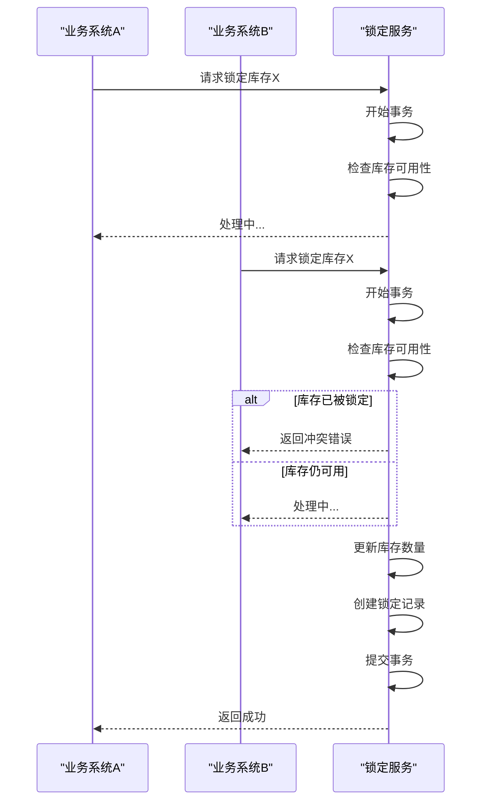

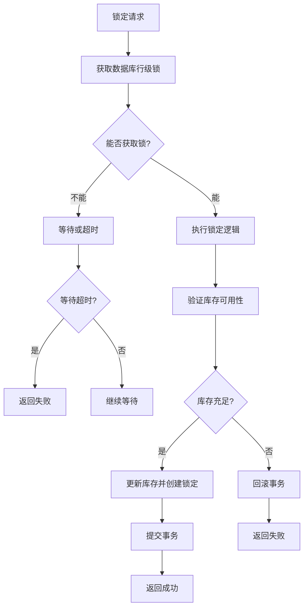

**Diagram sources **
- [StockLockServiceImpl.java](file://eplus-module-wms/eplus-module-wms-biz/src/main/java/com/syj/eplus/module/wms/service/stocklock/StockLockServiceImpl.java#L72-L73)
- [StockLockServiceImpl.java](file://eplus-module-wms/eplus-module-wms-biz/src/main/java/com/syj/eplus/module/wms/service/stocklock/StockLockServiceImpl.java#L133-L134)

**Section sources**
- [StockLockServiceImpl.java](file://eplus-module-wms/eplus-module-wms-biz/src/main/java/com/syj/eplus/module/wms/service/stocklock/StockLockServiceImpl.java#L72-L73)
- [StockLockServiceImpl.java](file://eplus-module-wms/eplus-module-wms-biz/src/main/java/com/syj/eplus/module/wms/service/stocklock/StockLockServiceImpl.java#L133-L134)

## 性能优化建议

为了确保库存锁定功能在高并发场景下的性能和稳定性，系统采用了多种优化策略，包括批量操作、缓存机制和数据库优化等。

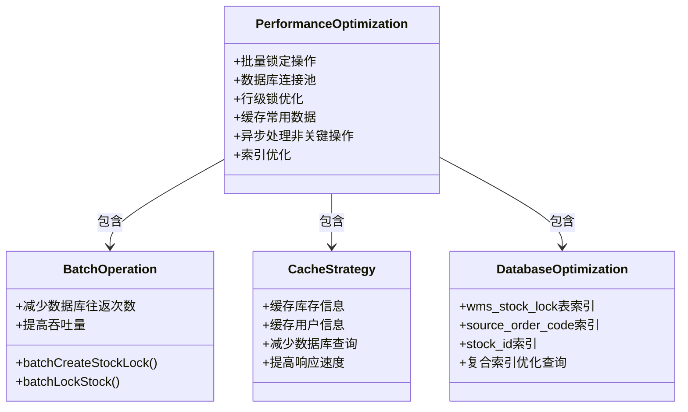

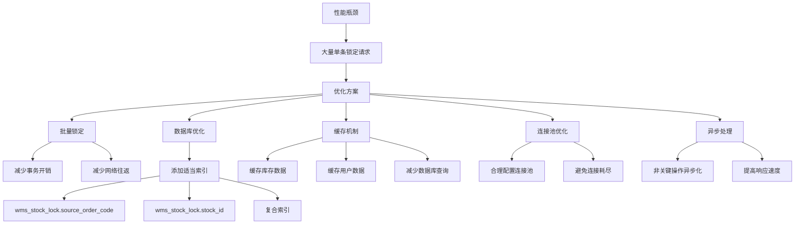

**Diagram sources **
- [StockLockServiceImpl.java](file://eplus-module-wms/eplus-module-wms-biz/src/main/java/com/syj/eplus/module/wms/service/stocklock/StockLockServiceImpl.java#L153-L199)
- [StockApi.java](file://eplus-module-wms/eplus-module-wms-api/src/main/java/com/syj/eplus/module/wms/api/stock/IStockApi.java#L38-L39)
- [V1_0_0_002__Eplus初始化.sql](file://eplus-flyway/src/main/resources/db/migration/common/V1_0_0_002__Eplus初始化.sql#L2405-L2427)

**Section sources**
- [StockLockServiceImpl.java](file://eplus-module-wms/eplus-module-wms-biz/src/main/java/com/syj/eplus/module/wms/service/stocklock/StockLockServiceImpl.java#L153-L199)
- [StockApi.java](file://eplus-module-wms/eplus-module-wms-api/src/main/java/com/syj/eplus/module/wms/api/stock/IStockApi.java#L38-L39)