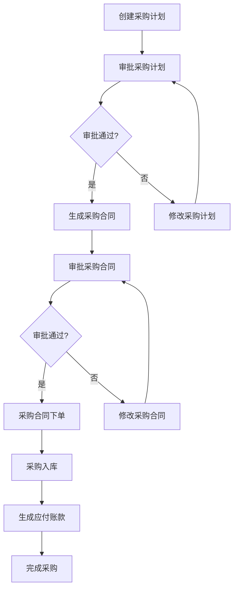
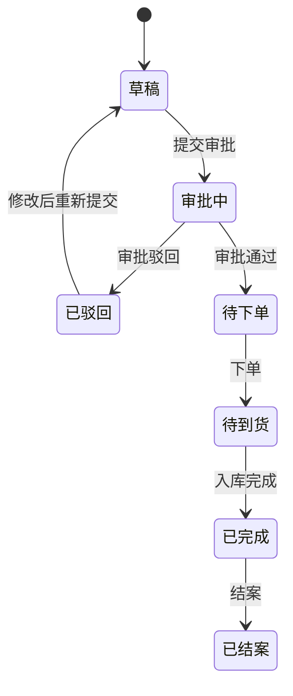
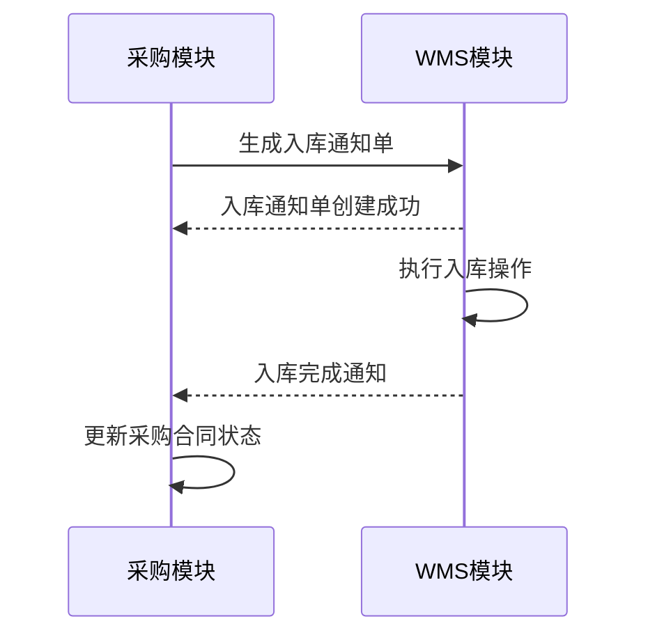
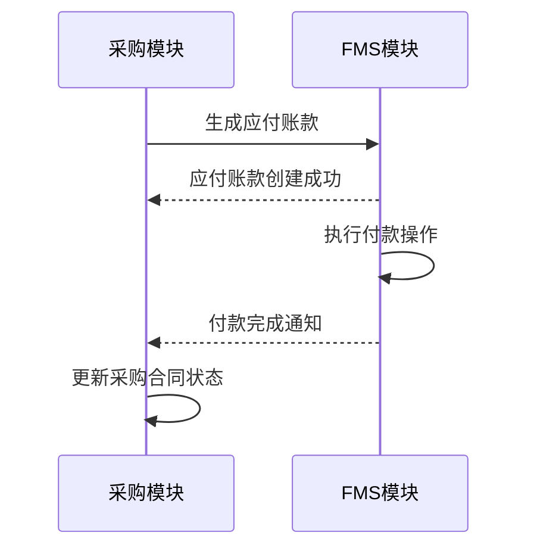

# 供应链管理

<cite>
**本文档引用文件**   
- [PurchasePlanApi.java](file://eplus-module-scm/eplus-module-scm-api/src/main/java/com/syj/eplus/module/scm/api/purchaseplan/PurchasePlanApi.java)
- [PurchaseContractApi.java](file://eplus-module-scm/eplus-module-scm-api/src/main/java/com/syj/eplus/module/scm/api/purchasecontract/PurchaseContractApi.java)
- [VenderApi.java](file://eplus-module-scm/eplus-module-scm-api/src/main/java/com/syj/eplus/module/scm/api/vender/VenderApi.java)
- [PurchaseContractServiceImpl.java](file://eplus-module-scm/eplus-module-scm-biz/src/main/java/com/syj/eplus/module/scm/service/purchasecontract/PurchaseContractServiceImpl.java)
- [PurchasePlanServiceImpl.java](file://eplus-module-scm/eplus-module-scm-biz/src/main/java/com/syj/eplus/module/scm/service/purchaseplan/PurchasePlanServiceImpl.java)
- [PurchaseContractDO.java](file://eplus-module-scm/eplus-module-scm-biz/src/main/java/com/syj/eplus/module/scm/dal/dataobject/purchasecontract/PurchaseContractDO.java)
- [PurchasePlanDO.java](file://eplus-module-scm/eplus-module-scm-biz/src/main/java/com/syj/eplus/module/scm/dal/dataobject/purchaseplan/PurchasePlanDO.java)
- [VenderDO.java](file://eplus-module-scm/eplus-module-scm-biz/src/main/java/com/syj/eplus/module/scm/dal/dataobject/vender/VenderDO.java)
- [PurchaseCheckStatusEmums.java](file://eplus-module-scm/eplus-module-scm-api/src/main/java/com/syj/eplus/module/scm/enums/PurchaseCheckStatusEmums.java)
- [PurchaseContractStatusEnum.java](file://eplus-framework/eplus-common/src/main/java/com/syj/eplus/framework/common/enums/PurchaseContractStatusEnum.java)
</cite>

## 目录
1. [采购计划管理](#采购计划管理)
2. [采购合同管理](#采购合同管理)
3. [供应商管理](#供应商管理)
4. [采购流程生命周期](#采购流程生命周期)
5. [采购合同状态机](#采购合同状态机)
6. [采购模块集成点](#采购模块集成点)
7. [关键数据模型](#关键数据模型)

## 采购计划管理

采购计划模块是供应链管理的核心起点，负责从销售合同生成采购需求，管理采购计划的创建、审批和执行。采购计划通过`PurchasePlanApi`接口提供服务，支持创建、查询和更新采购计划。

采购计划的主要功能包括：
- 根据销售合同生成采购计划
- 管理采购计划明细，包括产品、数量、价格等信息
- 支持采购计划的审批流程
- 与采购合同的关联和转换

采购计划的状态包括：待提交、待审核、已驳回、已完成、已结案。采购计划的创建和更新操作会触发相应的业务流程，如审批流程。

**Section sources**
- [PurchasePlanApi.java](file://eplus-module-scm/eplus-module-scm-api/src/main/java/com/syj/eplus/module/scm/api/purchaseplan/PurchasePlanApi.java#L13-L59)
- [PurchasePlanServiceImpl.java](file://eplus-module-scm/eplus-module-scm-biz/src/main/java/com/syj/eplus/module/scm/service/purchaseplan/PurchasePlanServiceImpl.java#L192-L332)

## 采购合同管理

采购合同模块负责管理采购合同的全生命周期，从合同创建、审批到执行和完成。采购合同通过`PurchaseContractApi`接口提供服务，支持生成、查询、更新和审批采购合同。

采购合同的主要功能包括：
- 生成采购合同，支持从采购计划转换
- 管理采购合同明细，包括产品、数量、价格、交期等信息
- 支持采购合同的审批流程
- 管理采购合同的付款计划和开票信息
- 支持采购合同的变更和重构

采购合同的状态包括：待提交、待审批、已驳回、待下单、待到货、已完成、已结案。采购合同的创建和更新操作会触发相应的业务流程，如审批流程。

**Section sources**
- [PurchaseContractApi.java](file://eplus-module-scm/eplus-module-scm-api/src/main/java/com/syj/eplus/module/scm/api/purchasecontract/PurchaseContractApi.java#L18-L352)
- [PurchaseContractServiceImpl.java](file://eplus-module-scm/eplus-module-scm-biz/src/main/java/com/syj/eplus/module/scm/service/purchasecontract/PurchaseContractServiceImpl.java#L348-L587)

## 供应商管理

供应商管理模块负责管理供应商的档案信息，包括基本信息、联系人、付款方式等。供应商通过`VenderApi`接口提供服务，支持查询和更新供应商信息。

供应商管理的主要功能包括：
- 管理供应商的基本信息，如名称、编码、地址等
- 管理供应商的联系人信息
- 管理供应商的付款方式和银行抬头
- 支持供应商的变更和审批流程

供应商信息是采购合同的重要组成部分，采购合同创建时需要选择供应商，并自动填充供应商的相关信息。

**Section sources**
- [VenderApi.java](file://eplus-module-scm/eplus-module-scm-api/src/main/java/com/syj/eplus/module/scm/api/vender/VenderApi.java#L16-L110)
- [VenderDO.java](file://eplus-module-scm/eplus-module-scm-biz/src/main/java/com/syj/eplus/module/scm/dal/dataobject/vender/VenderDO.java#L37-L236)

## 采购流程生命周期

采购流程从采购计划创建开始，经过审批、生成采购合同、合同审批、下单、到货、入库等环节，最终完成采购。以下是采购流程的完整生命周期：



**Diagram sources**
- [PurchasePlanServiceImpl.java](file://eplus-module-scm/eplus-module-scm-biz/src/main/java/com/syj/eplus/module/scm/service/purchaseplan/PurchasePlanServiceImpl.java#L348-L332)
- [PurchaseContractServiceImpl.java](file://eplus-module-scm/eplus-module-scm-biz/src/main/java/com/syj/eplus/module/scm/service/purchasecontract/PurchaseContractServiceImpl.java#L348-L587)

## 采购合同状态机

采购合同的状态机描述了合同在不同状态之间的转换关系。采购合同的状态包括：草稿、审批、执行、完成等。



**Diagram sources**
- [PurchaseContractStatusEnum.java](file://eplus-framework/eplus-common/src/main/java/com/syj/eplus/framework/common/enums/PurchaseContractStatusEnum.java#L8-L15)

## 采购模块集成点

采购模块与其他模块有多个集成点，确保业务流程的顺畅和数据的一致性。

### 与WMS模块集成
采购合同下单后，会生成入库通知单，通知WMS模块进行入库操作。入库完成后，WMS模块会更新库存信息，并通知采购模块。



**Diagram sources**
- [PurchaseContractServiceImpl.java](file://eplus-module-scm/eplus-module-scm-biz/src/main/java/com/syj/eplus/module/scm/service/purchasecontract/PurchaseContractServiceImpl.java#L2049-L2075)

### 与FMS模块集成
采购合同完成后，会生成应付账款，通知FMS模块进行付款操作。付款完成后，FMS模块会更新应付账款信息，并通知采购模块。



**Diagram sources**
- [PurchaseContractApi.java](file://eplus-module-scm/eplus-module-scm-api/src/main/java/com/syj/eplus/module/scm/api/purchasecontract/PurchaseContractApi.java#L177-L177)

## 关键数据模型

### 采购合同数据模型

采购合同数据模型定义了采购合同的核心属性，包括合同编号、供应商、采购总金额、合同状态等。

```mermaid
erDiagram
PURCHASE_CONTRACT {
long id PK
string code
integer ver
integer confirmFlag
integer auditStatus
integer contractStatus
JsonAmount totalAmount
integer totalQuantity
integer printFlag
integer printTimes
integer prepayStatus
JsonAmount prepayAmount
integer payStatus
JsonAmount payedAmount
integer invoiceStatus
integer convertNoticeFlag
BigDecimal invoicedAmount
UserDept manager
long purchaseUserId
string purchaseUserName
long purchaseUserDeptId
string purchaseUserDeptName
long custId
long venderId
long stockId
string stockCode
string venderCode
string venderName
string custCode
string stockName
long purchasePlanId
string purchasePlanCode
long saleContractId
string saleContractCode
string remark
List<SimpleFile> annex
long companyId
LocalDateTime purchaseTime
long paymentId
string paymentName
long portId
JsonAmount freight
JsonAmount otherCost
LocalDateTime deliveryDate
LocalDateTime initDeliveryDate
LocalDateTime dealTime
LocalDateTime finishTime
LocalDateTime doneTime
LocalDateTime signBackTime
LocalDateTime orderTime
integer signBackFlag
integer taxType
integer equallyType
integer auxiliaryFlag
integer rePurchaseFlag
string rePurchaseDesc
LocalTime rePurchaseTime
integer rePurchaseOldFlag
integer produceCompleted
long paymentVenderId
string paymentVenderCode
string paymentVenderName
BigDecimal invoicedQuantity
string currency
string invoicedCurrency
string signBackDesc
integer changeStatus
integer autoFlag
List<string> linkCodeList
List<SimpleFile> designDraftList
List<SimpleFile> signBackAnnexList
integer placeOrderFlag
LocalDateTime placeOrderTime
integer planSourceType
integer checkStatus
integer repeatFlag
VenderPocDO venderPoc
UserDept sales
List<JsonEffectRange> effectRangeList
integer boxWithColor
integer sampleCount
string genContractUniqueCode
string deliveryAddress
integer auxiliaryPaymentFlag
BigDecimal minimumBaseQuantity
integer restockingDeadline
List<UserDept> auxiliaryPurchaseUser
List<UserDept> auxiliarySales
List<UserDept> auxiliaryManager
string processInstanceId
long syncCode
JsonAmount totalAmountRmb
BigDecimal taxRate
}
```

**Diagram sources**
- [PurchaseContractDO.java](file://eplus-module-scm/eplus-module-scm-biz/src/main/java/com/syj/eplus/module/scm/dal/dataobject/purchasecontract/PurchaseContractDO.java#L38-L468)

### 采购计划数据模型

采购计划数据模型定义了采购计划的核心属性，包括计划编号、客户、采购总金额、计划状态等。

```mermaid
erDiagram
PURCHASE_PLAN {
long id PK
integer ver
string code
integer auditStatus
integer planStatus
long custId
string custCode
string custName
integer sourceType
string remark
List<SimpleFile> annex
long companyId
LocalDateTime planDate
LocalDateTime finishTime
LocalDateTime doneTime
LocalDateTime estDeliveryDate
integer auxiliaryFlag
long saleContractId
string saleContractCode
JsonCompanyPath companyPath
List<string> linkCodeList
UserDept sales
List<UserDept> purchaseUserList
long sourcePlanId
integer splitFlag
List<UserDept> auxiliaryPurchaseUser
List<UserDept> auxiliarySales
List<UserDept> auxiliaryManager
long creatorDeptId
integer saleType
}
```

**Diagram sources**
- [PurchasePlanDO.java](file://eplus-module-scm/eplus-module-scm-biz/src/main/java/com/syj/eplus/module/scm/dal/dataobject/purchaseplan/PurchasePlanDO.java#L33-L185)

### 供应商数据模型

供应商数据模型定义了供应商的核心属性，包括供应商编码、名称、地址、联系人等。

```mermaid
erDiagram
VENDER {
long id PK
string sourceCode
integer changeFlag
integer changeStatus
integer ver
string code
string name
string nameEng
string nameShort
string registeredCapital
string legalPerson
List<long> businessScope
List<string> venderLinkCode
integer companyAreaId
integer factoryAreaId
string factoryAddress
integer venderType
integer venderLevel
string companyAddress
string licenseNo
string phone
integer abroadFlag
long countryId
integer auditStatus
List<long> buyerIds
List<BaseValue> buyerList
string remark
integer deliveryAreaId
string deliveryAddress
integer stageType
integer convertFlag
LocalDateTime convertTime
integer enableFlag
List<SimpleFile> annex
string fax
List<long> qualificationIds
integer changeDeleted
integer administrationVenderType
VenderRespVO oldVender
integer internalFlag
long internalCompanyId
string modelKey
List<JsonEffectRange> effectRangeList
List<JsonVenderTax> taxMsg
}
```

**Diagram sources**
- [VenderDO.java](file://eplus-module-scm/eplus-module-scm-biz/src/main/java/com/syj/eplus/module/scm/dal/dataobject/vender/VenderDO.java#L37-L236)