# 付款计划

<cite>
**本文档引用文件**   
- [PurchasePaymentPlanDTO.java](file://eplus-module-scm/eplus-module-scm-api/src/main/java/com/syj/eplus/module/scm/api/purchasecontract/dto/PurchasePaymentPlanDTO.java)
- [PurchasePaymentPlan.java](file://eplus-module-scm/eplus-module-scm-biz/src/main/java/com/syj/eplus/module/scm/dal/dataobject/paymentplan/PurchasePaymentPlan.java)
- [scm_payment_plan.sql](file://eplus-flyway/src/main/resources/db/migration/common/V1_0_0_073__付款相关表.sql)
- [PaymentApplyServiceImpl.java](file://eplus-module-scm/eplus-module-scm-biz/src/main/java/com/syj/eplus/module/scm/service/paymentapply/PaymentApplyServiceImpl.java)
- [PurchaseContractServiceImpl.java](file://eplus-module-scm/eplus-module-scm-biz/src/main/java/com/syj/eplus/module/scm/service/purchasecontract/PurchaseContractServiceImpl.java)
- [PaymentDO.java](file://eplus-module-fms/eplus-module-fms-biz/src/main/java/com/syj/eplus/module/fms/dal/dataobject/payment/PaymentDO.java)
- [PaymentApiImpl.java](file://eplus-module-fms/eplus-module-fms-biz/src/main/java/com/syj/eplus/module/fms/api/payment/PaymentApiImpl.java)
- [PaymentPlanExeStatusEnum.java](file://eplus-framework/eplus-common/src/main/java/com/syj/eplus/framework/common/enums/PaymentPlanExeStatusEnum.java)
- [JsonAmount.java](file://eplus-framework/eplus-common/src/main/java/com/syj/eplus/framework/common/entity/JsonAmount.java)
</cite>

## 目录
1. [付款计划概述](#付款计划概述)
2. [付款计划数据模型](#付款计划数据模型)
3. [付款阶段配置](#付款阶段配置)
4. [付款计划与合同金额关联](#付款计划与合同金额关联)
5. [付款计划状态管理](#付款计划状态管理)
6. [对公支付申请单生成流程](#对公支付申请单生成流程)
7. [与FMS模块集成](#与fms模块集成)
8. [实际业务场景示例](#实际业务场景示例)

## 付款计划概述

付款计划是采购合同管理中的核心财务组件，用于规划和管理采购合同的付款流程。系统支持预付款、进度款、尾款等多种付款阶段的设置，通过灵活的配置实现对采购付款的精细化控制。付款计划与采购合同金额紧密关联，支持按比例、按里程碑等多种付款条件配置，确保付款流程与合同执行进度相匹配。

付款计划的主要功能包括：
- 支持多阶段付款计划的创建和管理
- 灵活配置付款条件和触发机制
- 实时跟踪付款状态和执行进度
- 与FMS财务模块无缝集成生成支付申请
- 提供完整的付款历史记录和审计追踪

**付款计划流程**
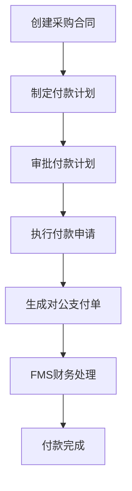

**图源**
- [PurchaseContractServiceImpl.java](file://eplus-module-scm/eplus-module-scm-biz/src/main/java/com/syj/eplus/module/scm/service/purchasecontract/PurchaseContractServiceImpl.java#L1-L50)
- [PaymentApplyServiceImpl.java](file://eplus-module-scm/eplus-module-scm-biz/src/main/java/com/syj/eplus/module/scm/service/paymentapply/PaymentApplyServiceImpl.java#L1-L50)

## 付款计划数据模型

付款计划的数据模型设计充分考虑了采购业务的复杂性，通过结构化的方式存储付款计划的各项关键信息。

```mermaid
erDiagram
scm_payment_plan {
bigint id PK "主键"
varchar(20) contract_code "合同编号"
tinyint step "步骤"
tinyint payment_method "支付方式"
tinyint date_type "起始点"
datetime start_date "起始日"
int days "天数"
datetime expected_receipt_date "预计付款日"
decimal(19,6) payment_ratio "付款比例"
json receivable_amount "应付金额"
json received_amount "实付金额"
json applied_amount "已申请金额"
tinyint control_purchase_flag "是否控制采购"
tinyint exe_status "状态"
datetime create_time "创建时间"
datetime update_time "修改时间"
}
```

**图源**
- [scm_payment_plan.sql](file://eplus-flyway/src/main/resources/db/migration/common/V1_0_0_073__付款相关表.sql#L109-L139)
- [PurchasePaymentPlan.java](file://eplus-module-scm/eplus-module-scm-biz/src/main/java/com/syj/eplus/module/scm/dal/dataobject/paymentplan/PurchasePaymentPlan.java#L30-L39)

### 核心字段说明

| 字段名称 | 类型 | 说明 |
|---------|------|------|
| id | bigint | 主键，唯一标识付款计划记录 |
| contract_code | varchar(20) | 关联的采购合同编号 |
| step | tinyint | 付款步骤，表示付款的阶段顺序 |
| payment_method | tinyint | 支付方式，如电汇、信用证等 |
| date_type | tinyint | 付款起始点，如合同签订日、验收日等 |
| start_date | datetime | 付款计算的起始日期 |
| days | int | 付款天数，从起始点开始计算 |
| expected_receipt_date | datetime | 预计付款日期 |
| payment_ratio | decimal(19,6) | 付款比例，占合同总金额的比例 |
| receivable_amount | json | 应付金额，包含币种和金额 |
| received_amount | json | 实付金额，实际已支付的金额 |
| applied_amount | json | 已申请金额，已提交支付申请的金额 |
| control_purchase_flag | tinyint | 是否控制采购，1表示控制，0表示不控制 |
| exe_status | tinyint | 执行状态，表示付款计划的当前状态 |

**数据源**
- [PurchasePaymentPlanDTO.java](file://eplus-module-scm/eplus-module-scm-api/src/main/java/com/syj/eplus/module/scm/api/purchasecontract/dto/PurchasePaymentPlanDTO.java#L18-L77)
- [scm_payment_plan.sql](file://eplus-flyway/src/main/resources/db/migration/common/V1_0_0_073__付款相关表.sql#L115-L134)

## 付款阶段配置

系统支持多种付款阶段的配置，满足不同采购场景的需求。付款阶段的设置基于合同金额和业务需求，通过灵活的配置实现对付款流程的精确控制。

### 付款阶段类型

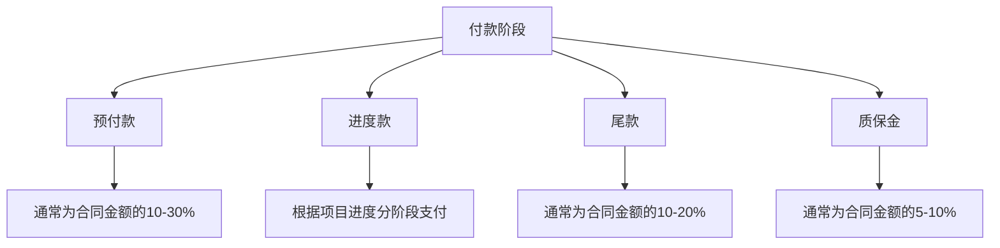

**图源**
- [PurchasePaymentPlan.java](file://eplus-module-scm/eplus-module-scm-biz/src/main/java/com/syj/eplus/module/scm/dal/dataobject/paymentplan/PurchasePaymentPlan.java#L53-L54)
- [PurchasePaymentPlanDTO.java](file://eplus-module-scm/eplus-module-scm-api/src/main/java/com/syj/eplus/module/scm/api/purchasecontract/dto/PurchasePaymentPlanDTO.java#L26-L27)

### 付款条件配置

付款条件的配置支持多种模式，包括按比例和按里程碑。

#### 按比例配置

按比例配置是最常见的付款方式，根据合同总金额的固定比例进行付款。

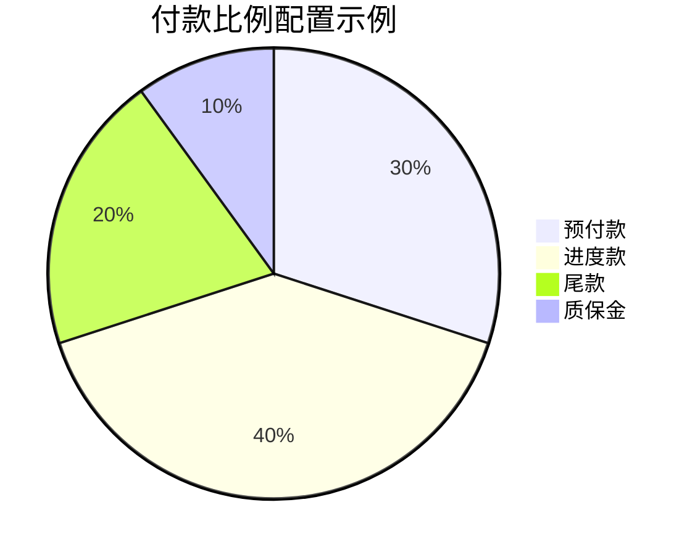

#### 按里程碑配置

按里程碑配置根据项目关键节点的完成情况进行付款，更加灵活和精准。

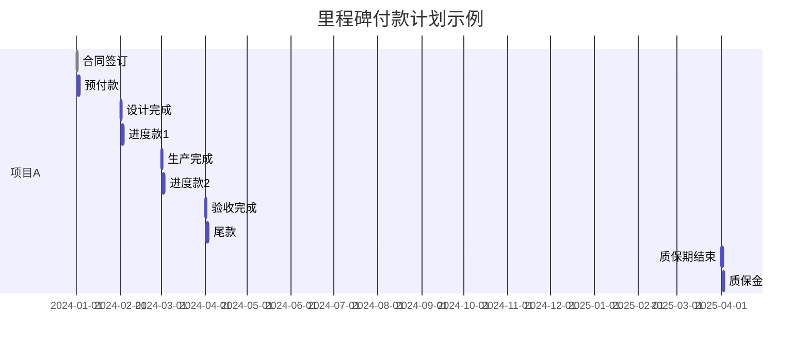

**配置源**
- [PurchasePaymentPlan.java](file://eplus-module-scm/eplus-module-scm-biz/src/main/java/com/syj/eplus/module/scm/dal/dataobject/paymentplan/PurchasePaymentPlan.java#L80-L81)
- [PurchasePaymentPlanDTO.java](file://eplus-module-scm/eplus-module-scm-api/src/main/java/com/syj/eplus/module/scm/api/purchasecontract/dto/PurchasePaymentPlanDTO.java#L50-L51)

## 付款计划与合同金额关联

付款计划与采购合同金额的关联是确保付款准确性的关键。系统通过精确的金额计算和验证机制，确保付款计划总额与合同金额的一致性。

### 金额计算逻辑

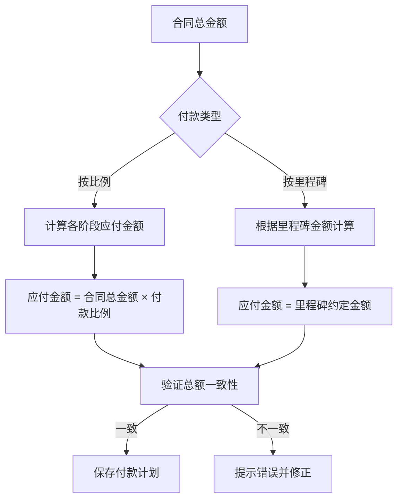

**金额计算源**
- [JsonAmount.java](file://eplus-framework/eplus-common/src/main/java/com/syj/eplus/framework/common/entity/JsonAmount.java#L56-L77)
- [PurchasePaymentPlan.java](file://eplus-module-scm/eplus-module-scm-biz/src/main/java/com/syj/eplus/module/scm/dal/dataobject/paymentplan/PurchasePaymentPlan.java#L84-L90)

### 金额数据结构

系统使用`JsonAmount`对象来存储金额信息，包含金额值和币种两个核心属性。

```json
{
  "amount": "100000.00",
  "currency": "RMB"
}
```

这种结构化的金额存储方式支持多币种交易，确保金额计算的准确性和灵活性。

**数据结构源**
- [JsonAmount.java](file://eplus-framework/eplus-common/src/main/java/com/syj/eplus/framework/common/entity/JsonAmount.java#L1-L50)
- [PurchasePaymentPlan.java](file://eplus-module-scm/eplus-module-scm-biz/src/main/java/com/syj/eplus/module/scm/dal/dataobject/paymentplan/PurchasePaymentPlan.java#L84-L90)

## 付款计划状态管理

付款计划的状态管理是跟踪付款执行进度的核心机制。系统定义了完整的状态生命周期，从创建到完成的各个阶段都有明确的状态标识。

### 状态定义

```java
public enum PaymentPlanExeStatusEnum {
    UNPAID(0,"未支付"),
    IN_PAID(2,"支付中"),
    PAID(1,"已支付"),
    PART_PAID(3,"部分支付");
}
```

**状态定义源**
- [PaymentPlanExeStatusEnum.java](file://eplus-framework/eplus-common/src/main/java/com/syj/eplus/framework/common/enums/PaymentPlanExeStatusEnum.java#L1-L18)

### 状态转换流程

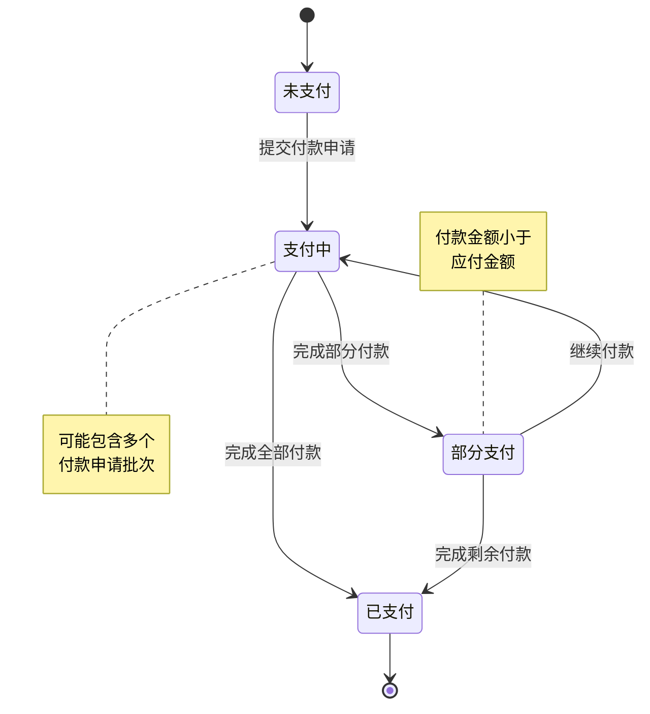

**状态管理源**
- [PurchasePaymentPlan.java](file://eplus-module-scm/eplus-module-scm-biz/src/main/java/com/syj/eplus/module/scm/dal/dataobject/paymentplan/PurchasePaymentPlan.java#L109-L110)
- [PaymentPlanExeStatusEnum.java](file://eplus-framework/eplus-common/src/main/java/com/syj/eplus/framework/common/enums/PaymentPlanExeStatusEnum.java#L1-L18)

### 状态更新机制

状态更新通过业务逻辑自动触发，确保状态的准确性和实时性。

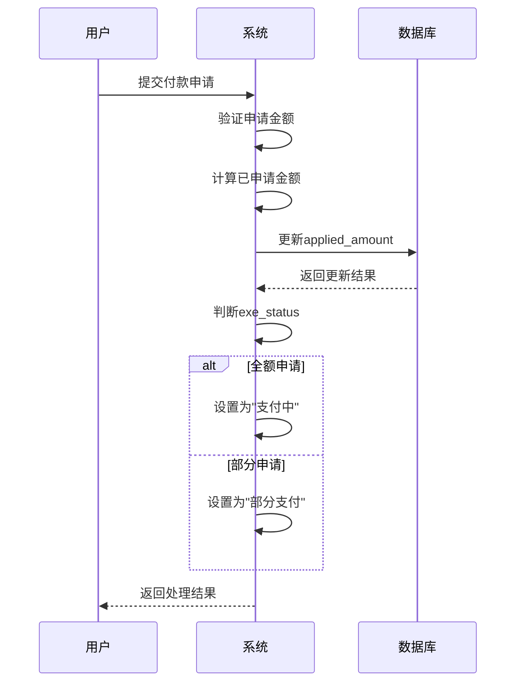

**状态更新源**
- [PaymentApplyServiceImpl.java](file://eplus-module-scm/eplus-module-scm-biz/src/main/java/com/syj/eplus/module/scm/service/paymentapply/PaymentApplyServiceImpl.java#L289-L307)
- [PurchasePaymentPlanMapper.java](file://eplus-module-scm/eplus-module-scm-biz/src/main/java/com/syj/eplus/module/scm/dal/mysql/paymentplan/PurchasePaymentPlanMapper.java#L14-L17)

## 对公支付申请单生成流程

对公支付申请单的生成是连接采购业务和财务处理的关键环节。系统通过标准化的流程将付款计划转化为财务可处理的支付申请。

### 生成流程

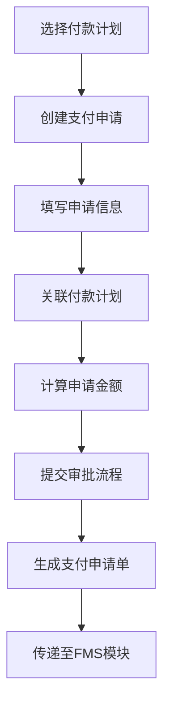

**流程源**
- [PaymentApplyServiceImpl.java](file://eplus-module-scm/eplus-module-scm-biz/src/main/java/com/syj/eplus/module/scm/service/paymentapply/PaymentApplyServiceImpl.java#L158-L200)
- [PurchaseContractServiceImpl.java](file://eplus-module-scm/eplus-module-scm-biz/src/main/java/com/syj/eplus/module/scm/service/purchasecontract/PurchaseContractServiceImpl.java#L1-L50)

### 申请单数据结构

对公支付申请单包含完整的支付信息，确保财务处理的准确性。

```mermaid
erDiagram
scm_payment_apply {
bigint id PK "主键"
varchar(20) code "编号"
bigint payment_plan_id "付款计划id"
bigint company_id "下单主体主键"
varchar(100) company_name "下单主体"
json applyer "申请人"
datetime apply_date "申请日期"
tinyint print_flag "打印状态"
tinyint step "申请类型"
decimal(19,6) apply_total_amount "申请总金额"
decimal(19,6) goods_total_amount "货款总金额"
datetime apply_payment_date "申请付款日"
varchar(500) remark "申请备注"
bigint vender_id "应付供应商主键"
varchar(20) vender_code "应付供应商编码"
varchar(100) vender_name "应付供应商名称"
varchar(10) currency "应付币种"
bigint payment_id "付款方式id"
varchar(100) payment_name "付款方式名称"
decimal(19,6) tax_rate "税率"
varchar(100) bank_account "银行账号"
varchar(100) bank "开户行"
varchar(64) process_instance_id "流程实例编号"
integer audit_status "审核状态"
}
```

**数据结构源**
- [scm_payment_plan.sql](file://eplus-flyway/src/main/resources/db/migration/common/V1_0_0_073__付款相关表.sql#L39-L77)
- [PaymentApplyServiceImpl.java](file://eplus-module-scm/eplus-module-scm-biz/src/main/java/com/syj/eplus/module/scm/service/paymentapply/PaymentApplyServiceImpl.java#L102-L138)

## 与FMS模块集成

付款计划与FMS（财务管理系统）模块的集成实现了从业务到财务的无缝衔接，确保付款流程的高效和准确。

### 集成架构

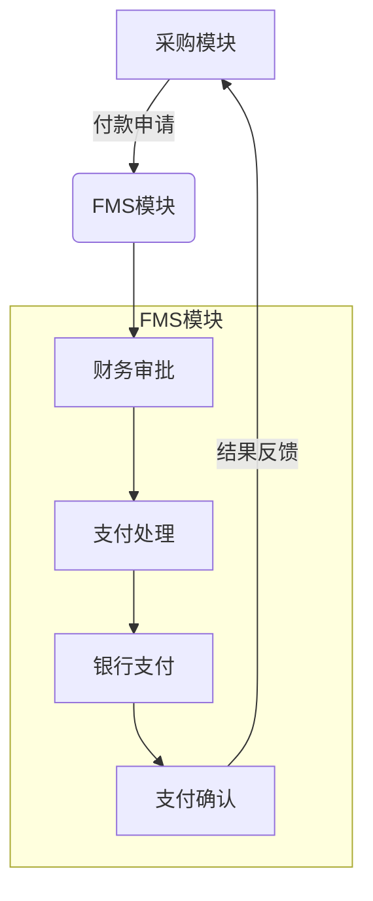

**集成架构源**
- [PaymentApiImpl.java](file://eplus-module-fms/eplus-module-fms-biz/src/main/java/com/syj/eplus/module/fms/api/payment/PaymentApiImpl.java#L22-L26)
- [PaymentApplyServiceImpl.java](file://eplus-module-scm/eplus-module-scm-biz/src/main/java/com/syj/eplus/module/scm/service/paymentapply/PaymentApplyServiceImpl.java#L126-L136)

### 集成接口

系统通过标准化的API接口实现与FMS模块的通信。

```java
public interface PaymentApi {
    /**
     * 批量创建付款
     */
    void batchCreatePayment(List<PaymentSaveDTO> paymentSaveDTOList);
    
    /**
     * 关闭付款
     */
    void closePayment(ClosePaymentDTO closePaymentDTO);
}
```

**接口源**
- [PaymentApiImpl.java](file://eplus-module-fms/eplus-module-fms-biz/src/main/java/com/syj/eplus/module/fms/api/payment/PaymentApiImpl.java#L7-L11)
- [PaymentDO.java](file://eplus-module-fms/eplus-module-fms-biz/src/main/java/com/syj/eplus/module/fms/dal/dataobject/payment/PaymentDO.java#L32-L222)

### 数据同步机制

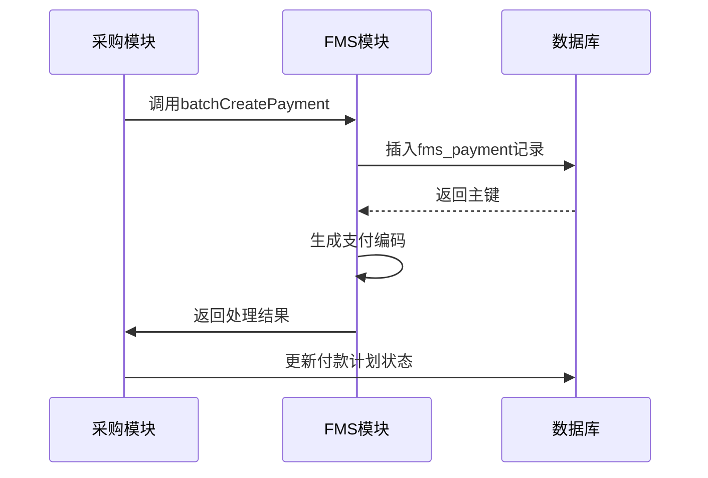

**同步机制源**
- [PaymentApplyServiceImpl.java](file://eplus-module-scm/eplus-module-scm-biz/src/main/java/com/syj/eplus/module/scm/service/paymentapply/PaymentApplyServiceImpl.java#L995-L996)
- [PaymentServiceImpl.java](file://eplus-module-fms/eplus-module-fms-biz/src/main/java/com/syj/eplus/module/fms/service/payment/PaymentServiceImpl.java#L124-L144)

## 实际业务场景示例

通过实际业务场景示例，展示付款计划在真实采购业务中的应用。

### 场景一：设备采购付款计划

某公司采购生产设备，合同金额为1,000,000元人民币，采用四阶段付款计划。

| 阶段 | 付款条件 | 付款比例 | 应付金额 | 触发条件 |
|------|----------|----------|----------|----------|
| 预付款 | 合同签订后 | 30% | 300,000元 | 合同生效 |
| 进度款 | 设备生产完成 | 40% | 400,000元 | 生产完成证明 |
| 尾款 | 设备验收合格 | 20% | 200,000元 | 验收报告 |
| 质保金 | 质保期结束 | 10% | 100,000元 | 质保期满 |

**场景数据源**
- [PurchasePaymentPlanDTO.java](file://eplus-module-scm/eplus-module-scm-api/src/main/java/com/syj/eplus/module/scm/api/purchasecontract/dto/PurchasePaymentPlanDTO.java#L50-L54)
- [PaymentApplyServiceImpl.java](file://eplus-module-scm/eplus-module-scm-biz/src/main/java/com/syj/eplus/module/scm/service/paymentapply/PaymentApplyServiceImpl.java#L289-L307)

### 场景二：服务合同付款计划

咨询服务合同，金额为500,000元，按项目里程碑付款。

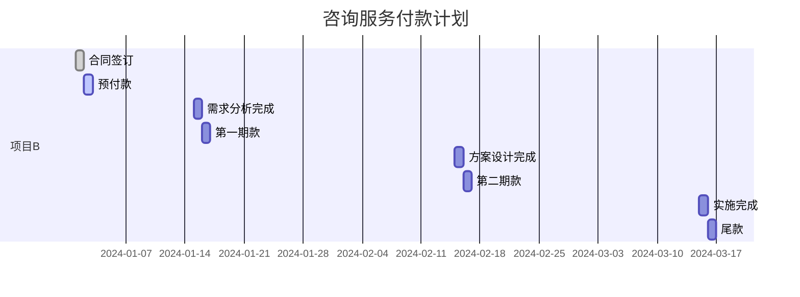

**场景源**
- [PurchasePaymentPlan.java](file://eplus-module-scm/eplus-module-scm-biz/src/main/java/com/syj/eplus/module/scm/dal/dataobject/paymentplan/PurchasePaymentPlan.java#L67-L76)
- [PaymentPlanExeStatusEnum.java](file://eplus-framework/eplus-common/src/main/java/com/syj/eplus/framework/common/enums/PaymentPlanExeStatusEnum.java#L1-L18)