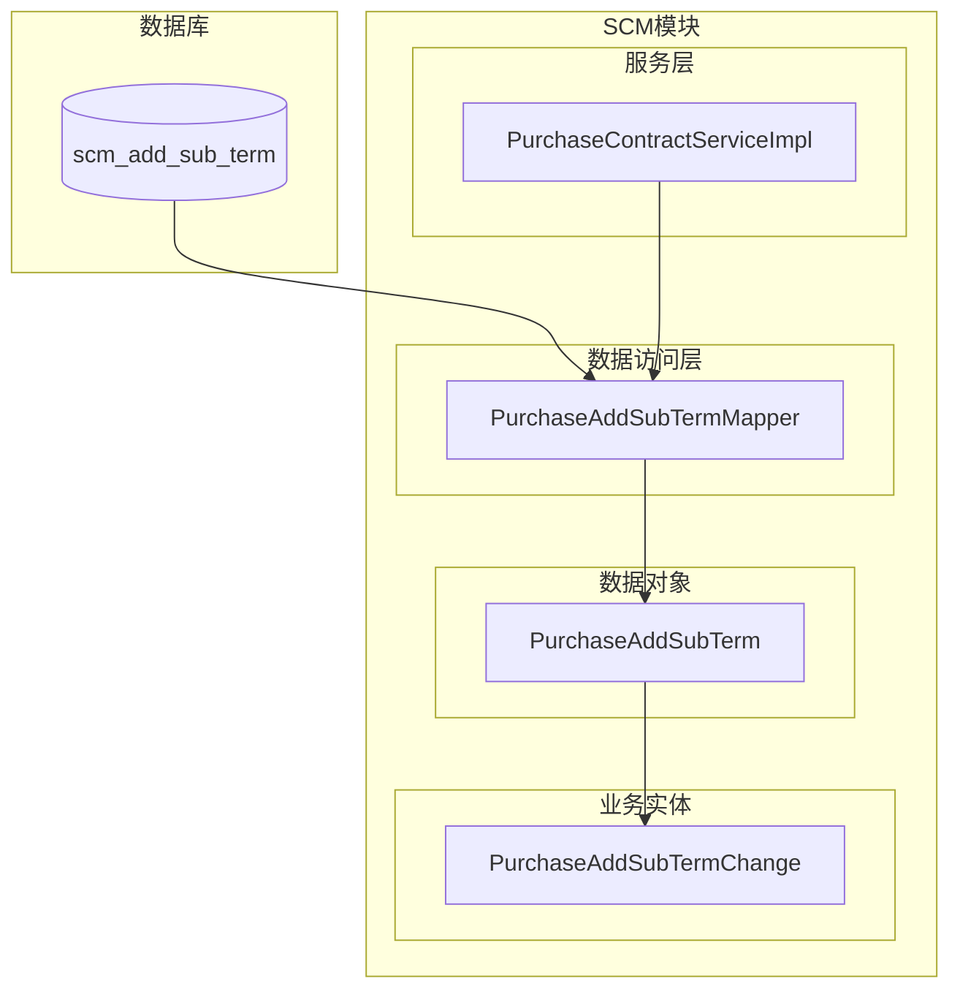
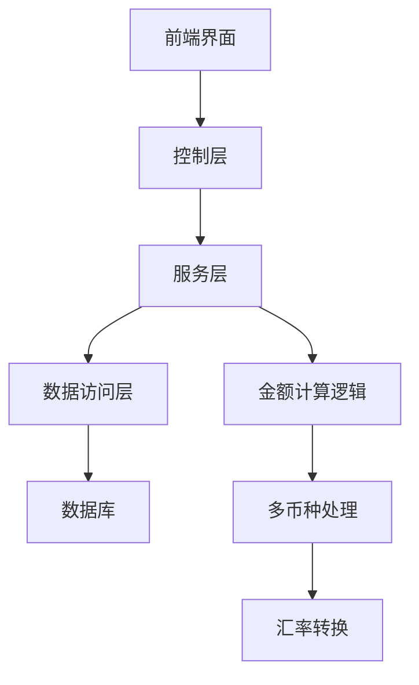
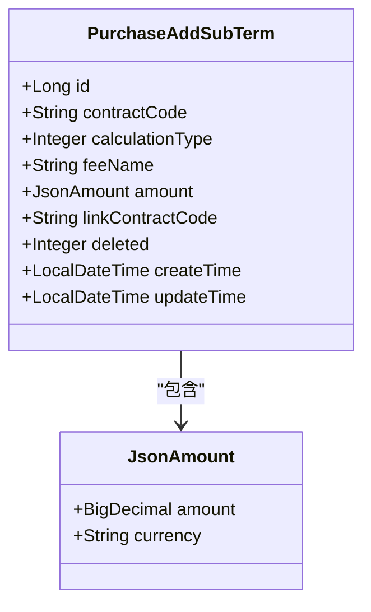
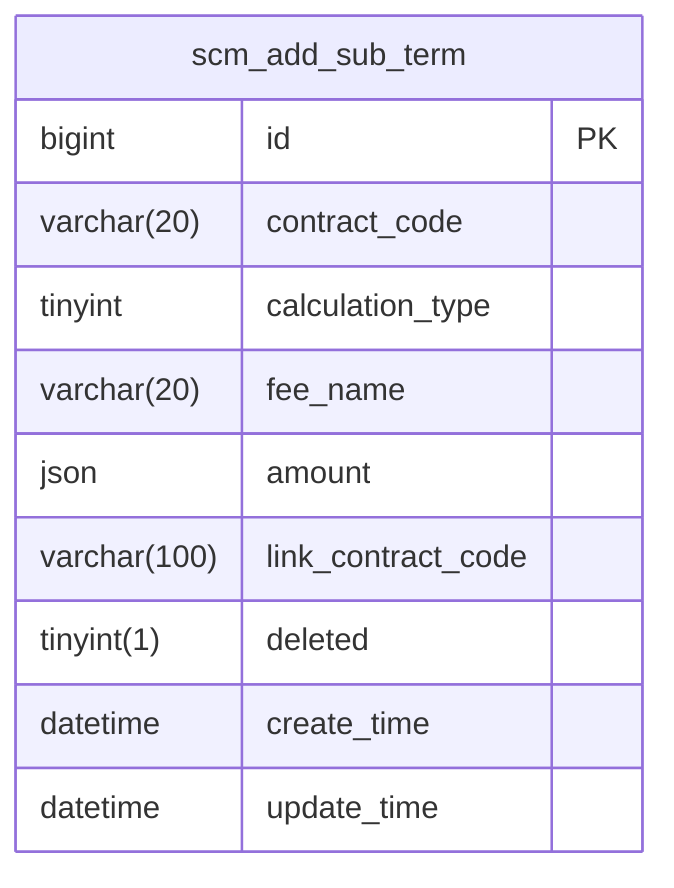
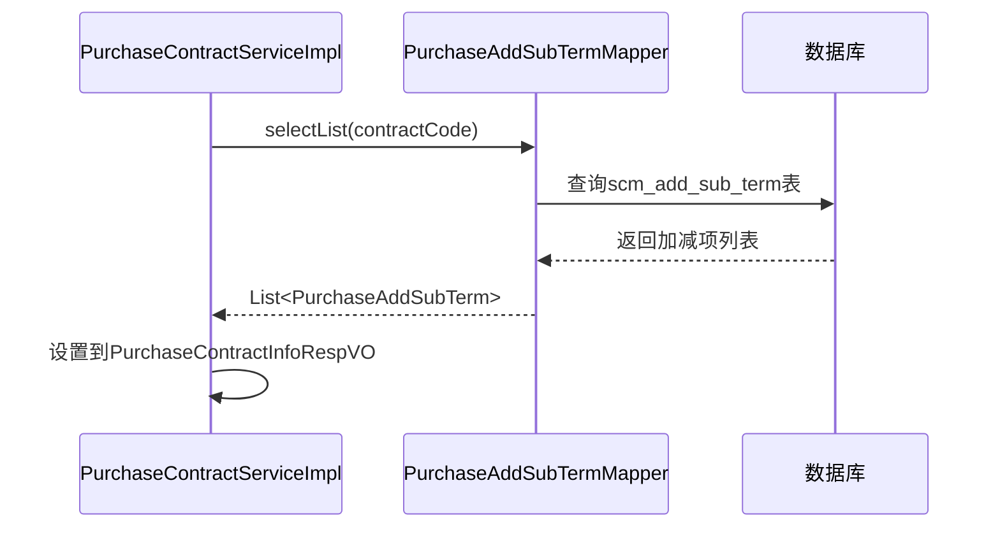
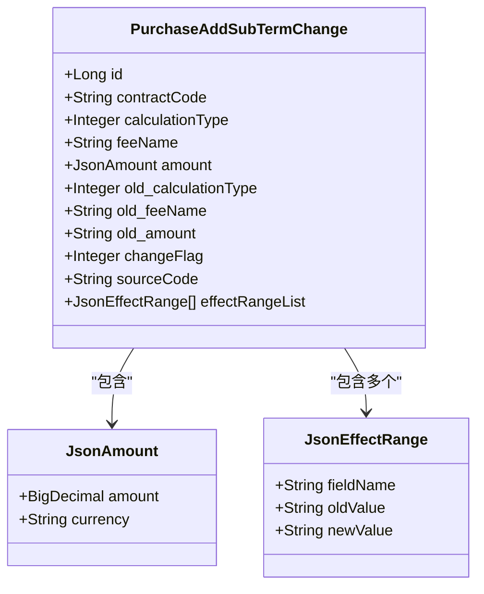
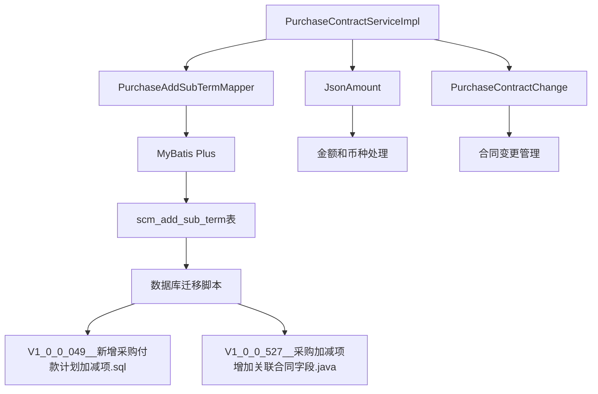

# 采购加减项

<cite>
**本文档引用文件**  
- [V1_0_0_038__采购模块加减项表创建.sql](file://eplus-flyway/src/main/resources/db/migration/common/V1_0_0_038__采购模块加减项表创建.sql)
- [V1_0_0_049__新增采购付款计划加减项.sql](file://eplus-flyway/src/main/resources/db/migration/common/V1_0_0_049__新增采购付款计划加减项.sql)
- [V1_0_0_527__采购加减项增加关联合同字段.java](file://eplus-flyway/src/main/java/db/migration/common/V1_0_0_527__采购加减项增加关联合同字段.java)
- [PurchaseAddSubTerm.java](file://eplus-module-scm/eplus-module-scm-biz/src/main/java/com/syj/eplus/module/scm/dal/dataobject/addsubterm/PurchaseAddSubTerm.java)
- [PurchaseAddSubTermMapper.java](file://eplus-module-scm/eplus-module-scm-biz/src/main/java/com/syj/eplus/module/scm/dal/mysql/addsubterm/PurchaseAddSubTermMapper.java)
- [PurchaseContractChange.java](file://eplus-module-scm/eplus-module-scm-biz/src/main/java/com/syj/eplus/module/scm/entity/PurchaseContractChange.java)
- [PurchaseAddSubTermChange.java](file://eplus-module-scm/eplus-module-scm-biz/src/main/java/com/syj/eplus/module/scm/entity/PurchaseAddSubTermChange.java)
- [PurchaseContractServiceImpl.java](file://eplus-module-scm/eplus-module-scm-biz/src/main/java/com/syj/eplus/module/scm/service/purchasecontract/PurchaseContractServiceImpl.java)
</cite>

## 目录
1. [简介](#简介)
2. [项目结构](#项目结构)
3. [核心组件](#核心组件)
4. [架构概述](#架构概述)
5. [详细组件分析](#详细组件分析)
6. [依赖分析](#依赖分析)
7. [性能考虑](#性能考虑)
8. [故障排除指南](#故障排除指南)
9. [结论](#结论)

## 简介
本文档详细说明了采购合同执行过程中产生的额外费用或折扣的管理机制，包括运费、保险费、关税等加项，以及质量扣款、返利等减项。文档解释了加减项的创建、审批流程及其对采购合同总金额的影响，描述了加减项与对公支付单的关联关系，以及如何生成相应的应付账款。同时提供了加减项的数据模型、业务规则和实际操作示例。

## 项目结构
采购加减项功能主要分布在SCM（供应链管理）模块中，涉及数据库迁移脚本、实体类、数据访问层和业务服务层。核心功能集中在`eplus-module-scm`模块，特别是`dal/dataobject/addsubterm`包下的数据对象和`service/purchasecontract`包下的服务实现。

**图表来源**
- [V1_0_0_049__新增采购付款计划加减项.sql](file://eplus-flyway/src/main/resources/db/migration/common/V1_0_0_049__新增采购付款计划加减项.sql#L6-L47)
- [PurchaseAddSubTermMapper.java](file://eplus-module-scm/eplus-module-scm-biz/src/main/java/com/syj/eplus/module/scm/dal/mysql/addsubterm/PurchaseAddSubTermMapper.java)
- [PurchaseAddSubTerm.java](file://eplus-module-scm/eplus-module-scm-biz/src/main/java/com/syj/eplus/module/scm/dal/dataobject/addsubterm/PurchaseAddSubTerm.java)

**章节来源**
- [V1_0_0_049__新增采购付款计划加减项.sql](file://eplus-flyway/src/main/resources/db/migration/common/V1_0_0_049__新增采购付款计划加减项.sql)
- [eplus-module-scm](file://eplus-module-scm/)

## 核心组件
采购加减项功能的核心组件包括数据库表`scm_add_sub_term`、实体类`PurchaseAddSubTerm`、数据访问接口`PurchaseAddSubTermMapper`和业务服务`PurchaseContractServiceImpl`。这些组件共同实现了加减项的创建、查询和管理功能。

**章节来源**
- [PurchaseAddSubTerm.java](file://eplus-module-scm/eplus-module-scm-biz/src/main/java/com/syj/eplus/module/scm/dal/dataobject/addsubterm/PurchaseAddSubTerm.java)
- [PurchaseAddSubTermMapper.java](file://eplus-module-scm/eplus-module-scm-biz/src/main/java/com/syj/eplus/module/scm/dal/mysql/addsubterm/PurchaseAddSubTermMapper.java)

## 架构概述
采购加减项功能采用典型的分层架构，包括数据访问层、业务逻辑层和控制层。数据存储在`scm_add_sub_term`表中，通过MyBatis Plus的Mapper接口进行访问，业务逻辑在`PurchaseContractServiceImpl`中实现，最终通过API提供给前端使用。

**图表来源**
- [PurchaseContractServiceImpl.java](file://eplus-module-scm/eplus-module-scm-biz/src/main/java/com/syj/eplus/module/scm/service/purchasecontract/PurchaseContractServiceImpl.java#L2912-L2926)
- [PurchaseAddSubTerm.java](file://eplus-module-scm/eplus-module-scm-biz/src/main/java/com/syj/eplus/module/scm/dal/dataobject/addsubterm/PurchaseAddSubTerm.java)

## 详细组件分析

### 数据模型分析
采购加减项的数据模型设计用于存储采购合同中的额外费用或折扣信息，支持多币种金额存储和灵活的费用类型管理。

#### 数据模型类图

**图表来源**
- [PurchaseAddSubTerm.java](file://eplus-module-scm/eplus-module-scm-biz/src/main/java/com/syj/eplus/module/scm/dal/dataobject/addsubterm/PurchaseAddSubTerm.java)
- [JsonAmount.java](file://eplus-framework/eplus-common/src/main/java/com/syj/eplus/framework/common/entity/JsonAmount.java)

#### 数据库表结构

**图表来源**
- [V1_0_0_049__新增采购付款计划加减项.sql](file://eplus-flyway/src/main/resources/db/migration/common/V1_0_0_049__新增采购付款计划加减项.sql#L6-L47)
- [V1_0_0_527__采购加减项增加关联合同字段.java](file://eplus-flyway/src/main/java/db/migration/common/V1_0_0_527__采购加减项增加关联合同字段.java#L13)

**章节来源**
- [PurchaseAddSubTerm.java](file://eplus-module-scm/eplus-module-scm-biz/src/main/java/com/syj/eplus/module/scm/dal/dataobject/addsubterm/PurchaseAddSubTerm.java#L23-L67)

### 业务逻辑分析
采购加减项的业务逻辑主要体现在`PurchaseContractServiceImpl`中，该服务负责加载和管理采购合同的加减项信息。

#### 加减项加载流程

**图表来源**
- [PurchaseContractServiceImpl.java](file://eplus-module-scm/eplus-module-scm-biz/src/main/java/com/syj/eplus/module/scm/service/purchasecontract/PurchaseContractServiceImpl.java#L2912-L2926)
- [PurchaseAddSubTermMapper.java](file://eplus-module-scm/eplus-module-scm-biz/src/main/java/com/syj/eplus/module/scm/dal/mysql/addsubterm/PurchaseAddSubTermMapper.java)

#### 变更跟踪模型

**图表来源**
- [PurchaseAddSubTermChange.java](file://eplus-module-scm/eplus-module-scm-biz/src/main/java/com/syj/eplus/module/scm/entity/PurchaseAddSubTermChange.java)
- [JsonAmount.java](file://eplus-framework/eplus-common/src/main/java/com/syj/eplus/framework/common/entity/JsonAmount.java)

**章节来源**
- [PurchaseAddSubTermChange.java](file://eplus-module-scm/eplus-module-scm-biz/src/main/java/com/syj/eplus/module/scm/entity/PurchaseAddSubTermChange.java#L1-L59)

## 依赖分析
采购加减项功能依赖于多个基础组件和模块，形成了完整的依赖关系网络。

**图表来源**
- [PurchaseContractServiceImpl.java](file://eplus-module-scm/eplus-module-scm-biz/src/main/java/com/syj/eplus/module/scm/service/purchasecontract/PurchaseContractServiceImpl.java)
- [PurchaseAddSubTermMapper.java](file://eplus-module-scm/eplus-module-scm-biz/src/main/java/com/syj/eplus/module/scm/dal/mysql/addsubterm/PurchaseAddSubTermMapper.java)
- [V1_0_0_049__新增采购付款计划加减项.sql](file://eplus-flyway/src/main/resources/db/migration/common/V1_0_0_049__新增采购付款计划加减项.sql)
- [V1_0_0_527__采购加减项增加关联合同字段.java](file://eplus-flyway/src/main/java/db/migration/common/V1_0_0_527__采购加减项增加关联合同字段.java)

**章节来源**
- [go.mod](file://pom.xml)
- [eplus-module-scm](file://eplus-module-scm/)

## 性能考虑
采购加减项功能在设计时考虑了性能因素，通过合理的数据库索引、缓存机制和批量处理来确保系统性能。

- 数据库表`scm_add_sub_term`的主键`id`使用自增策略，确保插入性能
- `contract_code`字段作为查询条件，建议添加索引以提高查询效率
- 使用MyBatis Plus的BaseMapperX提供基础的CRUD操作，减少重复代码
- 金额计算采用BigDecimal类型，确保财务计算的精确性
- 多币种金额存储在JSON格式的`amount`字段中，支持灵活的币种扩展

## 故障排除指南
当采购加减项功能出现问题时，可以按照以下步骤进行排查：

1. **检查数据库表结构**：确认`scm_add_sub_term`表是否存在，字段定义是否正确
2. **验证数据访问**：检查`PurchaseAddSubTermMapper`是否能正常访问数据库
3. **审查业务逻辑**：确认`PurchaseContractServiceImpl`中的加减项加载逻辑是否正确执行
4. **检查金额计算**：验证`JsonAmount`类型的金额和币种处理是否正确
5. **查看日志信息**：检查系统日志中是否有相关的错误或警告信息

**章节来源**
- [PurchaseAddSubTerm.java](file://eplus-module-scm/eplus-module-scm-biz/src/main/java/com/syj/eplus/module/scm/dal/dataobject/addsubterm/PurchaseAddSubTerm.java#L54)
- [PurchaseContractServiceImpl.java](file://eplus-module-scm/eplus-module-scm-biz/src/main/java/com/syj/eplus/module/scm/service/purchasecontract/PurchaseContractServiceImpl.java#L2912-L2926)

## 结论
采购加减项功能为采购合同管理提供了灵活的额外费用和折扣处理机制。通过`scm_add_sub_term`数据库表和相应的Java实体类，系统能够有效地管理各种加项（如运费、保险费、关税）和减项（如质量扣款、返利）。该功能与采购合同的总金额计算、付款计划和应付账款生成紧密集成，确保了财务数据的准确性和一致性。未来可以考虑增加更多的业务规则验证、审批流程和报表功能，以进一步完善采购加减项的管理能力。