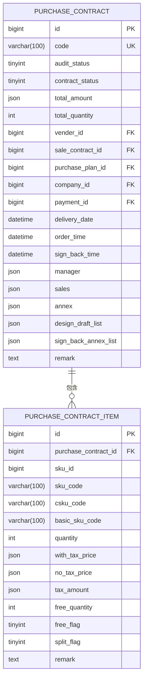
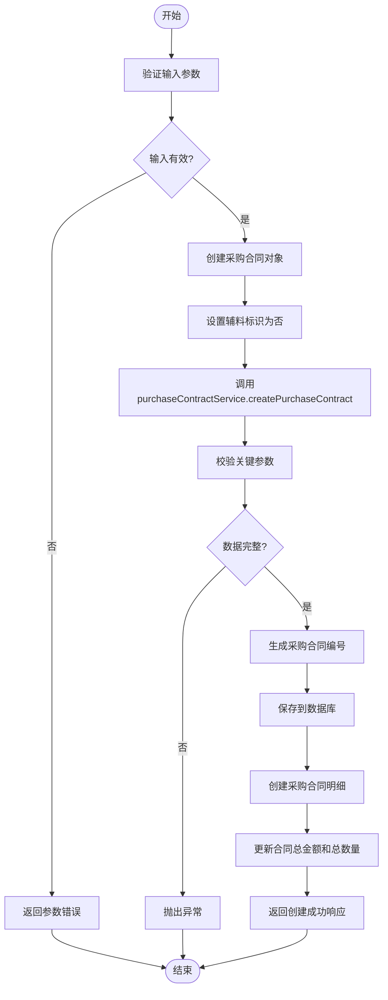
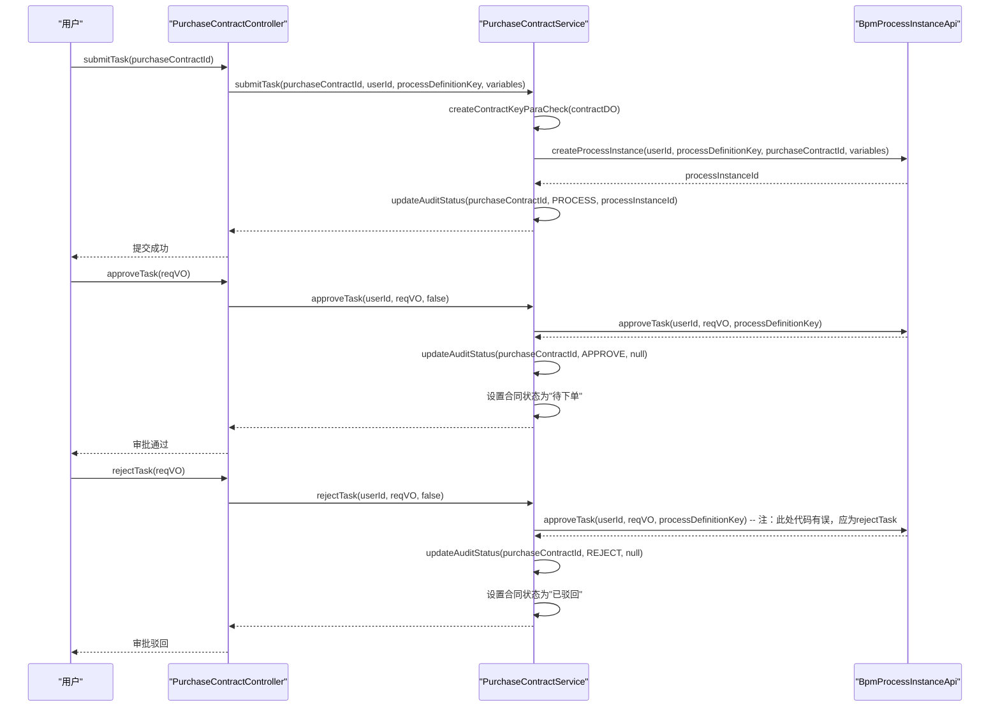
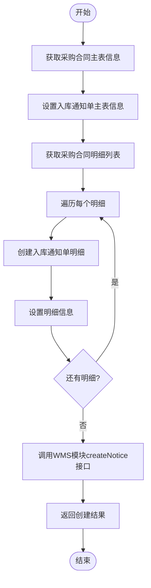
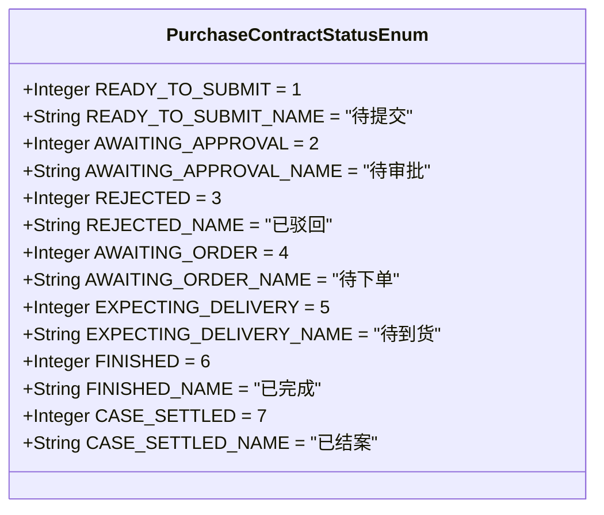
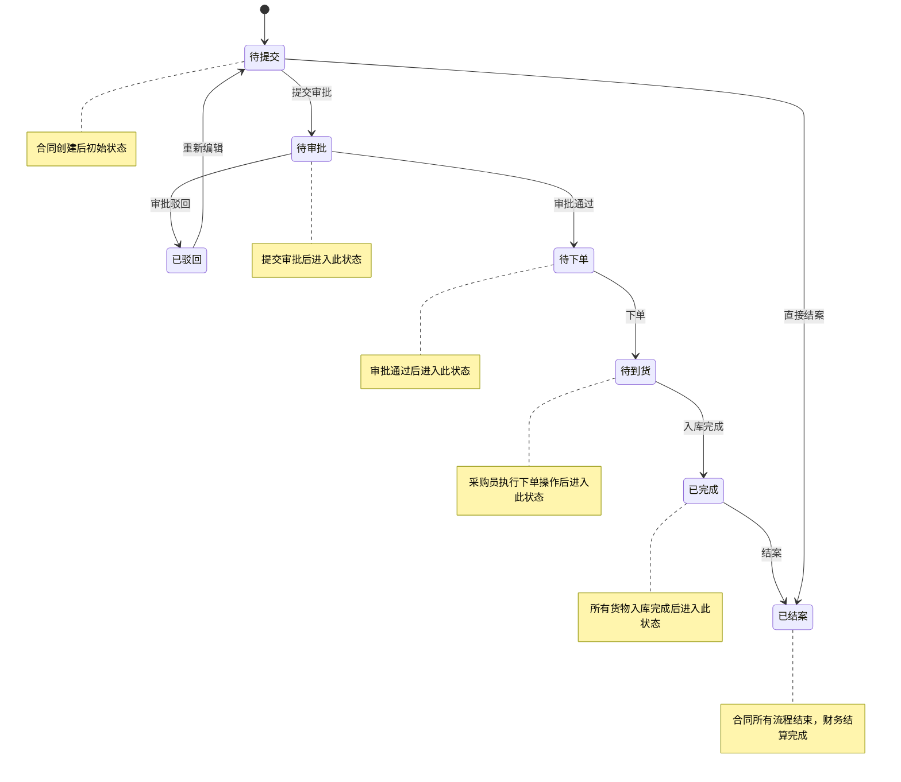
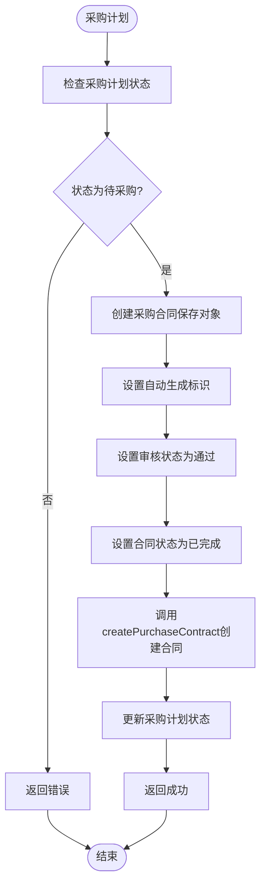
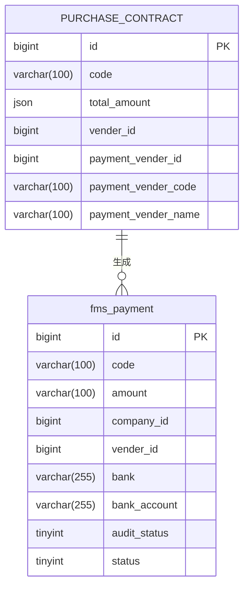

# 采购合同

<cite>
**本文档引用文件**  
- [PurchaseContractApi.java](file://eplus-module-scm/eplus-module-scm-api/src/main/java/com/syj/eplus/module/scm/api/purchasecontract/PurchaseContractApi.java)
- [PurchaseContractDO.java](file://eplus-module-scm/eplus-module-scm-biz/src/main/java/com/syj/eplus/module/scm/dal/dataobject/purchasecontract/PurchaseContractDO.java)
- [PurchaseContractServiceImpl.java](file://eplus-module-scm/eplus-module-scm-biz/src/main/java/com/syj/eplus/module/scm/service/purchasecontract/PurchaseContractServiceImpl.java)
- [PurchaseContractController.java](file://eplus-module-scm/eplus-module-scm-biz/src/main/java/com/syj/eplus/module/scm/controller/admin/purchasecontract/PurchaseContractController.java)
- [PurchaseContractStatusEnum.java](file://eplus-framework/eplus-common/src/main/java/com/syj/eplus/framework/common/enums/PurchaseContractStatusEnum.java)
- [PurchasePlanServiceImpl.java](file://eplus-module-scm/eplus-module-scm-biz/src/main/java/com/syj/eplus/module/scm/service/purchaseplan/PurchasePlanServiceImpl.java)
- [StockNoticeServiceImpl.java](file://eplus-module-wms/eplus-module-wms-biz/src/main/java/com/syj/eplus/module/wms/service/stockNotice/StockNoticeServiceImpl.java)
- [V1_0_0_002__Eplus初始化.sql](file://eplus-flyway/src/main/resources/db/migration/common/V1_0_0_002__Eplus初始化.sql)
- [PurchaseContractAuditResultListener.java](file://eplus-module-scm/eplus-module-scm-biz/src/main/java/com/syj/eplus/module/scm/listener/PurchaseContractAuditResultListener.java)
</cite>

## 目录
1. [引言](#引言)
2. [采购合同数据模型](#采购合同数据模型)
3. [采购合同创建流程](#采购合同创建流程)
4. [审批流程](#审批流程)
5. [执行流程与下游单据生成](#执行流程与下游单据生成)
6. [采购合同状态机](#采购合同状态机)
7. [与采购计划的关联关系](#与采购计划的关联关系)
8. [与FMS模块的集成](#与fms模块的集成)
9. [典型业务场景示例](#典型业务场景示例)

## 引言

采购合同是企业供应链管理中的核心单据，用于规范采购方与供应商之间的交易关系。本文档详细说明采购合同的创建、审批、执行全流程，涵盖合同关键字段、状态转换规则、与采购计划的关联关系、下游单据生成逻辑以及与财务模块（FMS）的集成点。

**Section sources**
- [PurchaseContractDO.java](file://eplus-module-scm/eplus-module-scm-biz/src/main/java/com/syj/eplus/module/scm/dal/dataobject/purchasecontract/PurchaseContractDO.java#L1-L468)

## 采购合同数据模型

采购合同数据模型包含主表和明细表，主要字段如下：

### 主表关键字段

**Diagram sources**
- [PurchaseContractDO.java](file://eplus-module-scm/eplus-module-scm-biz/src/main/java/com/syj/eplus/module/scm/dal/dataobject/purchasecontract/PurchaseContractDO.java#L39-L467)
- [PurchaseContractItemDO.java](file://eplus-module-scm/eplus-module-scm-biz/src/main/java/com/syj/eplus/module/scm/dal/dataobject/purchasecontractitem/PurchaseContractItemDO.java)

### 关键字段说明

| 字段名称 | 字段说明 | 数据类型 | 备注 |
| :--- | :--- | :--- | :--- |
| `code` | 采购合同编号 | varchar(100) | 唯一标识 |
| `auditStatus` | 审核状态 | tinyint | 1-通过, 2-驳回, 3-处理中, 4-未提交, 5-取消 |
| `contractStatus` | 采购合同状态 | tinyint | 枚举值，见状态机说明 |
| `totalAmount` | 采购总金额 | json | 包含币种和金额的JSON对象 |
| `totalQuantity` | 采购总数量 | int | |
| `venderId` | 供应商主键 | bigint | 外键关联供应商表 |
| `saleContractId` | 销售合同id | bigint | 外键关联销售合同 |
| `purchasePlanId` | 采购计划id | bigint | 外键关联采购计划 |
| `companyId` | 采购主体 | bigint | 下单公司 |
| `paymentId` | 付款方式id | bigint | 外键关联付款方式 |
| `deliveryDate` | 交货日期 | datetime | |
| `orderTime` | 下单时间 | datetime | |
| `signBackTime` | 回签时间 | datetime | |
| `manager` | 跟单员 | json | 包含用户ID、姓名、部门信息的JSON对象 |
| `sales` | 销售员 | json | 包含用户ID、姓名、部门信息的JSON对象 |
| `annex` | 附件 | json | 附件列表的JSON数组 |
| `designDraftList` | 出片文件 | json | 设计稿附件列表 |
| `signBackAnnexList` | 回签附件 | json | 回签时上传的附件 |
| `remark` | 备注 | text | |

**Section sources**
- [PurchaseContractDO.java](file://eplus-module-scm/eplus-module-scm-biz/src/main/java/com/syj/eplus/module/scm/dal/dataobject/purchasecontract/PurchaseContractDO.java#L40-L467)

## 采购合同创建流程

采购合同的创建主要通过`PurchaseContractController`的`createPurchaseContract`接口实现，流程如下：

**Diagram sources**
- [PurchaseContractController.java](file://eplus-module-scm/eplus-module-scm-biz/src/main/java/com/syj/eplus/module/scm/controller/admin/purchasecontract/PurchaseContractController.java#L63-L69)
- [PurchaseContractServiceImpl.java](file://eplus-module-scm/eplus-module-scm-biz/src/main/java/com/syj/eplus/module/scm/service/purchasecontract/PurchaseContractServiceImpl.java#L1491-L1510)

**Section sources**
- [PurchaseContractController.java](file://eplus-module-scm/eplus-module-scm-biz/src/main/java/com/syj/eplus/module/scm/controller/admin/purchasecontract/PurchaseContractController.java#L63-L69)
- [PurchaseContractServiceImpl.java](file://eplus-module-scm/eplus-module-scm-biz/src/main/java/com/syj/eplus/module/scm/service/purchasecontract/PurchaseContractServiceImpl.java#L1491-L1510)

## 审批流程

采购合同的审批流程基于BPM工作流引擎实现，通过`PurchaseContractController`的`submitTask`、`approveTask`和`rejectTask`接口完成。

### 审批流程图

**Diagram sources**
- [PurchaseContractController.java](file://eplus-module-scm/eplus-module-scm-biz/src/main/java/com/syj/eplus/module/scm/controller/admin/purchasecontract/PurchaseContractController.java#L182-L188)
- [PurchaseContractServiceImpl.java](file://eplus-module-scm/eplus-module-scm-biz/src/main/java/com/syj/eplus/module/scm/service/purchasecontract/PurchaseContractServiceImpl.java#L1491-L1565)
- [PurchaseContractAuditResultListener.java](file://eplus-module-scm/eplus-module-scm-biz/src/main/java/com/syj/eplus/module/scm/listener/PurchaseContractAuditResultListener.java#L1-L24)

### 审批状态变更逻辑

当审批结果发生变化时，`PurchaseContractAuditResultListener`会监听BPM事件并调用`updateAuditStatus`方法更新采购合同状态：

- **审批通过**：合同状态变更为"待下单" (AWAITING_ORDER)
- **审批驳回**：合同状态变更为"已驳回" (REJECTED)
- **处理中**：合同状态变更为"待审批" (AWAITING_APPROVAL)
- **取消**：合同状态变更为"待提交" (READY_TO_SUBMIT)

**Section sources**
- [PurchaseContractServiceImpl.java](file://eplus-module-scm/eplus-module-scm-biz/src/main/java/com/syj/eplus/module/scm/service/purchasecontract/PurchaseContractServiceImpl.java#L1531-L1565)
- [PurchaseContractAuditResultListener.java](file://eplus-module-scm/eplus-module-scm-biz/src/main/java/com/syj/eplus/module/scm/listener/PurchaseContractAuditResultListener.java#L1-L24)

## 执行流程与下游单据生成

采购合同审批通过后进入执行阶段，可生成下游单据如入库通知单和对公支付申请。

### 生成入库通知单流程

采购合同通过`toStockNotice`接口生成入库通知单，流程如下：

**Diagram sources**
- [PurchaseContractServiceImpl.java](file://eplus-module-scm/eplus-module-scm-biz/src/main/java/com/syj/eplus/module/scm/service/purchasecontract/PurchaseContractServiceImpl.java#L3308-L4559)
- [StockNoticeServiceImpl.java](file://eplus-module-wms/eplus-module-wms-biz/src/main/java/com/syj/eplus/module/wms/service/stockNotice/StockNoticeServiceImpl.java)
- [StockNoticeApiImpl.java](file://eplus-module-wms/eplus-module-wms-biz/src/main/java/com/syj/eplus/module/wms/api/stockNotice/StockNoticeApiImpl.java#L153-L157)

**Section sources**
- [PurchaseContractServiceImpl.java](file://eplus-module-scm/eplus-module-scm-biz/src/main/java/com/syj/eplus/module/scm/service/purchasecontract/PurchaseContractServiceImpl.java#L3308-L4559)

## 采购合同状态机

采购合同的状态机定义了合同在生命周期内的状态转换规则。

### 状态定义

**Diagram sources**
- [PurchaseContractStatusEnum.java](file://eplus-framework/eplus-common/src/main/java/com/syj/eplus/framework/common/enums/PurchaseContractStatusEnum.java#L1-L30)

### 状态转换图

**Diagram sources**
- [PurchaseContractStatusEnum.java](file://eplus-framework/eplus-common/src/main/java/com/syj/eplus/framework/common/enums/PurchaseContractStatusEnum.java#L1-L30)
- [PurchaseContractServiceImpl.java](file://eplus-module-scm/eplus-module-scm-biz/src/main/java/com/syj/eplus/module/scm/service/purchasecontract/PurchaseContractServiceImpl.java#L1531-L1565)

**Section sources**
- [PurchaseContractStatusEnum.java](file://eplus-framework/eplus-common/src/main/java/com/syj/eplus/framework/common/enums/PurchaseContractStatusEnum.java#L1-L30)

## 与采购计划的关联关系

采购合同与采购计划存在紧密的关联关系，采购合同可以由采购计划生成。

### 采购计划转采购合同流程

**Diagram sources**
- [PurchasePlanServiceImpl.java](file://eplus-module-scm/eplus-module-scm-biz/src/main/java/com/syj/eplus/module/scm/service/purchaseplan/PurchasePlanServiceImpl.java#L3355-L3367)

**Section sources**
- [PurchasePlanServiceImpl.java](file://eplus-module-scm/eplus-module-scm-biz/src/main/java/com/syj/eplus/module/scm/service/purchaseplan/PurchasePlanServiceImpl.java#L3355-L3367)

## 与FMS模块的集成

采购合同与FMS（财务管理系统）模块通过应付账款生成进行集成。

### FMS集成点

**Diagram sources**
- [PurchaseContractDO.java](file://eplus-module-scm/eplus-module-scm-biz/src/main/java/com/syj/eplus/module/scm/dal/dataobject/purchasecontract/PurchaseContractDO.java#L303-L317)
- [V1_0_0_002__Eplus初始化.sql](file://eplus-flyway/src/main/resources/db/migration/common/V1_0_0_002__Eplus初始化.sql#L1385-L1405)

采购合同中的`paymentVenderId`、`paymentVenderCode`、`paymentVenderName`字段用于指定应付账款的供应商信息。当采购合同执行付款流程时，会调用FMS模块的支付接口生成对公支付单据。

**Section sources**
- [PurchaseContractDO.java](file://eplus-module-scm/eplus-module-scm-biz/src/main/java/com/syj/eplus/module/scm/dal/dataobject/purchasecontract/PurchaseContractDO.java#L303-L317)
- [V1_0_0_002__Eplus初始化.sql](file://eplus-flyway/src/main/resources/db/migration/common/V1_0_0_002__Eplus初始化.sql#L1385-L1405)

## 典型业务场景示例

### 场景一：从采购计划创建采购合同

1. 用户选择一个状态为"待采购"的采购计划
2. 系统调用`PurchasePlanServiceImpl`中的逻辑，将采购计划信息转换为采购合同
3. 设置采购合同的`autoFlag`为1（自动生成），`auditStatus`为审批通过，`contractStatus`为已完成
4. 保存采购合同并更新采购计划状态

### 场景二：手动创建采购合同并审批

1. 用户在系统中手动创建采购合同，填写供应商、商品、价格等信息
2. 点击"提交审批"，合同状态变为"待审批"
3. 审批人收到审批任务，查看合同详情
4. 审批人点击"通过"，BPM引擎触发`PurchaseContractAuditResultListener`
5. 系统调用`updateAuditStatus`方法，将合同状态更新为"待下单"
6. 采购员收到通知，执行下单操作

### 场景三：采购合同生成入库通知单

1. 采购合同状态为"待下单"或"待到货"
2. 用户选择一个或多个采购合同，点击"转入库通知单"
3. 系统调用`PurchaseContractServiceImpl`的`toStockNotice`方法
4. 从采购合同中提取主表和明细信息，构建`StockNoticeReqVO`
5. 调用WMS模块的`stockNoticeService.createNotice`接口创建入库通知单
6. 入库通知单创建成功后，更新采购合同的转通知单状态

**Section sources**
- [PurchaseContractServiceImpl.java](file://eplus-module-scm/eplus-module-scm-biz/src/main/java/com/syj/eplus/module/scm/service/purchasecontract/PurchaseContractServiceImpl.java#L3308-L4559)
- [PurchasePlanServiceImpl.java](file://eplus-module-scm/eplus-module-scm-biz/src/main/java/com/syj/eplus/module/scm/service/purchaseplan/PurchasePlanServiceImpl.java#L3355-L3367)
- [PurchaseContractController.java](file://eplus-module-scm/eplus-module-scm-biz/src/main/java/com/syj/eplus/module/scm/controller/admin/purchasecontract/PurchaseContractController.java#L354-L358)